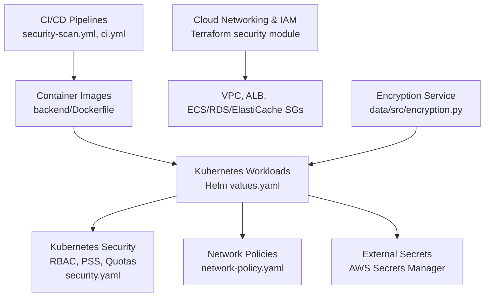
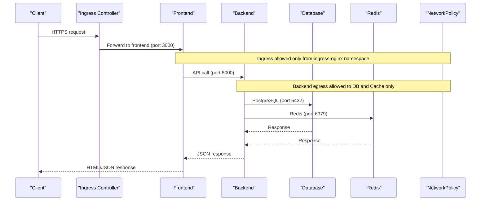
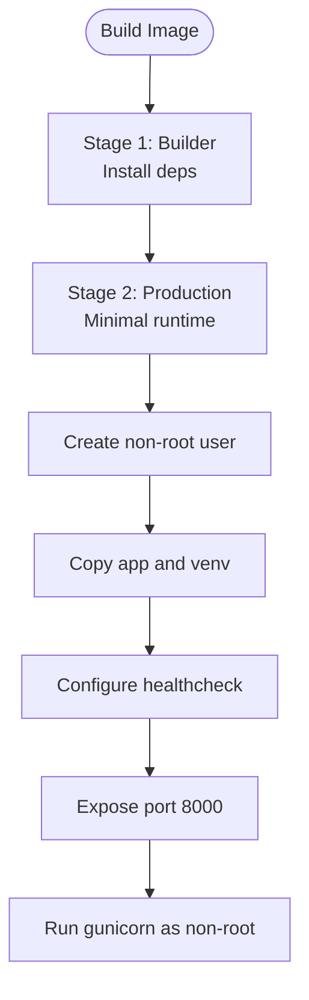
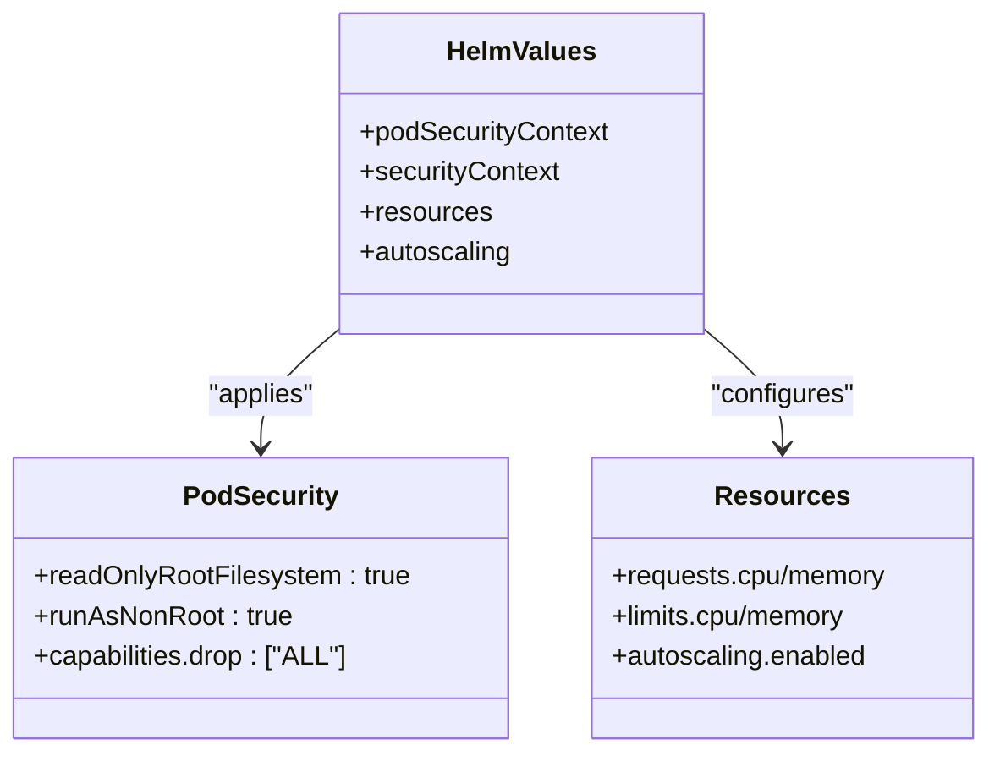
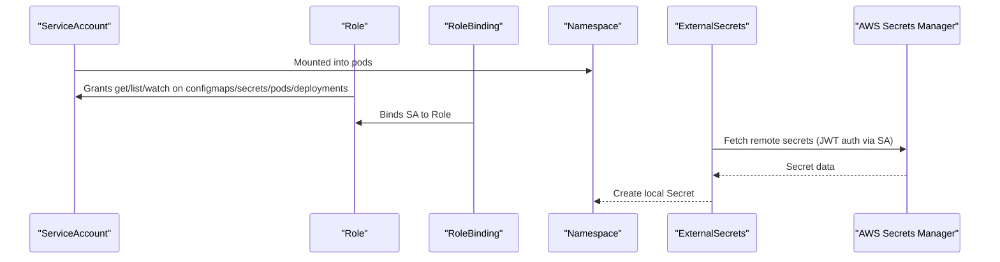
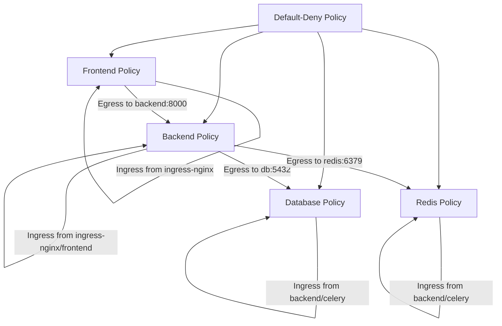
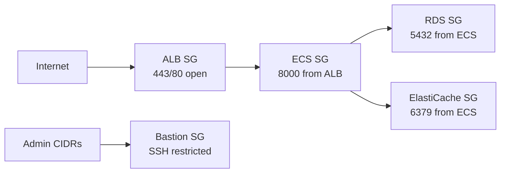
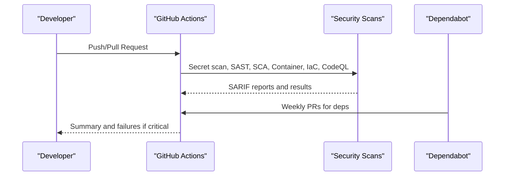
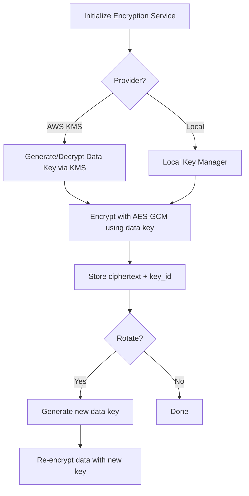
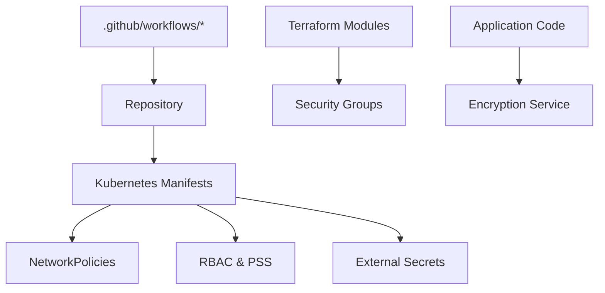

# Infrastructure Security

<cite>
**Referenced Files in This Document**
- [security-model.md](file://docs/architecture/security-model.md)
- [Dockerfile](file://backend/Dockerfile)
- [security.yaml](file://infra/kubernetes/security/security.yaml)
- [network-policy.yaml](file://infra/kubernetes/networking/network-policy.yaml)
- [values.yaml](file://infra/helm/jol-hub/values.yaml)
- [security-scan.yml](file://.github/workflows/security-scan.yml)
- [ci.yml](file://.github/workflows/ci.yml)
- [dependabot.yml](file://.github/dependabot.yml)
- [main.tf (security module)](file://infra/terraform/modules/security/main.tf)
- [encryption.py](file://data/src/encryption.py)
</cite>

## Table of Contents
1. Introduction
2. Project Structure
3. Core Components
4. Architecture Overview
5. Detailed Component Analysis
6. Dependency Analysis
7. Performance Considerations
8. Troubleshooting Guide
9. Conclusion

## Introduction
This document provides comprehensive infrastructure security guidance for the JOL-HUB platform. It covers container image hardening, vulnerability scanning and signing, runtime security controls, Kubernetes hardening (RBAC, Pod Security Standards, network policies with default-deny, and encryption), cloud security guardrails (AWS/Azure), network perimeter defense and micro-segmentation, CI/CD pipeline security, and monitoring, threat detection, and incident response procedures for infrastructure components.

## Project Structure
Security-relevant configuration spans multiple layers:
- Container images and runtime settings are defined in Dockerfiles and Helm values.
- Kubernetes RBAC, Pod Security Standards, external secrets, and resource quotas are declared in manifests.
- Network segmentation is enforced via Kubernetes NetworkPolicies.
- Cloud networking and access boundaries are provisioned by Terraform modules.
- CI/CD pipelines enforce code and dependency hygiene and run security scans.
- Encryption services centralize key management and rotation.

**Diagram sources**
- [security-scan.yml:1-379](file://.github/workflows/security-scan.yml#L1-L379)
- [ci.yml:1-379](file://.github/workflows/ci.yml#L1-L379)
- [Dockerfile:1-72](file://backend/Dockerfile#L1-L72)
- [values.yaml:1-264](file://infra/helm/jol-hub/values.yaml#L1-L264)
- [security.yaml:1-187](file://infra/kubernetes/security/security.yaml#L1-L187)
- [network-policy.yaml:1-188](file://infra/kubernetes/networking/network-policy.yaml#L1-L188)
- [main.tf (security module):1-202](file://infra/terraform/modules/security/main.tf#L1-L202)
- [encryption.py:1-574](file://data/src/encryption.py#L1-L574)

**Section sources**
- [security-model.md:1-623](file://docs/architecture/security-model.md#L1-L623)

## Core Components
- Container image hardening: minimal base images, non-root user, health checks, and explicit command entrypoints.
- Runtime security: read-only filesystem, dropped capabilities, and non-root execution via Helm values.
- Kubernetes hardening: namespace-scoped RBAC, restricted Pod Security Standards, resource quotas, limit ranges, and external secret integration.
- Network segmentation: default-deny policy per namespace and component-specific allow rules for ingress/egress.
- Cloud security: least-privilege security groups, bastion access control, and VPC isolation.
- CI/CD security: SAST, SCA, secret scanning, IaC scanning, CodeQL, and automated dependency updates.
- Data protection: envelope encryption with AWS KMS or local provider, automatic key rotation, and versioned keys.

**Section sources**
- [Dockerfile:1-72](file://backend/Dockerfile#L1-L72)
- [values.yaml:207-222](file://infra/helm/jol-hub/values.yaml#L207-L222)
- [security.yaml:13-62](file://infra/kubernetes/security/security.yaml#L13-L62)
- [security.yaml:140-187](file://infra/kubernetes/security/security.yaml#L140-L187)
- [network-policy.yaml:1-188](file://infra/kubernetes/networking/network-policy.yaml#L1-L188)
- [main.tf (security module):15-202](file://infra/terraform/modules/security/main.tf#L15-L202)
- [security-scan.yml:31-379](file://.github/workflows/security-scan.yml#L31-L379)
- [ci.yml:31-379](file://.github/workflows/ci.yml#L31-L379)
- [encryption.py:143-241](file://data/src/encryption.py#L143-L241)
- [encryption.py:346-574](file://data/src/encryption.py#L346-L574)

## Architecture Overview
The platform enforces defense-in-depth across layers:
- Edge protection and CDN/WAF at the perimeter.
- Ingress to frontend/backend with TLS termination and strict network policies.
- Micro-segmentation between backend, database, and cache using Kubernetes NetworkPolicies.
- Least-privilege IAM roles and security groups for cloud resources.
- Centralized secrets via External Secrets Operator from AWS Secrets Manager.
- Continuous security scanning in CI/CD and automated dependency updates.
- Encryption at rest with envelope encryption and key rotation.

**Diagram sources**
- [network-policy.yaml:18-76](file://infra/kubernetes/networking/network-policy.yaml#L18-L76)
- [network-policy.yaml:77-114](file://infra/kubernetes/networking/network-policy.yaml#L77-L114)
- [network-policy.yaml:115-151](file://infra/kubernetes/networking/network-policy.yaml#L115-L151)
- [network-policy.yaml:152-188](file://infra/kubernetes/networking/network-policy.yaml#L152-L188)

**Section sources**
- [security-model.md:30-73](file://docs/architecture/security-model.md#L30-L73)
- [security-model.md:275-319](file://docs/architecture/security-model.md#L275-L319)

## Detailed Component Analysis

### Container Image Security
- Minimal base image selection reduces attack surface.
- Non-root user execution prevents privilege escalation.
- Health check endpoint ensures readiness and liveness.
- Multi-stage build separates build-time dependencies from runtime.

**Diagram sources**
- [Dockerfile:7-26](file://backend/Dockerfile#L7-L26)
- [Dockerfile:27-72](file://backend/Dockerfile#L27-L72)

**Section sources**
- [Dockerfile:1-72](file://backend/Dockerfile#L1-L72)

### Runtime Security Controls
- Read-only root filesystem prevents writes to the container image layer.
- Dropping all capabilities minimizes kernel privileges.
- Running as non-root user aligns with least privilege.
- Resource requests/limits and autoscaling ensure stability under load.

**Diagram sources**
- [values.yaml:207-222](file://infra/helm/jol-hub/values.yaml#L207-L222)
- [values.yaml:29-47](file://infra/helm/jol-hub/values.yaml#L29-L47)
- [values.yaml:66-83](file://infra/helm/jol-hub/values.yaml#L66-L83)

**Section sources**
- [values.yaml:207-222](file://infra/helm/jol-hub/values.yaml#L207-L222)
- [values.yaml:29-47](file://infra/helm/jol-hub/values.yaml#L29-L47)
- [values.yaml:66-83](file://infra/helm/jol-hub/values.yaml#L66-L83)

### Kubernetes Hardening: RBAC, Pod Security Standards, Quotas, External Secrets
- Namespace-scoped Role and RoleBinding restrict API access to required verbs and resources.
- Pod Security Standards set to restricted profile enforce secure defaults.
- LimitRange and ResourceQuota cap resource consumption and prevent noisy neighbors.
- External Secrets Operator syncs secrets from AWS Secrets Manager into Kubernetes.

**Diagram sources**
- [security.yaml:5-48](file://infra/kubernetes/security/security.yaml#L5-L48)
- [security.yaml:50-62](file://infra/kubernetes/security/security.yaml#L50-L62)
- [security.yaml:63-105](file://infra/kubernetes/security/security.yaml#L63-L105)
- [security.yaml:140-187](file://infra/kubernetes/security/security.yaml#L140-L187)

**Section sources**
- [security.yaml:5-48](file://infra/kubernetes/security/security.yaml#L5-L48)
- [security.yaml:50-62](file://infra/kubernetes/security/security.yaml#L50-L62)
- [security.yaml:63-105](file://infra/kubernetes/security/security.yaml#L63-L105)
- [security.yaml:140-187](file://infra/kubernetes/security/security.yaml#L140-L187)

### Network Security: Default-Deny and Micro-Segmentation
- Default-deny policy applied to the namespace blocks all traffic unless explicitly allowed.
- Frontend allows ingress from ingress-nginx and egress to backend and DNS.
- Backend allows ingress from ingress-nginx/frontend and egress to database, cache, and DNS.
- Database and Redis restrict ingress to backend and Celery components; egress limited to DNS.

**Diagram sources**
- [network-policy.yaml:1-17](file://infra/kubernetes/networking/network-policy.yaml#L1-L17)
- [network-policy.yaml:18-76](file://infra/kubernetes/networking/network-policy.yaml#L18-L76)
- [network-policy.yaml:77-114](file://infra/kubernetes/networking/network-policy.yaml#L77-L114)
- [network-policy.yaml:115-151](file://infra/kubernetes/networking/network-policy.yaml#L115-L151)
- [network-policy.yaml:152-188](file://infra/kubernetes/networking/network-policy.yaml#L152-L188)

**Section sources**
- [network-policy.yaml:1-188](file://infra/kubernetes/networking/network-policy.yaml#L1-L188)

### Cloud Security: AWS Security Groups and Access Boundaries
- ALB accepts HTTPS and HTTP (redirect to HTTPS) from the internet.
- ECS tasks accept inbound traffic only from the ALB.
- RDS and ElastiCache accept inbound traffic only from ECS tasks and optionally within VPC.
- Bastion host SSH restricted to admin CIDRs when enabled.

**Diagram sources**
- [main.tf (security module):15-53](file://infra/terraform/modules/security/main.tf#L15-L53)
- [main.tf (security module):59-88](file://infra/terraform/modules/security/main.tf#L59-L88)
- [main.tf (security module):94-131](file://infra/terraform/modules/security/main.tf#L94-L131)
- [main.tf (security module):137-165](file://infra/terraform/modules/security main.tf#L137-L165)
- [main.tf (security module):171-202](file://infra/terraform/modules/security/main.tf#L171-L202)

**Section sources**
- [main.tf (security module):15-202](file://infra/terraform/modules/security/main.tf#L15-L202)

### CI/CD Pipeline Security: Scans, Signing, and Automated Updates
- Secret detection via Gitleaks and TruffleHog.
- SAST with Bandit and Semgrep for backend and frontend.
- SCA with Safety, pip-audit, pnpm audit, and Snyk.
- Container filesystem scanning with Trivy.
- IaC scanning with Checkov and Terrascan.
- CodeQL analysis for Python and TypeScript.
- Dependabot automates dependency updates across ecosystems.

**Diagram sources**
- [security-scan.yml:31-379](file://.github/workflows/security-scan.yml#L31-L379)
- [ci.yml:31-379](file://.github/workflows/ci.yml#L31-L379)
- [dependabot.yml:1-165](file://.github/dependabot.yml#L1-L165)

**Section sources**
- [security-scan.yml:31-379](file://.github/workflows/security-scan.yml#L31-L379)
- [ci.yml:31-379](file://.github/workflows/ci.yml#L31-L379)
- [dependabot.yml:1-165](file://.github/dependabot.yml#L1-L165)

### Data Protection: Envelope Encryption and Key Rotation
- Pluggable key providers support AWS KMS and local development.
- Envelope encryption uses a data key encrypted by KMS; plaintext key discarded after use.
- Automatic key rotation maintains backward compatibility with versioned keys.
- Global service instance manages lifecycle and re-encryption workflows.

**Diagram sources**
- [encryption.py:143-241](file://data/src/encryption.py#L143-L241)
- [encryption.py:346-574](file://data/src/encryption.py#L346-L574)

**Section sources**
- [encryption.py:143-241](file://data/src/encryption.py#L143-L241)
- [encryption.py:346-574](file://data/src/encryption.py#L346-L574)

## Dependency Analysis
- CI/CD depends on GitHub Actions and third-party scanners; outputs feed into repository security tabs.
- Kubernetes workloads depend on RBAC, NetworkPolicies, and External Secrets for secure operation.
- Cloud networking depends on Terraform modules that define least-privilege security groups.
- Application code depends on encryption service for secure data handling.

**Diagram sources**
- [security-scan.yml:1-379](file://.github/workflows/security-scan.yml#L1-L379)
- [ci.yml:1-379](file://.github/workflows/ci.yml#L1-L379)
- [security.yaml:1-187](file://infra/kubernetes/security/security.yaml#L1-L187)
- [network-policy.yaml:1-188](file://infra/kubernetes/networking/network-policy.yaml#L1-L188)
- [main.tf (security module):1-202](file://infra/terraform/modules/security/main.tf#L1-L202)
- [encryption.py:1-574](file://data/src/encryption.py#L1-L574)

**Section sources**
- [security-scan.yml:1-379](file://.github/workflows/security-scan.yml#L1-L379)
- [ci.yml:1-379](file://.github/workflows/ci.yml#L1-L379)
- [security.yaml:1-187](file://infra/kubernetes/security/security.yaml#L1-L187)
- [network-policy.yaml:1-188](file://infra/kubernetes/networking/network-policy.yaml#L1-L188)
- [main.tf (security module):1-202](file://infra/terraform/modules/security/main.tf#L1-L202)
- [encryption.py:1-574](file://data/src/encryption.py#L1-L574)

## Performance Considerations
- Use resource requests/limits and autoscaling to maintain performance under load while preventing resource contention.
- Apply default-deny network policies to reduce unnecessary traffic and improve observability.
- Keep container images minimal to reduce startup time and attack surface.
- Prefer read-only filesystems and dropped capabilities to minimize overhead and risk.
- Use efficient caching (Redis) and database connections scoped to application needs.

[No sources needed since this section provides general guidance]

## Troubleshooting Guide
- If backend cannot reach database or cache, verify NetworkPolicy selectors and ports match component labels.
- If secrets fail to sync, confirm ExternalSecrets operator permissions and JWT service account binding.
- If pods are blocked by Pod Security Standards, ensure they do not request privileged capabilities or run as root.
- If CI fails due to vulnerabilities, review SARIF reports and remediate critical/high findings before merging.
- If encryption operations fail, validate provider configuration and KMS key availability.

**Section sources**
- [network-policy.yaml:18-76](file://infra/kubernetes/networking/network-policy.yaml#L18-L76)
- [security.yaml:63-105](file://infra/kubernetes/security/security.yaml#L63-L105)
- [security.yaml:50-62](file://infra/kubernetes/security/security.yaml#L50-L62)
- [security-scan.yml:31-379](file://.github/workflows/security-scan.yml#L31-L379)
- [encryption.py:346-574](file://data/src/encryption.py#L346-L574)

## Conclusion
JOL-HUB implements a layered security model combining hardened containers, strict Kubernetes policies, least-privilege cloud configurations, continuous scanning, and robust encryption. These controls collectively protect the platform against common threats, ensure compliance, and enable safe, scalable operations.

[No sources needed since this section summarizes without analyzing specific files]