# Security Architecture

<cite>
**Referenced Files in This Document**
- [security-model.md](file://docs/architecture/security-model.md)
- [vault.py](file://backend/django/apps/core/vault.py)
- [secrets.py](file://backend/django/apps/core/secrets.py)
- [permissions.py](file://backend/django/apps/core/permissions.py)
- [network-policy.yaml](file://infra/kubernetes/networking/network-policy.yaml)
- [security.yaml](file://infra/kubernetes/security/security.yaml)
- [anonymizer.py](file://data/src/gdpr/anonymizer.py)
- [encryption.py](file://data/src/encryption.py)
- [security.py](file://backend/django/apps/crm/security.py)
- [models.py](file://backend/django/apps/core/models.py)
- [GDPR-checklist.md](file://docs/compliance/GDPR-checklist.md)
- [main.tf](file://infra/terraform/modules/security/main.tf)
- [tokenStore.ts](file://frontend/react/src/lib/tokenStore.ts)
- [middleware.ts (React)](file://frontend/react/src/middleware.ts)
- [options.ts](file://frontend/packages/auth/src/oidc/options.ts)
- [route.ts (NextAuth)](file://frontend/apps/template-renderer/src/app/api/auth/[...nextauth]/route.ts)
- [apiClient.ts](file://frontend/react/src/lib/apiClient.ts)
- [auth_urls.py](file://backend/django/apps/users/auth_urls.py)
- [throttling.py](file://backend/django/apps/core/throttling.py)
- [security-scan.yml](file://.github/workflows/security-scan.yml)
</cite>

## Table of Contents
1. Introduction
2. Project Structure
3. Core Components
4. Architecture Overview
5. Detailed Component Analysis
6. Dependency Analysis
7. Performance Considerations
8. Troubleshooting Guide
9. Conclusion
10. Appendices

## Introduction
This document describes the security architecture of JOL-HUB, focusing on zero-trust networking, end-to-end encryption with TLS 1.3, OAuth 2.1 authentication flows, role-based access control (RBAC), multi-tenant isolation at the database layer, API gateway security patterns, input validation strategies, audit logging, data encryption at rest and in transit, secure secret management with Vault integration, vulnerability scanning in CI/CD, security monitoring and incident response, infrastructure security with Kubernetes network policies and container hardening, cloud security configurations, and GDPR compliance across EU jurisdictions.

## Project Structure
JOL-HUB implements a layered security model spanning edge protection, application controls, data protections, identity and access management, and continuous monitoring. The repository contains:
- Documentation defining the security model and GDPR checklist
- Backend Django apps implementing permissions, throttling, secrets management, and audit logging
- Data processing modules for encryption and anonymization
- Kubernetes manifests for network policies, RBAC, and external secrets
- Terraform modules for AWS security groups
- Frontend auth middleware and token handling aligned with OAuth 2.1
- GitHub Actions workflow for comprehensive security scanning

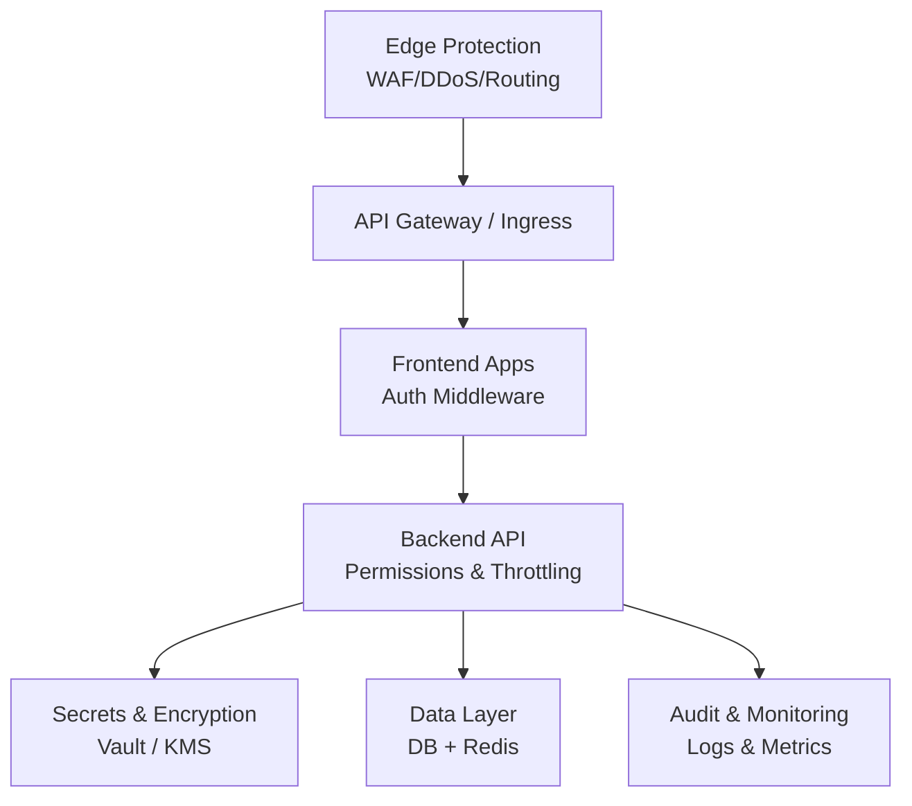

**Diagram sources**
- [security-model.md:19-65](file://docs/architecture/security-model.md#L19-L65)
- [security.yaml:63-105](file://infra/kubernetes/security/security.yaml#L63-L105)
- [network-policy.yaml:18-76](file://infra/kubernetes/networking/network-policy.yaml#L18-L76)

**Section sources**
- [security-model.md:1-65](file://docs/architecture/security-model.md#L1-L65)
- [security.yaml:1-105](file://infra/kubernetes/security/security.yaml#L1-L105)
- [network-policy.yaml:1-76](file://infra/kubernetes/networking/network-policy.yaml#L1-L76)

## Core Components
- Zero-trust network model with default-deny policies, micro-segmentation, and service mesh considerations
- End-to-end encryption using TLS 1.3 for transit and AES-256 or envelope encryption for data at rest
- OAuth 2.1 authentication flow with PKCE, short-lived access tokens, refresh token rotation, and server-side session cookies
- RBAC and tenant isolation enforced via permission classes and middleware
- Multi-tenant isolation at the database level with row-level security and cross-tenant checks
- API gateway security patterns including rate limiting, request validation, and CSRF/XSS protections
- Audit logging with tamper-evident checksums and organization-scoped entries
- Secure secret management via HashiCorp Vault and AWS Secrets Manager with fallbacks
- CI/CD security scanning pipeline covering SAST, SCA, container images, IaC, and code analysis
- Infrastructure security through Kubernetes NetworkPolicies, Pod Security Standards, and AWS security groups
- GDPR compliance mechanisms including consent management, data subject rights, anonymization, and retention controls

**Section sources**
- [security-model.md:19-167](file://docs/architecture/security-model.md#L19-L167)
- [permissions.py:26-138](file://backend/django/apps/core/permissions.py#L26-L138)
- [models.py:67-200](file://backend/django/apps/core/models.py#L67-L200)
- [vault.py:59-126](file://backend/django/apps/core/vault.py#L59-L126)
- [secrets.py:100-200](file://backend/django/apps/core/secrets.py#L100-L200)
- [security-scan.yml:31-379](file://.github/workflows/security-scan.yml#L31-L379)
- [network-policy.yaml:18-188](file://infra/kubernetes/networking/network-policy.yaml#L18-L188)
- [main.tf:15-202](file://infra/terraform/modules/security/main.tf#L15-L202)
- [anonymizer.py:25-83](file://data/src/gdpr/anonymizer.py#L25-L83)
- [encryption.py:104-244](file://data/src/encryption.py#L104-L244)

## Architecture Overview
The platform enforces zero trust by requiring explicit authorization for every request, segmenting traffic via Kubernetes NetworkPolicies, and isolating tenants at both application and data layers. Authentication is handled via OAuth 2.1 with PKCE; frontend middleware gates protected routes and manages tokens securely. The backend applies RBAC and tenant context checks before processing requests. All secrets are retrieved from centralized vaults or managed services, never stored in code. Data is encrypted in transit (TLS 1.3) and at rest (AES-256 or envelope encryption). Audit logs capture actions with tamper-evident checksums and organization scoping. CI/CD pipelines run comprehensive security scans to detect vulnerabilities early.

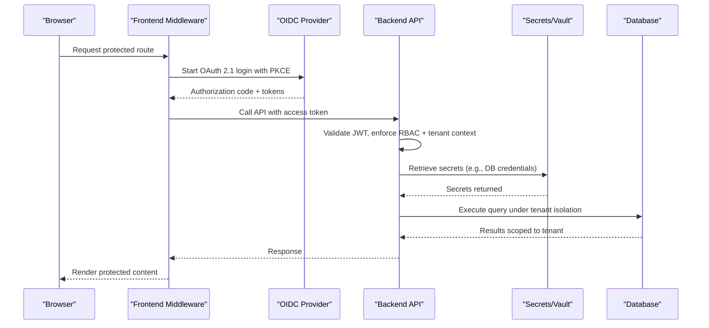

**Diagram sources**
- [options.ts:73-177](file://frontend/packages/auth/src/oidc/options.ts#L73-L177)
- [route.ts:1-30](file://frontend/apps/template-renderer/src/app/api/auth/[...nextauth]/route.ts#L1-L30)
- [middleware.ts (React):1-41](file://frontend/react/src/middleware.ts#L1-L41)
- [permissions.py:45-138](file://backend/django/apps/core/permissions.py#L45-L138)
- [vault.py:293-355](file://backend/django/apps/core/vault.py#L293-L355)
- [models.py:156-200](file://backend/django/apps/core/models.py#L156-L200)

## Detailed Component Analysis

### Zero-Trust Network Model
- Default-deny ingress/egress policies per component ensure only explicitly allowed communication paths exist
- Namespace isolation and pod selectors restrict inter-service traffic
- DNS egress is permitted for resolution while other outbound traffic is blocked unless explicitly allowed
- Cloud security groups further constrain ALB, ECS tasks, RDS, and ElastiCache access

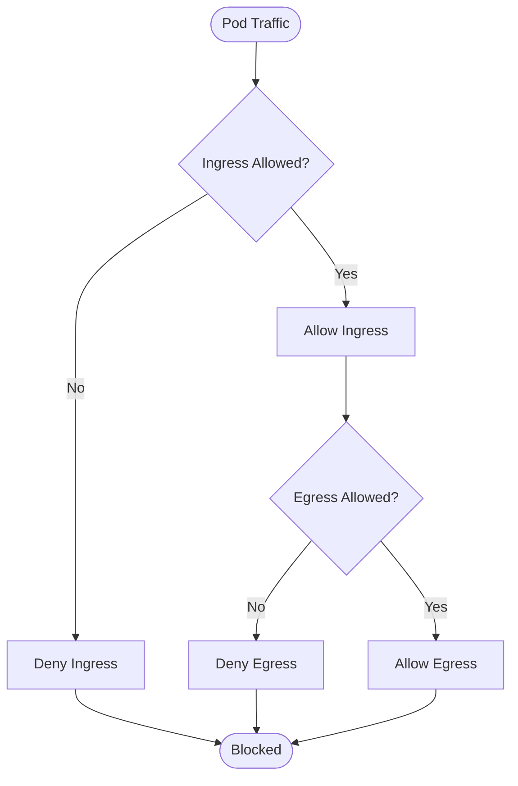

**Diagram sources**
- [network-policy.yaml:18-76](file://infra/kubernetes/networking/network-policy.yaml#L18-L76)
- [network-policy.yaml:77-114](file://infra/kubernetes/networking/network-policy.yaml#L77-L114)
- [network-policy.yaml:115-188](file://infra/kubernetes/networking/network-policy.yaml#L115-L188)

**Section sources**
- [network-policy.yaml:1-188](file://infra/kubernetes/networking/network-policy.yaml#L1-L188)
- [main.tf:15-202](file://infra/terraform/modules/security/main.tf#L15-L202)

### End-to-End Encryption (TLS 1.3 and Data at Rest)
- TLS 1.3 enforced for all external communications; HSTS enabled; certificate management via cert-manager
- Data at rest uses AES-256 or envelope encryption with key rotation and versioning
- Key providers include AWS KMS and local development mode with strict controls
- PII field-level encryption implemented for sensitive CRM fields

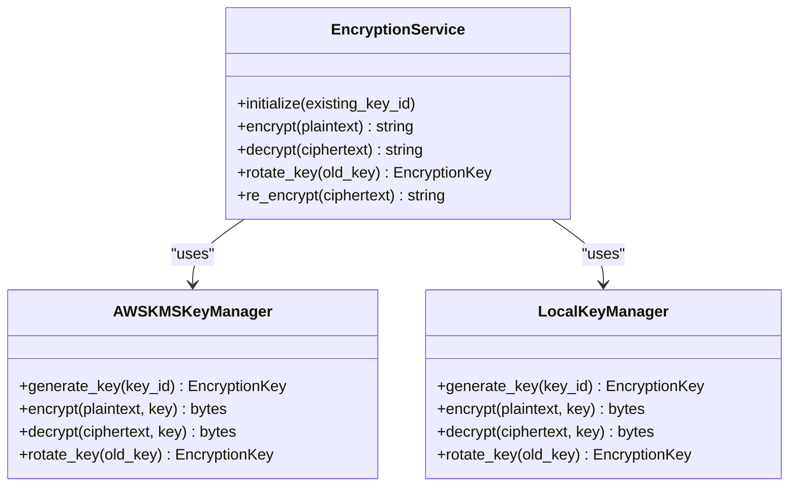

**Diagram sources**
- [encryption.py:104-244](file://data/src/encryption.py#L104-L244)
- [encryption.py:346-522](file://data/src/encryption.py#L346-L522)
- [security.yaml:106-138](file://infra/kubernetes/security/security.yaml#L106-L138)

**Section sources**
- [encryption.py:1-575](file://data/src/encryption.py#L1-L575)
- [security-model.md:144-167](file://docs/architecture/security-model.md#L144-L167)
- [security.yaml:106-138](file://infra/kubernetes/security/security.yaml#L106-L138)

### OAuth 2.1 Authentication Flow
- Frontend uses NextAuth with OIDC provider, enforcing PKCE and state checks
- Access tokens are short-lived and stored in memory; refresh tokens are rotated server-side
- Middleware gates protected routes and ensures sessions exist before rendering
- Backend exposes auth endpoints for registration, login, logout, and token refresh

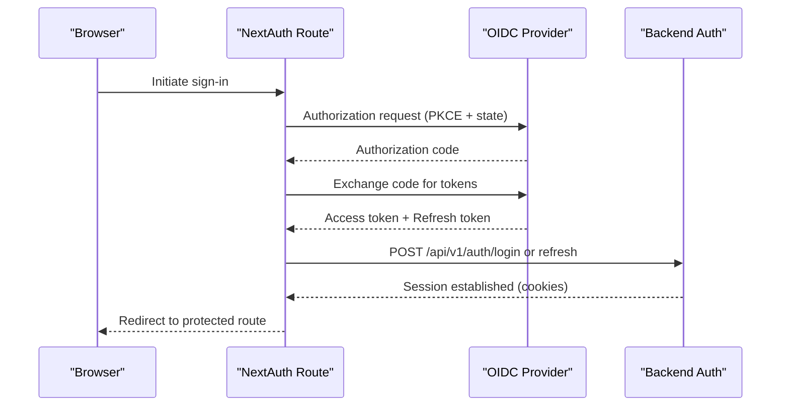

**Diagram sources**
- [options.ts:73-177](file://frontend/packages/auth/src/oidc/options.ts#L73-L177)
- [route.ts:1-30](file://frontend/apps/template-renderer/src/app/api/auth/[...nextauth]/route.ts#L1-L30)
- [auth_urls.py:1-22](file://backend/django/apps/users/auth_urls.py#L1-L22)

**Section sources**
- [options.ts:69-188](file://frontend/packages/auth/src/oidc/options.ts#L69-L188)
- [route.ts:1-30](file://frontend/apps/template-renderer/src/app/api/auth/[...nextauth]/route.ts#L1-L30)
- [middleware.ts (React):1-41](file://frontend/react/src/middleware.ts#L1-L41)
- [auth_urls.py:1-22](file://backend/django/apps/users/auth_urls.py#L1-L22)

### Role-Based Access Control (RBAC) and Tenant Isolation
- Permission classes enforce organization membership, admin roles, and special category data access
- Cross-tenant access prevention decorators validate resource ownership against current tenant context
- Audit log model validates tenant context on save to prevent cross-tenant writes and includes tamper-evident checksums

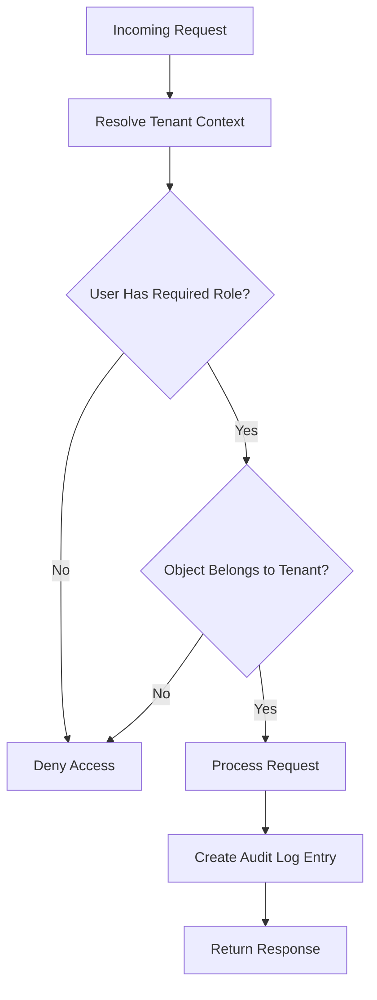

**Diagram sources**
- [permissions.py:26-138](file://backend/django/apps/core/permissions.py#L26-L138)
- [security.py:494-524](file://backend/django/apps/crm/security.py#L494-L524)
- [models.py:156-200](file://backend/django/apps/core/models.py#L156-L200)

**Section sources**
- [permissions.py:26-331](file://backend/django/apps/core/permissions.py#L26-L331)
- [security.py:494-524](file://backend/django/apps/crm/security.py#L494-L524)
- [models.py:67-200](file://backend/django/apps/core/models.py#L67-L200)

### Multi-Tenant Database Isolation and Row-Level Security
- Application-layer enforcement via permission classes and tenant context validation
- Audit logs enforce organization scoping and prevent cross-tenant entries
- Row-level security is referenced in the security model for multi-tenant data isolation at the database layer

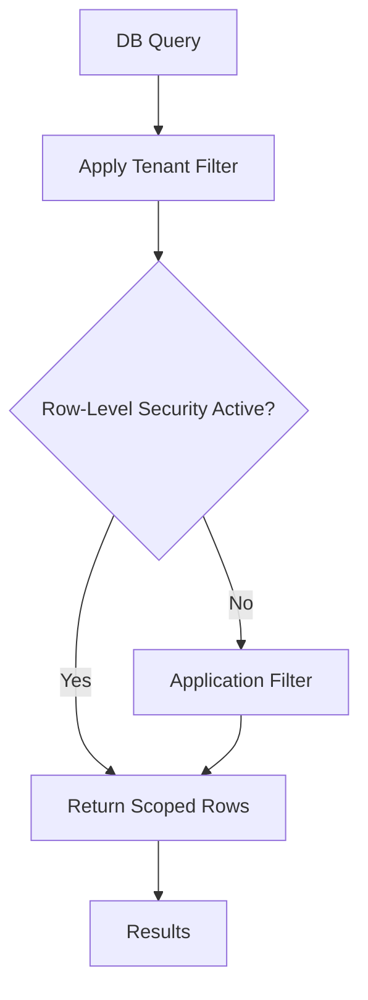

**Diagram sources**
- [security-model.md:204-222](file://docs/architecture/security-model.md#L204-L222)
- [permissions.py:45-138](file://backend/django/apps/core/permissions.py#L45-L138)
- [models.py:156-200](file://backend/django/apps/core/models.py#L156-L200)

**Section sources**
- [security-model.md:204-222](file://docs/architecture/security-model.md#L204-L222)
- [permissions.py:45-138](file://backend/django/apps/core/permissions.py#L45-L138)
- [models.py:156-200](file://backend/django/apps/core/models.py#L156-L200)

### API Gateway Security Patterns and Input Validation
- Rate limiting applied to authentication, GDPR export/delete, donations, and financial operations
- Input validation and sanitization protect against SQL injection and XSS
- Security headers and CSRF protections are part of the broader security model

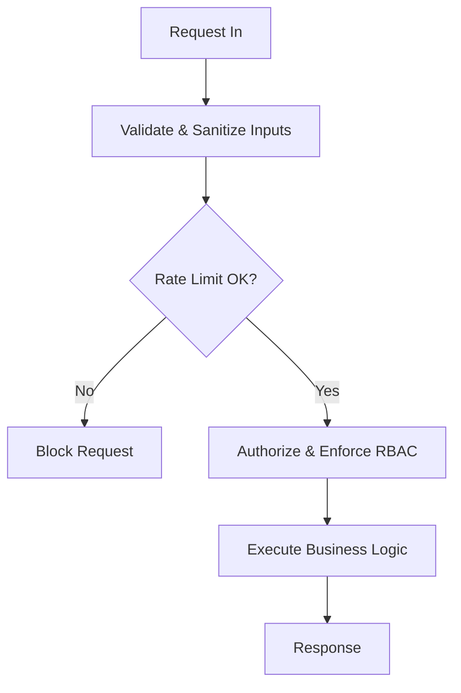

**Diagram sources**
- [throttling.py:15-77](file://backend/django/apps/core/throttling.py#L15-L77)
- [security.py:148-312](file://backend/django/apps/crm/security.py#L148-L312)
- [security-model.md:97-143](file://docs/architecture/security-model.md#L97-L143)

**Section sources**
- [throttling.py:1-77](file://backend/django/apps/core/throttling.py#L1-L77)
- [security.py:148-312](file://backend/django/apps/crm/security.py#L148-L312)
- [security-model.md:97-143](file://docs/architecture/security-model.md#L97-L143)

### Audit Logging and Tamper-Evident Records
- Immutable audit trail captures user actions, entity changes, and GDPR-related events
- Organization scoping prevents cross-tenant audit entries
- Checksums provide tamper evidence for integrity verification

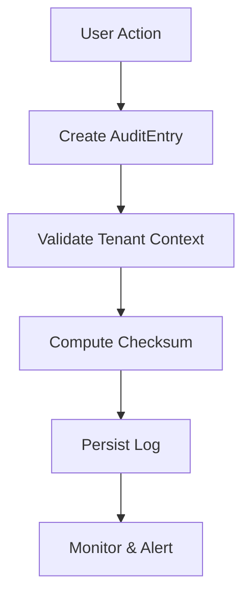

**Diagram sources**
- [models.py:67-200](file://backend/django/apps/core/models.py#L67-L200)

**Section sources**
- [models.py:67-200](file://backend/django/apps/core/models.py#L67-L200)

### Secure Secret Management with Vault Integration
- Vault client supports IAM, Kubernetes, AppRole, and token authentication methods
- Secrets are cached with TTL and fall back to environment variables when needed
- AWS Secrets Manager provides additional secret retrieval with caching and fallbacks

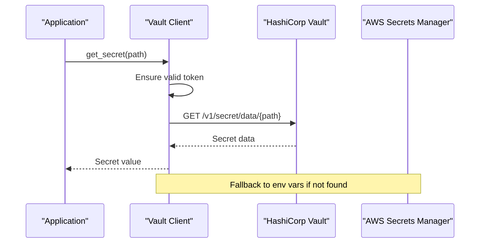

**Diagram sources**
- [vault.py:59-126](file://backend/django/apps/core/vault.py#L59-L126)
- [vault.py:293-355](file://backend/django/apps/core/vault.py#L293-L355)
- [secrets.py:100-200](file://backend/django/apps/core/secrets.py#L100-L200)

**Section sources**
- [vault.py:1-459](file://backend/django/apps/core/vault.py#L1-L459)
- [secrets.py:1-418](file://backend/django/apps/core/secrets.py#L1-L418)

### Vulnerability Scanning in CI/CD Pipelines
- Secret detection via Gitleaks and TruffleHog
- SAST with Bandit and Semgrep for Python and TypeScript/React
- SCA with Safety, pip-audit, pnpm audit, and Snyk
- Container scanning with Trivy
- IaC scanning with Checkov and Terrascan
- CodeQL analysis for Python and JavaScript/TypeScript

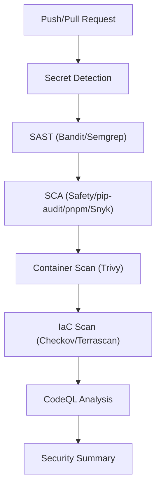

**Diagram sources**
- [security-scan.yml:31-379](file://.github/workflows/security-scan.yml#L31-L379)

**Section sources**
- [security-scan.yml:1-379](file://.github/workflows/security-scan.yml#L1-L379)

### Infrastructure Security: Kubernetes and Cloud
- Kubernetes NetworkPolicies enforce default-deny and explicit allow rules for ingress/egress
- Pod Security Standards set to restricted profile
- External Secrets Operator integrates with AWS Secrets Manager
- AWS security groups restrict ALB, ECS, RDS, and ElastiCache access

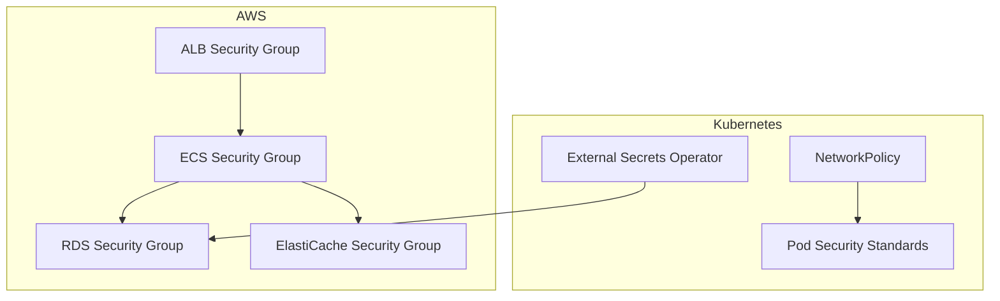

**Diagram sources**
- [network-policy.yaml:18-188](file://infra/kubernetes/networking/network-policy.yaml#L18-L188)
- [security.yaml:50-105](file://infra/kubernetes/security/security.yaml#L50-L105)
- [main.tf:15-202](file://infra/terraform/modules/security/main.tf#L15-L202)

**Section sources**
- [network-policy.yaml:1-188](file://infra/kubernetes/networking/network-policy.yaml#L1-L188)
- [security.yaml:1-187](file://infra/kubernetes/security/security.yaml#L1-L187)
- [main.tf:1-202](file://infra/terraform/modules/security/main.tf#L1-L202)

### GDPR Compliance, Data Protection, and Privacy Controls
- Consent management, data subject rights workflows, and retention controls documented
- Anonymization module implements k-anonymity with country-specific thresholds
- Encryption at rest and in transit supported; key rotation and lifecycle management included
- Breach notification and DPIA processes outlined

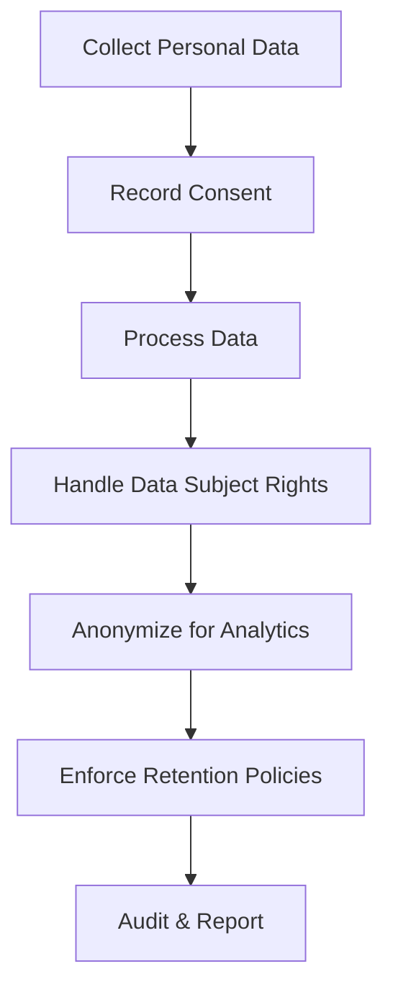

**Diagram sources**
- [GDPR-checklist.md:14-235](file://docs/compliance/GDPR-checklist.md#L14-L235)
- [anonymizer.py:25-83](file://data/src/gdpr/anonymizer.py#L25-L83)
- [encryption.py:346-522](file://data/src/encryption.py#L346-L522)

**Section sources**
- [GDPR-checklist.md:1-800](file://docs/compliance/GDPR-checklist.md#L1-L800)
- [anonymizer.py:1-180](file://data/src/gdpr/anonymizer.py#L1-L180)
- [encryption.py:1-575](file://data/src/encryption.py#L1-L575)

## Dependency Analysis
- Frontend auth middleware depends on OIDC options and NextAuth route handlers to establish sessions and gate protected routes
- Backend permissions depend on organization models and tenant context middleware to enforce RBAC and isolation
- Secrets retrieval depends on Vault client and AWS Secrets Manager with environment fallbacks
- Kubernetes network policies depend on component labels to scope ingress/egress rules
- CI/CD security scans depend on toolchains configured in the workflow

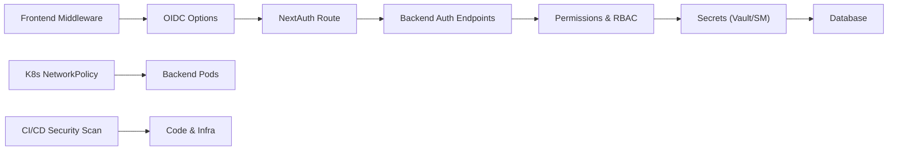

**Diagram sources**
- [middleware.ts (React):1-41](file://frontend/react/src/middleware.ts#L1-L41)
- [options.ts:73-177](file://frontend/packages/auth/src/oidc/options.ts#L73-L177)
- [route.ts:1-30](file://frontend/apps/template-renderer/src/app/api/auth/[...nextauth]/route.ts#L1-L30)
- [permissions.py:26-138](file://backend/django/apps/core/permissions.py#L26-L138)
- [vault.py:293-355](file://backend/django/apps/core/vault.py#L293-L355)
- [network-policy.yaml:18-76](file://infra/kubernetes/networking/network-policy.yaml#L18-L76)
- [security-scan.yml:31-379](file://.github/workflows/security-scan.yml#L31-L379)

**Section sources**
- [middleware.ts (React):1-41](file://frontend/react/src/middleware.ts#L1-L41)
- [options.ts:73-177](file://frontend/packages/auth/src/oidc/options.ts#L73-L177)
- [route.ts:1-30](file://frontend/apps/template-renderer/src/app/api/auth/[...nextauth]/route.ts#L1-L30)
- [permissions.py:26-138](file://backend/django/apps/core/permissions.py#L26-L138)
- [vault.py:293-355](file://backend/django/apps/core/vault.py#L293-L355)
- [network-policy.yaml:18-76](file://infra/kubernetes/networking/network-policy.yaml#L18-L76)
- [security-scan.yml:31-379](file://.github/workflows/security-scan.yml#L31-L379)

## Performance Considerations
- Rate limiting protects sensitive endpoints and reduces abuse surface
- Secret caching minimizes latency for credential retrieval
- Token rotation and short-lived access tokens reduce exposure and improve performance by avoiding frequent re-authentication
- Encryption operations use efficient algorithms (AES-GCM) and envelope encryption to balance security and throughput
- Network policies reduce unnecessary traffic and improve isolation without impacting legitimate flows

[No sources needed since this section provides general guidance]

## Troubleshooting Guide
- Authentication failures: Verify OIDC configuration, PKCE settings, and refresh token rotation; check middleware gating and cookie flags
- Permission denied errors: Confirm tenant context resolution, organization membership, and role assignments; inspect cross-tenant access attempts
- Secret retrieval issues: Validate Vault/Kubernetes authentication, environment fallbacks, and cache state; review error logs for missing secrets
- Network policy blocks: Ensure component labels match policy selectors and required ports are allowed; verify DNS egress for resolution
- Audit log integrity: Check checksum generation and tenant context validation; investigate cross-tenant write attempts

**Section sources**
- [options.ts:73-177](file://frontend/packages/auth/src/oidc/options.ts#L73-L177)
- [middleware.ts (React):1-41](file://frontend/react/src/middleware.ts#L1-L41)
- [permissions.py:45-138](file://backend/django/apps/core/permissions.py#L45-L138)
- [vault.py:293-355](file://backend/django/apps/core/vault.py#L293-L355)
- [network-policy.yaml:18-76](file://infra/kubernetes/networking/network-policy.yaml#L18-L76)
- [models.py:156-200](file://backend/django/apps/core/models.py#L156-L200)

## Conclusion
JOL-HUB implements a comprehensive security architecture grounded in zero-trust principles, strong encryption, robust authentication and authorization, and rigorous operational controls. Multi-tenant isolation, audit logging, and GDPR compliance are embedded throughout the system. Continuous security scanning and infrastructure hardening ensure ongoing resilience against threats.

[No sources needed since this section summarizes without analyzing specific files]

## Appendices
- API security contracts and OpenAPI specifications are maintained alongside the backend
- Compliance evidence and audit reports are stored in dedicated documentation directories
- Security metrics and KPIs are tracked to measure effectiveness of controls

[No sources needed since this section provides general guidance]