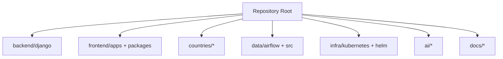
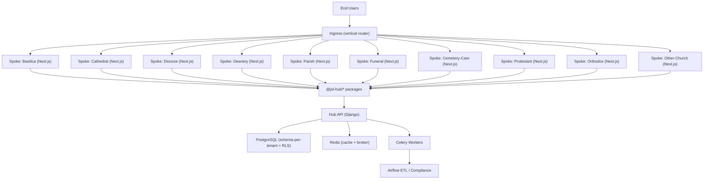
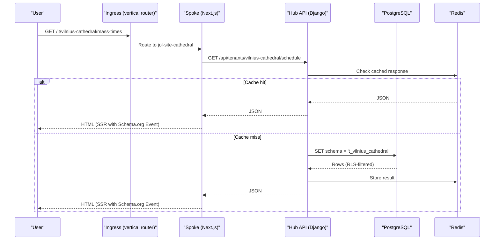
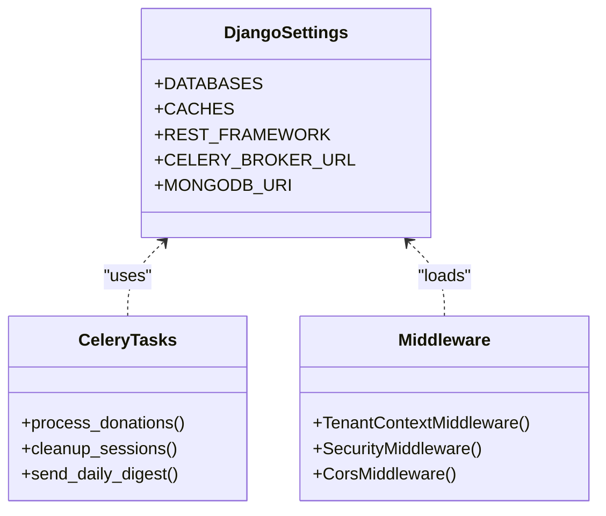
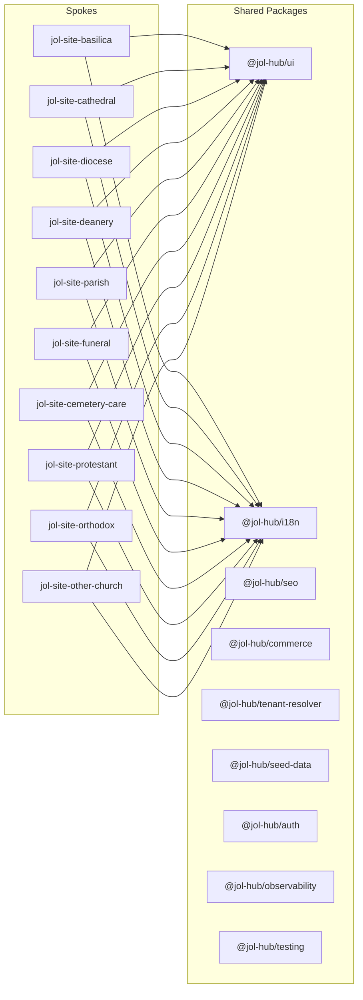
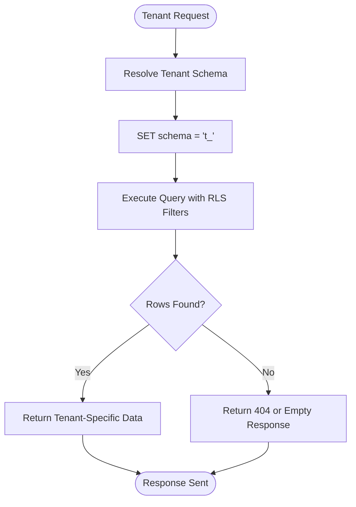
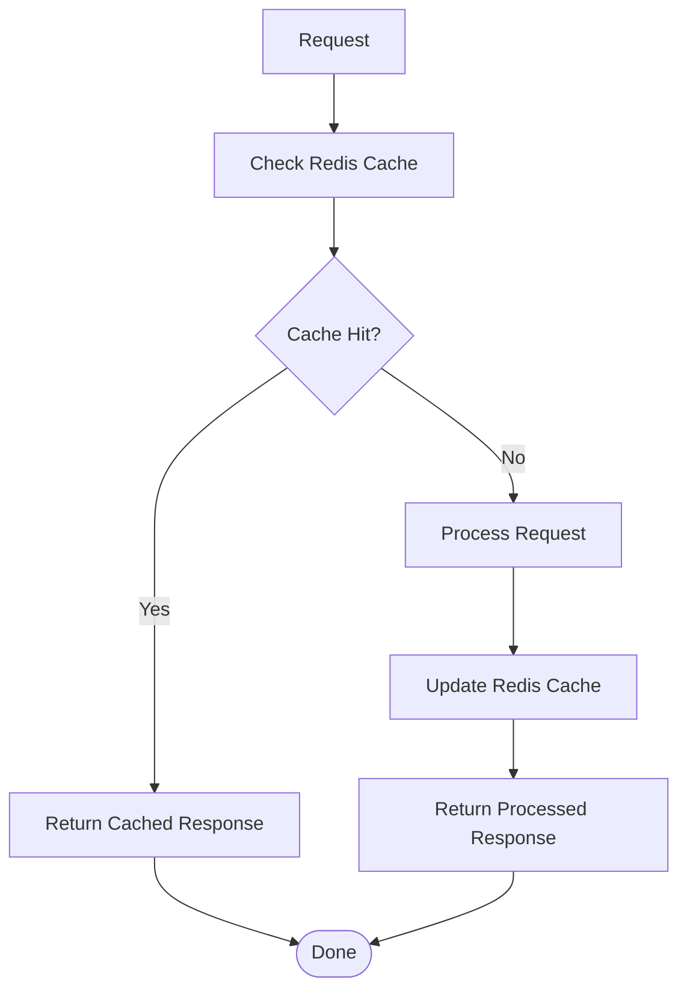
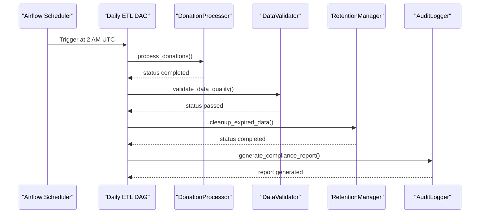
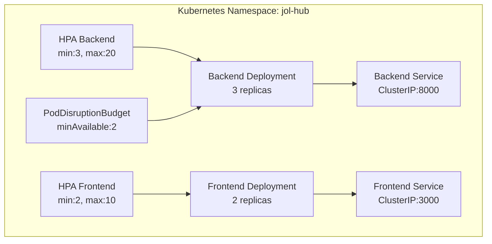
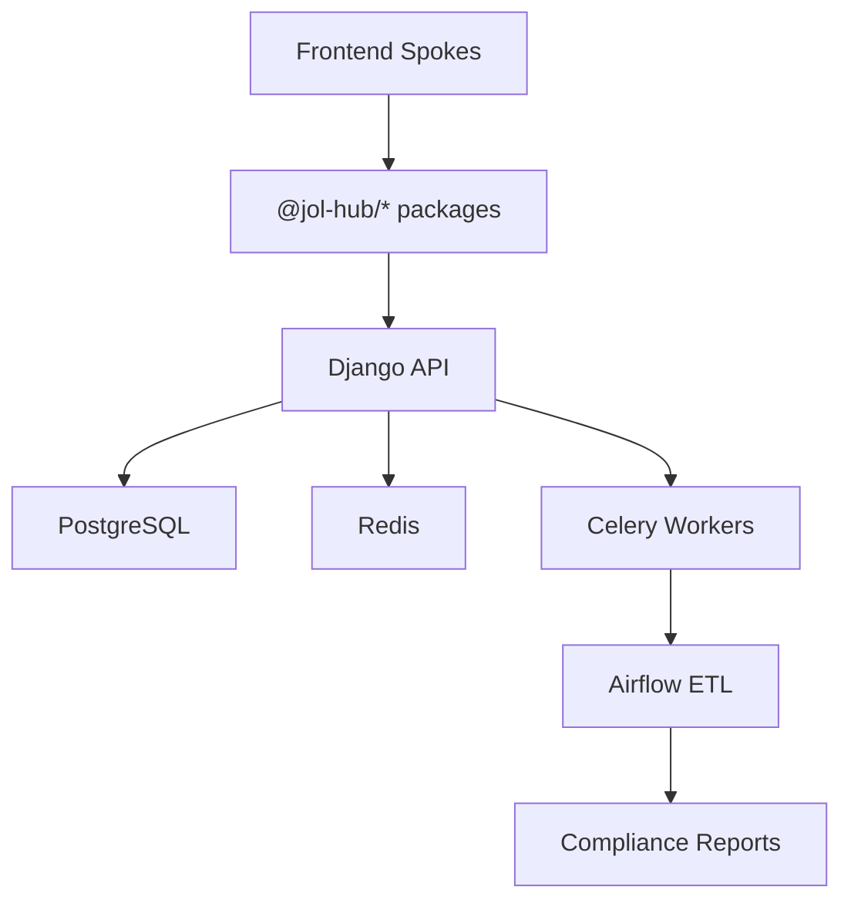

# System Overview

<cite>
**Referenced Files in This Document**
- [README.md](file://README.md)
- [system-overview.md](file://docs/architecture/system-overview.md)
- [frontend-topology-10-verticals.md](file://docs/architecture/frontend-topology-10-verticals.md)
- [ADR-011-ten-vertical-frontends-hub-and-spoke.md](file://docs/decisions/ADR-011-ten-vertical-frontends-hub-and-spoke.md)
- [base.py](file://backend/django/core/settings/base.py)
- [docker-compose.yml](file://docker-compose.yml)
- [jol_hub_etl.py](file://data/airflow/dags/jol_hub_etl.py)
- [config.py](file://data/src/config.py)
- [backend.yaml](file://infra/kubernetes/apps/backend.yaml)
- [frontend.yaml](file://infra/kubernetes/apps/frontend.yaml)
- [values.yaml](file://infra/helm/jol-hub/values.yaml)
- [entity-apps-deploy.yml](file://.github/workflows/entity-apps-deploy.yml)
- [deploy.sh](file://frontend/apps/template-renderer/scripts/deploy.sh)
</cite>

## Table of Contents
1. Introduction
2. Project Structure
3. Core Components
4. Architecture Overview
5. Detailed Component Analysis
6. Dependency Analysis
7. Performance Considerations
8. Troubleshooting Guide
9. Conclusion

## Introduction
JOL-HUB is an enterprise monorepo that powers a white-label, multi-tenant website publishing platform for religious institutions across 27 EU countries and beyond. The system targets approximately 400,000 independent websites and provides shared platform logic, country-specific configurations, infrastructure definitions, data pipelines, and AI orchestration from a single authoritative source.

Key goals:
- Scalability: support hundreds of thousands of tenant sites with efficient resource utilization
- Multi-tenancy: organization-scoped data isolation per tenant with schema-per-tenant and row-level security
- Maintainability: monorepo structure with shared packages and consistent practices
- Compliance: GDPR, SOC 2 Type II, ISO 27001 controls embedded into code and processes
- Performance: high availability and low latency via caching, autoscaling, and optimized data access

The platform uses a hub-and-spoke frontend topology for ten vertical frontends (basilica, cathedral, diocese, deanery, parish, funeral, cemetery-care, protestant, orthodox, other-church), a Django backend API layer, PostgreSQL with schema-per-tenant isolation, Redis for caching and task broker, Airflow for ETL and compliance workflows, and Kubernetes-based deployment on-premises.

**Section sources**
- [README.md:33-49](file://README.md#L33-L49)
- [system-overview.md:26-37](file://docs/architecture/system-overview.md#L26-L37)

## Project Structure
At the root, JOL-HUB organizes the platform into clear layers:
- backend: Django REST APIs, business logic, Celery tasks, and integrations
- frontend: Next.js applications (public sites, admin dashboard, template renderer) and shared packages
- countries: per-country configuration files and examples
- data: Airflow DAGs, dbt models, quality checks, and processing scripts
- infra: Kubernetes manifests, Helm chart values, networking, monitoring, and security
- docs: architecture decisions, design specs, and compliance documentation
- ai: AI orchestration modules for content generation, SEO tagging, lead scoring, and chatbot services

**Diagram sources**
- [README.md:85-155](file://README.md#L85-L155)

**Section sources**
- [README.md:85-155](file://README.md#L85-L155)

## Core Components
- Django backend services: REST APIs, authentication, business logic, Celery workers, and integrations
- Next.js frontend applications: public site spokes, admin dashboard, and template renderer
- PostgreSQL database cluster: schema-per-tenant isolation with row-level security
- Redis caching: session storage, cache layer, and Celery broker
- Apache Airflow: ETL pipelines, GDPR compliance workflows, and reporting
- Kubernetes deployment: rolling updates, autoscaling, health probes, and network policies

Technology stack highlights:
- Backend: Python 3.12+, Django 6.x, DRF, Celery, PostgreSQL 16, Redis 7
- Frontend: Next.js 14 App Router, React 18, TypeScript strict, Tailwind CSS, Turborepo + pnpm
- Infrastructure: Proxmox VE 9.2, Ubuntu Server 24.04 LTS, Kubernetes, GitHub Actions, SOPS/age secrets
- Data: Airflow DAGs, dbt models, quality checkpoints, ROPA records

**Section sources**
- [frontend-topology-10-verticals.md:72-88](file://docs/architecture/frontend-topology-10-verticals.md#L72-L88)
- [base.py:172-186](file://backend/django/core/settings/base.py#L172-L186)
- [base.py:392-410](file://backend/django/core/settings/base.py#L392-L410)
- [base.py:357-386](file://backend/django/core/settings/base.py#L357-L386)
- [docker-compose.yml:15-148](file://docker-compose.yml#L15-L148)

## Architecture Overview
The platform follows a hub-and-spoke pattern for ten vertical frontends, each independently deployable and consuming shared packages from the hub. Requests flow through an ingress (vertical router) to spoke instances, which render pages using shared components and call the hub’s Django API. Data is isolated per tenant using schema-per-tenant and row-level security in PostgreSQL. Background jobs run via Celery and Airflow for ETL and compliance tasks.

**Diagram sources**
- [frontend-topology-10-verticals.md:8-38](file://docs/architecture/frontend-topology-10-verticals.md#L8-L38)
- [frontend-topology-10-verticals.md:89-109](file://docs/architecture/frontend-topology-10-verticals.md#L89-L109)
- [base.py:172-186](file://backend/django/core/settings/base.py#L172-L186)
- [base.py:392-410](file://backend/django/core/settings/base.py#L392-L410)
- [base.py:357-386](file://backend/django/core/settings/base.py#L357-L386)

### High-Level Request Flow

**Diagram sources**
- [frontend-topology-10-verticals.md:89-109](file://docs/architecture/frontend-topology-10-verticals.md#L89-L109)
- [base.py:172-186](file://backend/django/core/settings/base.py#L172-L186)
- [base.py:392-410](file://backend/django/core/settings/base.py#L392-L410)

**Section sources**
- [frontend-topology-10-verticals.md:8-38](file://docs/architecture/frontend-topology-10-verticals.md#L8-L38)
- [frontend-topology-10-verticals.md:89-109](file://docs/architecture/frontend-topology-10-verticals.md#L89-L109)

## Detailed Component Analysis

### Django Backend Services
- REST API with versioning and throttling for sensitive endpoints
- Authentication via JWT and session-based auth
- Tenant context middleware for CRM multi-tenant isolation
- Celery workers and beat scheduler for background tasks and scheduled jobs
- MongoDB secondary store for webhooks and audit logs with TTL retention

**Diagram sources**
- [base.py:172-186](file://backend/django/core/settings/base.py#L172-L186)
- [base.py:357-386](file://backend/django/core/settings/base.py#L357-L386)
- [base.py:392-410](file://backend/django/core/settings/base.py#L392-L410)
- [base.py:689-723](file://backend/django/core/settings/base.py#L689-L723)

**Section sources**
- [base.py:121-145](file://backend/django/core/settings/base.py#L121-L145)
- [base.py:282-327](file://backend/django/core/settings/base.py#L282-L327)
- [base.py:357-386](file://backend/django/core/settings/base.py#L357-L386)
- [base.py:392-410](file://backend/django/core/settings/base.py#L392-L410)
- [base.py:689-723](file://backend/django/core/settings/base.py#L689-L723)

### Next.js Frontend Applications
- Ten vertical spokes, each containing only composition code and vertical-specific settings
- Shared packages for UI, i18n, SEO, commerce, tenant resolution, seed data, auth, observability, testing
- Template renderer serves pilot tenants and acts as integration test-bed
- Deployment via release directories with atomic symlink switch and rollback

**Diagram sources**
- [frontend-topology-10-verticals.md:40-61](file://docs/architecture/frontend-topology-10-verticals.md#L40-L61)
- [frontend-topology-10-verticals.md:115-129](file://docs/architecture/frontend-topology-10-verticals.md#L115-L129)

**Section sources**
- [frontend-topology-10-verticals.md:40-61](file://docs/architecture/frontend-topology-10-verticals.md#L40-L61)
- [frontend-topology-10-verticals.md:115-129](file://docs/architecture/frontend-topology-10-verticals.md#L115-L129)

### PostgreSQL Database Cluster
- Schema-per-tenant isolation with row-level security ensures organization-scoped data separation
- Connection pooling and health checks configured in Django settings
- Backups managed via PBS 4.2 with RPO 24h / RTO 4h

**Diagram sources**
- [frontend-topology-10-verticals.md:89-109](file://docs/architecture/frontend-topology-10-verticals.md#L89-L109)
- [base.py:172-186](file://backend/django/core/settings/base.py#L172-L186)

**Section sources**
- [frontend-topology-10-verticals.md:89-109](file://docs/architecture/frontend-topology-10-verticals.md#L89-L109)
- [base.py:172-186](file://backend/django/core/settings/base.py#L172-L186)

### Redis Caching
- Used for session storage, cache layer, and Celery broker
- Configured with connection pooling, compression, and timeouts
- Health checks and persistent volumes in local development

**Diagram sources**
- [base.py:392-410](file://backend/django/core/settings/base.py#L392-L410)
- [docker-compose.yml:35-46](file://docker-compose.yml#L35-L46)

**Section sources**
- [base.py:392-410](file://backend/django/core/settings/base.py#L392-L410)
- [docker-compose.yml:35-46](file://docker-compose.yml#L35-L46)

### Apache Airflow for ETL
- Daily ETL pipeline processes donations, validates data quality, cleans expired data, and generates compliance reports
- GDPR data subject request DAG supports access, erasure, and portability requests
- Audit logging and retention policies enforced

**Diagram sources**
- [jol_hub_etl.py:73-113](file://data/airflow/dags/jol_hub_etl.py#L73-L113)
- [config.py:20-27](file://data/src/config.py#L20-L27)

**Section sources**
- [jol_hub_etl.py:73-113](file://data/airflow/dags/jol_hub_etl.py#L73-L113)
- [config.py:20-27](file://data/src/config.py#L20-L27)

### Kubernetes Deployment
- Rolling updates with zero downtime strategy
- Horizontal Pod Autoscaler for backend and frontend
- Health probes for readiness and liveness
- Network policies and pod disruption budgets for reliability
- Helm chart values define environment, domains, resources, and autoscaling

**Diagram sources**
- [backend.yaml:1-204](file://infra/kubernetes/apps/backend.yaml#L1-L204)
- [frontend.yaml:1-181](file://infra/kubernetes/apps/frontend.yaml#L1-L181)
- [values.yaml:19-83](file://infra/helm/jol-hub/values.yaml#L19-L83)

**Section sources**
- [backend.yaml:1-204](file://infra/kubernetes/apps/backend.yaml#L1-L204)
- [frontend.yaml:1-181](file://infra/kubernetes/apps/frontend.yaml#L1-L181)
- [values.yaml:19-83](file://infra/helm/jol-hub/values.yaml#L19-L83)

## Dependency Analysis
The platform exhibits clear separation between frontend spokes, backend APIs, and data layers:
- Frontend spokes depend on shared packages but contain no duplicated logic
- Backend services depend on PostgreSQL, Redis, and Celery
- Data pipelines depend on Airflow, processors, validators, and audit logging
- Infrastructure depends on Kubernetes, Helm, and networking policies

**Diagram sources**
- [frontend-topology-10-verticals.md:40-61](file://docs/architecture/frontend-topology-10-verticals.md#L40-L61)
- [base.py:172-186](file://backend/django/core/settings/base.py#L172-L186)
- [base.py:357-386](file://backend/django/core/settings/base.py#L357-L386)
- [jol_hub_etl.py:73-113](file://data/airflow/dags/jol_hub_etl.py#L73-L113)

**Section sources**
- [frontend-topology-10-verticals.md:40-61](file://docs/architecture/frontend-topology-10-verticals.md#L40-L61)
- [base.py:172-186](file://backend/django/core/settings/base.py#L172-L186)
- [base.py:357-386](file://backend/django/core/settings/base.py#L357-L386)
- [jol_hub_etl.py:73-113](file://data/airflow/dags/jol_hub_etl.py#L73-L113)

## Performance Considerations
- Horizontal scaling via HPA for backend and frontend pods
- Redis caching reduces database load and improves response times
- Connection pooling and health checks ensure efficient database usage
- Async processing via Celery handles non-critical tasks
- CDN/Edge caching for static assets (self-hosted/EU caching)
- Monitoring via Prometheus and Grafana for performance metrics

[No sources needed since this section provides general guidance]

## Troubleshooting Guide
Common issues and resolutions:
- Database connectivity: verify PostgreSQL credentials and connection strings in environment variables
- Redis failures: check Redis health and connection pool settings
- Celery worker issues: ensure broker URL and worker concurrency are properly configured
- Airflow DAG failures: review task logs and retry policies
- Frontend deployment issues: use release directory rollback and smoke tests

**Section sources**
- [base.py:172-186](file://backend/django/core/settings/base.py#L172-L186)
- [base.py:392-410](file://backend/django/core/settings/base.py#L392-L410)
- [base.py:357-386](file://backend/django/core/settings/base.py#L357-L386)
- [deploy.sh:151-159](file://frontend/apps/template-renderer/scripts/deploy.sh#L151-L159)

## Conclusion
JOL-HUB provides a robust, scalable, and compliant platform for managing 400,000 websites across 27 EU countries. The hub-and-spoke frontend topology enables independent deployment of ten vertical frontends while maintaining shared code through versioned packages. The Django backend offers secure APIs with multi-tenant isolation, supported by PostgreSQL, Redis, and Celery. Airflow ensures reliable ETL and compliance workflows. Kubernetes deployment with rolling updates and autoscaling guarantees high availability and performance. The platform’s design emphasizes maintainability, compliance, and scalability to meet the needs of religious institutions worldwide.

[No sources needed since this section summarizes without analyzing specific files]