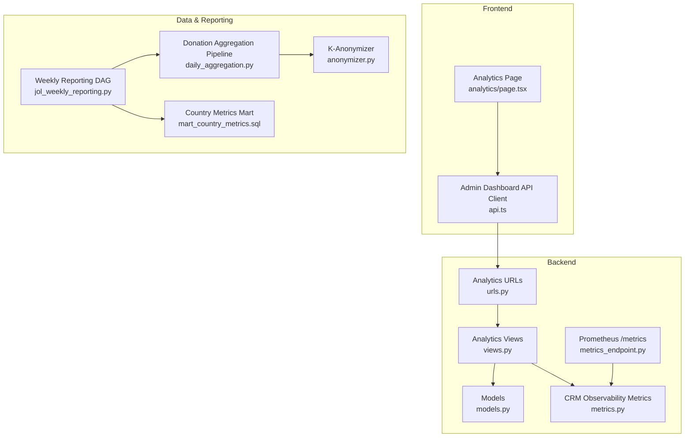
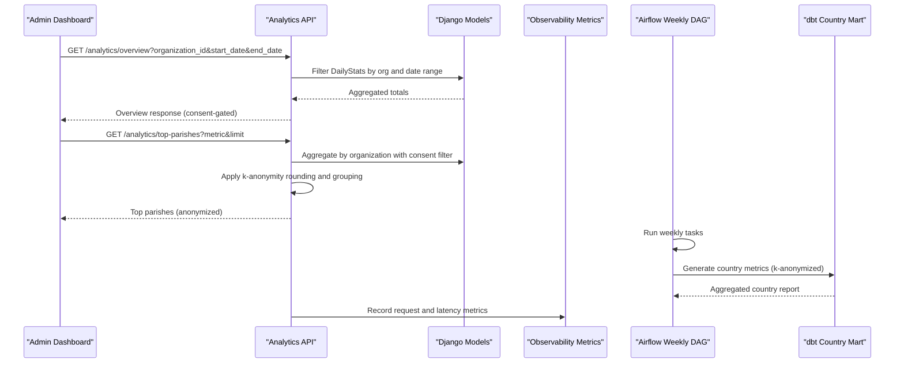
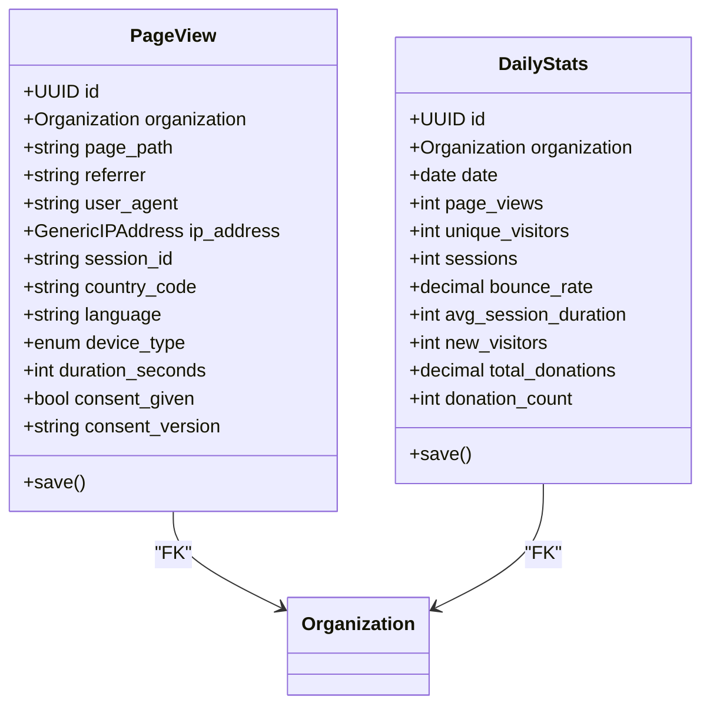
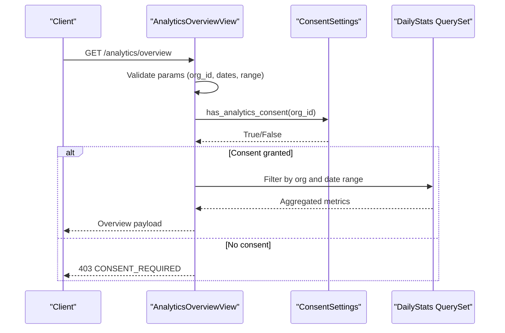
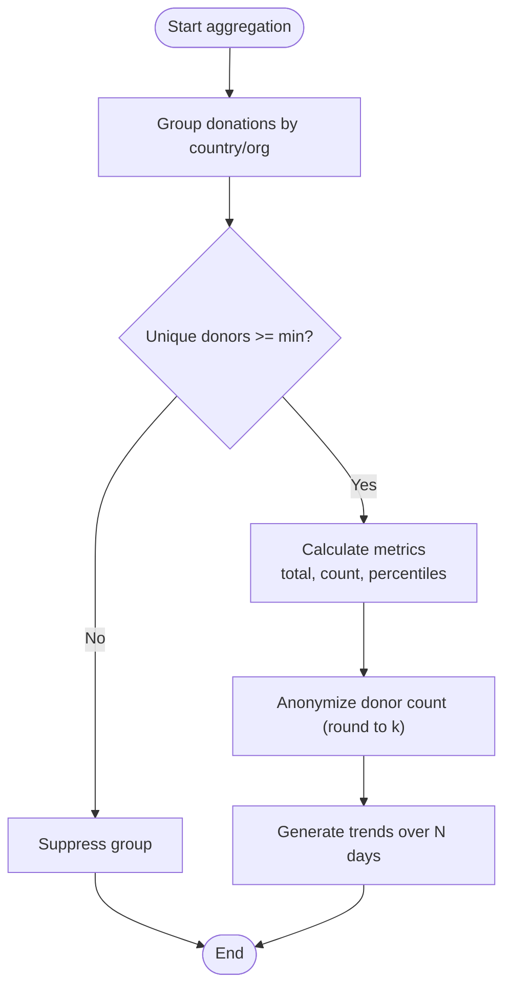
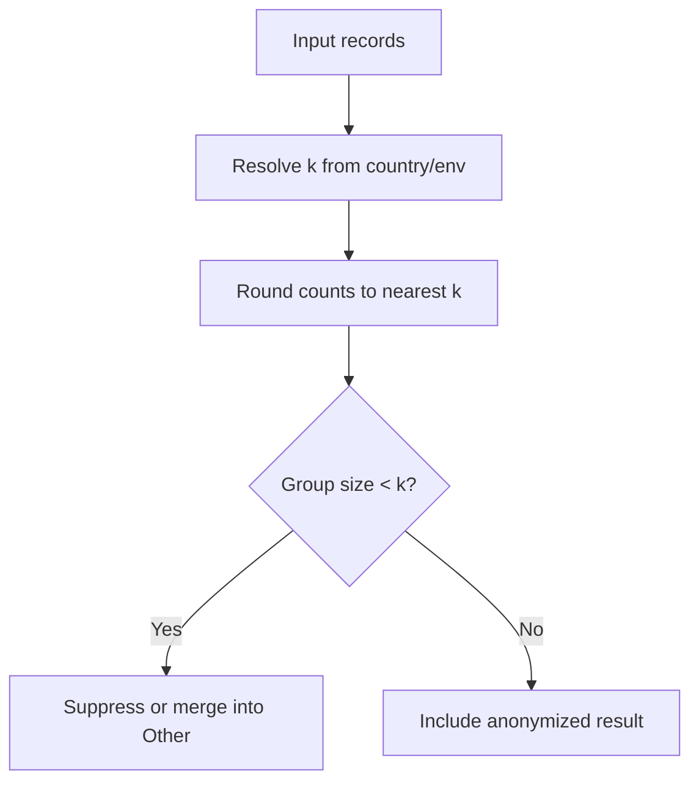
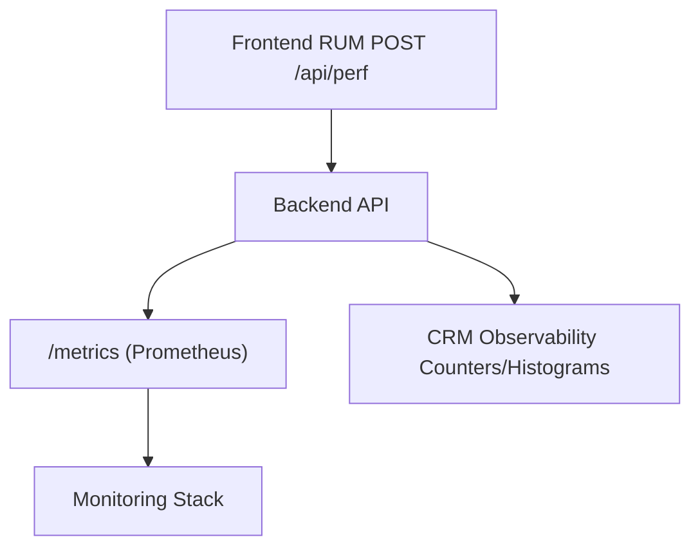
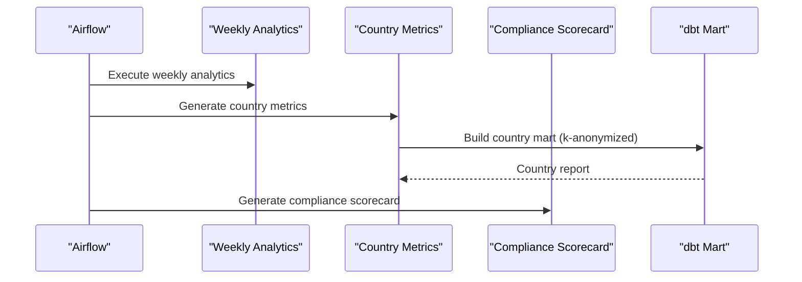
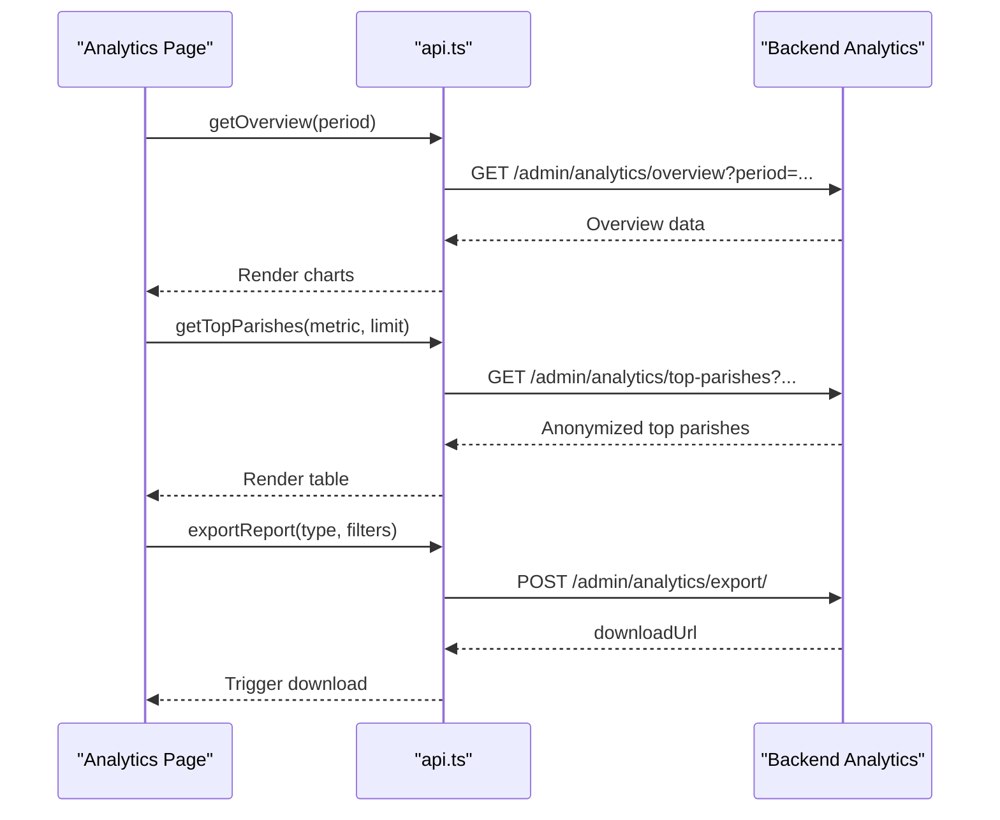
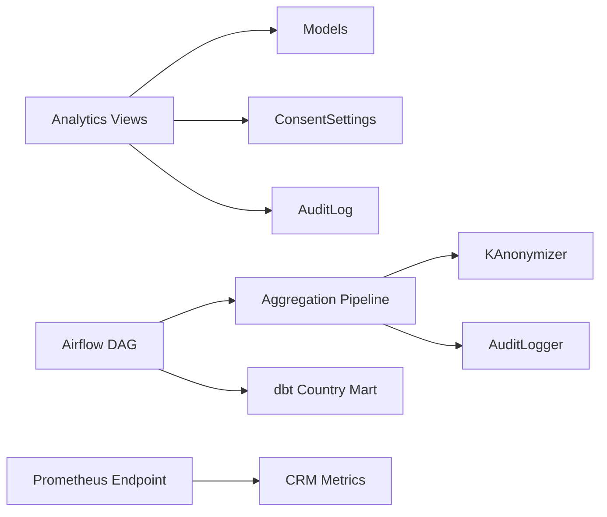

# Analytics & Reporting Services

<cite>
**Referenced Files in This Document**
- [models.py](file://backend/django/apps/analytics/models.py)
- [views.py](file://backend/django/apps/analytics/views.py)
- [serializers.py](file://backend/django/apps/analytics/serializers.py)
- [urls.py](file://backend/django/apps/analytics/urls.py)
- [daily_aggregation.py](file://data/src/pipelines/donation_analytics/daily_aggregation.py)
- [anonymizer.py](file://data/src/gdpr/anonymizer.py)
- [metrics_endpoint.py](file://backend/django/apps/core/metrics_endpoint.py)
- [metrics.py](file://backend/django/apps/crm/observability/metrics.py)
- [jol_weekly_reporting.py](file://data/airflow/dags/jol_weekly_reporting.py)
- [mart_country_metrics.sql](file://data/src/transformations/marts/mart_country_metrics.sql)
- [api.ts](file://frontend/apps/admin-dashboard/src/lib/api.ts)
- [analytics page](file://frontend/apps/admin-dashboard/src/app/(dashboard)/analytics/page.tsx)
</cite>

## Table of Contents
1. Introduction
2. Project Structure
3. Core Components
4. Architecture Overview
5. Detailed Component Analysis
6. Dependency Analysis
7. Performance Considerations
8. Troubleshooting Guide
9. Conclusion
10. Appendices

## Introduction
This document describes the Analytics and Reporting services that collect, aggregate, and expose metrics for dashboards and business intelligence. It covers:
- Metrics collection (page views, donations, performance)
- Dashboard APIs for overview, daily stats, and top parishes with privacy safeguards
- Report generation via Airflow DAGs and dbt transformations
- Data aggregation pipelines with k-anonymity and consent enforcement
- Real-time analytics ingestion points and historical analysis
- Custom metric definitions and export capabilities
- Performance monitoring, user behavior tracking, conversion funnel concepts, and BI integration guidance

## Project Structure
The analytics stack spans backend Django APIs, data pipelines, scheduled reporting, and a frontend dashboard client.

**Diagram sources**
- [urls.py:6-10](file://backend/django/apps/analytics/urls.py#L6-L10)
- [views.py:173-458](file://backend/django/apps/analytics/views.py#L173-L458)
- [models.py:12-174](file://backend/django/apps/analytics/models.py#L12-L174)
- [metrics_endpoint.py:68-154](file://backend/django/apps/core/metrics_endpoint.py#L68-L154)
- [metrics.py:47-123](file://backend/django/apps/crm/observability/metrics.py#L47-L123)
- [daily_aggregation.py:62-242](file://data/src/pipelines/donation_analytics/daily_aggregation.py#L62-L242)
- [anonymizer.py:106-180](file://data/src/gdpr/anonymizer.py#L106-L180)
- [jol_weekly_reporting.py:52-77](file://data/airflow/dags/jol_weekly_reporting.py#L52-L77)
- [mart_country_metrics.sql:1-96](file://data/src/transformations/marts/mart_country_metrics.sql#L1-L96)
- [api.ts:309-337](file://frontend/apps/admin-dashboard/src/lib/api.ts#L309-L337)

**Section sources**
- [urls.py:6-10](file://backend/django/apps/analytics/urls.py#L6-L10)
- [views.py:173-458](file://backend/django/apps/analytics/views.py#L173-L458)
- [models.py:12-174](file://backend/django/apps/analytics/models.py#L12-L174)
- [daily_aggregation.py:62-242](file://data/src/pipelines/donation_analytics/daily_aggregation.py#L62-L242)
- [anonymizer.py:106-180](file://data/src/gdpr/anonymizer.py#L106-L180)
- [metrics_endpoint.py:68-154](file://backend/django/apps/core/metrics_endpoint.py#L68-L154)
- [metrics.py:47-123](file://backend/django/apps/crm/observability/metrics.py#L47-L123)
- [jol_weekly_reporting.py:52-77](file://data/airflow/dags/jol_weekly_reporting.py#L52-L77)
- [mart_country_metrics.sql:1-96](file://data/src/transformations/marts/mart_country_metrics.sql#L1-L96)
- [api.ts:309-337](file://frontend/apps/admin-dashboard/src/lib/api.ts#L309-L337)

## Core Components
- Models: Raw page-view events and pre-aggregated daily statistics with tenant isolation and consent fields.
- Views: Secure, consent-gated APIs for overview, daily stats, and top parishes with k-anonymity.
- Serializers: Typed responses for aggregated analytics and top-parish results.
- Pipelines: Donation aggregation pipeline producing anonymized metrics and trends.
- Anonymization: K-anonymity with country-specific thresholds and count rounding.
- Monitoring: Prometheus metrics endpoint and observability counters/histograms.
- Scheduling: Airflow weekly reporting DAG orchestrating analytics and compliance outputs.
- Transformations: dbt marts generating country-level metrics with k-anonymity constraints.
- Frontend: Admin dashboard client calling analytics endpoints and exporting reports.

**Section sources**
- [models.py:12-174](file://backend/django/apps/analytics/models.py#L12-L174)
- [views.py:173-458](file://backend/django/apps/analytics/views.py#L173-L458)
- [serializers.py:10-70](file://backend/django/apps/analytics/serializers.py#L10-L70)
- [daily_aggregation.py:62-242](file://data/src/pipelines/donation_analytics/daily_aggregation.py#L62-L242)
- [anonymizer.py:106-180](file://data/src/gdpr/anonymizer.py#L106-L180)
- [metrics_endpoint.py:68-154](file://backend/django/apps/core/metrics_endpoint.py#L68-L154)
- [metrics.py:47-123](file://backend/django/apps/crm/observability/metrics.py#L47-L123)
- [jol_weekly_reporting.py:52-77](file://data/airflow/dags/jol_weekly_reporting.py#L52-L77)
- [mart_country_metrics.sql:1-96](file://data/src/transformations/marts/mart_country_metrics.sql#L1-L96)
- [api.ts:309-337](file://frontend/apps/admin-dashboard/src/lib/api.ts#L309-L337)

## Architecture Overview
The system collects raw page-view events and donation data, enforces consent and privacy, aggregates into daily stats and marts, and exposes secure APIs for dashboards. Scheduled jobs produce weekly reports and compliance scorecards.

**Diagram sources**
- [views.py:173-458](file://backend/django/apps/analytics/views.py#L173-L458)
- [models.py:107-174](file://backend/django/apps/analytics/models.py#L107-L174)
- [jol_weekly_reporting.py:52-77](file://data/airflow/dags/jol_weekly_reporting.py#L52-L77)
- [mart_country_metrics.sql:1-96](file://data/src/transformations/marts/mart_country_metrics.sql#L1-L96)
- [metrics_endpoint.py:68-154](file://backend/django/apps/core/metrics_endpoint.py#L68-L154)

## Detailed Component Analysis

### Analytics Models: Raw Events and Daily Stats
- PageView captures per-session page interactions with consent flags and anonymized IP handling.
- DailyStats stores pre-aggregated metrics per organization per day, including donations and engagement.
- Both models enforce tenant context validation to prevent cross-tenant manipulation.

**Diagram sources**
- [models.py:12-105](file://backend/django/apps/analytics/models.py#L12-L105)
- [models.py:107-174](file://backend/django/apps/analytics/models.py#L107-L174)

**Section sources**
- [models.py:12-174](file://backend/django/apps/analytics/models.py#L12-L174)

### Analytics APIs: Consent-Gated Dashboards
- Overview: Aggregates page views, visitors, sessions, bounce rate, session duration, donations, and donation counts within a date range; requires explicit analytics consent.
- Daily Stats: Returns recent daily stats for an organization with consent checks.
- Top Parishes: Aggregates organizations’ metrics with k-anonymity applied; small groups are rounded or grouped into “Other”.

**Diagram sources**
- [views.py:173-241](file://backend/django/apps/analytics/views.py#L173-L241)

**Section sources**
- [views.py:173-458](file://backend/django/apps/analytics/views.py#L173-L458)
- [serializers.py:35-70](file://backend/django/apps/analytics/serializers.py#L35-L70)

### Donation Aggregation Pipeline: K-Anonymized Trends
- Groups donations by country and organization type.
- Enforces minimum donor thresholds before reporting.
- Produces anonymized metrics and trend summaries without individual-level data.

**Diagram sources**
- [daily_aggregation.py:82-242](file://data/src/pipelines/donation_analytics/daily_aggregation.py#L82-L242)
- [anonymizer.py:123-126](file://data/src/gdpr/anonymizer.py#L123-L126)

**Section sources**
- [daily_aggregation.py:62-242](file://data/src/pipelines/donation_analytics/daily_aggregation.py#L62-L242)
- [anonymizer.py:106-180](file://data/src/gdpr/anonymizer.py#L106-L180)

### K-Anonymity and Privacy Safeguards
- Country-specific k values with environment override.
- Count rounding to nearest k for privacy.
- Suppression of small groups in aggregations.

**Diagram sources**
- [anonymizer.py:66-84](file://data/src/gdpr/anonymizer.py#L66-L84)
- [anonymizer.py:123-126](file://data/src/gdpr/anonymizer.py#L123-L126)
- [views.py:392-450](file://backend/django/apps/analytics/views.py#L392-L450)

**Section sources**
- [anonymizer.py:106-180](file://data/src/gdpr/anonymizer.py#L106-L180)
- [views.py:392-450](file://backend/django/apps/analytics/views.py#L392-L450)

### Performance Monitoring and Real-Time Ingestion
- Prometheus metrics endpoint exposes system metrics with IP allowlist and optional bearer token protection.
- CRM observability metrics track request counts, latencies, GDPR requests, security events, audit entries, and sync operations.
- Frontend RUM endpoint accepts Web Vitals payloads for real-time performance insights.

**Diagram sources**
- [metrics_endpoint.py:68-154](file://backend/django/apps/core/metrics_endpoint.py#L68-L154)
- [metrics.py:47-123](file://backend/django/apps/crm/observability/metrics.py#L47-L123)

**Section sources**
- [metrics_endpoint.py:68-154](file://backend/django/apps/core/metrics_endpoint.py#L68-L154)
- [metrics.py:47-123](file://backend/django/apps/crm/observability/metrics.py#L47-L123)

### Scheduled Reporting and Historical Analysis
- Weekly Airflow DAG runs analytics, country metrics, and compliance scorecard tasks.
- dbt mart generates country-level metrics with k-anonymity constraints and public classification.

**Diagram sources**
- [jol_weekly_reporting.py:52-77](file://data/airflow/dags/jol_weekly_reporting.py#L52-L77)
- [mart_country_metrics.sql:1-96](file://data/src/transformations/marts/mart_country_metrics.sql#L1-L96)

**Section sources**
- [jol_weekly_reporting.py:52-77](file://data/airflow/dags/jol_weekly_reporting.py#L52-L77)
- [mart_country_metrics.sql:1-96](file://data/src/transformations/marts/mart_country_metrics.sql#L1-L96)

### Frontend Integration and Export Capabilities
- Admin dashboard client calls analytics endpoints for overview, top parishes, country breakdown, and exports.
- Export function supports multiple formats via a dedicated endpoint.

**Diagram sources**
- [api.ts:309-337](file://frontend/apps/admin-dashboard/src/lib/api.ts#L309-L337)
- [views.py:173-458](file://backend/django/apps/analytics/views.py#L173-L458)

**Section sources**
- [api.ts:309-337](file://frontend/apps/admin-dashboard/src/lib/api.ts#L309-L337)
- [analytics page:68-113](file://frontend/apps/admin-dashboard/src/app/(dashboard)/analytics/page.tsx#L68-L113)

## Dependency Analysis
- The analytics API depends on models for storage and consent settings for access control.
- Pipelines depend on anonymization utilities and audit logging.
- Reporting DAG depends on pipeline functions and dbt marts.
- Monitoring integrates with Prometheus and CRM observability metrics.

**Diagram sources**
- [views.py:173-458](file://backend/django/apps/analytics/views.py#L173-L458)
- [models.py:12-174](file://backend/django/apps/analytics/models.py#L12-L174)
- [daily_aggregation.py:62-242](file://data/src/pipelines/donation_analytics/daily_aggregation.py#L62-L242)
- [anonymizer.py:106-180](file://data/src/gdpr/anonymizer.py#L106-L180)
- [jol_weekly_reporting.py:52-77](file://data/airflow/dags/jol_weekly_reporting.py#L52-L77)
- [metrics_endpoint.py:68-154](file://backend/django/apps/core/metrics_endpoint.py#L68-L154)
- [metrics.py:47-123](file://backend/django/apps/crm/observability/metrics.py#L47-L123)

**Section sources**
- [views.py:173-458](file://backend/django/apps/analytics/views.py#L173-L458)
- [models.py:12-174](file://backend/django/apps/analytics/models.py#L12-L174)
- [daily_aggregation.py:62-242](file://data/src/pipelines/donation_analytics/daily_aggregation.py#L62-L242)
- [anonymizer.py:106-180](file://data/src/gdpr/anonymizer.py#L106-L180)
- [jol_weekly_reporting.py:52-77](file://data/airflow/dags/jol_weekly_reporting.py#L52-L77)
- [metrics_endpoint.py:68-154](file://backend/django/apps/core/metrics_endpoint.py#L68-L154)
- [metrics.py:47-123](file://backend/django/apps/crm/observability/metrics.py#L47-L123)

## Performance Considerations
- Use database indexes on organization and created_at for efficient time-range queries.
- Limit date ranges to prevent heavy aggregation; enforce maximum range in APIs.
- Apply k-anonymity at source in pipelines to avoid downstream re-computation.
- Cache frequently accessed aggregated results if needed.
- Monitor query performance via Prometheus histograms and logs.

[No sources needed since this section provides general guidance]

## Troubleshooting Guide
Common issues and resolutions:
- Consent required errors: Ensure organization has analytics consent enabled; check consent settings and configuration.
- Validation errors: Verify parameter formats (UUIDs, ISO dates) and value bounds.
- Access denied on metrics: Confirm IP allowlist and bearer token configuration for the Prometheus endpoint.
- Small group suppression: Adjust k thresholds or groupings if too many results are suppressed.

**Section sources**
- [views.py:33-116](file://backend/django/apps/analytics/views.py#L33-L116)
- [views.py:141-170](file://backend/django/apps/analytics/views.py#L141-L170)
- [metrics_endpoint.py:95-129](file://backend/django/apps/core/metrics_endpoint.py#L95-L129)

## Conclusion
The Analytics & Reporting services provide a robust, privacy-first foundation for collecting, aggregating, and exposing metrics across dashboards and BI tools. Consent gating, k-anonymity, and scheduled reporting ensure compliance and reliability. The modular design enables extension for custom metrics, additional export formats, and deeper integrations.

[No sources needed since this section summarizes without analyzing specific files]

## Appendices

### API Reference Summary
- Overview: Aggregated metrics for a date range with consent status.
- Daily Stats: Recent daily statistics per organization.
- Top Parishes: Ranked organizations with k-anonymity applied.
- Export: Downloadable reports in multiple formats.

**Section sources**
- [views.py:173-458](file://backend/django/apps/analytics/views.py#L173-L458)
- [api.ts:309-337](file://frontend/apps/admin-dashboard/src/lib/api.ts#L309-L337)

### Creating Custom Reports
- Define new aggregation logic in the pipeline or dbt model.
- Add corresponding API endpoints under analytics views and serializers.
- Schedule periodic generation via Airflow DAGs.
- Expose export functionality through the admin dashboard client.

**Section sources**
- [daily_aggregation.py:82-242](file://data/src/pipelines/donation_analytics/daily_aggregation.py#L82-L242)
- [mart_country_metrics.sql:1-96](file://data/src/transformations/marts/mart_country_metrics.sql#L1-L96)
- [jol_weekly_reporting.py:52-77](file://data/airflow/dags/jol_weekly_reporting.py#L52-L77)
- [api.ts:309-337](file://frontend/apps/admin-dashboard/src/lib/api.ts#L309-L337)

### Integrating with BI Tools
- Use the analytics APIs to feed dashboards with aggregated, consented data.
- Leverage the Prometheus /metrics endpoint for system health and performance indicators.
- Pull country metrics marts for regional insights in BI platforms.

**Section sources**
- [views.py:173-458](file://backend/django/apps/analytics/views.py#L173-L458)
- [metrics_endpoint.py:68-154](file://backend/django/apps/core/metrics_endpoint.py#L68-L154)
- [mart_country_metrics.sql:1-96](file://data/src/transformations/marts/mart_country_metrics.sql#L1-L96)

### Setting Up Automated Reporting Schedules
- Configure Airflow DAGs to run weekly tasks for analytics, country metrics, and compliance.
- Ensure dependencies (pipelines, dbt) are available and credentials are configured.
- Monitor DAG execution and handle retries/failures.

**Section sources**
- [jol_weekly_reporting.py:52-77](file://data/airflow/dags/jol_weekly_reporting.py#L52-L77)

### Optimizing Query Performance for Large Datasets
- Use indexed fields (organization, created_at) for filtering.
- Restrict date ranges and limits in API parameters.
- Pre-aggregate data into DailyStats and marts to reduce runtime computation.
- Monitor and tune queries based on observed load patterns.

**Section sources**
- [models.py:54-62](file://backend/django/apps/analytics/models.py#L54-L62)
- [views.py:101-116](file://backend/django/apps/analytics/views.py#L101-L116)
- [mart_country_metrics.sql:11-41](file://data/src/transformations/marts/mart_country_metrics.sql#L11-L41)