# Backend Services (Django)

<cite>
**Referenced Files in This Document**
- [base.py](file://backend/django/core/settings/base.py)
- [urls.py](file://backend/django/core/urls.py)
- [models.py](file://backend/django/apps/core/models.py)
- [models.py](file://backend/django/apps/users/models.py)
- [models.py](file://backend/django/apps/organizations/models.py)
- [models.py](file://backend/django/apps/content/models.py)
- [models.py](file://backend/django/apps/donations/models.py)
- [models.py](file://backend/django/apps/analytics/models.py)
- [models.py](file://backend/django/apps/crm/models.py)
- [middleware.py](file://backend/django/apps/crm/middleware.py)
- [mongodb.py](file://backend/django/apps/core/mongodb.py)
- [celery.py](file://backend/django/core/celery.py)
</cite>

## Table of Contents
1. [Introduction](#introduction)
2. [Project Structure](#project-structure)
3. [Core Components](#core-components)
4. [Architecture Overview](#architecture-overview)
5. [Detailed Component Analysis](#detailed-component-analysis)
6. [Dependency Analysis](#dependency-analysis)
7. [Performance Considerations](#performance-considerations)
8. [Troubleshooting Guide](#troubleshooting-guide)
9. [Conclusion](#conclusion)
10. [Appendices](#appendices)

## Introduction
This document explains the Django backend services architecture for a multi-tenant platform that supports user management, organization-based isolation, content and media handling, donations with payment boundaries, CRM integration with Bitrix24, and analytics. It covers the modular app layout, Django REST Framework configuration, PostgreSQL schema design, Celery background jobs, Redis caching, MongoDB for high-volume analytics and audit data, API endpoint patterns, authentication via JWT and Allauth, middleware stack, and environment-driven settings.

## Project Structure
The backend is organized as a Django project with feature apps under apps/:
- core: shared base models, utilities, exceptions, health/metrics, Celery init, MongoDB helpers
- users: custom user model, auth flows, profiles
- organizations: multi-tenant entities, membership, website config, consent settings
- content: pages and media assets per organization
- donations: one-off and recurring donation records
- analytics: page views and daily aggregated stats
- crm: tenant-scoped CRM entities (contacts, leads, deals), Bitrix24 sync fields, legal hold and consent tracking
- integrations: Bitrix24 mapping and tasks
- countries: country-specific reference data
- financial: financial domain models
- payment_events: internal ingress for marketplace payment events (flag-gated)

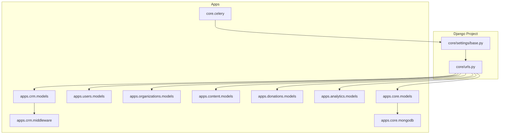

**Diagram sources**
- [base.py:47-119](file://backend/django/core/settings/base.py#L47-L119)
- [urls.py:39-66](file://backend/django/core/urls.py#L39-L66)
- [models.py:1-227](file://backend/django/apps/core/models.py#L1-L227)
- [models.py:1-123](file://backend/django/apps/users/models.py#L1-L123)
- [models.py:1-495](file://backend/django/apps/organizations/models.py#L1-L495)
- [models.py:1-202](file://backend/django/apps/content/models.py#L1-L202)
- [models.py:1-146](file://backend/django/apps/donations/models.py#L1-L146)
- [models.py:1-174](file://backend/django/apps/analytics/models.py#L1-L174)
- [models.py:1-800](file://backend/django/apps/crm/models.py#L1-L800)
- [middleware.py:1-405](file://backend/django/apps/crm/middleware.py#L1-L405)
- [mongodb.py:1-822](file://backend/django/apps/core/mongodb.py#L1-L822)
- [celery.py:1-32](file://backend/django/core/celery.py#L1-L32)

**Section sources**
- [base.py:47-119](file://backend/django/core/settings/base.py#L47-L119)
- [urls.py:39-66](file://backend/django/core/urls.py#L39-L66)

## Core Components
- Base models: UUID primary keys, timestamps, soft-delete, and an immutable AuditLog with tamper-evident checksums and GDPR DSR actions.
- User model: email-based unique identifier, roles, MFA flags, profile separation, GDPR consent fields.
- Organizations: entity types, compliance levels, hierarchy, Bitrix24 integration fields, legal hold, consent settings.
- Content: Pages and MediaFiles scoped to organizations with status workflows and media metadata.
- Donations: payment method, status lifecycle, recurring support, gateway response storage.
- Analytics: PageView events with consent flags and DailyStats aggregates.
- CRM: Tenant-scoped Contact, Lead, Deal with consent, legal hold, Bitrix24 sync fields, and integrity hashes.
- Middleware: TenantContextMiddleware extracts tenant from JWT or headers, caches tenant info, enforces row-level security via managers and save-time validation.
- MongoDB: Connection manager with Prometheus metrics, TTL indexes, tenant-scoped collections for webhook payloads and audit logs.
- Celery: App initialization, scheduled tasks for digest, session cleanup, recurring donations.

**Section sources**
- [models.py:1-227](file://backend/django/apps/core/models.py#L1-L227)
- [models.py:1-123](file://backend/django/apps/users/models.py#L1-L123)
- [models.py:1-495](file://backend/django/apps/organizations/models.py#L1-L495)
- [models.py:1-202](file://backend/django/apps/content/models.py#L1-L202)
- [models.py:1-146](file://backend/django/apps/donations/models.py#L1-L146)
- [models.py:1-174](file://backend/django/apps/analytics/models.py#L1-L174)
- [models.py:1-800](file://backend/django/apps/crm/models.py#L1-L800)
- [middleware.py:1-405](file://backend/django/apps/crm/middleware.py#L1-L405)
- [mongodb.py:1-822](file://backend/django/apps/core/mongodb.py#L1-L822)
- [celery.py:1-32](file://backend/django/core/celery.py#L1-L32)

## Architecture Overview
The system uses Django with DRF for APIs, PostgreSQL as the relational store, Redis for caching and Celery broker/results, and MongoDB for high-volume unstructured data (webhook payloads, audit logs). Multi-tenancy is enforced at both middleware and model layers. Authentication combines SessionAuthentication and JWT; social login is provided by Allauth. Background processing handles periodic tasks like sending digests and processing recurring donations.

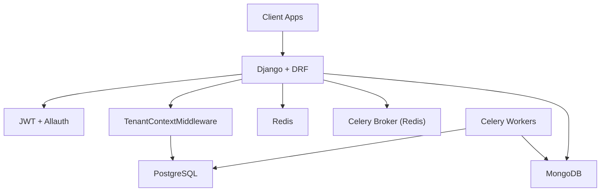

**Diagram sources**
- [base.py:121-145](file://backend/django/core/settings/base.py#L121-L145)
- [base.py:282-355](file://backend/django/core/settings/base.py#L282-L355)
- [base.py:361-386](file://backend/django/core/settings/base.py#L361-L386)
- [base.py:392-410](file://backend/django/core/settings/base.py#L392-L410)
- [base.py:689-722](file://backend/django/core/settings/base.py#L689-L722)
- [middleware.py:96-197](file://backend/django/apps/crm/middleware.py#L96-L197)
- [mongodb.py:226-410](file://backend/django/apps/core/mongodb.py#L226-L410)

## Detailed Component Analysis

### Core Models and Auditability
- BaseModel provides UUID PK, timestamps, and soft delete.
- AuditLog stores immutable action trails with checksums and GDPR DSR actions, enforcing tenant context on save.

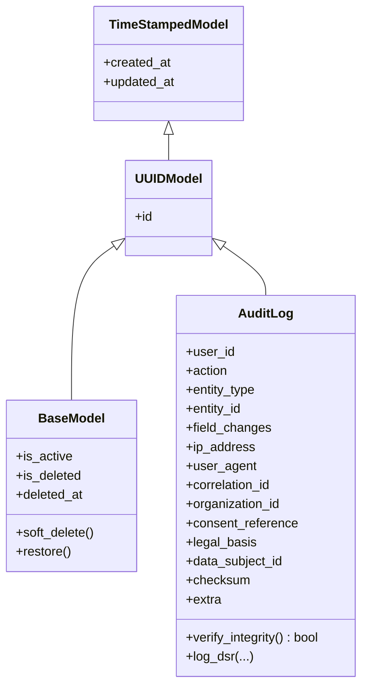

**Diagram sources**
- [models.py:11-65](file://backend/django/apps/core/models.py#L11-L65)
- [models.py:67-227](file://backend/django/apps/core/models.py#L67-L227)

**Section sources**
- [models.py:11-65](file://backend/django/apps/core/models.py#L11-L65)
- [models.py:67-227](file://backend/django/apps/core/models.py#L67-L227)

### Users and Profiles
- Custom User extends AbstractBaseUser with email as username, roles, MFA, GDPR consent, and profile separation for privacy and erasure.

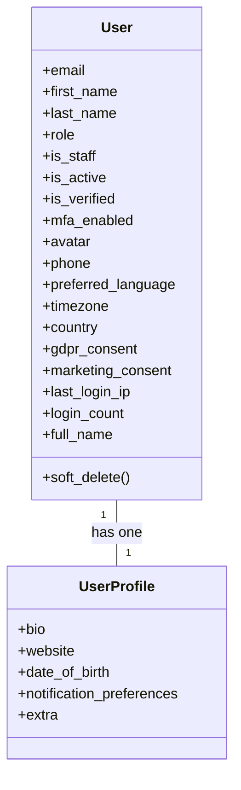

**Diagram sources**
- [models.py:17-123](file://backend/django/apps/users/models.py#L17-L123)

**Section sources**
- [models.py:17-123](file://backend/django/apps/users/models.py#L17-L123)

### Organizations and Multi-Tenancy
- Organization supports multiple entity types, compliance levels, hierarchy, Bitrix24 fields, legal hold, and consent settings. Membership links users to organizations with roles. Website ties domains and themes. ConsentSettings tracks per-org analytics/marketing/functional consent.

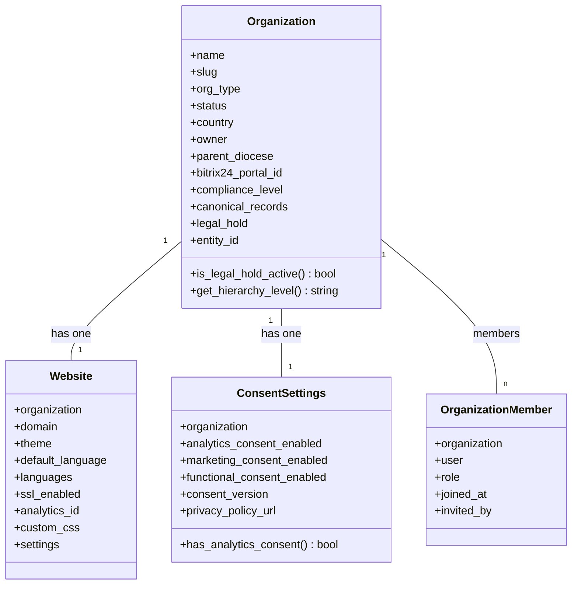

**Diagram sources**
- [models.py:12-237](file://backend/django/apps/organizations/models.py#L12-L237)
- [models.py:239-321](file://backend/django/apps/organizations/models.py#L239-L321)
- [models.py:323-386](file://backend/django/apps/organizations/models.py#L323-L386)
- [models.py:388-495](file://backend/django/apps/organizations/models.py#L388-L495)

**Section sources**
- [models.py:12-495](file://backend/django/apps/organizations/models.py#L12-L495)

### Content Management and Media
- Page supports hierarchical structure, language, template, status workflow, and featured image. MediaFile stores uploaded assets with type and metadata. Both enforce tenant context on save.

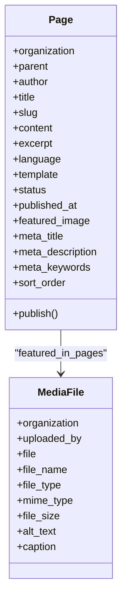

**Diagram sources**
- [models.py:13-119](file://backend/django/apps/content/models.py#L13-L119)
- [models.py:121-202](file://backend/django/apps/content/models.py#L121-L202)

**Section sources**
- [models.py:13-202](file://backend/django/apps/content/models.py#L13-L202)

### Donations and Payment Boundary
- Donation captures amount, currency, status, payment method, transaction ID, gateway response, donor details, and recurring plan fields. Save-time tenant validation prevents cross-tenant manipulation. The platform does not store PSP secrets; payments flow through a marketplace boundary.

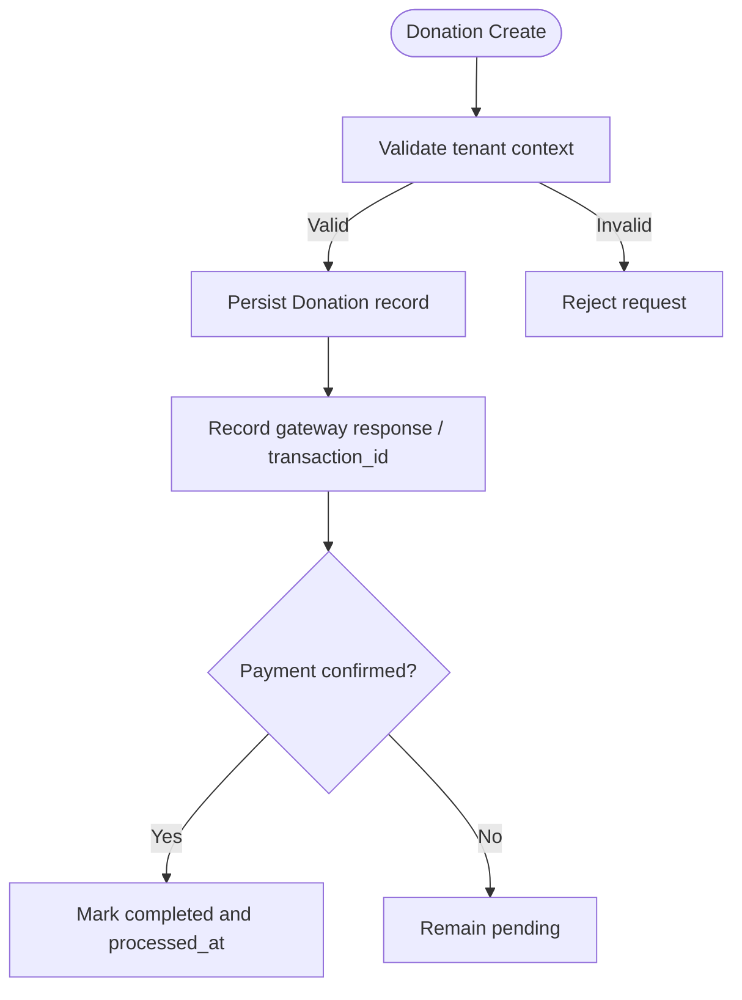

**Diagram sources**
- [models.py:13-146](file://backend/django/apps/donations/models.py#L13-L146)

**Section sources**
- [models.py:13-146](file://backend/django/apps/donations/models.py#L13-L146)

### Analytics and Aggregation
- PageView records raw events with consent flags and anonymized IP. DailyStats aggregates per-day metrics per organization. Both enforce tenant context on save.

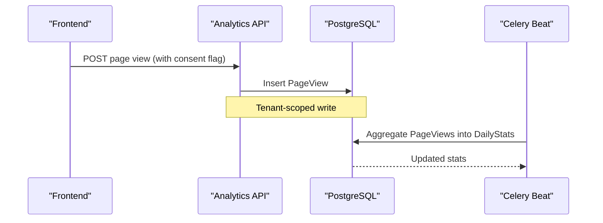

**Diagram sources**
- [models.py:12-105](file://backend/django/apps/analytics/models.py#L12-L105)
- [models.py:107-174](file://backend/django/apps/analytics/models.py#L107-L174)
- [base.py:373-386](file://backend/django/core/settings/base.py#L373-L386)

**Section sources**
- [models.py:12-174](file://backend/django/apps/analytics/models.py#L12-L174)
- [base.py:373-386](file://backend/django/core/settings/base.py#L373-L386)

### CRM Integration with Bitrix24 Sync
- CRMTenantModel adds tenant isolation, data classification, legal hold, consent tracking, and Bitrix24 sync fields. Contact, Lead, and Deal extend this base with domain-specific fields and constraints. Managers filter queries by current tenant.

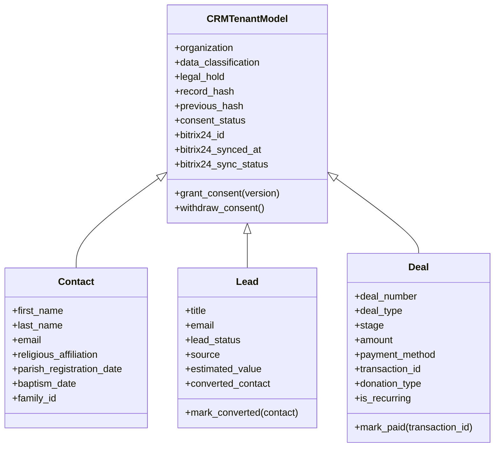

**Diagram sources**
- [models.py:71-253](file://backend/django/apps/crm/models.py#L71-L253)
- [models.py:255-375](file://backend/django/apps/crm/models.py#L255-L375)
- [models.py:377-521](file://backend/django/apps/crm/models.py#L377-L521)
- [models.py:523-771](file://backend/django/apps/crm/models.py#L523-L771)

**Section sources**
- [models.py:71-771](file://backend/django/apps/crm/models.py#L71-L771)

### Middleware Stack and Tenant Isolation
- Middleware extracts tenant from JWT claims or X-Tenant-ID header, validates against active organizations, caches tenant info, and injects context into requests. Models validate tenant context on save to prevent cross-tenant writes.

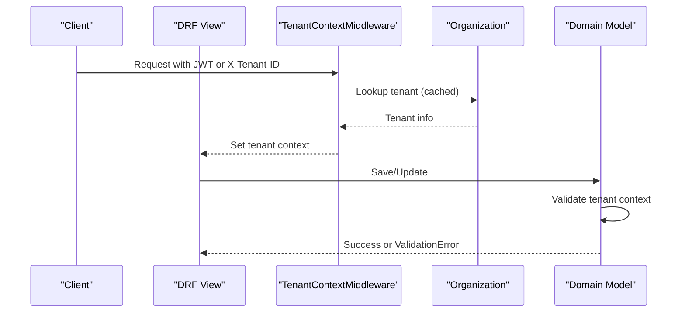

**Diagram sources**
- [middleware.py:96-197](file://backend/django/apps/crm/middleware.py#L96-L197)
- [models.py:281-321](file://backend/django/apps/organizations/models.py#L281-L321)
- [models.py:73-113](file://backend/django/apps/content/models.py#L73-L113)
- [models.py:96-135](file://backend/django/apps/donations/models.py#L96-L135)
- [models.py:67-105](file://backend/django/apps/analytics/models.py#L67-L105)

**Section sources**
- [middleware.py:96-197](file://backend/django/apps/crm/middleware.py#L96-L197)
- [models.py:281-321](file://backend/django/apps/organizations/models.py#L281-L321)
- [models.py:73-113](file://backend/django/apps/content/models.py#L73-L113)
- [models.py:96-135](file://backend/django/apps/donations/models.py#L96-L135)
- [models.py:67-105](file://backend/django/apps/analytics/models.py#L67-L105)

### Database Schema Design (PostgreSQL)
- Primary relational store with:
  - Users and profiles
  - Organizations, memberships, websites, consent settings
  - Pages and media files
  - Donations
  - Analytics page views and daily stats
  - CRM contacts, leads, deals with consent and legal hold
- Indexes and constraints ensure performance and uniqueness per tenant.

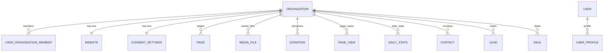

**Diagram sources**
- [models.py:12-495](file://backend/django/apps/organizations/models.py#L12-L495)
- [models.py:13-202](file://backend/django/apps/content/models.py#L13-L202)
- [models.py:13-146](file://backend/django/apps/donations/models.py#L13-L146)
- [models.py:12-174](file://backend/django/apps/analytics/models.py#L12-L174)
- [models.py:255-771](file://backend/django/apps/crm/models.py#L255-L771)

**Section sources**
- [models.py:12-495](file://backend/django/apps/organizations/models.py#L12-L495)
- [models.py:13-202](file://backend/django/apps/content/models.py#L13-L202)
- [models.py:13-146](file://backend/django/apps/donations/models.py#L13-L146)
- [models.py:12-174](file://backend/django/apps/analytics/models.py#L12-L174)
- [models.py:255-771](file://backend/django/apps/crm/models.py#L255-L771)

### Celery Background Jobs
- Celery app configured from Django settings with Redis broker and result backend. Scheduled tasks include daily digest, session cleanup, and recurring donations processing.

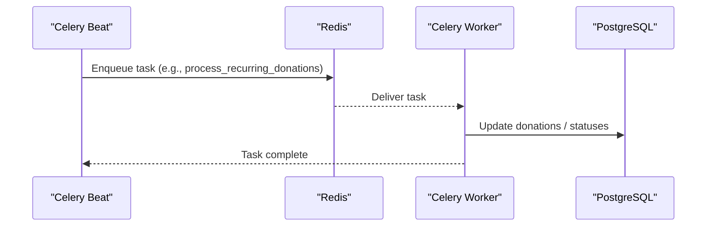

**Diagram sources**
- [celery.py:1-32](file://backend/django/core/celery.py#L1-L32)
- [base.py:361-386](file://backend/django/core/settings/base.py#L361-L386)

**Section sources**
- [celery.py:1-32](file://backend/django/core/celery.py#L1-L32)
- [base.py:361-386](file://backend/django/core/settings/base.py#L361-L386)

### Redis Caching
- Redis used for default cache and Celery broker/results with connection pooling and compression. Tenant info cached for 5 minutes.

**Section sources**
- [base.py:392-410](file://backend/django/core/settings/base.py#L392-L410)
- [middleware.py:233-265](file://backend/django/apps/crm/middleware.py#L233-L265)

### MongoDB for Analytics and Audit Data
- MongoDB stores raw webhook payloads and high-volume audit logs with TTL expiration and tenant scoping. Prometheus metrics track query durations and errors. Collections enforce created_at, updated_at, and tenant_id injection.

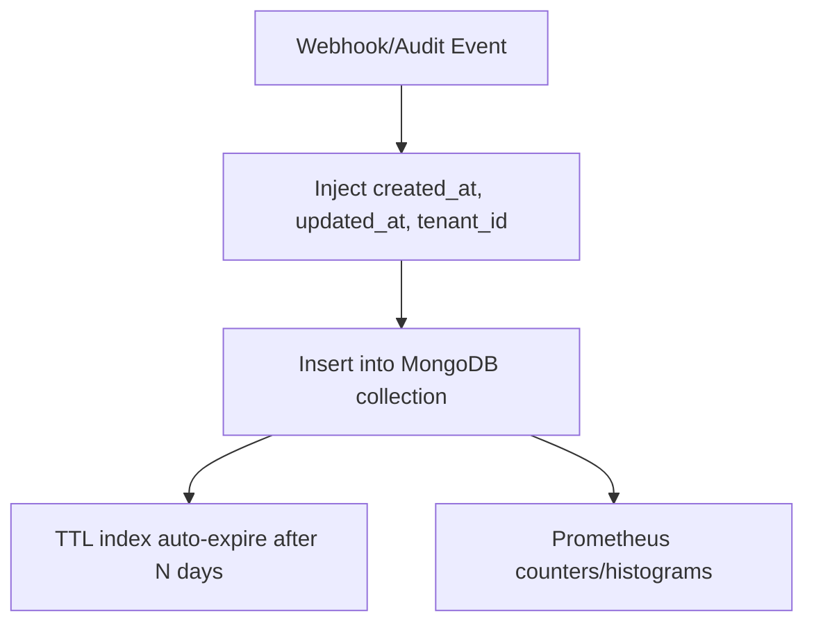

**Diagram sources**
- [mongodb.py:417-734](file://backend/django/apps/core/mongodb.py#L417-L734)
- [mongodb.py:740-791](file://backend/django/apps/core/mongodb.py#L740-L791)
- [base.py:689-722](file://backend/django/core/settings/base.py#L689-L722)

**Section sources**
- [mongodb.py:417-791](file://backend/django/apps/core/mongodb.py#L417-L791)
- [base.py:689-722](file://backend/django/core/settings/base.py#L689-L722)

### API Endpoints and Patterns
- Root URLs mount core health/metrics, admin, OpenAPI docs, and versioned API routes:
  - /api/v1/auth/ (users auth)
  - /api/v1/users/
  - /api/v1/organizations/
  - /api/v1/content/
  - /api/v1/donations/
  - /api/v1/analytics/
  - /api/v1/countries/
  - /api/v1/integrations/
  - /api/v1/financial/
  - /api/v1/crm/
  - /internal/v1/ (payment events, flag-gated)
- DRF defaults: JSON/Browsable renderers, JSON/Form/Multipart parsers, pagination, filtering, throttling, versioning v1, Spectacular schema.

**Section sources**
- [urls.py:39-66](file://backend/django/core/urls.py#L39-L66)
- [base.py:282-327](file://backend/django/core/settings/base.py#L282-L327)
- [base.py:583-604](file://backend/django/core/settings/base.py#L583-L604)

### Authentication Methods (JWT and Allauth)
- DRF supports SessionAuthentication and JWTAuthentication. JWT lifetimes, rotation, and serializers are configured. Allauth provides social accounts and account flows mounted at /accounts/.

**Section sources**
- [base.py:282-355](file://backend/django/core/settings/base.py#L282-L355)
- [urls.py:68-69](file://backend/django/core/urls.py#L68-L69)

### Configuration Management (Environment-Based Settings)
- Settings loaded from environment variables using environ and dotenv. Environment-specific overrides supported. Security, CORS, logging, rate limiting, maintenance mode, and observability toggles are configurable.

**Section sources**
- [base.py:28-44](file://backend/django/core/settings/base.py#L28-L44)
- [base.py:519-577](file://backend/django/core/settings/base.py#L519-L577)
- [base.py:728-741](file://backend/django/core/settings/base.py#L728-L741)

## Dependency Analysis
- Apps depend on core base models and utilities.
- CRM depends on organizations and middleware for tenant isolation.
- Analytics and donations depend on organizations for scoping.
- Celery tasks depend on settings and may interact with PostgreSQL and MongoDB.
- MongoDB usage is isolated via connection manager and base collections.

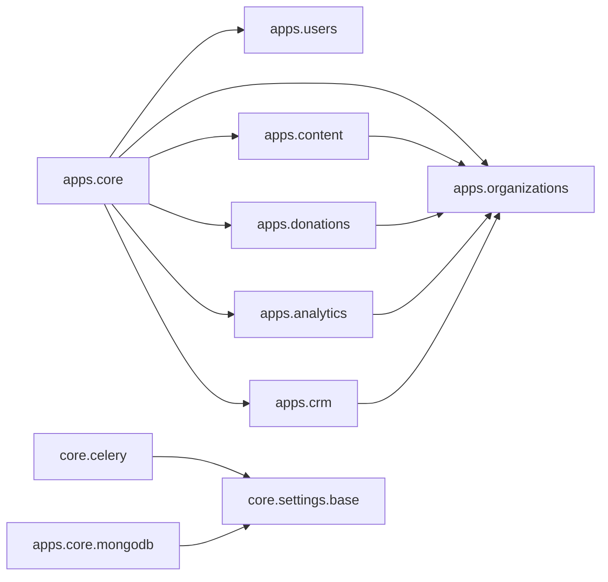

**Diagram sources**
- [base.py:47-119](file://backend/django/core/settings/base.py#L47-L119)
- [celery.py:1-32](file://backend/django/core/celery.py#L1-L32)
- [mongodb.py:226-410](file://backend/django/apps/core/mongodb.py#L226-L410)

**Section sources**
- [base.py:47-119](file://backend/django/core/settings/base.py#L47-L119)
- [celery.py:1-32](file://backend/django/core/celery.py#L1-L32)
- [mongodb.py:226-410](file://backend/django/apps/core/mongodb.py#L226-L410)

## Performance Considerations
- Use Redis caching for frequent lookups (tenant info, sessions).
- Leverage Celery workers for heavy tasks (recurring donations, aggregations).
- Ensure proper indexing on frequently queried fields (organization, status, dates).
- Monitor MongoDB slow queries via Prometheus histograms and adjust TTL retention.
- Apply DRF throttling to sensitive endpoints (auth, GDPR exports/deletes, donations).

[No sources needed since this section provides general guidance]

## Troubleshooting Guide
- Cross-tenant access violations: Check tenant context in middleware and model save validations; review logs for tenant validation errors.
- JWT issues: Verify token claims include tenant_id or organization_id; check JWT settings and lifetimes.
- Celery tasks not running: Confirm broker URL, worker processes, and beat schedule; inspect task queues and results.
- MongoDB connectivity: Validate MONGODB_URI, TLS settings, and pool sizes; check Prometheus metrics for errors and latency.
- Rate limiting: Adjust throttle rates for specific endpoints if legitimate traffic is blocked.

**Section sources**
- [middleware.py:96-197](file://backend/django/apps/crm/middleware.py#L96-L197)
- [models.py:281-321](file://backend/django/apps/organizations/models.py#L281-L321)
- [base.py:307-327](file://backend/django/core/settings/base.py#L307-L327)
- [base.py:361-386](file://backend/django/core/settings/base.py#L361-L386)
- [mongodb.py:226-410](file://backend/django/apps/core/mongodb.py#L226-L410)

## Conclusion
The backend implements a robust, multi-tenant Django architecture with clear separation of concerns across apps, strong tenant isolation via middleware and model-level checks, comprehensive auditability, and scalable background processing. PostgreSQL serves as the primary store, while MongoDB handles high-volume unstructured data with TTL retention. DRF provides consistent API patterns, and JWT plus Allauth enable secure authentication. Environment-driven settings allow flexible deployment across environments.

[No sources needed since this section summarizes without analyzing specific files]

## Appendices

### API Endpoint Summary
- Health and metrics: root includes core app paths
- Admin: /admin/
- OpenAPI: /api/schema/, /api/docs/, /api/redoc/
- Versioned APIs: /api/v1/* for auth, users, organizations, content, donations, analytics, countries, integrations, financial, crm
- Internal ingress: /internal/v1/ (payment events, flag-gated)

**Section sources**
- [urls.py:39-66](file://backend/django/core/urls.py#L39-L66)