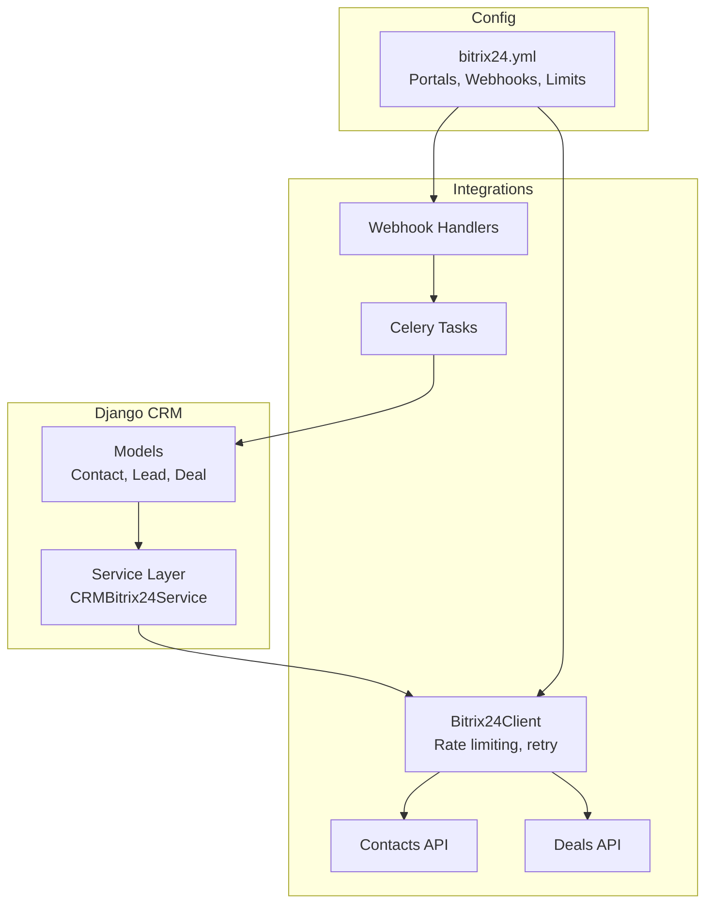
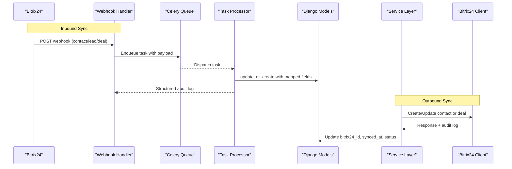
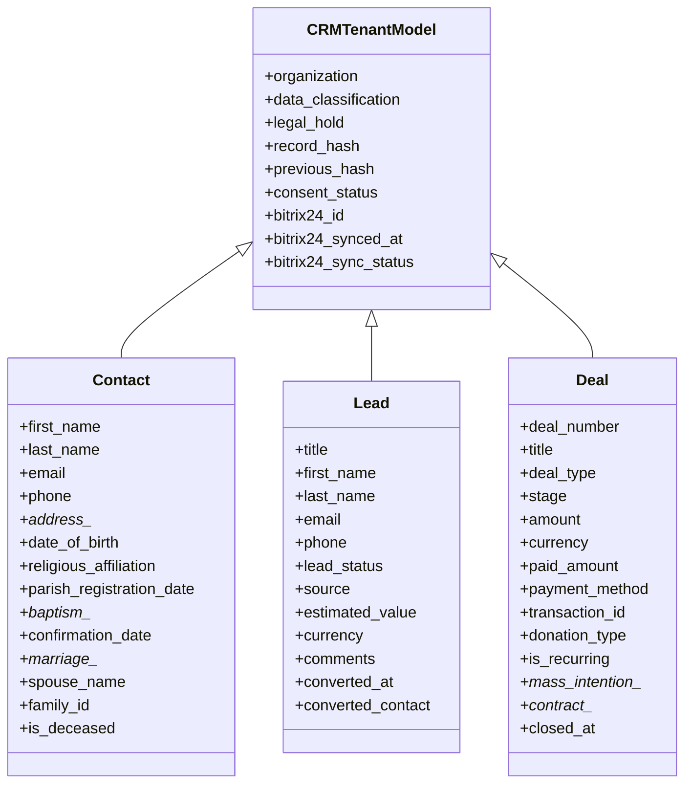
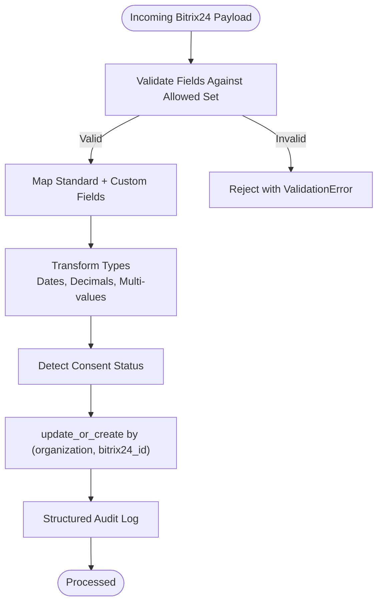
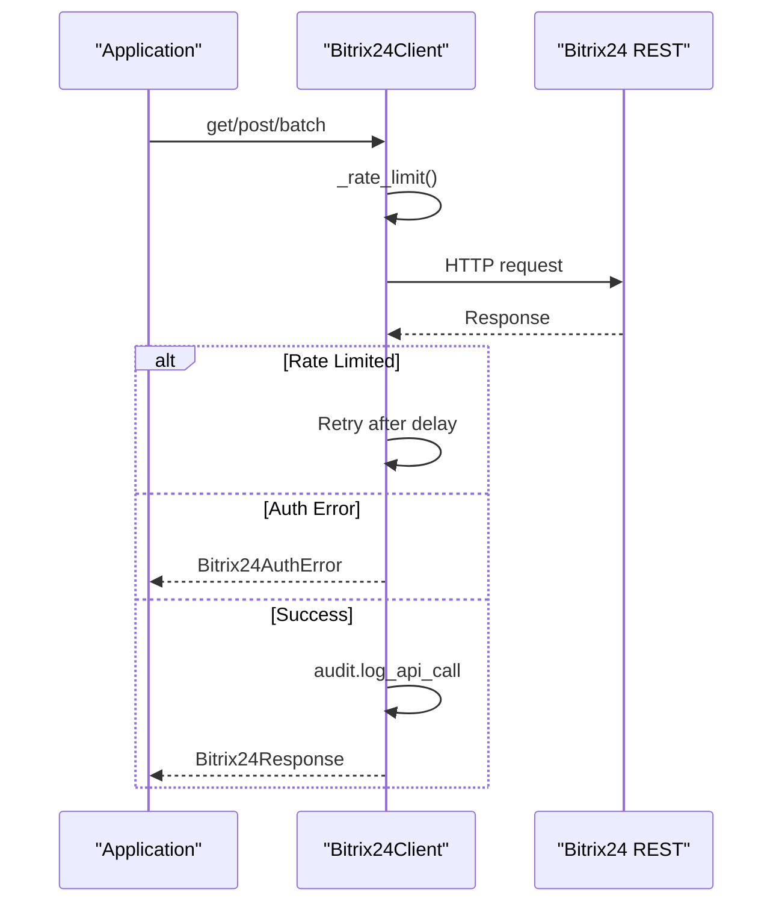
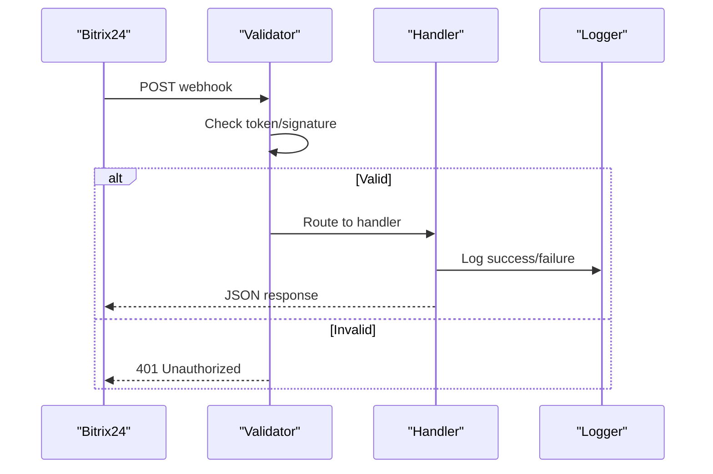
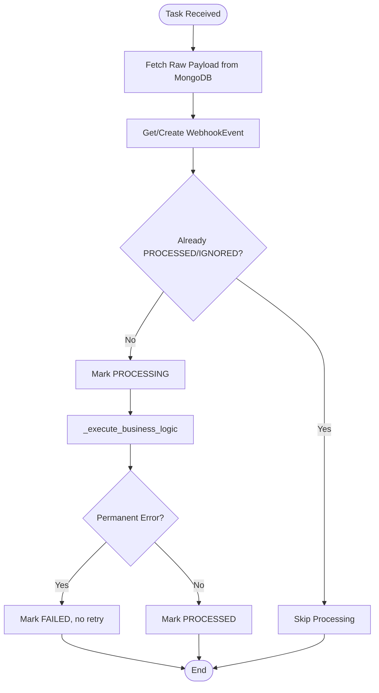
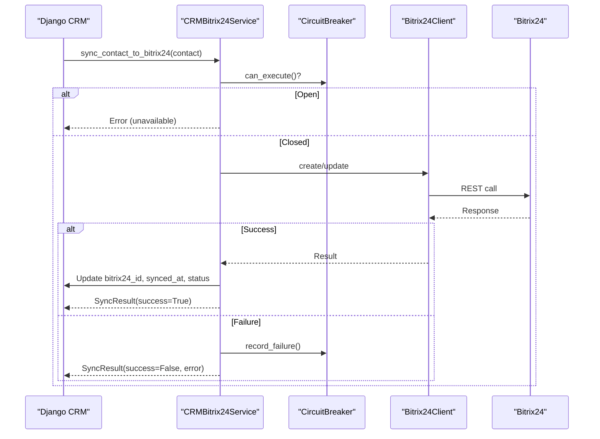
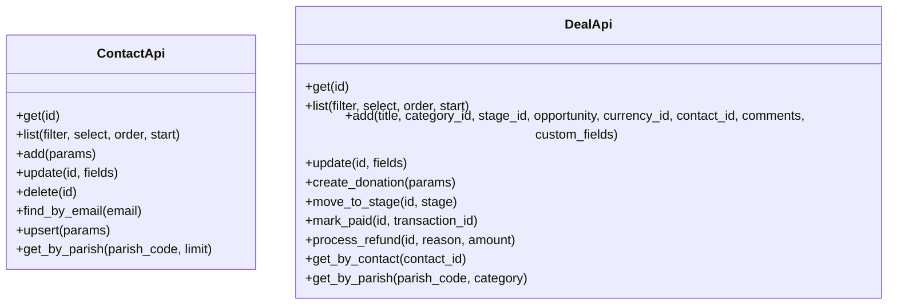
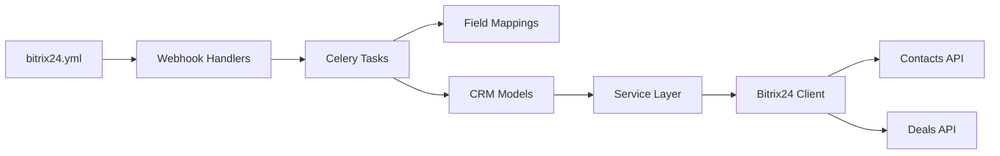

# CRM Integration & Bitrix24 Sync

<cite>
**Referenced Files in This Document**
- [models.py](file://backend/django/apps/crm/models.py)
- [bitrix24_mappings.py](file://backend/django/apps/integrations/bitrix24_mappings.py)
- [client.py](file://backend/integrations/bitrix24/client.py)
- [handlers.py](file://backend/integrations/bitrix24/webhooks/handlers.py)
- [tasks.py](file://backend/django/apps/integrations/tasks.py)
- [bitrix24_service.py](file://backend/django/apps/crm/bitrix24_service.py)
- [contacts.py](file://backend/integrations/bitrix24/api/contacts.py)
- [deals.py](file://backend/integrations/bitrix24/api/deals.py)
- [bitrix24.yml](file://countries/lt/config/bitrix24.yml)
</cite>

## Table of Contents
1. [Introduction](#introduction)
2. [Project Structure](#project-structure)
3. [Core Components](#core-components)
4. [Architecture Overview](#architecture-overview)
5. [Detailed Component Analysis](#detailed-component-analysis)
6. [Dependency Analysis](#dependency-analysis)
7. [Performance Considerations](#performance-considerations)
8. [Troubleshooting Guide](#troubleshooting-guide)
9. [Conclusion](#conclusion)
10. [Appendices](#appendices)

## Introduction
This document explains the CRM integration and Bitrix24 synchronization implemented in the project. It covers contact and deal models, bidirectional sync mechanisms, field mapping configurations, conflict resolution strategies, the Bitrix24 API client, webhook handlers, background job processing with Celery, data transformation pipelines, lead scoring hooks, contact enrichment, communication tracking, and CRM analytics. It also provides guidance for configuring sync rules, handling API rate limits, debugging sync issues, and implementing custom CRM integrations.

## Project Structure
The CRM and Bitrix24 integration spans several modules:
- Django CRM models define tenant-scoped Contact, Lead, Deal, and audit structures with GDPR controls and Bitrix24 sync fields.
- Integrations provide a Bitrix24 REST client, typed APIs for contacts and deals, and webhook handlers.
- Celery tasks process webhooks asynchronously with idempotency, retries, and structured audit logging.
- A service layer abstracts bidirectional sync, circuit breaking, and conflict resolution.
- Country-specific configuration defines portals, entities, webhooks, rate limits, and GDPR settings.

**Diagram sources**
- [models.py:255-744](file://backend/django/apps/crm/models.py#L255-L744)
- [bitrix24_service.py:238-572](file://backend/django/apps/crm/bitrix24_service.py#L238-L572)
- [client.py:91-337](file://backend/integrations/bitrix24/client.py#L91-L337)
- [contacts.py:138-290](file://backend/integrations/bitrix24/api/contacts.py#L138-L290)
- [deals.py:149-386](file://backend/integrations/bitrix24/api/deals.py#L149-L386)
- [handlers.py:63-514](file://backend/integrations/bitrix24/webhooks/handlers.py#L63-L514)
- [tasks.py:93-668](file://backend/django/apps/integrations/tasks.py#L93-L668)
- [bitrix24.yml:1-354](file://countries/lt/config/bitrix24.yml#L1-L354)

**Section sources**
- [models.py:255-744](file://backend/django/apps/crm/models.py#L255-L744)
- [bitrix24_service.py:238-572](file://backend/django/apps/crm/bitrix24_service.py#L238-L572)
- [client.py:91-337](file://backend/integrations/bitrix24/client.py#L91-L337)
- [contacts.py:138-290](file://backend/integrations/bitrix24/api/contacts.py#L138-L290)
- [deals.py:149-386](file://backend/integrations/bitrix24/api/deals.py#L149-L386)
- [handlers.py:63-514](file://backend/integrations/bitrix24/webhooks/handlers.py#L63-L514)
- [tasks.py:93-668](file://backend/django/apps/integrations/tasks.py#L93-L668)
- [bitrix24.yml:1-354](file://countries/lt/config/bitrix24.yml#L1-L354)

## Core Components
- Contact model: Tenant-scoped PII with special category data support, consent tracking, and Bitrix24 sync fields. Includes address, sacramental records, family links, and deceased flags.
- Lead model: Pre-consent pipeline entity with status, source, estimated value, currency, comments, and conversion tracking to Contact.
- Deal model: Financial transactions (donations, mass intentions, services), stages, payment details, and PCI-DSS-aligned audit logging.
- Field mappings: Explicit Bitrix24-to-Django mappings for standard and UF_* custom fields, with validation and type-safe transformations.
- Bitrix24 client: Async HTTP client with rate limiting, retries, batch operations, token refresh, and compliance audit logging.
- Webhook handlers: Validate authenticity, route events, and trigger async processing via Celery.
- Celery tasks: Idempotent processing, transient/permanent error classification, structured audit logs, and retry queues.
- Service layer: Bidirectional sync, circuit breaker, conflict resolution strategies, and mapping between CRM and Bitrix24 entities.
- Configuration: Multi-tenant portal setup, entity modules, custom fields, webhook event types, rate limits, GDPR settings, and localization.

**Section sources**
- [models.py:255-744](file://backend/django/apps/crm/models.py#L255-L744)
- [bitrix24_mappings.py:25-368](file://backend/django/apps/integrations/bitrix24_mappings.py#L25-L368)
- [client.py:91-337](file://backend/integrations/bitrix24/client.py#L91-L337)
- [handlers.py:63-514](file://backend/integrations/bitrix24/webhooks/handlers.py#L63-L514)
- [tasks.py:93-668](file://backend/django/apps/integrations/tasks.py#L93-L668)
- [bitrix24_service.py:238-572](file://backend/django/apps/crm/bitrix24_service.py#L238-L572)
- [bitrix24.yml:1-354](file://countries/lt/config/bitrix24.yml#L1-L354)

## Architecture Overview
The system supports bidirectional synchronization between local CRM and Bitrix24:
- Inbound: Bitrix24 webhooks are received, validated, and processed by Celery tasks that map fields into Django models with explicit whitelists and transformations.
- Outbound: The service layer maps Django models to Bitrix24 payloads, handles create/update flows, updates sync metadata, and logs audit entries.
- Resilience: Circuit breakers protect against cascading failures; rate limiting and retries manage API constraints; idempotency prevents duplicate processing.
- Compliance: Consent tracking, legal hold, audit trails, and GDPR/SOC2 controls are embedded throughout.

**Diagram sources**
- [handlers.py:486-514](file://backend/integrations/bitrix24/webhooks/handlers.py#L486-L514)
- [tasks.py:93-295](file://backend/django/apps/integrations/tasks.py#L93-L295)
- [bitrix24_service.py:302-468](file://backend/django/apps/crm/bitrix24_service.py#L302-L468)
- [client.py:168-337](file://backend/integrations/bitrix24/client.py#L168-L337)

## Detailed Component Analysis

### Data Models: Contact, Lead, Deal
- Contact: Stores PII, special category data, sacramental records, family relationships, deceased flags, and Bitrix24 sync metadata. Enforces unique email per organization and unique Bitrix24 ID when present.
- Lead: Tracks pre-qualification pipeline with status, source, estimated value, currency, comments, and conversion linkage to Contact.
- Deal: Captures financial transactions, stages, payment methods, donation specifics, mass intention details, contract dates, and auto-generated deal numbers. Includes PCI-DSS-aligned audit logging on payment marking.

**Diagram sources**
- [models.py:71-253](file://backend/django/apps/crm/models.py#L71-L253)
- [models.py:255-375](file://backend/django/apps/crm/models.py#L255-L375)
- [models.py:377-521](file://backend/django/apps/crm/models.py#L377-L521)
- [models.py:523-744](file://backend/django/apps/crm/models.py#L523-L744)

**Section sources**
- [models.py:255-744](file://backend/django/apps/crm/models.py#L255-L744)

### Field Mapping and Transformation Pipeline
- Explicit mappings from Bitrix24 FIELDS and UF_* custom fields to Django model attributes.
- Whitelist validation rejects unknown fields to prevent data leakage from undocumented API changes.
- Type-safe transformations for dates, decimals, multi-value fields (EMAIL, PHONE), and source IDs.
- Consent detection from Bitrix24 custom fields updates consent status and versioning.

**Diagram sources**
- [bitrix24_mappings.py:25-368](file://backend/django/apps/integrations/bitrix24_mappings.py#L25-L368)
- [tasks.py:297-427](file://backend/django/apps/integrations/tasks.py#L297-L427)

**Section sources**
- [bitrix24_mappings.py:25-368](file://backend/django/apps/integrations/bitrix24_mappings.py#L25-L368)
- [tasks.py:297-427](file://backend/django/apps/integrations/tasks.py#L297-L427)

### Bitrix24 API Client
- Async client with rate limiting, exponential backoff, and batch request support.
- Handles authentication errors, token refresh, and API error categorization.
- Audits successful calls and logs failures with context (entity type, ID).

**Diagram sources**
- [client.py:91-337](file://backend/integrations/bitrix24/client.py#L91-L337)

**Section sources**
- [client.py:91-337](file://backend/integrations/bitrix24/client.py#L91-L337)

### Webhook Handlers
- Validates application token and optional HMAC signature.
- Routes events to specific handlers for contacts, deals, and calendar entries.
- Performs soft deletes for deletions and logs all processing for compliance.

**Diagram sources**
- [handlers.py:100-153](file://backend/integrations/bitrix24/webhooks/handlers.py#L100-L153)
- [handlers.py:171-420](file://backend/integrations/bitrix24/webhooks/handlers.py#L171-L420)

**Section sources**
- [handlers.py:63-514](file://backend/integrations/bitrix24/webhooks/handlers.py#L63-L514)

### Background Job Processing with Celery
- Idempotent processing using idempotency keys and early exit for already processed events.
- Transient vs permanent error classification drives retries vs failure marking.
- Structured audit logs capture actor, action, resource type, event type, entity ID, and tenant ID without PII.

**Diagram sources**
- [tasks.py:93-295](file://backend/django/apps/integrations/tasks.py#L93-L295)

**Section sources**
- [tasks.py:93-295](file://backend/django/apps/integrations/tasks.py#L93-L295)

### Bidirectional Sync and Conflict Resolution
- Outbound sync maps Django models to Bitrix24 payloads, creates or updates entities, and persists sync metadata.
- Conflict resolution strategies include local wins, remote wins, latest wins, and manual review.
- Circuit breaker protects against repeated failures and allows half-open recovery attempts.

**Diagram sources**
- [bitrix24_service.py:238-572](file://backend/django/apps/crm/bitrix24_service.py#L238-L572)

**Section sources**
- [bitrix24_service.py:238-572](file://backend/django/apps/crm/bitrix24_service.py#L238-L572)

### Contacts and Deals API Modules
- Contacts API: CRUD operations, upsert by email, parish-scoped queries, and GDPR-compliant audit logging for create/update/delete.
- Deals API: CRUD operations, donation creation with PCI-DSS logging, stage transitions, refund processing, and parish-scoped queries.

**Diagram sources**
- [contacts.py:138-290](file://backend/integrations/bitrix24/api/contacts.py#L138-L290)
- [deals.py:149-386](file://backend/integrations/bitrix24/api/deals.py#L149-L386)

**Section sources**
- [contacts.py:138-290](file://backend/integrations/bitrix24/api/contacts.py#L138-L290)
- [deals.py:149-386](file://backend/integrations/bitrix24/api/deals.py#L149-L386)

### Configuration and Sync Rules
- Portals: Primary and diocese-specific domains with EU data residency and GDPR compliance flags.
- Entity modules: Enabled CRM modules per entity type (basilica, cathedral, diocese, church, funeral home, cemetery service).
- Custom fields: Enumerations and encrypted files for sensitive data (e.g., sacramental records).
- Webhooks: Event types, HMAC signature verification, retry policy with backoff.
- Rate limits: Requests per second, batch size, daily limits.
- Sync direction: Bidirectional with server-wins conflict resolution and soft delete retention.
- GDPR: Consent tracking, right to erasure, data export, audit log retention.

**Section sources**
- [bitrix24.yml:1-354](file://countries/lt/config/bitrix24.yml#L1-L354)

## Dependency Analysis
- Models depend on Organization for tenant isolation and on core base models for timestamps and common fields.
- Service layer depends on Bitrix24 client and models for mapping and persistence.
- Webhook handlers depend on settings for secrets and tokens, and on Celery tasks for async processing.
- Tasks depend on mappings for validation and transformation, and on models for persistence.
- Config drives portal selection, webhook routing, and rate limiting behavior.

**Diagram sources**
- [bitrix24.yml:1-354](file://countries/lt/config/bitrix24.yml#L1-L354)
- [handlers.py:63-514](file://backend/integrations/bitrix24/webhooks/handlers.py#L63-L514)
- [tasks.py:93-668](file://backend/django/apps/integrations/tasks.py#L93-L668)
- [bitrix24_mappings.py:25-368](file://backend/django/apps/integrations/bitrix24_mappings.py#L25-L368)
- [bitrix24_service.py:238-572](file://backend/django/apps/crm/bitrix24_service.py#L238-L572)
- [client.py:91-337](file://backend/integrations/bitrix24/client.py#L91-L337)
- [contacts.py:138-290](file://backend/integrations/bitrix24/api/contacts.py#L138-L290)
- [deals.py:149-386](file://backend/integrations/bitrix24/api/deals.py#L149-L386)

**Section sources**
- [bitrix24.yml:1-354](file://countries/lt/config/bitrix24.yml#L1-L354)
- [handlers.py:63-514](file://backend/integrations/bitrix24/webhooks/handlers.py#L63-L514)
- [tasks.py:93-668](file://backend/django/apps/integrations/tasks.py#L93-L668)
- [bitrix24_mappings.py:25-368](file://backend/django/apps/integrations/bitrix24_mappings.py#L25-L368)
- [bitrix24_service.py:238-572](file://backend/django/apps/crm/bitrix24_service.py#L238-L572)
- [client.py:91-337](file://backend/integrations/bitrix24/client.py#L91-L337)
- [contacts.py:138-290](file://backend/integrations/bitrix24/api/contacts.py#L138-L290)
- [deals.py:149-386](file://backend/integrations/bitrix24/api/deals.py#L149-L386)

## Performance Considerations
- Rate limiting: Enforced per-second limits with configurable thresholds; handle 429 responses with retry-after delays.
- Batch requests: Use batch endpoints to reduce overhead for multiple operations.
- Circuit breaker: Prevents cascading failures during outages; allows half-open recovery.
- Idempotency: Prevents duplicate processing via idempotency keys and early exits.
- Indexes: Database indexes on organization, email, bitrix24_id, and sync status improve query performance.
- Lazy loading: API modules and audit logger are lazily initialized to avoid circular dependencies.

[No sources needed since this section provides general guidance]

## Troubleshooting Guide
Common issues and resolutions:
- Authentication failures: Ensure access token and refresh credentials are configured; handle token refresh flow.
- Rate limit exceeded: Adjust rate_limit_per_second and implement retry logic with backoff; monitor 429 responses.
- Unknown fields rejected: Update allowed field sets in mappings if Bitrix24 introduces new fields; validate before syncing.
- Webhook signature mismatch: Verify HMAC secret and header names match configuration.
- Duplicate processing: Confirm idempotency key usage and early exit conditions in tasks.
- Failed syncs: Inspect structured audit logs and task error fields; use retry queue for transient failures.

**Section sources**
- [client.py:246-337](file://backend/integrations/bitrix24/client.py#L246-L337)
- [handlers.py:100-153](file://backend/integrations/bitrix24/webhooks/handlers.py#L100-L153)
- [tasks.py:240-295](file://backend/django/apps/integrations/tasks.py#L240-L295)
- [bitrix24_mappings.py:323-345](file://backend/django/apps/integrations/bitrix24_mappings.py#L323-L345)

## Conclusion
The CRM integration provides a robust, compliant, and resilient bridge between local Django CRM and Bitrix24. It enforces explicit field mappings, tenant isolation, consent tracking, and auditability while supporting bidirectional sync, conflict resolution, and scalable background processing. Configuration-driven setup enables multi-tenant deployments with region-specific data residency and GDPR controls.

[No sources needed since this section summarizes without analyzing specific files]

## Appendices

### Example: Configuring Sync Rules
- Define portals and regions in configuration file.
- Enable required CRM modules per entity type.
- Configure webhook event types and authentication method.
- Set rate limits and sync direction with conflict resolution strategy.
- Enable GDPR features like consent tracking and right to erasure.

**Section sources**
- [bitrix24.yml:1-354](file://countries/lt/config/bitrix24.yml#L1-L354)

### Example: Handling API Rate Limits
- Use client rate limiter to enforce per-second limits.
- Implement retry logic with exponential backoff on 429 responses.
- Monitor circuit breaker state and adjust thresholds as needed.

**Section sources**
- [client.py:323-337](file://backend/integrations/bitrix24/client.py#L323-L337)
- [bitrix24_service.py:71-107](file://backend/django/apps/crm/bitrix24_service.py#L71-L107)

### Example: Debugging Sync Issues
- Inspect webhook handler logs for validation and routing.
- Check Celery task status and error fields for failed events.
- Review structured audit logs for actor, action, and resource details.
- Validate field mappings and allowlists for unexpected changes.

**Section sources**
- [handlers.py:154-170](file://backend/integrations/bitrix24/webhooks/handlers.py#L154-L170)
- [tasks.py:45-74](file://backend/django/apps/integrations/tasks.py#L45-L74)
- [tasks.py:240-295](file://backend/django/apps/integrations/tasks.py#L240-L295)

### Example: Implementing Custom CRM Integrations
- Extend field mappings with new UF_* fields and add to allowed sets.
- Add new entity types in event routing maps and operation maps.
- Implement handlers for new event types in webhook handlers.
- Update service layer mappings and conflict resolution strategies.

**Section sources**
- [bitrix24_mappings.py:25-163](file://backend/django/apps/integrations/bitrix24_mappings.py#L25-L163)
- [handlers.py:84-99](file://backend/integrations/bitrix24/webhooks/handlers.py#L84-L99)
- [bitrix24_service.py:249-274](file://backend/django/apps/crm/bitrix24_service.py#L249-L274)