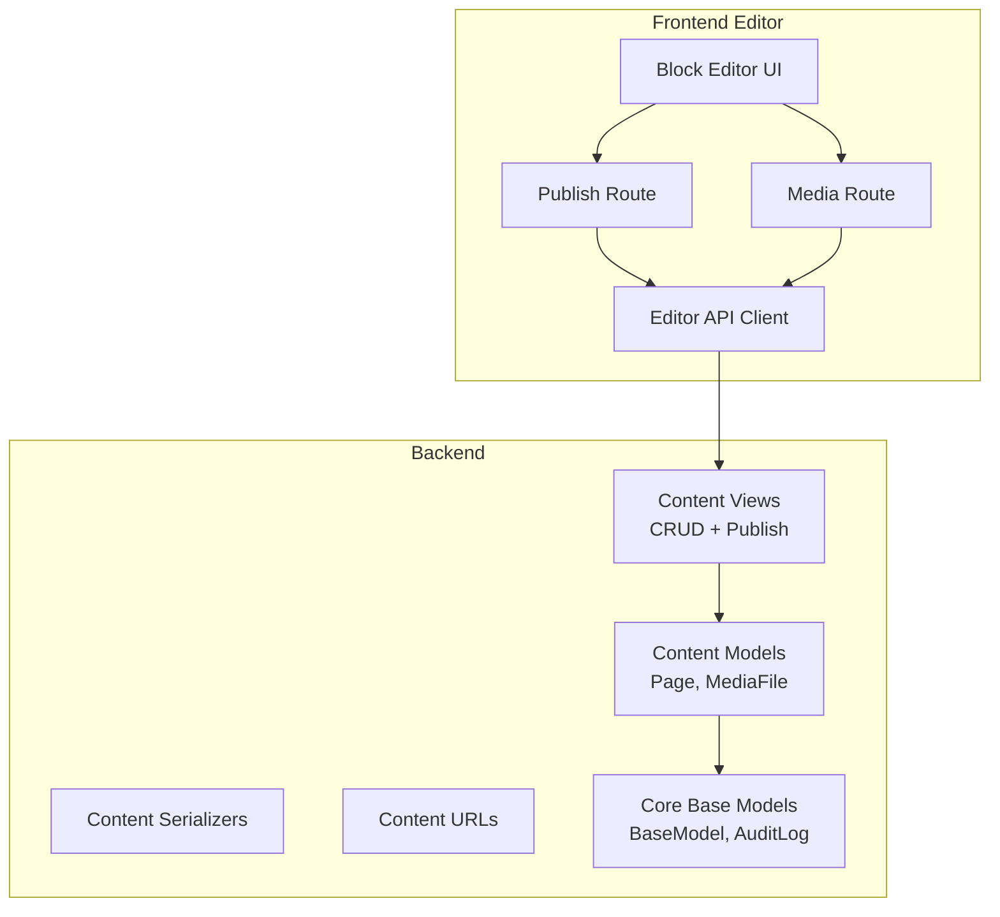
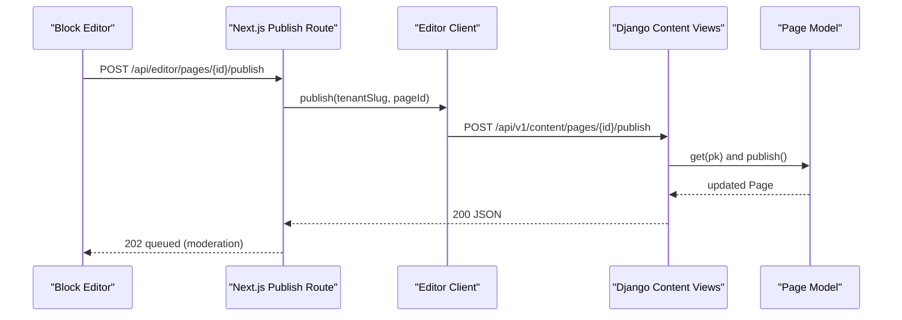
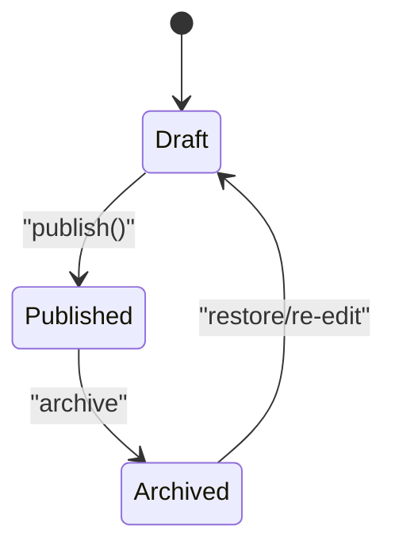
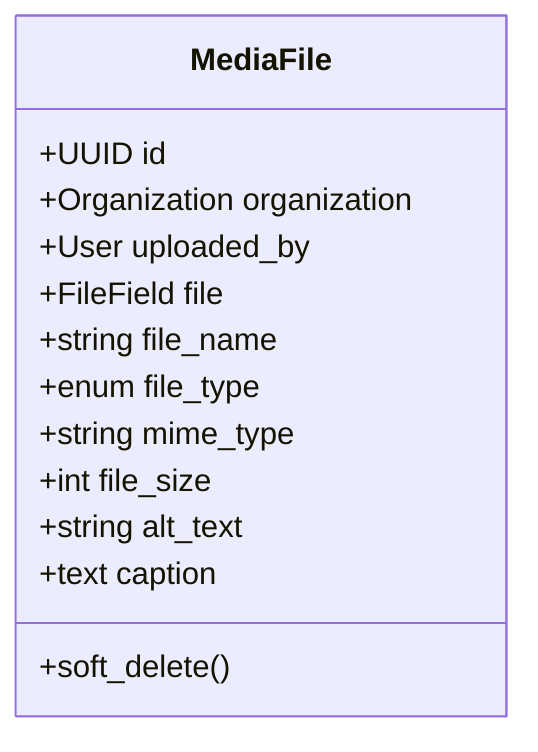
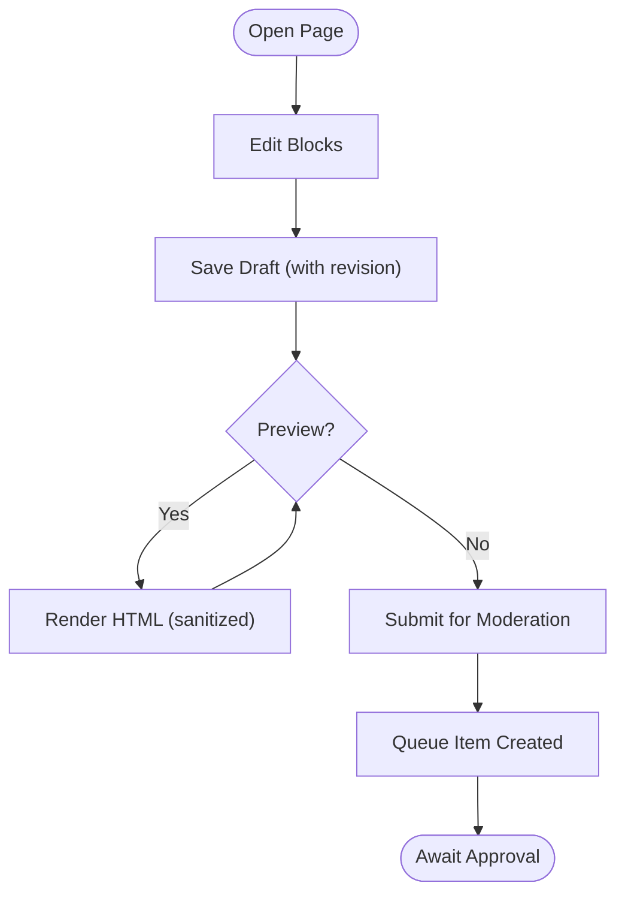
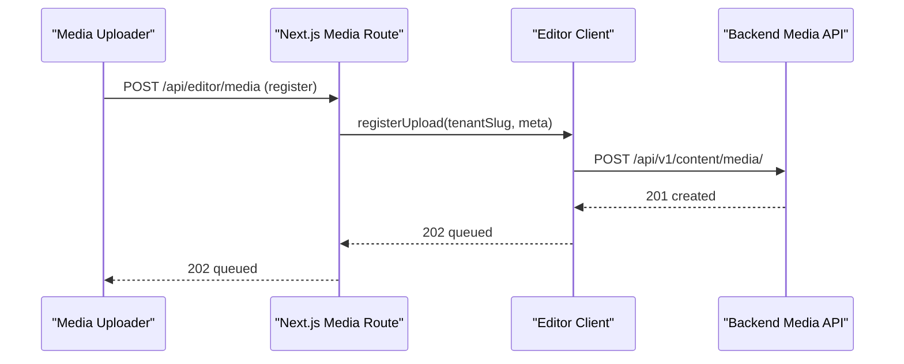
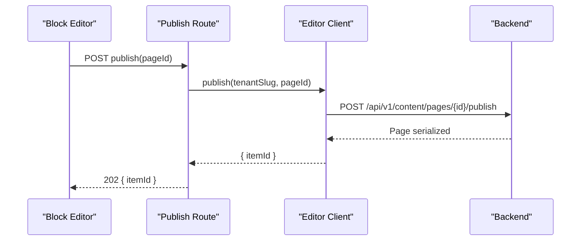
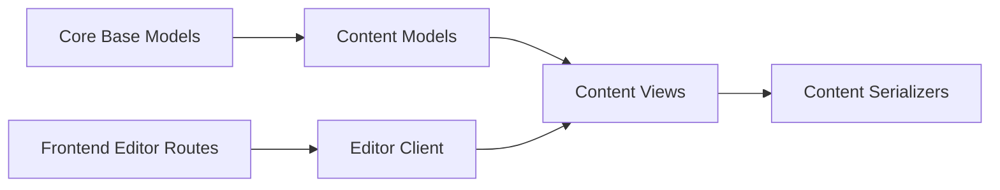

# Content Management System

<cite>
**Referenced Files in This Document**
- [models.py](file://backend/django/apps/content/models.py)
- [views.py](file://backend/django/apps/content/views.py)
- [serializers.py](file://backend/django/apps/content/serializers.py)
- [urls.py](file://backend/django/apps/content/urls.py)
- [admin.py](file://backend/django/apps/content/admin.py)
- [core_models.py](file://backend/django/apps/core/models.py)
- [core_serializers.py](file://backend/django/apps/core/serializers.py)
- [openapi-spec.yaml](file://docs/api/openapi-spec.yaml)
- [BlockEditor.tsx](file://frontend/apps/template-renderer/src/components/editor/BlockEditor.tsx)
- [publish route.ts](file://frontend/apps/template-renderer/src/app/api/editor/pages/[pageId]/publish/route.ts)
- [editor-api.ts](file://frontend/apps/template-renderer/src/lib/editor/editor-api.ts)
- [media route.ts](file://frontend/apps/template-renderer/src/app/api/editor/media/route.ts)
</cite>

## Table of Contents
1. Introduction
2. Project Structure
3. Core Components
4. Architecture Overview
5. Detailed Component Analysis
6. Dependency Analysis
7. Performance Considerations
8. Troubleshooting Guide
9. Conclusion
10. Appendices

## Introduction
This document describes the Content Management System (CMS) for JOL-HUB, focusing on content models (pages and media assets), versioning and moderation workflows, rich text editing, media upload and processing, multi-language support, API endpoints for content operations, admin interface capabilities, and extensibility patterns for custom content types and integrations.

The CMS provides:
- A robust Page model with status-based lifecycle (draft/published/archived), language scoping, templates, and SEO fields.
- A MediaFile model for asset management with metadata and organization isolation.
- RESTful APIs for listing, creating, updating, deleting, and publishing pages, as well as managing media assets.
- A front-end editor that supports block-based editing, draft save/preview, publish-to-moderation, and a quarantine-first media pipeline.
- An admin interface to manage pages and media efficiently.

## Project Structure
At a high level, the CMS is implemented as a Django app under backend/django/apps/content with supporting core abstractions in apps/core. The front-end editor lives in frontend/apps/template-renderer and exposes Next.js routes that proxy editor actions to the backend via an editor client.

**Diagram sources**
- [models.py:13-119](file://backend/django/apps/content/models.py#L13-L119)
- [views.py:14-84](file://backend/django/apps/content/views.py#L14-L84)
- [serializers.py:10-51](file://backend/django/apps/content/serializers.py#L10-L51)
- [urls.py:6-12](file://backend/django/apps/content/urls.py#L6-L12)
- [core_models.py:36-65](file://backend/django/apps/core/models.py#L36-L65)
- [BlockEditor.tsx:257-289](file://frontend/apps/template-renderer/src/components/editor/BlockEditor.tsx#L257-L289)
- [publish route.ts:14-43](file://frontend/apps/template-renderer/src/app/api/editor/pages/[pageId]/publish/route.ts#L14-L43)
- [media route.ts:30-73](file://frontend/apps/template-renderer/src/app/api/editor/media/route.ts#L30-L73)
- [editor-api.ts:101-127](file://frontend/apps/template-renderer/src/lib/editor/editor-api.ts#L101-L127)

**Section sources**
- [models.py:13-202](file://backend/django/apps/content/models.py#L13-L202)
- [views.py:14-84](file://backend/django/apps/content/views.py#L14-L84)
- [serializers.py:10-51](file://backend/django/apps/content/serializers.py#L10-L51)
- [urls.py:6-12](file://backend/django/apps/content/urls.py#L6-L12)
- [core_models.py:36-65](file://backend/django/apps/core/models.py#L36-L65)
- [BlockEditor.tsx:257-289](file://frontend/apps/template-renderer/src/components/editor/BlockEditor.tsx#L257-L289)
- [publish route.ts:14-43](file://frontend/apps/template-renderer/src/app/api/editor/pages/[pageId]/publish/route.ts#L14-L43)
- [media route.ts:30-73](file://frontend/apps/template-renderer/src/app/api/editor/media/route.ts#L30-L73)
- [editor-api.ts:101-127](file://frontend/apps/template-renderer/src/lib/editor/editor-api.ts#L101-L127)

## Core Components
- Page: Represents a translatable website page with hierarchical structure, status lifecycle, template selection, SEO fields, and optional featured image. Supports soft-delete and tenant isolation.
- MediaFile: Stores uploaded assets with type classification, metadata, and organization scoping. Also supports soft-delete and tenant isolation.
- Base models: Provide UUID primary keys, timestamps, soft-delete, and audit logging infrastructure used across the system.

Key behaviors:
- Publishing sets status to published and records published_at.
- Soft delete marks records inactive without removing them from the database.
- Tenant validation prevents cross-tenant data manipulation at the model layer.

**Section sources**
- [models.py:13-119](file://backend/django/apps/content/models.py#L13-L119)
- [models.py:121-202](file://backend/django/apps/content/models.py#L121-L202)
- [core_models.py:36-65](file://backend/django/apps/core/models.py#L36-L65)

## Architecture Overview
The CMS follows a layered architecture:
- Frontend editor components trigger actions like saving drafts, previewing, and publishing to moderation.
- Next.js routes validate inputs and call an editor client which communicates with backend endpoints.
- Backend views handle CRUD and publishing logic, using serializers to enforce input/output contracts.
- Models encapsulate business rules, including status transitions and tenant isolation.

**Diagram sources**
- [publish route.ts:14-43](file://frontend/apps/template-renderer/src/app/api/editor/pages/[pageId]/publish/route.ts#L14-L43)
- [editor-api.ts:115-118](file://frontend/apps/template-renderer/src/lib/editor/editor-api.ts#L115-L118)
- [views.py:47-55](file://backend/django/apps/content/views.py#L47-L55)
- [models.py:114-119](file://backend/django/apps/content/models.py#L114-L119)

## Detailed Component Analysis

### Page Model and Lifecycle
- Fields include title, slug, content, excerpt, language, template, status, published_at, SEO fields, sort_order, and extra JSON.
- Status choices: draft, published, archived.
- Unique constraint per organization, slug, and language ensures multilingual uniqueness.
- publish() method updates status and timestamp.

**Diagram sources**
- [models.py:16-24](file://backend/django/apps/content/models.py#L16-L24)
- [models.py:114-119](file://backend/django/apps/content/models.py#L114-L119)

**Section sources**
- [models.py:13-119](file://backend/django/apps/content/models.py#L13-L119)

### Media Asset Model
- Tracks file storage path, name, type, MIME type, size, alt text, caption.
- Organization-scoped and user-tracked for provenance.
- Soft-delete supported via base model.

**Diagram sources**
- [models.py:121-202](file://backend/django/apps/content/models.py#L121-L202)

**Section sources**
- [models.py:121-202](file://backend/django/apps/content/models.py#L121-L202)

### API Endpoints
- Pages
  - GET /api/v1/content/pages/: list with filters (organization_id, language, status).
  - POST /api/v1/content/pages/: create page; author auto-set from request context.
  - GET /api/v1/content/pages/{id}: retrieve page details.
  - PATCH /api/v1/content/pages/{id}: update page.
  - DELETE /api/v1/content/pages/{id}: soft delete.
  - POST /api/v1/content/pages/{id}/publish: set status to published and record published_at.
- Media
  - GET /api/v1/content/media/: list media with optional organization filter.
  - POST /api/v1/content/media/: create media entry; uploader auto-set.
  - GET /api/v1/content/media/{id}: retrieve media details.
  - DELETE /api/v1/content/media/{id}: soft delete.

Authentication: All endpoints require authentication (Bearer token). Rate limiting applies as documented in the OpenAPI spec.

**Section sources**
- [views.py:14-84](file://backend/django/apps/content/views.py#L14-L84)
- [serializers.py:10-51](file://backend/django/apps/content/serializers.py#L10-L51)
- [urls.py:6-12](file://backend/django/apps/content/urls.py#L6-L12)
- [openapi-spec.yaml:1-27](file://docs/api/openapi-spec.yaml#L1-L27)

### Rich Text Editing and Versioning
- Block-based editor supports saving drafts, preview mode, and publishing for moderation.
- Drafts are saved with revision tracking; publishing submits content to moderation rather than immediate publication.
- The editor client provides methods for getting drafts, saving drafts, publishing, and querying moderation queue.

**Diagram sources**
- [BlockEditor.tsx:257-289](file://frontend/apps/template-renderer/src/components/editor/BlockEditor.tsx#L257-L289)
- [editor-api.ts:101-127](file://frontend/apps/template-renderer/src/lib/editor/editor-api.ts#L101-L127)
- [publish route.ts:14-43](file://frontend/apps/template-renderer/src/app/api/editor/pages/[pageId]/publish/route.ts#L14-L43)

**Section sources**
- [BlockEditor.tsx:257-289](file://frontend/apps/template-renderer/src/components/editor/BlockEditor.tsx#L257-L289)
- [editor-api.ts:101-127](file://frontend/apps/template-renderer/src/lib/editor/editor-api.ts#L101-L127)
- [publish route.ts:14-43](file://frontend/apps/template-renderer/src/app/api/editor/pages/[pageId]/publish/route.ts#L14-L43)

### Media Upload and Processing
- Frontend media route registers uploads with metadata (filename, MIME type, size, alt text).
- Uploads enter a quarantine-first pipeline; files do not go live until approved after scanning and moderation.
- Admin can review quarantine items and approve or reject based on scan/AI results.

**Diagram sources**
- [media route.ts:30-73](file://frontend/apps/template-renderer/src/app/api/editor/media/route.ts#L30-L73)
- [editor-api.ts:115-118](file://frontend/apps/template-renderer/src/lib/editor/editor-api.ts#L115-L118)
- [views.py:58-73](file://backend/django/apps/content/views.py#L58-L73)

**Section sources**
- [media route.ts:30-73](file://frontend/apps/template-renderer/src/app/api/editor/media/route.ts#L30-L73)
- [views.py:58-73](file://backend/django/apps/content/views.py#L58-L73)

### Content Approval Workflows
- Publishing triggers a moderation queue item instead of immediate publication.
- The response includes a queue item ID for tracking approval status.
- Admin can view and act on moderation queue items through the editor’s moderation endpoints.

**Diagram sources**
- [publish route.ts:14-43](file://frontend/apps/template-renderer/src/app/api/editor/pages/[pageId]/publish/route.ts#L14-L43)
- [editor-api.ts:115-118](file://frontend/apps/template-renderer/src/lib/editor/editor-api.ts#L115-L118)
- [views.py:47-55](file://backend/django/apps/content/views.py#L47-L55)

**Section sources**
- [publish route.ts:14-43](file://frontend/apps/template-renderer/src/app/api/editor/pages/[pageId]/publish/route.ts#L14-L43)
- [views.py:47-55](file://backend/django/apps/content/views.py#L47-L55)

### Multi-Language Support
- Pages store a language code and are unique per organization/slug/language combination.
- List endpoints support filtering by language.
- Templates and content can be localized per language.

**Section sources**
- [models.py:41-68](file://backend/django/apps/content/models.py#L41-L68)
- [views.py:22-33](file://backend/django/apps/content/views.py#L22-L33)

### Admin Interface
- Django admin provides list views, filters, search, and read-only timestamps for Pages and MediaFiles.
- Prepopulated slugs and raw ID fields streamline administration.

**Section sources**
- [admin.py:5-22](file://backend/django/apps/content/admin.py#L5-L22)

### Extensibility: Custom Content Types and Integrations
- Use the existing Page model as a base pattern: define domain-specific models extending BaseModel, add organization scoping, and implement status workflows.
- Create serializers and views following the established patterns for CRUD and specialized actions (e.g., publish).
- Register admin classes for efficient management.
- For external content integration, follow the editor client pattern: validate inputs, call backend endpoints, and handle error responses consistently.

[No sources needed since this section provides general guidance]

## Dependency Analysis
The CMS components have clear separation of concerns:
- Models depend on core abstractions for IDs, timestamps, and soft-delete.
- Views depend on models and serializers for request handling and serialization.
- Serializers depend on core serializer base classes.
- Frontend editor routes depend on an editor client that calls backend endpoints.

**Diagram sources**
- [core_models.py:36-65](file://backend/django/apps/core/models.py#L36-L65)
- [models.py:13-202](file://backend/django/apps/content/models.py#L13-L202)
- [views.py:14-84](file://backend/django/apps/content/views.py#L14-L84)
- [serializers.py:10-51](file://backend/django/apps/content/serializers.py#L10-L51)
- [editor-api.ts:101-127](file://frontend/apps/template-renderer/src/lib/editor/editor-api.ts#L101-L127)

**Section sources**
- [core_models.py:36-65](file://backend/django/apps/core/models.py#L36-L65)
- [models.py:13-202](file://backend/django/apps/content/models.py#L13-L202)
- [views.py:14-84](file://backend/django/apps/content/views.py#L14-L84)
- [serializers.py:10-51](file://backend/django/apps/content/serializers.py#L10-L51)
- [editor-api.ts:101-127](file://frontend/apps/template-renderer/src/lib/editor/editor-api.ts#L101-L127)

## Performance Considerations
- Query optimization: Use select_related for related fields (author, featured_image) when listing pages to reduce N+1 queries.
- Indexes: Leverage indexes on organization, status, and language for faster filtering.
- Soft-delete filtering: Ensure all queries exclude deleted records to avoid unnecessary processing.
- Rate limiting: Respect API rate limits to maintain stability under load.

[No sources needed since this section provides general guidance]

## Troubleshooting Guide
Common issues and resolutions:
- Cross-tenant access attempts: Model-level tenant validation raises errors if organization does not match current tenant context. Check tenant middleware and ensure correct context propagation.
- Authentication failures: Ensure Bearer tokens are included in requests; verify OAuth configuration and token validity.
- Validation errors: Review request payloads against serializer field requirements; ensure required fields are present and correctly typed.
- Moderation queue delays: Publishing returns a queue item ID; monitor queue status via moderation endpoints and investigate any AI scan or human review bottlenecks.

**Section sources**
- [models.py:82-113](file://backend/django/apps/content/models.py#L82-L113)
- [models.py:173-201](file://backend/django/apps/content/models.py#L173-L201)
- [openapi-spec.yaml:1-27](file://docs/api/openapi-spec.yaml#L1-L27)

## Conclusion
The CMS provides a solid foundation for managing pages and media assets with strong tenant isolation, status-driven lifecycles, and moderation workflows. The front-end editor integrates seamlessly with backend APIs to support block-based editing, draft management, and secure media uploads. Extensibility patterns enable adding new content types and integrating external sources while maintaining consistency and security.

[No sources needed since this section summarizes without analyzing specific files]

## Appendices

### API Reference Summary
- Pages
  - GET /api/v1/content/pages/: list with filters
  - POST /api/v1/content/pages/: create page
  - GET /api/v1/content/pages/{id}: retrieve page
  - PATCH /api/v1/content/pages/{id}: update page
  - DELETE /api/v1/content/pages/{id}: soft delete
  - POST /api/v1/content/pages/{id}/publish: publish page
- Media
  - GET /api/v1/content/media/: list media
  - POST /api/v1/content/media/: create media
  - GET /api/v1/content/media/{id}: retrieve media
  - DELETE /api/v1/content/media/{id}: soft delete

**Section sources**
- [urls.py:6-12](file://backend/django/apps/content/urls.py#L6-L12)
- [views.py:14-84](file://backend/django/apps/content/views.py#L14-L84)
- [openapi-spec.yaml:1-27](file://docs/api/openapi-spec.yaml#L1-L27)