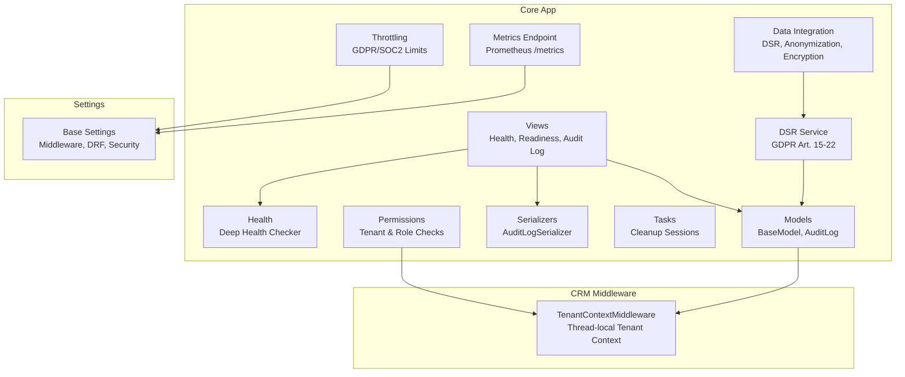
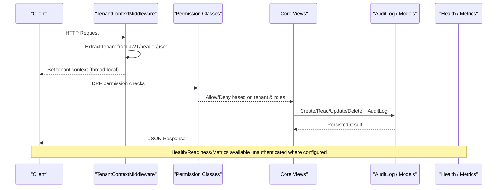
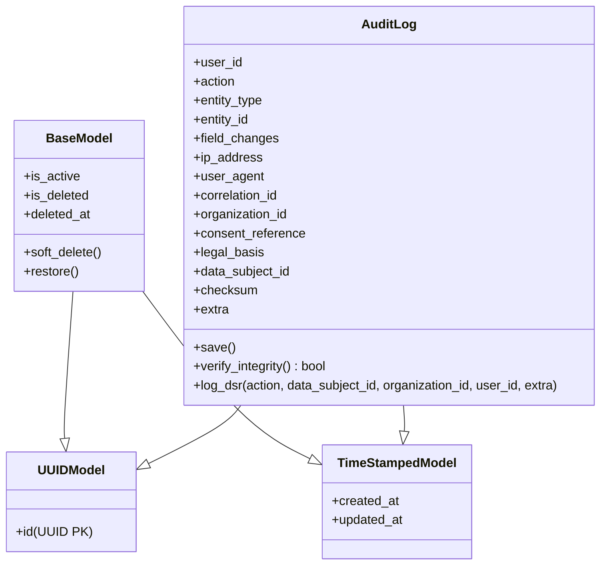
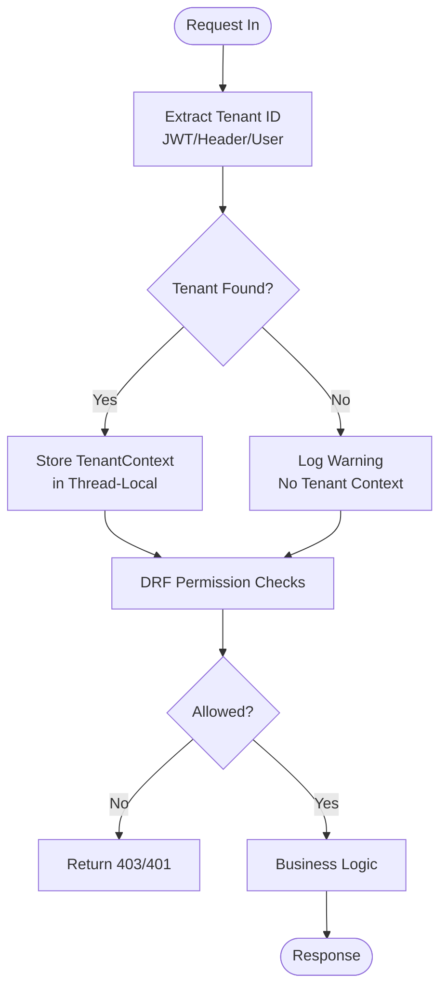
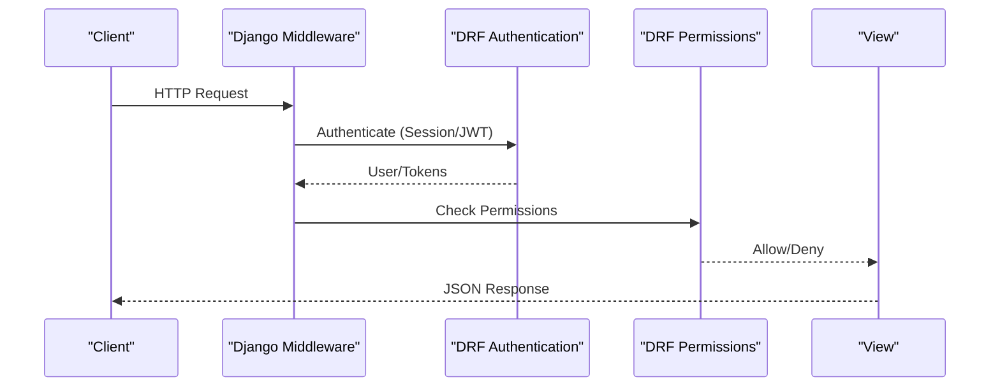
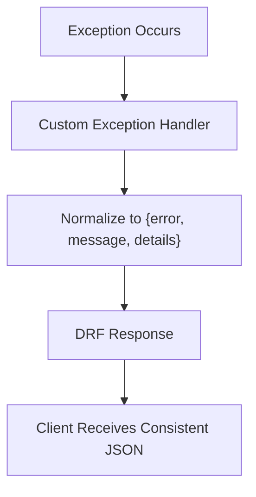
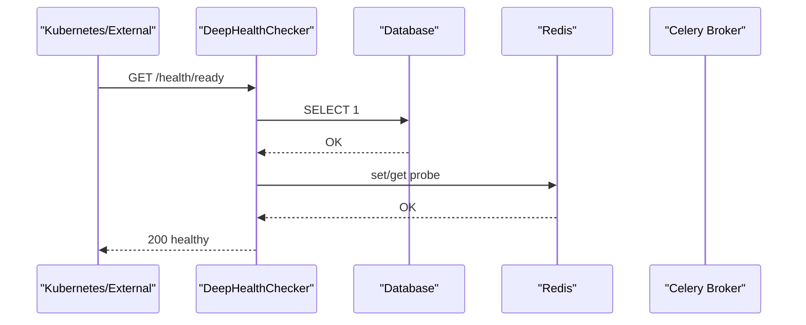
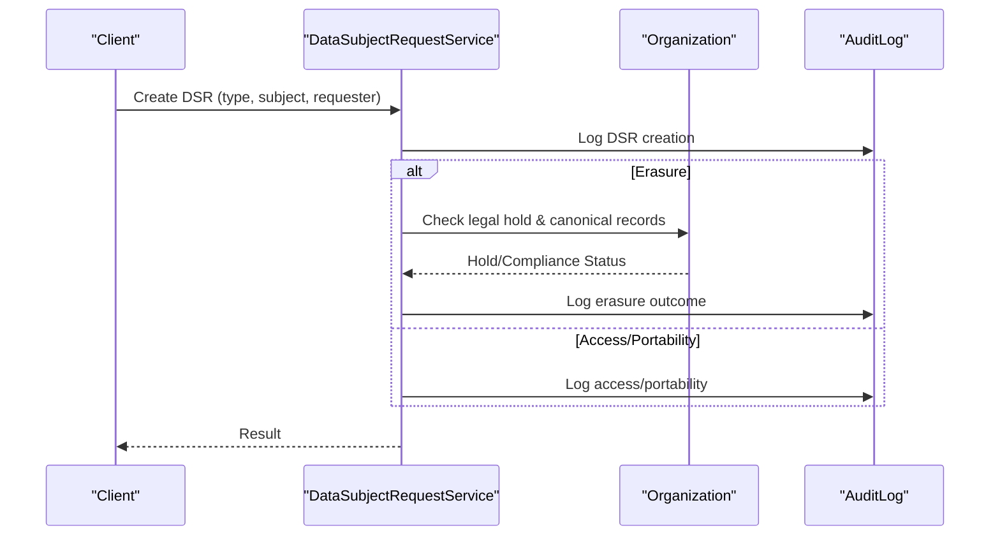
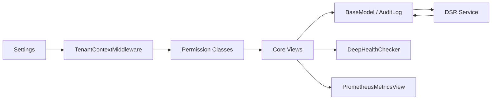

# Core Application

<cite>
**Referenced Files in This Document**
- [models.py](file://backend/django/apps/core/models.py)
- [permissions.py](file://backend/django/apps/core/permissions.py)
- [middleware.py](file://backend/django/apps/crm/middleware.py)
- [base.py](file://backend/django/core/settings/base.py)
- [exceptions.py](file://backend/django/apps/core/exceptions.py)
- [views.py](file://backend/django/apps/core/views.py)
- [serializers.py](file://backend/django/apps/core/serializers.py)
- [tasks.py](file://backend/django/apps/core/tasks.py)
- [throttling.py](file://backend/django/apps/core/throttling.py)
- [health.py](file://backend/django/apps/core/health.py)
- [metrics_endpoint.py](file://backend/django/apps/core/metrics_endpoint.py)
- [data_integration.py](file://backend/django/apps/core/data_integration.py)
- [dsr_service.py](file://backend/django/apps/core/dsr_service.py)
</cite>

## Table of Contents
1. Introduction
2. Project Structure
3. Core Components
4. Architecture Overview
5. Detailed Component Analysis
6. Dependency Analysis
7. Performance Considerations
8. Troubleshooting Guide
9. Conclusion
10. Appendices

## Introduction
This document describes the Django Core application that provides foundational functionality across all JOL-HUB services. It focuses on:
- Abstract base models with UUID primary keys, timestamps, and soft-delete support
- AuditLog for GDPR-compliant, tamper-evident audit trails
- Multi-tenant isolation via middleware and permission classes
- Request processing stack, authentication decorators, and security measures
- Configuration management, error handling patterns, and shared utilities
- Examples for extending core functionality and implementing custom middleware

## Project Structure
The core is implemented under backend/django/apps/core and integrates with tenant context from apps.crm.middleware. Settings are centralized in core/settings/base.py and include middleware ordering, REST framework configuration, rate limiting, and observability endpoints.

**Diagram sources**
- [base.py:121-145](file://backend/django/core/settings/base.py#L121-L145)
- [middleware.py:96-154](file://backend/django/apps/crm/middleware.py#L96-L154)
- [models.py:36-65](file://backend/django/apps/core/models.py#L36-L65)
- [models.py:67-227](file://backend/django/apps/core/models.py#L67-L227)
- [permissions.py:26-137](file://backend/django/apps/core/permissions.py#L26-L137)
- [views.py:36-121](file://backend/django/apps/core/views.py#L36-L121)
- [serializers.py:9-29](file://backend/django/apps/core/serializers.py#L9-L29)
- [tasks.py:9-18](file://backend/django/apps/core/tasks.py#L9-L18)
- [throttling.py:18-77](file://backend/django/apps/core/throttling.py#L18-L77)
- [health.py:39-127](file://backend/django/apps/core/health.py#L39-L127)
- [metrics_endpoint.py:68-154](file://backend/django/apps/core/metrics_endpoint.py#L68-L154)
- [data_integration.py:33-448](file://backend/django/apps/core/data_integration.py#L33-L448)
- [dsr_service.py:36-376](file://backend/django/apps/core/dsr_service.py#L36-L376)

**Section sources**
- [base.py:121-145](file://backend/django/core/settings/base.py#L121-L145)
- [base.py:282-327](file://backend/django/core/settings/base.py#L282-L327)

## Core Components
- BaseModel: Composite abstract model providing UUID primary key, created_at/updated_at timestamps, and soft-delete fields (is_active, is_deleted, deleted_at) with helper methods to mark or restore records.
- AuditLog: Immutable audit trail with action types covering CRUD, access, export, refunds, GDPR DSR actions, consent, legal hold, and financial events. Includes organization scoping, IP/user-agent tracking, correlation IDs, and a tamper-evident checksum computed at save time. Provides a convenience method to log DSR actions.
- Permissions: Multi-tenant permission classes enforcing organization membership, admin roles, special category data access, and financial data processing restrictions. They extract tenant context from request attributes, headers, or thread-local storage.
- Middleware: TenantContextMiddleware establishes per-request tenant context using JWT claims, X-Tenant-ID header, or user’s default organization. It stores context in thread-local storage and exposes helpers to retrieve current tenant ID and full context.
- Views: Deep health check, readiness probe, and an admin-only audit log list view. Also includes standardized HTTP error handlers for consistent JSON responses.
- Serializers: Base serializer including standard read-only fields and a read-only AuditLog serializer for safe exposure.
- Tasks: Background tasks for session cleanup and development smoke tests.
- Throttling: Custom rate limiters aligned with GDPR/SOC2 requirements for auth, GDPR export/delete, and donation operations.
- Health: Deep health checker aggregating database, cache, and Celery broker checks without exposing sensitive data.
- Metrics Endpoint: Prometheus-compatible endpoint secured by IP allowlist and optional bearer token.
- Data Integration: Lazy-loaded integration layer for anonymization, retention management, encryption, and DSAR workflows with graceful degradation when dependencies are unavailable.
- DSR Service: End-to-end handling of GDPR Articles 15–22 with audit logging, legal hold checks, canonical record exceptions, and consent management.

**Section sources**
- [models.py:11-65](file://backend/django/apps/core/models.py#L11-L65)
- [models.py:67-227](file://backend/django/apps/core/models.py#L67-L227)
- [permissions.py:26-331](file://backend/django/apps/core/permissions.py#L26-L331)
- [middleware.py:37-94](file://backend/django/apps/crm/middleware.py#L37-L94)
- [middleware.py:96-154](file://backend/django/apps/crm/middleware.py#L96-L154)
- [views.py:36-121](file://backend/django/apps/core/views.py#L36-L121)
- [serializers.py:9-29](file://backend/django/apps/core/serializers.py#L9-L29)
- [tasks.py:9-18](file://backend/django/apps/core/tasks.py#L9-L18)
- [throttling.py:18-77](file://backend/django/apps/core/throttling.py#L18-L77)
- [health.py:39-127](file://backend/django/apps/core/health.py#L39-L127)
- [metrics_endpoint.py:68-154](file://backend/django/apps/core/metrics_endpoint.py#L68-L154)
- [data_integration.py:33-448](file://backend/django/apps/core/data_integration.py#L33-L448)
- [dsr_service.py:36-376](file://backend/django/apps/core/dsr_service.py#L36-L376)

## Architecture Overview
The request lifecycle enforces multi-tenancy and security before reaching business logic:
- Settings configure middleware order, DRF defaults, and security policies.
- TenantContextMiddleware extracts and validates tenant context early in the pipeline.
- Permission classes enforce organization membership and role-based access.
- Views expose health/readiness probes and admin-only audit logs.
- AuditLog captures changes and DSR actions with integrity verification.
- Observability endpoints provide metrics and deep health checks.

**Diagram sources**
- [base.py:121-145](file://backend/django/core/settings/base.py#L121-L145)
- [middleware.py:96-154](file://backend/django/apps/crm/middleware.py#L96-L154)
- [permissions.py:26-137](file://backend/django/apps/core/permissions.py#L26-L137)
- [views.py:36-121](file://backend/django/apps/core/views.py#L36-L121)
- [models.py:67-227](file://backend/django/apps/core/models.py#L67-L227)
- [health.py:39-127](file://backend/django/apps/core/health.py#L39-L127)
- [metrics_endpoint.py:68-154](file://backend/django/apps/core/metrics_endpoint.py#L68-L154)

## Detailed Component Analysis

### Abstract Base Models: BaseModel and AuditLog
- BaseModel combines UUIDModel and TimeStampedModel and adds soft-delete fields and helper methods to mark or restore records.
- AuditLog defines comprehensive action choices for CRUD, access, export, refunds, GDPR DSR actions, consent, legal hold, and financial events. It computes a SHA-256 checksum during save to ensure tamper evidence and validates tenant context to prevent cross-tenant writes. It also provides a class method to log DSR actions.

**Diagram sources**
- [models.py:11-65](file://backend/django/apps/core/models.py#L11-L65)
- [models.py:67-227](file://backend/django/apps/core/models.py#L67-L227)

**Section sources**
- [models.py:11-65](file://backend/django/apps/core/models.py#L11-L65)
- [models.py:67-227](file://backend/django/apps/core/models.py#L67-L227)

### Multi-Tenant Isolation: Middleware and Permissions
- TenantContextMiddleware:
  - Extracts tenant ID from JWT claims, X-Tenant-ID header, or authenticated user’s default organization.
  - Stores a TenantContext object in thread-local storage for the duration of the request.
  - Provides helpers to get/set/clear tenant context and a decorator to require tenant context.
- Permission Classes:
  - Enforce organization membership, admin roles, special category data access, and financial data processing permissions.
  - Extract tenant context from request attributes, headers, or thread-local storage and validate against organization memberships.

**Diagram sources**
- [middleware.py:96-154](file://backend/django/apps/crm/middleware.py#L96-L154)
- [permissions.py:26-137](file://backend/django/apps/core/permissions.py#L26-L137)

**Section sources**
- [middleware.py:37-94](file://backend/django/apps/crm/middleware.py#L37-L94)
- [middleware.py:96-154](file://backend/django/apps/crm/middleware.py#L96-L154)
- [permissions.py:26-331](file://backend/django/apps/core/permissions.py#L26-L331)

### Request Processing Stack and Security Measures
- Middleware stack includes security, CORS, WhiteNoise, sessions, CSRF, authentication, messages, clickjacking protection, locale, Allauth, and tenant context injection.
- DRF configuration sets default authentication (session and JWT), permissions (IsAuthenticated), renderers/parsers, filtering, pagination, throttling scopes, schema generation, versioning, and a custom exception handler.
- Security settings cover HTTPS redirection, HSTS, session cookies, CSRF cookies, X-Frame-Options, and CORS origins/methods/headers.

**Diagram sources**
- [base.py:121-145](file://backend/django/core/settings/base.py#L121-L145)
- [base.py:282-327](file://backend/django/core/settings/base.py#L282-L327)
- [base.py:519-577](file://backend/django/core/settings/base.py#L519-L577)

**Section sources**
- [base.py:121-145](file://backend/django/core/settings/base.py#L121-L145)
- [base.py:282-327](file://backend/django/core/settings/base.py#L282-L327)
- [base.py:519-577](file://backend/django/core/settings/base.py#L519-L577)

### Error Handling Patterns
- Custom DRF exception handler normalizes errors into a consistent envelope with error code, message, and optional details.
- Root-level HTTP error handlers return i18n-ready JSON for common status codes (400, 403, 404, 500, 429).

**Diagram sources**
- [exceptions.py:10-49](file://backend/django/apps/core/exceptions.py#L10-L49)
- [views.py:129-161](file://backend/django/apps/core/views.py#L129-L161)

**Section sources**
- [exceptions.py:10-49](file://backend/django/apps/core/exceptions.py#L10-L49)
- [views.py:129-161](file://backend/django/apps/core/views.py#L129-L161)

### Observability: Health and Metrics
- DeepHealthChecker provides liveness, readiness, and deep checks for database, cache, and Celery broker without exposing sensitive data.
- PrometheusMetricsView exposes metrics with IP allowlist gating and optional bearer token authentication.

**Diagram sources**
- [health.py:39-127](file://backend/django/apps/core/health.py#L39-L127)
- [metrics_endpoint.py:68-154](file://backend/django/apps/core/metrics_endpoint.py#L68-L154)

**Section sources**
- [health.py:39-127](file://backend/django/apps/core/health.py#L39-L127)
- [metrics_endpoint.py:68-154](file://backend/django/apps/core/metrics_endpoint.py#L68-L154)

### Data Subject Requests and Consent
- DataSubjectRequestService implements GDPR Articles 15–22 with request creation, processing, and audit logging. It enforces legal holds and canonical record exceptions for erasure.
- ConsentService records consent and withdrawals, verifies consent state, and logs actions to AuditLog.

**Diagram sources**
- [dsr_service.py:81-128](file://backend/django/apps/core/dsr_service.py#L81-L128)
- [dsr_service.py:194-252](file://backend/django/apps/core/dsr_service.py#L194-L252)
- [dsr_service.py:378-496](file://backend/django/apps/core/dsr_service.py#L378-L496)
- [models.py:214-227](file://backend/django/apps/core/models.py#L214-L227)

**Section sources**
- [dsr_service.py:36-376](file://backend/django/apps/core/dsr_service.py#L36-L376)
- [dsr_service.py:378-496](file://backend/django/apps/core/dsr_service.py#L378-L496)
- [models.py:214-227](file://backend/django/apps/core/models.py#L214-L227)

### Extending Core Functionality and Implementing Custom Middleware
- Extend models by subclassing BaseModel to inherit UUID PK, timestamps, and soft-delete behavior.
- Add new permission classes by inheriting from BasePermission and extracting tenant context similarly to existing classes.
- Implement custom middleware by following the pattern in TenantContextMiddleware:
  - Extract identifiers from JWT/header/user
  - Validate against organization data
  - Store context in thread-local storage
  - Clear context after response to prevent leakage
- Use DataModuleIntegration to access anonymization, retention, encryption, and DSAR services with graceful fallbacks.

**Section sources**
- [models.py:36-65](file://backend/django/apps/core/models.py#L36-L65)
- [permissions.py:26-331](file://backend/django/apps/core/permissions.py#L26-L331)
- [middleware.py:96-154](file://backend/django/apps/crm/middleware.py#L96-L154)
- [data_integration.py:33-448](file://backend/django/apps/core/data_integration.py#L33-L448)

## Dependency Analysis
Key dependencies and relationships:
- Settings define middleware order and DRF configuration used throughout.
- Permissions depend on CRM middleware for tenant context and organizations app for membership checks.
- AuditLog depends on CRM middleware for tenant validation and organizations app for organization context.
- DSR service depends on AuditLog and organizations app for legal hold and compliance checks.
- Health and metrics endpoints depend on Django cache, database, and Celery broker settings.

**Diagram sources**
- [base.py:121-145](file://backend/django/core/settings/base.py#L121-L145)
- [middleware.py:96-154](file://backend/django/apps/crm/middleware.py#L96-L154)
- [permissions.py:26-137](file://backend/django/apps/core/permissions.py#L26-L137)
- [models.py:67-227](file://backend/django/apps/core/models.py#L67-L227)
- [dsr_service.py:36-376](file://backend/django/apps/core/dsr_service.py#L36-L376)
- [health.py:39-127](file://backend/django/apps/core/health.py#L39-L127)
- [metrics_endpoint.py:68-154](file://backend/django/apps/core/metrics_endpoint.py#L68-L154)

**Section sources**
- [base.py:121-145](file://backend/django/core/settings/base.py#L121-L145)
- [permissions.py:26-137](file://backend/django/apps/core/permissions.py#L26-L137)
- [models.py:67-227](file://backend/django/apps/core/models.py#L67-L227)
- [dsr_service.py:36-376](file://backend/django/apps/core/dsr_service.py#L36-L376)
- [health.py:39-127](file://backend/django/apps/core/health.py#L39-L127)
- [metrics_endpoint.py:68-154](file://backend/django/apps/core/metrics_endpoint.py#L68-L154)

## Performance Considerations
- Use BaseModel soft-delete to avoid expensive deletes; query filters should exclude deleted records at the application level.
- Leverage Redis caching for tenant info and short-lived probes to reduce database load.
- Configure Celery task concurrency and time limits appropriately for background jobs like session cleanup.
- Apply custom throttles to sensitive endpoints to mitigate abuse and protect resources.
- Keep health checks lightweight; avoid ORM imports in probes to minimize startup overhead.

[No sources needed since this section provides general guidance]

## Troubleshooting Guide
- Missing tenant context: Ensure TenantContextMiddleware runs and that requests include valid JWT claims or X-Tenant-ID header. Verify user has an active organization membership if relying on default tenant resolution.
- Cross-tenant audit attempts: AuditLog.save validates tenant context; failures indicate misconfigured tenant context or incorrect organization_id.
- Rate limiting: If endpoints are throttled, verify scope configuration and adjust rates in settings or apply appropriate throttle classes.
- Health issues: Inspect DeepHealthChecker outputs for database, cache, and broker statuses; check environment variables for connection strings and timeouts.
- Metrics access: Confirm IP allowlist and bearer token configuration; unauthorized access will be logged and denied.

**Section sources**
- [middleware.py:96-154](file://backend/django/apps/crm/middleware.py#L96-L154)
- [models.py:156-204](file://backend/django/apps/core/models.py#L156-L204)
- [throttling.py:18-77](file://backend/django/apps/core/throttling.py#L18-L77)
- [health.py:39-127](file://backend/django/apps/core/health.py#L39-L127)
- [metrics_endpoint.py:68-154](file://backend/django/apps/core/metrics_endpoint.py#L68-L154)

## Conclusion
The Django Core application provides a robust foundation for JOL-HUB services through standardized models, strict multi-tenant isolation, comprehensive auditing, and secure request processing. It offers configurable observability, resilient error handling, and extensible components for building compliant and scalable features across the platform.

[No sources needed since this section summarizes without analyzing specific files]

## Appendices
- Example usage paths:
  - Soft-delete and restore: [models.py:51-65](file://backend/django/apps/core/models.py#L51-L65)
  - AuditLog creation and integrity verification: [models.py:156-212](file://backend/django/apps/core/models.py#L156-L212)
  - DSR request lifecycle: [dsr_service.py:81-128](file://backend/django/apps/core/dsr_service.py#L81-L128), [dsr_service.py:194-252](file://backend/django/apps/core/dsr_service.py#L194-L252)
  - Tenant context extraction: [middleware.py:156-197](file://backend/django/apps/crm/middleware.py#L156-L197)
  - Permission enforcement: [permissions.py:45-137](file://backend/django/apps/core/permissions.py#L45-L137)
  - Health and metrics: [health.py:39-127](file://backend/django/apps/core/health.py#L39-L127), [metrics_endpoint.py:68-154](file://backend/django/apps/core/metrics_endpoint.py#L68-L154)

[No sources needed since this section lists references already cited above]