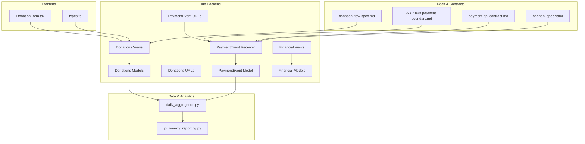
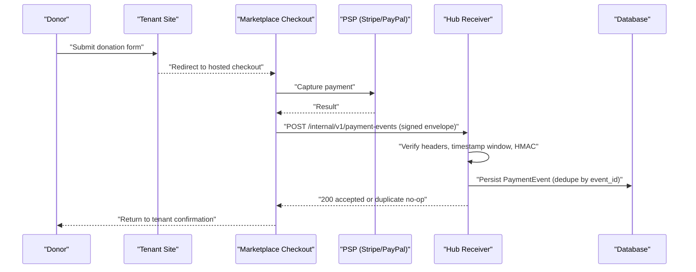
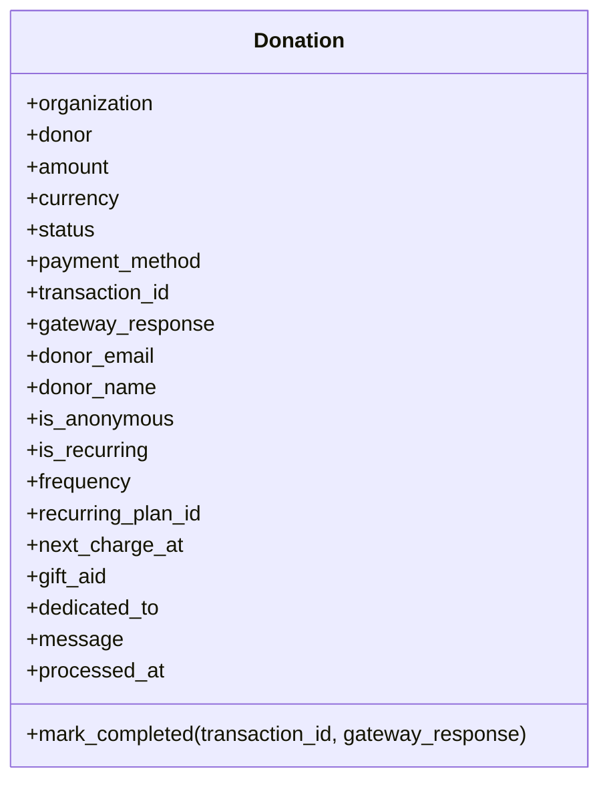
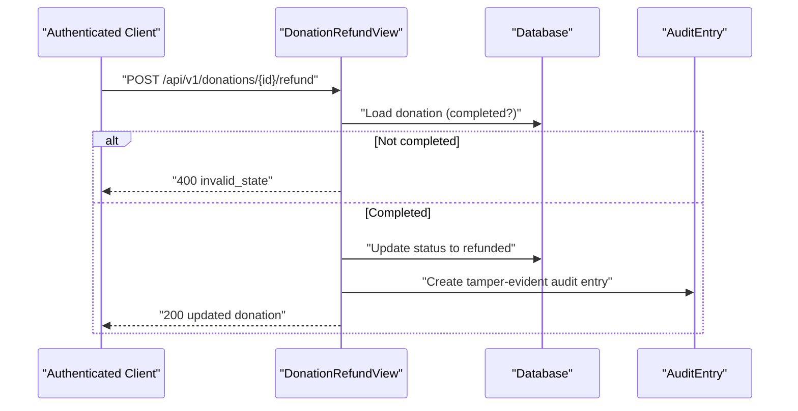
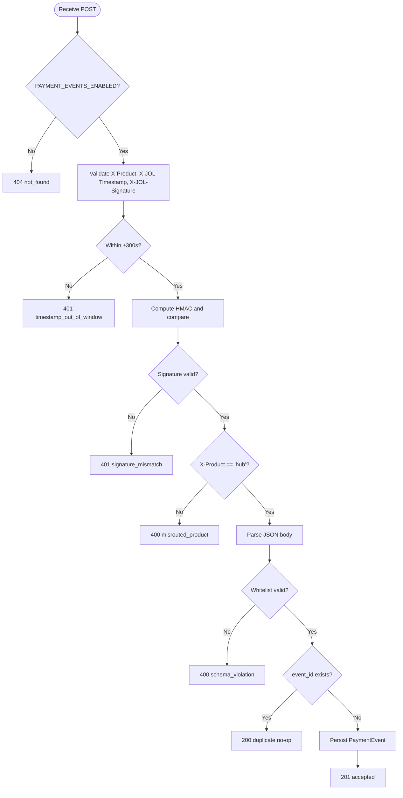
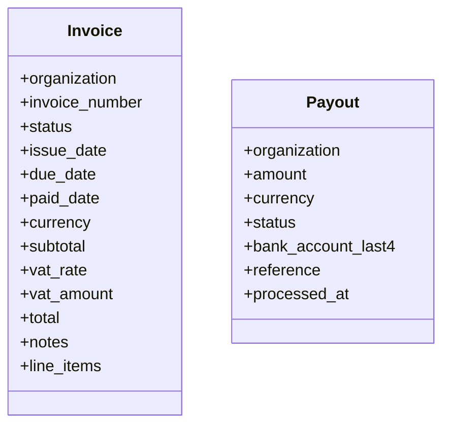
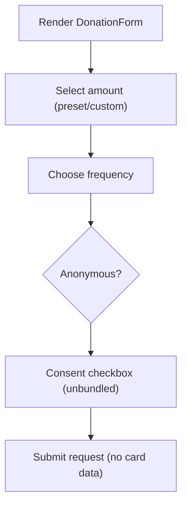
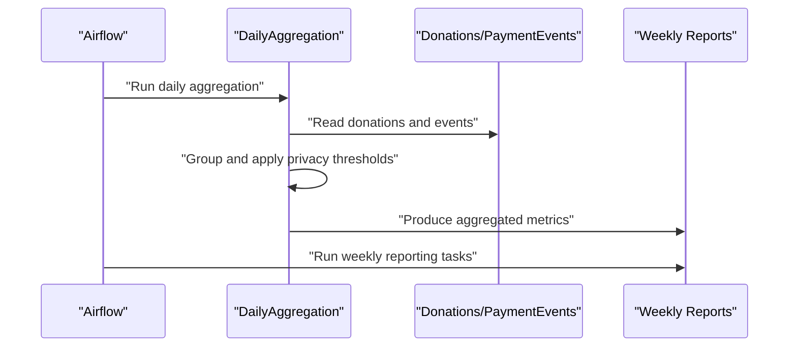
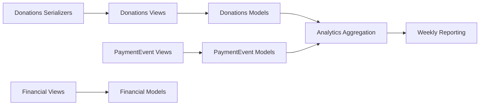

# Donation & Payment Processing

<cite>
**Referenced Files in This Document**
- [models.py](file://backend/django/apps/donations/models.py)
- [views.py](file://backend/django/apps/donations/views.py)
- [urls.py](file://backend/django/apps/donations/urls.py)
- [serializers.py](file://backend/django/apps/donations/serializers.py)
- [models.py](file://backend/django/apps/payment_events/models.py)
- [views.py](file://backend/django/apps/payment_events/views.py)
- [urls.py](file://backend/django/apps/payment_events/urls.py)
- [models.py](file://backend/django/apps/financial/models.py)
- [views.py](file://backend/django/apps/financial/views.py)
- [donation-flow-spec.md](file://docs/commerce/donation-flow-spec.md)
- [ADR-009-payment-boundary.md](file://docs/decisions/ADR-009-payment-boundary.md)
- [payment-api-contract.md](file://docs/payment-api-contract.md)
- [daily_aggregation.py](file://data/src/pipelines/donation_analytics/daily_aggregation.py)
- [jol_weekly_reporting.py](file://data/airflow/dags/jol_weekly_reporting.py)
- [DonationForm.tsx](file://frontend/apps/template-renderer/src/components/commerce/DonationForm.tsx)
- [types.ts](file://frontend/packages/commerce/src/types.ts)
- [openapi-spec.yaml](file://docs/api/openapi-spec.yaml)
</cite>

## Table of Contents
1. Introduction
2. Project Structure
3. Core Components
4. Architecture Overview
5. Detailed Component Analysis
6. Dependency Analysis
7. Performance Considerations
8. Troubleshooting Guide
9. Conclusion
10. Appendices

## Introduction
This document explains the donation and payment processing system across the hub’s backend, internal payment-event contract, financial records, analytics, and frontend components. It focuses on:
- Donation models and recurring support
- Secure payment event handling with HMAC verification and deduplication
- Transaction tracking and refund processing
- Financial reporting via invoices and payouts
- PCI-DSS compliant boundaries (Model A), PSD2 SCA readiness, and GDPR considerations
- Integration patterns for Stripe and PayPal through a marketplace payments app
- Tax receipt eligibility, reconciliation, and analytics

## Project Structure
The donation and payment subsystem spans several Django apps and supporting docs:
- Donations: models, serializers, views, URLs
- Payment Events: signed envelope receiver and whitelist model
- Financial: invoices and payouts for settlement
- Docs: donation flow spec, payment boundary decision, API contract, OpenAPI
- Data pipelines: daily aggregation and weekly reporting
- Frontend: donation form and types

**Diagram sources**
- [DonationForm.tsx:1-59](file://frontend/apps/template-renderer/src/components/commerce/DonationForm.tsx#L1-L59)
- [types.ts:136-151](file://frontend/packages/commerce/src/types.ts#L136-L151)
- [models.py:13-146](file://backend/django/apps/donations/models.py#L13-L146)
- [views.py:24-176](file://backend/django/apps/donations/views.py#L24-L176)
- [urls.py:1-11](file://backend/django/apps/donations/urls.py#L1-L11)
- [models.py:6-36](file://backend/django/apps/payment_events/models.py#L6-L36)
- [views.py:81-144](file://backend/django/apps/payment_events/views.py#L81-L144)
- [urls.py:1-10](file://backend/django/apps/payment_events/urls.py#L1-L10)
- [models.py:14-170](file://backend/django/apps/financial/models.py#L14-L170)
- [views.py:7-39](file://backend/django/apps/financial/views.py#L7-L39)
- [donation-flow-spec.md:1-65](file://docs/commerce/donation-flow-spec.md#L1-L65)
- [ADR-009-payment-boundary.md:1-111](file://docs/decisions/ADR-009-payment-boundary.md#L1-L111)
- [payment-api-contract.md:1-255](file://docs/payment-api-contract.md#L1-L255)
- [openapi-spec.yaml:828-875](file://docs/api/openapi-spec.yaml#L828-L875)
- [daily_aggregation.py:101-137](file://data/src/pipelines/donation_analytics/daily_aggregation.py#L101-L137)
- [jol_weekly_reporting.py:52-77](file://data/airflow/dags/jol_weekly_reporting.py#L52-L77)

**Section sources**
- [donation-flow-spec.md:1-65](file://docs/commerce/donation-flow-spec.md#L1-L65)
- [ADR-009-payment-boundary.md:1-111](file://docs/decisions/ADR-009-payment-boundary.md#L1-L111)

## Core Components
- Donation model supports one-off and recurring donations, donor anonymity, gift aid, and status transitions including refunds.
- Payment events receiver validates signed envelopes, enforces a strict whitelist, deduplicates by event_id, and persists durable facts.
- Financial models track invoices and payouts for settlement and reconciliation.
- Donation views provide list/create/detail and a refund endpoint with audit logging and throttling.
- Frontend donation form collects amount, frequency, consent, and anonymous preference without touching card data.
- Analytics pipeline aggregates donations with privacy safeguards and feeds weekly reporting.

**Section sources**
- [models.py:13-146](file://backend/django/apps/donations/models.py#L13-L146)
- [views.py:24-176](file://backend/django/apps/donations/views.py#L24-L176)
- [models.py:6-36](file://backend/django/apps/payment_events/models.py#L6-L36)
- [views.py:81-144](file://backend/django/apps/payment_events/views.py#L81-L144)
- [models.py:14-170](file://backend/django/apps/financial/models.py#L14-L170)
- [DonationForm.tsx:1-59](file://frontend/apps/template-renderer/src/components/commerce/DonationForm.tsx#L1-L59)
- [types.ts:136-151](file://frontend/packages/commerce/src/types.ts#L136-L151)
- [daily_aggregation.py:101-137](file://data/src/pipelines/donation_analytics/daily_aggregation.py#L101-L137)

## Architecture Overview
The system follows a closed payment boundary (Model A). The hub never handles card data or PSP SDKs; it orchestrates handoff to a marketplace-hosted checkout and receives signed payment events.

**Diagram sources**
- [donation-flow-spec.md:5-21](file://docs/commerce/donation-flow-spec.md#L5-L21)
- [payment-api-contract.md:21-83](file://docs/payment-api-contract.md#L21-L83)
- [views.py:81-144](file://backend/django/apps/payment_events/views.py#L81-L144)

**Section sources**
- [ADR-009-payment-boundary.md:45-83](file://docs/decisions/ADR-009-payment-boundary.md#L45-L83)
- [payment-api-contract.md:21-83](file://docs/payment-api-contract.md#L21-L83)

## Detailed Component Analysis

### Donation Model and Workflow
- Fields capture amount, currency, method, transaction ID, gateway response, donor info (optional), anonymity, recurring flags, frequency, next charge date, gift aid, message, and processed timestamp.
- Statuses include pending, completed, failed, refunded, cancelled.
- Tenant context validation prevents cross-tenant manipulation at save time.
- Helper method marks a donation completed with transaction details and timestamp.

**Diagram sources**
- [models.py:13-146](file://backend/django/apps/donations/models.py#L13-L146)

**Section sources**
- [models.py:13-146](file://backend/django/apps/donations/models.py#L13-L146)

### Donation REST Endpoints
- List/Create: authenticated, rate-limited POST for creating donations; GET lists current user’s donations.
- Detail: retrieve a single donation.
- Refund: authenticated, rate-limited POST to refund a completed donation; creates an audit entry with actor, IP, UA, field changes, and organization context.

**Diagram sources**
- [views.py:59-176](file://backend/django/apps/donations/views.py#L59-L176)

**Section sources**
- [views.py:24-176](file://backend/django/apps/donations/views.py#L24-L176)
- [urls.py:1-11](file://backend/django/apps/donations/urls.py#L1-L11)

### Payment Event Receiver (Signed Envelope)
- Feature-gated behind PAYMENT_EVENTS_ENABLED; test-mode only until SAQ A opens the boundary.
- Verifies required headers, timestamp within ±300 seconds, HMAC-SHA256 signature using delivery key, and product routing label.
- Validates JSON body against a whitelist of fields; rejects unknown content issues with 4xx (no retry).
- Deduplicates by event_id; persists before any downstream work; returns 200 for duplicates.

**Diagram sources**
- [views.py:81-144](file://backend/django/apps/payment_events/views.py#L81-L144)
- [payment-api-contract.md:21-83](file://docs/payment-api-contract.md#L21-L83)

**Section sources**
- [views.py:81-144](file://backend/django/apps/payment_events/views.py#L81-L144)
- [urls.py:1-10](file://backend/django/apps/payment_events/urls.py#L1-L10)
- [payment-api-contract.md:21-83](file://docs/payment-api-contract.md#L21-L83)

### Financial Reporting (Invoices and Payouts)
- Invoice model tracks issuance, due dates, VAT, totals, line items, and status.
- Payout model tracks settlement amounts, currencies, bank account last four, references, and statuses.
- Views expose filtered lists by organization for authenticated users.

**Diagram sources**
- [models.py:14-170](file://backend/django/apps/financial/models.py#L14-L170)

**Section sources**
- [models.py:14-170](file://backend/django/apps/financial/models.py#L14-L170)
- [views.py:7-39](file://backend/django/apps/financial/views.py#L7-L39)

### Frontend Donation Form and Types
- DonationForm collects amount presets/custom, frequency (one-time/monthly/annual), anonymous toggle, and consent checkbox; does not handle card data.
- Types define DonationRequest with amount in cents, frequency, anonymous flag, consent, and optional taxReceiptRequested.

**Diagram sources**
- [DonationForm.tsx:1-59](file://frontend/apps/template-renderer/src/components/commerce/DonationForm.tsx#L1-L59)
- [types.ts:136-151](file://frontend/packages/commerce/src/types.ts#L136-L151)

**Section sources**
- [DonationForm.tsx:1-59](file://frontend/apps/template-renderer/src/components/commerce/DonationForm.tsx#L1-L59)
- [types.ts:136-151](file://frontend/packages/commerce/src/types.ts#L136-L151)

### Analytics and Reporting Pipelines
- Daily aggregation groups donations by country/organization, applies k-anonymity thresholds, computes metrics, and logs audit events.
- Weekly reporting DAG orchestrates analytics, country metrics, and compliance scorecard tasks.

**Diagram sources**
- [daily_aggregation.py:101-137](file://data/src/pipelines/donation_analytics/daily_aggregation.py#L101-L137)
- [jol_weekly_reporting.py:52-77](file://data/airflow/dags/jol_weekly_reporting.py#L52-L77)

**Section sources**
- [daily_aggregation.py:101-137](file://data/src/pipelines/donation_analytics/daily_aggregation.py#L101-L137)
- [jol_weekly_reporting.py:52-77](file://data/airflow/dags/jol_weekly_reporting.py#L52-L77)

## Dependency Analysis
- Donations depend on organizations and users; serializers restrict write fields; views enforce authentication and throttling.
- Payment events depend on a signed-envelope contract; receiver depends on settings for feature flag, replay window, and delivery key.
- Financial endpoints depend on organization-scoped queries for invoices and payouts.
- Analytics depend on donations and payment events data to produce aggregated reports.

**Diagram sources**
- [serializers.py:1-44](file://backend/django/apps/donations/serializers.py#L1-L44)
- [views.py:24-176](file://backend/django/apps/donations/views.py#L24-L176)
- [models.py:13-146](file://backend/django/apps/donations/models.py#L13-L146)
- [views.py:81-144](file://backend/django/apps/payment_events/views.py#L81-L144)
- [models.py:6-36](file://backend/django/apps/payment_events/models.py#L6-L36)
- [views.py:7-39](file://backend/django/apps/financial/views.py#L7-L39)
- [models.py:14-170](file://backend/django/apps/financial/models.py#L14-L170)
- [daily_aggregation.py:101-137](file://data/src/pipelines/donation_analytics/daily_aggregation.py#L101-L137)
- [jol_weekly_reporting.py:52-77](file://data/airflow/dags/jol_weekly_reporting.py#L52-L77)

**Section sources**
- [serializers.py:1-44](file://backend/django/apps/donations/serializers.py#L1-L44)
- [views.py:24-176](file://backend/django/apps/donations/views.py#L24-L176)
- [models.py:13-146](file://backend/django/apps/donations/models.py#L13-L146)
- [views.py:81-144](file://backend/django/apps/payment_events/views.py#L81-L144)
- [models.py:6-36](file://backend/django/apps/payment_events/models.py#L6-L36)
- [views.py:7-39](file://backend/django/apps/financial/views.py#L7-L39)
- [models.py:14-170](file://backend/django/apps/financial/models.py#L14-L170)

## Performance Considerations
- Throttling on donation create and refund endpoints reduces abuse risk and protects downstream systems.
- Payment event receiver performs constant-time HMAC comparison and minimal JSON parsing; deduplication avoids redundant writes.
- Analytics aggregation applies privacy thresholds to avoid small-group leakage and limits output size.
- Use indexes on frequently queried fields (e.g., organization+status, donor+status, payment_intent_id) to optimize lookups.

[No sources needed since this section provides general guidance]

## Troubleshooting Guide
Common issues and resolutions:
- Endpoint disabled: If PAYMENT_EVENTS_ENABLED is false, the receiver returns not found; enable via change control when opening the boundary post-SAQ A.
- Missing or invalid headers: Ensure X-Product, X-JOL-Timestamp, and X-JOL-Signature are present and correct; verify clock sync and replay window.
- Signature mismatch: Confirm HUB_PAYMENT_DELIVERY_KEY matches sender; rotate keys per contract rotation policy.
- Schema violations: Validate payload against whitelist; remove unknown fields from sender if necessary.
- Duplicate events: Expected under at-least-once delivery; receiver returns 200 no-op for known event_id.
- Refund errors: Only completed donations can be refunded; ensure state transitions occur before attempting refunds.

**Section sources**
- [views.py:81-144](file://backend/django/apps/payment_events/views.py#L81-L144)
- [payment-api-contract.md:21-83](file://docs/payment-api-contract.md#L21-L83)
- [views.py:59-176](file://backend/django/apps/donations/views.py#L59-L176)

## Conclusion
The donation and payment system enforces a closed PCI scope boundary while providing robust donation modeling, secure event ingestion, financial recordkeeping, and analytics. The design prioritizes minimization, idempotency, and auditability, with clear paths for recurring donations, refunds, and reconciliation. Opening live payments requires SAQ A verification and change-controlled procedures per ADR-009.

[No sources needed since this section summarizes without analyzing specific files]

## Appendices

### PCI-DSS Compliant Payment Boundaries
- Model A keeps the hub out of PCI scope; no PSP SDKs or keys in the hub tree.
- Enforcement via script guard and CI checks; exemptions require ADR approval.
- Live transactions gated until SAQ A verification and documented opening plan.

**Section sources**
- [ADR-009-payment-boundary.md:45-83](file://docs/decisions/ADR-009-payment-boundary.md#L45-L83)

### Secure Payment Processing Workflows
- Handoff to marketplace-hosted checkout; hub never sees card data.
- Signed envelopes with HMAC verification, timestamp window, and product routing.
- Idempotent acceptance with deduplication by event_id; durable persistence first.

**Section sources**
- [donation-flow-spec.md:5-21](file://docs/commerce/donation-flow-spec.md#L5-L21)
- [payment-api-contract.md:21-83](file://docs/payment-api-contract.md#L21-L83)
- [views.py:81-144](file://backend/django/apps/payment_events/views.py#L81-L144)

### Integration with Payment Providers (Stripe and PayPal)
- Provider integration occurs in the marketplace payments_app; hub consumes internal payment events.
- Configuration variables exist for PayPal client credentials and mode; PSP credentials are excluded from hub per boundary rules.
- Supported methods include stripe, paypal, bank_link, cash, apple_pay, google_pay in configuration validation.

**Section sources**
- [ADR-009-payment-boundary.md:49-58](file://docs/decisions/ADR-009-payment-boundary.md#L49-L58)
- [validate_entity_configs.py:246-267](file://scripts/validate_entity_configs.py#L246-L267)
- [variables.tf:397-466](file://infra/terraform/variables.tf#L397-L466)
- [terraform.tfvars.example:71-80](file://infra/terraform/terraform.tfvars.example#L71-L80)

### Tax Receipt Generation
- Donation forms surface tax-receipt eligibility; backend supports gift aid flag and anonymized receipts where applicable.
- Receipting uses opaque references; donor identity remains marketplace-side.

**Section sources**
- [DonationForm.tsx:1-59](file://frontend/apps/template-renderer/src/components/commerce/DonationForm.tsx#L1-L59)
- [types.ts:136-151](file://frontend/packages/commerce/src/types.ts#L136-L151)
- [models.py:65-76](file://backend/django/apps/donations/models.py#L65-L76)

### Recurring Donations
- Donation model includes recurring flags, frequency, plan IDs, and next charge scheduling.
- Frontend supports monthly and annual frequencies; analytics aggregate recurring contributions.

**Section sources**
- [models.py:65-76](file://backend/django/apps/donations/models.py#L65-L76)
- [types.ts:136-151](file://frontend/packages/commerce/src/types.ts#L136-L151)

### Refund Processing
- Refund endpoint enforces completed state, updates status, and creates tamper-evident audit entries with full context.
- Rate limiting and authentication protect against abuse.

**Section sources**
- [views.py:59-176](file://backend/django/apps/donations/views.py#L59-L176)

### Financial Reconciliation
- Invoices and payouts model settlement flows; views allow filtering by organization for reconciliation.
- Analytics pipelines aggregate donations and events to support reporting and reconciliation.

**Section sources**
- [models.py:14-170](file://backend/django/apps/financial/models.py#L14-L170)
- [views.py:7-39](file://backend/django/apps/financial/views.py#L7-L39)
- [daily_aggregation.py:101-137](file://data/src/pipelines/donation_analytics/daily_aggregation.py#L101-L137)

### Examples: Setup, Webhooks, Reports, Analytics
- Setup payment gateways: Configure provider credentials in marketplace; ensure delivery key shared between sender and hub; set PAYMENT_EVENTS_ENABLED and replay window in hub settings.
- Handle webhooks: Implement HMAC verification, timestamp window check, product routing, whitelist validation, deduplication, and persistence per contract.
- Generate financial reports: Use invoice and payout endpoints filtered by organization; run weekly reporting DAG for aggregated insights.
- Implement donation analytics: Run daily aggregation with privacy thresholds; export metrics for dashboards.

**Section sources**
- [payment-api-contract.md:21-83](file://docs/payment-api-contract.md#L21-L83)
- [views.py:81-144](file://backend/django/apps/payment_events/views.py#L81-L144)
- [views.py:7-39](file://backend/django/apps/financial/views.py#L7-L39)
- [jol_weekly_reporting.py:52-77](file://data/airflow/dags/jol_weekly_reporting.py#L52-L77)
- [daily_aggregation.py:101-137](file://data/src/pipelines/donation_analytics/daily_aggregation.py#L101-L137)