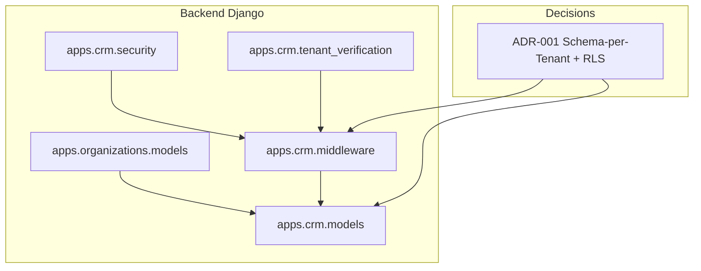
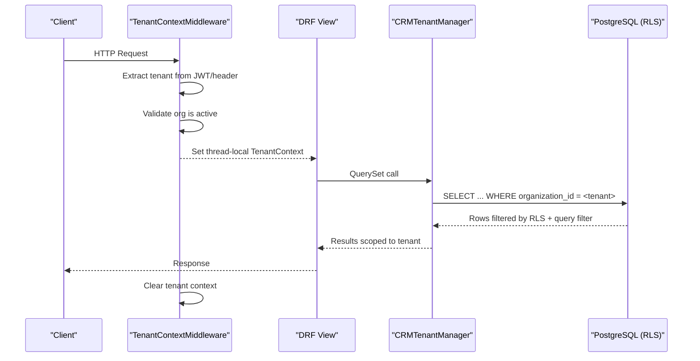
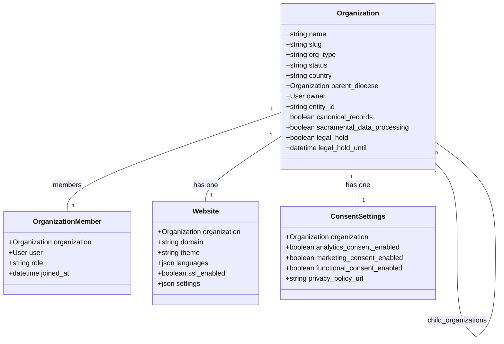
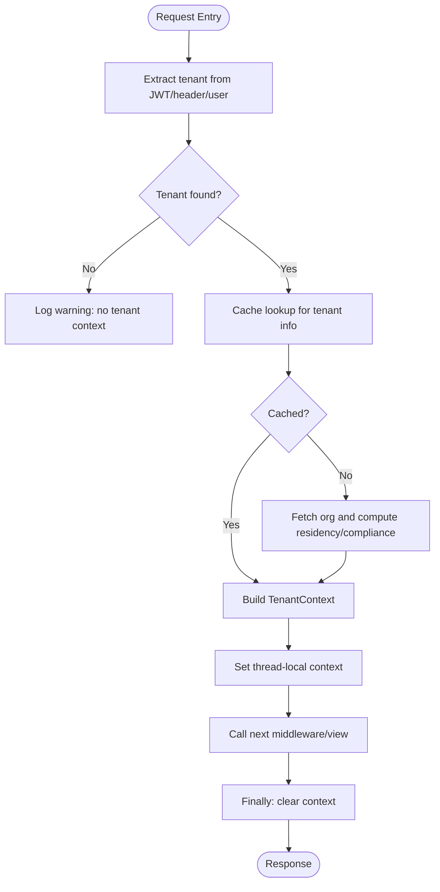
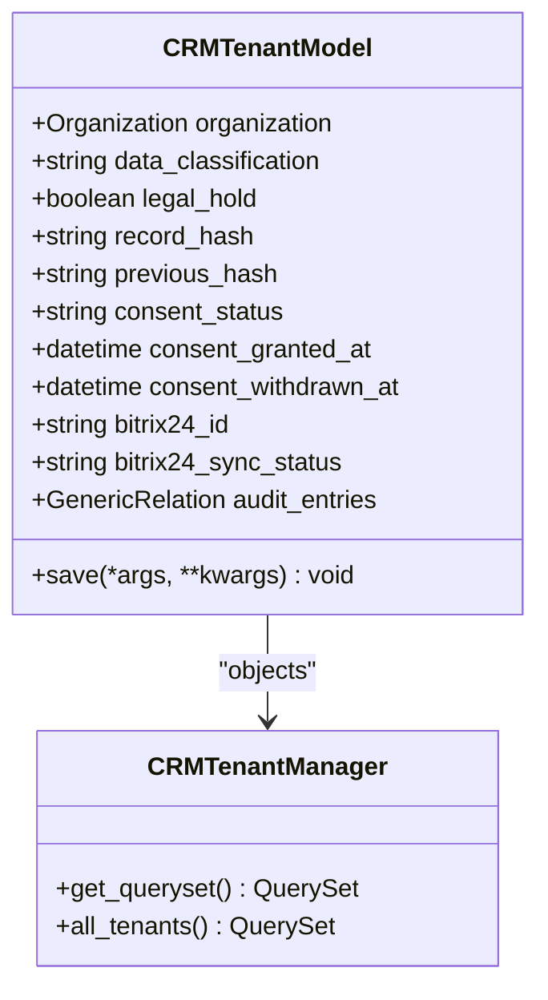
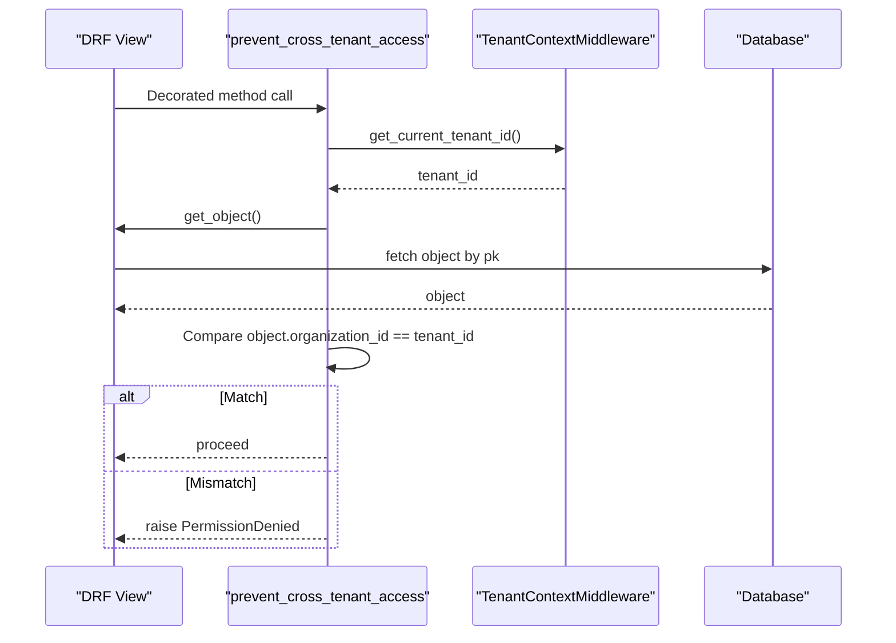
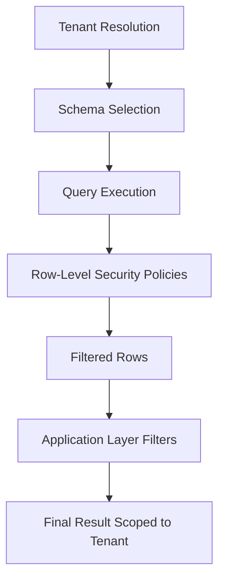
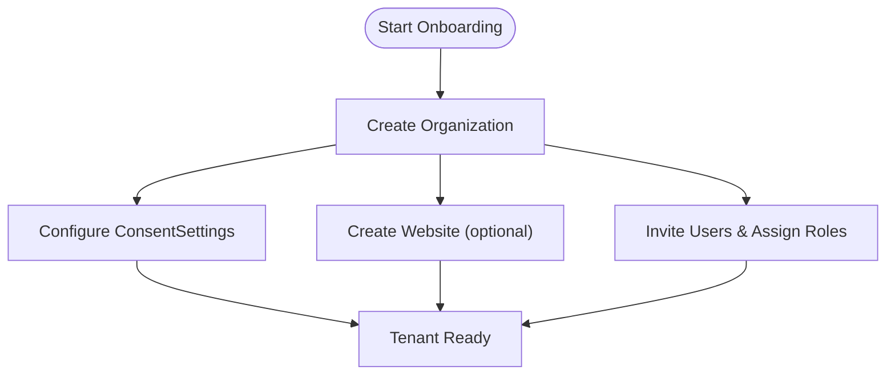
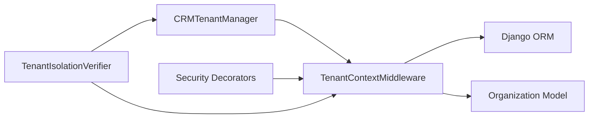

# Organization & Multi-Tenancy

<cite>
**Referenced Files in This Document**
- [ADR-001-schema-per-tenant-isolation.md](file://docs/decisions/ADR-001-schema-per-tenant-isolation.md)
- [middleware.py](file://backend/django/apps/crm/middleware.py)
- [tenant_verification.py](file://backend/django/apps/crm/tenant_verification.py)
- [security.py](file://backend/django/apps/crm/security.py)
- [models.py (CRM)](file://backend/django/apps/crm/models.py)
- [models.py (Organizations)](file://backend/django/apps/organizations/models.py)
- [views.py (Organizations)](file://backend/django/apps/organizations/views.py)
- [run_tenant_verification.py](file://scripts/run_tenant_verification.py)
</cite>

## Table of Contents
1. [Introduction](#introduction)
2. [Project Structure](#project-structure)
3. [Core Components](#core-components)
4. [Architecture Overview](#architecture-overview)
5. [Detailed Component Analysis](#detailed-component-analysis)
6. [Dependency Analysis](#dependency-analysis)
7. [Performance Considerations](#performance-considerations)
8. [Troubleshooting Guide](#troubleshooting-guide)
9. [Conclusion](#conclusion)
10. [Appendices](#appendices)

## Introduction
This document explains the Organization and Multi-Tenancy system that isolates data and behavior per tenant (organization). It covers:
- Organization models and hierarchical structures (diocese, deanery, parish/church)
- Tenant isolation mechanisms at middleware, model, and database layers
- Cross-tenant request validation and audit logging
- Onboarding workflows, configuration management per tenant, and resource allocation
- Practical examples for creating tenants, managing hierarchies, and implementing tenant-specific business logic

The design follows a schema-per-tenant strategy with row-level security as defense-in-depth, ensuring strong isolation for special-category data and compliance obligations.

## Project Structure
Key areas involved in multi-tenancy:
- Organizations app defines the tenant entity and hierarchy
- CRM app provides tenant-aware managers, base models, and verification utilities
- Middleware establishes and enforces tenant context per request
- Security module adds cross-tenant access prevention and rate limiting
- ADR documents the architectural decision for schema-per-tenant isolation

**Diagram sources**
- [ADR-001-schema-per-tenant-isolation.md:1-52](file://docs/decisions/ADR-001-schema-per-tenant-isolation.md#L1-L52)
- [middleware.py:96-197](file://backend/django/apps/crm/middleware.py#L96-L197)
- [models.py (CRM):48-69](file://backend/django/apps/crm/models.py#L48-L69)
- [security.py:494-523](file://backend/django/apps/crm/security.py#L494-L523)
- [tenant_verification.py:113-168](file://backend/django/apps/crm/tenant_verification.py#L113-L168)

**Section sources**
- [ADR-001-schema-per-tenant-isolation.md:1-52](file://docs/decisions/ADR-001-schema-per-tenant-isolation.md#L1-L52)

## Core Components
- Organization model and hierarchy: diocese → deanery → parish/church; membership and website settings; consent and legal hold fields
- Tenant context middleware: extracts tenant from JWT or headers, caches tenant info, sets thread-local context, and clears it after each request
- CRM tenant-aware models: abstract base with organization FK, indexes, and manager that filters by current tenant
- Security controls: cross-tenant access prevention decorator, PII encryption, input validation, rate limiting
- Verification suite: checks RLS status, organization FK presence, index coverage, context isolation, cache key prefixing, API filtering

**Section sources**
- [models.py (Organizations):12-237](file://backend/django/apps/organizations/models.py#L12-L237)
- [middleware.py:37-94](file://backend/django/apps/crm/middleware.py#L37-L94)
- [middleware.py:96-197](file://backend/django/apps/crm/middleware.py#L96-L197)
- [models.py (CRM):48-69](file://backend/django/apps/crm/models.py#L48-L69)
- [security.py:494-523](file://backend/django/apps/crm/security.py#L494-L523)
- [tenant_verification.py:113-168](file://backend/django/apps/crm/tenant_verification.py#L113-L168)

## Architecture Overview
End-to-end flow for a tenant-scoped request:
- Middleware resolves tenant from JWT claims or header, validates against active organizations, and stores a TenantContext in thread-local storage
- Views and serializers operate on tenant-scoped QuerySets via CRMTenantManager which automatically filters by organization_id
- Security decorators prevent cross-tenant access at object level
- Database layer uses PostgreSQL schema-per-tenant and Row-Level Security to enforce isolation at the DB engine level
- Verification tools continuously validate isolation across layers

**Diagram sources**
- [middleware.py:122-154](file://backend/django/apps/crm/middleware.py#L122-L154)
- [middleware.py:156-197](file://backend/django/apps/crm/middleware.py#L156-L197)
- [models.py (CRM):48-69](file://backend/django/apps/crm/models.py#L48-L69)
- [ADR-001-schema-per-tenant-isolation.md:16-28](file://docs/decisions/ADR-001-schema-per-tenant-isolation.md#L16-L28)

## Detailed Component Analysis

### Organization Models and Hierarchy
- Organization supports multiple types including diocese, deanery, church, parish, cathedral, basilica, monastery, chapel, shrine, plus non-Catholic and commercial service types
- Hierarchical relationships are modeled via parent_diocese allowing diocese → deanery → facility (parish/church) structure
- Membership via OrganizationMember links users to organizations with roles (admin/editor/viewer)
- Website configuration attached per organization (domain, theme, languages, SSL, analytics, custom CSS, settings)
- ConsentSettings tracks per-organization consent flags and policy versioning
- Legal hold fields support GDPR erasure exceptions with timestamps and reasons
- Indexes optimize queries by country, type, status, compliance_level, legal_hold, and entity_id

**Diagram sources**
- [models.py (Organizations):12-237](file://backend/django/apps/organizations/models.py#L12-L237)
- [models.py (Organizations):239-321](file://backend/django/apps/organizations/models.py#L239-L321)
- [models.py (Organizations):323-386](file://backend/django/apps/organizations/models.py#L323-L386)
- [models.py (Organizations):388-495](file://backend/django/apps/organizations/models.py#L388-L495)

**Section sources**
- [models.py (Organizations):12-237](file://backend/django/apps/organizations/models.py#L12-L237)
- [models.py (Organizations):239-321](file://backend/django/apps/organizations/models.py#L239-L321)
- [models.py (Organizations):323-386](file://backend/django/apps/organizations/models.py#L323-L386)
- [models.py (Organizations):388-495](file://backend/django/apps/organizations/models.py#L388-L495)

### Tenant Context Middleware
- Extracts tenant ID from JWT claims or X-Tenant-ID header; falls back to user’s default organization if authenticated
- Validates tenant exists and is active; caches tenant info for performance
- Stores a TenantContext in thread-local storage for the duration of the request
- Ensures cleanup in finally block to prevent context leakage
- Provides decorators and DRF permission helpers to require tenant context

**Diagram sources**
- [middleware.py:122-154](file://backend/django/apps/crm/middleware.py#L122-L154)
- [middleware.py:156-197](file://backend/django/apps/crm/middleware.py#L156-L197)
- [middleware.py:233-265](file://backend/django/apps/crm/middleware.py#L233-L265)

**Section sources**
- [middleware.py:37-94](file://backend/django/apps/crm/middleware.py#L37-L94)
- [middleware.py:96-197](file://backend/django/apps/crm/middleware.py#L96-L197)
- [middleware.py:301-342](file://backend/django/apps/crm/middleware.py#L301-L342)

### CRM Tenant-Aware Models and Managers
- CRMTenantManager overrides get_queryset to filter by organization_id using current tenant context
- CRMTenantModel abstract base includes organization FK, data classification, legal hold, integrity hashes, consent tracking, Bitrix24 sync fields, and audit entries
- Indexes on organization+classification and organization+legal_hold improve query performance
- Save methods generate integrity hashes and validate tenant context

**Diagram sources**
- [models.py (CRM):48-69](file://backend/django/apps/crm/models.py#L48-L69)
- [models.py (CRM):71-196](file://backend/django/apps/crm/models.py#L71-L196)

**Section sources**
- [models.py (CRM):48-69](file://backend/django/apps/crm/models.py#L48-L69)
- [models.py (CRM):71-196](file://backend/django/apps/crm/models.py#L71-L196)

### Security Controls and Cross-Tenant Validation
- prevent_cross_tenant_access decorator validates that the requested object belongs to the current tenant and logs violations
- Rate limiter supports per-tenant/per-user/per-IP limits with configurable windows
- InputValidator sanitizes emails, phones, names, addresses, and detects injection/XSS patterns
- PIIEncryption provides field-level encryption for sensitive data

**Diagram sources**
- [security.py:494-523](file://backend/django/apps/crm/security.py#L494-L523)
- [middleware.py:74-82](file://backend/django/apps/crm/middleware.py#L74-L82)

**Section sources**
- [security.py:38-142](file://backend/django/apps/crm/security.py#L38-L142)
- [security.py:148-312](file://backend/django/apps/crm/security.py#L148-L312)
- [security.py:318-421](file://backend/django/apps/crm/security.py#L318-L421)
- [security.py:427-491](file://backend/django/apps/crm/security.py#L427-L491)
- [security.py:494-523](file://backend/django/apps/crm/security.py#L494-L523)

### Database-Level Isolation and Row-Level Security
- Architectural decision: PostgreSQL schema-per-tenant with Row-Level Security policies on tenant-scoped tables
- Connection role strategy uses least privilege; tenant schema resolved per request; search_path pinning; no cross-schema grants
- Erasure boundaries are schema-scoped; backups retain cluster recoverability; per-tenant export/erasure tooling required for rights
- Verification module checks RLS enablement on key tables and reports pass/warning/error with remediation guidance

**Diagram sources**
- [ADR-001-schema-per-tenant-isolation.md:16-28](file://docs/decisions/ADR-001-schema-per-tenant-isolation.md#L16-L28)
- [tenant_verification.py:186-254](file://backend/django/apps/crm/tenant_verification.py#L186-L254)

**Section sources**
- [ADR-001-schema-per-tenant-isolation.md:1-52](file://docs/decisions/ADR-001-schema-per-tenant-isolation.md#L1-L52)
- [tenant_verification.py:186-254](file://backend/django/apps/crm/tenant_verification.py#L186-L254)

### Organization Onboarding Workflows
Typical steps to onboard a new tenant:
- Create an Organization record with appropriate org_type (e.g., diocese/deanery/parish), country, and compliance_level
- Optionally create a Website entry linked to the Organization for domain/theme/language settings
- Invite users and assign roles via OrganizationMember
- Configure ConsentSettings for analytics/marketing/functional consent and set privacy policy URL
- For CRM entities, ensure they inherit from CRMTenantModel so they are automatically scoped to the tenant

[No sources needed since this diagram shows conceptual workflow, not actual code structure]

**Section sources**
- [models.py (Organizations):12-237](file://backend/django/apps/organizations/models.py#L12-L237)
- [models.py (Organizations):239-321](file://backend/django/apps/organizations/models.py#L239-L321)
- [models.py (Organizations):323-386](file://backend/django/apps/organizations/models.py#L323-L386)
- [models.py (Organizations):388-495](file://backend/django/apps/organizations/models.py#L388-L495)

### Configuration Management Per Tenant
- Organization-level settings include compliance_level, canonical records flag, sacramental data processing flag, and legal hold metadata
- Website settings include domain, theme, default language, supported languages, SSL, analytics ID, custom CSS, and generic settings JSON
- ConsentSettings track per-tenant consent flags and policy versions
- CRM entities carry data_classification, consent_status, and Bitrix24 sync metadata for integration control

**Section sources**
- [models.py (Organizations):12-237](file://backend/django/apps/organizations/models.py#L12-L237)
- [models.py (Organizations):323-386](file://backend/django/apps/organizations/models.py#L323-L386)
- [models.py (Organizations):388-495](file://backend/django/apps/organizations/models.py#L388-L495)
- [models.py (CRM):71-196](file://backend/django/apps/crm/models.py#L71-L196)

### Resource Allocation and Limits
- Rate limiting is implemented per tenant/user/IP with configurable windows and burst sizes
- Different rate limit profiles exist for sensitive operations like GDPR export/delete and financial endpoints
- Cache keys use tenant-prefixed prefixes to avoid cross-tenant collisions

**Section sources**
- [security.py:318-421](file://backend/django/apps/crm/security.py#L318-L421)
- [middleware.py:111-118](file://backend/django/apps/crm/middleware.py#L111-L118)

### Examples

#### Creating a New Tenant
- Create an Organization with org_type set to the desired level (diocese/deanery/parish) and country
- Add Website configuration if the tenant will have a branded site
- Invite users and assign roles via OrganizationMember
- Configure ConsentSettings to enable/disable analytics/marketing/functional features per tenant

**Section sources**
- [models.py (Organizations):12-237](file://backend/django/apps/organizations/models.py#L12-L237)
- [models.py (Organizations):239-321](file://backend/django/apps/organizations/models.py#L239-L321)
- [models.py (Organizations):323-386](file://backend/django/apps/organizations/models.py#L323-L386)
- [models.py (Organizations):388-495](file://backend/django/apps/organizations/models.py#L388-L495)

#### Managing Organization Hierarchies
- Use parent_diocese to link deaneries under dioceses and facilities under deaneries
- Leverage related_name 'child_organizations' to traverse hierarchy
- Enforce type constraints via limit_choices_to to maintain valid hierarchy

**Section sources**
- [models.py (Organizations):112-119](file://backend/django/apps/organizations/models.py#L112-L119)

#### Implementing Tenant-Specific Business Logic
- Use CRMTenantManager to ensure all queries are scoped to the current tenant
- Apply prevent_cross_tenant_access decorator on views handling sensitive resources
- Use ConsentSettings and data_classification to gate access to special category data
- Log tenant access events using log_tenant_access helpers

**Section sources**
- [models.py (CRM):48-69](file://backend/django/apps/crm/models.py#L48-L69)
- [security.py:494-523](file://backend/django/apps/crm/security.py#L494-L523)
- [middleware.py:379-405](file://backend/django/apps/crm/middleware.py#L379-L405)

## Dependency Analysis
Key dependencies and coupling:
- Middleware depends on JWT authentication and Organization model to resolve tenant info
- CRM models depend on middleware to inject tenant context into QuerySets
- Security module depends on middleware for tenant identification and integrates with audit/logging
- Verification module inspects middleware and models to assert isolation properties

**Diagram sources**
- [middleware.py:156-197](file://backend/django/apps/crm/middleware.py#L156-L197)
- [models.py (CRM):48-69](file://backend/django/apps/crm/models.py#L48-L69)
- [security.py:494-523](file://backend/django/apps/crm/security.py#L494-L523)
- [tenant_verification.py:113-168](file://backend/django/apps/crm/tenant_verification.py#L113-L168)

**Section sources**
- [middleware.py:156-197](file://backend/django/apps/crm/middleware.py#L156-L197)
- [models.py (CRM):48-69](file://backend/django/apps/crm/models.py#L48-L69)
- [security.py:494-523](file://backend/django/apps/crm/security.py#L494-L523)
- [tenant_verification.py:113-168](file://backend/django/apps/crm/tenant_verification.py#L113-L168)

## Performance Considerations
- Cache tenant info with a short TTL to reduce repeated lookups
- Ensure organization_id columns are indexed for fast filtering
- Prefer tenant-scoped QuerySets via CRMTenantManager to minimize manual filtering
- Use RLS on PostgreSQL to offload isolation enforcement to the database engine
- Monitor rate limits to protect sensitive endpoints and manage resource usage

[No sources needed since this section provides general guidance]

## Troubleshooting Guide
Common issues and diagnostics:
- Missing tenant context: verify JWT contains tenant claim or X-Tenant-ID header is present; check middleware installation order
- Cross-tenant access errors: ensure objects belong to current tenant; apply prevent_cross_tenant_access decorator where needed
- RLS not enabled: run verification script to detect missing RLS on tenant tables; enable policies in production PostgreSQL
- Cache collisions: confirm cache keys include tenant prefix; inspect middleware caching behavior
- Slow queries: verify indexes on organization_id and composite indexes used by common filters

Verification runner:
- Execute the tenant verification script to produce a detailed report with pass/fail/warning statuses and remediation hints

**Section sources**
- [run_tenant_verification.py:38-128](file://scripts/run_tenant_verification.py#L38-L128)
- [tenant_verification.py:186-254](file://backend/django/apps/crm/tenant_verification.py#L186-L254)
- [tenant_verification.py:256-395](file://backend/django/apps/crm/tenant_verification.py#L256-L395)
- [tenant_verification.py:571-679](file://backend/django/apps/crm/tenant_verification.py#L571-L679)
- [tenant_verification.py:685-727](file://backend/django/apps/crm/tenant_verification.py#L685-L727)
- [tenant_verification.py:733-800](file://backend/django/apps/crm/tenant_verification.py#L733-L800)

## Conclusion
The Organization and Multi-Tenancy system combines application-level tenant context, model-level scoping, and database-level isolation to provide robust separation of data and behavior per tenant. The middleware ensures consistent tenant resolution and lifecycle management, while CRM models and managers enforce automatic filtering. Security decorators and verification tools add defense-in-depth and continuous assurance. This architecture supports scalable onboarding, per-tenant configuration, and compliant handling of special-category data.

[No sources needed since this section summarizes without analyzing specific files]

## Appendices

### Appendix A: Key API Endpoints for Organizations
- List/Create organizations: GET/POST /api/v1/organizations/
- Retrieve/Update/Delete organization: GET/PATCH/DELETE /api/v1/organizations/{id}/
- Manage organization website: GET/PATCH /api/v1/organizations/{id}/website/
- Manage organization members: GET/POST /api/v1/organizations/{id}/members/

These endpoints rely on authentication and should be combined with tenant context to scope operations appropriately.

**Section sources**
- [views.py (Organizations):17-73](file://backend/django/apps/organizations/views.py#L17-L73)