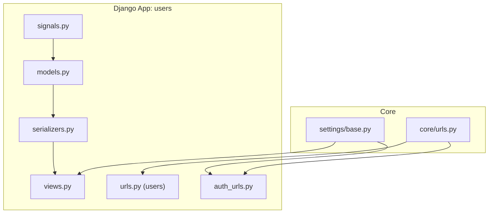
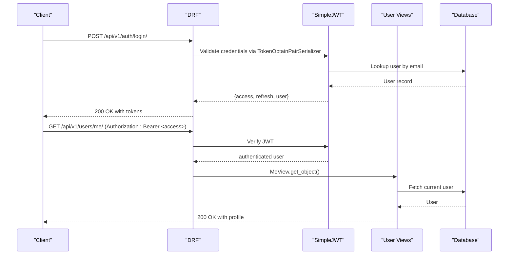
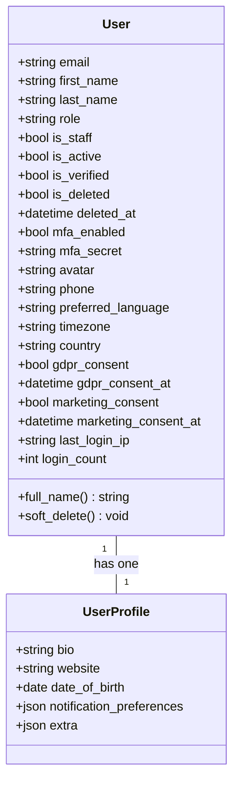
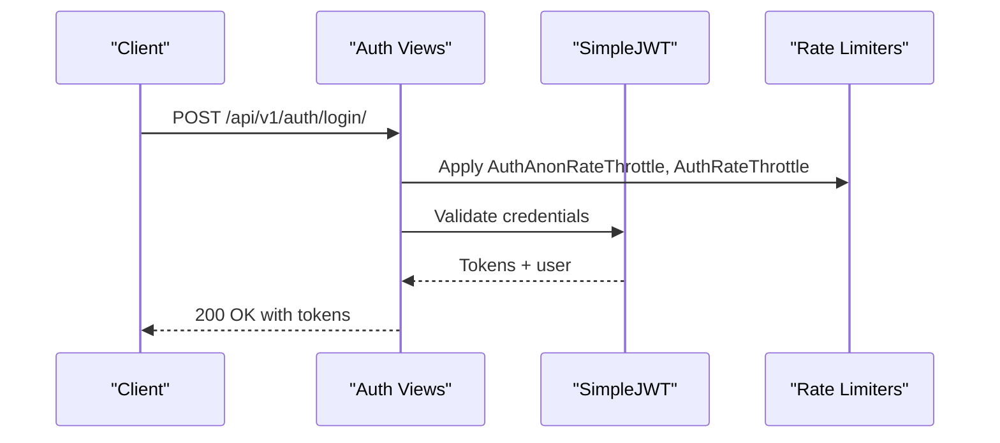
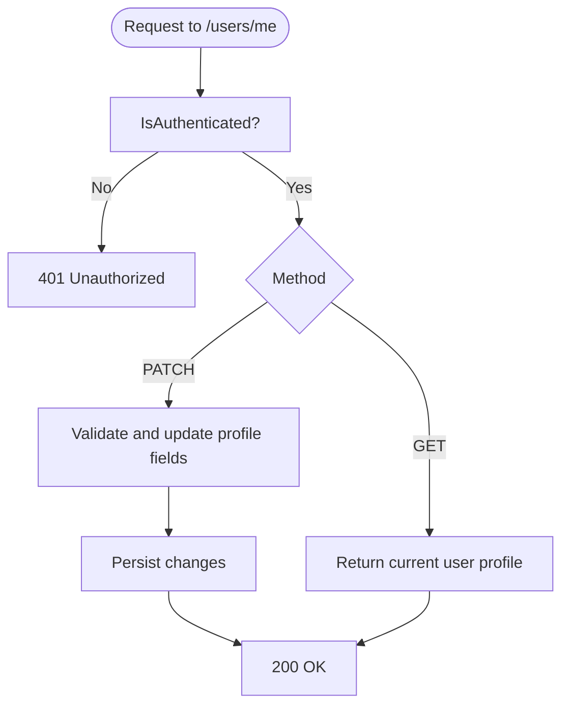
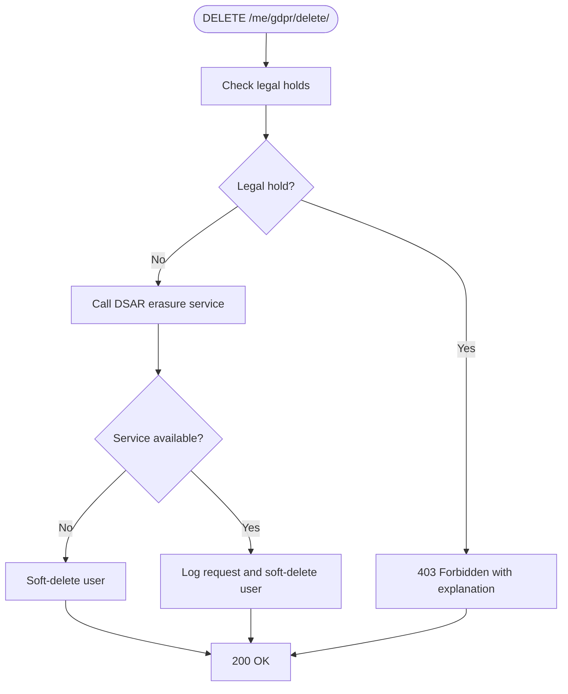
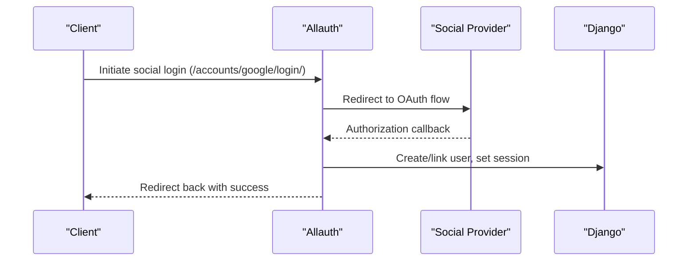
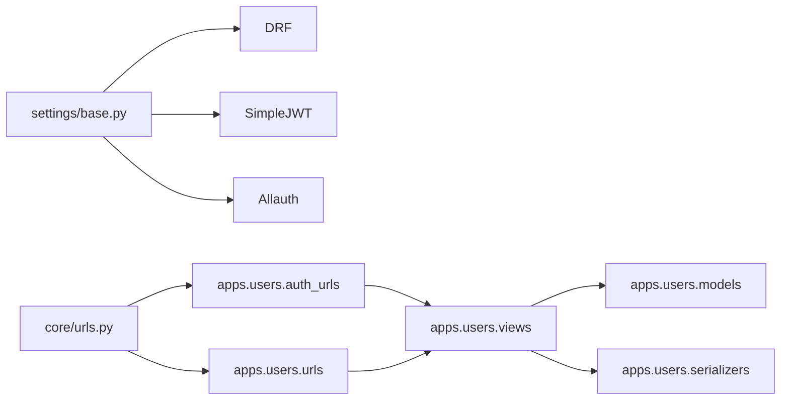

# User Management & Authentication

<cite>
**Referenced Files in This Document**
- [models.py](file://backend/django/apps/users/models.py)
- [managers.py](file://backend/django/apps/users/managers.py)
- [serializers.py](file://backend/django/apps/users/serializers.py)
- [views.py](file://backend/django/apps/users/views.py)
- [urls.py](file://backend/django/apps/users/urls.py)
- [auth_urls.py](file://backend/django/apps/users/auth_urls.py)
- [signals.py](file://backend/django/apps/users/signals.py)
- [base.py](file://backend/django/core/settings/base.py)
- [urls.py](file://backend/django/core/urls.py)
</cite>

## Table of Contents
1. Introduction
2. Project Structure
3. Core Components
4. Architecture Overview
5. Detailed Component Analysis
6. Dependency Analysis
7. Performance Considerations
8. Troubleshooting Guide
9. Conclusion

## Introduction
This document explains the User Management and Authentication system built on Django with Django REST Framework, SimpleJWT for stateless JWT-based authentication, and Allauth for social account integration. It covers user models, custom managers, role-based access control, permissions, session management, multi-factor authentication fields, GDPR data rights endpoints, and API endpoints for registration, login, logout, token refresh, password change, profile management, and account verification flows via Allauth.

## Project Structure
The authentication subsystem is implemented within the users app and configured centrally in settings and root URLs:
- Users app provides models, serializers, views, URL routes, and signals for user lifecycle and login tracking.
- Settings configure DRF, SimpleJWT, sessions, CORS, and Allauth middleware.
- Root URLs mount auth and user endpoints under /api/v1 and include Allauth at /accounts/.

**Diagram sources**
- [urls.py:52-69](file://backend/django/core/urls.py#L52-L69)
- [base.py:282-355](file://backend/django/core/settings/base.py#L282-L355)
- [urls.py:1-29](file://backend/django/apps/users/urls.py#L1-L29)
- [auth_urls.py:1-22](file://backend/django/apps/users/auth_urls.py#L1-L22)

**Section sources**
- [urls.py:52-69](file://backend/django/core/urls.py#L52-L69)
- [base.py:282-355](file://backend/django/core/settings/base.py#L282-L355)
- [urls.py:1-29](file://backend/django/apps/users/urls.py#L1-L29)
- [auth_urls.py:1-22](file://backend/django/apps/users/auth_urls.py#L1-L22)

## Core Components
- Custom User model with email as username, roles, soft delete, MFA fields, and GDPR consent flags.
- UserProfile one-to-one extension for non-auth profile data.
- Custom UserManager enforcing email uniqueness and active filtering.
- Serializers for registration, profile read/write, password change, and JWT token pair augmentation.
- Views implementing register, login, logout, token refresh, profile management, password change, and GDPR data rights.
- Signals to auto-create profiles and track login metadata.
- Settings configuring DRF, SimpleJWT, sessions, and Allauth.

**Section sources**
- [models.py:17-123](file://backend/django/apps/users/models.py#L17-L123)
- [managers.py:9-39](file://backend/django/apps/users/managers.py#L9-L39)
- [serializers.py:13-109](file://backend/django/apps/users/serializers.py#L13-L109)
- [views.py:31-352](file://backend/django/apps/users/views.py#L31-L352)
- [signals.py:12-30](file://backend/django/apps/users/signals.py#L12-L30)
- [base.py:282-355](file://backend/django/core/settings/base.py#L282-L355)

## Architecture Overview
The system uses JWT for stateless API authentication and Django sessions for browser-based flows where applicable. Allauth handles social authentication and email verification flows. DRF enforces default authentication and permission policies, while per-endpoint throttling protects sensitive operations.

**Diagram sources**
- [views.py:40-85](file://backend/django/apps/users/views.py#L40-L85)
- [serializers.py:102-109](file://backend/django/apps/users/serializers.py#L102-L109)
- [base.py:282-355](file://backend/django/core/settings/base.py#L282-L355)

## Detailed Component Analysis

### User Model and Profile
- The User model extends AbstractBaseUser and PermissionsMixin, using email as the unique identifier. Roles are coarse-grained; fine-grained permissions are managed elsewhere.
- Fields include auth flags (is_staff, is_active, is_verified), soft delete markers, MFA fields (mfa_enabled, mfa_secret), profile fields (avatar, phone, language, timezone, country), GDPR consent timestamps, and login tracking (last_login_ip, login_count).
- UserProfile stores extended profile data in a one-to-one relationship, enabling GDPR erasure without touching auth records.

**Diagram sources**
- [models.py:17-123](file://backend/django/apps/users/models.py#L17-L123)

**Section sources**
- [models.py:17-123](file://backend/django/apps/users/models.py#L17-L123)

### Custom User Manager
- UserManager normalizes email, sets passwords securely, and supports creating regular and superusers with appropriate defaults.
- Provides an active() queryset helper that filters active and non-deleted users.

**Section sources**
- [managers.py:9-39](file://backend/django/apps/users/managers.py#L9-L39)

### Serializers
- RegisterSerializer validates password strength and confirmation, captures consent timestamps, and creates users via the manager.
- UserSerializer exposes full profile including nested UserProfile and computed full_name.
- ChangePasswordSerializer validates old password and enforces new password policy.
- TokenObtainPairSerializer augments the standard JWT response with user profile data.

**Section sources**
- [serializers.py:13-109](file://backend/django/apps/users/serializers.py#L13-L109)

### Authentication Endpoints
- Register: POST /api/v1/auth/register/ — create a new user with rate limiting.
- Login: POST /api/v1/auth/login/ — obtain JWT access and refresh tokens via SimpleJWT.
- Logout: POST /api/v1/auth/logout/ — blacklist refresh token to invalidate sessions.
- Refresh: POST /api/v1/auth/refresh/ — rotate refresh tokens per SimpleJWT configuration.

**Diagram sources**
- [views.py:31-54](file://backend/django/apps/users/views.py#L31-L54)
- [auth_urls.py:16-21](file://backend/django/apps/users/auth_urls.py#L16-L21)
- [base.py:307-320](file://backend/django/core/settings/base.py#L307-L320)

**Section sources**
- [views.py:31-54](file://backend/django/apps/users/views.py#L31-L54)
- [auth_urls.py:16-21](file://backend/django/apps/users/auth_urls.py#L16-L21)
- [base.py:307-320](file://backend/django/core/settings/base.py#L307-L320)

### Profile and Password Management
- MeView: GET/PATCH /api/v1/users/me/ — retrieve or update current user profile.
- ChangePasswordView: POST /api/v1/users/me/change-password/ — validate old password and set new password.

**Diagram sources**
- [views.py:73-85](file://backend/django/apps/users/views.py#L73-L85)
- [views.py:164-174](file://backend/django/apps/users/views.py#L164-L174)

**Section sources**
- [views.py:73-85](file://backend/django/apps/users/views.py#L73-L85)
- [views.py:164-174](file://backend/django/apps/users/views.py#L164-L174)

### GDPR Data Rights
- Access: GET /api/v1/users/me/gdpr/access/ — returns data inventory summary and legal holds.
- Export: GET /api/v1/users/me/gdpr/export/ — comprehensive DSAR export with fallback to basic data if service unavailable.
- Delete: DELETE /api/v1/users/me/gdpr/delete/ — processes erasure with legal hold checks and soft-delete fallback.

**Diagram sources**
- [views.py:254-334](file://backend/django/apps/users/views.py#L254-L334)

**Section sources**
- [views.py:88-161](file://backend/django/apps/users/views.py#L88-L161)
- [views.py:196-251](file://backend/django/apps/users/views.py#L196-L251)
- [views.py:254-334](file://backend/django/apps/users/views.py#L254-L334)

### Social Authentication and Account Verification (Allauth)
- Allauth is enabled with Google and Facebook providers and mounted at /accounts/.
- Email verification and social login flows are handled by Allauth’s built-in views and templates.
- Integration points:
  - Middleware included for account context.
  - Root URLs include allauth.urls under /accounts/.

**Diagram sources**
- [base.py:68-72](file://backend/django/core/settings/base.py#L68-L72)
- [base.py:139-139](file://backend/django/core/settings/base.py#L139-L139)
- [urls.py:69-69](file://backend/django/core/urls.py#L69-L69)

**Section sources**
- [base.py:68-72](file://backend/django/core/settings/base.py#L68-L72)
- [base.py:139-139](file://backend/django/core/settings/base.py#L139-L139)
- [urls.py:69-69](file://backend/django/core/urls.py#L69-L69)

### Role-Based Access Control and Permissions
- Default DRF permission requires authentication for most endpoints.
- Per-endpoint permission_classes enforce specific access rules (e.g., AllowAny for registration, IsAuthenticated for profile and GDPR endpoints).
- Coarse roles exist on User; fine-grained permissions are managed in organization membership contexts.

**Section sources**
- [base.py:287-289](file://backend/django/core/settings/base.py#L287-L289)
- [views.py:31-37](file://backend/django/apps/users/views.py#L31-L37)
- [views.py:73-85](file://backend/django/apps/users/views.py#L73-L85)
- [views.py:88-101](file://backend/django/apps/users/views.py#L88-L101)
- [views.py:164-168](file://backend/django/apps/users/views.py#L164-L168)
- [views.py:177-194](file://backend/django/apps/users/views.py#L177-L194)

### Session Management
- Sessions use cached_db backend with configurable cookie security and age.
- CSRF protection is enabled with secure cookies and trusted origins.
- Allauth middleware integrates session handling for social flows.

**Section sources**
- [base.py:526-537](file://backend/django/core/settings/base.py#L526-L537)
- [base.py:139-139](file://backend/django/core/settings/base.py#L139-L139)

### Multi-Factor Authentication Setup
- User model includes mfa_enabled and mfa_secret fields to support TOTP-based MFA.
- These fields enable future MFA enforcement and verification workflows.

**Section sources**
- [models.py:51-54](file://backend/django/apps/users/models.py#L51-L54)

### Login Tracking and Auto-Profile Creation
- Signals ensure every user gets a linked UserProfile upon creation.
- On login, signals update last login IP and increment login count.

**Section sources**
- [signals.py:12-30](file://backend/django/apps/users/signals.py#L12-L30)

## Dependency Analysis
- Users app depends on DRF, SimpleJWT, and Allauth for authentication and social features.
- Settings centralize authentication classes, JWT behavior, throttling, and session configuration.
- Root URLs wire auth and user endpoints and include Allauth routes.

**Diagram sources**
- [base.py:282-355](file://backend/django/core/settings/base.py#L282-L355)
- [urls.py:52-69](file://backend/django/core/urls.py#L52-L69)
- [auth_urls.py:16-21](file://backend/django/apps/users/auth_urls.py#L16-L21)
- [urls.py:20-28](file://backend/django/apps/users/urls.py#L20-L28)

**Section sources**
- [base.py:282-355](file://backend/django/core/settings/base.py#L282-L355)
- [urls.py:52-69](file://backend/django/core/urls.py#L52-L69)
- [auth_urls.py:16-21](file://backend/django/apps/users/auth_urls.py#L16-L21)
- [urls.py:20-28](file://backend/django/apps/users/urls.py#L20-L28)

## Performance Considerations
- Throttling:
  - Global anon/user rates configured in DRF.
  - Stricter rates for auth, GDPR export, and GDPR delete endpoints to prevent abuse.
- JWT rotation and blacklisting reduce risk of token reuse after logout.
- Database indexes on email and role improve query performance for common filters.
- Cached session backend reduces database load for session storage.

[No sources needed since this section provides general guidance]

## Troubleshooting Guide
- Registration fails due to password mismatch: Ensure password_confirm matches password in the request payload.
- Login blocked by rate limit: Review throttle configuration and client request frequency.
- Logout does not revoke session: Confirm refresh_token is included in the logout request body.
- GDPR delete blocked: Legal holds may be active; check legal hold status and contact legal team if necessary.
- Allauth social login issues: Verify provider credentials and redirect URIs; ensure Allauth middleware is enabled.

**Section sources**
- [serializers.py:74-85](file://backend/django/apps/users/serializers.py#L74-L85)
- [views.py:56-70](file://backend/django/apps/users/views.py#L56-L70)
- [views.py:254-334](file://backend/django/apps/users/views.py#L254-L334)
- [base.py:68-72](file://backend/django/core/settings/base.py#L68-L72)
- [base.py:139-139](file://backend/django/core/settings/base.py#L139-L139)

## Conclusion
The system provides a robust, secure foundation for user management and authentication:
- Custom User model with roles, MFA fields, and GDPR consent tracking.
- JWT-based authentication with token rotation and blacklisting.
- Allauth integration for social authentication and email verification.
- Comprehensive GDPR endpoints with legal hold safeguards.
- Strong defaults for permissions, throttling, and session security.

[No sources needed since this section summarizes without analyzing specific files]