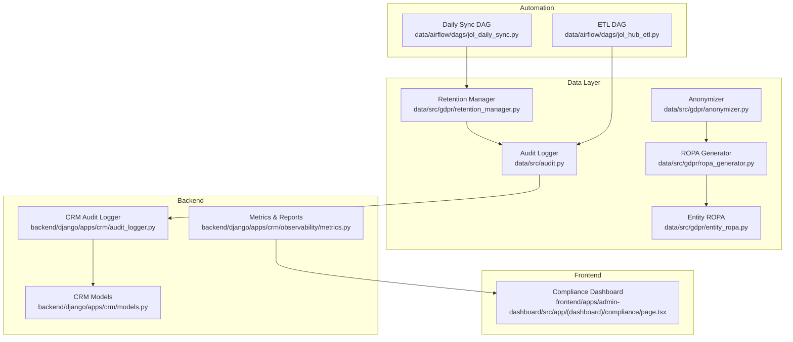
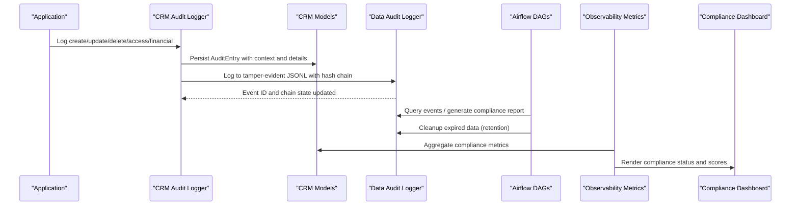
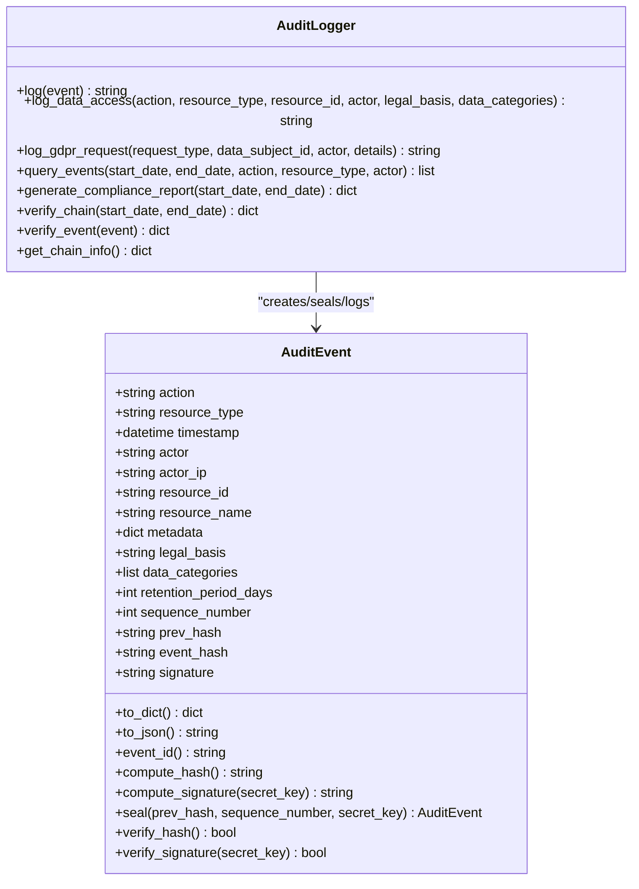
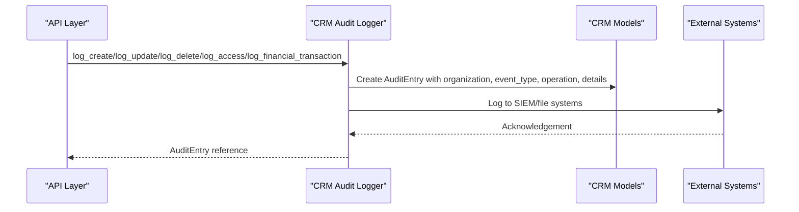
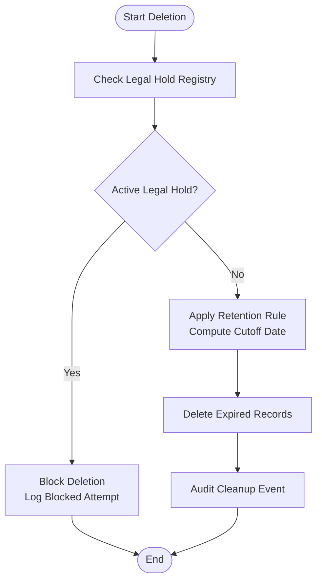
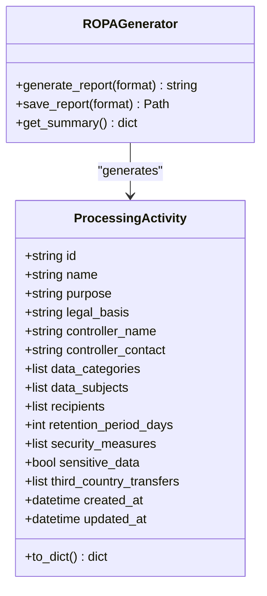
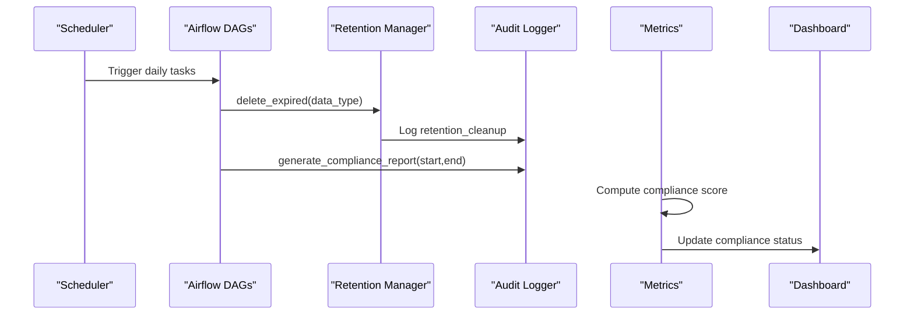
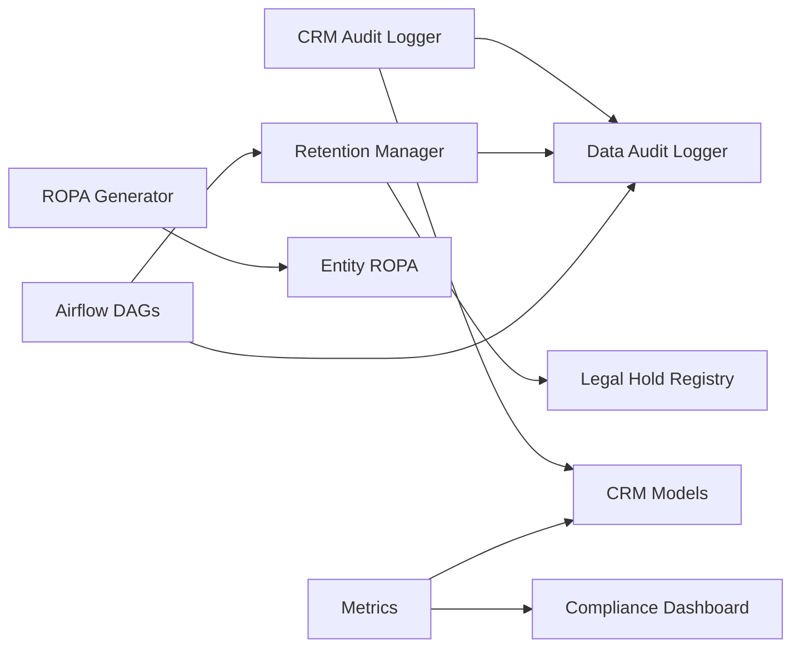

# Audit & Compliance Evidence

<cite>
**Referenced Files in This Document**
- [audit.py](file://data/src/audit.py)
- [retention_manager.py](file://data/src/gdpr/retention_manager.py)
- [entity_ropa.py](file://data/src/gdpr/entity_ropa.py)
- [ropa_generator.py](file://data/src/gdpr/ropa_generator.py)
- [anonymizer.py](file://data/src/gdpr/anonymizer.py)
- [crm_audit_logger.py](file://backend/django/apps/crm/audit_logger.py)
- [crm_models.py](file://backend/django/apps/crm/models.py)
- [jol_daily_sync.py](file://data/airflow/dags/jol_daily_sync.py)
- [jol_hub_etl.py](file://data/airflow/dags/jol_hub_etl.py)
- [metrics.py](file://backend/django/apps/crm/observability/metrics.py)
- [test_compliance.py](file://data/tests/test_compliance.py)
- [run_compliance_tests.py](file://scripts/run_compliance_tests.py)
- [compliance_page.tsx](file://frontend/apps/admin-dashboard/src/app/(dashboard)/compliance/page.tsx)
- [GDPR-checklist.md](file://docs/compliance/GDPR-checklist.md)
</cite>

## Table of Contents
1. Introduction
2. Project Structure
3. Core Components
4. Architecture Overview
5. Detailed Component Analysis
6. Dependency Analysis
7. Performance Considerations
8. Troubleshooting Guide
9. Conclusion
10. Appendices

## Introduction
This document provides comprehensive audit and compliance evidence for the JOL-HUB platform, focusing on:
- What events are logged and how logs are structured
- Retention policies and log integrity protection
- Automated evidence collection and continuous compliance monitoring
- Audit controls for financial transactions, user access patterns, data modifications, and system changes
- Compliance reporting tools, evidence validation processes, and auditor access procedures
- Examples for generating reports, conducting internal audits, and preparing for external certification audits (SOC 2 Type II and ISO 27001)

## Project Structure
The audit and compliance capabilities span multiple layers:
- Data processing and retention logic under data/src
- Django CRM audit logging and models under backend/django/apps/crm
- Scheduled jobs for cleanup and reporting under data/airflow/dags
- Observability metrics and dashboards under backend/django/apps/crm/observability
- Frontend compliance dashboard under frontend/apps/admin-dashboard
- Compliance documentation and evidence artifacts under docs/compliance

**Diagram sources**
- [audit.py:205-369](file://data/src/audit.py#L205-L369)
- [retention_manager.py:188-336](file://data/src/gdpr/retention_manager.py#L188-L336)
- [ropa_generator.py:103-182](file://data/src/gdpr/ropa_generator.py#L103-L182)
- [entity_ropa.py:39-797](file://data/src/gdpr/entity_ropa.py#L39-L797)
- [anonymizer.py:106-180](file://data/src/gdpr/anonymizer.py#L106-L180)
- [crm_audit_logger.py:154-716](file://backend/django/apps/crm/audit_logger.py#L154-L716)
- [crm_models.py:71-200](file://backend/django/apps/crm/models.py#L71-L200)
- [jol_daily_sync.py:53-72](file://data/airflow/dags/jol_daily_sync.py#L53-L72)
- [jol_hub_etl.py:44-70](file://data/airflow/dags/jol_hub_etl.py#L44-L70)
- [metrics.py:125-294](file://backend/django/apps/crm/observability/metrics.py#L125-L294)
- [compliance_page.tsx:35-72](file://frontend/apps/admin-dashboard/src/app/(dashboard)/compliance/page.tsx#L35-L72)

**Section sources**
- [audit.py:205-369](file://data/src/audit.py#L205-L369)
- [retention_manager.py:188-336](file://data/src/gdpr/retention_manager.py#L188-L336)
- [crm_audit_logger.py:154-716](file://backend/django/apps/crm/audit_logger.py#L154-L716)
- [crm_models.py:71-200](file://backend/django/apps/crm/models.py#L71-L200)
- [jol_daily_sync.py:53-72](file://data/airflow/dags/jol_daily_sync.py#L53-L72)
- [jol_hub_etl.py:44-70](file://data/airflow/dags/jol_hub_etl.py#L44-L70)
- [metrics.py:125-294](file://backend/django/apps/crm/observability/metrics.py#L125-L294)
- [compliance_page.tsx:35-72](file://frontend/apps/admin-dashboard/src/app/(dashboard)/compliance/page.tsx#L35-L72)

## Core Components
- Tamper-evident audit logging with hash chain and HMAC signatures
- CRM-specific compliance audit logger with field-level change tracking and legal basis determination
- GDPR retention management with legal hold enforcement
- Records of Processing Activities (ROPA) generation per entity type
- Anonymization utilities supporting k-anonymity thresholds by country
- Automated scheduling for retention cleanup and compliance reporting
- Metrics-driven compliance scoring and reporting

**Section sources**
- [audit.py:29-203](file://data/src/audit.py#L29-L203)
- [crm_audit_logger.py:44-153](file://backend/django/apps/crm/audit_logger.py#L44-L153)
- [retention_manager.py:78-106](file://data/src/gdpr/retention_manager.py#L78-L106)
- [entity_ropa.py:39-797](file://data/src/gdpr/entity_ropa.py#L39-L797)
- [anonymizer.py:25-83](file://data/src/gdpr/anonymizer.py#L25-L83)
- [jol_daily_sync.py:53-72](file://data/airflow/dags/jol_daily_sync.py#L53-L72)
- [jol_hub_etl.py:44-70](file://data/airflow/dags/jol_hub_etl.py#L44-L70)
- [metrics.py:125-294](file://backend/django/apps/crm/observability/metrics.py#L125-L294)

## Architecture Overview
The audit and compliance architecture integrates event logging, retention enforcement, and reporting across data and application layers:

**Diagram sources**
- [crm_audit_logger.py:218-503](file://backend/django/apps/crm/audit_logger.py#L218-L503)
- [audit.py:330-369](file://data/src/audit.py#L330-L369)
- [jol_daily_sync.py:53-72](file://data/airflow/dags/jol_daily_sync.py#L53-L72)
- [jol_hub_etl.py:44-70](file://data/airflow/dags/jol_hub_etl.py#L44-L70)
- [metrics.py:256-294](file://backend/django/apps/crm/observability/metrics.py#L256-L294)
- [compliance_page.tsx:35-72](file://frontend/apps/admin-dashboard/src/app/(dashboard)/compliance/page.tsx#L35-L72)

## Detailed Component Analysis

### Tamper-Evident Audit Logging (SOC 2 CC7.2, ISO 27001 A.12.4.2)
- Events include data operations, processing lifecycle, GDPR requests, consent changes, security events, and data transfers
- Each event is sealed with:
  - Hash chain linking to previous event
  - HMAC signature using a secret key
  - Monotonically increasing sequence number
- Logs are appended daily to JSONL files; chain state persisted for continuity
- Verification methods check chain continuity, sequence monotonicity, event hash consistency, and HMAC validity

**Diagram sources**
- [audit.py:29-203](file://data/src/audit.py#L29-L203)
- [audit.py:205-369](file://data/src/audit.py#L205-L369)
- [audit.py:409-589](file://data/src/audit.py#L409-L589)

**Section sources**
- [audit.py:29-203](file://data/src/audit.py#L29-L203)
- [audit.py:205-369](file://data/src/audit.py#L205-L369)
- [audit.py:409-589](file://data/src/audit.py#L409-L589)

### CRM Compliance Audit Logger (PCI-DSS Req 10, SOC 2, ISO 27001)
- Captures create/update/delete/access/export events with field-level changes
- Determines GDPR legal basis automatically based on data classification and fields
- Logs financial transactions with amount, currency, and result for PCI-DSS
- Tracks consent changes and unauthorized access attempts
- Integrates with Django models and signals for automatic context injection

**Diagram sources**
- [crm_audit_logger.py:218-503](file://backend/django/apps/crm/audit_logger.py#L218-L503)
- [crm_models.py:71-200](file://backend/django/apps/crm/models.py#L71-L200)

**Section sources**
- [crm_audit_logger.py:218-503](file://backend/django/apps/crm/audit_logger.py#L218-L503)
- [crm_models.py:71-200](file://backend/django/apps/crm/models.py#L71-L200)

### Retention Management and Legal Holds (GDPR Art. 5(1)(e), Art. 17)
- Defines retention rules per data type with legal basis and approval requirements
- Enforces legal holds before any deletion; blocks erasure when holds are active
- Audits retention cleanup and blocked deletions
- Provides dry-run capability and subject skip lists for batch operations

**Diagram sources**
- [retention_manager.py:188-336](file://data/src/gdpr/retention_manager.py#L188-L336)

**Section sources**
- [retention_manager.py:78-106](file://data/src/gdpr/retention_manager.py#L78-L106)
- [retention_manager.py:188-336](file://data/src/gdpr/retention_manager.py#L188-L336)

### Records of Processing Activities (ROPA) (GDPR Art. 30)
- Generates entity-specific processing activities for all supported entity types
- Includes purpose, legal basis, data categories, subjects, recipients, retention, and security measures
- Supports JSON and Markdown outputs and saves time-stamped reports
- Aggregates summaries including sensitive data counts and maximum retention periods

**Diagram sources**
- [ropa_generator.py:19-43](file://data/src/gdpr/ropa_generator.py#L19-L43)
- [ropa_generator.py:103-182](file://data/src/gdpr/ropa_generator.py#L103-L182)
- [entity_ropa.py:39-797](file://data/src/gdpr/entity_ropa.py#L39-L797)

**Section sources**
- [ropa_generator.py:103-182](file://data/src/gdpr/ropa_generator.py#L103-L182)
- [entity_ropa.py:39-797](file://data/src/gdpr/entity_ropa.py#L39-L797)

### Anonymization Utilities (k-Anonymity)
- Country-specific k-values aligned with regulatory guidance
- Configurable quasi-identifiers and suppression characters
- Validates datasets against k-anonymity thresholds
- Hashes direct identifiers for anonymized exports

**Section sources**
- [anonymizer.py:25-83](file://data/src/gdpr/anonymizer.py#L25-L83)
- [anonymizer.py:106-180](file://data/src/gdpr/anonymizer.py#L106-L180)

### Automated Evidence Collection and Continuous Monitoring
- Airflow DAGs schedule:
  - Retention cleanup for operational logs and user activity
  - Daily GDPR compliance report generation
- ETL pipeline logs retention actions and generates weekly compliance reports
- Observability metrics aggregate pending/overdue DSRs, consent metrics, legal holds, audit integrity, and failed access attempts
- Compliance dashboard displays status cards and export options

**Diagram sources**
- [jol_daily_sync.py:53-72](file://data/airflow/dags/jol_daily_sync.py#L53-L72)
- [jol_hub_etl.py:44-70](file://data/airflow/dags/jol_hub_etl.py#L44-L70)
- [metrics.py:256-294](file://backend/django/apps/crm/observability/metrics.py#L256-L294)
- [compliance_page.tsx:35-72](file://frontend/apps/admin-dashboard/src/app/(dashboard)/compliance/page.tsx#L35-L72)

**Section sources**
- [jol_daily_sync.py:53-72](file://data/airflow/dags/jol_daily_sync.py#L53-L72)
- [jol_hub_etl.py:44-70](file://data/airflow/dags/jol_hub_etl.py#L44-L70)
- [metrics.py:125-294](file://backend/django/apps/crm/observability/metrics.py#L125-L294)
- [compliance_page.tsx:35-72](file://frontend/apps/admin-dashboard/src/app/(dashboard)/compliance/page.tsx#L35-L72)

## Dependency Analysis
Key dependencies and relationships:
- CRM Audit Logger depends on Django models and settings for tenant context and secret keys
- Data Audit Logger persists JSONL logs and maintains chain state
- Retention Manager depends on Audit Logger and Legal Hold Registry
- ROPA Generator composes entity-specific activities and outputs reports
- Airflow DAGs orchestrate retention cleanup and report generation
- Metrics module aggregates audit entries and computes compliance scores

**Diagram sources**
- [crm_audit_logger.py:218-503](file://backend/django/apps/crm/audit_logger.py#L218-L503)
- [audit.py:205-369](file://data/src/audit.py#L205-L369)
- [retention_manager.py:188-336](file://data/src/gdpr/retention_manager.py#L188-L336)
- [entity_ropa.py:39-797](file://data/src/gdpr/entity_ropa.py#L39-L797)
- [jol_daily_sync.py:53-72](file://data/airflow/dags/jol_daily_sync.py#L53-L72)
- [jol_hub_etl.py:44-70](file://data/airflow/dags/jol_hub_etl.py#L44-L70)
- [metrics.py:256-294](file://backend/django/apps/crm/observability/metrics.py#L256-L294)

**Section sources**
- [crm_audit_logger.py:218-503](file://backend/django/apps/crm/audit_logger.py#L218-L503)
- [audit.py:205-369](file://data/src/audit.py#L205-L369)
- [retention_manager.py:188-336](file://data/src/gdpr/retention_manager.py#L188-L336)
- [entity_ropa.py:39-797](file://data/src/gdpr/entity_ropa.py#L39-L797)
- [jol_daily_sync.py:53-72](file://data/airflow/dags/jol_daily_sync.py#L53-L72)
- [jol_hub_etl.py:44-70](file://data/airflow/dags/jol_hub_etl.py#L44-L70)
- [metrics.py:256-294](file://backend/django/apps/crm/observability/metrics.py#L256-L294)

## Performance Considerations
- Append-only JSONL logs minimize write overhead and support efficient querying by date ranges
- Chain state persistence reduces re-computation and ensures continuity across sessions
- Field-level change tracking captures only changed fields to reduce payload size
- Batch deletion operations use dry-run mode to avoid unnecessary writes during planning
- Metrics aggregation uses time-bounded queries (e.g., last 24 hours) to limit load

[No sources needed since this section provides general guidance]

## Troubleshooting Guide
Common issues and resolutions:
- Audit chain break: Indicates insertion or modification; verify prev_hash linkage and sequence numbers
- Signature invalid: HMAC verification failure suggests tampering or key mismatch; ensure consistent secret key usage
- Sequence gap: Missing or reordered events; investigate log rotation and append operations
- Retention blocked: Active legal hold prevents deletion; review legal hold registry and lift holds if appropriate
- Overdue DSRs: Reduce response times and prioritize backlog; monitor metrics for trends

**Section sources**
- [audit.py:513-589](file://data/src/audit.py#L513-L589)
- [retention_manager.py:257-336](file://data/src/gdpr/retention_manager.py#L257-L336)
- [metrics.py:256-294](file://backend/django/apps/crm/observability/metrics.py#L256-L294)

## Conclusion
JOL-HUB implements a robust audit and compliance framework that:
- Produces tamper-evident logs with hash chains and HMAC signatures
- Enforces retention policies and legal holds to comply with GDPR
- Automates evidence collection and continuous monitoring via scheduled tasks and metrics
- Supports SOC 2 Type II and ISO 27001 through structured audit trails, financial transaction logging, and compliance reporting
- Provides tools for auditors to validate integrity, generate reports, and assess compliance posture

[No sources needed since this section summarizes without analyzing specific files]

## Appendices

### Evidence Validation and Auditor Access Procedures
- Validate audit chain integrity using verification methods to detect tampering
- Generate compliance reports for specified periods to demonstrate control effectiveness
- Export ROPA documents for each entity type to show lawful processing activities
- Use anonymization utilities to prepare safe datasets for analysis and sharing
- Schedule periodic tests to ensure ongoing compliance readiness

**Section sources**
- [audit.py:513-589](file://data/src/audit.py#L513-L589)
- [ropa_generator.py:121-169](file://data/src/gdpr/ropa_generator.py#L121-L169)
- [anonymizer.py:106-180](file://data/src/gdpr/anonymizer.py#L106-L180)
- [run_compliance_tests.py:180-314](file://scripts/run_compliance_tests.py#L180-L314)
- [test_compliance.py:38-131](file://data/tests/test_compliance.py#L38-L131)
- [GDPR-checklist.md:712-799](file://docs/compliance/GDPR-checklist.md#L712-L799)