# Compliance & Security

<cite>
**Referenced Files in This Document**
- [dsr_service.py](file://backend/django/apps/core/dsr_service.py)
- [models.py](file://backend/django/apps/core/models.py)
- [anonymizer.py](file://data/src/gdpr/anonymizer.py)
- [retention_manager.py](file://data/src/gdpr/retention_manager.py)
- [entity_ropa.py](file://data/src/gdpr/entity_ropa.py)
- [ropa_generator.py](file://data/src/gdpr/ropa_generator.py)
- [encryption.py](file://data/src/encryption.py)
- [audit.py](file://data/src/audit.py)
- [gdpr_consent_validation.py](file://data/src/quality/expectations/gdpr_consent_validation.py)
- [security-model.md](file://docs/architecture/security-model.md)
- [GDPR-checklist.md](file://docs/compliance/GDPR-checklist.md)
- [dpia-payment-events.md](file://docs/compliance/dpia-payment-events.md)
- [compliance-check.yml](file://.github/workflows/compliance-check.yml)
- [test_compliance.py](file://data/tests/test_compliance.py)
</cite>

## Table of Contents
1. Introduction
2. Project Structure
3. Core Components
4. Architecture Overview
5. Detailed Component Analysis
6. Dependency Analysis
7. Performance Considerations
8. Troubleshooting Guide
9. Conclusion
10. Appendices

## Introduction
This document provides comprehensive compliance and security documentation for the JOL-HUB platform, focusing on GDPR compliance measures, security architecture, encryption, audit logging, vulnerability scanning, and frameworks such as SOC 2 Type II and ISO 27001. It also includes practical guidance for privacy by design, data protection impact assessments (DPIA), and maintaining compliance evidence for audits.

## Project Structure
JOL-HUB implements compliance and security across multiple layers:
- Backend Django services handle Data Subject Requests (DSR), consent management, and audit logging.
- Data processing modules implement anonymization, retention policies, and Records of Processing Activities (ROPA).
- Encryption services provide key lifecycle management with AWS KMS or local providers.
- Documentation defines security model, GDPR checklist, and DPIA procedures.
- CI/CD workflows enforce compliance checks and tests.

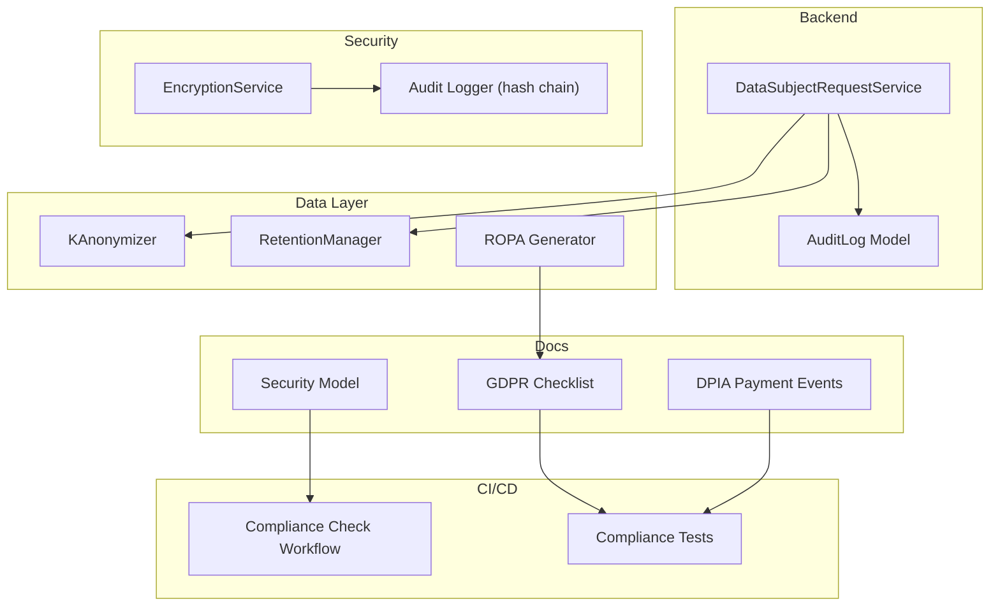

**Diagram sources**
- [dsr_service.py:36-128](file://backend/django/apps/core/dsr_service.py#L36-L128)
- [models.py:67-227](file://backend/django/apps/core/models.py#L67-L227)
- [anonymizer.py:106-179](file://data/src/gdpr/anonymizer.py#L106-L179)
- [retention_manager.py:188-336](file://data/src/gdpr/retention_manager.py#L188-L336)
- [ropa_generator.py:103-182](file://data/src/gdpr/ropa_generator.py#L103-L182)
- [encryption.py:346-521](file://data/src/encryption.py#L346-L521)
- [audit.py:205-240](file://data/src/audit.py#L205-L240)
- [security-model.md:19-30](file://docs/architecture/security-model.md#L19-L30)
- [GDPR-checklist.md:14-70](file://docs/compliance/GDPR-checklist.md#L14-L70)
- [dpia-payment-events.md:9-33](file://docs/compliance/dpia-payment-events.md#L9-L33)
- [compliance-check.yml:196-222](file://.github/workflows/compliance-check.yml#L196-L222)
- [test_compliance.py:38-57](file://data/tests/test_compliance.py#L38-L57)

**Section sources**
- [dsr_service.py:36-128](file://backend/django/apps/core/dsr_service.py#L36-L128)
- [models.py:67-227](file://backend/django/apps/core/models.py#L67-L227)
- [anonymizer.py:106-179](file://data/src/gdpr/anonymizer.py#L106-L179)
- [retention_manager.py:188-336](file://data/src/gdpr/retention_manager.py#L188-L336)
- [ropa_generator.py:103-182](file://data/src/gdpr/ropa_generator.py#L103-L182)
- [encryption.py:346-521](file://data/src/encryption.py#L346-L521)
- [audit.py:205-240](file://data/src/audit.py#L205-L240)
- [security-model.md:19-30](file://docs/architecture/security-model.md#L19-L30)
- [GDPR-checklist.md:14-70](file://docs/compliance/GDPR-checklist.md#L14-L70)
- [dpia-payment-events.md:9-33](file://docs/compliance/dpia-payment-events.md#L9-L33)
- [compliance-check.yml:196-222](file://.github/workflows/compliance-check.yml#L196-L222)
- [test_compliance.py:38-57](file://data/tests/test_compliance.py#L38-L57)

## Core Components
- Data Subject Request Service: Implements GDPR Articles 15–22 with request creation, processing, and audit logging.
- Consent Management: Records and verifies consent, supports withdrawal and versioning.
- Retention Manager: Enforces storage limitation and legal hold checks before deletion.
- Anonymizer: Applies k-anonymity with country-specific thresholds and hashing of direct identifiers.
- ROPA Generator: Produces Records of Processing Activities per entity type and standard activities.
- Encryption Service: Manages keys via AWS KMS or local provider, supports rotation and re-encryption.
- Audit Logging: Immutable hash-chain logs with HMAC signatures for integrity and tamper detection.

**Section sources**
- [dsr_service.py:36-128](file://backend/django/apps/core/dsr_service.py#L36-L128)
- [dsr_service.py:378-496](file://backend/django/apps/core/dsr_service.py#L378-L496)
- [retention_manager.py:188-336](file://data/src/gdpr/retention_manager.py#L188-L336)
- [anonymizer.py:106-179](file://data/src/gdpr/anonymizer.py#L106-L179)
- [ropa_generator.py:103-182](file://data/src/gdpr/ropa_generator.py#L103-L182)
- [encryption.py:346-521](file://data/src/encryption.py#L346-L521)
- [audit.py:205-240](file://data/src/audit.py#L205-L240)

## Architecture Overview
The platform adopts a defense-in-depth security model with zero-trust principles, layered controls from network to data, identity and access management, monitoring, and incident response. Encryption is enforced at rest and in transit, with robust key management. Audit logs are immutable and integrity-protected.

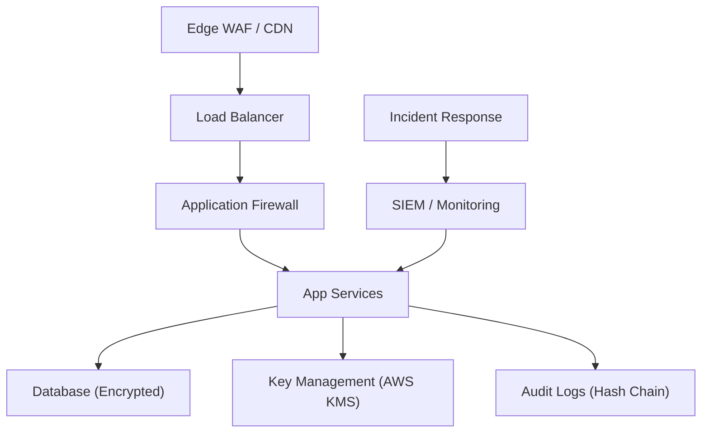

**Diagram sources**
- [security-model.md:31-73](file://docs/architecture/security-model.md#L31-L73)
- [security-model.md:144-166](file://docs/architecture/security-model.md#L144-L166)
- [audit.py:205-240](file://data/src/audit.py#L205-L240)
- [encryption.py:104-175](file://data/src/encryption.py#L104-L175)

## Detailed Component Analysis

### GDPR Data Subject Rights Automation
- Access (Art. 15): Collects personal data and returns machine-readable export; logs actions.
- Rectification (Art. 16): Updates inaccurate data; logs field changes without sensitive details.
- Erasure (Art. 17): Checks legal holds and canonical records; erases non-canonical PII or all data; logs outcomes.
- Restriction (Art. 18): Marks data as restricted; logs reason.
- Portability (Art. 20): Exports data in JSON format with metadata; logs format and request ID.
- Objection (Art. 21): Stops specific processing; logs processing type and reason.

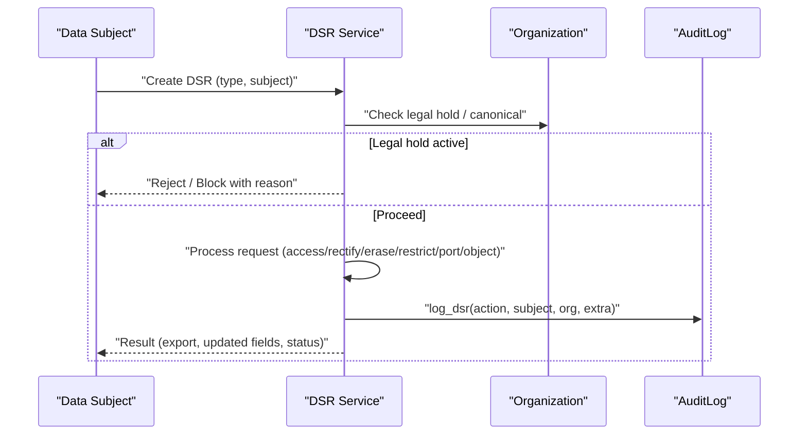

**Diagram sources**
- [dsr_service.py:81-128](file://backend/django/apps/core/dsr_service.py#L81-L128)
- [dsr_service.py:130-192](file://backend/django/apps/core/dsr_service.py#L130-L192)
- [dsr_service.py:194-252](file://backend/django/apps/core/dsr_service.py#L194-L252)
- [dsr_service.py:254-347](file://backend/django/apps/core/dsr_service.py#L254-L347)
- [models.py:214-227](file://backend/django/apps/core/models.py#L214-L227)

**Section sources**
- [dsr_service.py:81-128](file://backend/django/apps/core/dsr_service.py#L81-L128)
- [dsr_service.py:130-192](file://backend/django/apps/core/dsr_service.py#L130-L192)
- [dsr_service.py:194-252](file://backend/django/apps/core/dsr_service.py#L194-L252)
- [dsr_service.py:254-347](file://backend/django/apps/core/dsr_service.py#L254-L347)
- [models.py:214-227](file://backend/django/apps/core/models.py#L214-L227)

### Consent Management
- Records consent with user ID, organization, types, IP, user agent, and version; logs action.
- Supports withdrawal with timestamp and status; logs withdrawal.
- Verifies consent by checking recent grants and absence of withdrawals.

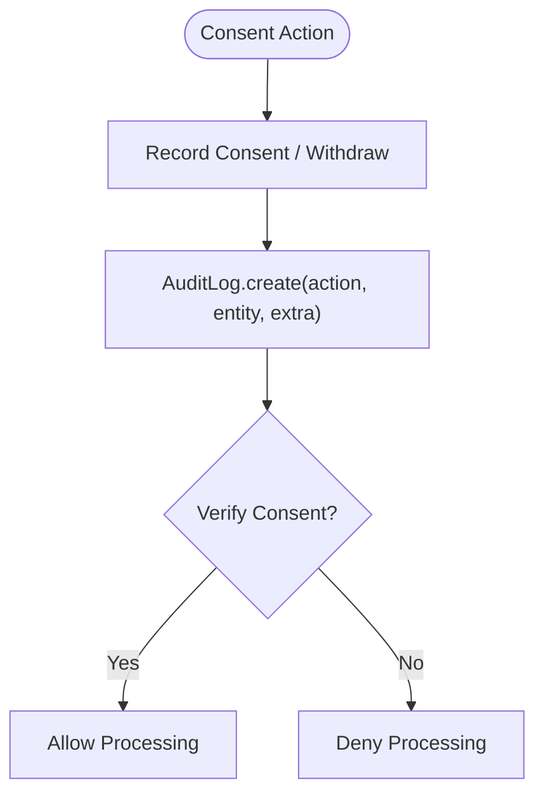

**Diagram sources**
- [dsr_service.py:391-465](file://backend/django/apps/core/dsr_service.py#L391-L465)
- [models.py:125-140](file://backend/django/apps/core/models.py#L125-L140)

**Section sources**
- [dsr_service.py:391-465](file://backend/django/apps/core/dsr_service.py#L391-L465)
- [models.py:125-140](file://backend/django/apps/core/models.py#L125-L140)

### Data Retention and Legal Holds
- Defines retention rules per data type with legal basis and approval requirements.
- LegalHoldRegistry tracks active holds and prevents deletion when holds exist.
- RetentionManager enforces deletion only after verifying no active holds; logs blocked attempts.

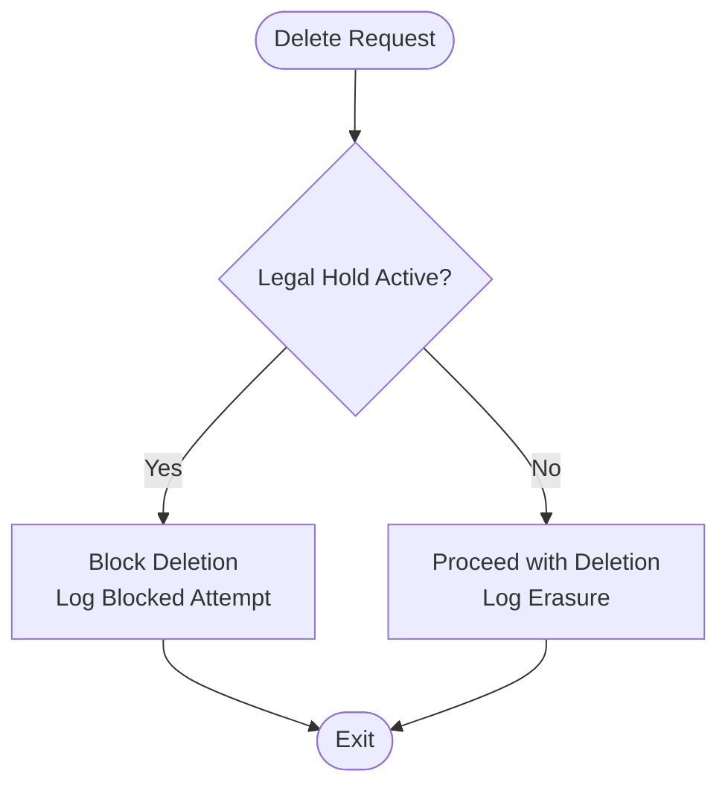

**Diagram sources**
- [retention_manager.py:109-174](file://data/src/gdpr/retention_manager.py#L109-L174)
- [retention_manager.py:257-317](file://data/src/gdpr/retention_manager.py#L257-L317)

**Section sources**
- [retention_manager.py:78-106](file://data/src/gdpr/retention_manager.py#L78-L106)
- [retention_manager.py:109-174](file://data/src/gdpr/retention_manager.py#L109-L174)
- [retention_manager.py:188-336](file://data/src/gdpr/retention_manager.py#L188-L336)

### Anonymization and Privacy Controls
- Country-specific k-anonymity thresholds ensure minimum group sizes.
- Hashes direct identifiers; rounds counts to nearest k; validates dataset satisfies k-anonymity.

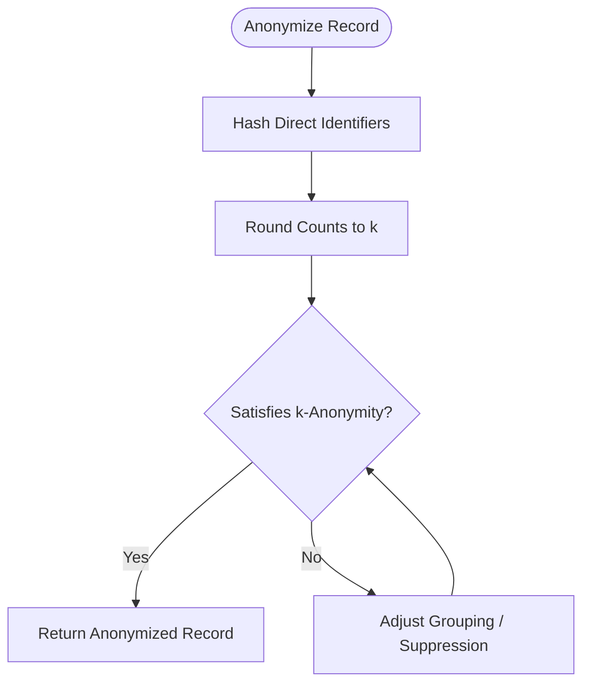

**Diagram sources**
- [anonymizer.py:25-83](file://data/src/gdpr/anonymizer.py#L25-L83)
- [anonymizer.py:106-179](file://data/src/gdpr/anonymizer.py#L106-L179)

**Section sources**
- [anonymizer.py:25-83](file://data/src/gdpr/anonymizer.py#L25-L83)
- [anonymizer.py:106-179](file://data/src/gdpr/anonymizer.py#L106-L179)

### Records of Processing Activities (ROPA)
- Standard activities cover donation processing, user accounts, analytics, and religious entity registration.
- Entity-specific activities map to basilica, cathedral, diocese, deanery, church, protestant, orthodox, greek catholic, funeral, cemetery.
- Generates reports in JSON or Markdown with summaries and compliance framework mapping.

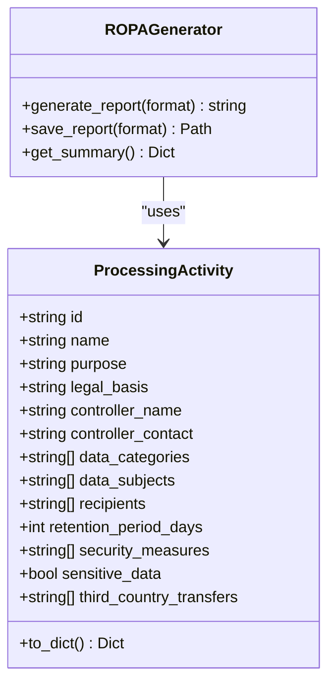

**Diagram sources**
- [ropa_generator.py:19-42](file://data/src/gdpr/ropa_generator.py#L19-L42)
- [ropa_generator.py:103-182](file://data/src/gdpr/ropa_generator.py#L103-L182)
- [entity_ropa.py:39-65](file://data/src/gdpr/entity_ropa.py#L39-L65)

**Section sources**
- [ropa_generator.py:45-100](file://data/src/gdpr/ropa_generator.py#L45-L100)
- [entity_ropa.py:105-165](file://data/src/gdpr/entity_ropa.py#L105-L165)
- [entity_ropa.py:168-227](file://data/src/gdpr/entity_ropa.py#L168-L227)
- [entity_ropa.py:230-291](file://data/src/gdpr/entity_ropa.py#L230-L291)
- [entity_ropa.py:294-339](file://data/src/gdpr/entity_ropa.py#L294-L339)
- [entity_ropa.py:342-403](file://data/src/gdpr/entity_ropa.py#L342-L403)
- [entity_ropa.py:410-468](file://data/src/gdpr/entity_ropa.py#L410-L468)
- [entity_ropa.py:471-518](file://data/src/gdpr/entity_ropa.py#L471-L518)
- [entity_ropa.py:521-567](file://data/src/gdpr/entity_ropa.py#L521-L567)
- [entity_ropa.py:574-646](file://data/src/gdpr/entity_ropa.py#L574-L646)
- [entity_ropa.py:649-720](file://data/src/gdpr/entity_ropa.py#L649-L720)
- [entity_ropa.py:723-755](file://data/src/gdpr/entity_ropa.py#L723-L755)
- [entity_ropa.py:762-797](file://data/src/gdpr/entity_ropa.py#L762-L797)

### Encryption at Rest and Key Management
- Supports AWS KMS and local providers with envelope encryption and AES-GCM/Fernet.
- Automatic key rotation, versioning, and re-encryption support.
- Secure memory handling and key lifecycle management aligned with ISO 27001 and SOC 2.

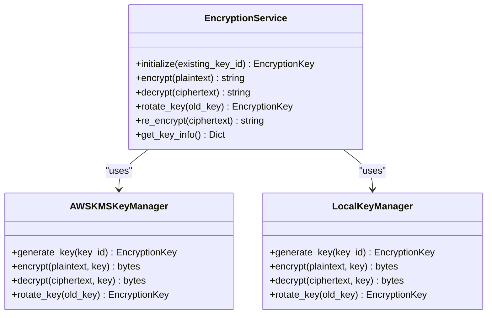

**Diagram sources**
- [encryption.py:104-175](file://data/src/encryption.py#L104-L175)
- [encryption.py:246-343](file://data/src/encryption.py#L246-L343)
- [encryption.py:346-521](file://data/src/encryption.py#L346-L521)

**Section sources**
- [encryption.py:27-68](file://data/src/encryption.py#L27-L68)
- [encryption.py:104-175](file://data/src/encryption.py#L104-L175)
- [encryption.py:246-343](file://data/src/encryption.py#L246-L343)
- [encryption.py:346-521](file://data/src/encryption.py#L346-L521)

### Audit Logging for Regulatory Compliance
- Immutable hash-chain logs with sequence numbers and previous hashes for integrity.
- HMAC signatures for tamper detection; supports verification and chain validation.
- Covers GDPR actions, consent events, and security events.

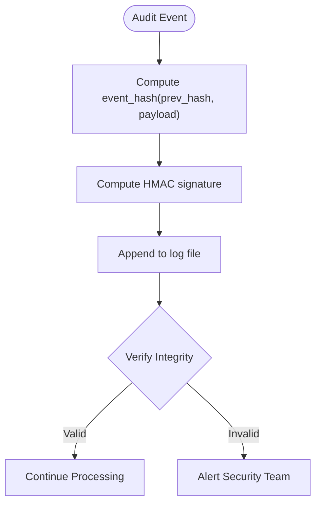

**Diagram sources**
- [audit.py:137-163](file://data/src/audit.py#L137-L163)
- [audit.py:205-240](file://data/src/audit.py#L205-L240)
- [audit.py:428-455](file://data/src/audit.py#L428-L455)

**Section sources**
- [audit.py:29-62](file://data/src/audit.py#L29-L62)
- [audit.py:137-163](file://data/src/audit.py#L137-L163)
- [audit.py:205-240](file://data/src/audit.py#L205-L240)
- [audit.py:428-455](file://data/src/audit.py#L428-L455)

### Vulnerability Scanning and Compliance Testing
- CI workflow runs GDPR, SOC 2 Type II, and PCI-DSS compliance tests.
- Tests verify presence of required components like tenant isolation, audit logging, and vulnerability scanning configuration.

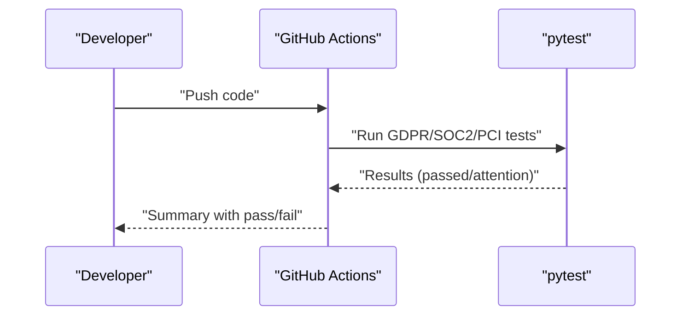

**Diagram sources**
- [compliance-check.yml:196-222](file://.github/workflows/compliance-check.yml#L196-L222)
- [test_compliance.py:431-456](file://data/tests/test_compliance.py#L431-L456)

**Section sources**
- [compliance-check.yml:196-222](file://.github/workflows/compliance-check.yml#L196-L222)
- [test_compliance.py:38-57](file://data/tests/test_compliance.py#L38-L57)
- [test_compliance.py:431-456](file://data/tests/test_compliance.py#L431-L456)

## Dependency Analysis
- DSR service depends on Organization methods for legal hold and canonical record checks; logs via AuditLog.
- Retention manager uses LegalHoldRegistry to prevent deletions under legal holds; integrates with AuditLogger.
- Encryption service abstracts key providers; AWS KMS integration requires boto3; local provider uses cryptography library.
- Audit logger writes to append-only files with integrity checks; used by retention and DSR flows.
- ROPA generator produces structured outputs consumed by compliance reporting.

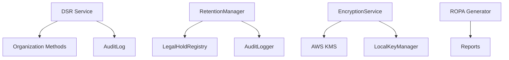

**Diagram sources**
- [dsr_service.py:194-252](file://backend/django/apps/core/dsr_service.py#L194-L252)
- [retention_manager.py:188-336](file://data/src/gdpr/retention_manager.py#L188-L336)
- [encryption.py:346-521](file://data/src/encryption.py#L346-L521)
- [audit.py:205-240](file://data/src/audit.py#L205-L240)
- [ropa_generator.py:103-182](file://data/src/gdpr/ropa_generator.py#L103-L182)

**Section sources**
- [dsr_service.py:194-252](file://backend/django/apps/core/dsr_service.py#L194-L252)
- [retention_manager.py:188-336](file://data/src/gdpr/retention_manager.py#L188-L336)
- [encryption.py:346-521](file://data/src/encryption.py#L346-L521)
- [audit.py:205-240](file://data/src/audit.py#L205-L240)
- [ropa_generator.py:103-182](file://data/src/gdpr/ropa_generator.py#L103-L182)

## Performance Considerations
- K-anonymity grouping scales with dataset size; choose appropriate quasi-identifiers to balance privacy and performance.
- Encryption operations using AWS KMS incur network latency; cache data keys where feasible.
- Audit log writes should be batched or asynchronous to avoid blocking critical paths.
- Retention cleanup jobs should run off-peak and use dry-run modes for large datasets.

[No sources needed since this section provides general guidance]

## Troubleshooting Guide
- DSR erasure blocked by legal hold: Review LegalHoldRegistry for active holds; lift holds when appropriate and retry.
- Consent validation failures: Check consent timestamps, withdrawal status, and required consents for processing type.
- Encryption errors: Ensure correct key provider configuration; verify KMS credentials and key IDs; check key expiration and rotation.
- Audit log integrity issues: Verify hash chain and HMAC signatures; investigate potential tampering if verification fails.

**Section sources**
- [retention_manager.py:257-317](file://data/src/gdpr/retention_manager.py#L257-L317)
- [gdpr_consent_validation.py:77-142](file://data/src/quality/expectations/gdpr_consent_validation.py#L77-L142)
- [encryption.py:387-462](file://data/src/encryption.py#L387-L462)
- [audit.py:137-163](file://data/src/audit.py#L137-L163)

## Conclusion
JOL-HUB implements a robust compliance and security posture through automated DSR handling, consent management, retention enforcement, anonymization, ROPA generation, encryption with key lifecycle management, and immutable audit logging. The security model emphasizes defense-in-depth, zero trust, and continuous monitoring. CI/CD pipelines enforce compliance testing, and DPIAs guide risk-aware feature rollouts. These practices support GDPR, SOC 2 Type II, and ISO 27001 objectives while enabling scalable, secure operations across diverse entity types.

[No sources needed since this section summarizes without analyzing specific files]

## Appendices

### Practical Examples
- Privacy by Design: Use anonymization and k-anonymity thresholds tailored to country regulations; apply data minimization in ROPA definitions.
- DPIA Process: Follow the payment-events DPIA structure—define parties, boundary, data flow, retention, necessity, risks, mitigations, and verdict conditions.
- Compliance Evidence: Maintain ROPA reports, consent logs, audit trails, and test results; store in version-controlled repositories with clear ownership and review cycles.

**Section sources**
- [anonymizer.py:25-83](file://data/src/gdpr/anonymizer.py#L25-L83)
- [ropa_generator.py:103-182](file://data/src/gdpr/ropa_generator.py#L103-L182)
- [dpia-payment-events.md:9-33](file://docs/compliance/dpia-payment-events.md#L9-L33)
- [dpia-payment-events.md:39-70](file://docs/compliance/dpia-payment-events.md#L39-L70)
- [dpia-payment-events.md:72-87](file://docs/compliance/dpia-payment-events.md#L72-L87)