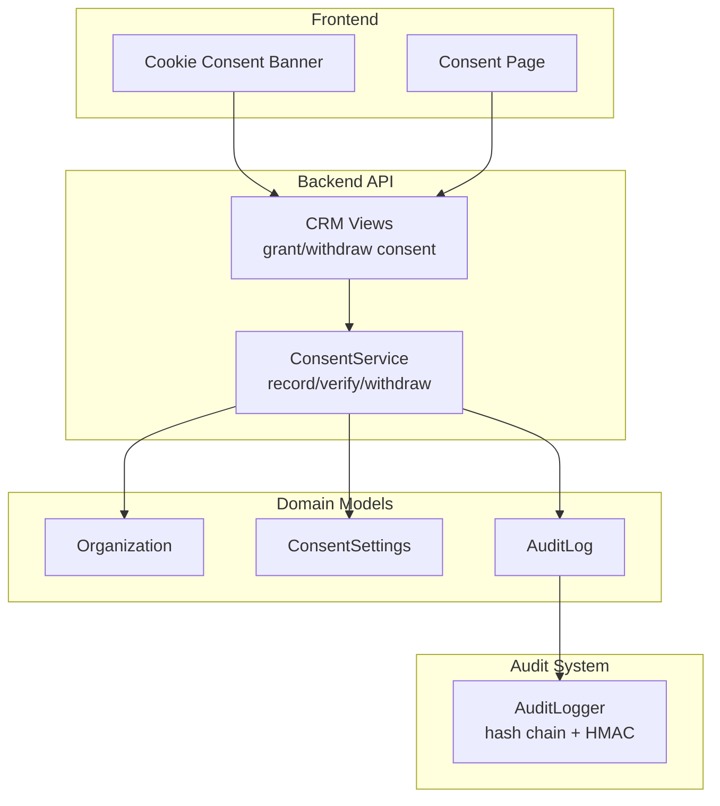
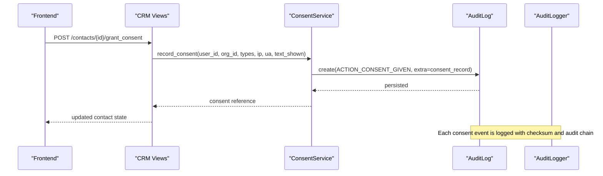
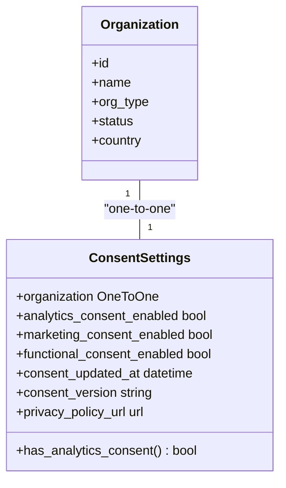
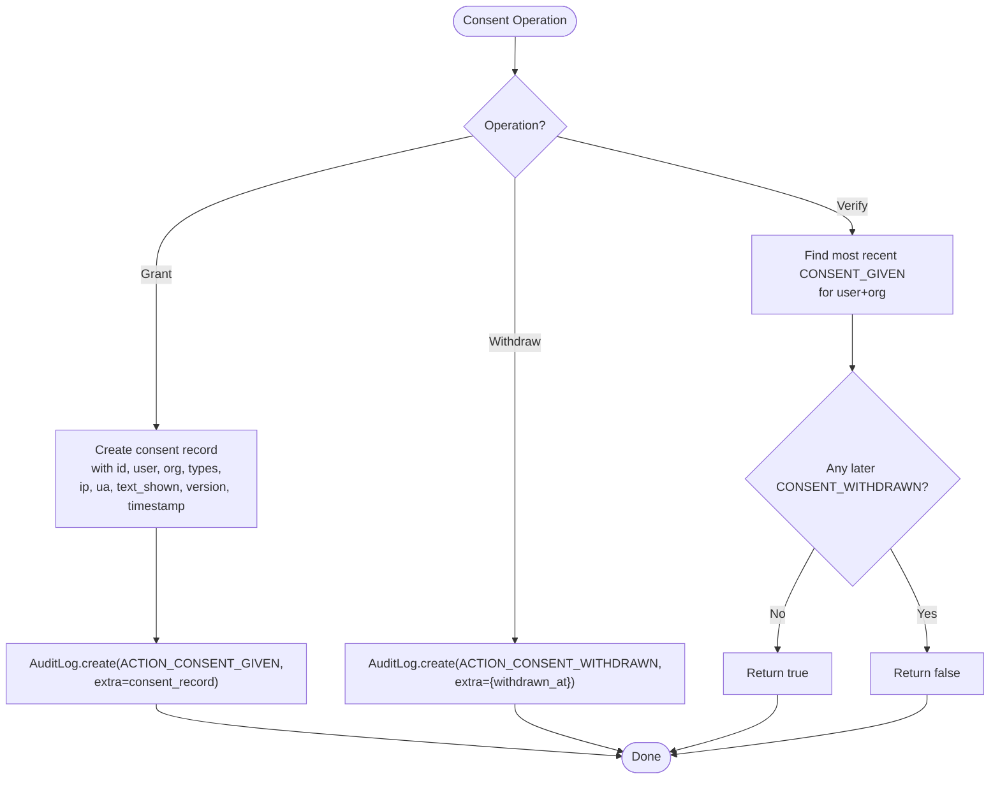
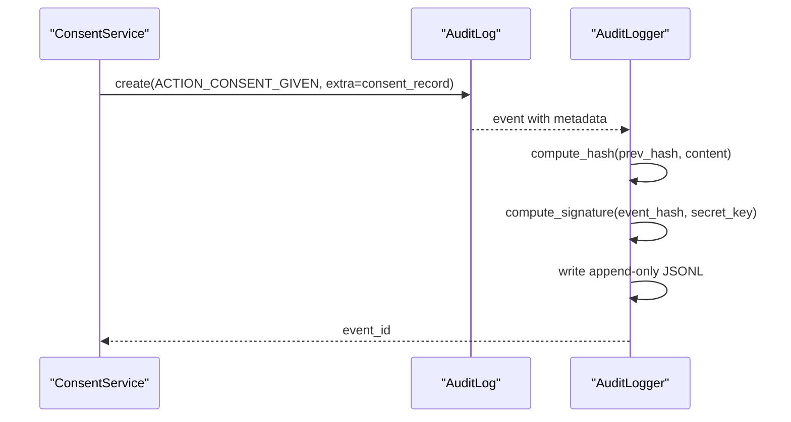
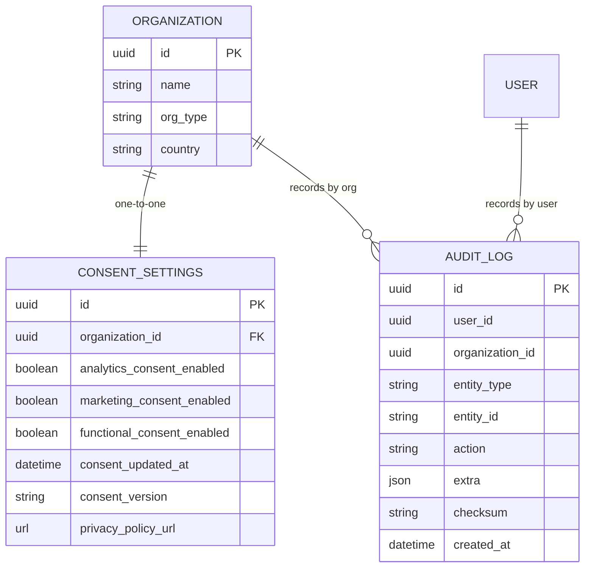
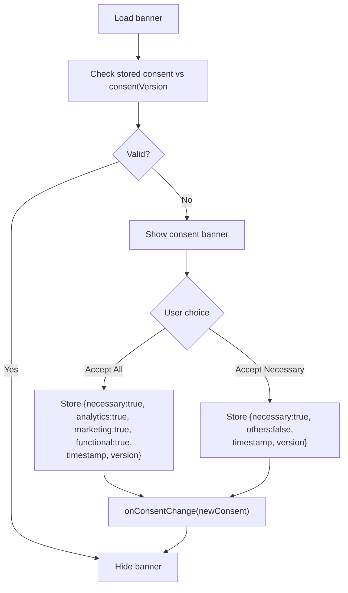
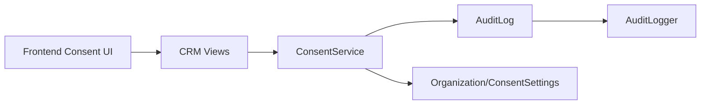

# Consent Collection & Storage

<cite>
**Referenced Files in This Document**
- [organizations/models.py](file://backend/django/apps/organizations/models.py)
- [organizations/migrations/0003_consentsettings.py](file://backend/django/apps/organizations/migrations/0003_consentsettings.py)
- [core/models.py](file://backend/django/apps/core/models.py)
- [core/dsr_service.py](file://backend/django/apps/core/dsr_service.py)
- [crm/api/views.py](file://backend/django/apps/crm/api/views.py)
- [audit.py](file://data/src/audit.py)
- [cookie-consent-banner.tsx](file://frontend/packages/ui/src/components/cookie-consent-banner.tsx)
- [consent-page.tsx](file://frontend/packages/ui/src/components/consent-page.tsx)
</cite>

## Table of Contents
1. Introduction
2. Project Structure
3. Core Components
4. Architecture Overview
5. Detailed Component Analysis
6. Dependency Analysis
7. Performance Considerations
8. Troubleshooting Guide
9. Conclusion

## Introduction
This document explains how JOL-HUB collects, stores, and audits consent for data processing across organizations and users. It covers:
- The ConsentSettings model structure and granular consent options (analytics, marketing, functional; necessary is also defined).
- Immutable consent record creation with timestamps and versioning.
- Audit logging with tamper-evident checksums and hash chains.
- The consent registry that links consent records to user accounts and organizations.
- Practical examples of frontend consent forms and API endpoints for consent operations.
- Database schema elements for consent storage.
- Integration with audit logs for GDPR compliance tracking and Data Subject Request handling.

## Project Structure
Consent-related functionality spans multiple layers:
- Domain models define organization-level consent settings and shared base models.
- Services implement consent recording, withdrawal, and verification.
- APIs expose consent actions for contacts/users.
- Audit subsystem provides tamper-evident logging with hash chains and HMAC signatures.
- Frontend components collect user preferences and persist them locally before syncing to the backend.

**Diagram sources**
- [cookie-consent-banner.tsx:83-138](file://frontend/packages/ui/src/components/cookie-consent-banner.tsx#L83-L138)
- [consent-page.tsx:201-278](file://frontend/packages/ui/src/components/consent-page.tsx#L201-L278)
- [crm/api/views.py:209-250](file://backend/django/apps/crm/api/views.py#L209-L250)
- [core/dsr_service.py:378-495](file://backend/django/apps/core/dsr_service.py#L378-L495)
- [organizations/models.py:388-495](file://backend/django/apps/organizations/models.py#L388-L495)
- [core/models.py:67-227](file://backend/django/apps/core/models.py#L67-L227)
- [audit.py:205-369](file://data/src/audit.py#L205-L369)

**Section sources**
- [organizations/models.py:388-495](file://backend/django/apps/organizations/models.py#L388-L495)
- [core/models.py:67-227](file://backend/django/apps/core/models.py#L67-L227)
- [core/dsr_service.py:378-495](file://backend/django/apps/core/dsr_service.py#L378-L495)
- [crm/api/views.py:209-250](file://backend/django/apps/crm/api/views.py#L209-L250)
- [audit.py:205-369](file://data/src/audit.py#L205-L369)
- [cookie-consent-banner.tsx:83-138](file://frontend/packages/ui/src/components/cookie-consent-banner.tsx#L83-L138)
- [consent-page.tsx:201-278](file://frontend/packages/ui/src/components/consent-page.tsx#L201-L278)

## Core Components
- ConsentSettings: Per-organization consent configuration with granular toggles and versioning.
- ConsentService: Records consent, supports withdrawal, and verifies current consent status.
- AuditLog: Immutable audit trail with tenant isolation and checksum generation.
- AuditLogger: Tamper-evident log chain using SHA-256 hashes and HMAC signatures.
- CRM API: Endpoints to grant or withdraw consent for a contact/user.
- Frontend Consent UI: Collects user preferences, validates consent versions, and persists locally.

Key responsibilities:
- ConsentSettings defines allowed consent types and per-organization flags.
- ConsentService creates immutable consent records with timestamps and version.
- AuditLog captures every consent action with checksums and metadata.
- AuditLogger ensures integrity via hash chains and HMAC signatures.
- CRM API exposes consent operations and logs access.
- Frontend components manage consent UX and local storage.

**Section sources**
- [organizations/models.py:388-495](file://backend/django/apps/organizations/models.py#L388-L495)
- [core/dsr_service.py:378-495](file://backend/django/apps/core/dsr_service.py#L378-L495)
- [core/models.py:67-227](file://backend/django/apps/core/models.py#L67-L227)
- [audit.py:205-369](file://data/src/audit.py#L205-L369)
- [crm/api/views.py:209-250](file://backend/django/apps/crm/api/views.py#L209-L250)
- [cookie-consent-banner.tsx:83-138](file://frontend/packages/ui/src/components/cookie-consent-banner.tsx#L83-L138)
- [consent-page.tsx:201-278](file://frontend/packages/ui/src/components/consent-page.tsx#L201-L278)

## Architecture Overview
The consent architecture enforces:
- Granular consent by type at the organization level.
- Immutable, timestamped consent records linked to users and organizations.
- Tamper-evident audit trails with hash chains and HMAC signatures.
- Clear separation between UI collection, service logic, and persistence.

**Diagram sources**
- [crm/api/views.py:209-250](file://backend/django/apps/crm/api/views.py#L209-L250)
- [core/dsr_service.py:391-435](file://backend/django/apps/core/dsr_service.py#L391-L435)
- [core/models.py:67-227](file://backend/django/apps/core/models.py#L67-L227)
- [audit.py:330-369](file://data/src/audit.py#L330-L369)

## Detailed Component Analysis

### ConsentSettings Model and Versioning
- Defines consent types: necessary, analytics, marketing, functional.
- Stores per-organization boolean flags for each consent category.
- Tracks consent_version and privacy_policy_url.
- Enforces tenant context validation on save to prevent cross-tenant manipulation.
- Provides helper methods to check consent status (e.g., analytics consent).

Database migration confirms fields like analytics_consent_enabled, marketing_consent_enabled, functional_consent_enabled, consent_updated_at, consent_version, and privacy_policy_url.

**Diagram sources**
- [organizations/models.py:388-495](file://backend/django/apps/organizations/models.py#L388-L495)
- [organizations/migrations/0003_consentsettings.py:14-37](file://backend/django/apps/organizations/migrations/0003_consentsettings.py#L14-L37)

**Section sources**
- [organizations/models.py:388-495](file://backend/django/apps/organizations/models.py#L388-L495)
- [organizations/migrations/0003_consentsettings.py:14-37](file://backend/django/apps/organizations/migrations/0003_consentsettings.py#L14-L37)

### Consent Service: Recording, Withdrawal, Verification
- record_consent: Creates an immutable consent record with id, user_id, organization_id, consent_types, ip_address, user_agent, consent_text_shown, version, and timestamp. Persists via AuditLog with ACTION_CONSENT_GIVEN.
- withdraw_consent: Logs ACTION_CONSENT_WITHDRAWN with withdrawn_at timestamp.
- verify_consent: Checks for a recent non-withdrawn consent entry for the user and organization.

**Diagram sources**
- [core/dsr_service.py:391-495](file://backend/django/apps/core/dsr_service.py#L391-L495)
- [core/models.py:67-227](file://backend/django/apps/core/models.py#L67-L227)

**Section sources**
- [core/dsr_service.py:391-495](file://backend/django/apps/core/dsr_service.py#L391-L495)
- [core/models.py:67-227](file://backend/django/apps/core/models.py#L67-L227)

### Audit Logging and Tamper-Evident Integrity
- AuditEvent: Captures action, resource details, legal basis, categories, retention, sequence_number, prev_hash, event_hash, signature.
- AuditLogger: Maintains a hash chain and HMAC signatures; writes append-only JSONL files; rotates daily; persists chain state.
- Chain verification checks continuity, sequence monotonicity, hash consistency, and HMAC validity.

**Diagram sources**
- [audit.py:65-203](file://data/src/audit.py#L65-L203)
- [audit.py:330-369](file://data/src/audit.py#L330-L369)
- [audit.py:513-589](file://data/src/audit.py#L513-L589)
- [core/models.py:156-212](file://backend/django/apps/core/models.py#L156-L212)

**Section sources**
- [audit.py:65-203](file://data/src/audit.py#L65-L203)
- [audit.py:330-369](file://data/src/audit.py#L330-L369)
- [audit.py:513-589](file://data/src/audit.py#L513-L589)
- [core/models.py:156-212](file://backend/django/apps/core/models.py#L156-L212)

### Consent Registry: Linking Records to Users and Organizations
- Consent records include user_id and organization_id, enabling precise linkage.
- ConsentSettings ties consent policy to a specific Organization via OneToOne relationship.
- AuditLog indexes support queries by entity_type, entity_id, user_id, organization_id, and data_subject_id.

**Diagram sources**
- [organizations/models.py:388-495](file://backend/django/apps/organizations/models.py#L388-L495)
- [core/models.py:67-227](file://backend/django/apps/core/models.py#L67-L227)

**Section sources**
- [organizations/models.py:388-495](file://backend/django/apps/organizations/models.py#L388-L495)
- [core/models.py:67-227](file://backend/django/apps/core/models.py#L67-L227)

### Frontend Consent Forms: Examples and Behavior
- Cookie Consent Banner: Validates stored consent against consentVersion, allows accept all or accept necessary, stores preferences with timestamp and version, and triggers callbacks.
- Consent Page: Loads current consents, toggles categories, saves updates, and supports withdrawing all consents.

**Diagram sources**
- [cookie-consent-banner.tsx:83-138](file://frontend/packages/ui/src/components/cookie-consent-banner.tsx#L83-L138)
- [consent-page.tsx:201-278](file://frontend/packages/ui/src/components/consent-page.tsx#L201-L278)

**Section sources**
- [cookie-consent-banner.tsx:83-138](file://frontend/packages/ui/src/components/cookie-consent-banner.tsx#L83-L138)
- [consent-page.tsx:201-278](file://frontend/packages/ui/src/components/consent-page.tsx#L201-L278)

### API Endpoints for Consent Operations
- Grant consent: POST /contacts/{id}/grant_consent — accepts consent_version, updates contact consent state, and logs access.
- Withdraw consent: POST /contacts/{id}/withdraw_consent — marks consent as withdrawn and logs access.

These endpoints integrate with CRM models and services to update consent status and trigger audit logging.

**Section sources**
- [crm/api/views.py:209-250](file://backend/django/apps/crm/api/views.py#L209-L250)

### Database Schema for Consent Storage
- ConsentSettings table includes:
  - organization (OneToOne)
  - analytics_consent_enabled, marketing_consent_enabled, functional_consent_enabled
  - consent_updated_at, consent_version, privacy_policy_url
- AuditLog table includes:
  - user_id, organization_id, entity_type, entity_id, action, extra, checksum, created_at
- Migrations confirm field definitions and constraints.

**Section sources**
- [organizations/migrations/0003_consentsettings.py:14-37](file://backend/django/apps/organizations/migrations/0003_consentsettings.py#L14-L37)
- [core/models.py:67-227](file://backend/django/apps/core/models.py#L67-L227)

## Dependency Analysis
- ConsentService depends on AuditLog for immutable recording and uses organization context for scoping.
- CRM views depend on ConsentService and CRM models to update consent states and log access.
- AuditLogger depends on file system for append-only logs and environment variables for secret keys.
- Frontend components depend on local storage and consentVersion to ensure valid consent UX.

**Diagram sources**
- [crm/api/views.py:209-250](file://backend/django/apps/crm/api/views.py#L209-L250)
- [core/dsr_service.py:378-495](file://backend/django/apps/core/dsr_service.py#L378-L495)
- [core/models.py:67-227](file://backend/django/apps/core/models.py#L67-L227)
- [audit.py:205-369](file://data/src/audit.py#L205-L369)
- [organizations/models.py:388-495](file://backend/django/apps/organizations/models.py#L388-L495)

**Section sources**
- [crm/api/views.py:209-250](file://backend/django/apps/crm/api/views.py#L209-L250)
- [core/dsr_service.py:378-495](file://backend/django/apps/core/dsr_service.py#L378-L495)
- [core/models.py:67-227](file://backend/django/apps/core/models.py#L67-L227)
- [audit.py:205-369](file://data/src/audit.py#L205-L369)
- [organizations/models.py:388-495](file://backend/django/apps/organizations/models.py#L388-L495)

## Performance Considerations
- Append-only JSONL audit logs minimize locking and improve write throughput.
- Daily rotation reduces file sizes and simplifies querying/reporting.
- Indexes on AuditLog (entity_type, entity_id, user_id, organization_id, data_subject_id) optimize consent queries.
- Tenant context validation prevents cross-tenant operations early, reducing unnecessary work.
- Local storage of consent preferences in frontend reduces server load until sync.

[No sources needed since this section provides general guidance]

## Troubleshooting Guide
Common issues and resolutions:
- Invalid consent version: Ensure frontend consentVersion matches backend policy version; re-prompt if mismatch detected.
- Cross-tenant consent changes: Verify tenant context middleware is active; errors will be raised if organization_id mismatches.
- Audit chain breaks: Use chain verification to detect missing events or tampering; investigate sequence gaps and signature failures.
- Consent not reflected: Confirm CRM endpoints are called and AuditLog entries exist; check consent verification logic for withdrawals.

**Section sources**
- [cookie-consent-banner.tsx:83-138](file://frontend/packages/ui/src/components/cookie-consent-banner.tsx#L83-L138)
- [core/models.py:156-212](file://backend/django/apps/core/models.py#L156-L212)
- [audit.py:513-589](file://data/src/audit.py#L513-L589)
- [core/dsr_service.py:467-495](file://backend/django/apps/core/dsr_service.py#L467-L495)

## Conclusion
JOL-HUB implements a robust consent management system with:
- Granular consent options tied to organizations.
- Immutable, timestamped consent records with versioning.
- Tamper-evident audit trails using hash chains and HMAC signatures.
- Clear integration points between frontend forms, backend services, and audit logging.
- Strong support for GDPR compliance through auditability, tenant isolation, and Data Subject Request handling.

[No sources needed since this section summarizes without analyzing specific files]