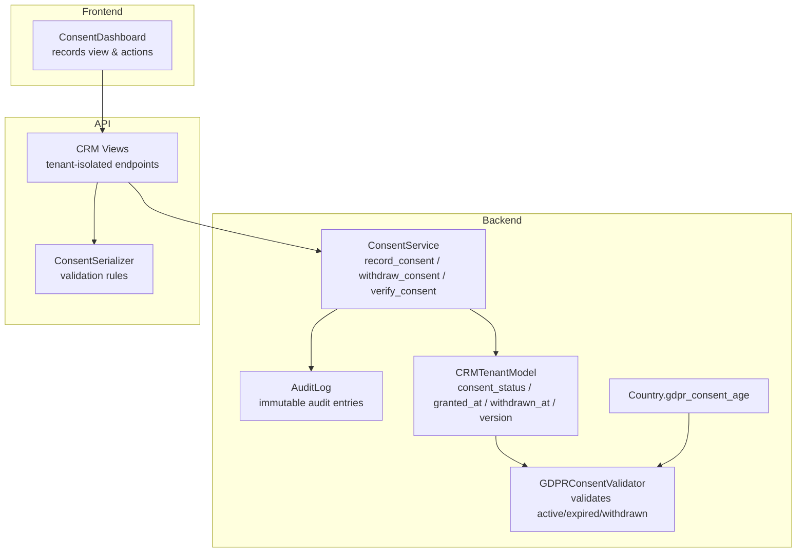
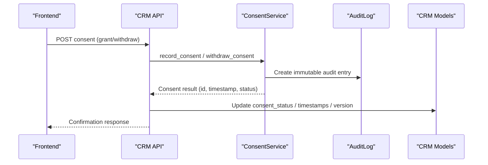
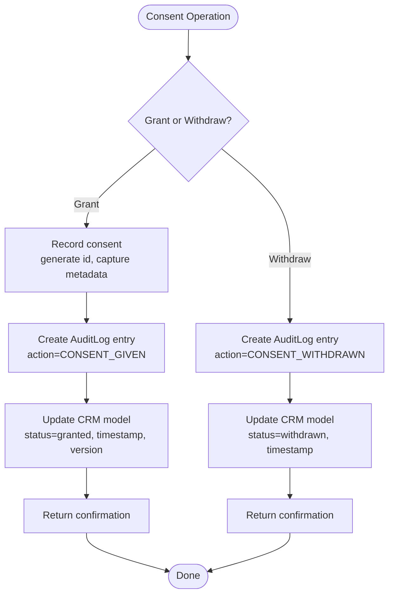
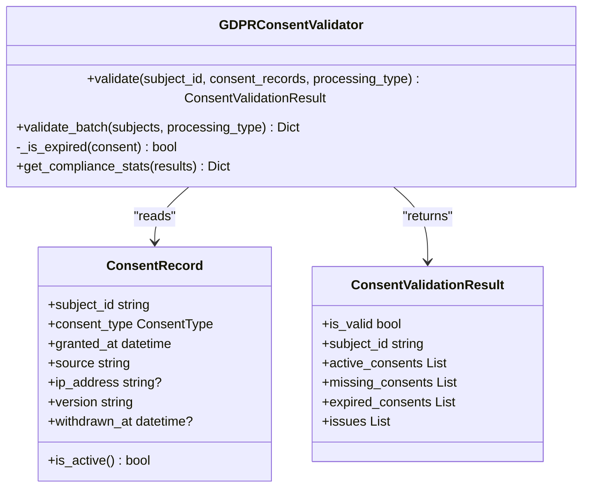
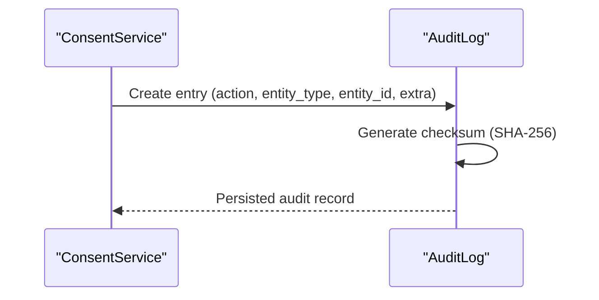
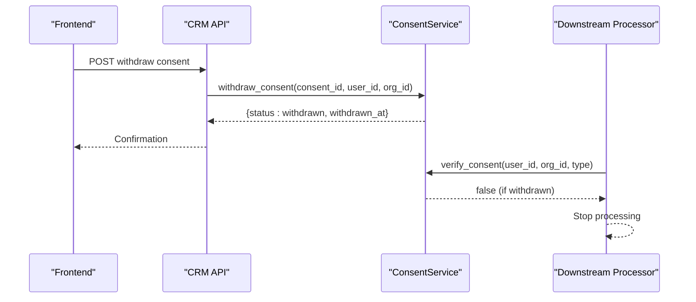
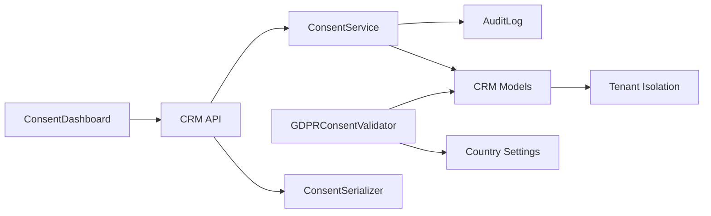

# Consent Management

<cite>
**Referenced Files in This Document**
- [dsr_service.py](file://backend/django/apps/core/dsr_service.py)
- [models.py](file://backend/django/apps/crm/models.py)
- [models.py](file://backend/django/apps/countries/models.py)
- [gdpr_consent_validation.py](file://data/src/quality/expectations/gdpr_consent_validation.py)
- [serializers.py](file://backend/django/apps/crm/api/serializers.py)
- [views.py](file://backend/django/apps/crm/api/views.py)
- [ConsentDashboard.tsx](file://frontend/apps/admin-dashboard/src/components/compliance/ConsentDashboard.tsx)
- [GDPR-checklist.md](file://docs/compliance/GDPR-checklist.md)
</cite>

## Table of Contents
1. Introduction
2. Project Structure
3. Core Components
4. Architecture Overview
5. Detailed Component Analysis
6. Dependency Analysis
7. Performance Considerations
8. Troubleshooting Guide
9. Conclusion
10. Appendices

## Introduction
This document explains the consent management system implemented in JOL-HUB, covering the full lifecycle from collection to withdrawal and refresh. It details how granular consent is captured, stored immutably with timestamps and audit trails, versioned, and linked to user accounts. It also documents country-specific age thresholds for minors, parental consent workflows, re-consent cycles, inactive user flagging, and confirmation notifications. Practical examples reference actual implementation files to guide integration.

## Project Structure
The consent system spans backend services, CRM models, validation utilities, API endpoints, and an admin dashboard UI:
- Backend service layer: ConsentService for recording, withdrawing, and verifying consent; AuditLog for immutable records.
- CRM models: CRMTenantModel fields for consent status, timestamps, and versioning; Contact and Lead models inherit these fields.
- Country configuration: gdpr_consent_age per country to enforce minor consent rules.
- Validation utilities: GDPRConsentValidator enforces required consents, expiry, and withdrawal checks.
- API layer: Serializers and views expose consent operations with tenant isolation and rate limiting.
- Frontend: ConsentDashboard displays consent records and supports export and review.

**Diagram sources**
- [dsr_service.py:378-495](file://backend/django/apps/core/dsr_service.py#L378-L495)
- [models.py:131-152](file://backend/django/apps/crm/models.py#L131-L152)
- [models.py:12-31](file://backend/django/apps/countries/models.py#L12-L31)
- [gdpr_consent_validation.py:52-172](file://data/src/quality/expectations/gdpr_consent_validation.py#L52-L172)
- [serializers.py:329-341](file://backend/django/apps/crm/api/serializers.py#L329-L341)
- [views.py:1-50](file://backend/django/apps/crm/api/views.py#L1-L50)
- [ConsentDashboard.tsx:1-200](file://frontend/apps/admin-dashboard/src/components/compliance/ConsentDashboard.tsx#L1-L200)

**Section sources**
- [dsr_service.py:378-495](file://backend/django/apps/core/dsr_service.py#L378-L495)
- [models.py:131-152](file://backend/django/apps/crm/models.py#L131-L152)
- [models.py:12-31](file://backend/django/apps/countries/models.py#L12-L31)
- [gdpr_consent_validation.py:52-172](file://data/src/quality/expectations/gdpr_consent_validation.py#L52-L172)
- [serializers.py:329-341](file://backend/django/apps/crm/api/serializers.py#L329-L341)
- [views.py:1-50](file://backend/django/apps/crm/api/views.py#L1-L50)
- [ConsentDashboard.tsx:1-200](file://frontend/apps/admin-dashboard/src/components/compliance/ConsentDashboard.tsx#L1-L200)

## Core Components
- ConsentService: Records consent with a unique reference ID, captures IP/user agent, stores version and timestamp, and logs to AuditLog. Supports withdrawal and verification against recent grants and subsequent withdrawals.
- CRMTenantModel: Provides consent_status (granted/withdrawn/pending/not_required), consent_granted_at, consent_withdrawn_at, and consent_version on CRM entities like Contact and Lead. Includes grant_consent and withdraw_consent methods.
- GDPRConsentValidator: Enforces required consent types per processing purpose, checks withdrawal and expiration (default validity period), and produces compliance results and statistics.
- Country model: Stores gdpr_consent_age per country to apply minor consent rules at registration or data capture points.
- API serializers and views: ConsentSerializer validates that granting consent requires acknowledgment of GDPR notice; CRM views provide tenant-isolated endpoints with throttling and filtering by consent_status.
- Admin dashboard: ConsentDashboard renders consent records, statuses, timestamps, versions, and countries, enabling export and review.

**Section sources**
- [dsr_service.py:378-495](file://backend/django/apps/core/dsr_service.py#L378-L495)
- [models.py:131-152](file://backend/django/apps/crm/models.py#L131-L152)
- [gdpr_consent_validation.py:52-172](file://data/src/quality/expectations/gdpr_consent_validation.py#L52-L172)
- [models.py:12-31](file://backend/django/apps/countries/models.py#L12-L31)
- [serializers.py:329-341](file://backend/django/apps/crm/api/serializers.py#L329-L341)
- [views.py:132-200](file://backend/django/apps/crm/api/views.py#L132-L200)
- [ConsentDashboard.tsx:151-200](file://frontend/apps/admin-dashboard/src/components/compliance/ConsentDashboard.tsx#L151-L200)

## Architecture Overview
The consent architecture ensures lawful processing through explicit, granular consent, immutable audit trails, and robust verification.

**Diagram sources**
- [dsr_service.py:391-465](file://backend/django/apps/core/dsr_service.py#L391-L465)
- [models.py:131-152](file://backend/django/apps/crm/models.py#L131-L152)
- [views.py:132-200](file://backend/django/apps/crm/api/views.py#L132-L200)

## Detailed Component Analysis

### Consent Lifecycle: Collection, Storage, Withdrawal, Verification
- Collection: ConsentService.record_consent generates a unique consent_id, captures consent_types, ip_address, user_agent, consent_text_shown, version, and timestamp. An AuditLog entry is created with action indicating consent given.
- Storage: CRM entities store consent_status, consent_granted_at, consent_withdrawn_at, and consent_version. Methods grant_consent and withdraw_consent update these fields atomically.
- Withdrawal: ConsentService.withdraw_consent creates an AuditLog entry marking withdrawal with timestamp; CRM entity status updates to withdrawn with consent_withdrawn_at set.
- Verification: ConsentService.verify_consent checks for a recent consent-given event and ensures no subsequent withdrawal exists for that consent reference.

**Diagram sources**
- [dsr_service.py:391-465](file://backend/django/apps/core/dsr_service.py#L391-L465)
- [models.py:237-252](file://backend/django/apps/crm/models.py#L237-L252)

**Section sources**
- [dsr_service.py:391-465](file://backend/django/apps/core/dsr_service.py#L391-L465)
- [models.py:237-252](file://backend/django/apps/crm/models.py#L237-L252)

### Granular Consent Options and Required Types
- The validator defines required consent types per processing purpose: marketing, analytics, third_party_sharing, basic_processing.
- Validation checks each consent record for activity (not withdrawn) and expiration relative to a configured validity period.
- Results include active_consents, missing_consents, expired_consents, and issues for reporting and enforcement.

**Diagram sources**
- [gdpr_consent_validation.py:15-50](file://data/src/quality/expectations/gdpr_consent_validation.py#L15-L50)
- [gdpr_consent_validation.py:52-172](file://data/src/quality/expectations/gdpr_consent_validation.py#L52-L172)

**Section sources**
- [gdpr_consent_validation.py:52-172](file://data/src/quality/expectations/gdpr_consent_validation.py#L52-L172)

### Immutable Consent Records and Audit Trails
- Every consent action is recorded in AuditLog with tamper-evident checksum generation and tenant isolation validation.
- Fields include action, entity_type, entity_id, user_id, organization_id, consent_reference, legal_basis, ip_address, user_agent, extra data, and created_at.
- Integrity can be verified via verify_integrity using stored checksum.

**Diagram sources**
- [dsr_service.py:422-433](file://backend/django/apps/core/dsr_service.py#L422-L433)
- [models.py:130-152](file://backend/django/apps/core/models.py#L130-L152)
- [models.py:156-212](file://backend/django/apps/core/models.py#L156-L212)

**Section sources**
- [dsr_service.py:422-433](file://backend/django/apps/core/dsr_service.py#L422-L433)
- [models.py:130-152](file://backend/django/apps/core/models.py#L130-L152)
- [models.py:156-212](file://backend/django/apps/core/models.py#L156-L212)

### Version Control for Consent Forms
- ConsentService maintains a CONSENT_VERSION constant used when recording consent.
- CRM models store consent_version alongside timestamps and status to preserve historical context.
- Validators and dashboards can display version to ensure users are informed about the applicable policy version.

**Section sources**
- [dsr_service.py:389-420](file://backend/django/apps/core/dsr_service.py#L389-L420)
- [models.py:148-152](file://backend/django/apps/crm/models.py#L148-L152)

### Consent Registry Linking to User Accounts
- Consent records link to user_id and organization_id, ensuring per-user, per-tenant linkage.
- CRM models use tenant isolation to scope consent records to the correct organization.
- Dashboard displays user email and country for traceability.

**Section sources**
- [dsr_service.py:410-433](file://backend/django/apps/core/dsr_service.py#L410-L433)
- [views.py:93-125](file://backend/django/apps/crm/api/views.py#L93-L125)
- [ConsentDashboard.tsx:260-287](file://frontend/apps/admin-dashboard/src/components/compliance/ConsentDashboard.tsx#L260-L287)

### Historical Consent Preservation
- AuditLog preserves all consent events with timestamps and extra metadata, enabling historical reconstruction.
- CRM model fields (granted_at, withdrawn_at, version) maintain state transitions over time.

**Section sources**
- [dsr_service.py:422-465](file://backend/django/apps/core/dsr_service.py#L422-L465)
- [models.py:131-152](file://backend/django/apps/crm/models.py#L131-L152)

### One-Click Consent Withdrawal and Automatic Processing Cessation
- Withdrawal flow: Call ConsentService.withdraw_consent to log withdrawal and update CRM status; downstream processors should check verify_consent before proceeding.
- Automatic cessation: Downstream logic must gate processing on valid consent; validators will mark consents as invalid if withdrawn or expired.

**Diagram sources**
- [dsr_service.py:437-495](file://backend/django/apps/core/dsr_service.py#L437-L495)

**Section sources**
- [dsr_service.py:437-495](file://backend/django/apps/core/dsr_service.py#L437-L495)

### Confirmation Notifications
- While explicit notification sending is not shown in the referenced code, the confirmation responses from API calls serve as immediate feedback.
- For email confirmations, integrate a notification step after successful withdrawal/grant in the API layer.

[No sources needed since this section provides general guidance]

### Country-Specific Age Thresholds and Parental Consent Workflows
- Country model includes gdpr_consent_age to define the minimum age for consent without parental involvement.
- Compliance checklist specifies thresholds for Lithuania (14), Latvia (13), Estonia (13).
- Parental consent workflow: Below threshold, require parental consent mechanism and verification; implement separate consent capture for parents and link to minor’s record.

**Section sources**
- [models.py:12-31](file://backend/django/apps/countries/models.py#L12-L31)
- [GDPR-checklist.md:238-256](file://docs/compliance/GDPR-checklist.md#L238-L256)

### Consent Refresh Cycles, Inactive User Flagging, Re-consent Workflows
- Validator uses a configurable validity period (default 365 days) to determine expiration; systems should trigger re-consent prompts before expiry.
- Inactive users (>2 years) flagged per compliance checklist; implement periodic scans to mark inactive and schedule re-consent campaigns.
- Re-consent workflow: Present updated consent form, capture new consent with incremented version, and log changes.

**Section sources**
- [gdpr_consent_validation.py:63-75](file://data/src/quality/expectations/gdpr_consent_validation.py#L63-L75)
- [GDPR-checklist.md:39-43](file://docs/compliance/GDPR-checklist.md#L39-L43)

### API Endpoints for Consent Operations
- ConsentSerializer validates consent payloads, requiring GDPR notice acknowledgment when granting consent.
- CRM views provide tenant-isolated endpoints with throttling and filtering by consent_status; contact list supports filtering by consent status.

**Section sources**
- [serializers.py:329-341](file://backend/django/apps/crm/api/serializers.py#L329-L341)
- [views.py:132-200](file://backend/django/apps/crm/api/views.py#L132-L200)

### Frontend Consent UI Components
- ConsentDashboard displays consent records with user info, type, status, timestamps, country, and version.
- Supports search, filters, export, and visual badges for status and type.

**Section sources**
- [ConsentDashboard.tsx:151-200](file://frontend/apps/admin-dashboard/src/components/compliance/ConsentDashboard.tsx#L151-L200)
- [ConsentDashboard.tsx:232-307](file://frontend/apps/admin-dashboard/src/components/compliance/ConsentDashboard.tsx#L232-L307)

## Dependency Analysis
The consent system integrates multiple layers with clear dependencies:
- ConsentService depends on AuditLog for immutable records and CRM models for state persistence.
- CRM models depend on tenant isolation middleware for multi-tenancy.
- Validators depend on consent records and country settings to enforce compliance.
- API layer depends on serializers for input validation and views for routing and throttling.
- Frontend depends on API endpoints to render and manage consent records.

**Diagram sources**
- [dsr_service.py:378-495](file://backend/django/apps/core/dsr_service.py#L378-L495)
- [models.py:131-152](file://backend/django/apps/crm/models.py#L131-L152)
- [gdpr_consent_validation.py:52-172](file://data/src/quality/expectations/gdpr_consent_validation.py#L52-L172)
- [models.py:12-31](file://backend/django/apps/countries/models.py#L12-L31)
- [serializers.py:329-341](file://backend/django/apps/crm/api/serializers.py#L329-L341)
- [views.py:1-50](file://backend/django/apps/crm/api/views.py#L1-L50)
- [ConsentDashboard.tsx:1-200](file://frontend/apps/admin-dashboard/src/components/compliance/ConsentDashboard.tsx#L1-L200)

**Section sources**
- [dsr_service.py:378-495](file://backend/django/apps/core/dsr_service.py#L378-L495)
- [models.py:131-152](file://backend/django/apps/crm/models.py#L131-L152)
- [gdpr_consent_validation.py:52-172](file://data/src/quality/expectations/gdpr_consent_validation.py#L52-L172)
- [models.py:12-31](file://backend/django/apps/countries/models.py#L12-L31)
- [serializers.py:329-341](file://backend/django/apps/crm/api/serializers.py#L329-L341)
- [views.py:1-50](file://backend/django/apps/crm/api/views.py#L1-L50)
- [ConsentDashboard.tsx:1-200](file://frontend/apps/admin-dashboard/src/components/compliance/ConsentDashboard.tsx#L1-L200)

## Performance Considerations
- AuditLog writes are append-only and indexed by entity_type, entity_id, user_id, organization_id, and data_subject_id for efficient queries.
- Tenant isolation reduces query scope, improving performance and security.
- Rate limiting on sensitive operations (exports, deletions) protects system stability.
- Batch validation in GDPRConsentValidator supports efficient compliance checks across multiple subjects.

[No sources needed since this section provides general guidance]

## Troubleshooting Guide
- Cross-tenant errors: Ensure organization_id matches current tenant context; AuditLog save validates tenant context and raises validation errors on mismatch.
- Missing consent: Use GDPRConsentValidator to identify missing or expired consents and prompt re-consent.
- Withdrawal not taking effect: Verify AuditLog contains ACTION_CONSENT_WITHDRAWN after the original consent and that downstream processors call verify_consent before processing.
- Dashboard not showing records: Check tenant isolation filters and consent_status filters in CRM views.

**Section sources**
- [models.py:156-212](file://backend/django/apps/core/models.py#L156-L212)
- [gdpr_consent_validation.py:77-172](file://data/src/quality/expectations/gdpr_consent_validation.py#L77-L172)
- [views.py:93-125](file://backend/django/apps/crm/api/views.py#L93-L125)

## Conclusion
JOL-HUB implements a robust consent management system aligned with GDPR requirements. It captures granular consent, stores immutable records with timestamps and audit trails, enforces version control, and links consent to specific user accounts within tenant isolation. Country-specific age thresholds and parental consent workflows support minors’ protection. Validators ensure consent validity, expiration, and withdrawal handling, while the admin dashboard provides visibility and export capabilities. Integrating one-click withdrawal and automatic processing cessation safeguards user rights and compliance.

[No sources needed since this section summarizes without analyzing specific files]

## Appendices

### Code Examples References
- Consent model structures:
  - CRM tenant model consent fields and methods: [models.py:131-152](file://backend/django/apps/crm/models.py#L131-L152), [models.py:237-252](file://backend/django/apps/crm/models.py#L237-L252)
- API endpoints for consent operations:
  - Consent serializer validation: [serializers.py:329-341](file://backend/django/apps/crm/api/serializers.py#L329-L341)
  - CRM views with tenant isolation and throttling: [views.py:132-200](file://backend/django/apps/crm/api/views.py#L132-L200)
- Frontend consent UI components:
  - ConsentDashboard rendering and actions: [ConsentDashboard.tsx:151-200](file://frontend/apps/admin-dashboard/src/components/compliance/ConsentDashboard.tsx#L151-L200), [ConsentDashboard.tsx:232-307](file://frontend/apps/admin-dashboard/src/components/compliance/ConsentDashboard.tsx#L232-L307)

**Section sources**
- [models.py:131-152](file://backend/django/apps/crm/models.py#L131-L152)
- [models.py:237-252](file://backend/django/apps/crm/models.py#L237-L252)
- [serializers.py:329-341](file://backend/django/apps/crm/api/serializers.py#L329-L341)
- [views.py:132-200](file://backend/django/apps/crm/api/views.py#L132-L200)
- [ConsentDashboard.tsx:151-200](file://frontend/apps/admin-dashboard/src/components/compliance/ConsentDashboard.tsx#L151-L200)
- [ConsentDashboard.tsx:232-307](file://frontend/apps/admin-dashboard/src/components/compliance/ConsentDashboard.tsx#L232-L307)