# Consent Withdrawal & Refresh

<cite>
**Referenced Files in This Document**
- [dsr_service.py](file://backend/django/apps/core/dsr_service.py)
- [models.py](file://backend/django/apps/crm/models.py)
- [audit_logger.py](file://backend/django/apps/crm/audit_logger.py)
- [signals.py](file://backend/django/apps/crm/signals.py)
- [gdpr_consent_validation.py](file://data/src/quality/expectations/gdpr_consent_validation.py)
- [retention_manager.py](file://data/src/gdpr/retention_manager.py)
- [anonymizer.py](file://data/src/gdpr/anonymizer.py)
- [jol_gdpr_cleanup.py](file://data/airflow/dags/jol_gdpr_cleanup.py)
- [stg_users.sql](file://data/dbt/models/staging/stg_users.sql)
- [ConsentDashboard.tsx](file://frontend/apps/admin-dashboard/src/components/compliance/ConsentDashboard.tsx)
- [consent-page.tsx](file://frontend/packages/ui/src/components/consent-page.tsx)
- [ContactForm.tsx](file://frontend/packages/ui/src/components/composite/contact-form/ContactForm.tsx)
- [page.tsx](file://frontend/apps/admin-dashboard/src/app/(dashboard)/compliance/page.tsx)
- [GDPR-checklist.md](file://docs/compliance/GDPR-checklist.md)
- [data-flow.md](file://docs/architecture/data-flow.md)
</cite>

## Table of Contents
1. Introduction
2. Project Structure
3. Core Components
4. Architecture Overview
5. Detailed Component Analysis
6. Dependency Analysis
7. Performance Considerations
8. Troubleshooting Guide
9. Conclusion
10. Appendices

## Introduction
This document explains how JOL-HUB implements consent withdrawal and refresh workflows, including one-click withdrawal, automatic processing cessation upon withdrawal, confirmation notifications, re-consent triggers, inactive user flagging, data anonymization, service suspension mechanisms, audit trails, and integration points with email services. It provides code-level references to backend services, data quality checks, scheduled cleanup, and frontend components that expose consent management to users and administrators.

## Project Structure
JOL-HUB organizes consent-related logic across:
- Backend Django services for consent lifecycle and audit logging
- Data layer utilities for retention, anonymization, and validation
- Airflow DAGs for automated cleanup
- Frontend components for consent collection, withdrawal, and admin oversight
- Compliance documentation and architecture notes

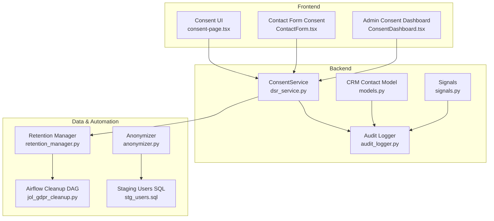

**Diagram sources**
- [consent-page.tsx:241-278](file://frontend/packages/ui/src/components/consent-page.tsx#L241-L278)
- [ConsentDashboard.tsx:265-307](file://frontend/apps/admin-dashboard/src/components/compliance/ConsentDashboard.tsx#L265-L307)
- [ContactForm.tsx:147-181](file://frontend/packages/ui/src/components/composite/contact-form/ContactForm.tsx#L147-L181)
- [dsr_service.py:378-495](file://backend/django/apps/core/dsr_service.py#L378-L495)
- [models.py:240-252](file://backend/django/apps/crm/models.py#L240-L252)
- [audit_logger.py:504-526](file://backend/django/apps/crm/audit_logger.py#L504-L526)
- [signals.py:149-168](file://backend/django/apps/crm/signals.py#L149-L168)
- [retention_manager.py:188-336](file://data/src/gdpr/retention_manager.py#L188-L336)
- [anonymizer.py:106-180](file://data/src/gdpr/anonymizer.py#L106-L180)
- [jol_gdpr_cleanup.py:21-68](file://data/airflow/dags/jol_gdpr_cleanup.py#L21-L68)
- [stg_users.sql:1-49](file://data/dbt/models/staging/stg_users.sql#L1-L49)

**Section sources**
- [ConsentDashboard.tsx:265-307](file://frontend/apps/admin-dashboard/src/components/compliance/ConsentDashboard.tsx#L265-L307)
- [consent-page.tsx:241-278](file://frontend/packages/ui/src/components/consent-page.tsx#L241-L278)
- [ContactForm.tsx:147-181](file://frontend/packages/ui/src/components/composite/contact-form/ContactForm.tsx#L147-L181)
- [dsr_service.py:378-495](file://backend/django/apps/core/dsr_service.py#L378-L495)
- [models.py:240-252](file://backend/django/apps/crm/models.py#L240-L252)
- [audit_logger.py:504-526](file://backend/django/apps/crm/audit_logger.py#L504-L526)
- [signals.py:149-168](file://backend/django/apps/crm/signals.py#L149-L168)
- [retention_manager.py:188-336](file://data/src/gdpr/retention_manager.py#L188-L336)
- [anonymizer.py:106-180](file://data/src/gdpr/anonymizer.py#L106-L180)
- [jol_gdpr_cleanup.py:21-68](file://data/airflow/dags/jol_gdpr_cleanup.py#L21-L68)
- [stg_users.sql:1-49](file://data/dbt/models/staging/stg_users.sql#L1-L49)

## Core Components
- ConsentService (backend): Records consent, supports one-click withdrawal, verifies current validity by checking recent grants and subsequent withdrawals, and logs all actions to the audit trail.
- CRM Contact model: Provides a withdraw_consent method to mark consent as withdrawn and persist timestamps; signals log consent changes.
- GDPRConsentValidator: Validates consent per processing type, enforces expiry windows (default 365 days), and flags missing/expired/withdrawn consents.
- RetentionManager: Enforces storage limitation and erasure rules, blocks deletion under legal holds, and integrates with audit logging.
- Anonymizer: Implements k-anonymity and hashing for direct identifiers used in analytics and reporting.
- Airflow DAG: Schedules periodic cleanup of expired operational and activity data.
- Frontend: Consent page exposes one-click withdrawal; Admin dashboard displays consent status and GDPR notices; Contact form captures explicit consent.

**Section sources**
- [dsr_service.py:378-495](file://backend/django/apps/core/dsr_service.py#L378-L495)
- [models.py:240-252](file://backend/django/apps/crm/models.py#L240-L252)
- [gdpr_consent_validation.py:52-151](file://data/src/quality/expectations/gdpr_consent_validation.py#L52-L151)
- [retention_manager.py:188-336](file://data/src/gdpr/retention_manager.py#L188-L336)
- [anonymizer.py:106-180](file://data/src/gdpr/anonymizer.py#L106-L180)
- [jol_gdpr_cleanup.py:21-68](file://data/airflow/dags/jol_gdpr_cleanup.py#L21-L68)
- [consent-page.tsx:241-278](file://frontend/packages/ui/src/components/consent-page.tsx#L241-L278)
- [ConsentDashboard.tsx:265-307](file://frontend/apps/admin-dashboard/src/components/compliance/ConsentDashboard.tsx#L265-L307)
- [ContactForm.tsx:147-181](file://frontend/packages/ui/src/components/composite/contact-form/ContactForm.tsx#L147-L181)

## Architecture Overview
The consent workflow spans user interactions, backend services, data quality/validation, and automation:

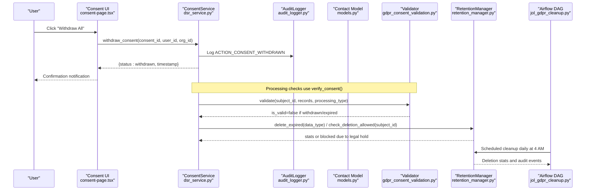

**Diagram sources**
- [consent-page.tsx:241-278](file://frontend/packages/ui/src/components/consent-page.tsx#L241-L278)
- [dsr_service.py:437-495](file://backend/django/apps/core/dsr_service.py#L437-L495)
- [audit_logger.py:504-526](file://backend/django/apps/crm/audit_logger.py#L504-L526)
- [models.py:240-252](file://backend/django/apps/crm/models.py#L240-L252)
- [gdpr_consent_validation.py:77-151](file://data/src/quality/expectations/gdpr_consent_validation.py#L77-L151)
- [retention_manager.py:206-336](file://data/src/gdpr/retention_manager.py#L206-L336)
- [jol_gdpr_cleanup.py:21-68](file://data/airflow/dags/jol_gdpr_cleanup.py#L21-L68)

## Detailed Component Analysis

### One-Click Consent Withdrawal Mechanism
- Frontend component exposes a “Withdraw All” action that sets all consent preferences to false and calls an update callback to submit the change.
- Backend ConsentService.withdraw_consent records the withdrawal event in the audit log and returns a confirmation payload.
- CRM Contact model also supports withdrawing consent via a dedicated method that updates status and timestamps.

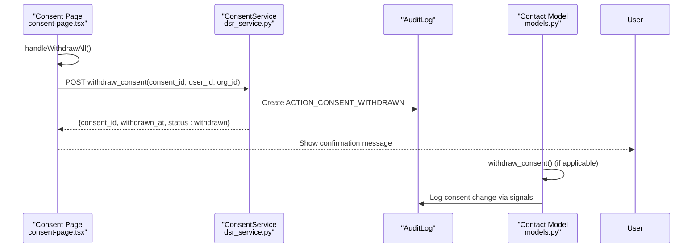

**Diagram sources**
- [consent-page.tsx:241-278](file://frontend/packages/ui/src/components/consent-page.tsx#L241-L278)
- [dsr_service.py:437-465](file://backend/django/apps/core/dsr_service.py#L437-L465)
- [models.py:240-252](file://backend/django/apps/crm/models.py#L240-L252)
- [signals.py:149-168](file://backend/django/apps/crm/signals.py#L149-L168)

**Section sources**
- [consent-page.tsx:241-278](file://frontend/packages/ui/src/components/consent-page.tsx#L241-L278)
- [dsr_service.py:437-465](file://backend/django/apps/core/dsr_service.py#L437-L465)
- [models.py:240-252](file://backend/django/apps/crm/models.py#L240-L252)
- [signals.py:149-168](file://backend/django/apps/crm/signals.py#L149-L168)

### Automatic Processing Cessation Upon Withdrawal
- Consent verification uses recent grant records and checks for subsequent withdrawals to determine validity.
- Validation logic treats withdrawn or expired consents as invalid for specific processing types, preventing further marketing, analytics, or third-party sharing.

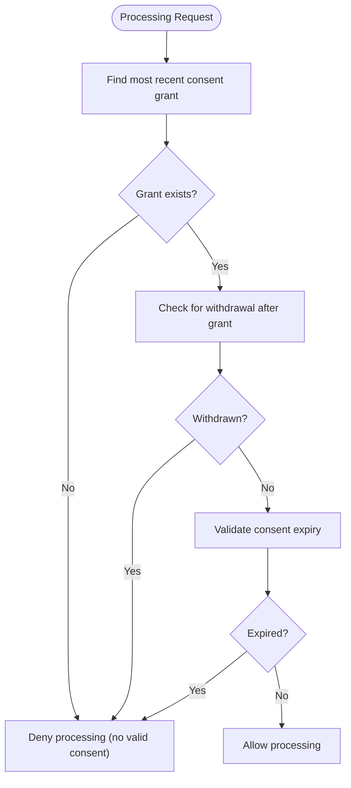

**Diagram sources**
- [dsr_service.py:467-495](file://backend/django/apps/core/dsr_service.py#L467-L495)
- [gdpr_consent_validation.py:77-151](file://data/src/quality/expectations/gdpr_consent_validation.py#L77-L151)

**Section sources**
- [dsr_service.py:467-495](file://backend/django/apps/core/dsr_service.py#L467-L495)
- [gdpr_consent_validation.py:77-151](file://data/src/quality/expectations/gdpr_consent_validation.py#L77-L151)

### Confirmation Notification Systems
- The frontend confirms withdrawal to the user immediately after submission.
- Audit logging ensures every withdrawal is recorded with timestamps and context, enabling traceability and compliance reporting.
- Signals capture consent status changes and log them with versioning details.

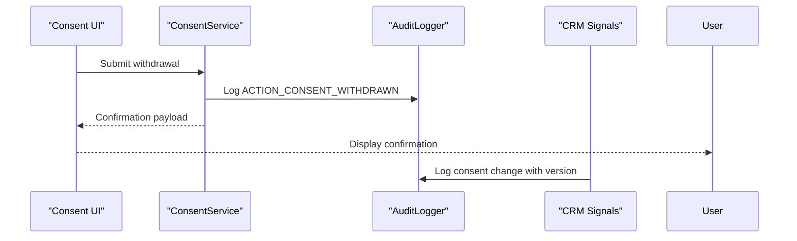

**Diagram sources**
- [consent-page.tsx:241-278](file://frontend/packages/ui/src/components/consent-page.tsx#L241-L278)
- [dsr_service.py:437-465](file://backend/django/apps/core/dsr_service.py#L437-L465)
- [audit_logger.py:504-526](file://backend/django/apps/crm/audit_logger.py#L504-L526)
- [signals.py:149-168](file://backend/django/apps/crm/signals.py#L149-L168)

**Section sources**
- [consent-page.tsx:241-278](file://frontend/packages/ui/src/components/consent-page.tsx#L241-L278)
- [dsr_service.py:437-465](file://backend/django/apps/core/dsr_service.py#L437-L465)
- [audit_logger.py:504-526](file://backend/django/apps/crm/audit_logger.py#L504-L526)
- [signals.py:149-168](file://backend/django/apps/crm/signals.py#L149-L168)

### Consent Refresh Cycle and Re-Consent Workflows
- Consent validity period defaults to 365 days; expired consents are flagged and require re-consent before resuming processing.
- Validators compute active, missing, and expired consents per processing type and report compliance issues.
- Compliance checklist documents re-consent requirements and inactive user flagging thresholds.

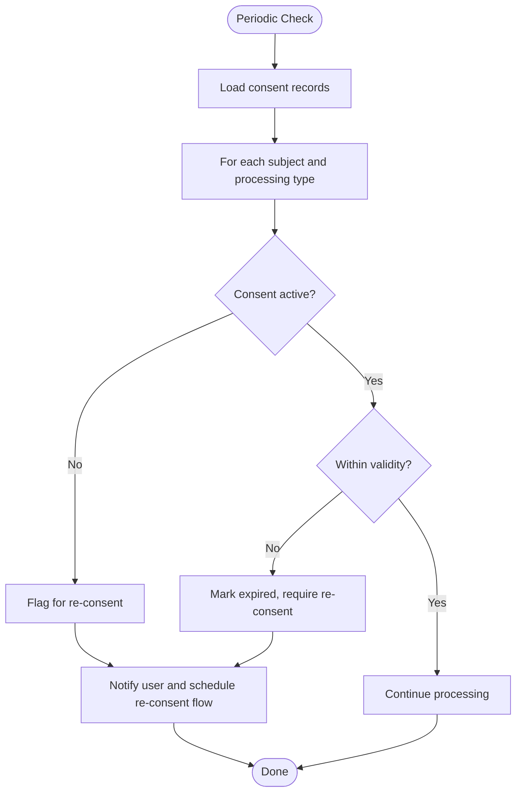

**Diagram sources**
- [gdpr_consent_validation.py:52-151](file://data/src/quality/expectations/gdpr_consent_validation.py#L52-L151)
- [GDPR-checklist.md:32-43](file://docs/compliance/GDPR-checklist.md#L32-L43)

**Section sources**
- [gdpr_consent_validation.py:52-151](file://data/src/quality/expectations/gdpr_consent_validation.py#L52-L151)
- [GDPR-checklist.md:32-43](file://docs/compliance/GDPR-checklist.md#L32-L43)

### Inactive User Flagging Processes
- Staging transforms mask PII unless explicitly requested and compute retention expiry based on last login or creation date.
- Retention rules define time-based policies for different data types; inactive users can be identified by absence of recent activity and flagged for re-consent or cleanup.

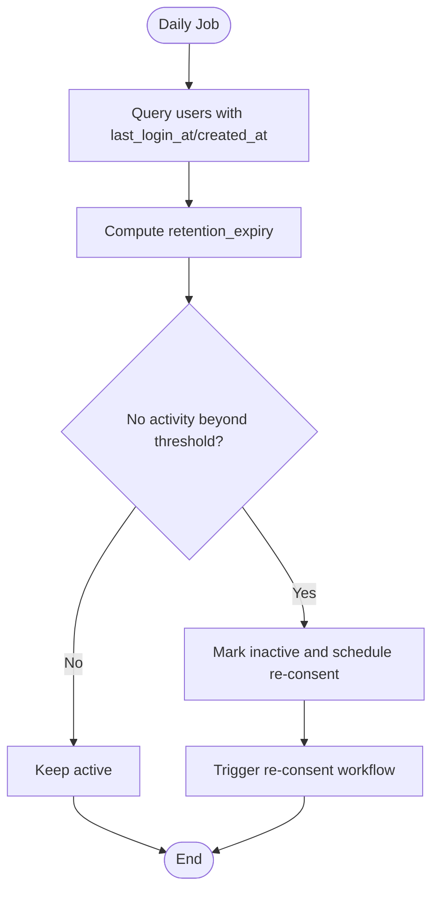

**Diagram sources**
- [stg_users.sql:1-49](file://data/dbt/models/staging/stg_users.sql#L1-L49)
- [retention_manager.py:78-106](file://data/src/gdpr/retention_manager.py#L78-L106)

**Section sources**
- [stg_users.sql:1-49](file://data/dbt/models/staging/stg_users.sql#L1-L49)
- [retention_manager.py:78-106](file://data/src/gdpr/retention_manager.py#L78-L106)

### Technical Implementation of Withdrawal Triggers
- Frontend triggers withdrawal via a single action that updates all consent preferences and submits changes.
- Backend processes withdrawal by creating an audit log entry and returning a confirmation payload; CRM model methods support persistent state changes.

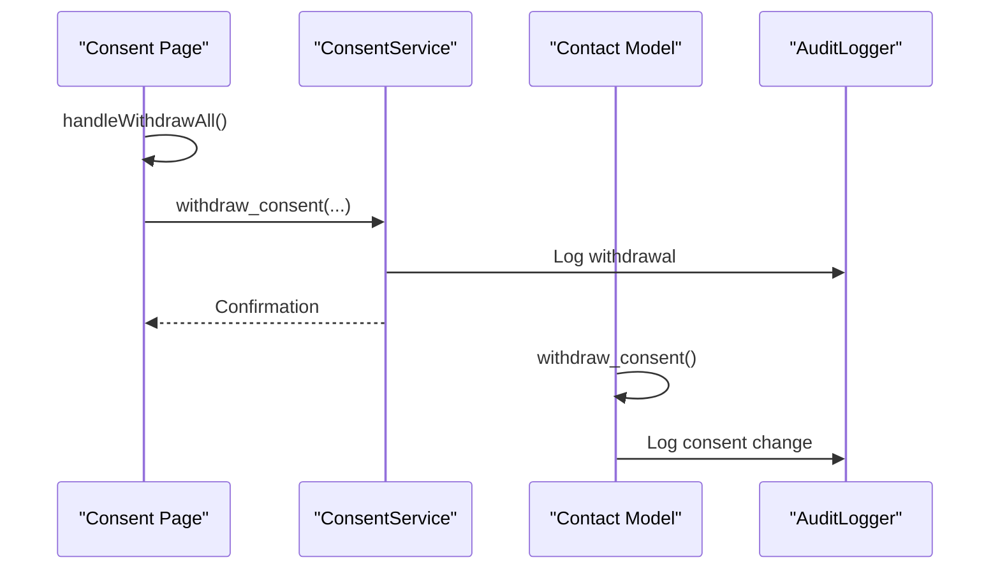

**Diagram sources**
- [consent-page.tsx:241-278](file://frontend/packages/ui/src/components/consent-page.tsx#L241-L278)
- [dsr_service.py:437-465](file://backend/django/apps/core/dsr_service.py#L437-L465)
- [models.py:240-252](file://backend/django/apps/crm/models.py#L240-L252)
- [audit_logger.py:504-526](file://backend/django/apps/crm/audit_logger.py#L504-L526)

**Section sources**
- [consent-page.tsx:241-278](file://frontend/packages/ui/src/components/consent-page.tsx#L241-L278)
- [dsr_service.py:437-465](file://backend/django/apps/core/dsr_service.py#L437-L465)
- [models.py:240-252](file://backend/django/apps/crm/models.py#L240-L252)
- [audit_logger.py:504-526](file://backend/django/apps/crm/audit_logger.py#L504-L526)

### Data Anonymization Processes
- Anonymizer hashes direct identifiers and applies k-anonymity thresholds per country to protect privacy in analytics and reports.
- Staging SQL masks emails and IPs unless explicitly allowed, ensuring downstream pipelines receive anonymized data.

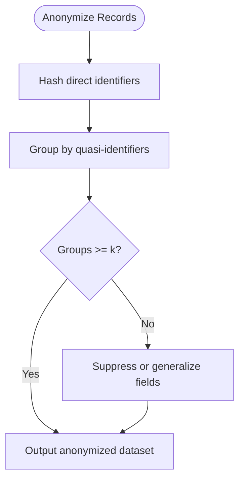

**Diagram sources**
- [anonymizer.py:106-180](file://data/src/gdpr/anonymizer.py#L106-L180)
- [stg_users.sql:1-49](file://data/dbt/models/staging/stg_users.sql#L1-L49)

**Section sources**
- [anonymizer.py:106-180](file://data/src/gdpr/anonymizer.py#L106-L180)
- [stg_users.sql:1-49](file://data/dbt/models/staging/stg_users.sql#L1-L49)

### Service Suspension Mechanisms
- RetentionManager enforces deletion restrictions when legal holds are active, blocking erasure operations and logging attempts.
- DataSubjectRequestService integrates legal hold checks and canonical record exceptions during erasure requests.

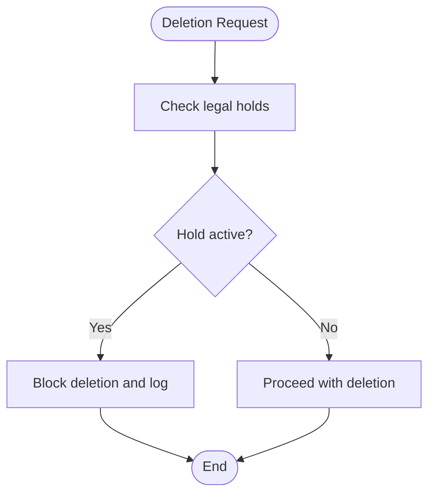

**Diagram sources**
- [retention_manager.py:257-336](file://data/src/gdpr/retention_manager.py#L257-L336)
- [dsr_service.py:194-252](file://backend/django/apps/core/dsr_service.py#L194-L252)

**Section sources**
- [retention_manager.py:257-336](file://data/src/gdpr/retention_manager.py#L257-L336)
- [dsr_service.py:194-252](file://backend/django/apps/core/dsr_service.py#L194-L252)

### Automated Cleanup Scripts
- Airflow DAG schedules daily cleanup tasks for operational logs and user activity, invoking retention manager functions to delete expired data and verify outcomes.

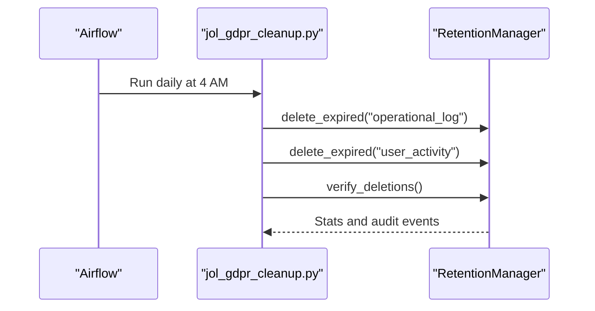

**Diagram sources**
- [jol_gdpr_cleanup.py:21-68](file://data/airflow/dags/jol_gdpr_cleanup.py#L21-L68)
- [retention_manager.py:206-246](file://data/src/gdpr/retention_manager.py#L206-L246)

**Section sources**
- [jol_gdpr_cleanup.py:21-68](file://data/airflow/dags/jol_gdpr_cleanup.py#L21-L68)
- [retention_manager.py:206-246](file://data/src/gdpr/retention_manager.py#L206-L246)

### Integration with Email Services for Withdrawal Confirmations
- While no explicit email sending code is shown here, the system logs withdrawal events and statuses which can trigger email confirmations via external services.
- Compliance documentation emphasizes sending confirmation to data subjects upon withdrawal.

**Section sources**
- [GDPR-checklist.md:32-37](file://docs/compliance/GDPR-checklist.md#L32-L37)
- [dsr_service.py:437-465](file://backend/django/apps/core/dsr_service.py#L437-L465)

### Audit Trail for Withdrawal Actions
- Every consent action is logged with detailed metadata, including IP address, user agent, and consent reference IDs.
- CRM signals capture consent status changes and versioning for accountability.

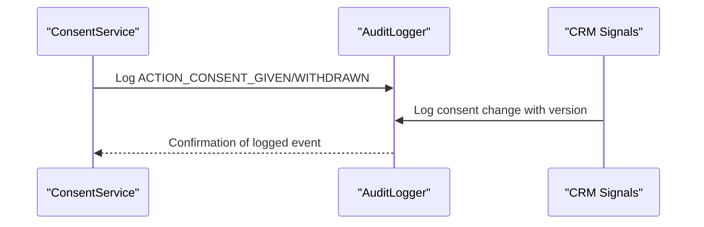

**Diagram sources**
- [dsr_service.py:422-433](file://backend/django/apps/core/dsr_service.py#L422-L433)
- [audit_logger.py:504-526](file://backend/django/apps/crm/audit_logger.py#L504-L526)
- [signals.py:149-168](file://backend/django/apps/crm/signals.py#L149-L168)

**Section sources**
- [dsr_service.py:422-433](file://backend/django/apps/core/dsr_service.py#L422-L433)
- [audit_logger.py:504-526](file://backend/django/apps/crm/audit_logger.py#L504-L526)
- [signals.py:149-168](file://backend/django/apps/crm/signals.py#L149-L168)

## Dependency Analysis
Consent workflows depend on:
- Frontend components for user interaction and confirmation
- Backend services for recording and verifying consent
- Data quality validators for compliance checks
- Retention and anonymization utilities for data lifecycle management
- Airflow DAGs for scheduled cleanup
- Audit logging for accountability

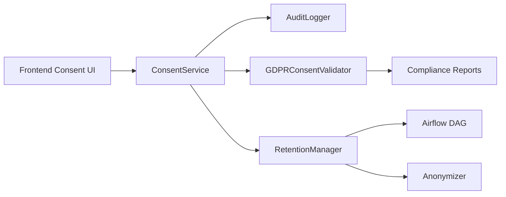

**Diagram sources**
- [consent-page.tsx:241-278](file://frontend/packages/ui/src/components/consent-page.tsx#L241-L278)
- [dsr_service.py:378-495](file://backend/django/apps/core/dsr_service.py#L378-L495)
- [gdpr_consent_validation.py:52-151](file://data/src/quality/expectations/gdpr_consent_validation.py#L52-L151)
- [retention_manager.py:188-336](file://data/src/gdpr/retention_manager.py#L188-L336)
- [anonymizer.py:106-180](file://data/src/gdpr/anonymizer.py#L106-L180)
- [jol_gdpr_cleanup.py:21-68](file://data/airflow/dags/jol_gdpr_cleanup.py#L21-L68)

**Section sources**
- [consent-page.tsx:241-278](file://frontend/packages/ui/src/components/consent-page.tsx#L241-L278)
- [dsr_service.py:378-495](file://backend/django/apps/core/dsr_service.py#L378-L495)
- [gdpr_consent_validation.py:52-151](file://data/src/quality/expectations/gdpr_consent_validation.py#L52-L151)
- [retention_manager.py:188-336](file://data/src/gdpr/retention_manager.py#L188-L336)
- [anonymizer.py:106-180](file://data/src/gdpr/anonymizer.py#L106-L180)
- [jol_gdpr_cleanup.py:21-68](file://data/airflow/dags/jol_gdpr_cleanup.py#L21-L68)

## Performance Considerations
- Consent verification queries should be indexed by user_id, organization_id, and entity_type to minimize latency.
- Batch validation and anonymization should leverage vectorized operations where possible to reduce overhead.
- Airflow cleanup tasks should run during off-peak hours and include dry-run modes for safe testing.

[No sources needed since this section provides general guidance]

## Troubleshooting Guide
Common issues and resolutions:
- Withdrawal not reflected in processing: Ensure verify_consent checks recent grants and subsequent withdrawals; confirm audit logs exist for both grant and withdrawal.
- Re-consent not triggered: Validate consent expiry logic and ensure periodic checks run; confirm validator flags expired consents.
- Deletion blocked unexpectedly: Check legal holds registry and ensure holds are lifted when appropriate; review audit logs for blocked attempts.
- Anonymization failures: Verify k-anonymity thresholds and quasi-identifier grouping; adjust suppression strategies for small groups.

**Section sources**
- [dsr_service.py:467-495](file://backend/django/apps/core/dsr_service.py#L467-L495)
- [gdpr_consent_validation.py:77-151](file://data/src/quality/expectations/gdpr_consent_validation.py#L77-L151)
- [retention_manager.py:257-336](file://data/src/gdpr/retention_manager.py#L257-L336)
- [anonymizer.py:127-180](file://data/src/gdpr/anonymizer.py#L127-L180)

## Conclusion
JOL-HUB implements a robust consent withdrawal and refresh system with clear user interfaces, reliable backend services, comprehensive audit trails, and automated data lifecycle management. The combination of validation, retention enforcement, anonymization, and scheduled cleanup ensures compliance with GDPR principles while maintaining operational efficiency.

[No sources needed since this section summarizes without analyzing specific files]

## Appendices

### Code Examples References
- Withdrawal API endpoint behavior: [dsr_service.py:437-465](file://backend/django/apps/core/dsr_service.py#L437-L465)
- Automated cleanup scripts: [jol_gdpr_cleanup.py:21-68](file://data/airflow/dags/jol_gdpr_cleanup.py#L21-L68)
- Frontend components for consent management:
  - One-click withdrawal: [consent-page.tsx:241-278](file://frontend/packages/ui/src/components/consent-page.tsx#L241-L278)
  - Admin dashboard display: [ConsentDashboard.tsx:265-307](file://frontend/apps/admin-dashboard/src/components/compliance/ConsentDashboard.tsx#L265-L307)
  - Consent capture in contact forms: [ContactForm.tsx:147-181](file://frontend/packages/ui/src/components/composite/contact-form/ContactForm.tsx#L147-L181)

**Section sources**
- [dsr_service.py:437-465](file://backend/django/apps/core/dsr_service.py#L437-L465)
- [jol_gdpr_cleanup.py:21-68](file://data/airflow/dags/jol_gdpr_cleanup.py#L21-L68)
- [consent-page.tsx:241-278](file://frontend/packages/ui/src/components/consent-page.tsx#L241-L278)
- [ConsentDashboard.tsx:265-307](file://frontend/apps/admin-dashboard/src/components/compliance/ConsentDashboard.tsx#L265-L307)
- [ContactForm.tsx:147-181](file://frontend/packages/ui/src/components/composite/contact-form/ContactForm.tsx#L147-L181)