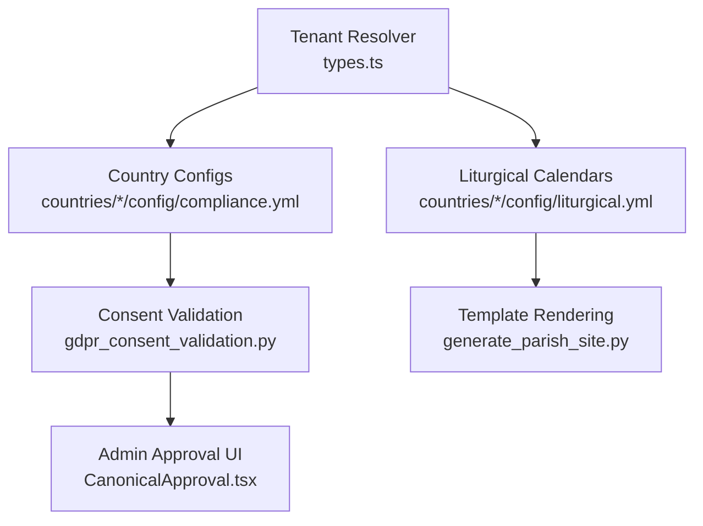
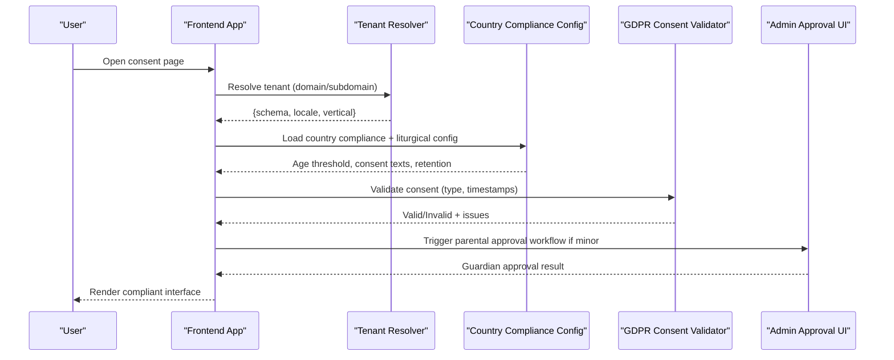
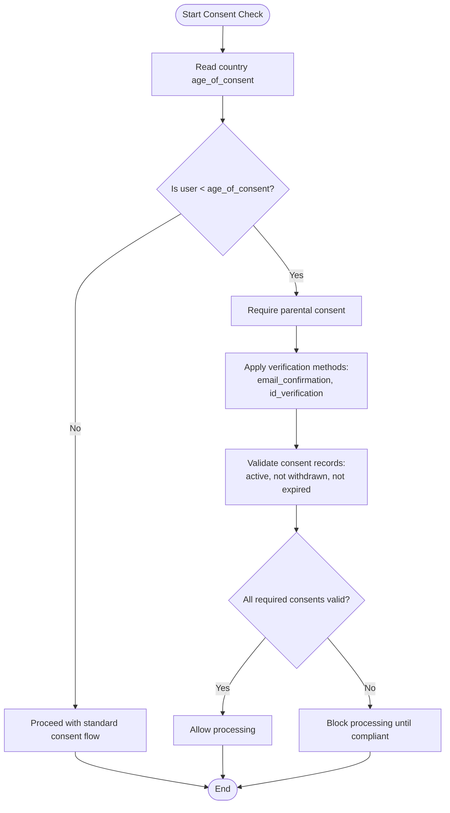
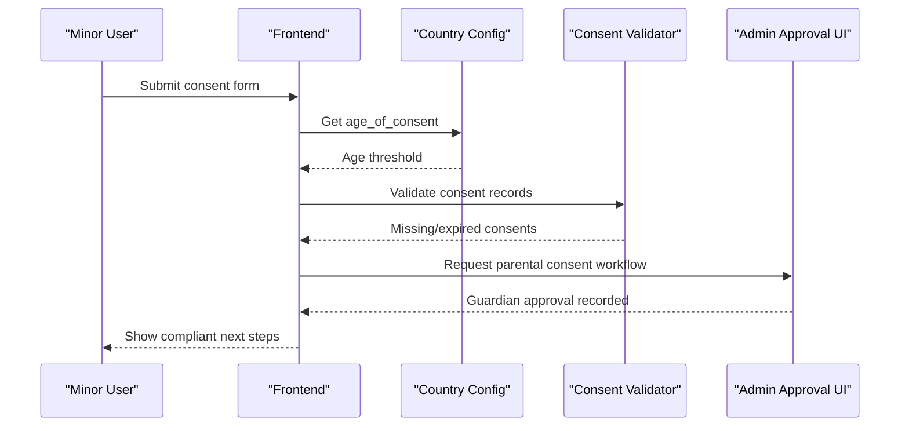
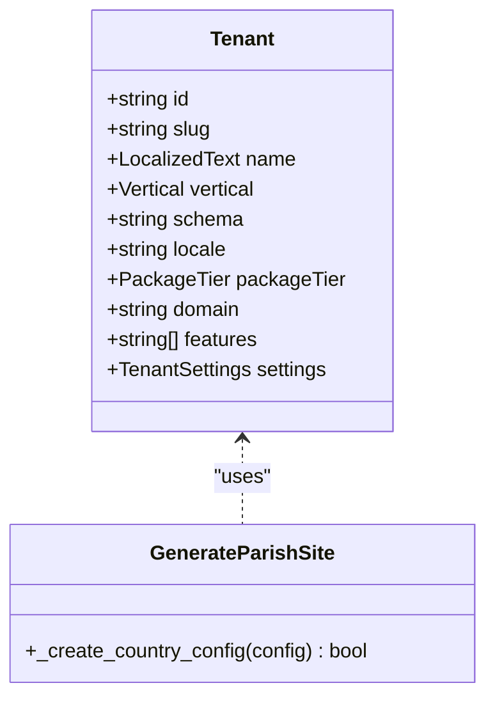
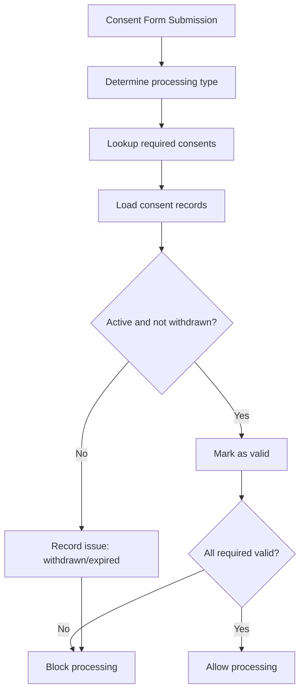
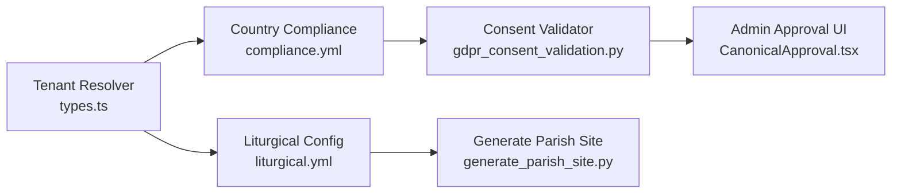

# Country-Specific Consent Requirements

<cite>
**Referenced Files in This Document**
- [compliance.yml (Lithuania)](file://countries/lt/config/compliance.yml)
- [compliance.yml (Latvia)](file://countries/lv/config/compliance.yml)
- [compliance.yml (Estonia)](file://countries/ee/config/compliance.yml)
- [liturgical.yml (Lithuania)](file://countries/lt/config/liturgical.yml)
- [liturgical.yml (Latvia)](file://countries/lv/config/liturgical.yml)
- [liturgical.yml (Estonia)](file://countries/ee/config/liturgical.yml)
- [gdpr_consent_validation.py](file://data/src/quality/expectations/gdpr_consent_validation.py)
- [validate_entity_configs.py](file://scripts/validate_entity_configs.py)
- [types.ts (tenant resolver)](file://frontend/packages/tenant-resolver/src/types.ts)
- [generate_parish_site.py](file://tools/qoder/workflows/generate_parish_site.py)
- [CanonicalApproval.tsx](file://frontend/apps/admin-dashboard/src/components/entities/CanonicalApproval.tsx)
</cite>

## Table of Contents
1. [Introduction](#introduction)
2. [Project Structure](#project-structure)
3. [Core Components](#core-components)
4. [Architecture Overview](#architecture-overview)
5. [Detailed Component Analysis](#detailed-component-analysis)
6. [Dependency Analysis](#dependency-analysis)
7. [Performance Considerations](#performance-considerations)
8. [Troubleshooting Guide](#troubleshooting-tenants-and-consent)
9. [Conclusion](#conclusion)
10. [Appendices](#appendices)

## Introduction
This document explains how JOL-HUB enforces country-specific consent requirements for Lithuania, Latvia, and Estonia, focusing on age thresholds, parental consent workflows, configuration-driven compliance settings, liturgical calendar considerations, and the multi-tenant template system that generates compliant consent interfaces per region. It also provides practical examples of validation rules and enforcement logic implemented in the codebase.

## Project Structure
JOL-HUB organizes country-specific compliance and liturgical settings under a countries directory with per-country subfolders containing:
- compliance.yml: legal framework, lawful basis, data transfers, retention, children’s data, breach notifications, and consent text templates
- liturgical.yml: local feast days, dioceses/churches, calendars, and jurisdictional notes
- seo.yml (where present): regional SEO settings

The backend and frontend use these configurations to render localized consent experiences and enforce processing rules per tenant.

**Diagram sources**
- [types.ts (tenant resolver):1-79](file://frontend/packages/tenant-resolver/src/types.ts#L1-L79)
- [compliance.yml (Lithuania):1-201](file://countries/lt/config/compliance.yml#L1-L201)
- [compliance.yml (Latvia):1-218](file://countries/lv/config/compliance.yml#L1-L218)
- [compliance.yml (Estonia):1-241](file://countries/ee/config/compliance.yml#L1-L241)
- [liturgical.yml (Lithuania):1-184](file://countries/lt/config/liturgical.yml#L1-L184)
- [liturgical.yml (Latvia):1-161](file://countries/lv/config/liturgical.yml#L1-L161)
- [liturgical.yml (Estonia):1-178](file://countries/ee/config/liturgical.yml#L1-L178)
- [gdpr_consent_validation.py:1-211](file://data/src/quality/expectations/gdpr_consent_validation.py#L1-L211)
- [generate_parish_site.py:430-473](file://tools/qoder/workflows/generate_parish_site.py#L430-L473)
- [CanonicalApproval.tsx:469-699](file://frontend/apps/admin-dashboard/src/components/entities/CanonicalApproval.tsx#L469-L699)

**Section sources**
- [types.ts (tenant resolver):1-79](file://frontend/packages/tenant-resolver/src/types.ts#L1-L79)
- [compliance.yml (Lithuania):1-201](file://countries/lt/config/compliance.yml#L1-L201)
- [compliance.yml (Latvia):1-218](file://countries/lv/config/compliance.yml#L1-L218)
- [compliance.yml (Estonia):1-241](file://countries/ee/config/compliance.yml#L1-L241)

## Core Components
- Country compliance configurations define:
  - Age of consent and parental verification methods
  - Lawful basis for processing religious data (Art. 9(2)(d))
  - Data transfer restrictions and permitted destinations
  - Retention periods for sacramental and other records
  - Cookie consent banners and privacy notices in local languages
- Liturgical calendars provide local feast days, jurisdictions, and canonical references used by content and services.
- Consent validation engine checks active, withdrawn, and expired consents and reports compliance status.
- Tenant resolution maps domains/subdomains to schemas, locales, and template variants to ensure correct rendering per country.

**Section sources**
- [compliance.yml (Lithuania):1-201](file://countries/lt/config/compliance.yml#L1-L201)
- [compliance.yml (Latvia):1-218](file://countries/lv/config/compliance.yml#L1-L218)
- [compliance.yml (Estonia):1-241](file://countries/ee/config/compliance.yml#L1-L241)
- [liturgical.yml (Lithuania):1-184](file://countries/lt/config/liturgical.yml#L1-L184)
- [liturgical.yml (Latvia):1-161](file://countries/lv/config/liturgical.yml#L1-L161)
- [liturgical.yml (Estonia):1-178](file://countries/ee/config/liturgical.yml#L1-L178)
- [gdpr_consent_validation.py:1-211](file://data/src/quality/expectations/gdpr_consent_validation.py#L1-L211)

## Architecture Overview
The consent architecture combines configuration-driven policy with runtime validation and tenant-aware rendering:

**Diagram sources**
- [types.ts (tenant resolver):1-79](file://frontend/packages/tenant-resolver/src/types.ts#L1-L79)
- [compliance.yml (Lithuania):1-201](file://countries/lt/config/compliance.yml#L1-L201)
- [compliance.yml (Latvia):1-218](file://countries/lv/config/compliance.yml#L1-L218)
- [compliance.yml (Estonia):1-241](file://countries/ee/config/compliance.yml#L1-L241)
- [gdpr_consent_validation.py:1-211](file://data/src/quality/expectations/gdpr_consent_validation.py#L1-L211)
- [CanonicalApproval.tsx:469-699](file://frontend/apps/admin-dashboard/src/components/entities/CanonicalApproval.tsx#L469-L699)

## Detailed Component Analysis

### Age Thresholds and Technical Enforcement
- Lithuania: age_of_consent = 14; parental_verification_required = true; verification_method includes email_confirmation and id_verification.
- Latvia: age_of_consent = 13; parental_verification_required = true; verification_method includes email_confirmation and id_verification.
- Estonia: age_of_consent = 13; parental_verification_required = true; verification_method includes email_confirmation and id_verification.

Technical enforcement:
- The consent validator checks consent records for activity and expiry, ensuring only valid consents are counted toward processing permissions.
- Entity configuration validation warns when sacramental records retention is not set to permanent, aligning with Canon Law.

**Diagram sources**
- [compliance.yml (Lithuania):172-178](file://countries/lt/config/compliance.yml#L172-L178)
- [compliance.yml (Latvia):172-178](file://countries/lv/config/compliance.yml#L172-L178)
- [compliance.yml (Estonia):172-178](file://countries/ee/config/compliance.yml#L172-L178)
- [gdpr_consent_validation.py:77-150](file://data/src/quality/expectations/gdpr_consent_validation.py#L77-L150)

**Section sources**
- [compliance.yml (Lithuania):172-178](file://countries/lt/config/compliance.yml#L172-L178)
- [compliance.yml (Latvia):172-178](file://countries/lv/config/compliance.yml#L172-L178)
- [compliance.yml (Estonia):172-178](file://countries/ee/config/compliance.yml#L172-L178)
- [gdpr_consent_validation.py:77-150](file://data/src/quality/expectations/gdpr_consent_validation.py#L77-L150)
- [validate_entity_configs.py:217-243](file://scripts/validate_entity_configs.py#L217-L243)

### Parental Consent Workflows and Guardian Approval
- When a user is below the country’s age threshold, the system requires parental consent using configured verification methods.
- The admin dashboard includes a pre-approval verification checklist and confirmation steps to capture guardian approvals and ensure canonical and regulatory compliance before enabling processing.

**Diagram sources**
- [compliance.yml (Lithuania):172-178](file://countries/lt/config/compliance.yml#L172-L178)
- [compliance.yml (Latvia):172-178](file://countries/lv/config/compliance.yml#L172-L178)
- [compliance.yml (Estonia):172-178](file://countries/ee/config/compliance.yml#L172-L178)
- [CanonicalApproval.tsx:469-699](file://frontend/apps/admin-dashboard/src/components/entities/CanonicalApproval.tsx#L469-L699)
- [gdpr_consent_validation.py:77-150](file://data/src/quality/expectations/gdpr_consent_validation.py#L77-L150)

**Section sources**
- [CanonicalApproval.tsx:469-699](file://frontend/apps/admin-dashboard/src/components/entities/CanonicalApproval.tsx#L469-L699)
- [compliance.yml (Lithuania):172-178](file://countries/lt/config/compliance.yml#L172-L178)
- [compliance.yml (Latvia):172-178](file://countries/lv/config/compliance.yml#L172-L178)
- [compliance.yml (Estonia):172-178](file://countries/ee/config/compliance.yml#L172-L178)

### Configuration Files for Compliance and Liturgical Calendar
- Each country’s compliance.yml defines:
  - Legal framework references and lawful basis for religious data
  - Children’s data policies including age_of_consent and verification methods
  - Data retention periods (e.g., sacramental_records = permanent)
  - Cookie consent banner language and version
  - Breach notification contacts and timelines
- Liturgical yml files define:
  - Local feast days and holy days of obligation
  - Dioceses/churches and jurisdictions
  - Calendar types (Gregorian/Juillian) and major feasts

Practical implications:
- Consent banners and privacy notices are rendered in the configured local language.
- Sacramental records are retained permanently per Canon Law, enforced via entity configuration validation warnings.

**Section sources**
- [compliance.yml (Lithuania):1-201](file://countries/lt/config/compliance.yml#L1-L201)
- [compliance.yml (Latvia):1-218](file://countries/lv/config/compliance.yml#L1-L218)
- [compliance.yml (Estonia):1-241](file://countries/ee/config/compliance.yml#L1-L241)
- [liturgical.yml (Lithuania):1-184](file://countries/lt/config/liturgical.yml#L1-L184)
- [liturgical.yml (Latvia):1-161](file://countries/lv/config/liturgical.yml#L1-L161)
- [liturgical.yml (Estonia):1-178](file://countries/ee/config/liturgical.yml#L1-L178)
- [validate_entity_configs.py:217-243](file://scripts/validate_entity_configs.py#L217-L243)

### Multi-Tenant Approach and Template System
- Tenant resolution maps domain/subdomain to schema, locale, and vertical, ensuring server-only schema exposure and consistent content localization.
- Parish site generation creates country-specific configurations and integrates tenants into the resolver, enabling per-region template rendering.

**Diagram sources**
- [types.ts (tenant resolver):1-79](file://frontend/packages/tenant-resolver/src/types.ts#L1-L79)
- [generate_parish_site.py:430-473](file://tools/qoder/workflows/generate_parish_site.py#L430-L473)

**Section sources**
- [types.ts (tenant resolver):1-79](file://frontend/packages/tenant-resolver/src/types.ts#L1-L79)
- [generate_parish_site.py:430-473](file://tools/qoder/workflows/generate_parish_site.py#L430-L473)

### Practical Examples: Consent Forms, Validation Rules, Enforcement Logic
- Consent forms:
  - Use country-configured cookie banner language and privacy notice text.
  - Enforce opt-in for analytics and marketing where required.
- Validation rules:
  - Required consents per processing type are checked; missing or withdrawn consents block processing.
  - Expired consents invalidate processing until re-granted.
- Enforcement logic:
  - For minors below age_of_consent, require parental consent via configured verification methods.
  - Entity configs must specify appropriate legal basis for religious data and retain sacramental records permanently.

**Diagram sources**
- [gdpr_consent_validation.py:67-150](file://data/src/quality/expectations/gdpr_consent_validation.py#L67-L150)
- [compliance.yml (Lithuania):117-135](file://countries/lt/config/compliance.yml#L117-L135)
- [compliance.yml (Latvia):117-135](file://countries/lv/config/compliance.yml#L117-L135)
- [compliance.yml (Estonia):117-135](file://countries/ee/config/compliance.yml#L117-L135)

**Section sources**
- [gdpr_consent_validation.py:67-150](file://data/src/quality/expectations/gdpr_consent_validation.py#L67-L150)
- [compliance.yml (Lithuania):117-135](file://countries/lt/config/compliance.yml#L117-L135)
- [compliance.yml (Latvia):117-135](file://countries/lv/config/compliance.yml#L117-L135)
- [compliance.yml (Estonia):117-135](file://countries/ee/config/compliance.yml#L117-L135)

## Dependency Analysis
Key dependencies and relationships:
- Tenant resolver depends on domain/subdomain to resolve schema/locale/vertical.
- Country compliance configs depend on national laws and canonical references.
- Consent validator depends on stored consent records and validity rules.
- Admin approval UI depends on canonical checklists and guardian approval flows.
- Parish site generator depends on tenant resolver to integrate new entities.

**Diagram sources**
- [types.ts (tenant resolver):1-79](file://frontend/packages/tenant-resolver/src/types.ts#L1-L79)
- [compliance.yml (Lithuania):1-201](file://countries/lt/config/compliance.yml#L1-L201)
- [compliance.yml (Latvia):1-218](file://countries/lv/config/compliance.yml#L1-L218)
- [compliance.yml (Estonia):1-241](file://countries/ee/config/compliance.yml#L1-L241)
- [liturgical.yml (Lithuania):1-184](file://countries/lt/config/liturgical.yml#L1-L184)
- [liturgical.yml (Latvia):1-161](file://countries/lv/config/liturgical.yml#L1-L161)
- [liturgical.yml (Estonia):1-178](file://countries/ee/config/liturgical.yml#L1-L178)
- [gdpr_consent_validation.py:1-211](file://data/src/quality/expectations/gdpr_consent_validation.py#L1-L211)
- [generate_parish_site.py:430-473](file://tools/qoder/workflows/generate_parish_site.py#L430-L473)
- [CanonicalApproval.tsx:469-699](file://frontend/apps/admin-dashboard/src/components/entities/CanonicalApproval.tsx#L469-L699)

**Section sources**
- [types.ts (tenant resolver):1-79](file://frontend/packages/tenant-resolver/src/types.ts#L1-L79)
- [gdpr_consent_validation.py:1-211](file://data/src/quality/expectations/gdpr_consent_validation.py#L1-L211)
- [generate_parish_site.py:430-473](file://tools/qoder/workflows/generate_parish_site.py#L430-L473)
- [CanonicalApproval.tsx:469-699](file://frontend/apps/admin-dashboard/src/components/entities/CanonicalApproval.tsx#L469-L699)

## Performance Considerations
- Keep consent validation efficient by indexing consent records by subject_id and consent_type to minimize lookup time.
- Cache country compliance and liturgical configurations at runtime to avoid repeated file reads.
- Batch validate consents across subjects to reduce overhead during audits or reporting.
- Ensure tenant resolution is fast and deterministic to prevent latency in consent page rendering.

[No sources needed since this section provides general guidance]

## Troubleshooting Guide
Common issues and resolutions:
- Missing consent: Ensure required consents for the processing type are present and active.
- Withdrawn consent: Re-gain consent from the user or restrict processing accordingly.
- Expired consent: Prompt users to renew consent based on configured validity periods.
- Minor without parental consent: Initiate parental verification workflow and record approval.
- Non-compliant entity config: Update entity configuration to include proper legal basis and permanent retention for sacramental records.

**Section sources**
- [gdpr_consent_validation.py:77-150](file://data/src/quality/expectations/gdpr_consent_validation.py#L77-L150)
- [validate_entity_configs.py:217-243](file://scripts/validate_entity_configs.py#L217-L243)
- [CanonicalApproval.tsx:469-699](file://frontend/apps/admin-dashboard/src/components/entities/CanonicalApproval.tsx#L469-L699)

## Conclusion
JOL-HUB implements robust, configuration-driven consent enforcement tailored to Lithuania, Latvia, and Estonia. Age thresholds, parental consent workflows, and liturgical considerations are integrated with a multi-tenant template system to deliver compliant, localized consent interfaces. The consent validation engine ensures ongoing compliance by checking active, withdrawn, and expired consents, while entity configuration validation safeguards canonical and legal requirements.

[No sources needed since this section summarizes without analyzing specific files]

## Appendices
- Country-specific age thresholds:
  - Lithuania: 14
  - Latvia: 13
  - Estonia: 13
- Parental verification methods:
  - Email confirmation
  - ID verification
- Canonical references:
  - Permanent retention for sacramental records per Canon Law
- Regional legal frameworks:
  - GDPR Art. 9(2)(d) for religious data processing
  - National laws referenced in each country’s compliance.yml

**Section sources**
- [compliance.yml (Lithuania):172-178](file://countries/lt/config/compliance.yml#L172-L178)
- [compliance.yml (Latvia):172-178](file://countries/lv/config/compliance.yml#L172-L178)
- [compliance.yml (Estonia):172-178](file://countries/ee/config/compliance.yml#L172-L178)
- [validate_entity_configs.py:217-243](file://scripts/validate_entity_configs.py#L217-L243)