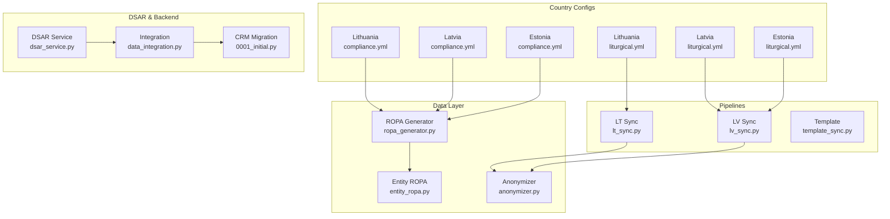
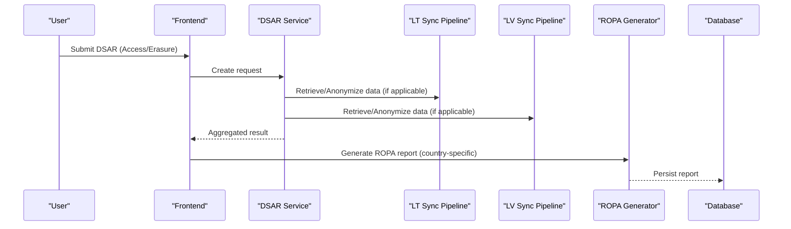
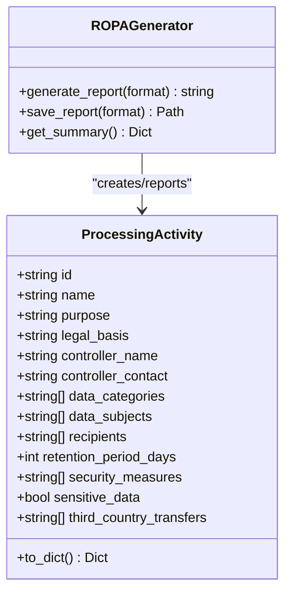
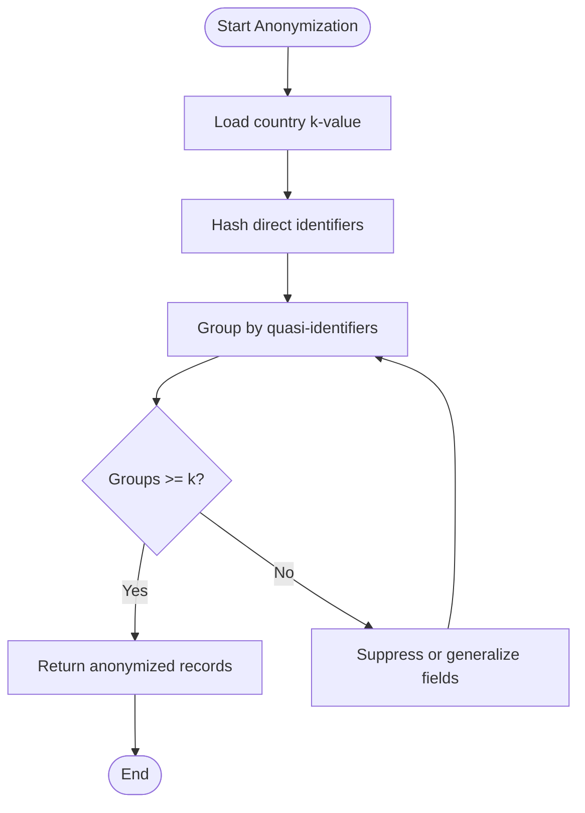
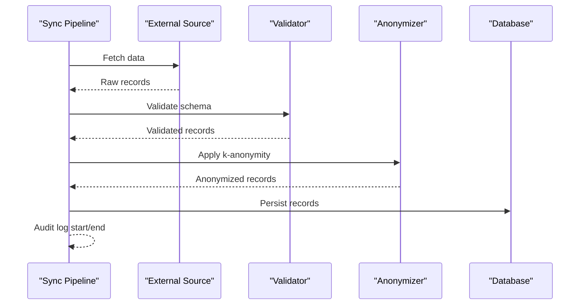
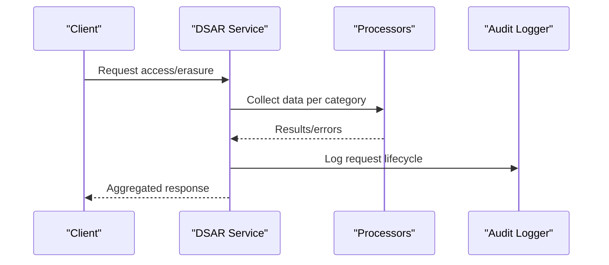
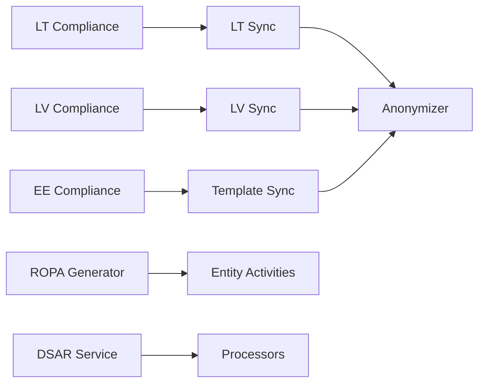

# Country-Specific Compliance Requirements

<cite>
**Referenced Files in This Document**
- [compliance.yml (Lithuania)](file://countries/lt/config/compliance.yml)
- [compliance.yml (Latvia)](file://countries/lv/config/compliance.yml)
- [compliance.yml (Estonia)](file://countries/ee/config/compliance.yml)
- [liturgical.yml (Lithuania)](file://countries/lt/config/liturgical.yml)
- [liturgical.yml (Latvia)](file://countries/lv/config/liturgical.yml)
- [liturgical.yml (Estonia)](file://countries/ee/config/liturgical.yml)
- [entity_ropa.py](file://data/src/gdpr/entity_ropa.py)
- [ropa_generator.py](file://data/src/gdpr/ropa_generator.py)
- [anonymizer.py](file://data/src/gdpr/anonymizer.py)
- [lt_sync.py](file://data/src/pipelines/country_sync/lt_sync.py)
- [lv_sync.py](file://data/src/pipelines/country_sync/lv_sync.py)
- [template_sync.py](file://data/src/pipelines/country_sync/template_sync.py)
- [dsar_service.py](file://data/src/dsar_service.py)
- [data_integration.py](file://backend/django/apps/core/data_integration.py)
- [0001_initial.py (CRM migration)](file://backend/django/apps/crm/migrations/0001_initial.py)
- [GDPR-checklist.md](file://docs/compliance/GDPR-checklist.md)
</cite>

## Table of Contents
1. Introduction
2. Project Structure
3. Core Components
4. Architecture Overview
5. Detailed Component Analysis
6. Dependency Analysis
7. Performance Considerations
8. Troubleshooting Guide
9. Conclusion
10. Appendices

## Introduction
This document provides detailed, country-specific GDPR compliance guidance for Lithuania, Latvia, and Estonia as implemented in the repository. It covers national derogations, age thresholds, supervisory authority requirements, religious institution exemptions, liturgical calendar integration, local language privacy notices, cross-border data transfers within the EU, compliance monitoring, reporting obligations, and local regulatory engagement procedures. It also includes practical configuration examples and deployment guidance for multi-country operations.

## Project Structure
The repository organizes country-specific compliance settings under a dedicated directory per country, with:
- Compliance configuration files defining lawful basis, consent, retention, breach notification, children’s data, and data transfer policies.
- Liturgical calendar configurations for each country to support culturally appropriate scheduling and observances.
- Data pipelines that synchronize country-specific data while enforcing anonymization and audit logging.
- ROPA generation utilities to produce Records of Processing Activities aligned with entity types and jurisdictions.
- DSAR service integration for handling access, erasure, and portability requests across processors.

**Diagram sources**
- [compliance.yml (Lithuania):1-201](file://countries/lt/config/compliance.yml#L1-L201)
- [compliance.yml (Latvia):1-218](file://countries/lv/config/compliance.yml#L1-L218)
- [compliance.yml (Estonia):1-241](file://countries/ee/config/compliance.yml#L1-L241)
- [liturgical.yml (Lithuania):1-184](file://countries/lt/config/liturgical.yml#L1-L184)
- [liturgical.yml (Latvia):1-161](file://countries/lv/config/liturgical.yml#L1-L161)
- [liturgical.yml (Estonia):1-178](file://countries/ee/config/liturgical.yml#L1-L178)
- [ropa_generator.py:1-182](file://data/src/gdpr/ropa_generator.py#L1-L182)
- [entity_ropa.py:1-800](file://data/src/gdpr/entity_ropa.py#L1-L800)
- [anonymizer.py:1-180](file://data/src/gdpr/anonymizer.py#L1-L180)
- [lt_sync.py:1-207](file://data/src/pipelines/country_sync/lt_sync.py#L1-L207)
- [lv_sync.py:1-97](file://data/src/pipelines/country_sync/lv_sync.py#L1-L97)
- [template_sync.py:1-163](file://data/src/pipelines/country_sync/template_sync.py#L1-L163)
- [dsar_service.py:1-133](file://data/src/dsar_service.py#L1-L133)
- [data_integration.py:263-303](file://backend/django/apps/core/data_integration.py#L263-L303)
- [0001_initial.py:514-537](file://backend/django/apps/crm/migrations/0001_initial.py#L514-L537)

**Section sources**
- [compliance.yml (Lithuania):1-201](file://countries/lt/config/compliance.yml#L1-L201)
- [compliance.yml (Latvia):1-218](file://countries/lv/config/compliance.yml#L1-L218)
- [compliance.yml (Estonia):1-241](file://countries/ee/config/compliance.yml#L1-L241)
- [liturgical.yml (Lithuania):1-184](file://countries/lt/config/liturgical.yml#L1-L184)
- [liturgical.yml (Latvia):1-161](file://countries/lv/config/liturgical.yml#L1-L161)
- [liturgical.yml (Estonia):1-178](file://countries/ee/config/liturgical.yml#L1-L178)
- [ropa_generator.py:1-182](file://data/src/gdpr/ropa_generator.py#L1-L182)
- [entity_ropa.py:1-800](file://data/src/gdpr/entity_ropa.py#L1-L800)
- [anonymizer.py:1-180](file://data/src/gdpr/anonymizer.py#L1-L180)
- [lt_sync.py:1-207](file://data/src/pipelines/country_sync/lt_sync.py#L1-L207)
- [lv_sync.py:1-97](file://data/src/pipelines/country_sync/lv_sync.py#L1-L97)
- [template_sync.py:1-163](file://data/src/pipelines/country_sync/template_sync.py#L1-L163)
- [dsar_service.py:1-133](file://data/src/dsar_service.py#L1-L133)
- [data_integration.py:263-303](file://backend/django/apps/core/data_integration.py#L263-L303)
- [0001_initial.py:514-537](file://backend/django/apps/crm/migrations/0001_initial.py#L514-L537)

## Core Components
- Country compliance profiles define lawful bases, consent rules, retention periods, breach notifications, children’s data thresholds, and data transfer policies per jurisdiction.
- Liturgical calendars provide culturally relevant dates and seasons for each country, supporting localized user experiences without storing personal data.
- ROPA generator and entity-specific activities produce Records of Processing Activities tailored to religious and commercial entities.
- Anonymizer applies k-anonymity with country-specific thresholds to ensure statistical safety in analytics and reporting.
- Country sync pipelines orchestrate data synchronization with audit logging, validation, and anonymization steps.
- DSAR service coordinates access, erasure, and portability requests across multiple data processors.

**Section sources**
- [compliance.yml (Lithuania):1-201](file://countries/lt/config/compliance.yml#L1-L201)
- [compliance.yml (Latvia):1-218](file://countries/lv/config/compliance.yml#L1-L218)
- [compliance.yml (Estonia):1-241](file://countries/ee/config/compliance.yml#L1-L241)
- [liturgical.yml (Lithuania):1-184](file://countries/lt/config/liturgical.yml#L1-L184)
- [liturgical.yml (Latvia):1-161](file://countries/lv/config/liturgical.yml#L1-L161)
- [liturgical.yml (Estonia):1-178](file://countries/ee/config/liturgical.yml#L1-L178)
- [entity_ropa.py:1-800](file://data/src/gdpr/entity_ropa.py#L1-L800)
- [ropa_generator.py:1-182](file://data/src/gdpr/ropa_generator.py#L1-L182)
- [anonymizer.py:1-180](file://data/src/gdpr/anonymizer.py#L1-L180)
- [lt_sync.py:1-207](file://data/src/pipelines/country_sync/lt_sync.py#L1-L207)
- [lv_sync.py:1-97](file://data/src/pipelines/country_sync/lv_sync.py#L1-L97)
- [template_sync.py:1-163](file://data/src/pipelines/country_sync/template_sync.py#L1-L163)
- [dsar_service.py:1-133](file://data/src/dsar_service.py#L1-L133)

## Architecture Overview
The system composes country-specific compliance profiles with processing pipelines and DSAR services to deliver compliant operations across Lithuania, Latvia, and Estonia. ROPA generation is driven by entity types and country templates, while anonymization ensures safe aggregation. Sync pipelines enforce validation, auditing, and retention policies.

**Diagram sources**
- [dsar_service.py:1-133](file://data/src/dsar_service.py#L1-L133)
- [lt_sync.py:1-207](file://data/src/pipelines/country_sync/lt_sync.py#L1-L207)
- [lv_sync.py:1-97](file://data/src/pipelines/country_sync/lv_sync.py#L1-L97)
- [ropa_generator.py:1-182](file://data/src/gdpr/ropa_generator.py#L1-L182)

## Detailed Component Analysis

### Lithuania Compliance Profile
- Lawful basis and special categories: Consent-based processing with a minimum age of 14; explicit permission for religious data under Art. 9(2)(d); health data permitted for funeral and cemetery services with long retention and encryption.
- Right to erasure: Canonical records exception applies; sacramental registers retained permanently per Canon Law references.
- Data transfers: Restricted destinations include certain non-EU countries; permitted destinations list aligns with EU/EEA members.
- Consent: Cookie consent banner in Lithuanian; analytics and marketing opt-ins enabled.
- Retention: Sacramental records permanent; parishioner records 10 years; donation and financial records per tax law; funeral and cemetery records 75 years.
- Children’s data: Age of consent 14; parental verification required via email or ID verification.
- Religious organizations: Canon Law compliance noted; safeguards include encryption, RBAC, and immutable audit logs.
- Supervisory authority: State Data Protection Inspectorate (VDATI) contact details provided.

Practical configuration example paths:
- Country profile: [compliance.yml (Lithuania):1-201](file://countries/lt/config/compliance.yml#L1-L201)
- Liturgical calendar: [liturgical.yml (Lithuania):1-184](file://countries/lt/config/liturgical.yml#L1-L184)

**Section sources**
- [compliance.yml (Lithuania):1-201](file://countries/lt/config/compliance.yml#L1-L201)
- [liturgical.yml (Lithuania):1-184](file://countries/lt/config/liturgical.yml#L1-L184)

### Latvia Compliance Profile
- Lawful basis and special categories: Consent-based processing with a minimum age of 13; religious data permitted under Art. 9(2)(d); health data allowed for funeral and cemetery services with encryption and extended retention.
- Right to erasure: Canonical records exception; sacramental registers retained permanently per Canon Law.
- Data transfers: Restricted destinations include specific non-EU countries; permitted destinations list aligns with EU/EEA members.
- Consent: Cookie consent banner in Latvian; analytics and marketing opt-ins enabled; multilingual notice support including Russian.
- Retention: Similar to Lithuania with permanent sacramental records and 75-year retention for funeral and cemetery records.
- Children’s data: Age of consent 13; parental verification required via email or ID verification.
- Religious organizations: Canon Law compliance noted; additional sections for Orthodox and Lutheran churches with jurisdictional notes.
- Supervisory authority: Data State Inspectorate (DVI) contact details provided.

Practical configuration example paths:
- Country profile: [compliance.yml (Latvia):1-218](file://countries/lv/config/compliance.yml#L1-L218)
- Liturgical calendar: [liturgical.yml (Latvia):1-161](file://countries/lv/config/liturgical.yml#L1-L161)

**Section sources**
- [compliance.yml (Latvia):1-218](file://countries/lv/config/compliance.yml#L1-L218)
- [liturgical.yml (Latvia):1-161](file://countries/lv/config/liturgical.yml#L1-L161)

### Estonia Compliance Profile
- Lawful basis and special categories: Consent-based processing with a minimum age of 13; religious data permitted under Art. 9(2)(d); health data allowed for funeral and cemetery services with encryption and extended retention.
- Right to erasure: Canonical records exception; sacramental registers retained permanently per Canon Law.
- Data transfers: Restricted destinations include specific non-EU countries; permitted destinations list aligns with EU/EEA members.
- Consent: Cookie consent banner in Estonian; analytics and marketing opt-ins enabled; multilingual notice support including Russian.
- Retention: Permanent sacramental records; 75-year retention for funeral and cemetery records; other categories follow tax and best practice guidelines.
- Children’s data: Age of consent 13; parental verification required via email or ID verification.
- Religious organizations: Canon Law compliance noted; sections for Orthodox and Lutheran churches; Catholic Apostolic Administration details included.
- Digital governance: X-Road integration available for secure data exchange (disabled for religious data but usable for parishioner services).
- Supervisory authority: Estonian Data Protection Inspectorate (AKI) contact details provided.

Practical configuration example paths:
- Country profile: [compliance.yml (Estonia):1-241](file://countries/ee/config/compliance.yml#L1-L241)
- Liturgical calendar: [liturgical.yml (Estonia):1-178](file://countries/ee/config/liturgical.yml#L1-L178)

**Section sources**
- [compliance.yml (Estonia):1-241](file://countries/ee/config/compliance.yml#L1-L241)
- [liturgical.yml (Estonia):1-178](file://countries/ee/config/liturgical.yml#L1-L178)

### ROPA Generation and Entity Activities
- The ROPA generator produces structured Records of Processing Activities in JSON or Markdown, capturing controller info, legal basis, data categories, subjects, recipients, retention, security measures, and sensitive data flags.
- Entity-specific activities map to ten entity types (e.g., basilica, cathedral, diocese, church, protestant, orthodox, greek catholic, funeral, cemetery), each with tailored purposes, legal bases, retention, and security controls.

**Diagram sources**
- [ropa_generator.py:1-182](file://data/src/gdpr/ropa_generator.py#L1-L182)
- [entity_ropa.py:1-800](file://data/src/gdpr/entity_ropa.py#L1-L800)

**Section sources**
- [ropa_generator.py:1-182](file://data/src/gdpr/ropa_generator.py#L1-L182)
- [entity_ropa.py:1-800](file://data/src/gdpr/entity_ropa.py#L1-L800)

### Anonymization and K-Anonymity Thresholds
- Country-specific k-anonymity values are defined, with default EU threshold at k=5 for Lithuania, Latvia, and Estonia. Higher thresholds apply in stricter jurisdictions (e.g., Germany, France).
- The anonymizer hashes direct identifiers and supports batch checks against quasi-identifiers to ensure group sizes meet k thresholds.

**Diagram sources**
- [anonymizer.py:1-180](file://data/src/gdpr/anonymizer.py#L1-L180)

**Section sources**
- [anonymizer.py:1-180](file://data/src/gdpr/anonymizer.py#L1-L180)

### Country Sync Pipelines (Lithuania and Latvia)
- Lithuania pipeline synchronizes parishes and donations with validation, k-anonymization, and audit logging; supports right of access and erasure endpoints.
- Latvia pipeline aggregates multiple denominational sources (Catholic, Lutheran, Orthodox) with error tracking and completion audits.
- Template pipeline provides a reusable structure for new country implementations, emphasizing GDPR compliance checks and standardized steps.

**Diagram sources**
- [lt_sync.py:1-207](file://data/src/pipelines/country_sync/lt_sync.py#L1-L207)
- [lv_sync.py:1-97](file://data/src/pipelines/country_sync/lv_sync.py#L1-L97)
- [template_sync.py:1-163](file://data/src/pipelines/country_sync/template_sync.py#L1-L163)
- [anonymizer.py:1-180](file://data/src/gdpr/anonymizer.py#L1-L180)

**Section sources**
- [lt_sync.py:1-207](file://data/src/pipelines/country_sync/lt_sync.py#L1-L207)
- [lv_sync.py:1-97](file://data/src/pipelines/country_sync/lv_sync.py#L1-L97)
- [template_sync.py:1-163](file://data/src/pipelines/country_sync/template_sync.py#L1-L163)

### DSAR Handling Across Processors
- DSAR service orchestrates access, erasure, and portability requests, collecting data from multiple processors and producing aggregated results with audit trails.
- Backend integration exposes DSAR service retrieval and handles data access requests, while CRM migrations track request types and lifecycle.

**Diagram sources**
- [dsar_service.py:1-133](file://data/src/dsar_service.py#L1-L133)
- [data_integration.py:263-303](file://backend/django/apps/core/data_integration.py#L263-L303)
- [0001_initial.py:514-537](file://backend/django/apps/crm/migrations/0001_initial.py#L514-L537)

**Section sources**
- [dsar_service.py:1-133](file://data/src/dsar_service.py#L1-L133)
- [data_integration.py:263-303](file://backend/django/apps/core/data_integration.py#L263-L303)
- [0001_initial.py:514-537](file://backend/django/apps/crm/migrations/0001_initial.py#L514-L537)

## Dependency Analysis
- Country compliance profiles drive consent banners, retention schedules, and transfer restrictions applied by sync pipelines and DSAR workflows.
- ROPA generation depends on entity type mappings and country templates to produce accurate records of processing activities.
- Anonymization integrates with pipelines to ensure statistical safety before storage or export.
- DSAR service depends on processor implementations and audit logging to fulfill rights consistently across jurisdictions.

**Diagram sources**
- [compliance.yml (Lithuania):1-201](file://countries/lt/config/compliance.yml#L1-L201)
- [compliance.yml (Latvia):1-218](file://countries/lv/config/compliance.yml#L1-L218)
- [compliance.yml (Estonia):1-241](file://countries/ee/config/compliance.yml#L1-L241)
- [lt_sync.py:1-207](file://data/src/pipelines/country_sync/lt_sync.py#L1-L207)
- [lv_sync.py:1-97](file://data/src/pipelines/country_sync/lv_sync.py#L1-L97)
- [template_sync.py:1-163](file://data/src/pipelines/country_sync/template_sync.py#L1-L163)
- [anonymizer.py:1-180](file://data/src/gdpr/anonymizer.py#L1-L180)
- [ropa_generator.py:1-182](file://data/src/gdpr/ropa_generator.py#L1-L182)
- [entity_ropa.py:1-800](file://data/src/gdpr/entity_ropa.py#L1-L800)
- [dsar_service.py:1-133](file://data/src/dsar_service.py#L1-L133)

**Section sources**
- [compliance.yml (Lithuania):1-201](file://countries/lt/config/compliance.yml#L1-L201)
- [compliance.yml (Latvia):1-218](file://countries/lv/config/compliance.yml#L1-L218)
- [compliance.yml (Estonia):1-241](file://countries/ee/config/compliance.yml#L1-L241)
- [lt_sync.py:1-207](file://data/src/pipelines/country_sync/lt_sync.py#L1-L207)
- [lv_sync.py:1-97](file://data/src/pipelines/country_sync/lv_sync.py#L1-L97)
- [template_sync.py:1-163](file://data/src/pipelines/country_sync/template_sync.py#L1-L163)
- [anonymizer.py:1-180](file://data/src/gdpr/anonymizer.py#L1-L180)
- [ropa_generator.py:1-182](file://data/src/gdpr/ropa_generator.py#L1-L182)
- [entity_ropa.py:1-800](file://data/src/gdpr/entity_ropa.py#L1-L800)
- [dsar_service.py:1-133](file://data/src/dsar_service.py#L1-L133)

## Performance Considerations
- Use k-anonymity thresholds appropriate to each country to balance privacy and utility; defaults are set to k=5 for Lithuania, Latvia, and Estonia.
- Minimize data collection during sync to essential fields only; validate early to reduce downstream processing costs.
- Batch operations in pipelines should respect timeouts and retry counts to maintain stability under load.
- ROPA reports can be generated in JSON or Markdown; choose formats based on consumption needs to avoid unnecessary transformations.

[No sources needed since this section provides general guidance]

## Troubleshooting Guide
- If DSAR requests fail to retrieve data, verify processor availability and audit logs for errors; check backend integration methods for DSAR service retrieval.
- For sync failures, review audit events logged at start and completion; inspect validation errors and anonymization outcomes.
- Ensure country-specific compliance settings are correctly loaded; mismatched country codes or missing legal basis will trigger assertions in template pipelines.
- Confirm that cookie consent banners and privacy notices use the correct local languages per country configuration.

**Section sources**
- [data_integration.py:263-303](file://backend/django/apps/core/data_integration.py#L263-L303)
- [lt_sync.py:1-207](file://data/src/pipelines/country_sync/lt_sync.py#L1-L207)
- [lv_sync.py:1-97](file://data/src/pipelines/country_sync/lv_sync.py#L1-L97)
- [template_sync.py:1-163](file://data/src/pipelines/country_sync/template_sync.py#L1-L163)
- [compliance.yml (Lithuania):1-201](file://countries/lt/config/compliance.yml#L1-L201)
- [compliance.yml (Latvia):1-218](file://countries/lv/config/compliance.yml#L1-L218)
- [compliance.yml (Estonia):1-241](file://countries/ee/config/compliance.yml#L1-L241)

## Conclusion
The repository implements robust, country-specific GDPR compliance for Lithuania, Latvia, and Estonia through configurable profiles, liturgical calendars, ROPA generation, anonymization, synchronized data pipelines, and DSAR handling. These components collectively support lawful processing, cultural adaptations, and regulatory engagement while maintaining high standards for data protection and transparency.

[No sources needed since this section summarizes without analyzing specific files]

## Appendices

### Practical Configuration Examples
- Lithuania:
  - Set consent banner language to Lithuanian and configure age of consent at 14.
  - Define retention periods for sacramental records as permanent and financial records per tax law.
  - Configure restricted and permitted destinations for data transfers.
  - Reference: [compliance.yml (Lithuania):1-201](file://countries/lt/config/compliance.yml#L1-L201)

- Latvia:
  - Set consent banner language to Latvian and configure age of consent at 13.
  - Include Orthodox and Lutheran church sections for jurisdictional compliance.
  - Configure retention periods and encryption requirements for health-related data.
  - Reference: [compliance.yml (Latvia):1-218](file://countries/lv/config/compliance.yml#L1-L218)

- Estonia:
  - Set consent banner language to Estonian and configure age of consent at 13.
  - Enable X-Road integration for parishioner services where appropriate.
  - Configure retention periods and encryption for health-related data.
  - Reference: [compliance.yml (Estonia):1-241](file://countries/ee/config/compliance.yml#L1-L241)

### Local Language Privacy Notices
- Use country-specific consent text templates for cookie banners and privacy notices to ensure clarity and compliance.
- References:
  - [compliance.yml (Lithuania):117-135](file://countries/lt/config/compliance.yml#L117-L135)
  - [compliance.yml (Latvia):117-136](file://countries/lv/config/compliance.yml#L117-L136)
  - [compliance.yml (Estonia):117-136](file://countries/ee/config/compliance.yml#L117-L136)

### Cross-Border Data Transfers Within the EU
- All three countries permit transfers within the listed EU/EEA destinations; restrict transfers to non-EU countries unless adequate safeguards (SCCs, supplementary measures) are in place.
- References:
  - [compliance.yml (Lithuania):81-115](file://countries/lt/config/compliance.yml#L81-L115)
  - [compliance.yml (Latvia):81-115](file://countries/lv/config/compliance.yml#L81-L115)
  - [compliance.yml (Estonia):81-115](file://countries/ee/config/compliance.yml#L81-L115)

### Compliance Monitoring and Reporting
- Generate ROPA reports per entity type and country; schedule periodic reviews aligned with configured cycles.
- Use audit logs in sync pipelines and DSAR workflows to monitor compliance events and anomalies.
- References:
  - [ropa_generator.py:103-182](file://data/src/gdpr/ropa_generator.py#L103-L182)
  - [entity_ropa.py:39-65](file://data/src/gdpr/entity_ropa.py#L39-L65)
  - [lt_sync.py:72-113](file://data/src/pipelines/country_sync/lt_sync.py#L72-L113)
  - [lv_sync.py:62-91](file://data/src/pipelines/country_sync/lv_sync.py#L62-L91)
  - [dsar_service.py:88-133](file://data/src/dsar_service.py#L88-L133)

### Local Regulatory Engagement Procedures
- Maintain contact information for supervisory authorities and update when necessary.
- Align breach notification timelines and thresholds with country configurations.
- References:
  - [compliance.yml (Lithuania):10-17](file://countries/lt/config/compliance.yml#L10-L17)
  - [compliance.yml (Latvia):10-17](file://countries/lv/config/compliance.yml#L10-L17)
  - [compliance.yml (Estonia):10-17](file://countries/ee/config/compliance.yml#L10-L17)
  - [compliance.yml (Lithuania):163-170](file://countries/lt/config/compliance.yml#L163-L170)
  - [compliance.yml (Latvia):163-171](file://countries/lv/config/compliance.yml#L163-L171)
  - [compliance.yml (Estonia):163-171](file://countries/ee/config/compliance.yml#L163-L171)

### Liturgical Calendar Integration and Cultural Adaptations
- Configure local feast days, holy days of obligation, and denominational calendars to reflect cultural and religious practices.
- References:
  - [liturgical.yml (Lithuania):10-107](file://countries/lt/config/liturgical.yml#L10-L107)
  - [liturgical.yml (Latvia):10-99](file://countries/lv/config/liturgical.yml#L10-L99)
  - [liturgical.yml (Estonia):10-99](file://countries/ee/config/liturgical.yml#L10-L99)

### Multi-Country Deployment Guide
- Copy the template sync pipeline and customize country code, timezone, language, currency, and data sources.
- Ensure compliance profiles are loaded per tenant and that DSAR workflows route to appropriate processors.
- References:
  - [template_sync.py:22-66](file://data/src/pipelines/country_sync/template_sync.py#L22-L66)
  - [data_integration.py:263-303](file://backend/django/apps/core/data_integration.py#L263-L303)

### Age Thresholds and Parental Consent
- Lithuania: 14 years; Latvia: 13 years; Estonia: 13 years.
- Implement parental consent mechanisms below thresholds and maintain age-appropriate privacy notices.
- References:
  - [compliance.yml (Lithuania):171-178](file://countries/lt/config/compliance.yml#L171-L178)
  - [compliance.yml (Latvia):172-179](file://countries/lv/config/compliance.yml#L172-L179)
  - [compliance.yml (Estonia):172-179](file://countries/ee/config/compliance.yml#L172-L179)
  - [GDPR-checklist.md:238-258](file://docs/compliance/GDPR-checklist.md#L238-L258)