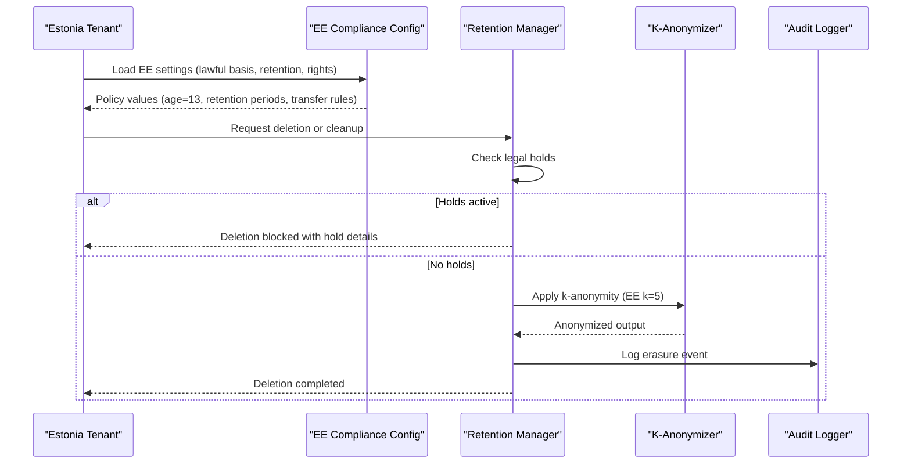
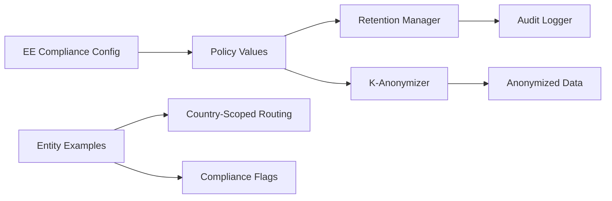
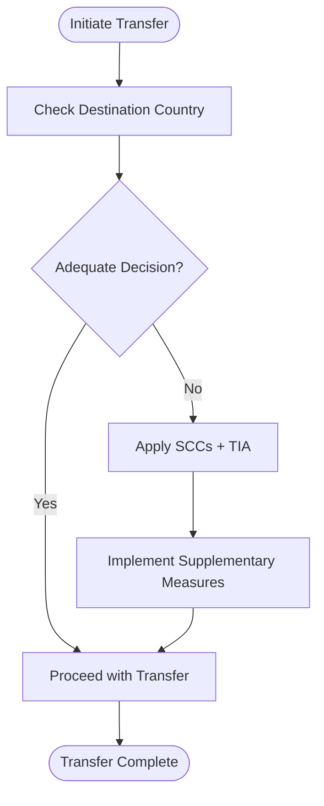

# Estonia Compliance Requirements

<cite>
**Referenced Files in This Document**
- [compliance.yml](file://countries/ee/config/compliance.yml)
- [liturgical.yml](file://countries/ee/config/liturgical.yml)
- [seo.yml](file://countries/ee/config/seo.yml)
- [anonymizer.py](file://data/src/gdpr/anonymizer.py)
- [retention_manager.py](file://data/src/gdpr/retention_manager.py)
- [entity.yml (Estonia Apostolic Administration)](file://countries/ee/examples/catholic/diocese/estonia-apostolic/entity.yml)
- [entity.yml (Tallinn Alexander Nevsky Orthodox Cathedral)](file://countries/ee/examples/orthodox/cathedral/tallinn-alexander-nevsky/entity.yml)
- [entity.yml (Tallinn Lutheran Cathedral)](file://countries/ee/examples/protestant/lutheran/tallinn-cathedral/entity.yml)
- [GDPR-checklist.md](file://docs/compliance/GDPR-checklist.md)
- [international-seo-strategy.md](file://docs/seo/international-seo-strategy.md)
</cite>

## Table of Contents
1. Introduction
2. Project Structure
3. Core Components
4. Architecture Overview
5. Detailed Component Analysis
6. Dependency Analysis
7. Performance Considerations
8. Troubleshooting Guide
9. Conclusion
10. Appendices

## Introduction
This document provides comprehensive guidance for implementing Estonia-specific GDPR compliance within the project. It covers oversight by the Estonian Data Protection Inspectorate, implementation details aligned with the Estonian Personal Data Protection Act, and Estonia’s reduced age of consent at 13 years. It also explains how to configure liturgical calendars for Estonian Orthodox and Catholic communities, optimize SEO for Estonian search engines with local language support, and integrate with Estonia’s advanced digital infrastructure where appropriate. Practical examples are included for configuring Estonian compliance settings, handling cross-border data transfers within the Nordic-Baltic region, and meeting Estonia’s advanced digital compliance standards.

## Project Structure
Estonia-specific configuration is centralized under a country-scoped directory structure:
- Country configuration files define legal framework, DPA contacts, GDPR implementation specifics, retention periods, data subject rights, and X-Road integration notes.
- Liturgical calendar configuration defines Roman Catholic and Orthodox calendars with Estonian feast days and jurisdictions.
- SEO configuration sets locale alternates, default locale, sitemaps, robots rules, and IndexNow usage for Estonian domains.
- Example entity configurations demonstrate canonical information, languages, domains, features, and compliance flags for Catholic, Orthodox, and Lutheran entities in Estonia.

```mermaid
graph TB
EE_Config["Estonia Config<br/>compliance.yml"] --> DPA["Data Protection Authority<br/>Andmekaitse Inspektsioon"]
EE_Config --> LegalFramework["Legal Framework<br/>Personal Data Protection Act"]
EE_Config --> Retention["Retention Periods"]
EE_Config --> Rights["Data Subject Rights"]
EE_Config --> XRoad["X-Road Integration Notes"]
EE_Liturgical["Liturgical Calendar<br/>liturgical.yml"] --> Catholic["Roman Catholic<br/>Estonian Apostolic Administration"]
EE_Liturgical --> Orthodox["Orthodox<br/>Julian Calendar"]
EE_Liturgical --> Lutheran["Lutheran<br/>Western Calendar"]
EE_SEO["SEO Configuration<br/>seo.yml"] --> Locales["Locales<br/>et-EE, en-EE, ru-EE"]
EE_SEO --> Sitemap["Sitemap & Robots"]
EE_SEO --> IndexNow["IndexNow API"]
EE_Examples["Entity Examples<br/>Catholic / Orthodox / Lutheran"] --> Features["Features & Domains"]
EE_Examples --> ComplianceFlags["Compliance Flags"]
```

**Diagram sources**
- [compliance.yml:10-30](file://countries/ee/config/compliance.yml#L10-L30)
- [liturgical.yml:10-100](file://countries/ee/config/liturgical.yml#L10-L100)
- [seo.yml:4-39](file://countries/ee/config/seo.yml#L4-L39)
- [entity.yml (Estonia Apostolic Administration):5-75](file://countries/ee/examples/catholic/diocese/estonia-apostolic/entity.yml#L5-L75)
- [entity.yml (Tallinn Alexander Nevsky Orthodox Cathedral):5-91](file://countries/ee/examples/orthodox/cathedral/tallinn-alexander-nevsky/entity.yml#L5-L91)
- [entity.yml (Tallinn Lutheran Cathedral):5-68](file://countries/ee/examples/protestant/lutheran/tallinn-cathedral/entity.yml#L5-L68)

**Section sources**
- [compliance.yml:1-241](file://countries/ee/config/compliance.yml#L1-L241)
- [liturgical.yml:1-178](file://countries/ee/config/liturgical.yml#L1-L178)
- [seo.yml:1-39](file://countries/ee/config/seo.yml#L1-L39)
- [entity.yml (Estonia Apostolic Administration):1-76](file://countries/ee/examples/catholic/diocese/estonia-apostolic/entity.yml#L1-L76)
- [entity.yml (Tallinn Alexander Nevsky Orthodox Cathedral):1-91](file://countries/ee/examples/orthodox/cathedral/tallinn-alexander-nevsky/entity.yml#L1-L91)
- [entity.yml (Tallinn Lutheran Cathedral):1-68](file://countries/ee/examples/protestant/lutheran/tallinn-cathedral/entity.yml#L1-L68)

## Core Components
- Estonian Data Protection Inspectorate (AKI) contact and jurisdictional references are defined for oversight and reporting.
- National legal framework includes the Estonian Personal Data Protection Act and Public Information Act, with effective dates and amendments.
- GDPR implementation specifics include lawful basis settings, special categories handling for religious data, right to erasure exceptions for canonical records, and data transfer restrictions/permitted destinations.
- Consent requirements specify cookie consent behavior, opt-in mechanisms, and localized consent text templates.
- Retention periods align with Canon Law and Estonian tax law for sacramental, parishioner, donation, financial, funeral service, cemetery, analytics, marketing, and consent records.
- Data subject rights define deadlines, formats, and limitations specific to canonical records.
- Breach notification thresholds and contact points are configured.
- Children’s data protections set the age of consent at 13 and require parental verification methods.
- Religious organization specifics include canonical compliance references and jurisdictional notes for Orthodox and Lutheran churches.
- X-Road integration is noted as available but disabled for religious data, with potential use cases for civil registration verification and official document signing.

**Section sources**
- [compliance.yml:10-241](file://countries/ee/config/compliance.yml#L10-L241)

## Architecture Overview
The Estonia compliance architecture integrates configuration-driven controls with runtime enforcement modules:
- Configuration files drive policy decisions such as lawful basis, retention periods, and data transfer rules.
- Runtime modules enforce k-anonymity thresholds per country and manage retention and deletion workflows, including legal holds.
- Entity examples demonstrate how country-scoped routing and compliance flags apply across Catholic, Orthodox, and Lutheran deployments.

**Diagram sources**
- [compliance.yml:31-170](file://countries/ee/config/compliance.yml#L31-L170)
- [retention_manager.py:188-336](file://data/src/gdpr/retention_manager.py#L188-L336)
- [anonymizer.py:25-83](file://data/src/gdpr/anonymizer.py#L25-L83)

**Section sources**
- [retention_manager.py:188-336](file://data/src/gdpr/retention_manager.py#L188-L336)
- [anonymizer.py:25-83](file://data/src/gdpr/anonymizer.py#L25-L83)

## Detailed Component Analysis

### Estonian Data Protection Oversight and Legal Framework
- The Estonian Data Protection Inspectorate (Andmekaitse Inspektsioon) is the supervisory authority with contact details and address provided for reporting and cooperation.
- The national legal framework includes the Personal Data Protection Act and Public Information Act, with references and effective dates, ensuring alignment with EU GDPR and Estonian statutory requirements.

Practical implications:
- All processing activities must be documented and reviewed regularly.
- Reporting breaches to AKI within the configured timeframe is mandatory.
- Public sector and media activities may trigger additional obligations under the Public Information Act.

**Section sources**
- [compliance.yml:10-30](file://countries/ee/config/compliance.yml#L10-L30)

### Reduced Age of Consent and Children’s Data
- Estonia sets the minimum age of consent for data processing at 13 years, with parental consent required below this threshold.
- Verification methods include email confirmation and identity verification to ensure parental responsibility.

Implementation guidance:
- Enforce age checks during registration and feature access.
- Provide clear, age-appropriate privacy notices.
- Implement parental consent flows and allow easy withdrawal.

**Section sources**
- [compliance.yml:172-179](file://countries/ee/config/compliance.yml#L172-L179)
- [GDPR-checklist.md:238-256](file://docs/compliance/GDPR-checklist.md#L238-L256)

### Special Categories and Canonical Records
- Religious data is explicitly permitted under Article 9(2)(d) for legitimate activities, with additional safeguards including encryption, access control, and immutable audit logging.
- Sacramental records are permanently retained due to Canon Law, with explicit exceptions to the right to erasure for baptism, confirmation, marriage, and death records.

Operational considerations:
- Apply enhanced security measures for religious data.
- Maintain strict retention policies for canonical records.
- Ensure access controls limit visibility to authorized personnel only.

**Section sources**
- [compliance.yml:46-74](file://countries/ee/config/compliance.yml#L46-L74)

### Data Transfers Within the Nordic-Baltic Region
- Permitted destinations include all EU member states, including Estonia, Finland, Latvia, Lithuania, Sweden, Denmark, and others.
- Restricted destinations include countries without adequacy decisions or with elevated risk profiles.

Cross-border best practices:
- Use Standard Contractual Clauses when transferring outside the EEA.
- Conduct Transfer Impact Assessments for non-adequate destinations.
- Prefer intra-EU transfers within the Nordic-Baltic region to minimize risk.

**Section sources**
- [compliance.yml:81-116](file://countries/ee/config/compliance.yml#L81-L116)

### Liturgical Calendar Configurations
- Roman Catholic calendar uses the Gregorian system with Estonian names for seasons and local feasts, including national holidays like Independence Day and Victory Day.
- Orthodox calendar uses the Julian system with jurisdictions under Constantinople and Moscow Patriarchate, reflecting Estonia’s diverse Orthodox presence.
- Lutheran calendar follows the Western liturgical year with major feasts and historical context.

Usage guidance:
- Configure site content and notifications based on the selected calendar.
- Respect jurisdictional differences and canonical requirements.
- Localize labels and dates to Estonian audiences while maintaining accuracy.

**Section sources**
- [liturgical.yml:10-178](file://countries/ee/config/liturgical.yml#L10-L178)

### SEO Optimization for Estonian Search Engines
- Default locale is Estonian (et), with alternates for English and Russian to serve local minorities.
- x-default points to et-EE to prioritize the national language.
- IndexNow is enabled for faster indexing, with keys stored securely per tenant.
- Sitemaps are generated per tenant with URL limits, and robots rules prevent indexing of sensitive paths.

Local language requirements:
- Provide native-language content for Estonian users.
- Include Russian-language options for minority audiences.
- Ensure NAP consistency and local business profile synchronization.

**Section sources**
- [seo.yml:4-39](file://countries/ee/config/seo.yml#L4-L39)
- [international-seo-strategy.md:138-221](file://docs/seo/international-seo-strategy.md#L138-L221)

### Digital Identity and Government Systems Integration
- X-Road integration is noted as available but disabled for religious data; potential use cases include civil registration verification and official document signing.
- For e-Residency considerations, ensure that any integration respects data minimization and purpose limitation principles.

Implementation notes:
- Do not process religious data via X-Road unless explicitly permitted and compliant.
- Use secure channels and verify identities through approved government systems when necessary.
- Document all integrations and maintain audit trails.

**Section sources**
- [compliance.yml:234-241](file://countries/ee/config/compliance.yml#L234-L241)

### Practical Configuration Examples
- Configure lawful basis and consent validity periods according to Estonian standards.
- Set retention periods for sacramental, donation, financial, and cemetery records in alignment with Canon Law and Estonian tax law.
- Enable k-anonymity with country-specific thresholds (k=5 for Estonia).
- Apply legal holds before any deletion operations to comply with legal claims and regulatory requirements.

Example entity configurations demonstrate:
- Country-scoped data routing and compliance flags.
- Supported languages and domain setups.
- Feature toggles for services like donations, events, and calendars.

**Section sources**
- [compliance.yml:31-170](file://countries/ee/config/compliance.yml#L31-L170)
- [anonymizer.py:25-83](file://data/src/gdpr/anonymizer.py#L25-L83)
- [retention_manager.py:188-336](file://data/src/gdpr/retention_manager.py#L188-L336)
- [entity.yml (Estonia Apostolic Administration):5-75](file://countries/ee/examples/catholic/diocese/estonia-apostolic/entity.yml#L5-L75)
- [entity.yml (Tallinn Alexander Nevsky Orthodox Cathedral):5-91](file://countries/ee/examples/orthodox/cathedral/tallinn-alexander-nevsky/entity.yml#L5-L91)
- [entity.yml (Tallinn Lutheran Cathedral):5-68](file://countries/ee/examples/protestant/lutheran/tallinn-cathedral/entity.yml#L5-L68)

## Dependency Analysis
The Estonia compliance stack depends on configuration-driven policies and runtime enforcement modules:
- Compliance configuration drives lawful basis, retention, and transfer rules.
- Retention manager enforces deletion workflows and legal holds.
- K-anonymizer applies country-specific thresholds for anonymization.
- Entity examples provide concrete instances of country-scoped routing and compliance flags.

**Diagram sources**
- [compliance.yml:31-170](file://countries/ee/config/compliance.yml#L31-L170)
- [retention_manager.py:188-336](file://data/src/gdpr/retention_manager.py#L188-L336)
- [anonymizer.py:25-83](file://data/src/gdpr/anonymizer.py#L25-L83)
- [entity.yml (Estonia Apostolic Administration):5-75](file://countries/ee/examples/catholic/diocese/estonia-apostolic/entity.yml#L5-L75)

**Section sources**
- [compliance.yml:31-170](file://countries/ee/config/compliance.yml#L31-L170)
- [retention_manager.py:188-336](file://data/src/gdpr/retention_manager.py#L188-L336)
- [anonymizer.py:25-83](file://data/src/gdpr/anonymizer.py#L25-L83)
- [entity.yml (Estonia Apostolic Administration):5-75](file://countries/ee/examples/catholic/diocese/estonia-apostolic/entity.yml#L5-L75)

## Performance Considerations
- K-anonymity thresholds affect performance and privacy balance; Estonia’s k=5 provides a reasonable baseline for anonymization without excessive overhead.
- Retention cleanup should be scheduled efficiently to avoid blocking critical operations.
- SEO optimizations like sitemaps and IndexNow improve discoverability but should respect robots rules to protect sensitive endpoints.

[No sources needed since this section provides general guidance]

## Troubleshooting Guide
Common issues and resolutions:
- Deletion blocked by legal hold: Verify active legal holds and lift them when appropriate; ensure audit logs capture the reason and details.
- Consent not recorded properly: Confirm consent collection mechanisms and versioning; ensure timestamps and user agents are captured.
- SEO indexing problems: Check robots rules and sitemap generation; ensure IndexNow key is correctly configured and accessible.

**Section sources**
- [retention_manager.py:257-336](file://data/src/gdpr/retention_manager.py#L257-L336)
- [seo.yml:20-39](file://countries/ee/config/seo.yml#L20-L39)

## Conclusion
Estonia’s advanced digital governance framework requires careful alignment with GDPR and national laws. This document outlines the configuration and operational steps to meet Estonian compliance standards, including oversight by the Estonian Data Protection Inspectorate, reduced age of consent at 13, liturgical calendar configurations, SEO optimization for local languages, and integration considerations with X-Road. By following these guidelines, organizations can implement robust compliance measures tailored to Estonia’s unique legal and cultural context.

[No sources needed since this section summarizes without analyzing specific files]

## Appendices

### Appendix A: Cross-Border Data Transfer Flowchart

[No sources needed since this diagram shows conceptual workflow, not actual code structure]