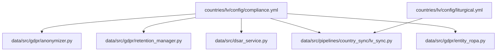
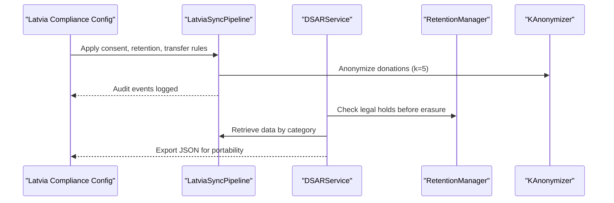
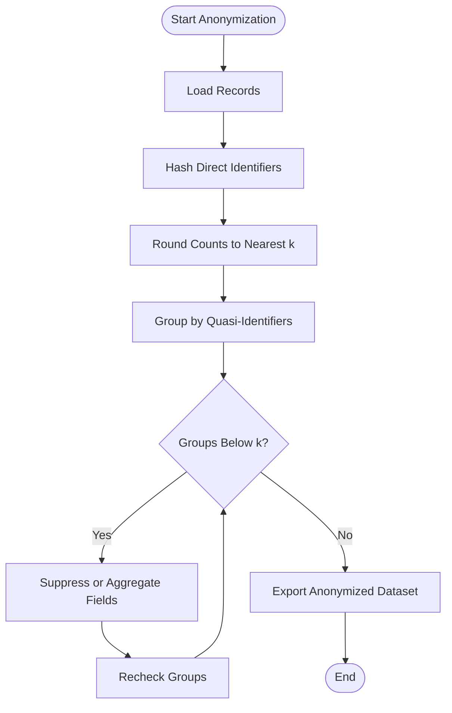
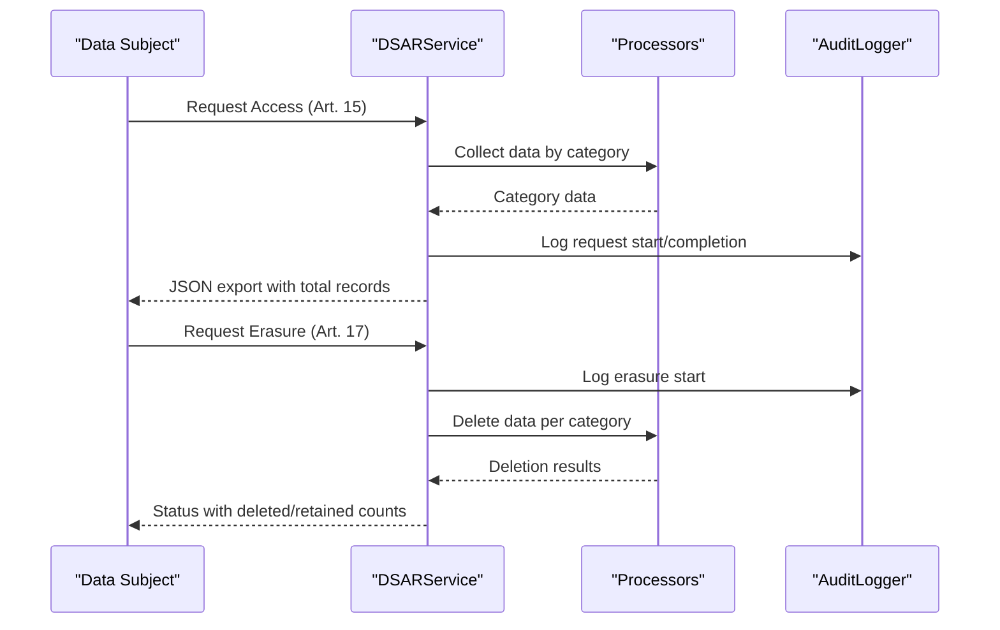
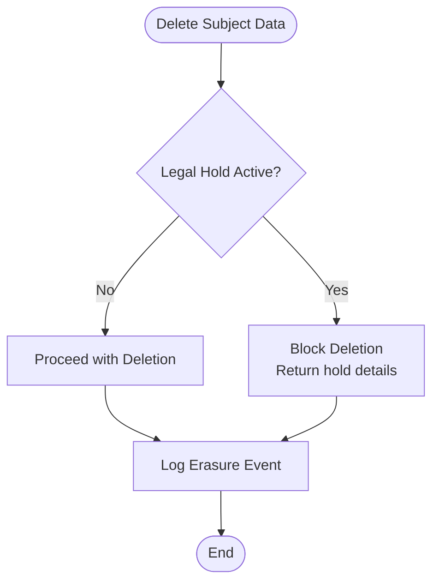
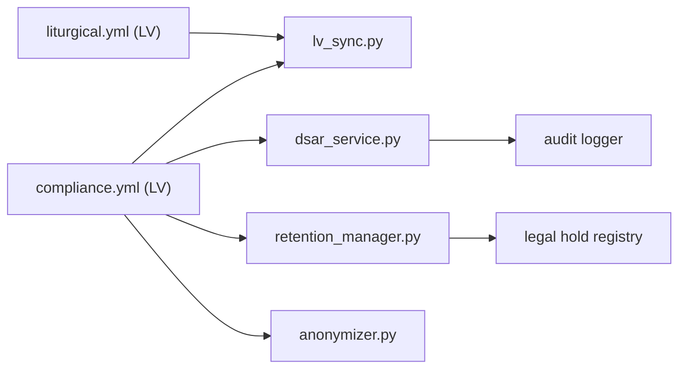

# Latvia Compliance Requirements

<cite>
**Referenced Files in This Document**
- [compliance.yml (Latvia)](file://countries/lv/config/compliance.yml)
- [liturgical.yml (Latvia)](file://countries/lv/config/liturgical.yml)
- [anonymizer.py](file://data/src/gdpr/anonymizer.py)
- [dsar_service.py](file://data/src/dsar_service.py)
- [lv_sync.py](file://data/src/pipelines/country_sync/lv_sync.py)
- [retention_manager.py](file://data/src/gdpr/retention_manager.py)
- [entity_ropa.py](file://data/src/gdpr/entity_ropa.py)
</cite>

## Table of Contents
1. [Introduction](#introduction)
2. [Project Structure](#project-structure)
3. [Core Components](#core-components)
4. [Architecture Overview](#architecture-overview)
5. [Detailed Component Analysis](#detailed-component-analysis)
6. [Dependency Analysis](#dependency-analysis)
7. [Performance Considerations](#performance-considerations)
8. [Troubleshooting Guide](#troubleshooting-guide)
9. [Conclusion](#conclusion)
10. [Appendices](#appendices)

## Introduction
This document provides Latvia-specific GDPR compliance guidance grounded in the repository’s configuration and code. It covers:
- Data Protection Authority registration and oversight references for Latvia
- National legal framework and GDPR implementation specifics, including the reduced age of consent at 13 years
- Cross-border data transfer rules within the EU and restricted destinations
- Consent mechanisms and local language requirements for privacy notices and cookie banners
- Liturgical calendar integration for Latvian Orthodox and Catholic traditions
- Practical examples for configuring Latvian compliance settings, anonymizing personal identifiers, and handling data subject requests through supervisory authority channels

## Project Structure
The repository organizes country-specific compliance via YAML configurations and implements processing logic in Python modules under data/src. For Latvia:
- Country compliance and liturgical calendars are defined under countries/lv/config
- Processing pipelines, DSAR handling, anonymization, retention, and ROPA generation live under data/src

**Diagram sources**
- [compliance.yml (Latvia):1-218](file://countries/lv/config/compliance.yml#L1-L218)
- [liturgical.yml (Latvia):1-161](file://countries/lv/config/liturgical.yml#L1-L161)
- [anonymizer.py:1-180](file://data/src/gdpr/anonymizer.py#L1-L180)
- [retention_manager.py:1-336](file://data/src/gdpr/retention_manager.py#L1-L336)
- [dsar_service.py:1-303](file://data/src/dsar_service.py#L1-L303)
- [lv_sync.py:1-97](file://data/src/pipelines/country_sync/lv_sync.py#L1-L97)
- [entity_ropa.py:1-821](file://data/src/gdpr/entity_ropa.py#L1-L821)

**Section sources**
- [compliance.yml (Latvia):1-218](file://countries/lv/config/compliance.yml#L1-L218)
- [liturgical.yml (Latvia):1-161](file://countries/lv/config/liturgical.yml#L1-L161)

## Core Components
- Latvia compliance configuration defines:
  - Data Protection Authority: Datu valsts inspekcija (DVI), with website and contact details
  - Legal framework: Personal Data Protection Law No. 412; Information Disclosure Law No. 188
  - GDPR implementation specifics: lawful basis, special categories, right to erasure exceptions for canonical records, records of processing activities, data transfers, consent, retention periods, data subject rights, breach notification, children’s data, religious organizations’ compliance notes, audit requirements
- Liturgical calendar configuration supports Roman Catholic and Orthodox calendars with Latvian names and local feasts
- Anonymizer module provides k-anonymity thresholds per country, including Latvia default k=5
- DSAR service orchestrates access and erasure requests across processors with audit logging
- Retention manager enforces storage limitation and legal holds before deletion
- Entity ROPA generator produces Records of Processing Activities tailored to entity types

**Section sources**
- [compliance.yml (Latvia):1-218](file://countries/lv/config/compliance.yml#L1-L218)
- [liturgical.yml (Latvia):1-161](file://countries/lv/config/liturgical.yml#L1-L161)
- [anonymizer.py:25-63](file://data/src/gdpr/anonymizer.py#L25-L63)
- [dsar_service.py:59-157](file://data/src/dsar_service.py#L59-L157)
- [retention_manager.py:188-336](file://data/src/gdpr/retention_manager.py#L188-L336)
- [entity_ropa.py:39-65](file://data/src/gdpr/entity_ropa.py#L39-L65)

## Architecture Overview
The system integrates country-specific compliance settings with processing services to ensure GDPR-compliant operations for Latvia:
- Configuration drives consent, retention, transfers, and authority contacts
- Pipelines synchronize parish data while enforcing audit and anonymization
- DSAR service coordinates retrieval and deletion across processors
- Retention manager prevents deletion when legal holds apply
- ROPA generator documents processing activities per entity type

**Diagram sources**
- [compliance.yml (Latvia):1-218](file://countries/lv/config/compliance.yml#L1-L218)
- [lv_sync.py:47-97](file://data/src/pipelines/country_sync/lv_sync.py#L47-L97)
- [dsar_service.py:88-157](file://data/src/dsar_service.py#L88-L157)
- [retention_manager.py:257-336](file://data/src/gdpr/retention_manager.py#L257-L336)
- [anonymizer.py:106-180](file://data/src/gdpr/anonymizer.py#L106-L180)

## Detailed Component Analysis

### Latvia Compliance Configuration
Key elements:
- Data Protection Authority: Datu valsts inspekcija (DVI), website https://www.dvi.gov.lv, email info@dvi.gov.lv
- Legal framework: Personal Data Protection Law No. 412; Information Disclosure Law No. 188
- Reduced age of consent: 13 years; parental consent required below 13
- Special categories: Religious data permitted under Art. 9(2)(d) with safeguards; health data permitted for funeral and cemetery services with encryption
- Right to erasure: Canonical records exception applies; sacramental records retained permanently per Canon Law
- Records of processing activities: Required with template and annual review
- Data transfers: Restricted destinations include US, Russia, Belarus, China; permitted destinations list includes all EU member states and Vatican City State
- Consent: Cookie consent follows ePrivacy Directive transposition; analytics and marketing opt-in required; banner language set to lv
- Retention periods: Sacramental records permanent; parishioner records 10 years; donation records 7 years; financial records 10 years; funeral and cemetery records 75 years; website analytics 26 months; email marketing and consent records 36 months
- Data subject rights: Access response deadline 30 days with max extension 60 days; no fees; rectification limited for canonical records; portability formats JSON/XML; direct marketing opt-out allowed
- Breach notification: Notify authority within 72 hours; notify data subjects for high risk; contact security@dzives-cels.lv
- Children’s data: Age of consent 13; parental verification required via email confirmation or ID verification
- Religious organizations: Canon law compliance referenced; relevant canons listed; Vatican guidelines cited
- Orthodox and Lutheran church notes: Jurisdiction and calendar references included
- Audit: Internal audits every 12 months; external audits required every 2 years; standards include ISO 27001, SOC 2 Type II, GDPR compliance audit

Practical configuration steps:
- Set consent banner language to lv and enable analytics/marketing opt-ins
- Configure retention periods per data category
- Enforce canonical records exception for erasure
- Restrict third-country transfers to permitted destinations or apply SCCs with supplementary measures

**Section sources**
- [compliance.yml (Latvia):10-17](file://countries/lv/config/compliance.yml#L10-L17)
- [compliance.yml (Latvia):19-29](file://countries/lv/config/compliance.yml#L19-L29)
- [compliance.yml (Latvia):31-73](file://countries/lv/config/compliance.yml#L31-L73)
- [compliance.yml (Latvia):75-115](file://countries/lv/config/compliance.yml#L75-L115)
- [compliance.yml (Latvia):117-147](file://countries/lv/config/compliance.yml#L117-L147)
- [compliance.yml (Latvia):149-170](file://countries/lv/config/compliance.yml#L149-L170)
- [compliance.yml (Latvia):172-218](file://countries/lv/config/compliance.yml#L172-L218)

### Liturgical Calendar Integration (Catholic and Orthodox)
- Roman Catholic calendar configured with Latvian season names, local feasts, holy days of obligation, dioceses, and basilicas
- Orthodox calendar uses Julian calendar with major feasts aligned to Latvian Orthodox Church jurisdiction
- Lutheran calendar configured with western liturgical year and major feasts

Implementation considerations:
- Use calendar data to schedule events and notifications in Latvian
- Respect local feast days and national holidays in user communications
- Ensure no personal data is stored in configuration files; process sacramental records separately under Canon Law and GDPR Art. 9(2)(d)

**Section sources**
- [liturgical.yml (Latvia):10-100](file://countries/lv/config/liturgical.yml#L10-L100)
- [liturgical.yml (Latvia):101-161](file://countries/lv/config/liturgical.yml#L101-L161)

### K-Anonymity and Personal Code Anonymization
- Country-specific k-anonymity thresholds: Latvia default k=5
- Anonymizer hashes direct identifiers such as name, email, donor_id, phone
- Counts are rounded to nearest k to preserve statistical utility while reducing re-identification risk

Practical example:
- Apply k-anonymity to datasets containing quasi-identifiers like postal_code, birth_year, gender, country
- Validate dataset satisfies k-anonymity before export or sharing

**Diagram sources**
- [anonymizer.py:25-63](file://data/src/gdpr/anonymizer.py#L25-L63)
- [anonymizer.py:106-180](file://data/src/gdpr/anonymizer.py#L106-L180)

**Section sources**
- [anonymizer.py:25-63](file://data/src/gdpr/anonymizer.py#L25-L63)
- [anonymizer.py:106-180](file://data/src/gdpr/anonymizer.py#L106-L180)

### Data Subject Access Requests (DSAR)
- DSAR service coordinates retrieval and deletion across processors
- Access requests return machine-readable JSON for portability
- Erasure requests check legal holds before deletion and log audit events
- Response deadlines align with GDPR Art. 12(3)

**Diagram sources**
- [dsar_service.py:59-157](file://data/src/dsar_service.py#L59-L157)
- [dsar_service.py:159-267](file://data/src/dsar_service.py#L159-L267)

**Section sources**
- [dsar_service.py:59-157](file://data/src/dsar_service.py#L59-L157)
- [dsar_service.py:159-267](file://data/src/dsar_service.py#L159-L267)

### Retention Management and Legal Holds
- Retention manager enforces storage limitation and checks legal holds prior to deletion
- Legal holds block erasure for litigation, investigation, audit, subpoena, or law enforcement reasons
- Batch deletion excludes subjects with active legal holds

**Diagram sources**
- [retention_manager.py:188-336](file://data/src/gdpr/retention_manager.py#L188-L336)

**Section sources**
- [retention_manager.py:188-336](file://data/src/gdpr/retention_manager.py#L188-L336)

### Records of Processing Activities (ROPA)
- Entity-specific ROPA generator produces processing activities for various entity types
- Activities include purpose, legal basis, data categories, subjects, recipients, retention, security measures, and sensitive data flags
- Useful for documenting compliance per entity and preparing for supervisory authority reviews

**Section sources**
- [entity_ropa.py:39-65](file://data/src/gdpr/entity_ropa.py#L39-L65)
- [entity_ropa.py:105-165](file://data/src/gdpr/entity_ropa.py#L105-L165)
- [entity_ropa.py:762-797](file://data/src/gdpr/entity_ropa.py#L762-L797)

### Latvia Data Synchronization Pipeline
- Pipeline supports synchronization from Catholic, Lutheran, and Orthodox sources
- Configurable timezone, language, currency, batch size, and timeout
- Audits sync start and completion with statistics

**Section sources**
- [lv_sync.py:23-45](file://data/src/pipelines/country_sync/lv_sync.py#L23-L45)
- [lv_sync.py:47-97](file://data/src/pipelines/country_sync/lv_sync.py#L47-L97)

## Dependency Analysis
- Compliance configuration drives behavior in pipelines, DSAR, retention, and anonymization
- Liturgical calendar influences scheduling and communications but does not store personal data
- DSAR depends on processors and audit logging
- Retention manager depends on legal hold registry
- Anonymizer provides country-specific thresholds used by pipelines and exports

**Diagram sources**
- [compliance.yml (Latvia):1-218](file://countries/lv/config/compliance.yml#L1-L218)
- [liturgical.yml (Latvia):1-161](file://countries/lv/config/liturgical.yml#L1-L161)
- [lv_sync.py:47-97](file://data/src/pipelines/country_sync/lv_sync.py#L47-L97)
- [dsar_service.py:59-157](file://data/src/dsar_service.py#L59-L157)
- [retention_manager.py:188-336](file://data/src/gdpr/retention_manager.py#L188-L336)
- [anonymizer.py:25-63](file://data/src/gdpr/anonymizer.py#L25-L63)

**Section sources**
- [compliance.yml (Latvia):1-218](file://countries/lv/config/compliance.yml#L1-L218)
- [lv_sync.py:47-97](file://data/src/pipelines/country_sync/lv_sync.py#L47-L97)
- [dsar_service.py:59-157](file://data/src/dsar_service.py#L59-L157)
- [retention_manager.py:188-336](file://data/src/gdpr/retention_manager.py#L188-L336)
- [anonymizer.py:25-63](file://data/src/gdpr/anonymizer.py#L25-L63)

## Performance Considerations
- Use k-anonymity thresholds appropriate for Latvia (k=5) to balance privacy and utility
- Batch sizes and timeouts in synchronization pipelines should be tuned to source systems
- Avoid unnecessary personal data in logs; rely on anonymized aggregates where possible
- Enforce retention policies to reduce storage costs and minimize exposure

[No sources needed since this section provides general guidance]

## Troubleshooting Guide
Common issues and resolutions:
- DSAR erasure blocked by legal hold: Review legal hold registry and lift holds when appropriate; document reason and case reference
- Consent banner not displaying in Latvian: Verify consent banner language setting in compliance configuration
- Third-country transfer errors: Ensure destination is in permitted list or apply SCCs with supplementary measures
- Anonymization violations: Recheck quasi-identifier groups and suppress or aggregate fields until k-anonymity satisfied
- Canonical records retention conflicts: Confirm erasure exceptions for sacramental records and retain per Canon Law

**Section sources**
- [retention_manager.py:257-336](file://data/src/gdpr/retention_manager.py#L257-L336)
- [compliance.yml (Latvia):117-147](file://countries/lv/config/compliance.yml#L117-L147)
- [compliance.yml (Latvia):75-115](file://countries/lv/config/compliance.yml#L75-L115)
- [anonymizer.py:127-180](file://data/src/gdpr/anonymizer.py#L127-L180)

## Conclusion
The repository provides a robust foundation for Latvia-specific GDPR compliance:
- Clear authority references and legal framework documentation
- Configurable consent, retention, and transfer rules aligned with Latvian requirements
- Strong DSAR and retention management with legal hold protections
- Liturgical calendar support for Catholic and Orthodox traditions
- Practical tools for anonymization and ROPA generation

Adopt these configurations and processes to ensure compliant operations for religious institutions and related services in Latvia.

[No sources needed since this section summarizes without analyzing specific files]

## Appendices

### Practical Examples

- Configure Latvian compliance settings:
  - Set consent banner language to lv and enable analytics/marketing opt-ins
  - Define retention periods per data category
  - Enforce canonical records exception for erasure
  - Restrict third-country transfers to permitted destinations or apply SCCs with supplementary measures

- Implement personal code anonymization:
  - Use k-anonymity with k=5 for Latvia
  - Hash direct identifiers and round counts to nearest k
  - Validate dataset satisfies k-anonymity before export

- Handle data subject requests through supervisory authority channels:
  - Use DSAR service to retrieve and export data in JSON format
  - Process erasure requests with legal hold checks and audit logging
  - Notify Datu valsts inspekcija within 72 hours for breaches and follow up per authority guidance

**Section sources**
- [compliance.yml (Latvia):117-147](file://countries/lv/config/compliance.yml#L117-L147)
- [compliance.yml (Latvia):75-115](file://countries/lv/config/compliance.yml#L75-L115)
- [anonymizer.py:25-63](file://data/src/gdpr/anonymizer.py#L25-L63)
- [dsar_service.py:88-157](file://data/src/dsar_service.py#L88-L157)
- [retention_manager.py:257-336](file://data/src/gdpr/retention_manager.py#L257-L336)