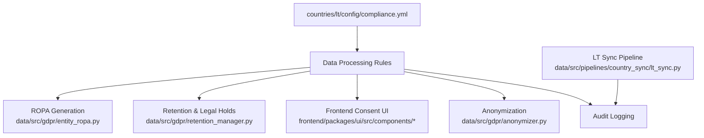
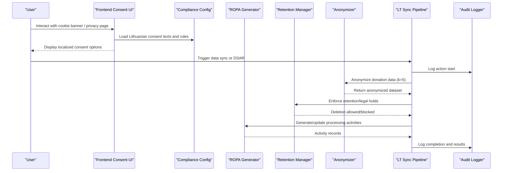
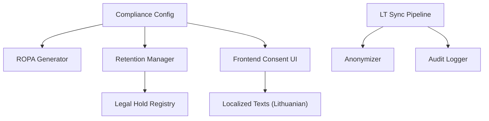

# Lithuania Compliance Requirements

<cite>
**Referenced Files in This Document**
- [compliance.yml](file://countries/lt/config/compliance.yml)
- [entity_ropa.py](file://data/src/gdpr/entity_ropa.py)
- [retention_manager.py](file://data/src/gdpr/retention_manager.py)
- [lt_sync.py](file://data/src/pipelines/country_sync/lt_sync.py)
- [cookie-consent-texts.ts](file://frontend/packages/ui/src/components/cookie-consent-texts.ts)
- [privacy-page.tsx](file://frontend/packages/ui/src/components/privacy-page.tsx)
- [consent-page.tsx](file://frontend/packages/ui/src/components/consent-page.tsx)
- [anonymizer.py](file://data/src/gdpr/anonymizer.py)
- [GDPR-checklist.md](file://docs/compliance/GDPR-checklist.md)
</cite>

## Table of Contents
1. Introduction
2. Project Structure
3. Core Components
4. Architecture Overview
5. Detailed Component Analysis
6. Dependency Analysis
7. Performance Considerations
8. Troubleshooting Guide
9. Conclusion
10. Appendices

## Introduction
This document provides comprehensive, code-backed guidance for Lithuania-specific GDPR compliance within the project. It covers:
- State Data Protection Inspectorate (VDATI) registration and contact details
- Lithuanian Law on Legal Protection of Personal Data implementation specifics
- Age of consent at 14 years and parental verification requirements
- Canonical records retention under Canon Law (permanent retention for sacramental records)
- Data transfer restrictions to non-EU countries (US, Russia, Belarus, China)
- Configuration examples for Lithuanian privacy notices and cookie consent banners in Lithuanian
- Religious organization exemptions and safeguards
- Breach notification procedures to VDATI within 72 hours
- Audit requirements including ISO 27001 and SOC 2 Type II standards
- Local regulatory engagement procedures

## Project Structure
Lithuania-specific compliance is primarily configured and enforced through:
- Country configuration file defining legal framework, DPA contacts, consent rules, retention periods, breach notifications, and data transfer policies
- ROPA generation and entity-specific processing activities tailored for religious entities
- Retention management with legal hold enforcement
- Frontend localization for Lithuanian language consent and privacy interfaces
- Anonymization utilities with country-specific k-anonymity thresholds
- Pipeline integration for Lithuanian parish data synchronization with audit logging

**Diagram sources**
- [compliance.yml:1-201](file://countries/lt/config/compliance.yml#L1-L201)
- [entity_ropa.py:39-797](file://data/src/gdpr/entity_ropa.py#L39-L797)
- [retention_manager.py:188-336](file://data/src/gdpr/retention_manager.py#L188-L336)
- [cookie-consent-texts.ts:33-57](file://frontend/packages/ui/src/components/cookie-consent-texts.ts#L33-L57)
- [anonymizer.py:27-63](file://data/src/gdpr/anonymizer.py#L27-L63)
- [lt_sync.py:48-207](file://data/src/pipelines/country_sync/lt_sync.py#L48-L207)

**Section sources**
- [compliance.yml:1-201](file://countries/lt/config/compliance.yml#L1-L201)
- [entity_ropa.py:39-797](file://data/src/gdpr/entity_ropa.py#L39-L797)
- [retention_manager.py:188-336](file://data/src/gdpr/retention_manager.py#L188-L336)
- [cookie-consent-texts.ts:33-57](file://frontend/packages/ui/src/components/cookie-consent-texts.ts#L33-L57)
- [anonymizer.py:27-63](file://data/src/gdpr/anonymizer.py#L27-L63)
- [lt_sync.py:48-207](file://data/src/pipelines/country_sync/lt_sync.py#L48-L207)

## Core Components
- VDATI Registration and Contact: The configuration includes the full name, English name, short form, website, email, and address for the State Data Protection Inspectorate (VDATI).
- National Legal Framework: References to the Lithuanian Law on Legal Protection of Personal Data and related public information law are defined.
- GDPR Implementation Specifics: Includes lawful basis settings, special categories handling for religious data, canonical exceptions for erasure, records of processing activities, and data transfer restrictions.
- Consent Requirements: Cookie consent language set to Lithuanian, with explicit opt-in for analytics and marketing; consent text templates provided in Lithuanian and English.
- Retention Periods: Permanent retention for sacramental records per Canon Law; specific retention periods for donations, financial records, funeral services, cemetery records, analytics, marketing, and consent records.
- Data Subject Rights: Access request deadlines, rectification limitations for canonical records, erasure exceptions, portability formats, and direct marketing opt-out.
- Breach Notification: Authority notification within 72 hours; data subject notification required for high-risk breaches; dedicated security contact.
- Children’s Data: Age of consent set to 14 years with parental verification methods.
- Religious Organizations: Canonical compliance references and Vatican guidelines included.
- Audit Requirements: Internal and external audits specified with ISO 27001 and SOC 2 Type II standards.

**Section sources**
- [compliance.yml:10-201](file://countries/lt/config/compliance.yml#L10-L201)

## Architecture Overview
The system enforces Lithuania-specific compliance via a layered architecture:
- Configuration Layer: Centralized compliance settings define legal basis, consent, retention, transfers, and breach procedures.
- Processing Layer: Entity-specific ROPA generation documents all processing activities, especially for religious entities, ensuring alignment with Canon Law and GDPR.
- Enforcement Layer: Retention manager applies deletion rules while respecting legal holds; anonymizer applies country-specific k-anonymity thresholds.
- Integration Layer: LT sync pipeline synchronizes parish data with audit logging and supports DSAR endpoints.
- Presentation Layer: Frontend components provide Lithuanian-language consent and privacy interfaces.

**Diagram sources**
- [cookie-consent-texts.ts:33-57](file://frontend/packages/ui/src/components/cookie-consent-texts.ts#L33-L57)
- [compliance.yml:117-169](file://countries/lt/config/compliance.yml#L117-L169)
- [entity_ropa.py:39-797](file://data/src/gdpr/entity_ropa.py#L39-L797)
- [retention_manager.py:188-336](file://data/src/gdpr/retention_manager.py#L188-L336)
- [anonymizer.py:27-63](file://data/src/gdpr/anonymizer.py#L27-L63)
- [lt_sync.py:72-207](file://data/src/pipelines/country_sync/lt_sync.py#L72-L207)

## Detailed Component Analysis

### VDATI Registration and Contact
- The configuration defines the Data Protection Authority (DPA) as Valstybinė duomenų apsaugos inspekcija (State Data Protection Inspectorate), with website and email for official communication.
- Use this contact for registration inquiries, reporting, and cooperation with the supervisory authority.

**Section sources**
- [compliance.yml:10-18](file://countries/lt/config/compliance.yml#L10-L18)

### Lithuanian Law on Legal Protection of Personal Data
- The national legal framework lists the Lithuanian Law on Legal Protection of Personal Data with reference number and effective date, alongside the Law on Public Information.
- These references anchor the system’s compliance posture to local statutory requirements.

**Section sources**
- [compliance.yml:19-30](file://countries/lt/config/compliance.yml#L19-L30)

### Age of Consent at 14 Years
- The configuration sets the minimum age for consent to 14 years and requires parental consent below that threshold.
- Parental verification methods include email confirmation and ID verification.
- The checklist confirms Lithuania’s age threshold and mandates age verification at registration.

**Section sources**
- [compliance.yml:31-45](file://countries/lt/config/compliance.yml#L31-L45)
- [compliance.yml:171-178](file://countries/lt/config/compliance.yml#L171-L178)
- [GDPR-checklist.md:238-257](file://docs/compliance/GDPR-checklist.md#L238-L257)

### Canonical Records Retention Under Canon Law
- Sacramental records (baptism, confirmation, marriage, death) are marked for permanent retention due to Canon Law requirements.
- The right to erasure explicitly excludes canonical records, referencing GDPR Article 17(3)(d).
- Entity-specific ROPA entries assign long-term retention periods for sacramental registers across Catholic entities.

**Section sources**
- [compliance.yml:64-74](file://countries/lt/config/compliance.yml#L64-L74)
- [compliance.yml:136-146](file://countries/lt/config/compliance.yml#L136-L146)
- [entity_ropa.py:105-165](file://data/src/gdpr/entity_ropa.py#L105-L165)
- [entity_ropa.py:342-403](file://data/src/gdpr/entity_ropa.py#L342-L403)

### Data Transfer Restrictions to Non-EU Countries
- Restricted destinations include US, Russia, Belarus, and China.
- Permitted destinations list EU member states plus Vatican City State.
- Transfers to restricted countries require additional safeguards per GDPR Article 44.

**Section sources**
- [compliance.yml:81-116](file://countries/lt/config/compliance.yml#L81-L116)

### Lithuanian Privacy Notices and Cookie Consent Banners
- Cookie consent banner language is set to Lithuanian, with explicit opt-ins for analytics and marketing.
- Consent text templates in Lithuanian are provided for both cookie banners and privacy notices.
- Frontend components localize consent pages and privacy pages into Lithuanian, enabling user interaction in the local language.

**Section sources**
- [compliance.yml:117-135](file://countries/lt/config/compliance.yml#L117-L135)
- [cookie-consent-texts.ts:33-57](file://frontend/packages/ui/src/components/cookie-consent-texts.ts#L33-L57)
- [privacy-page.tsx:65-101](file://frontend/packages/ui/src/components/privacy-page.tsx#L65-L101)
- [consent-page.tsx:135-173](file://frontend/packages/ui/src/components/consent-page.tsx#L135-L173)

### Religious Organization Exemptions and Safeguards
- Special category processing for religious data is explicitly permitted under Article 9(2)(d) with additional safeguards: Canon Law compliance verification, encryption at rest, access control, and immutable audit logging.
- Canonical references include relevant canons and Vatican guidelines.
- Entity-specific ROPA entries mark sensitive data flags and apply appropriate security measures for religious processing.

**Section sources**
- [compliance.yml:46-63](file://countries/lt/config/compliance.yml#L46-L63)
- [compliance.yml:179-191](file://countries/lt/config/compliance.yml#L179-L191)
- [entity_ropa.py:105-165](file://data/src/gdpr/entity_ropa.py#L105-L165)

### Breach Notification Procedures to VDATI Within 72 Hours
- Authority notification must occur within 72 hours of awareness.
- Data subject notification is required when high risk is identified.
- A dedicated security contact is provided for incident reporting.

**Section sources**
- [compliance.yml:163-169](file://countries/lt/config/compliance.yml#L163-L169)
- [GDPR-checklist.md:333-383](file://docs/compliance/GDPR-checklist.md#L333-L383)

### Audit Requirements: ISO 27001 and SOC 2 Type II
- External audits are required with specified frequencies and standards including ISO 27001 and SOC 2 Type II.
- Internal audit frequency is annual; external audits every two years.
- Checklist items verify vulnerability scanning, audit log integrity, change management, and availability controls aligned with SOC 2 criteria.

**Section sources**
- [compliance.yml:192-201](file://countries/lt/config/compliance.yml#L192-L201)
- [GDPR-checklist.md:712-753](file://docs/compliance/GDPR-checklist.md#L712-L753)

### Local Regulatory Engagement Procedures
- The configuration includes DPA contact details and legal framework references to facilitate cooperation with the supervisory authority.
- The checklist outlines cooperation expectations: responding promptly to inquiries, providing requested information, facilitating investigations, implementing corrective measures, and maintaining communication records.

**Section sources**
- [compliance.yml:10-30](file://countries/lt/config/compliance.yml#L10-L30)
- [GDPR-checklist.md:571-584](file://docs/compliance/GDPR-checklist.md#L571-L584)

## Dependency Analysis
Key dependencies and relationships:
- Compliance configuration drives ROPA generation, retention rules, and frontend consent behavior.
- Retention manager depends on legal hold registry to prevent unauthorized deletions.
- LT sync pipeline integrates anonymization and audit logging for Lithuanian parish data.
- Frontend components depend on localized consent texts and privacy notices for Lithuanian users.

**Diagram sources**
- [compliance.yml:1-201](file://countries/lt/config/compliance.yml#L1-L201)
- [entity_ropa.py:39-797](file://data/src/gdpr/entity_ropa.py#L39-L797)
- [retention_manager.py:188-336](file://data/src/gdpr/retention_manager.py#L188-L336)
- [lt_sync.py:72-207](file://data/src/pipelines/country_sync/lt_sync.py#L72-L207)
- [cookie-consent-texts.ts:33-57](file://frontend/packages/ui/src/components/cookie-consent-texts.ts#L33-L57)

**Section sources**
- [compliance.yml:1-201](file://countries/lt/config/compliance.yml#L1-L201)
- [entity_ropa.py:39-797](file://data/src/gdpr/entity_ropa.py#L39-L797)
- [retention_manager.py:188-336](file://data/src/gdpr/retention_manager.py#L188-L336)
- [lt_sync.py:72-207](file://data/src/pipelines/country_sync/lt_sync.py#L72-L207)
- [cookie-consent-texts.ts:33-57](file://frontend/packages/ui/src/components/cookie-consent-texts.ts#L33-L57)

## Performance Considerations
- K-anonymity threshold for Lithuania is set to k=5, balancing utility and privacy for aggregated analytics.
- Retention cleanup operations should be scheduled during low-traffic windows to minimize impact.
- Audit logging adds overhead; ensure efficient log rotation and storage policies.
- Frontend localization increases payload size slightly; cache localized assets where possible.

[No sources needed since this section provides general guidance]

## Troubleshooting Guide
Common issues and resolutions:
- Consent not captured correctly: Verify frontend localization and consent versioning; check that cookie banner displays in Lithuanian and captures explicit opt-ins.
- Deletion blocked unexpectedly: Check legal hold registry for active holds; review reasons and lift holds only when legally permissible.
- Data transfer failures to restricted countries: Confirm destination is not in restricted list; implement SCCs and supplementary measures if necessary.
- Audit gaps: Ensure CI/CD pipelines include compliance checks; validate hash chain integrity and HMAC signatures for audit logs.

**Section sources**
- [retention_manager.py:109-186](file://data/src/gdpr/retention_manager.py#L109-L186)
- [compliance.yml:81-116](file://countries/lt/config/compliance.yml#L81-L116)
- [GDPR-checklist.md:712-753](file://docs/compliance/GDPR-checklist.md#L712-L753)

## Conclusion
The repository implements robust Lithuania-specific GDPR compliance through centralized configuration, entity-specific ROPA generation, strict retention and legal hold enforcement, localized consent interfaces, and clear breach notification procedures. Religious organizations benefit from canonical exemptions with enhanced safeguards, while data transfers to restricted jurisdictions are controlled. Audit requirements align with ISO 27001 and SOC 2 Type II standards, ensuring continuous compliance and accountability.

[No sources needed since this section summarizes without analyzing specific files]

## Appendices

### Appendix A: Key Configuration Paths
- Country compliance configuration: [compliance.yml](file://countries/lt/config/compliance.yml)
- ROPA generator and entity activities: [entity_ropa.py](file://data/src/gdpr/entity_ropa.py)
- Retention and legal holds: [retention_manager.py](file://data/src/gdpr/retention_manager.py)
- LT sync pipeline: [lt_sync.py](file://data/src/pipelines/country_sync/lt_sync.py)
- Frontend consent localization: [cookie-consent-texts.ts](file://frontend/packages/ui/src/components/cookie-consent-texts.ts), [privacy-page.tsx](file://frontend/packages/ui/src/components/privacy-page.tsx), [consent-page.tsx](file://frontend/packages/ui/src/components/consent-page.tsx)
- Anonymization utilities: [anonymizer.py](file://data/src/gdpr/anonymizer.py)
- Compliance checklist: [GDPR-checklist.md](file://docs/compliance/GDPR-checklist.md)

[No sources needed since this section lists paths without analyzing specific files]