# Access and Data Portability

<cite>
**Referenced Files in This Document**
- [dsar_service.py](file://data/src/dsar_service.py)
- [processors.py](file://data/src/processors.py)
- [audit.py](file://data/src/audit.py)
- [dsr_service.py](file://backend/django/apps/core/dsr_service.py)
- [models.py](file://backend/django/apps/core/models.py)
- [bitrix24_service.py](file://backend/django/apps/crm/bitrix24_service.py)
- [serializers.py](file://backend/django/apps/crm/api/serializers.py)
- [tasks.py](file://backend/django/apps/integrations/tasks.py)
- [utils.py](file://data/src/utils.py)
- [GDPR-checklist.md](file://docs/compliance/GDPR-checklist.md)
</cite>

## Table of Contents
1. Introduction
2. Project Structure
3. Core Components
4. Architecture Overview
5. Detailed Component Analysis
6. Dependency Analysis
7. Performance Considerations
8. Troubleshooting Guide
9. Conclusion

## Introduction
This document explains how JOL-HUB implements automated data access and portability rights handling for GDPR Articles 15 (Right to Access) and 20 (Right to Data Portability). It covers identity verification workflows, cross-system data aggregation, response generation within statutory timeframes, secure export formats (JSON, CSV), integration with Bitrix24 CRM, audit trail maintenance, and exception handling for legal obligations and legitimate interests overrides.

## Project Structure
JOL-HUB separates DSAR processing into:
- A Python-based DSAR service that orchestrates processors and audit logging
- A Django application layer that manages request lifecycle, deadlines, and persistence
- An integration layer for Bitrix24 CRM synchronization
- A robust audit subsystem with tamper-evident chains

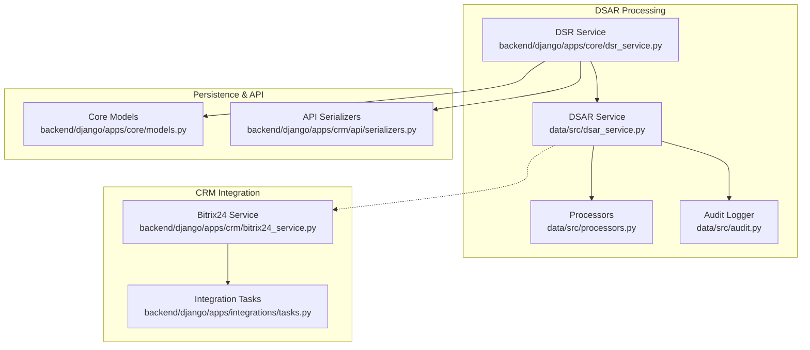

**Diagram sources**
- [dsr_service.py:130-156](file://backend/django/apps/core/dsr_service.py#L130-L156)
- [dsar_service.py:88-157](file://data/src/dsar_service.py#L88-L157)
- [processors.py:223-379](file://data/src/processors.py#L223-L379)
- [audit.py:205-369](file://data/src/audit.py#L205-L369)
- [bitrix24_service.py:238-364](file://backend/django/apps/crm/bitrix24_service.py#L238-L364)
- [tasks.py:367-388](file://backend/django/apps/integrations/tasks.py#L367-L388)
- [models.py:67-155](file://backend/django/apps/core/models.py#L67-L155)
- [serializers.py:288-326](file://backend/django/apps/crm/api/serializers.py#L288-L326)

**Section sources**
- [dsr_service.py:130-156](file://backend/django/apps/core/dsr_service.py#L130-L156)
- [dsar_service.py:88-157](file://data/src/dsar_service.py#L88-L157)
- [processors.py:223-379](file://data/src/processors.py#L223-L379)
- [audit.py:205-369](file://data/src/audit.py#L205-L369)
- [bitrix24_service.py:238-364](file://backend/django/apps/crm/bitrix24_service.py#L238-L364)
- [tasks.py:367-388](file://backend/django/apps/integrations/tasks.py#L367-L388)
- [models.py:67-155](file://backend/django/apps/core/models.py#L67-L155)
- [serializers.py:288-326](file://backend/django/apps/crm/api/serializers.py#L288-L326)

## Core Components
- DSARService: Orchestrates data collection across processors, enforces GDPR Art. 15/20, and writes comprehensive audit events.
- Processors: Implement per-domain data retrieval and deletion (user data, donations) with retention-aware logic.
- Django DSR Service: Manages request creation, deadlines (30 days), status transitions, and persistence via AuditLog.
- Audit Logger: Provides tamper-evident, hash-chained logs with HMAC signatures and chain verification.
- Bitrix24 Integration: Syncs contacts and deals with circuit breaker protection and audit entries.
- API Serializers: Define request/response schemas for DSR and data exports, including format selection.

**Section sources**
- [dsar_service.py:59-157](file://data/src/dsar_service.py#L59-L157)
- [processors.py:94-220](file://data/src/processors.py#L94-L220)
- [dsr_service.py:36-156](file://backend/django/apps/core/dsr_service.py#L36-L156)
- [audit.py:205-369](file://data/src/audit.py#L205-L369)
- [bitrix24_service.py:238-364](file://backend/django/apps/crm/bitrix24_service.py#L238-L364)
- [serializers.py:288-326](file://backend/django/apps/crm/api/serializers.py#L288-L326)

## Architecture Overview
The system processes a DSAR by:
- Creating and tracking the request with deadlines
- Verifying identity through stored verification documents and tenant context
- Aggregating data from internal systems and external CRM (Bitrix24)
- Generating machine-readable exports (JSON/CSV)
- Maintaining an immutable audit trail

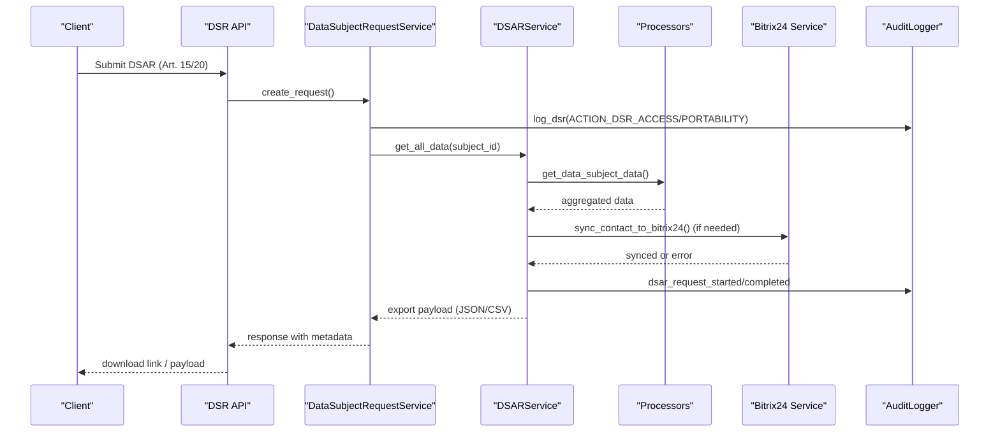

**Diagram sources**
- [dsr_service.py:81-156](file://backend/django/apps/core/dsr_service.py#L81-L156)
- [dsar_service.py:88-157](file://data/src/dsar_service.py#L88-L157)
- [processors.py:282-379](file://data/src/processors.py#L282-L379)
- [bitrix24_service.py:302-364](file://backend/django/apps/crm/bitrix24_service.py#L302-L364)
- [audit.py:330-369](file://data/src/audit.py#L330-L369)

## Detailed Component Analysis

### DSAR Service (Python)
- Coordinates data retrieval across processors and writes audit events at start and completion.
- Supports erasure with retention exemptions and dry-run mode.
- Exports to JSON for portability.

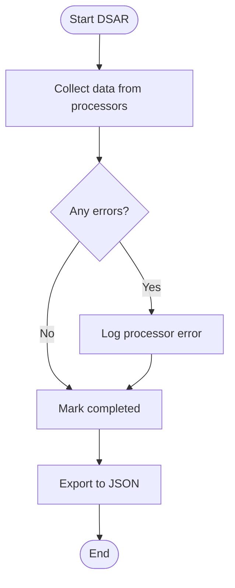

**Diagram sources**
- [dsar_service.py:88-157](file://data/src/dsar_service.py#L88-L157)
- [dsar_service.py:269-289](file://data/src/dsar_service.py#L269-L289)

**Section sources**
- [dsar_service.py:88-157](file://data/src/dsar_service.py#L88-L157)
- [dsar_service.py:159-267](file://data/src/dsar_service.py#L159-L267)
- [dsar_service.py:269-289](file://data/src/dsar_service.py#L269-L289)

### Processors (User and Donation)
- UserdataProcessor retrieves profile and organization memberships; supports deletion with soft-delete and PII redaction.
- DonationProcessor retrieves donation history; supports deletion with 7-year financial retention rules and anonymization of retained records.

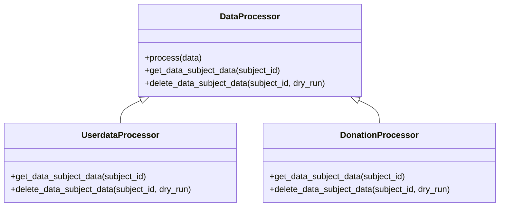

**Diagram sources**
- [processors.py:94-220](file://data/src/processors.py#L94-L220)
- [processors.py:506-762](file://data/src/processors.py#L506-L762)
- [processors.py:223-504](file://data/src/processors.py#L223-L504)

**Section sources**
- [processors.py:282-379](file://data/src/processors.py#L282-L379)
- [processors.py:381-504](file://data/src/processors.py#L381-L504)
- [processors.py:570-762](file://data/src/processors.py#L570-L762)

### Django DSR Service
- Creates requests with deadlines (30 days), tracks statuses, and logs all actions via AuditLog.
- Implements processing methods for access, rectification, erasure, restriction, portability, and objection.
- Enforces exceptions for legal holds and canonical record requirements.

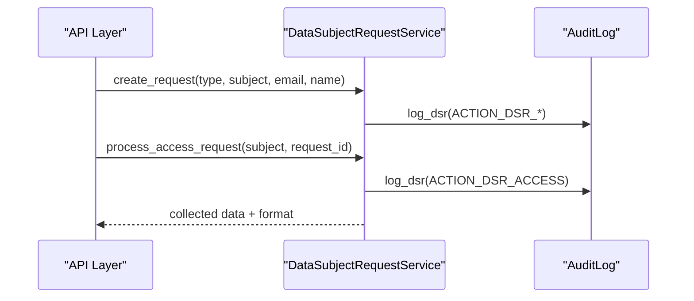

**Diagram sources**
- [dsr_service.py:81-156](file://backend/django/apps/core/dsr_service.py#L81-L156)
- [models.py:67-155](file://backend/django/apps/core/models.py#L67-L155)

**Section sources**
- [dsr_service.py:81-156](file://backend/django/apps/core/dsr_service.py#L81-L156)
- [dsr_service.py:194-252](file://backend/django/apps/core/dsr_service.py#L194-L252)
- [dsr_service.py:282-314](file://backend/django/apps/core/dsr_service.py#L282-L314)
- [models.py:67-155](file://backend/django/apps/core/models.py#L67-L155)

### Audit Logging
- Tamper-evident chain with sequence numbers, prev_hash, event_hash, and HMAC signature.
- Append-only daily logs with chain state persistence.
- Query and verification utilities for compliance reporting.

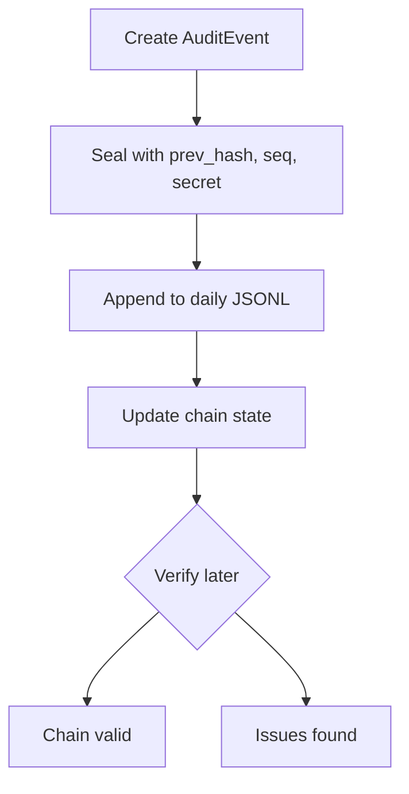

**Diagram sources**
- [audit.py:134-189](file://data/src/audit.py#L134-L189)
- [audit.py:330-369](file://data/src/audit.py#L330-L369)
- [audit.py:513-589](file://data/src/audit.py#L513-L589)

**Section sources**
- [audit.py:205-369](file://data/src/audit.py#L205-L369)
- [audit.py:475-511](file://data/src/audit.py#L475-L511)
- [audit.py:513-589](file://data/src/audit.py#L513-L589)

### Bitrix24 CRM Integration
- Tenant-aware client factory with caching and circuit breaker.
- Synchronizes contacts and deals with mapping to Bitrix24 fields.
- Records audit entries for each sync operation and handles rate limits/auth errors.

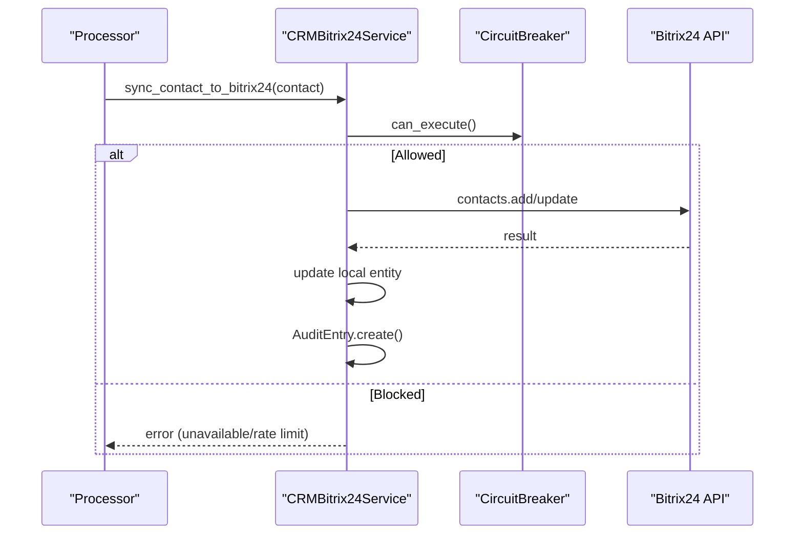

**Diagram sources**
- [bitrix24_service.py:109-236](file://backend/django/apps/crm/bitrix24_service.py#L109-L236)
- [bitrix24_service.py:302-364](file://backend/django/apps/crm/bitrix24_service.py#L302-L364)

**Section sources**
- [bitrix24_service.py:238-364](file://backend/django/apps/crm/bitrix24_service.py#L238-L364)
- [bitrix24_service.py:395-468](file://backend/django/apps/crm/bitrix24_service.py#L395-L468)
- [tasks.py:367-388](file://backend/django/apps/integrations/tasks.py#L367-L388)

### Data Export Functionality
- DSARService provides JSON export for portability.
- Django serializers support JSON and CSV formats for exports.
- Utility function templates export structure for Art. 20 compliance.

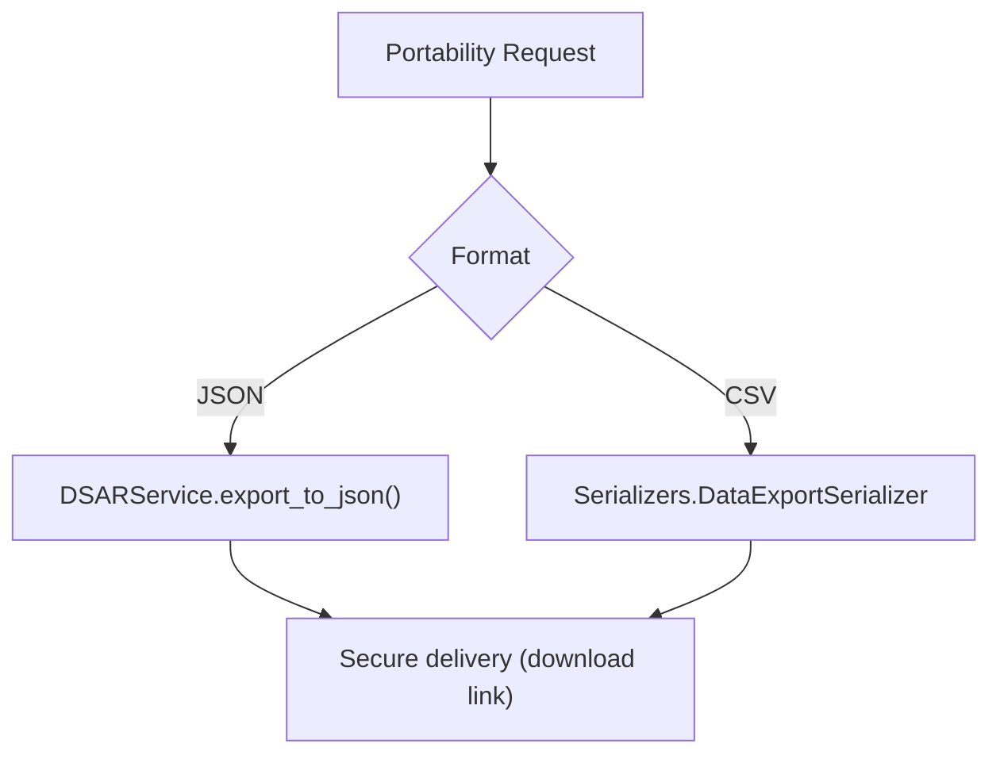

**Diagram sources**
- [dsar_service.py:269-289](file://data/src/dsar_service.py#L269-L289)
- [serializers.py:320-326](file://backend/django/apps/crm/api/serializers.py#L320-L326)
- [utils.py:105-130](file://data/src/utils.py#L105-L130)

**Section sources**
- [dsar_service.py:269-289](file://data/src/dsar_service.py#L269-L289)
- [serializers.py:320-326](file://backend/django/apps/crm/api/serializers.py#L320-L326)
- [utils.py:105-130](file://data/src/utils.py#L105-L130)

### Identity Verification Workflow
- Requests include requester identity fields and optional verification documents.
- Django models store verification_document and due dates; API serializers expose these fields.
- The checklist mandates identity verification procedures and acknowledgment timelines.

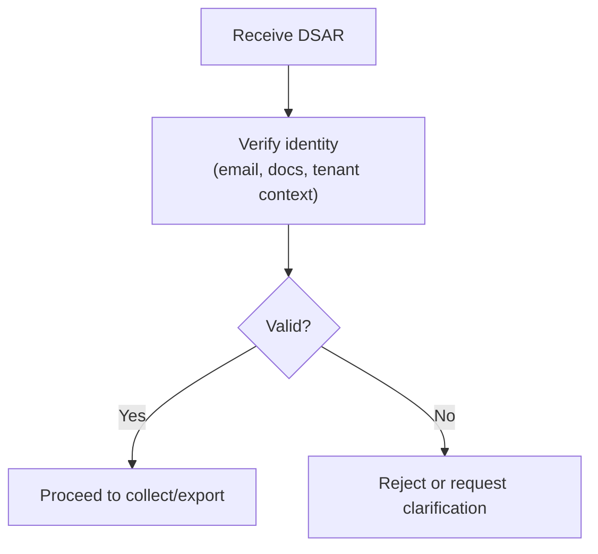

**Diagram sources**
- [serializers.py:288-317](file://backend/django/apps/crm/api/serializers.py#L288-L317)
- [models.py:1009-1055](file://backend/django/apps/crm/models.py#L1009-L1055)
- [GDPR-checklist.md:96-132](file://docs/compliance/GDPR-checklist.md#L96-L132)

**Section sources**
- [serializers.py:288-317](file://backend/django/apps/crm/api/serializers.py#L288-L317)
- [models.py:1009-1055](file://backend/django/apps/crm/models.py#L1009-L1055)
- [GDPR-checklist.md:96-132](file://docs/compliance/GDPR-checklist.md#L96-L132)

### Exception Handling and Overrides
- Erasure respects legal holds and canonical record requirements; raises specific exceptions when erasure cannot proceed.
- Retention exemptions are tracked per category (e.g., financial records retained for 7 years).
- Circuit breaker protects against Bitrix24 outages and rate limits.

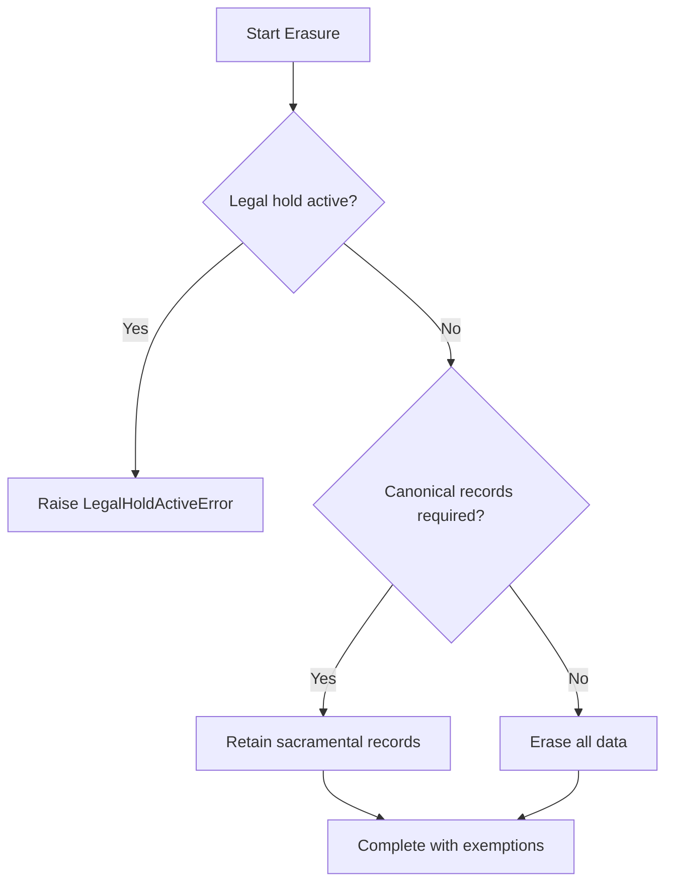

**Diagram sources**
- [dsr_service.py:194-252](file://backend/django/apps/core/dsr_service.py#L194-L252)
- [processors.py:381-504](file://data/src/processors.py#L381-L504)
- [bitrix24_service.py:366-393](file://backend/django/apps/crm/bitrix24_service.py#L366-L393)

**Section sources**
- [dsr_service.py:194-252](file://backend/django/apps/core/dsr_service.py#L194-L252)
- [processors.py:381-504](file://data/src/processors.py#L381-L504)
- [bitrix24_service.py:366-393](file://backend/django/apps/crm/bitrix24_service.py#L366-L393)

## Dependency Analysis
- DSARService depends on Processors and AuditLogger for data retrieval and compliance logging.
- Django DSR Service persists requests and actions via AuditLog model and exposes APIs through serializers.
- Bitrix24 integration is isolated behind a service with circuit breaker and tenant context.

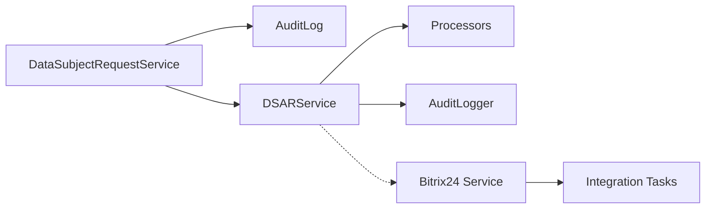

**Diagram sources**
- [dsr_service.py:81-156](file://backend/django/apps/core/dsr_service.py#L81-L156)
- [dsar_service.py:88-157](file://data/src/dsar_service.py#L88-L157)
- [bitrix24_service.py:238-364](file://backend/django/apps/crm/bitrix24_service.py#L238-L364)
- [tasks.py:367-388](file://backend/django/apps/integrations/tasks.py#L367-L388)

**Section sources**
- [dsr_service.py:81-156](file://backend/django/apps/core/dsr_service.py#L81-L156)
- [dsar_service.py:88-157](file://data/src/dsar_service.py#L88-L157)
- [bitrix24_service.py:238-364](file://backend/django/apps/crm/bitrix24_service.py#L238-L364)
- [tasks.py:367-388](file://backend/django/apps/integrations/tasks.py#L367-L388)

## Performance Considerations
- Use batched queries in processors to minimize database round-trips.
- Cache Bitrix24 client configurations per tenant to reduce overhead.
- Employ circuit breaker to avoid cascading failures during external API issues.
- Ensure audit logs are append-only with daily rotation to maintain performance and integrity.

[No sources needed since this section provides general guidance]

## Troubleshooting Guide
- If DSAR processing fails, check processor-specific errors and ensure database connectivity.
- For Bitrix24 sync failures, inspect circuit breaker state and retry after timeout; verify authentication and rate limits.
- Validate audit chain integrity using verification utilities to detect tampering or gaps.
- Confirm identity verification steps were completed before proceeding with sensitive operations.

**Section sources**
- [processors.py:368-379](file://data/src/processors.py#L368-L379)
- [bitrix24_service.py:366-393](file://backend/django/apps/crm/bitrix24_service.py#L366-L393)
- [audit.py:513-589](file://data/src/audit.py#L513-L589)

## Conclusion
JOL-HUB provides a robust, auditable implementation of GDPR Articles 15 and 20. It centralizes DSAR orchestration, enforces statutory deadlines, supports machine-readable exports, integrates securely with Bitrix24 CRM, and maintains tamper-evident audit trails. Exception handling ensures compliance with legal obligations and retention policies while preserving operational resilience.