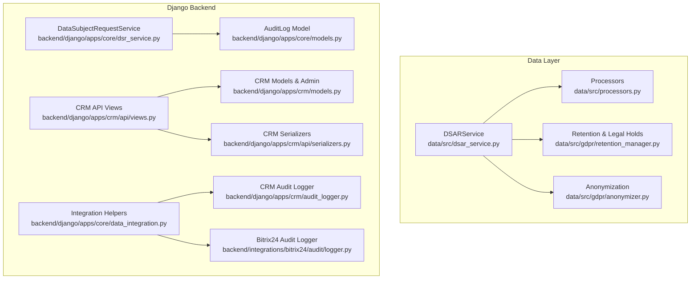
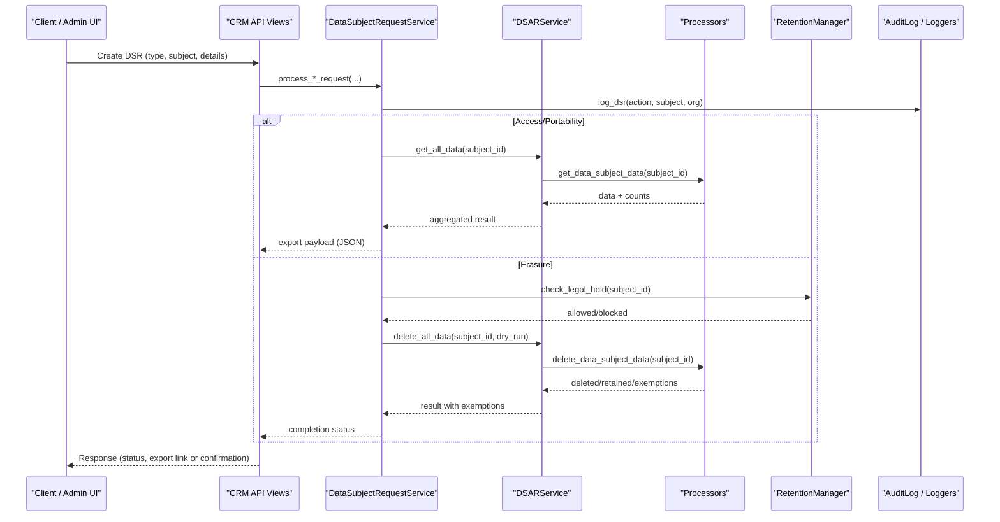
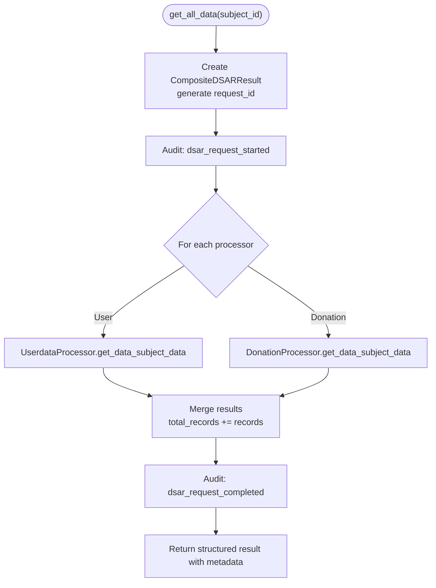
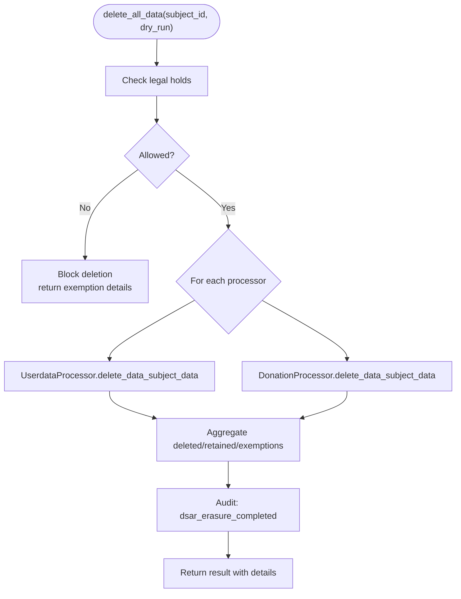
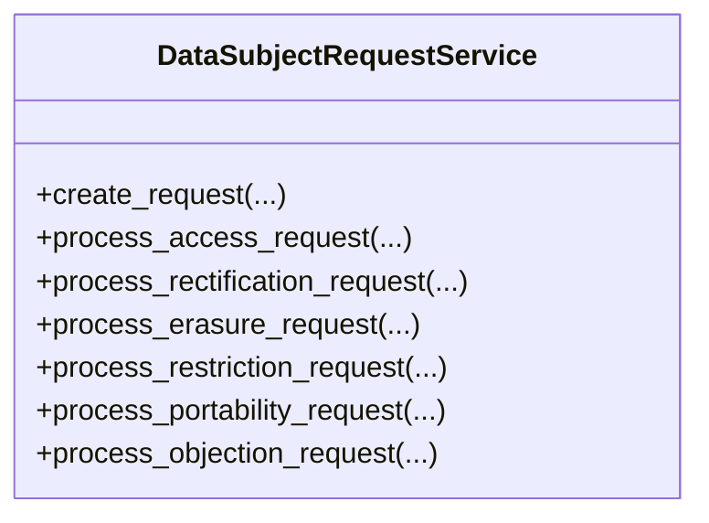
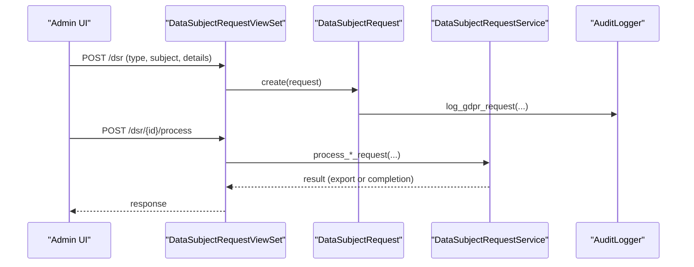
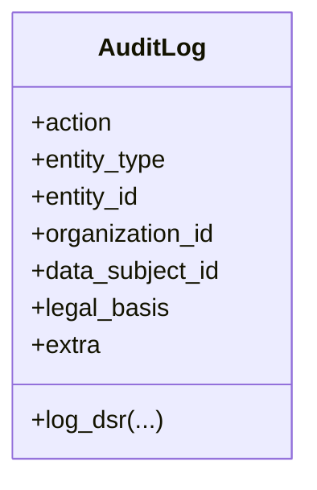
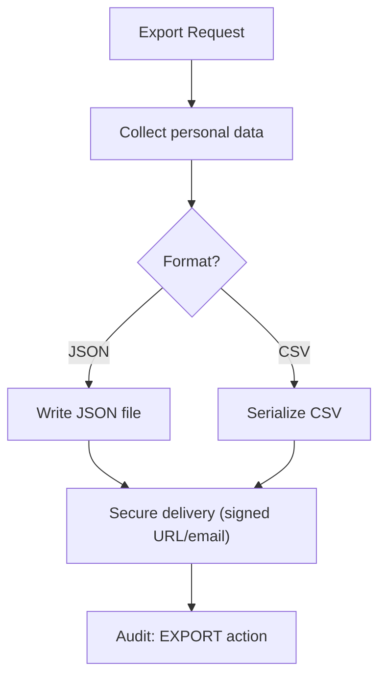
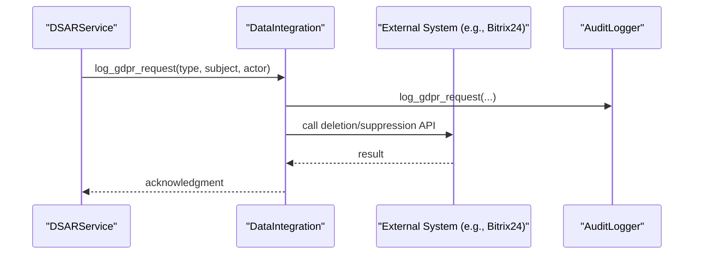
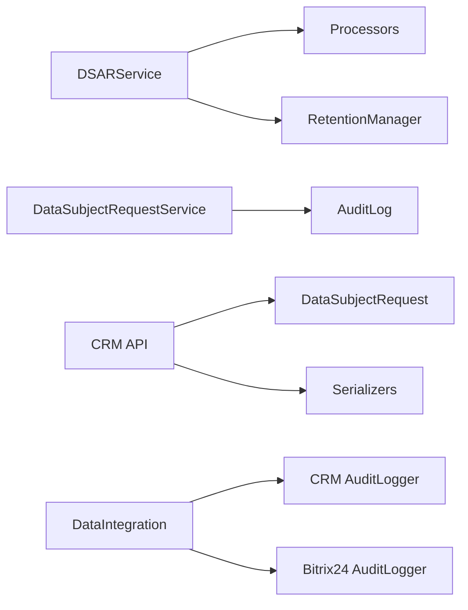

# Data Subject Rights Automation

<cite>
**Referenced Files in This Document**
- [dsar_service.py](file://data/src/dsar_service.py)
- [processors.py](file://data/src/processors.py)
- [anonymizer.py](file://data/src/gdpr/anonymizer.py)
- [retention_manager.py](file://data/src/gdpr/retention_manager.py)
- [models.py](file://backend/django/apps/core/models.py)
- [dsr_service.py](file://backend/django/apps/core/dsr_service.py)
- [models.py (CRM)](file://backend/django/apps/crm/models.py)
- [views.py (CRM API)](file://backend/django/apps/crm/api/views.py)
- [serializers.py (CRM API)](file://backend/django/apps/crm/api/serializers.py)
- [data_integration.py](file://backend/django/apps/core/data_integration.py)
- [audit_logger.py (CRM)](file://backend/django/apps/crm/audit_logger.py)
- [logger.py (Bitrix24 Audit)](file://backend/integrations/bitrix24/audit/logger.py)
- [utils.py](file://data/src/utils.py)
</cite>

## Table of Contents
1. Introduction
2. Project Structure
3. Core Components
4. Architecture Overview
5. Detailed Component Analysis
6. Dependency Analysis
7. Performance Considerations
8. Troubleshooting Guide
9. Conclusion
10. Appendices

## Introduction
This document explains the automated data subject rights handling implemented in JOL-HUB for GDPR Articles 15–22. It covers:
- Right to access, rectification, erasure, restriction, portability, and objection
- Automated request processing workflows with identity verification and response generation within statutory timeframes
- Erasure automation including soft delete, cascade deletion, retention exemptions, and third-party deletion calls
- Data export functionality in machine-readable formats with secure delivery
- Practical examples for DSAR automation, external integrations, and audit trail maintenance
- Exception handling for legal obligations, public interest processing, and legitimate interests overrides

## Project Structure
The DSAR implementation spans two layers:
- Python data layer (data/src): orchestrates DSAR requests across processors, enforces retention rules, and exports data
- Django backend (backend/django/apps): models and services for DSR lifecycle, CRM integration, and audit logging

**Diagram sources**
- [dsar_service.py:59-157](file://data/src/dsar_service.py#L59-L157)
- [processors.py:94-220](file://data/src/processors.py#L94-L220)
- [retention_manager.py:188-226](file://data/src/gdpr/retention_manager.py#L188-L226)
- [anonymizer.py:106-180](file://data/src/gdpr/anonymizer.py#L106-L180)
- [dsr_service.py:36-156](file://backend/django/apps/core/dsr_service.py#L36-L156)
- [models.py:67-227](file://backend/django/apps/core/models.py#L67-L227)
- [models.py (CRM):973-1134](file://backend/django/apps/crm/models.py#L973-L1134)
- [views.py (CRM API):448-489](file://backend/django/apps/crm/api/views.py#L448-L489)
- [serializers.py (CRM API):288-326](file://backend/django/apps/crm/api/serializers.py#L288-L326)
- [data_integration.py:149-188](file://backend/django/apps/core/data_integration.py#L149-L188)
- [audit_logger.py (CRM):557-599](file://backend/django/apps/crm/audit_logger.py#L557-L599)
- [logger.py (Bitrix24 Audit):216-300](file://backend/integrations/bitrix24/audit/logger.py#L216-L300)

**Section sources**
- [dsar_service.py:59-157](file://data/src/dsar_service.py#L59-L157)
- [dsr_service.py:36-156](file://backend/django/apps/core/dsr_service.py#L36-L156)
- [models.py:67-227](file://backend/django/apps/core/models.py#L67-L227)
- [models.py (CRM):973-1134](file://backend/django/apps/crm/models.py#L973-L1134)
- [views.py (CRM API):448-489](file://backend/django/apps/crm/api/views.py#L448-L489)

## Core Components
- DSARService (data layer): Coordinates access and erasure across processors, generates portable JSON exports, and logs all actions.
- Processors (data layer): Implement per-domain access and erasure (user data, donations), applying retention rules and anonymization where required.
- DataSubjectRequestService (Django): Implements full lifecycle for Articles 15–22, including deadlines, exceptions, and audit logging.
- CRM DataSubjectRequest model: Tracks requests, due dates, responses, and completion events; integrates with admin and APIs.
- Audit infrastructure: Centralized immutable audit log and specialized loggers for CRM and Bitrix24 integrations.
- Retention and legal holds: Enforce storage limitation and block deletions when legally required.

**Section sources**
- [dsar_service.py:59-157](file://data/src/dsar_service.py#L59-L157)
- [processors.py:223-503](file://data/src/processors.py#L223-L503)
- [dsr_service.py:36-375](file://backend/django/apps/core/dsr_service.py#L36-L375)
- [models.py (CRM):973-1134](file://backend/django/apps/crm/models.py#L973-L1134)
- [models.py:67-227](file://backend/django/apps/core/models.py#L67-L227)
- [retention_manager.py:188-226](file://data/src/gdpr/retention_manager.py#L188-L226)

## Architecture Overview
End-to-end DSAR flow from request intake to fulfillment and audit:

**Diagram sources**
- [views.py (CRM API):448-489](file://backend/django/apps/crm/api/views.py#L448-L489)
- [dsr_service.py:130-347](file://backend/django/apps/core/dsr_service.py#L130-L347)
- [dsar_service.py:88-267](file://data/src/dsar_service.py#L88-L267)
- [processors.py:282-503](file://data/src/processors.py#L282-L503)
- [retention_manager.py:156-185](file://data/src/gdpr/retention_manager.py#L156-L185)
- [models.py:214-227](file://backend/django/apps/core/models.py#L214-L227)
- [audit_logger.py (CRM):557-599](file://backend/django/apps/crm/audit_logger.py#L557-L599)
- [logger.py (Bitrix24 Audit):216-300](file://backend/integrations/bitrix24/audit/logger.py#L216-L300)

## Detailed Component Analysis

### DSAR Service (Access and Portability)
- Aggregates personal data from multiple processors into a single portable JSON response.
- Logs start/completion events with request IDs, record counts, and durations.
- Provides convenience functions for direct access handling.

**Diagram sources**
- [dsar_service.py:88-157](file://data/src/dsar_service.py#L88-L157)
- [processors.py:570-666](file://data/src/processors.py#L570-L666)
- [processors.py:282-379](file://data/src/processors.py#L282-L379)

**Section sources**
- [dsar_service.py:88-157](file://data/src/dsar_service.py#L88-L157)
- [processors.py:570-666](file://data/src/processors.py#L570-L666)
- [processors.py:282-379](file://data/src/processors.py#L282-L379)

### Erasure Automation (Soft Delete, Cascade, Retention Exemptions)
- Checks legal holds before deletion.
- Applies domain-specific retention rules (e.g., financial records retained for 7 years).
- Performs soft deletes and anonymization while preserving necessary non-PII.
- Supports dry-run mode for safe validation.

**Diagram sources**
- [dsar_service.py:159-267](file://data/src/dsar_service.py#L159-L267)
- [processors.py:668-762](file://data/src/processors.py#L668-L762)
- [processors.py:381-503](file://data/src/processors.py#L381-L503)
- [retention_manager.py:156-185](file://data/src/gdpr/retention_manager.py#L156-L185)

**Section sources**
- [dsar_service.py:159-267](file://data/src/dsar_service.py#L159-L267)
- [processors.py:668-762](file://data/src/processors.py#L668-L762)
- [processors.py:381-503](file://data/src/processors.py#L381-L503)
- [retention_manager.py:156-185](file://data/src/gdpr/retention_manager.py#L156-L185)

### Django DSR Service (Articles 15–22 Lifecycle)
- Manages request creation, deadlines (30 days), statuses, and extensions.
- Implements handlers for access, rectification, erasure, restriction, portability, and objection.
- Enforces exceptions for legal holds and canonical records.

**Diagram sources**
- [dsr_service.py:36-375](file://backend/django/apps/core/dsr_service.py#L36-L375)

**Section sources**
- [dsr_service.py:36-375](file://backend/django/apps/core/dsr_service.py#L36-L375)

### CRM Request Tracking and API
- DataSubjectRequest model stores request type, status, requester info, due date, and response data.
- API viewset exposes endpoints to create and process requests, enforcing tenant isolation and throttling.
- Serializers define fields for request and export payloads.

**Diagram sources**
- [models.py (CRM):973-1134](file://backend/django/apps/crm/models.py#L973-L1134)
- [views.py (CRM API):448-489](file://backend/django/apps/crm/api/views.py#L448-L489)
- [serializers.py (CRM API):288-326](file://backend/django/apps/crm/api/serializers.py#L288-L326)
- [audit_logger.py (CRM):557-599](file://backend/django/apps/crm/audit_logger.py#L557-L599)

**Section sources**
- [models.py (CRM):973-1134](file://backend/django/apps/crm/models.py#L973-L1134)
- [views.py (CRM API):448-489](file://backend/django/apps/crm/api/views.py#L448-L489)
- [serializers.py (CRM API):288-326](file://backend/django/apps/crm/api/serializers.py#L288-L326)
- [audit_logger.py (CRM):557-599](file://backend/django/apps/crm/audit_logger.py#L557-L599)

### Audit Trail Maintenance
- Immutable AuditLog model with tamper-evident checksums and tenant isolation checks.
- Specialized loggers for CRM and Bitrix24 capture GDPR request events and financial transactions.

**Diagram sources**
- [models.py:67-227](file://backend/django/apps/core/models.py#L67-L227)
- [audit_logger.py (CRM):557-599](file://backend/django/apps/crm/audit_logger.py#L557-L599)
- [logger.py (Bitrix24 Audit):216-300](file://backend/integrations/bitrix24/audit/logger.py#L216-L300)

**Section sources**
- [models.py:67-227](file://backend/django/apps/core/models.py#L67-L227)
- [audit_logger.py (CRM):557-599](file://backend/django/apps/crm/audit_logger.py#L557-L599)
- [logger.py (Bitrix24 Audit):216-300](file://backend/integrations/bitrix24/audit/logger.py#L216-L300)

### Data Export Functionality
- DSARService provides JSON export via export_to_json and utility generate_data_subject_export for broader datasets.
- CRM serializers support format selection (JSON/CSV) and inclusion toggles for contacts, deals, and audit logs.

**Diagram sources**
- [dsar_service.py:269-289](file://data/src/dsar_service.py#L269-L289)
- [utils.py:105-130](file://data/src/utils.py#L105-L130)
- [serializers.py (CRM API):320-326](file://backend/django/apps/crm/api/serializers.py#L320-L326)
- [models.py:73-123](file://backend/django/apps/core/models.py#L73-L123)

**Section sources**
- [dsar_service.py:269-289](file://data/src/dsar_service.py#L269-L289)
- [utils.py:105-130](file://data/src/utils.py#L105-L130)
- [serializers.py (CRM API):320-326](file://backend/django/apps/crm/api/serializers.py#L320-L326)
- [models.py:73-123](file://backend/django/apps/core/models.py#L73-L123)

### Third-Party Deletion Calls
- Integration helpers provide a mechanism to log GDPR requests and can be extended to call external systems (e.g., Bitrix24) for deletion or suppression.
- Bitrix24 audit logger supports logging data operations and GDPR requests for downstream compliance.

**Diagram sources**
- [data_integration.py:149-188](file://backend/django/apps/core/data_integration.py#L149-L188)
- [data_integration.py:224-266](file://backend/django/apps/core/data_integration.py#L224-L266)
- [logger.py (Bitrix24 Audit):216-300](file://backend/integrations/bitrix24/audit/logger.py#L216-L300)

**Section sources**
- [data_integration.py:149-188](file://backend/django/apps/core/data_integration.py#L149-L188)
- [data_integration.py:224-266](file://backend/django/apps/core/data_integration.py#L224-L266)
- [logger.py (Bitrix24 Audit):216-300](file://backend/integrations/bitrix24/audit/logger.py#L216-L300)

### Identity Verification and Statutory Timeframes
- DSR creation includes identity_verified flag and due_date set to 30 days by default.
- Statuses track verifying, processing, completed, and rejected states.
- Extensions supported up to 60 days for complex cases.

**Section sources**
- [dsr_service.py:74-128](file://backend/django/apps/core/dsr_service.py#L74-L128)
- [models.py (CRM):1071-1082](file://backend/django/apps/crm/models.py#L1071-L1082)

### Exception Handling and Overrides
- Erasure respects legal holds and canonical records; raises specific errors when blocked.
- Retention manager blocks deletion when active holds exist and returns detailed hold information.
- Legitimate interests/public interest overrides are enforced at service level to prevent erasure where required.

**Section sources**
- [dsr_service.py:194-252](file://backend/django/apps/core/dsr_service.py#L194-L252)
- [retention_manager.py:109-185](file://data/src/gdpr/retention_manager.py#L109-L185)

## Dependency Analysis
Key dependencies and relationships:
- DSARService depends on processors for data retrieval and deletion.
- Django DSR service depends on AuditLog and Organization for context and enforcement.
- CRM API depends on DataSubjectRequest model and serializers for request management.
- Integration helpers depend on audit loggers for cross-system compliance.

**Diagram sources**
- [dsar_service.py:59-157](file://data/src/dsar_service.py#L59-L157)
- [processors.py:94-220](file://data/src/processors.py#L94-L220)
- [retention_manager.py:188-226](file://data/src/gdpr/retention_manager.py#L188-L226)
- [dsr_service.py:36-156](file://backend/django/apps/core/dsr_service.py#L36-L156)
- [models.py:67-227](file://backend/django/apps/core/models.py#L67-L227)
- [models.py (CRM):973-1134](file://backend/django/apps/crm/models.py#L973-L1134)
- [serializers.py (CRM API):288-326](file://backend/django/apps/crm/api/serializers.py#L288-L326)
- [data_integration.py:149-188](file://backend/django/apps/core/data_integration.py#L149-L188)
- [audit_logger.py (CRM):557-599](file://backend/django/apps/crm/audit_logger.py#L557-L599)
- [logger.py (Bitrix24 Audit):216-300](file://backend/integrations/bitrix24/audit/logger.py#L216-L300)

**Section sources**
- [dsar_service.py:59-157](file://data/src/dsar_service.py#L59-L157)
- [processors.py:94-220](file://data/src/processors.py#L94-L220)
- [retention_manager.py:188-226](file://data/src/gdpr/retention_manager.py#L188-L226)
- [dsr_service.py:36-156](file://backend/django/apps/core/dsr_service.py#L36-L156)
- [models.py:67-227](file://backend/django/apps/core/models.py#L67-L227)
- [models.py (CRM):973-1134](file://backend/django/apps/crm/models.py#L973-L1134)
- [serializers.py (CRM API):288-326](file://backend/django/apps/crm/api/serializers.py#L288-L326)
- [data_integration.py:149-188](file://backend/django/apps/core/data_integration.py#L149-L188)
- [audit_logger.py (CRM):557-599](file://backend/django/apps/crm/audit_logger.py#L557-L599)
- [logger.py (Bitrix24 Audit):216-300](file://backend/integrations/bitrix24/audit/logger.py#L216-L300)

## Performance Considerations
- Batch queries in processors reduce round trips; ensure indexes on donor_id, user_id, and organization_id.
- Use dry-run mode for large erasures to validate impact before committing changes.
- Limit exported datasets with filters (include_donations, include_activity) to control payload size.
- Offload heavy exports and deletions to background tasks if needed to meet SLAs.

[No sources needed since this section provides general guidance]

## Troubleshooting Guide
Common issues and resolutions:
- Active memberships block user erasure: remove or transfer memberships before deletion.
- Legal holds prevent erasure: resolve holds or wait until expiration; review hold details.
- Financial retention exemptions: donations within 7-year window are anonymized but retained; verify retention rules.
- Tenant isolation errors: ensure current tenant context matches organization_id for DSR and audit entries.

**Section sources**
- [processors.py:688-705](file://data/src/processors.py#L688-L705)
- [retention_manager.py:156-185](file://data/src/gdpr/retention_manager.py#L156-L185)
- [processors.py:401-452](file://data/src/processors.py#L401-L452)
- [models.py:172-204](file://backend/django/apps/core/models.py#L172-L204)

## Conclusion
JOL-HUB implements a robust, auditable, and compliant DSAR system covering Articles 15–22. The architecture separates orchestration (DSARService), domain processing (Processors), lifecycle management (DataSubjectRequestService), and tracking (CRM models and audit loggers). Retention and legal hold mechanisms ensure lawful handling of erasure requests, while flexible export utilities support portability. Integrations enable third-party deletions and maintain comprehensive audit trails.

[No sources needed since this section summarizes without analyzing specific files]

## Appendices

### Practical Examples
- Automated DSAR workflow:
  - Create DSR via CRM API with type and subject.
  - Service processes request, collects data, applies retention rules, and logs actions.
  - Export generated and delivered securely; completion recorded with audit entries.
- External system integration:
  - Use DataIntegration to log GDPR requests and call external APIs for deletion or suppression.
  - Ensure Bitrix24 audit logger captures operations for downstream compliance.

**Section sources**
- [views.py (CRM API):448-489](file://backend/django/apps/crm/api/views.py#L448-L489)
- [dsr_service.py:130-347](file://backend/django/apps/core/dsr_service.py#L130-L347)
- [data_integration.py:224-266](file://backend/django/apps/core/data_integration.py#L224-L266)
- [logger.py (Bitrix24 Audit):216-300](file://backend/integrations/bitrix24/audit/logger.py#L216-L300)