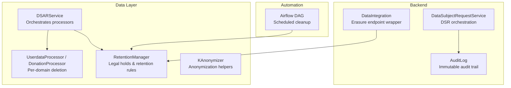
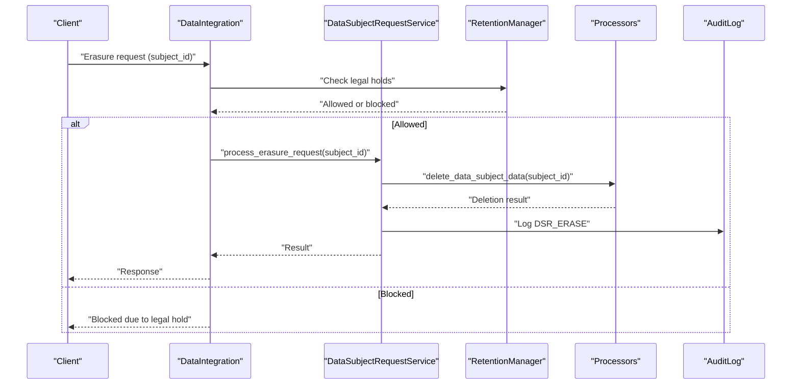
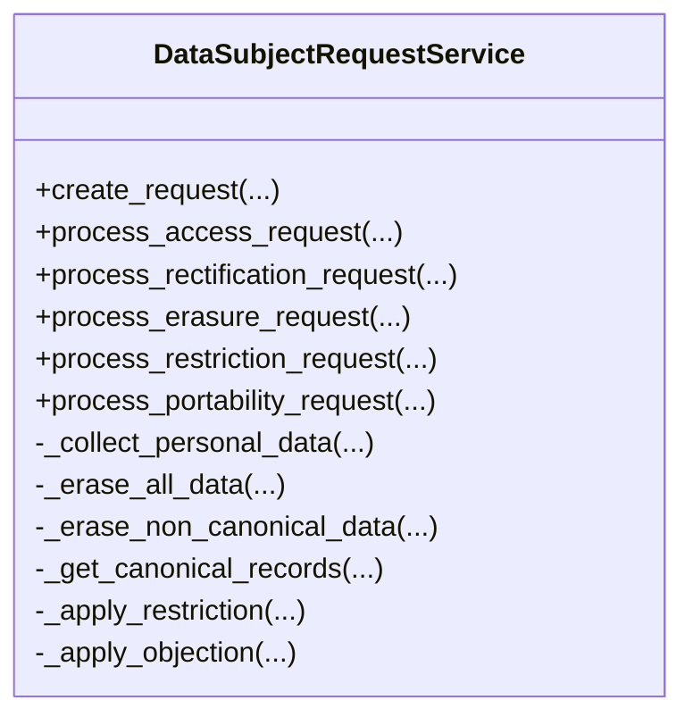
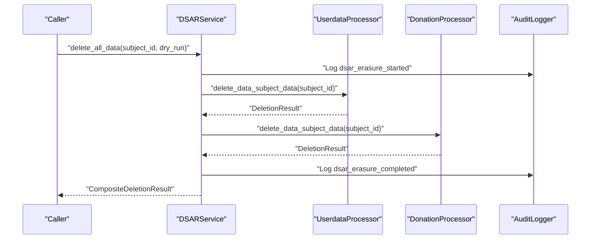
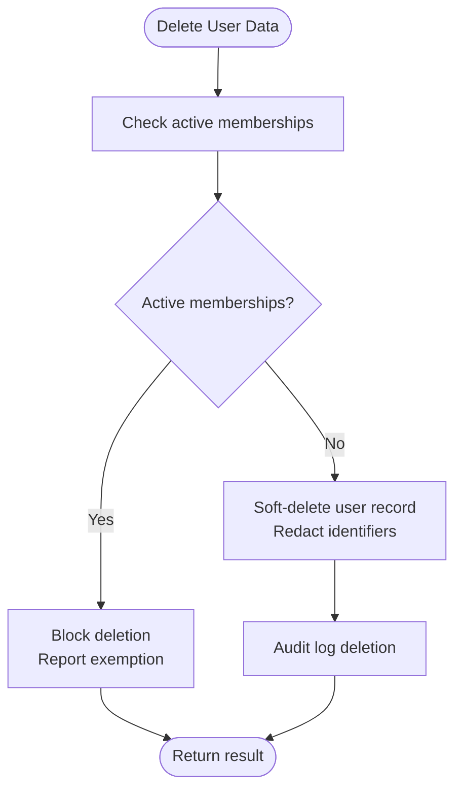
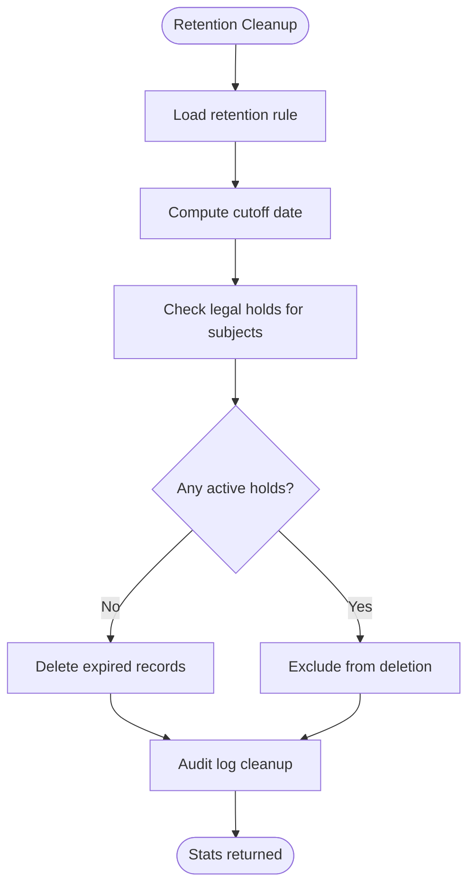
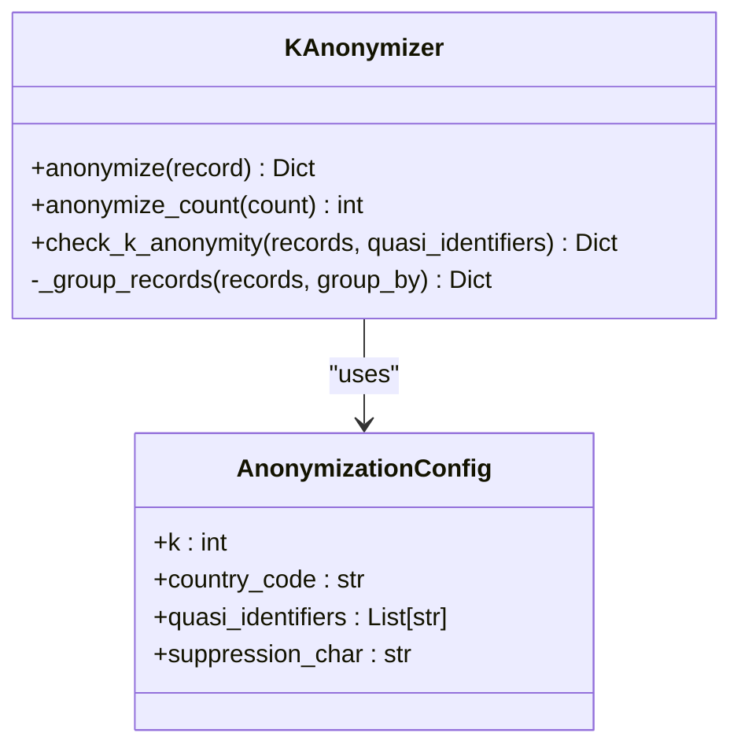
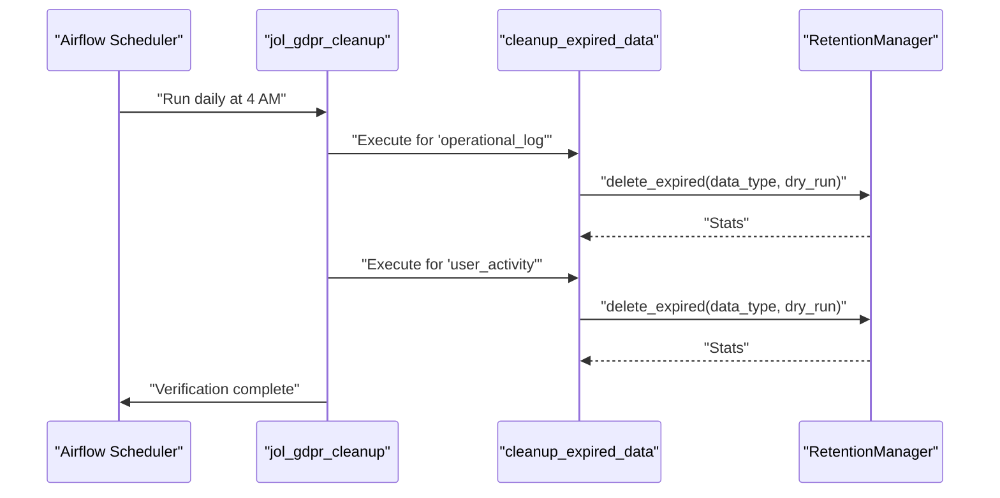
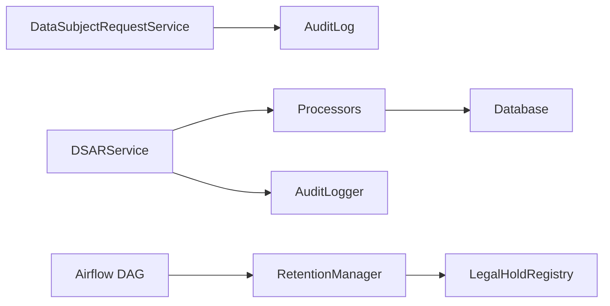

# Erasure and Restriction Processing

<cite>
**Referenced Files in This Document**
- [dsr_service.py](file://backend/django/apps/core/dsr_service.py)
- [data_integration.py](file://backend/django/apps/core/data_integration.py)
- [models.py](file://backend/django/apps/core/models.py)
- [dsar_service.py](file://data/src/dsar_service.py)
- [processors.py](file://data/src/processors.py)
- [retention_manager.py](file://data/src/gdpr/retention_manager.py)
- [anonymizer.py](file://data/src/gdpr/anonymizer.py)
- [jol_gdpr_cleanup.py](file://data/airflow/dags/jol_gdpr_cleanup.py)
</cite>

## Table of Contents
1. Introduction
2. Project Structure
3. Core Components
4. Architecture Overview
5. Detailed Component Analysis
6. Dependency Analysis
7. Performance Considerations
8. Troubleshooting Guide
9. Conclusion

## Introduction
This document explains the automated erasure and restriction processing capabilities implemented in the JOL-HUB platform to support GDPR Articles 17 (Right to Erasure) and 18 (Right to Restriction of Processing). It covers:
- Automated deletion workflows with soft delete, cascade handling for related data, retention rules, legal holds, and audit trails
- Restriction processing that temporarily suspends data usage while preserving integrity
- Practical DSAR workflow patterns for complex data relationships
- Exception handling for legal retention requirements, public interest, and legitimate interests overrides

The implementation spans a Django backend service layer, a Python-based DSAR orchestration service, retention management, anonymization utilities, and scheduled cleanup via Airflow.

## Project Structure
Key areas involved in erasure and restriction:
- Backend DSR service and integration endpoints
- Data processors for user and donation data
- Retention manager and legal hold registry
- Anonymization utilities for safe export or analysis
- Scheduled DAGs for periodic cleanup

**Diagram sources**
- [dsr_service.py:36-77](file://backend/django/apps/core/dsr_service.py#L36-L77)
- [data_integration.py:307-342](file://backend/django/apps/core/data_integration.py#L307-L342)
- [models.py:67-151](file://backend/django/apps/core/models.py#L67-L151)
- [dsar_service.py:59-86](file://data/src/dsar_service.py#L59-L86)
- [processors.py:668-761](file://data/src/processors.py#L668-L761)
- [retention_manager.py:188-226](file://data/src/gdpr/retention_manager.py#L188-L226)
- [anonymizer.py:106-143](file://data/src/gdpr/anonymizer.py#L106-L143)
- [jol_gdpr_cleanup.py:21-28](file://data/airflow/dags/jol_gdpr_cleanup.py#L21-L28)

**Section sources**
- [dsr_service.py:36-77](file://backend/django/apps/core/dsr_service.py#L36-L77)
- [data_integration.py:307-342](file://backend/django/apps/core/data_integration.py#L307-L342)
- [models.py:67-151](file://backend/django/apps/core/models.py#L67-L151)
- [dsar_service.py:59-86](file://data/src/dsar_service.py#L59-L86)
- [processors.py:668-761](file://data/src/processors.py#L668-L761)
- [retention_manager.py:188-226](file://data/src/gdpr/retention_manager.py#L188-L226)
- [anonymizer.py:106-143](file://data/src/gdpr/anonymizer.py#L106-L143)
- [jol_gdpr_cleanup.py:21-28](file://data/airflow/dags/jol_gdpr_cleanup.py#L21-L28)

## Core Components
- DataSubjectRequestService: Implements DSR lifecycle for Articles 15–22, including erasure and restriction flows with organization-level checks and canonical record handling.
- DSARService: Orchestrates cross-processor access and erasure requests, aggregates results, and maintains audit logs.
- Processors: Domain-specific handlers for retrieving and deleting subject data (e.g., user accounts), enforcing constraints like active memberships.
- RetentionManager and LegalHoldRegistry: Enforce storage limitation and block deletions when legal holds are active; provide pre-checks and reporting.
- KAnonymizer: Provides k-anonymity thresholds and anonymization utilities for safe exports or analytics.
- AuditLog: Immutable, tamper-evident audit trail capturing all DSR actions, consent changes, and legal hold events.

**Section sources**
- [dsr_service.py:36-77](file://backend/django/apps/core/dsr_service.py#L36-L77)
- [dsar_service.py:59-86](file://data/src/dsar_service.py#L59-L86)
- [processors.py:668-761](file://data/src/processors.py#L668-L761)
- [retention_manager.py:188-226](file://data/src/gdpr/retention_manager.py#L188-L226)
- [models.py:67-151](file://backend/django/apps/core/models.py#L67-L151)

## Architecture Overview
End-to-end flow for erasure and restriction:
- Requests enter via backend services or DSAR orchestrator
- Legal holds and retention rules are checked before any deletion
- Soft deletes and domain-specific cascades are applied
- All actions are recorded in an immutable audit log
- Scheduled jobs periodically purge expired data respecting legal holds

**Diagram sources**
- [data_integration.py:307-342](file://backend/django/apps/core/data_integration.py#L307-L342)
- [dsr_service.py:194-252](file://backend/django/apps/core/dsr_service.py#L194-L252)
- [retention_manager.py:257-317](file://data/src/gdpr/retention_manager.py#L257-L317)
- [processors.py:668-761](file://data/src/processors.py#L668-L761)
- [models.py:214-227](file://backend/django/apps/core/models.py#L214-L227)

## Detailed Component Analysis

### DataSubjectRequestService (Articles 17 and 18)
- Erasure (Art. 17): Validates legal holds and canonical records; performs selective erasure of non-canonical PII while retaining sacramental records where required; logs outcomes.
- Restriction (Art. 18): Applies a restriction marker to suspend processing while maintaining data integrity; logs the action with reason.
- Access and portability: Collects and exports personal data in machine-readable formats; logs completion.

**Diagram sources**
- [dsr_service.py:36-77](file://backend/django/apps/core/dsr_service.py#L36-L77)
- [dsr_service.py:194-252](file://backend/django/apps/core/dsr_service.py#L194-L252)
- [dsr_service.py:254-280](file://backend/django/apps/core/dsr_service.py#L254-L280)

**Section sources**
- [dsr_service.py:194-252](file://backend/django/apps/core/dsr_service.py#L194-L252)
- [dsr_service.py:254-280](file://backend/django/apps/core/dsr_service.py#L254-L280)

### DSARService Orchestration
- Aggregates per-processor results for access and erasure
- Supports dry-run mode for safe testing
- Tracks total deleted/retained counts and errors
- Exports JSON for portability

**Diagram sources**
- [dsar_service.py:159-267](file://data/src/dsar_service.py#L159-L267)
- [processors.py:668-761](file://data/src/processors.py#L668-L761)

**Section sources**
- [dsar_service.py:159-267](file://data/src/dsar_service.py#L159-L267)

### Processors: User Data Deletion
- Checks for active organization memberships; if present, blocks deletion and reports exemptions
- Performs soft delete on user account fields (marking deleted, inactive, redacting email/name)
- Audits each step and returns detailed results including retained records and errors

**Diagram sources**
- [processors.py:668-761](file://data/src/processors.py#L668-L761)

**Section sources**
- [processors.py:668-761](file://data/src/processors.py#L668-L761)

### Retention Manager and Legal Holds
- Centralized retention rules by data type with legal basis references
- LegalHoldRegistry prevents deletion when holds are active (litigation, investigation, audit, subpoena, law enforcement)
- Pre-checks ensure compliance before any deletion operation
- Dry-run support for planning and verification

**Diagram sources**
- [retention_manager.py:188-226](file://data/src/gdpr/retention_manager.py#L188-L226)
- [retention_manager.py:257-317](file://data/src/gdpr/retention_manager.py#L257-L317)

**Section sources**
- [retention_manager.py:188-226](file://data/src/gdpr/retention_manager.py#L188-L226)
- [retention_manager.py:257-317](file://data/src/gdpr/retention_manager.py#L257-L317)

### Anonymizer Utilities
- Country-specific k-anonymity thresholds
- Hashing direct identifiers for safe exports or analytics
- Grouping and checking k-anonymity compliance

**Diagram sources**
- [anonymizer.py:86-143](file://data/src/gdpr/anonymizer.py#L86-L143)

**Section sources**
- [anonymizer.py:86-143](file://data/src/gdpr/anonymizer.py#L86-L143)

### Airflow Scheduled Cleanup
- Daily DAG triggers retention-based cleanup for operational logs and user activity
- Uses RetentionManager to respect legal holds and retention rules
- Includes verification task post-cleanup

**Diagram sources**
- [jol_gdpr_cleanup.py:21-28](file://data/airflow/dags/jol_gdpr_cleanup.py#L21-L28)

**Section sources**
- [jol_gdpr_cleanup.py:21-28](file://data/airflow/dags/jol_gdpr_cleanup.py#L21-L28)

## Dependency Analysis
- DataSubjectRequestService depends on organization policies and canonical record handling; it logs DSR actions to AuditLog.
- DSARService composes multiple processors and relies on an audit logger for consistent tracking.
- RetentionManager integrates with LegalHoldRegistry to enforce legal holds across all deletion paths.
- Processors interact directly with database connections to perform soft deletes and constraint checks.
- Airflow DAGs depend on RetentionManager for batch operations.

**Diagram sources**
- [dsr_service.py:36-77](file://backend/django/apps/core/dsr_service.py#L36-L77)
- [dsar_service.py:59-86](file://data/src/dsar_service.py#L59-L86)
- [retention_manager.py:188-226](file://data/src/gdpr/retention_manager.py#L188-L226)
- [jol_gdpr_cleanup.py:21-28](file://data/airflow/dags/jol_gdpr_cleanup.py#L21-L28)

**Section sources**
- [dsr_service.py:36-77](file://backend/django/apps/core/dsr_service.py#L36-L77)
- [dsar_service.py:59-86](file://data/src/dsar_service.py#L59-L86)
- [retention_manager.py:188-226](file://data/src/gdpr/retention_manager.py#L188-L226)
- [jol_gdpr_cleanup.py:21-28](file://data/airflow/dags/jol_gdpr_cleanup.py#L21-L28)

## Performance Considerations
- Prefer soft deletes to preserve referential integrity and enable restoration when needed.
- Batch operations should be guarded by legal hold checks to avoid unnecessary work.
- Use dry-run modes extensively in DSAR and retention tasks to plan impact without side effects.
- Audit logging is append-only; ensure efficient indexing on key fields (entity_type, entity_id, data_subject_id, created_at).
- For large datasets, consider pagination in processor queries and asynchronous processing where feasible.

[No sources needed since this section provides general guidance]

## Troubleshooting Guide
Common issues and resolutions:
- Erasure blocked by legal hold: Review active legal holds and lift them when appropriate; verify litigation/investigation status.
- Active memberships preventing deletion: Transfer ownership or remove memberships before proceeding with erasure.
- Canonical records exception: Respect canonical record retention; use force flag only under explicit policy approval.
- Partial failures in DSAR: Inspect per-processor error lists and retry failed categories; ensure external dependencies are available.
- Audit integrity: Verify checksums on audit entries to detect tampering; recompute expected values using stored metadata.

**Section sources**
- [retention_manager.py:257-317](file://data/src/gdpr/retention_manager.py#L257-L317)
- [processors.py:668-761](file://data/src/processors.py#L668-L761)
- [dsr_service.py:194-252](file://backend/django/apps/core/dsr_service.py#L194-L252)
- [models.py:205-227](file://backend/django/apps/core/models.py#L205-L227)

## Conclusion
JOL-HUB implements robust, auditable mechanisms for GDPR Articles 17 and 18:
- Erasure workflows combine soft deletes, constraint checks, retention rules, and legal hold enforcement
- Restriction workflows pause processing while preserving data integrity
- Comprehensive audit trails and scheduled cleanup ensure ongoing compliance
- Extensible processor architecture supports complex data relationships and future integrations

[No sources needed since this section summarizes without analyzing specific files]