# Objection and Automated Decision-Making

<cite>
**Referenced Files in This Document**
- [dsr_service.py](file://backend/django/apps/core/dsr_service.py)
- [models.py](file://backend/django/apps/crm/models.py)
- [core_models.py](file://backend/django/apps/core/models.py)
- [audit_logger.py](file://backend/django/apps/crm/audit_logger.py)
- [data_integration.py](file://backend/django/apps/core/data_integration.py)
- [anonymizer.py](file://data/src/gdpr/anonymizer.py)
- [processors.py](file://data/src/processors.py)
- [client.py](file://backend/integrations/bitrix24/client.py)
- [api.ts](file://frontend/apps/admin-dashboard/src/lib/api.ts)
- [useAI.ts](file://frontend/apps/admin-dashboard/src/lib/hooks/useAI.ts)
- [GDPR-checklist.md](file://docs/compliance/GDPR-checklist.md)
</cite>

## Table of Contents
1. Introduction
2. Project Structure
3. Core Components
4. Architecture Overview
5. Detailed Component Analysis
6. Dependency Analysis
7. Performance Considerations
8. Troubleshooting Guide
9. Conclusion

## Introduction
This document explains how the JOL-HUB platform implements GDPR Articles 21 (Right to object) and 22 (Automated individual decision-making, including profiling) across its CRM, AI features, and integrations. It covers:
- Objection processing for direct marketing, legitimate interests, and public task processing
- Technical safeguards for automated decision-making with human intervention, meaningful information about logic, and a right to contest
- End-to-end workflows for identity verification, impact assessment, and response generation
- Practical examples for CRM systems, AI-powered features, and marketing automation tools
- Integration points with consent management and audit logging for compliance tracking

## Project Structure
The objection and automated decision-making capabilities are implemented across backend services, data processors, CRM models, and frontend hooks that expose review and override flows.

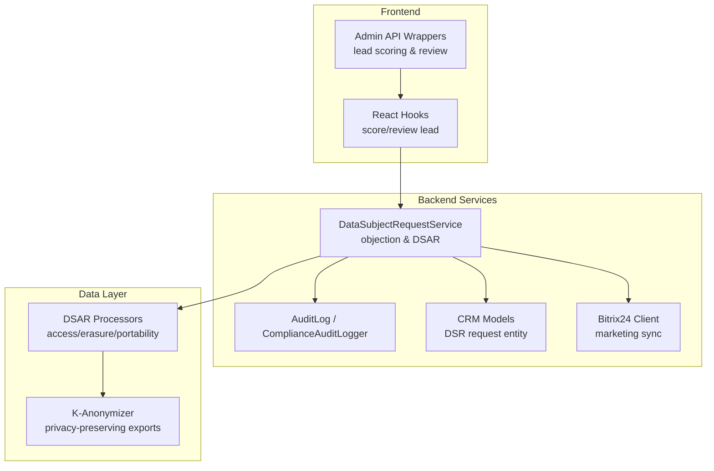

**Diagram sources**
- [dsr_service.py:316-347](file://backend/django/apps/core/dsr_service.py#L316-L347)
- [core_models.py:67-227](file://backend/django/apps/core/models.py#L67-L227)
- [models.py:1000-1134](file://backend/django/apps/crm/models.py#L1000-L1134)
- [audit_logger.py:548-585](file://backend/django/apps/crm/audit_logger.py#L548-L585)
- [processors.py:282-379](file://data/src/processors.py#L282-L379)
- [anonymizer.py:106-180](file://data/src/gdpr/anonymizer.py#L106-L180)
- [client.py:127-172](file://backend/integrations/bitrix24/client.py#L127-L172)
- [api.ts:418-445](file://frontend/apps/admin-dashboard/src/lib/api.ts#L418-L445)
- [useAI.ts:164-204](file://frontend/apps/admin-dashboard/src/lib/hooks/useAI.ts#L164-L204)

**Section sources**
- [dsr_service.py:316-347](file://backend/django/apps/core/dsr_service.py#L316-L347)
- [core_models.py:67-227](file://backend/django/apps/core/models.py#L67-L227)
- [models.py:1000-1134](file://backend/django/apps/crm/models.py#L1000-L1134)
- [audit_logger.py:548-585](file://backend/django/apps/crm/audit_logger.py#L548-L585)
- [processors.py:282-379](file://data/src/processors.py#L282-L379)
- [anonymizer.py:106-180](file://data/src/gdpr/anonymizer.py#L106-L180)
- [client.py:127-172](file://backend/integrations/bitrix24/client.py#L127-L172)
- [api.ts:418-445](file://frontend/apps/admin-dashboard/src/lib/api.ts#L418-L445)
- [useAI.ts:164-204](file://frontend/apps/admin-dashboard/src/lib/hooks/useAI.ts#L164-L204)

## Core Components
- DataSubjectRequestService: Centralizes GDPR rights handling including Article 21 objections and Articles 15/17/18/20 requests. It applies objections, logs actions, and returns standardized results.
- CRM DSR Request Model: Stores incoming requests with type, status, due dates, assignment, and responses; enforces tenant isolation and audit creation on completion.
- Audit Logging: Immutable, tamper-evident logs for all DSR activities, consent changes, and security events; includes legal basis and organization scoping.
- Data Processors: Implement access and erasure flows with retention rules and privacy-preserving exports.
- K-Anonymizer: Provides country-aware anonymization thresholds for safe reporting or export when needed.
- Bitrix24 Integration: Exposes marketing-related APIs and audit logger for synchronization and compliance.
- Frontend AI Controls: Provide human-in-the-loop controls for AI-driven lead scoring, including review and override.

**Section sources**
- [dsr_service.py:36-76](file://backend/django/apps/core/dsr_service.py#L36-L76)
- [models.py:1000-1134](file://backend/django/apps/crm/models.py#L1000-L1134)
- [core_models.py:67-227](file://backend/django/apps/core/models.py#L67-L227)
- [audit_logger.py:44-95](file://backend/django/apps/crm/audit_logger.py#L44-L95)
- [processors.py:94-220](file://data/src/processors.py#L94-L220)
- [anonymizer.py:25-83](file://data/src/gdpr/anonymizer.py#L25-L83)
- [client.py:127-172](file://backend/integrations/bitrix24/client.py#L127-L172)
- [api.ts:418-445](file://frontend/apps/admin-dashboard/src/lib/api.ts#L418-L445)
- [useAI.ts:164-204](file://frontend/apps/admin-dashboard/src/lib/hooks/useAI.ts#L164-L204)

## Architecture Overview
The system routes user-initiated objections through a service layer that applies processing restrictions, records immutable audit entries, and coordinates downstream effects (e.g., marketing suppression). Automated decisions are gated by human review and override mechanisms exposed via the admin dashboard.

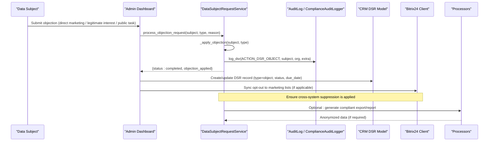

**Diagram sources**
- [dsr_service.py:316-347](file://backend/django/apps/core/dsr_service.py#L316-L347)
- [core_models.py:214-227](file://backend/django/apps/core/models.py#L214-L227)
- [models.py:1000-1134](file://backend/django/apps/crm/models.py#L1000-L1134)
- [client.py:127-172](file://backend/integrations/bitrix24/client.py#L127-L172)
- [processors.py:282-379](file://data/src/processors.py#L282-L379)

## Detailed Component Analysis

### Objection Processing (Article 21)
- Entry point: DataSubjectRequestService.process_objection_request
- Applies objection markers to stop specific processing types (e.g., direct marketing)
- Logs the action with legal basis and context
- CRM model stores the request with type, status, due date, and response data
- Audit trail created for accountability

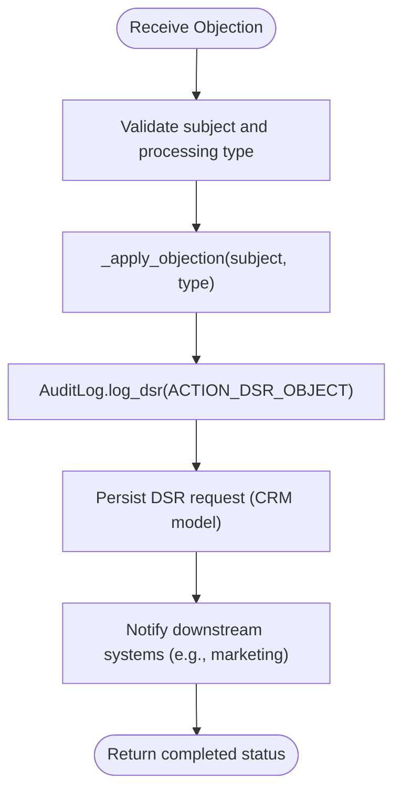

**Diagram sources**
- [dsr_service.py:316-347](file://backend/django/apps/core/dsr_service.py#L316-L347)
- [models.py:1000-1134](file://backend/django/apps/crm/models.py#L1000-L1134)
- [core_models.py:214-227](file://backend/django/apps/core/models.py#L214-L227)

**Section sources**
- [dsr_service.py:316-347](file://backend/django/apps/core/dsr_service.py#L316-L347)
- [models.py:1000-1134](file://backend/django/apps/crm/models.py#L1000-L1134)
- [core_models.py:214-227](file://backend/django/apps/core/models.py#L214-L227)

### Automated Decision-Making Safeguards (Article 22)
- Human intervention: Admin UI exposes lead scoring and review endpoints; operators can override scores and add notes
- Meaningful information: Review flow captures rationale and overrides for transparency
- Right to contest: Operators can reject or adjust AI-generated outputs before publication or further processing

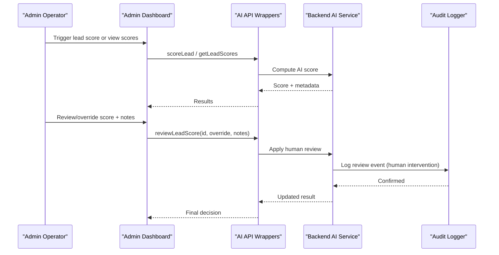

**Diagram sources**
- [api.ts:418-445](file://frontend/apps/admin-dashboard/src/lib/api.ts#L418-L445)
- [useAI.ts:164-204](file://frontend/apps/admin-dashboard/src/lib/hooks/useAI.ts#L164-L204)
- [audit_logger.py:548-585](file://backend/django/apps/crm/audit_logger.py#L548-L585)

**Section sources**
- [api.ts:418-445](file://frontend/apps/admin-dashboard/src/lib/api.ts#L418-L445)
- [useAI.ts:164-204](file://frontend/apps/admin-dashboard/src/lib/hooks/useAI.ts#L164-L204)
- [audit_logger.py:548-585](file://backend/django/apps/crm/audit_logger.py#L548-L585)

### Identity Verification and Impact Assessment
- Identity verification: DSR model supports storing verification documents and requester details; due dates enforced per GDPR deadlines
- Impact assessment: For objections involving legitimate interests or public tasks, assess whether compelling grounds exist; if not, cease processing immediately (especially for direct marketing)
- Response generation: DSR model persists response_data and marks completion; audit entry created upon completion

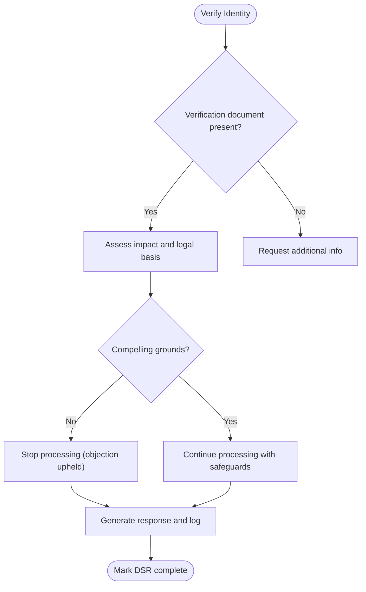

**Diagram sources**
- [models.py:1000-1134](file://backend/django/apps/crm/models.py#L1000-L1134)
- [core_models.py:214-227](file://backend/django/apps/core/models.py#L214-L227)

**Section sources**
- [models.py:1000-1134](file://backend/django/apps/crm/models.py#L1000-L1134)
- [core_models.py:214-227](file://backend/django/apps/core/models.py#L214-L227)

### Practical Examples

#### CRM Systems
- Store and track objections against contacts/leads with explicit request_type='objection'
- Enforce due dates and assignees; persist response_data and mark completion
- Integrate with marketing platforms to suppress opted-out subjects

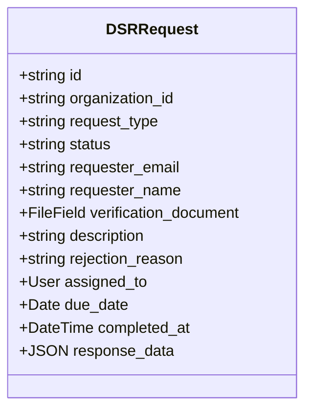

**Diagram sources**
- [models.py:1000-1134](file://backend/django/apps/crm/models.py#L1000-L1134)

**Section sources**
- [models.py:1000-1134](file://backend/django/apps/crm/models.py#L1000-L1134)

#### AI-Powered Features
- Use human-in-the-loop review to override AI scores and capture rationale
- Log reviews and overrides for auditability and transparency

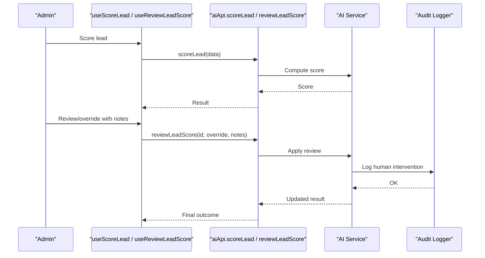

**Diagram sources**
- [useAI.ts:164-204](file://frontend/apps/admin-dashboard/src/lib/hooks/useAI.ts#L164-L204)
- [api.ts:418-445](file://frontend/apps/admin-dashboard/src/lib/api.ts#L418-L445)
- [audit_logger.py:548-585](file://backend/django/apps/crm/audit_logger.py#L548-L585)

**Section sources**
- [useAI.ts:164-204](file://frontend/apps/admin-dashboard/src/lib/hooks/useAI.ts#L164-L204)
- [api.ts:418-445](file://frontend/apps/admin-dashboard/src/lib/api.ts#L418-L445)
- [audit_logger.py:548-585](file://backend/django/apps/crm/audit_logger.py#L548-L585)

#### Marketing Automation Tools
- On objection, update suppression lists via integration client
- Ensure cross-system opt-outs are synchronized and audited

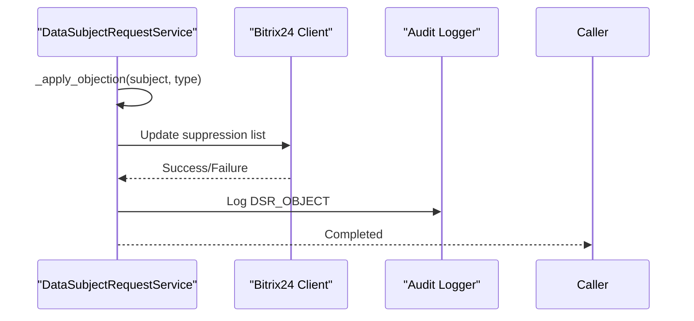

**Diagram sources**
- [dsr_service.py:316-347](file://backend/django/apps/core/dsr_service.py#L316-L347)
- [client.py:127-172](file://backend/integrations/bitrix24/client.py#L127-L172)
- [core_models.py:214-227](file://backend/django/apps/core/models.py#L214-L227)

**Section sources**
- [dsr_service.py:316-347](file://backend/django/apps/core/dsr_service.py#L316-L347)
- [client.py:127-172](file://backend/integrations/bitrix24/client.py#L127-L172)
- [core_models.py:214-227](file://backend/django/apps/core/models.py#L214-L227)

### Integration with Consent Management
- Consent changes are logged with legal basis and timestamps
- Verify current consent state before processing marketing or profiling activities
- Maintain versioned consent records for traceability

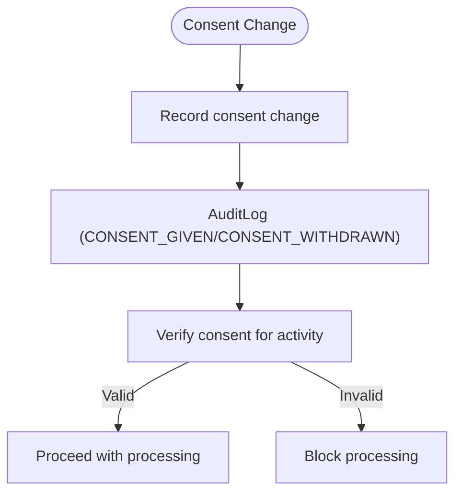

**Diagram sources**
- [audit_logger.py:504-546](file://backend/django/apps/crm/audit_logger.py#L504-L546)
- [core_models.py:67-227](file://backend/django/apps/core/models.py#L67-L227)

**Section sources**
- [audit_logger.py:504-546](file://backend/django/apps/crm/audit_logger.py#L504-L546)
- [core_models.py:67-227](file://backend/django/apps/core/models.py#L67-L227)

### Audit Logging for Compliance Tracking
- All DSR activities logged with action codes, data subject IDs, organization IDs, and extra context
- Tamper-evident checksums and tenant isolation ensure integrity and multi-tenant safety
- External logging sinks integrated for SIEM and compliance dashboards

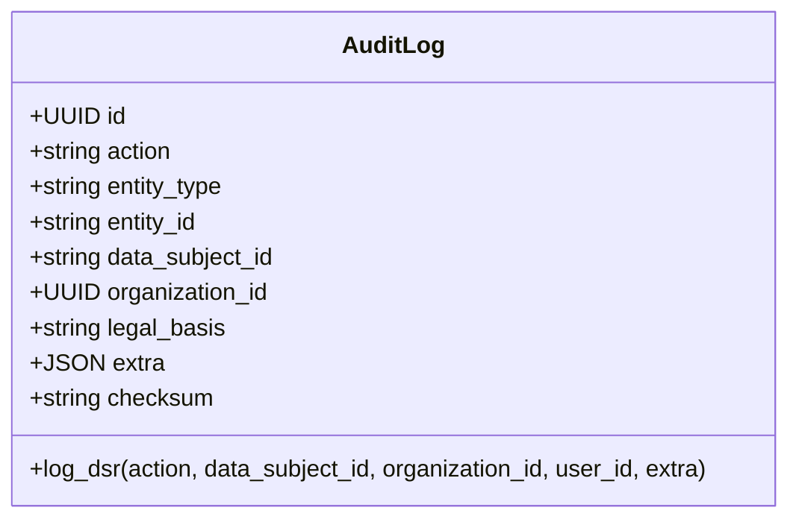

**Diagram sources**
- [core_models.py:67-227](file://backend/django/apps/core/models.py#L67-L227)

**Section sources**
- [core_models.py:67-227](file://backend/django/apps/core/models.py#L67-L227)

## Dependency Analysis
Objection and automated decision-making rely on cohesive interactions between services, models, and integrations.

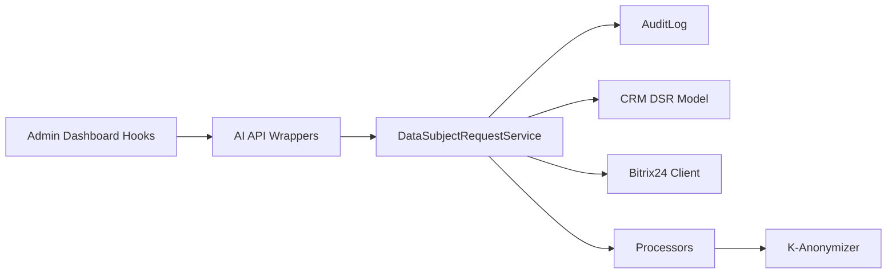

**Diagram sources**
- [dsr_service.py:316-347](file://backend/django/apps/core/dsr_service.py#L316-L347)
- [core_models.py:214-227](file://backend/django/apps/core/models.py#L214-L227)
- [models.py:1000-1134](file://backend/django/apps/crm/models.py#L1000-L1134)
- [client.py:127-172](file://backend/integrations/bitrix24/client.py#L127-L172)
- [processors.py:282-379](file://data/src/processors.py#L282-L379)
- [anonymizer.py:106-180](file://data/src/gdpr/anonymizer.py#L106-L180)
- [api.ts:418-445](file://frontend/apps/admin-dashboard/src/lib/api.ts#L418-L445)
- [useAI.ts:164-204](file://frontend/apps/admin-dashboard/src/lib/hooks/useAI.ts#L164-L204)

**Section sources**
- [dsr_service.py:316-347](file://backend/django/apps/core/dsr_service.py#L316-L347)
- [core_models.py:214-227](file://backend/django/apps/core/models.py#L214-L227)
- [models.py:1000-1134](file://backend/django/apps/crm/models.py#L1000-L1134)
- [client.py:127-172](file://backend/integrations/bitrix24/client.py#L127-L172)
- [processors.py:282-379](file://data/src/processors.py#L282-L379)
- [anonymizer.py:106-180](file://data/src/gdpr/anonymizer.py#L106-L180)
- [api.ts:418-445](file://frontend/apps/admin-dashboard/src/lib/api.ts#L418-L445)
- [useAI.ts:164-204](file://frontend/apps/admin-dashboard/src/lib/hooks/useAI.ts#L164-L204)

## Performance Considerations
- Batch processing: Use batch scoring and export where possible to reduce overhead
- Asynchronous operations: Offload heavy tasks (e.g., large exports, external sync) to background jobs
- Indexing: Ensure indexes on organization_id, data_subject_id, and status fields for fast queries
- Anonymization thresholds: Configure k-anonymity per country to balance privacy and utility

[No sources needed since this section provides general guidance]

## Troubleshooting Guide
- Objection not applied: Verify _apply_objection implementation and downstream sync; check audit logs for ACTION_DSR_OBJECT
- Cross-tenant errors: Confirm tenant context and validation in models and audit logs
- Consent conflicts: Review consent change logs and verify current consent status before processing
- AI review failures: Inspect review endpoints and audit entries for human intervention events

**Section sources**
- [dsr_service.py:316-347](file://backend/django/apps/core/dsr_service.py#L316-L347)
- [models.py:1000-1134](file://backend/django/apps/crm/models.py#L1000-L1134)
- [core_models.py:156-203](file://backend/django/apps/core/models.py#L156-L203)
- [audit_logger.py:504-585](file://backend/django/apps/crm/audit_logger.py#L504-L585)

## Conclusion
JOL-HUB provides a robust framework for handling GDPR Articles 21 and 22:
- Clear objection processing pathways with immediate cessation for direct marketing and structured assessments for legitimate interests/public tasks
- Automated decision-making safeguards with human intervention, meaningful explanations, and contestation mechanisms
- Comprehensive audit trails and consent integration ensuring accountability and compliance
- Practical integration points for CRM, AI features, and marketing automation tools

[No sources needed since this section summarizes without analyzing specific files]