# GDPR Compliance

<cite>
**Referenced Files in This Document**
- [anonymizer.py](file://data/src/gdpr/anonymizer.py)
- [retention_manager.py](file://data/src/gdpr/retention_manager.py)
- [entity_ropa.py](file://data/src/gdpr/entity_ropa.py)
- [ropa_generator.py](file://data/src/gdpr/ropa_generator.py)
- [dsar_service.py](file://data/src/dsar_service.py)
- [audit.py](file://data/src/audit.py)
- [processors.py](file://data/src/processors.py)
- [lt_sync.py](file://data/src/pipelines/country_sync/lt_sync.py)
- [lv_sync.py](file://data/src/pipelines/country_sync/lv_sync.py)
- [compliance.yml (Lithuania)](file://countries/lt/config/compliance.yml)
- [compliance.yml (Latvia)](file://countries/lv/config/compliance.yml)
- [compliance.yml (Estonia)](file://countries/ee/config/compliance.yml)
- [gdpr_consent_validation.py](file://data/src/quality/expectations/gdpr_consent_validation.py)
- [config.py](file://data/src/config.py)
- [privacy-page.tsx](file://frontend/packages/ui/src/components/privacy-page.tsx)
- [security-model.md](file://docs/architecture/security-model.md)
- [GDPR-checklist.md](file://docs/compliance/GDPR-checklist.md)
</cite>

## Table of Contents
1. Introduction
2. Project Structure
3. Core Components
4. Architecture Overview
5. Detailed Component Analysis
6. Dependency Analysis
7. Performance Considerations
8. Troubleshooting Guide
9. Conclusion
10. Appendices

## Introduction
This document provides comprehensive GDPR compliance documentation for the JOL-HUB platform. It explains how consent management, data subject rights automation, lawful basis processing, and privacy by design are implemented across the system. It also details technical controls such as anonymization, Records of Processing Activities (ROPA) generation, retention policies, and Data Protection Impact Assessments (DPIA). Country-specific requirements for Lithuania, Latvia, and Estonia are covered, including age thresholds, national derogations, and supervisory authority obligations. Practical examples illustrate handling data subject requests, consent withdrawal mechanisms, and breach notification procedures. Finally, it documents the compliance monitoring framework, audit trails, and evidence collection processes.

## Project Structure
The GDPR implementation spans multiple layers:
- Data layer: processors, DSAR service, anonymizer, retention manager, ROPA generator, country sync pipelines, and quality expectations for consent validation.
- Configuration: per-country compliance settings and global processing activities registry.
- Frontend: privacy page exposing data subject rights to users.
- Documentation: security model and GDPR checklist guiding DPIA and breach response.

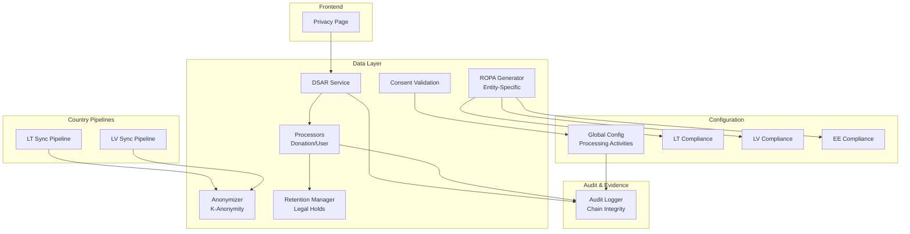

**Diagram sources**
- [dsar_service.py:59-157](file://data/src/dsar_service.py#L59-L157)
- [processors.py:94-220](file://data/src/processors.py#L94-L220)
- [anonymizer.py:106-180](file://data/src/gdpr/anonymizer.py#L106-L180)
- [retention_manager.py:188-336](file://data/src/gdpr/retention_manager.py#L188-L336)
- [entity_ropa.py:39-797](file://data/src/gdpr/entity_ropa.py#L39-L797)
- [lt_sync.py:48-207](file://data/src/pipelines/country_sync/lt_sync.py#L48-L207)
- [lv_sync.py:47-97](file://data/src/pipelines/country_sync/lv_sync.py#L47-L97)
- [config.py:85-114](file://data/src/config.py#L85-L114)
- [audit.py:205-369](file://data/src/audit.py#L205-L369)
- [privacy-page.tsx:321-348](file://frontend/packages/ui/src/components/privacy-page.tsx#L321-L348)

**Section sources**
- [dsar_service.py:59-157](file://data/src/dsar_service.py#L59-L157)
- [processors.py:94-220](file://data/src/processors.py#L94-L220)
- [anonymizer.py:106-180](file://data/src/gdpr/anonymizer.py#L106-L180)
- [retention_manager.py:188-336](file://data/src/gdpr/retention_manager.py#L188-L336)
- [entity_ropa.py:39-797](file://data/src/gdpr/entity_ropa.py#L39-L797)
- [lt_sync.py:48-207](file://data/src/pipelines/country_sync/lt_sync.py#L48-L207)
- [lv_sync.py:47-97](file://data/src/pipelines/country_sync/lv_sync.py#L47-L97)
- [config.py:85-114](file://data/src/config.py#L85-L114)
- [audit.py:205-369](file://data/src/audit.py#L205-L369)
- [privacy-page.tsx:321-348](file://frontend/packages/ui/src/components/privacy-page.tsx#L321-L348)

## Core Components
- DSAR Service: Orchestrates access, erasure, and portability across processors with full audit logging and 30-day deadline awareness.
- Processors: Implement per-domain access and deletion logic with retention exemptions and legal hold checks.
- Anonymizer: Provides k-anonymity with country-specific thresholds and hashing for direct identifiers.
- Retention Manager: Enforces storage limitation and right to erasure with legal holds and retention rules.
- ROPA Generator: Produces Article 30 records, including entity-specific activities for religious and commercial entities.
- Consent Validation: Ensures required consents are active and not expired before processing.
- Audit Logger: Immutable chain-backed logs with HMAC signatures for tamper detection and compliance reporting.
- Country Pipelines: Localized synchronization with anonymization and DSAR support.
- Country Compliance Configs: Age thresholds, special categories, retention periods, and supervisory authority contacts.

**Section sources**
- [dsar_service.py:59-157](file://data/src/dsar_service.py#L59-L157)
- [processors.py:223-503](file://data/src/processors.py#L223-L503)
- [anonymizer.py:25-180](file://data/src/gdpr/anonymizer.py#L25-L180)
- [retention_manager.py:21-336](file://data/src/gdpr/retention_manager.py#L21-L336)
- [entity_ropa.py:39-797](file://data/src/gdpr/entity_ropa.py#L39-L797)
- [gdpr_consent_validation.py:90-129](file://data/src/quality/expectations/gdpr_consent_validation.py#L90-L129)
- [audit.py:205-369](file://data/src/audit.py#L205-L369)
- [lt_sync.py:48-207](file://data/src/pipelines/country_sync/lt_sync.py#L48-L207)
- [lv_sync.py:47-97](file://data/src/pipelines/country_sync/lv_sync.py#L47-L97)
- [compliance.yml (Lithuania):31-170](file://countries/lt/config/compliance.yml#L31-L170)
- [compliance.yml (Latvia):31-170](file://countries/lv/config/compliance.yml#L31-L170)
- [compliance.yml (Estonia):31-170](file://countries/ee/config/compliance.yml#L31-L170)

## Architecture Overview
The GDPR architecture integrates consent-driven processing, DSAR workflows, anonymization, retention enforcement, and immutable auditing. Country configurations drive lawful basis and retention behavior, while entity-specific ROPA captures processing activities for regulatory reporting.

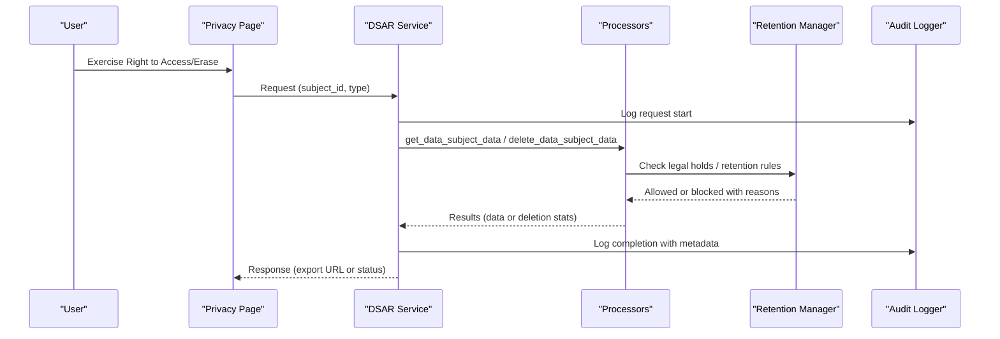

**Diagram sources**
- [dsar_service.py:88-157](file://data/src/dsar_service.py#L88-L157)
- [processors.py:282-503](file://data/src/processors.py#L282-L503)
- [retention_manager.py:257-336](file://data/src/gdpr/retention_manager.py#L257-L336)
- [audit.py:330-369](file://data/src/audit.py#L330-L369)
- [privacy-page.tsx:321-348](file://frontend/packages/ui/src/components/privacy-page.tsx#L321-L348)

## Detailed Component Analysis

### Consent Management Workflow
- Consent validation ensures required consents are present, active, and unexpired before processing.
- Withdrawal is tracked via audit events and enforced at processing boundaries.
- Country-specific minimum ages and validity windows are applied from configuration.

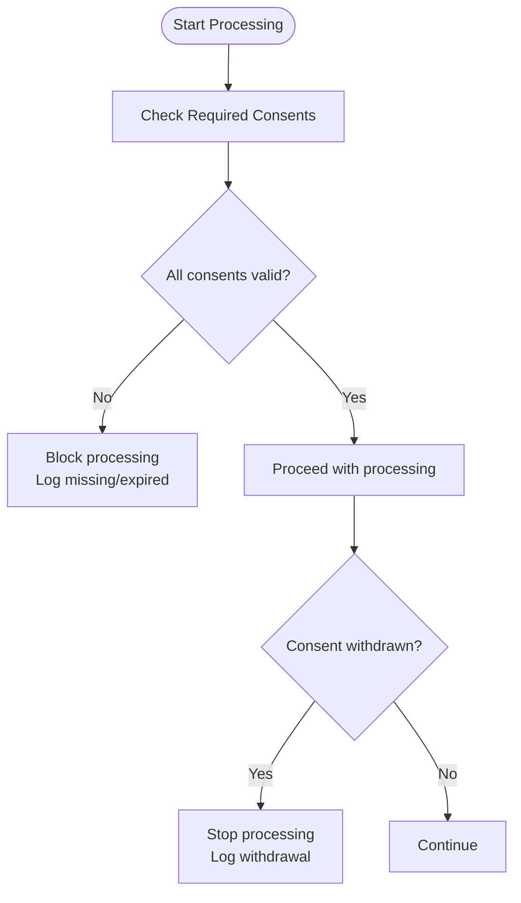

**Diagram sources**
- [gdpr_consent_validation.py:90-129](file://data/src/quality/expectations/gdpr_consent_validation.py#L90-L129)
- [audit.py:29-63](file://data/src/audit.py#L29-L63)
- [compliance.yml (Lithuania):31-45](file://countries/lt/config/compliance.yml#L31-L45)
- [compliance.yml (Latvia):31-45](file://countries/lv/config/compliance.yml#L31-L45)
- [compliance.yml (Estonia):31-45](file://countries/ee/config/compliance.yml#L31-L45)

**Section sources**
- [gdpr_consent_validation.py:90-129](file://data/src/quality/expectations/gdpr_consent_validation.py#L90-L129)
- [audit.py:29-63](file://data/src/audit.py#L29-L63)
- [compliance.yml (Lithuania):31-45](file://countries/lt/config/compliance.yml#L31-L45)
- [compliance.yml (Latvia):31-45](file://countries/lv/config/compliance.yml#L31-L45)
- [compliance.yml (Estonia):31-45](file://countries/ee/config/compliance.yml#L31-L45)

### Data Subject Rights Automation
- Access (Art. 15): Aggregates user and donation data across processors into a portable JSON export.
- Erasure (Art. 17): Applies retention rules and legal holds; soft-deletes or anonymizes where appropriate.
- Portability (Art. 20): Exports machine-readable JSON for subjects.
- Rectification/Restriction: Supported via processor hooks and audit logging.

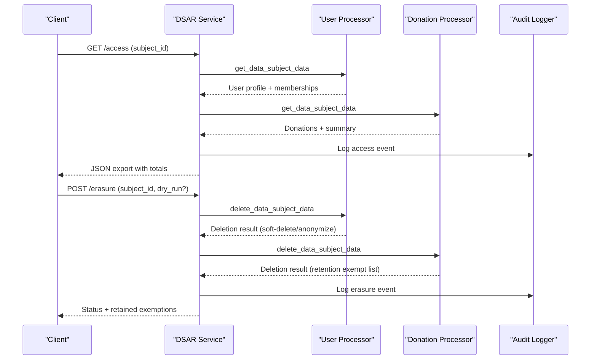

**Diagram sources**
- [dsar_service.py:88-157](file://data/src/dsar_service.py#L88-L157)
- [dsar_service.py:159-267](file://data/src/dsar_service.py#L159-L267)
- [processors.py:282-503](file://data/src/processors.py#L282-L503)
- [processors.py:570-761](file://data/src/processors.py#L570-L761)
- [audit.py:330-369](file://data/src/audit.py#L330-L369)

**Section sources**
- [dsar_service.py:88-157](file://data/src/dsar_service.py#L88-L157)
- [dsar_service.py:159-267](file://data/src/dsar_service.py#L159-L267)
- [processors.py:282-503](file://data/src/processors.py#L282-L503)
- [processors.py:570-761](file://data/src/processors.py#L570-L761)
- [audit.py:330-369](file://data/src/audit.py#L330-L369)

### Lawful Basis Processing
- Global processing activities define purposes, categories, recipients, retention, and security measures.
- Entity-specific ROPA extends base activities with religious and commercial contexts, marking sensitive data and third-country transfers.
- Country configs specify lawful basis options, legitimate interest documentation requirements, and public interest provisions.

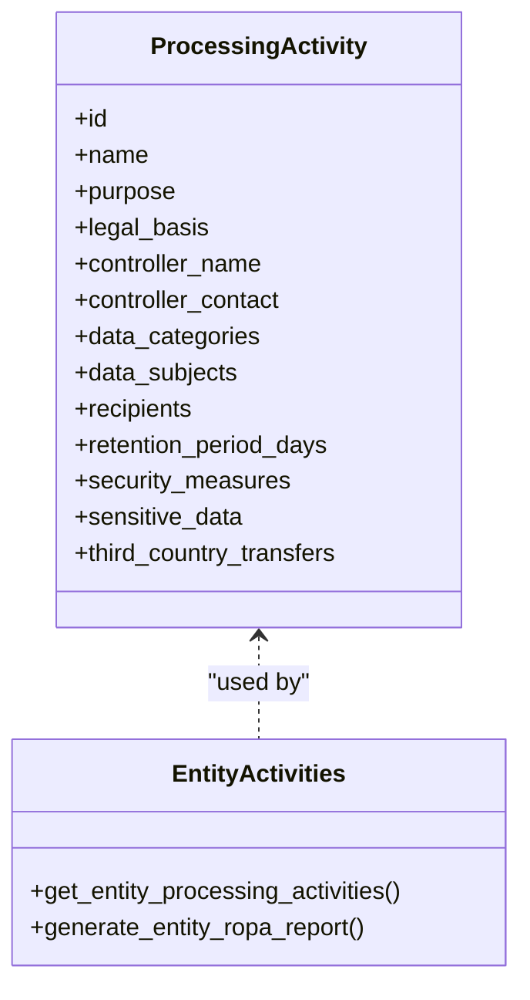

**Diagram sources**
- [ropa_generator.py:19-43](file://data/src/gdpr/ropa_generator.py#L19-L43)
- [entity_ropa.py:39-797](file://data/src/gdpr/entity_ropa.py#L39-L797)
- [config.py:85-114](file://data/src/config.py#L85-L114)

**Section sources**
- [config.py:85-114](file://data/src/config.py#L85-L114)
- [ropa_generator.py:19-43](file://data/src/gdpr/ropa_generator.py#L19-L43)
- [entity_ropa.py:39-797](file://data/src/gdpr/entity_ropa.py#L39-L797)

### Privacy by Design Principles
- Data minimization and purpose limitation embedded in processors and pipelines.
- Anonymization applied to analytics and aggregated outputs.
- Encryption and access control specified in processing activities and country configs.
- DPIA triggers and process documented in security model.

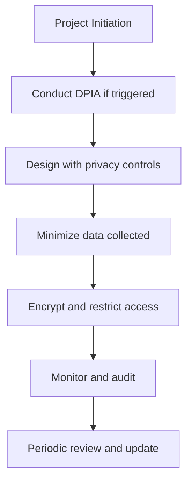

**Diagram sources**
- [security-model.md:420-480](file://docs/architecture/security-model.md#L420-L480)
- [anonymizer.py:106-180](file://data/src/gdpr/anonymizer.py#L106-L180)
- [config.py:85-114](file://data/src/config.py#L85-L114)

**Section sources**
- [security-model.md:420-480](file://docs/architecture/security-model.md#L420-L480)
- [anonymizer.py:106-180](file://data/src/gdpr/anonymizer.py#L106-L180)
- [config.py:85-114](file://data/src/config.py#L85-L114)

### Anonymization System
- K-anonymity with configurable k values per country; default EU k=5, stricter regimes use higher k.
- Direct identifiers hashed; counts rounded to nearest k for aggregation safety.
- Integration in country pipelines ensures donations are anonymized before storage.

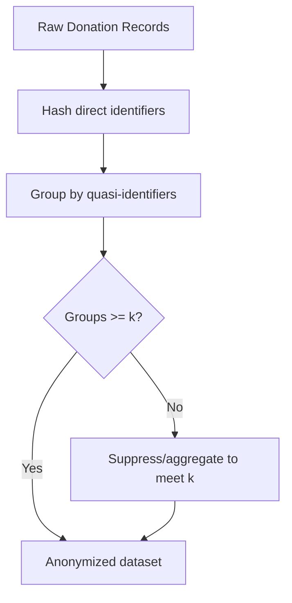

**Diagram sources**
- [anonymizer.py:25-180](file://data/src/gdpr/anonymizer.py#L25-L180)
- [lt_sync.py:115-175](file://data/src/pipelines/country_sync/lt_sync.py#L115-L175)

**Section sources**
- [anonymizer.py:25-180](file://data/src/gdpr/anonymizer.py#L25-L180)
- [lt_sync.py:115-175](file://data/src/pipelines/country_sync/lt_sync.py#L115-L175)

### ROPA Generation
- Base ROPA generator produces structured reports for core processing activities.
- Entity-specific module generates tailored activities for basilica, cathedral, diocese, deanery, church, protestant, orthodox, greek catholic, funeral, and cemetery entities.
- Reports include controller info, data categories, subjects, recipients, retention, and security measures.

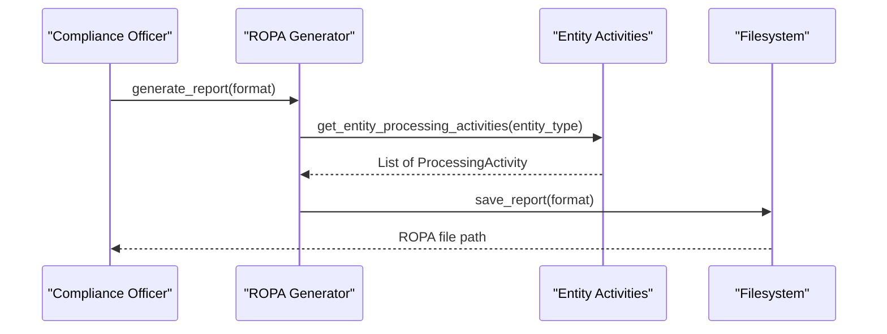

**Diagram sources**
- [ropa_generator.py:103-169](file://data/src/gdpr/ropa_generator.py#L103-L169)
- [entity_ropa.py:762-797](file://data/src/gdpr/entity_ropa.py#L762-L797)

**Section sources**
- [ropa_generator.py:103-169](file://data/src/gdpr/ropa_generator.py#L103-L169)
- [entity_ropa.py:762-797](file://data/src/gdpr/entity_ropa.py#L762-L797)

### Retention Policies and Legal Holds
- Retention rules enforce storage limitation with defined retention days and legal basis references.
- Legal holds block erasure when litigation, investigation, audit, subpoena, or law enforcement applies.
- Deletion flows check holds first; otherwise proceed with soft-delete or anonymization based on domain rules.

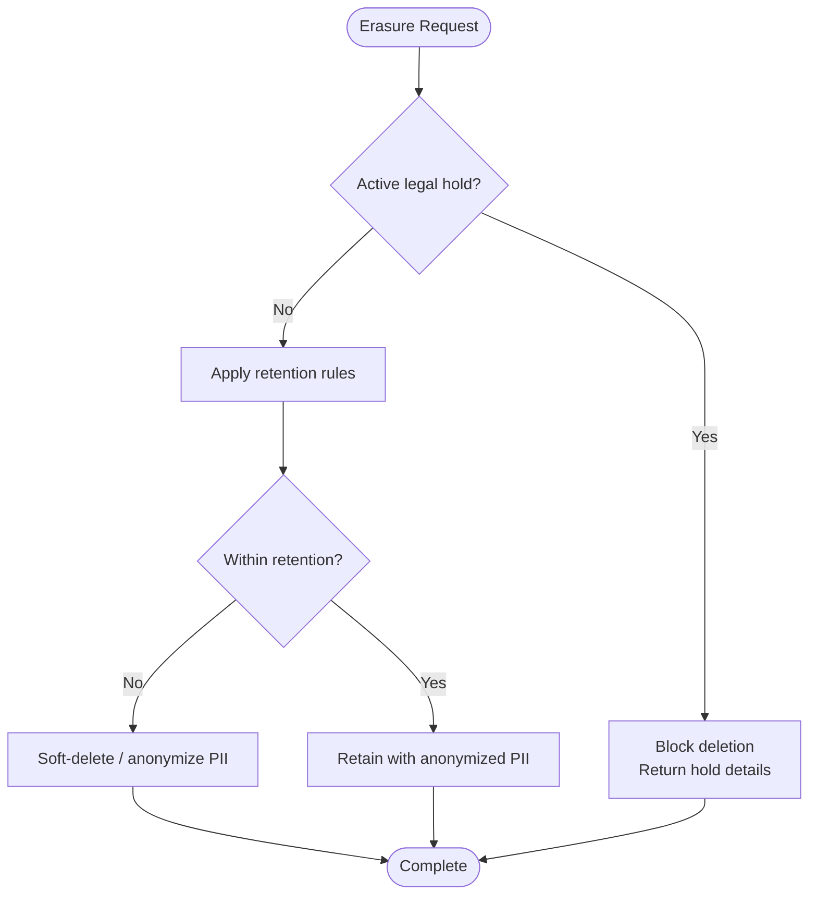

**Diagram sources**
- [retention_manager.py:21-336](file://data/src/gdpr/retention_manager.py#L21-L336)
- [processors.py:381-503](file://data/src/processors.py#L381-L503)

**Section sources**
- [retention_manager.py:21-336](file://data/src/gdpr/retention_manager.py#L21-L336)
- [processors.py:381-503](file://data/src/processors.py#L381-L503)

### Country-Specific Requirements: Lithuania, Latvia, Estonia
- Age thresholds: Lithuania 14; Latvia 13; Estonia 13. Parental verification required below threshold.
- Special categories: Religious data explicitly permitted under Art. 9(2)(d) with safeguards; health data permitted for funeral/cemetery services with encryption.
- Canonical records exception: Sacramental records permanently retained per Canon Law; erasure exceptions apply.
- Supervisory authorities: VDATI (Lithuania), DVI (Latvia), AKI (Estonia) with contact details and breach notification timelines.
- Data transfers: Restricted destinations listed; EEA countries permitted.

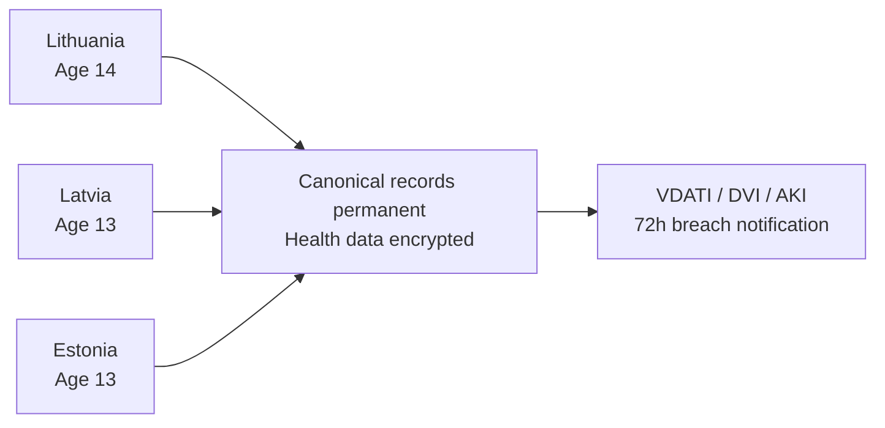

**Diagram sources**
- [compliance.yml (Lithuania):31-170](file://countries/lt/config/compliance.yml#L31-L170)
- [compliance.yml (Latvia):31-170](file://countries/lv/config/compliance.yml#L31-L170)
- [compliance.yml (Estonia):31-170](file://countries/ee/config/compliance.yml#L31-L170)

**Section sources**
- [compliance.yml (Lithuania):31-170](file://countries/lt/config/compliance.yml#L31-L170)
- [compliance.yml (Latvia):31-170](file://countries/lv/config/compliance.yml#L31-L170)
- [compliance.yml (Estonia):31-170](file://countries/ee/config/compliance.yml#L31-L170)

### Practical Examples
- Data Subject Request Handling:
  - Access: Use DSAR service to retrieve user profile and donations; export JSON for portability.
  - Erasure: Invoke erasure flow; retention exemptions and legal holds are respected; results include retained records and reasons.
- Consent Withdrawal Mechanisms:
  - Validate consents before processing; log withdrawals; stop processing upon withdrawal.
- Breach Notification Procedures:
  - Follow internal process: discovery, containment, classification, DPO notification, authority notification within 72 hours, affected individuals notification if high risk.

**Section sources**
- [dsar_service.py:88-157](file://data/src/dsar_service.py#L88-L157)
- [dsar_service.py:159-267](file://data/src/dsar_service.py#L159-L267)
- [gdpr_consent_validation.py:90-129](file://data/src/quality/expectations/gdpr_consent_validation.py#L90-L129)
- [security-model.md:440-480](file://docs/architecture/security-model.md#L440-L480)
- [GDPR-checklist.md:355-383](file://docs/compliance/GDPR-checklist.md#L355-L383)

## Dependency Analysis
Key dependencies and relationships:
- DSAR Service depends on Processors and Audit Logger.
- Processors depend on Database connections and Audit Logger; they integrate with Retention Manager for erasure decisions.
- Country Pipelines depend on Anonymizer and Audit Logger; they implement DSAR stubs for local compliance.
- ROPA Generator and Entity Activities depend on ProcessingActivity definitions and output to filesystem.
- Consent Validation depends on configuration and audit logging.

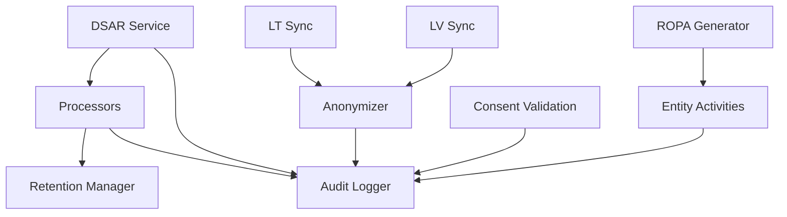

**Diagram sources**
- [dsar_service.py:59-157](file://data/src/dsar_service.py#L59-L157)
- [processors.py:94-220](file://data/src/processors.py#L94-L220)
- [retention_manager.py:188-336](file://data/src/gdpr/retention_manager.py#L188-L336)
- [anonymizer.py:106-180](file://data/src/gdpr/anonymizer.py#L106-L180)
- [entity_ropa.py:39-797](file://data/src/gdpr/entity_ropa.py#L39-L797)
- [gdpr_consent_validation.py:90-129](file://data/src/quality/expectations/gdpr_consent_validation.py#L90-L129)

**Section sources**
- [dsar_service.py:59-157](file://data/src/dsar_service.py#L59-L157)
- [processors.py:94-220](file://data/src/processors.py#L94-L220)
- [retention_manager.py:188-336](file://data/src/gdpr/retention_manager.py#L188-L336)
- [anonymizer.py:106-180](file://data/src/gdpr/anonymizer.py#L106-L180)
- [entity_ropa.py:39-797](file://data/src/gdpr/entity_ropa.py#L39-L797)
- [gdpr_consent_validation.py:90-129](file://data/src/quality/expectations/gdpr_consent_validation.py#L90-L129)

## Performance Considerations
- K-anonymity grouping complexity scales with record count and quasi-identifier cardinality; optimize by limiting group fields and using indexes.
- DSAR aggregation queries should be paginated and indexed on subject identifiers to reduce latency.
- Audit log writes are append-only; ensure sufficient I/O capacity and consider log rotation strategies.
- Retention cleanup jobs should run off-peak and batch deletions to minimize database load.

[No sources needed since this section provides general guidance]

## Troubleshooting Guide
Common issues and resolutions:
- DSAR failures: Check processor error lists and audit logs for exceptions; verify database connectivity and query correctness.
- Erasure blocked: Inspect legal hold registry for active holds; lift holds only when justified and documented.
- Consent validation errors: Ensure required consents are recorded and not expired; re-prompt users if necessary.
- Audit integrity issues: Verify chain state and HMAC signatures; investigate sequence gaps or hash mismatches.

**Section sources**
- [processors.py:381-503](file://data/src/processors.py#L381-L503)
- [processors.py:668-761](file://data/src/processors.py#L668-L761)
- [retention_manager.py:257-336](file://data/src/gdpr/retention_manager.py#L257-L336)
- [audit.py:513-589](file://data/src/audit.py#L513-L589)

## Conclusion
JOL-HUB implements a robust GDPR compliance framework integrating consent management, automated data subject rights, lawful basis tracking, anonymization, retention enforcement, and immutable auditing. Country-specific configurations ensure adherence to Lithuanian, Latvian, and Estonian requirements, including age thresholds, canonical record exceptions, and supervisory authority obligations. The modular architecture supports scalability and maintainability while providing clear audit trails and evidence for compliance audits.

[No sources needed since this section summarizes without analyzing specific files]

## Appendices

### Appendix A: Data Models Diagram
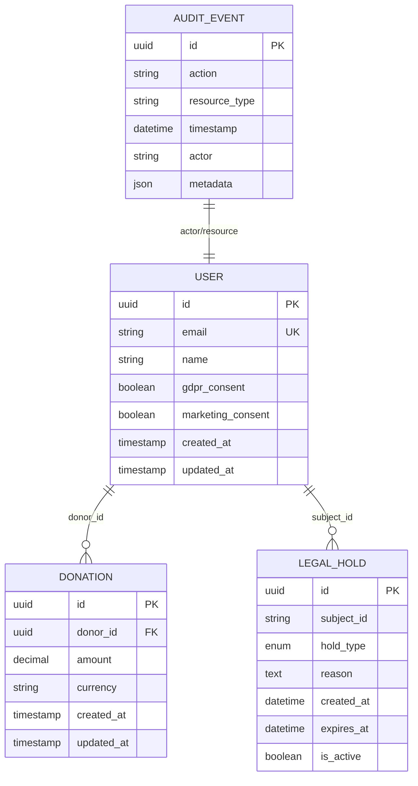

**Diagram sources**
- [processors.py:570-761](file://data/src/processors.py#L570-L761)
- [processors.py:282-503](file://data/src/processors.py#L282-L503)
- [audit.py:65-122](file://data/src/audit.py#L65-L122)
- [retention_manager.py:37-67](file://data/src/gdpr/retention_manager.py#L37-L67)