# Consent Management

<cite>
**Referenced Files in This Document**
- [dsr_service.py](file://backend/django/apps/core/dsr_service.py)
- [models.py](file://backend/django/apps/crm/models.py)
- [views.py](file://backend/django/apps/crm/api/views.py)
- [audit_logger.py](file://backend/django/apps/crm/audit_logger.py)
- [signals.py](file://backend/django/apps/crm/signals.py)
- [logger.py](file://backend/integrations/bitrix24/audit/logger.py)
- [models.py](file://backend/django/apps/analytics/models.py)
- [0003_add_lead_model_and_contact_fields.py](file://backend/django/apps/crm/migrations/0003_add_lead_model_and_contact_fields.py)
- [gdpr_consent_validation.py](file://data/src/quality/expectations/gdpr_consent_validation.py)
- [ConsentDashboard.tsx](file://frontend/apps/admin-dashboard/src/components/compliance/ConsentDashboard.tsx)
- [consent-page.tsx](file://frontend/packages/ui/src/components/consent-page.tsx)
- [cookie-consent-banner.tsx](file://frontend/packages/ui/src/components/cookie-consent-banner.tsx)
- [entity_ropa.py](file://data/src/gdpr/entity_ropa.py)
</cite>

## Table of Contents
1. Introduction
2. Project Structure
3. Core Components
4. Architecture Overview
5. Detailed Component Analysis
6. Dependency Analysis
7. Performance Considerations
8. Troubleshooting Guide
9. Conclusion

## Introduction
This document explains the consent management implementation for the JOL-HUB platform with a focus on Article 6(1)(a) lawful basis (consent). It covers how consent is collected, stored immutably with audit trails, versioned, validated, and withdrawn; how processing automatically ceases upon withdrawal; and how consent integrates with data subject rights workflows. It also provides practical guidance for UI components, API endpoints, and database schema elements used to support consent across the platform.

## Project Structure
The consent system spans backend services, CRM models, analytics tracking, audit logging, integrations, and frontend UIs:
- Backend service layer centralizes consent operations and verification
- CRM models store per-contact consent state and versions
- Analytics model enforces consent gating for page view aggregation
- Audit logger records consent changes with IP/user agent context
- Bitrix24 integration logs consent events and supports hash-chain integrity checks
- Frontend provides consent UIs for users and admins

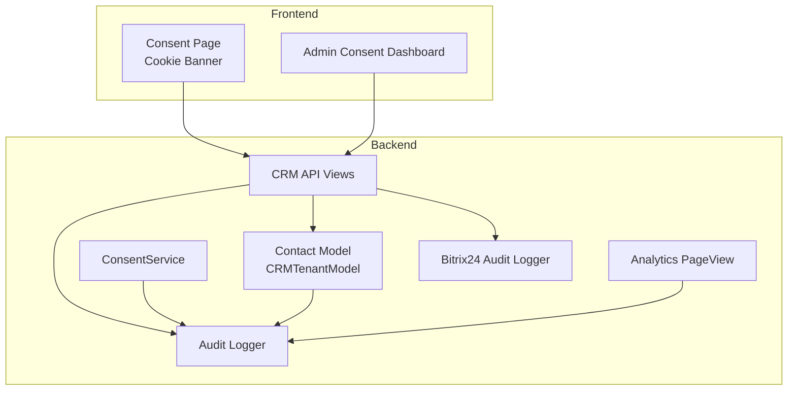

**Diagram sources**
- [views.py:209-250](file://backend/django/apps/crm/api/views.py#L209-L250)
- [dsr_service.py:378-496](file://backend/django/apps/core/dsr_service.py#L378-L496)
- [models.py:140-252](file://backend/django/apps/crm/models.py#L140-L252)
- [audit_logger.py:520-716](file://backend/django/apps/crm/audit_logger.py#L520-L716)
- [models.py:12-62](file://backend/django/apps/analytics/models.py#L12-L62)
- [logger.py:330-433](file://backend/integrations/bitrix24/audit/logger.py#L330-L433)

**Section sources**
- [views.py:209-250](file://backend/django/apps/crm/api/views.py#L209-L250)
- [dsr_service.py:378-496](file://backend/django/apps/core/dsr_service.py#L378-L496)
- [models.py:140-252](file://backend/django/apps/crm/models.py#L140-L252)
- [audit_logger.py:520-716](file://backend/django/apps/crm/audit_logger.py#L520-L716)
- [models.py:12-62](file://backend/django/apps/analytics/models.py#L12-L62)
- [logger.py:330-433](file://backend/integrations/bitrix24/audit/logger.py#L330-L433)

## Core Components
- ConsentService: Centralized service for recording consent, withdrawing consent, and verifying validity. It captures user ID, organization, consent types, IP address, user agent, consent text shown, version, and timestamp, and persists an immutable audit log entry.
- Contact model: Stores consent status, timestamps, and version per contact; provides methods to grant or withdraw consent and maintains integrity hashes.
- Analytics PageView: Enforces consent gating by only aggregating page views where consent was given; includes consent versioning.
- Audit Logger: Records consent changes with actor context (IP, user agent), legal basis, and details; supports HMAC and chain verification for integrity.
- Bitrix24 Audit Logger: Logs consent events and supports hash-chain verification for tamper-evident audit trails.
- Validation utilities: Validate consent presence, activity, expiry, and compliance statistics.

**Section sources**
- [dsr_service.py:378-496](file://backend/django/apps/core/dsr_service.py#L378-L496)
- [models.py:140-252](file://backend/django/apps/crm/models.py#L140-L252)
- [models.py:12-62](file://backend/django/apps/analytics/models.py#L12-L62)
- [audit_logger.py:520-716](file://backend/django/apps/crm/audit_logger.py#L520-L716)
- [logger.py:330-433](file://backend/integrations/bitrix24/audit/logger.py#L330-L433)
- [gdpr_consent_validation.py:52-167](file://data/src/quality/expectations/gdpr_consent_validation.py#L52-L167)

## Architecture Overview
The consent architecture implements a centralized registry via the CRM models and audit logs, ensuring immutability and traceability. Consent flows through APIs into services that update models and emit audit entries. Analytics enforce consent gating at ingestion time. Integrations mirror consent events for external systems with integrity checks.

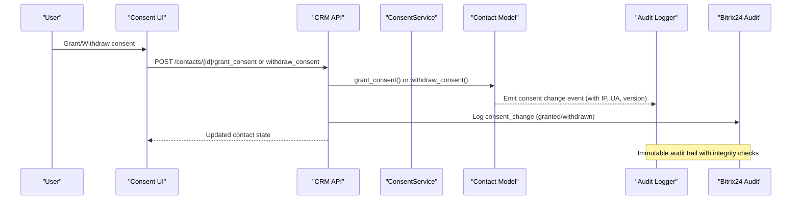

**Diagram sources**
- [views.py:209-250](file://backend/django/apps/crm/api/views.py#L209-L250)
- [models.py:237-252](file://backend/django/apps/crm/models.py#L237-L252)
- [audit_logger.py:520-546](file://backend/django/apps/crm/audit_logger.py#L520-L546)
- [logger.py:330-354](file://backend/integrations/bitrix24/audit/logger.py#L330-L354)

## Detailed Component Analysis

### Consent Service (ConsentService)
- Records consent with granular types, capturing IP address and user agent, consent text shown, and version. Creates an immutable audit log entry with legal basis set to consent.
- Withdraws consent by creating an audit log entry with withdrawal timestamp and sets status accordingly.
- Verifies consent by checking recent consent and absence of subsequent withdrawal.

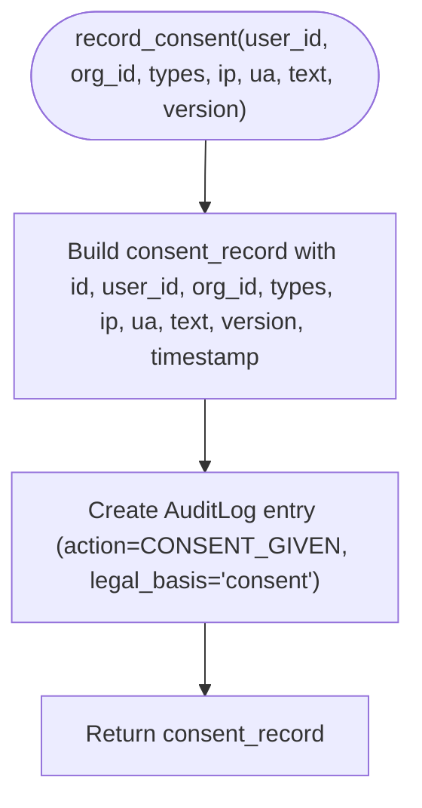

**Diagram sources**
- [dsr_service.py:391-435](file://backend/django/apps/core/dsr_service.py#L391-L435)

**Section sources**
- [dsr_service.py:391-435](file://backend/django/apps/core/dsr_service.py#L391-L435)
- [dsr_service.py:437-465](file://backend/django/apps/core/dsr_service.py#L437-L465)
- [dsr_service.py:467-496](file://backend/django/apps/core/dsr_service.py#L467-L496)

### CRM Contact Model (Consent Lifecycle)
- Fields include consent_status, consent_granted_at, consent_withdrawn_at, consent_version, plus integrity hashes and tenant isolation fields.
- Methods grant_consent and withdraw_consent update state and timestamps; save generates record_hash for tamper detection.

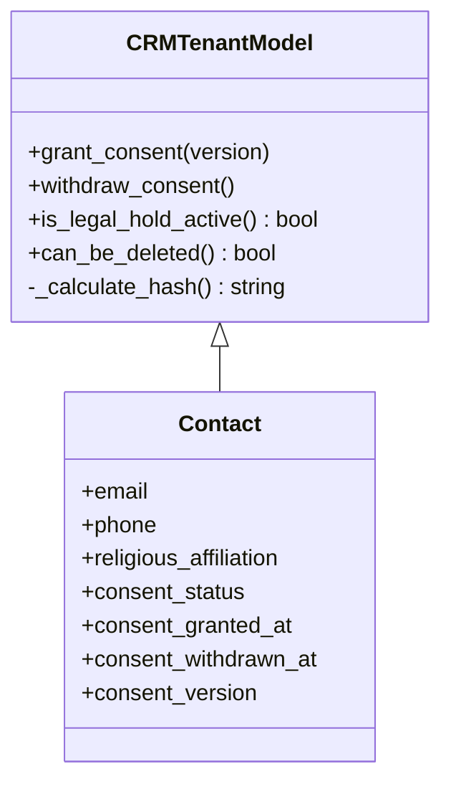

**Diagram sources**
- [models.py:140-252](file://backend/django/apps/crm/models.py#L140-L252)

**Section sources**
- [models.py:140-252](file://backend/django/apps/crm/models.py#L140-L252)

### API Endpoints for Consent Management
- POST /contacts/{id}/grant_consent: Validates request, grants consent with version, logs access, returns updated contact.
- POST /contacts/{id}/withdraw_consent: Withdraws consent, logs access, returns updated contact.

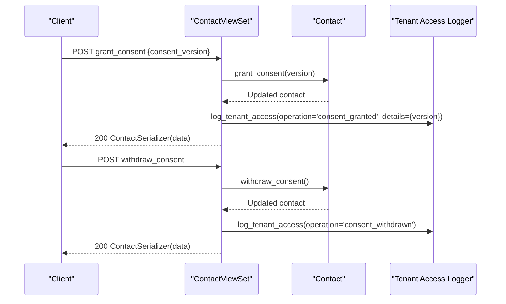

**Diagram sources**
- [views.py:209-250](file://backend/django/apps/crm/api/views.py#L209-L250)

**Section sources**
- [views.py:209-250](file://backend/django/apps/crm/api/views.py#L209-L250)

### Audit Logging and Integrity
- CRM Audit Logger: Emits consent_change events with operation 'consent_granted' or 'consent_withdrawn', including actor IP and user agent, and GDPR basis.
- Bitrix24 Audit Logger: Logs consent events and supports verify_chain to ensure hash chain integrity across entries.

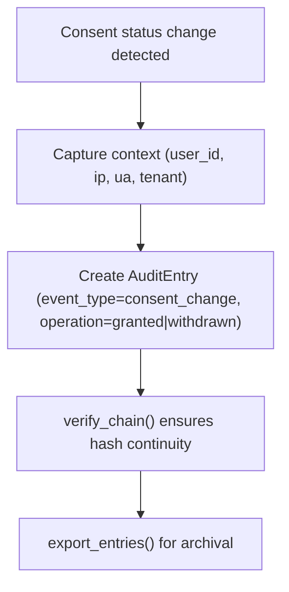

**Diagram sources**
- [audit_logger.py:520-546](file://backend/django/apps/crm/audit_logger.py#L520-L546)
- [logger.py:356-403](file://backend/integrations/bitrix24/audit/logger.py#L356-L403)

**Section sources**
- [audit_logger.py:520-546](file://backend/django/apps/crm/audit_logger.py#L520-L546)
- [logger.py:330-433](file://backend/integrations/bitrix24/audit/logger.py#L330-L433)

### Consent Validation and Expiry
- GDPRConsentValidator validates required consents per processing type, checks active status, and detects expired consents based on configured validity period. Provides batch validation and compliance stats.

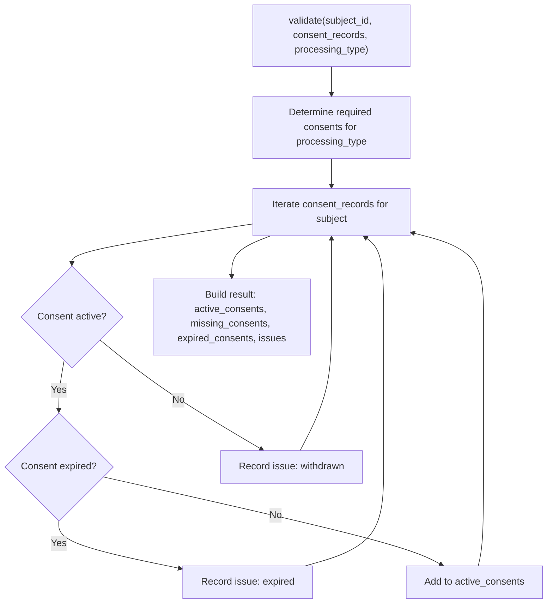

**Diagram sources**
- [gdpr_consent_validation.py:77-142](file://data/src/quality/expectations/gdpr_consent_validation.py#L77-L142)

**Section sources**
- [gdpr_consent_validation.py:77-142](file://data/src/quality/expectations/gdpr_consent_validation.py#L77-L142)

### Analytics Consent Gating
- PageView model stores consent_given and consent_version; only aggregated when consent_given=True. Includes indexes for efficient queries and tenant validation to prevent cross-tenant manipulation.

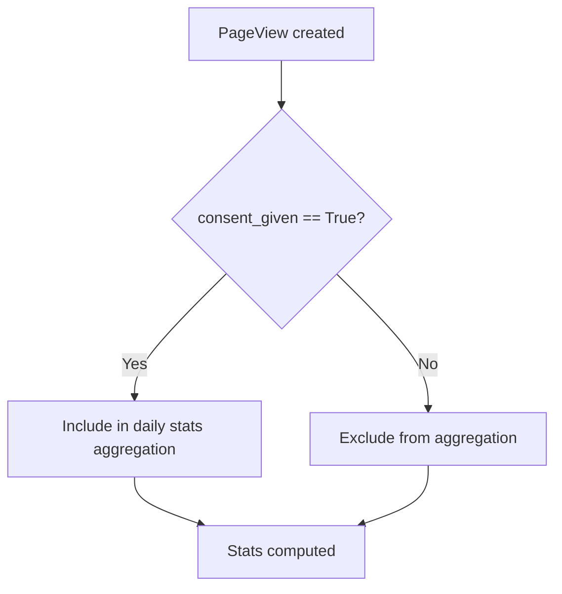

**Diagram sources**
- [models.py:12-62](file://backend/django/apps/analytics/models.py#L12-L62)

**Section sources**
- [models.py:12-62](file://backend/django/apps/analytics/models.py#L12-L62)

### Frontend Consent UIs
- Consent Page: Allows identification by email, displays current consents, toggles per category, and triggers updates via callback.
- Cookie Consent Banner: Presents granular categories (necessary, analytics, marketing, functional), stores preferences with timestamp and version, and emits onConsentChange.
- Admin Consent Dashboard: Displays consent records with filters, statuses, granted/withdrawn timestamps, country, and version; supports search and actions.

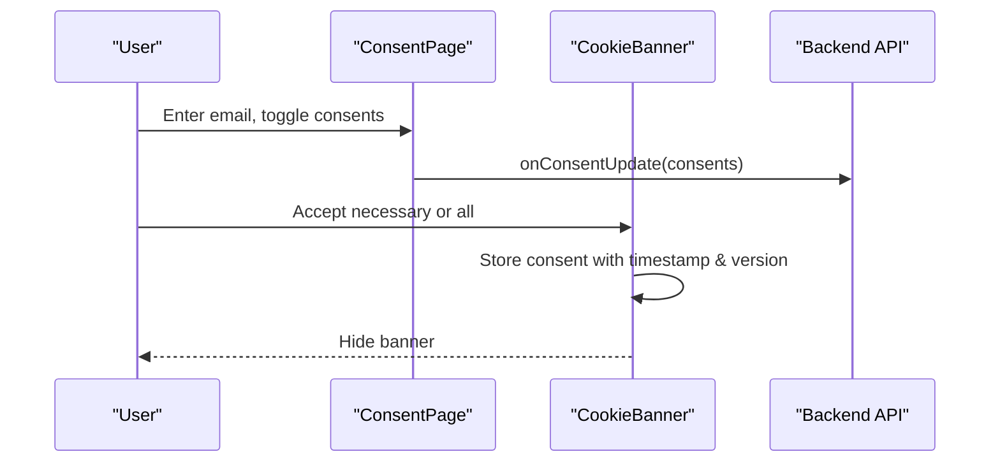

**Diagram sources**
- [consent-page.tsx:201-340](file://frontend/packages/ui/src/components/consent-page.tsx#L201-L340)
- [cookie-consent-banner.tsx:83-138](file://frontend/packages/ui/src/components/cookie-consent-banner.tsx#L83-L138)
- [ConsentDashboard.tsx:97-307](file://frontend/apps/admin-dashboard/src/components/compliance/ConsentDashboard.tsx#L97-L307)

**Section sources**
- [consent-page.tsx:201-340](file://frontend/packages/ui/src/components/consent-page.tsx#L201-L340)
- [cookie-consent-banner.tsx:83-138](file://frontend/packages/ui/src/components/cookie-consent-banner.tsx#L83-L138)
- [ConsentDashboard.tsx:97-307](file://frontend/apps/admin-dashboard/src/components/compliance/ConsentDashboard.tsx#L97-L307)

### Data Subject Rights Integration
- Signals detect consent status changes and log them via audit logger with consent version context.
- DSR service handles rights requests (access, rectification, erasure, restriction, portability, objection) and integrates consent considerations where applicable.

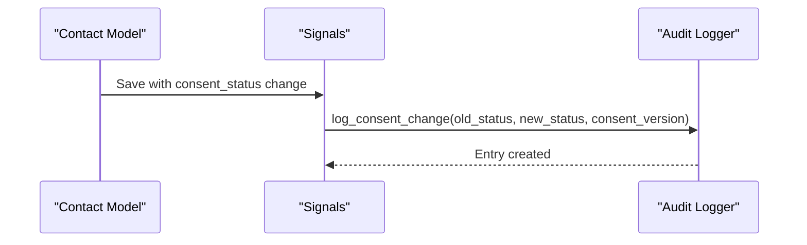

**Diagram sources**
- [signals.py:157-168](file://backend/django/apps/crm/signals.py#L157-L168)
- [audit_logger.py:520-546](file://backend/django/apps/crm/audit_logger.py#L520-L546)

**Section sources**
- [signals.py:157-168](file://backend/django/apps/crm/signals.py#L157-L168)
- [dsr_service.py:36-375](file://backend/django/apps/core/dsr_service.py#L36-L375)

## Dependency Analysis
- ConsentService depends on AuditLog to persist immutable records and uses UUIDs for reference IDs.
- Contact model depends on CRMTenantModel for tenant isolation and integrity hashing; signals trigger audit logging on consent changes.
- Analytics PageView depends on consent flags to gate aggregation; saves enforce tenant context.
- Bitrix24 audit logger depends on hash-chain verification to ensure integrity of consent events.

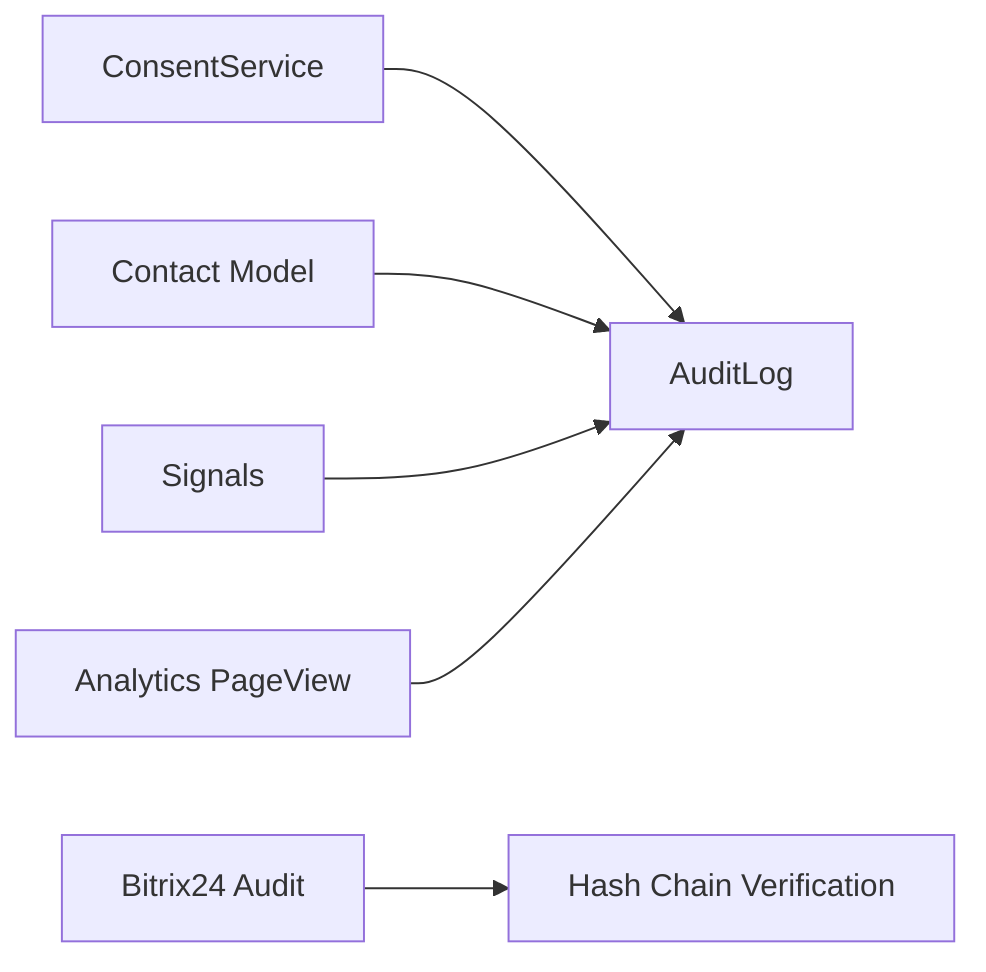

**Diagram sources**
- [dsr_service.py:422-433](file://backend/django/apps/core/dsr_service.py#L422-L433)
- [models.py:197-223](file://backend/django/apps/crm/models.py#L197-L223)
- [signals.py:157-168](file://backend/django/apps/crm/signals.py#L157-L168)
- [models.py:67-105](file://backend/django/apps/analytics/models.py#L67-L105)
- [logger.py:356-403](file://backend/integrations/bitrix24/audit/logger.py#L356-L403)

**Section sources**
- [dsr_service.py:422-433](file://backend/django/apps/core/dsr_service.py#L422-L433)
- [models.py:197-223](file://backend/django/apps/crm/models.py#L197-L223)
- [signals.py:157-168](file://backend/django/apps/crm/signals.py#L157-L168)
- [models.py:67-105](file://backend/django/apps/analytics/models.py#L67-L105)
- [logger.py:356-403](file://backend/integrations/bitrix24/audit/logger.py#L356-L403)

## Performance Considerations
- Indexes on consent-related fields (e.g., organization+consent_given, consent_given+created_at) optimize queries for consent-gated analytics.
- Batch validation in GDPRConsentValidator reduces overhead when assessing multiple subjects.
- Tenant validation in analytics prevents cross-tenant writes, reducing risk and improving data integrity.

[No sources needed since this section provides general guidance]

## Troubleshooting Guide
- Consent not applied: Ensure consent_given flag is set and consent_version matches current banner version; check analytics aggregation excludes non-consented records.
- Withdrawal not effective: Verify withdrawal audit entry exists and no subsequent re-grant; confirm downstream processes respect withdrawal status.
- Integrity issues: Use verify_chain to detect hash mismatches or broken chains in Bitrix24 audit logs; review export_entries for anomalies.
- Compliance gaps: Run GDPRConsentValidator to identify missing or expired consents; use get_compliance_stats to prioritize remediation.

**Section sources**
- [models.py:12-62](file://backend/django/apps/analytics/models.py#L12-L62)
- [logger.py:356-403](file://backend/integrations/bitrix24/audit/logger.py#L356-L403)
- [gdpr_consent_validation.py:174-211](file://data/src/quality/expectations/gdpr_consent_validation.py#L174-L211)

## Conclusion
JOL-HUB’s consent management implements a robust, auditable, and versioned system aligned with GDPR requirements. Consent is centrally recorded, immutably logged, and enforced across analytics and integrations. The platform supports granular consent options, easy withdrawal, and automatic cessation of processing via audit-driven controls. Frontend components provide accessible interfaces for users and administrators, while validation utilities ensure ongoing compliance.

[No sources needed since this section summarizes without analyzing specific files]