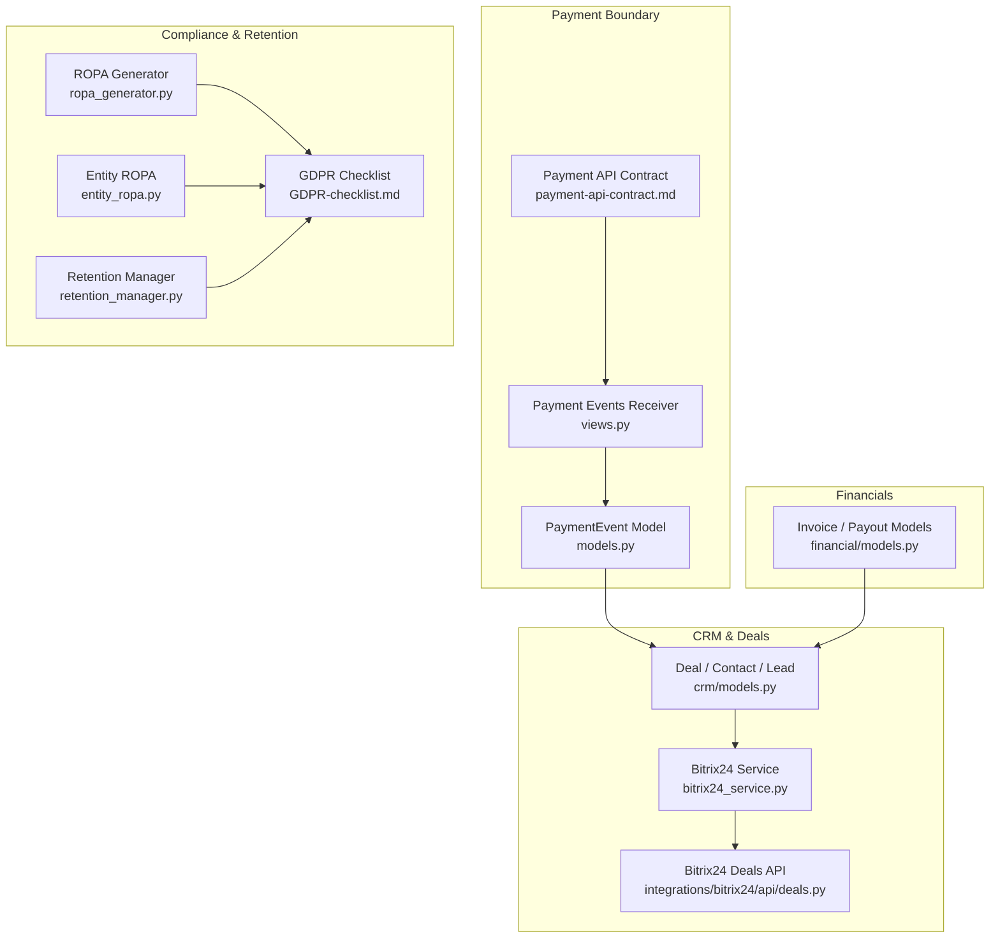
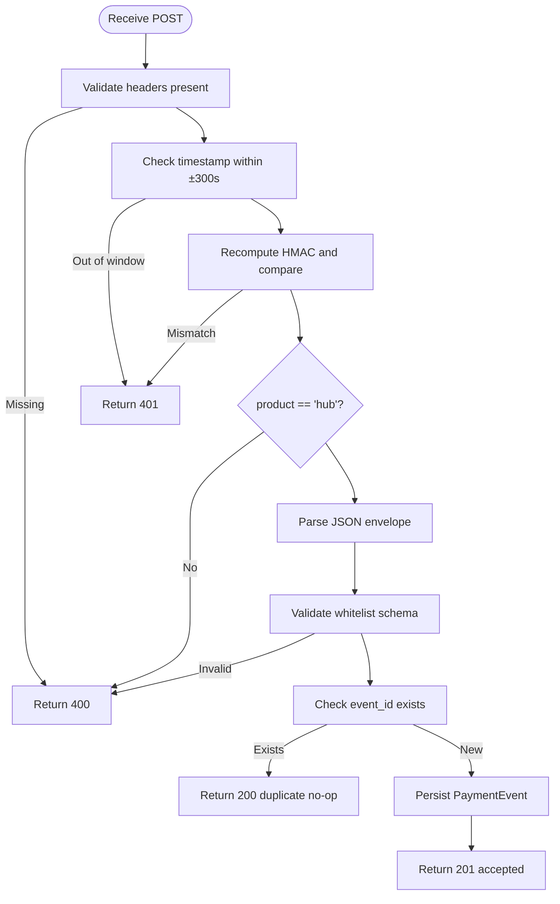
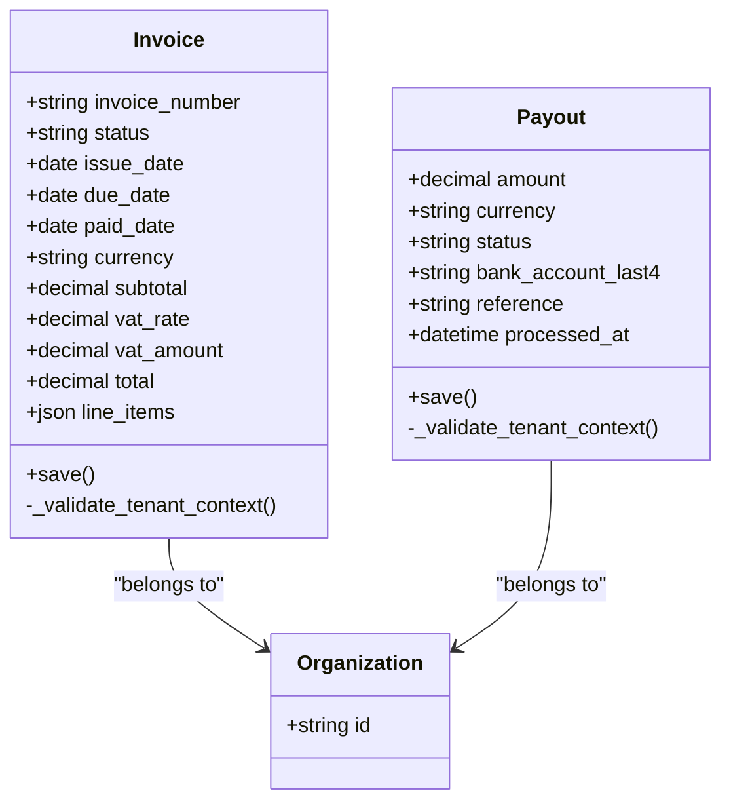
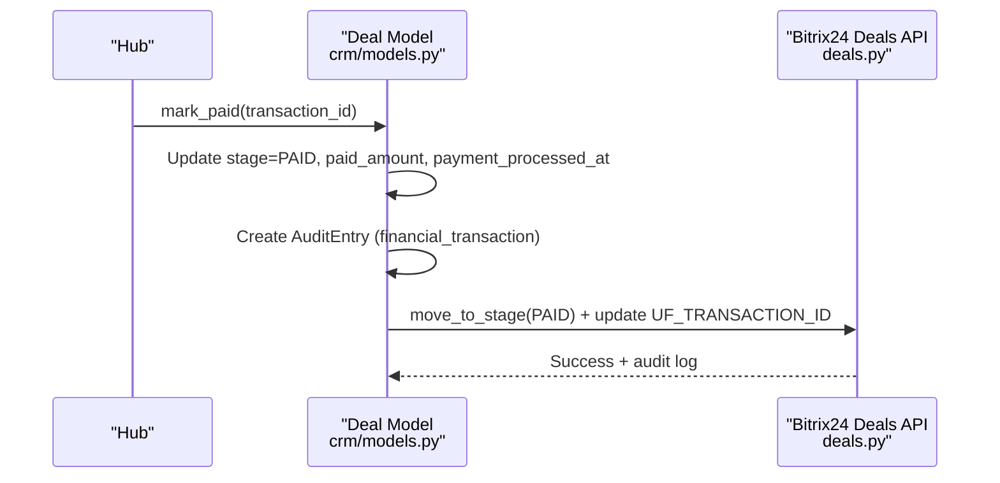
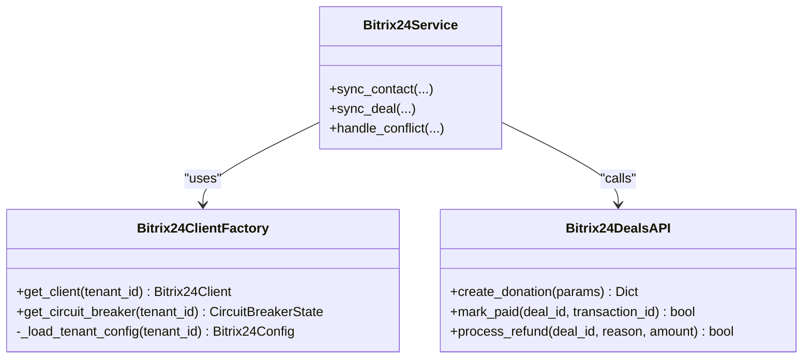
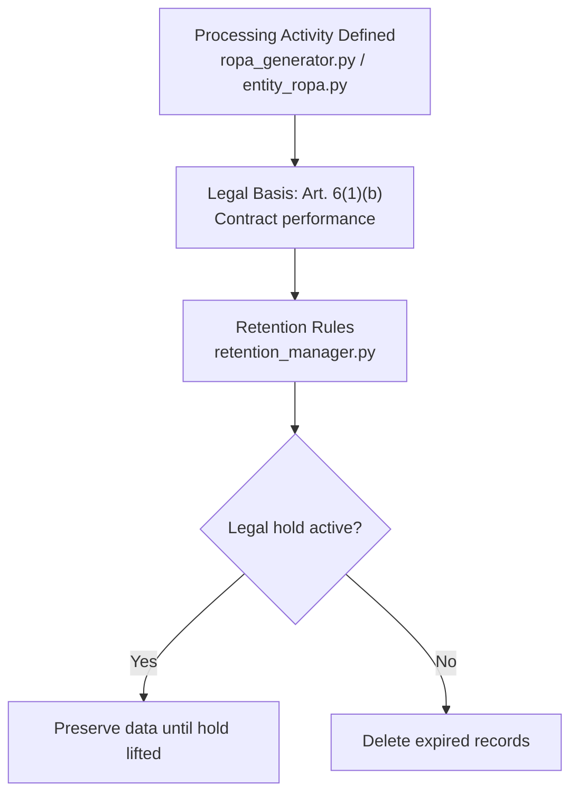
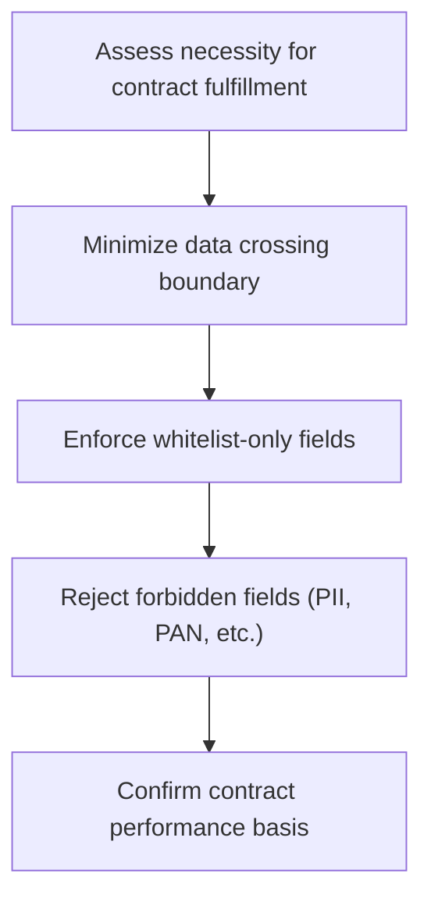
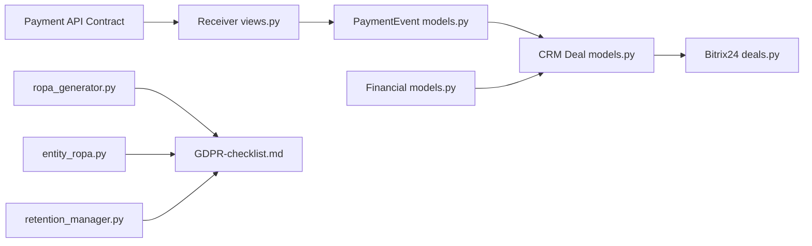

# Contract Performance Processing

<cite>
**Referenced Files in This Document**
- [payment-api-contract.md](file://docs/payment-api-contract.md)
- [views.py](file://backend/django/apps/payment_events/views.py)
- [models.py](file://backend/django/apps/payment_events/models.py)
- [models.py](file://backend/django/apps/financial/models.py)
- [models.py](file://backend/django/apps/crm/models.py)
- [bitrix24_service.py](file://backend/django/apps/crm/bitrix24_service.py)
- [deals.py](file://backend/integrations/bitrix24/api/deals.py)
- [config.py](file://data/src/config.py)
- [entity_ropa.py](file://data/src/gdpr/entity_ropa.py)
- [ropa_generator.py](file://data/src/gdpr/ropa_generator.py)
- [retention_manager.py](file://data/src/gdpr/retention_manager.py)
- [GDPR-checklist.md](file://docs/compliance/GDPR-checklist.md)
</cite>

## Table of Contents
1. [Introduction](#introduction)
2. [Project Structure](#project-structure)
3. [Core Components](#core-components)
4. [Architecture Overview](#architecture-overview)
5. [Detailed Component Analysis](#detailed-component-analysis)
6. [Dependency Analysis](#dependency-analysis)
7. [Performance Considerations](#performance-considerations)
8. [Troubleshooting Guide](#troubleshooting-guide)
9. [Conclusion](#conclusion)

## Introduction
This document explains how JOL-HUB implements processing necessary for contract fulfillment under Article 6(1)(b). It covers service delivery, payment processing, and account management; the contractual necessity assessment; direct links between processing and contract terms; alternatives that avoid excessive data collection; tracking of contract performance; automated order fulfillment; and CRM integration for deal management. It also provides examples of contract clauses specifying data processing, service level agreements (SLAs), and data minimization within contractual obligations, and addresses boundary cases where contract performance may not justify processing and when other lawful bases should be considered.

## Project Structure
JOL-HUB structures contract-performance-related functionality across:
- Payment events receiver and storage to accept signed envelopes from marketplace with minimal data crossing the boundary
- Financial models for invoices and payouts tied to organizations
- CRM models for contacts, leads, and deals capturing contract lifecycle stages and payments
- Bitrix24 integration for deal synchronization and audit logging
- ROPA and retention tooling that explicitly records legal basis as “Contract performance (Art. 6(1)(b))” for relevant activities
- Compliance checklist documenting contract performance requirements



**Diagram sources**
- [payment-api-contract.md:21-83](file://docs/payment-api-contract.md#L21-L83)
- [views.py:79-143](file://backend/django/apps/payment_events/views.py#L79-L143)
- [models.py:1-36](file://backend/django/apps/payment_events/models.py#L1-L36)
- [models.py:14-170](file://backend/django/apps/financial/models.py#L14-L170)
- [models.py:523-771](file://backend/django/apps/crm/models.py#L523-L771)
- [bitrix24_service.py:1-200](file://backend/django/apps/crm/bitrix24_service.py#L1-L200)
- [deals.py:235-350](file://backend/integrations/bitrix24/api/deals.py#L235-L350)
- [ropa_generator.py:45-80](file://data/src/gdpr/ropa_generator.py#L45-L80)
- [entity_ropa.py:406-468](file://data/src/gdpr/entity_ropa.py#L406-L468)
- [retention_manager.py:78-226](file://data/src/gdpr/retention_manager.py#L78-L226)
- [GDPR-checklist.md:45-71](file://docs/compliance/GDPR-checklist.md#L45-L71)

**Section sources**
- [payment-api-contract.md:21-83](file://docs/payment-api-contract.md#L21-L83)
- [views.py:79-143](file://backend/django/apps/payment_events/views.py#L79-L143)
- [models.py:1-36](file://backend/django/apps/payment_events/models.py#L1-L36)
- [models.py:14-170](file://backend/django/apps/financial/models.py#L14-L170)
- [models.py:523-771](file://backend/django/apps/crm/models.py#L523-L771)
- [bitrix24_service.py:1-200](file://backend/django/apps/crm/bitrix24_service.py#L1-L200)
- [deals.py:235-350](file://backend/integrations/bitrix24/api/deals.py#L235-L350)
- [ropa_generator.py:45-80](file://data/src/gdpr/ropa_generator.py#L45-L80)
- [entity_ropa.py:406-468](file://data/src/gdpr/entity_ropa.py#L406-L468)
- [retention_manager.py:78-226](file://data/src/gdpr/retention_manager.py#L78-L226)
- [GDPR-checklist.md:45-71](file://docs/compliance/GDPR-checklist.md#L45-L71)

## Core Components
- Payment events receiver validates a signed envelope, enforces replay protection, deduplicates by event_id, and persists only the whitelisted fields. This supports contract performance by recording payment facts without personal data crossing the boundary.
- Financial models track invoices and payouts per organization with tenant isolation checks to prevent cross-tenant manipulation.
- CRM Deal model captures contract type, stage, amounts, payment details, and dates, with methods to mark paid and log financial transactions for audit compliance.
- Bitrix24 integration synchronizes deals and contacts, updates stages on payment success/refund, and logs financial transactions for PCI-DSS compliance.
- ROPA and retention tooling record legal basis as “Contract performance (Art. 6(1)(b))” for donation processing and user account management, and enforce retention rules with legal hold safeguards.
- Compliance checklist documents contract performance criteria including necessity, clear terms, alternatives without excessive data, and documented tracking.

**Section sources**
- [payment-api-contract.md:84-177](file://docs/payment-api-contract.md#L84-L177)
- [views.py:79-143](file://backend/django/apps/payment_events/views.py#L79-L143)
- [models.py:1-36](file://backend/django/apps/payment_events/models.py#L1-L36)
- [models.py:14-170](file://backend/django/apps/financial/models.py#L14-L170)
- [models.py:523-771](file://backend/django/apps/crm/models.py#L523-L771)
- [deals.py:235-350](file://backend/integrations/bitrix24/api/deals.py#L235-L350)
- [ropa_generator.py:45-80](file://data/src/gdpr/ropa_generator.py#L45-L80)
- [entity_ropa.py:406-468](file://data/src/gdpr/entity_ropa.py#L406-L468)
- [retention_manager.py:78-226](file://data/src/gdpr/retention_manager.py#L78-L226)
- [GDPR-checklist.md:45-71](file://docs/compliance/GDPR-checklist.md#L45-L71)

## Architecture Overview
The contract performance architecture centers on a closed payment boundary that accepts minimal, non-personal payment facts, then correlates them hub-side to contracts and CRM deals. The flow ensures at-least-once delivery, idempotent acceptance, and status precedence based on occurrence time. CRM stages reflect contract fulfillment milestones, and financial records are maintained for reconciliation and transparency reporting.

```mermaid
sequenceDiagram
participant MKT as "Marketplace Payments"
participant HUB as "Hub Receiver<br/>views.py"
participant DB as "PaymentEvent Store<br/>models.py"
participant CRM as "CRM Deal<br/>crm/models.py"
participant BIT as "Bitrix24 API<br/>deals.py"
MKT->>HUB : POST /internal/v1/payment-events (signed envelope)
HUB->>HUB : Verify headers, timestamp window, HMAC signature
HUB->>DB : Persist PaymentEvent (idempotent by event_id)
HUB-->>MKT : 200 accepted or duplicate no-op
Note over HUB,DB : Status precedence applied by occurred_at; terminal states outrank pending
HUB->>CRM : Correlate via payment_intent_id; update stage (e.g., PAID)
CRM->>BIT : Sync deal stage and transaction metadata
BIT-->>CRM : Confirmation + audit log entry
```

**Diagram sources**
- [payment-api-contract.md:21-83](file://docs/payment-api-contract.md#L21-L83)
- [views.py:79-143](file://backend/django/apps/payment_events/views.py#L79-L143)
- [models.py:1-36](file://backend/django/apps/payment_events/models.py#L1-L36)
- [models.py:523-771](file://backend/django/apps/crm/models.py#L523-L771)
- [deals.py:235-350](file://backend/integrations/bitrix24/api/deals.py#L235-L350)

## Detailed Component Analysis

### Payment Events Receiver and Storage
- Validates presence of required headers, enforces ±300 s replay window, recomputes HMAC-SHA256 signature in constant time, and rejects misrouted products.
- Persists only the whitelimited envelope fields; unknown fields are ignored. Deduplication by event_id ensures idempotent acceptance.
- Enforces “persist-before-process” durable acceptance before any downstream side effects.



**Diagram sources**
- [payment-api-contract.md:21-83](file://docs/payment-api-contract.md#L21-L83)
- [views.py:79-143](file://backend/django/apps/payment_events/views.py#L79-L143)

**Section sources**
- [payment-api-contract.md:21-83](file://docs/payment-api-contract.md#L21-L83)
- [views.py:79-143](file://backend/django/apps/payment_events/views.py#L79-L143)
- [models.py:1-36](file://backend/django/apps/payment_events/models.py#L1-L36)

### Financial Models: Invoices and Payouts
- Invoice and Payout models tie financial records to organizations with tenant context validation to prevent cross-tenant manipulation.
- Fields capture currency, amounts, VAT, statuses, and processing timestamps to support accounting and reconciliation under contract performance and legal obligations.



**Diagram sources**
- [models.py:14-170](file://backend/django/apps/financial/models.py#L14-L170)

**Section sources**
- [models.py:14-170](file://backend/django/apps/financial/models.py#L14-L170)

### CRM Deal Model and Automated Fulfillment
- Deal model tracks contract types (e.g., maintenance contract, preneed contract), stages (new, pending_payment, paid, completed, refunded), amounts, payment method, and timestamps.
- Methods mark deals as paid, update payment details, and create audit entries for financial transactions.
- Integration with Bitrix24 updates deal stages and logs financial transactions for PCI-DSS compliance.



**Diagram sources**
- [models.py:523-771](file://backend/django/apps/crm/models.py#L523-L771)
- [deals.py:235-350](file://backend/integrations/bitrix24/api/deals.py#L235-L350)

**Section sources**
- [models.py:523-771](file://backend/django/apps/crm/models.py#L523-L771)
- [deals.py:235-350](file://backend/integrations/bitrix24/api/deals.py#L235-L350)

### Bitrix24 Integration for Deal Management
- Provides tenant-aware client factory, retry with circuit breaker, and conflict resolution strategies.
- Synchronizes contacts and deals, updates deal stages on payment success/refund, and logs financial transactions for audit compliance.



**Diagram sources**
- [bitrix24_service.py:1-200](file://backend/django/apps/crm/bitrix24_service.py#L1-L200)
- [deals.py:235-350](file://backend/integrations/bitrix24/api/deals.py#L235-L350)

**Section sources**
- [bitrix24_service.py:1-200](file://backend/django/apps/crm/bitrix24_service.py#L1-L200)
- [deals.py:235-350](file://backend/integrations/bitrix24/api/deals.py#L235-L350)

### Lawful Basis Registration and Retention
- ROPA generator and entity ROPA define processing activities with legal basis “Contract performance (Art. 6(1)(b))” for donation processing and user account management.
- Retention manager enforces retention periods and legal holds, ensuring erasure rights do not override legal obligations during active holds.



**Diagram sources**
- [ropa_generator.py:45-80](file://data/src/gdpr/ropa_generator.py#L45-L80)
- [entity_ropa.py:406-468](file://data/src/gdpr/entity_ropa.py#L406-L468)
- [retention_manager.py:78-226](file://data/src/gdpr/retention_manager.py#L78-L226)

**Section sources**
- [ropa_generator.py:45-80](file://data/src/gdpr/ropa_generator.py#L45-L80)
- [entity_ropa.py:406-468](file://data/src/gdpr/entity_ropa.py#L406-L468)
- [retention_manager.py:78-226](file://data/src/gdpr/retention_manager.py#L78-L226)

### Contractual Necessity Assessment and Alternatives
- The payment boundary is designed to carry only payment facts plus minimum tenant correlation, avoiding personal data crossing the boundary. This aligns with data minimization and supports contract performance.
- Alternative service options without excessive data collection are reflected in the strict whitelist and forbidden fields policy.



**Diagram sources**
- [payment-api-contract.md:147-177](file://docs/payment-api-contract.md#L147-L177)

**Section sources**
- [payment-api-contract.md:147-177](file://docs/payment-api-contract.md#L147-L177)

## Dependency Analysis
- Payment events receiver depends on the ratified internal API contract for authentication, transport, delivery semantics, and payload schema.
- CRM Deal model depends on organization context and integrates with Bitrix24 for external deal state synchronization.
- Financial models depend on organization context and validate tenant boundaries to ensure isolation.
- ROPA and retention tools depend on defined processing activities and retention rules to enforce lawful basis and data lifecycle.



**Diagram sources**
- [payment-api-contract.md:21-83](file://docs/payment-api-contract.md#L21-L83)
- [views.py:79-143](file://backend/django/apps/payment_events/views.py#L79-L143)
- [models.py:1-36](file://backend/django/apps/payment_events/models.py#L1-L36)
- [models.py:523-771](file://backend/django/apps/crm/models.py#L523-L771)
- [deals.py:235-350](file://backend/integrations/bitrix24/api/deals.py#L235-L350)
- [models.py:14-170](file://backend/django/apps/financial/models.py#L14-L170)
- [ropa_generator.py:45-80](file://data/src/gdpr/ropa_generator.py#L45-L80)
- [entity_ropa.py:406-468](file://data/src/gdpr/entity_ropa.py#L406-L468)
- [retention_manager.py:78-226](file://data/src/gdpr/retention_manager.py#L78-L226)
- [GDPR-checklist.md:45-71](file://docs/compliance/GDPR-checklist.md#L45-L71)

**Section sources**
- [payment-api-contract.md:21-83](file://docs/payment-api-contract.md#L21-L83)
- [views.py:79-143](file://backend/django/apps/payment_events/views.py#L79-L143)
- [models.py:1-36](file://backend/django/apps/payment_events/models.py#L1-L36)
- [models.py:523-771](file://backend/django/apps/crm/models.py#L523-L771)
- [deals.py:235-350](file://backend/integrations/bitrix24/api/deals.py#L235-L350)
- [models.py:14-170](file://backend/django/apps/financial/models.py#L14-L170)
- [ropa_generator.py:45-80](file://data/src/gdpr/ropa_generator.py#L45-L80)
- [entity_ropa.py:406-468](file://data/src/gdpr/entity_ropa.py#L406-L468)
- [retention_manager.py:78-226](file://data/src/gdpr/retention_manager.py#L78-L226)
- [GDPR-checklist.md:45-71](file://docs/compliance/GDPR-checklist.md#L45-L71)

## Performance Considerations
- Idempotent acceptance by event_id prevents duplicate processing and reduces load on downstream systems.
- Status precedence by occurred_at ensures correct state transitions even with out-of-order or replayed events.
- Tenant isolation checks in financial and CRM models prevent cross-tenant operations, reducing risk and potential rework.
- Circuit breaker and retry patterns in Bitrix24 integration protect against transient failures and rate limits.

[No sources needed since this section provides general guidance]

## Troubleshooting Guide
- Signature mismatch or timestamp outside window returns 401; verify delivery key rotation and clock synchronization.
- Misrouted product header returns 400; ensure sender uses product label “hub”.
- Duplicate event_id returns 200 no-op; confirm upstream dedupe logic and idempotency expectations.
- Cross-tenant attempts in financial or CRM models raise validation errors; check tenant context middleware and request scoping.
- Retention deletion respects legal holds; verify hold registry and approval workflows before purging data.

**Section sources**
- [payment-api-contract.md:21-83](file://docs/payment-api-contract.md#L21-L83)
- [views.py:79-143](file://backend/django/apps/payment_events/views.py#L79-L143)
- [models.py:14-170](file://backend/django/apps/financial/models.py#L14-L170)
- [models.py:523-771](file://backend/django/apps/crm/models.py#L523-L771)
- [retention_manager.py:78-226](file://data/src/gdpr/retention_manager.py#L78-L226)

## Conclusion
JOL-HUB implements contract performance processing under Article 6(1)(b) through a tightly controlled payment boundary, robust CRM deal lifecycle management, and explicit lawful basis registration. The design emphasizes data minimization, idempotent processing, tenant isolation, and auditability. Where contract performance does not justify processing—such as marketing analytics or optional features—other lawful bases (consent or legitimate interest) should be considered and documented accordingly.

[No sources needed since this section summarizes without analyzing specific files]