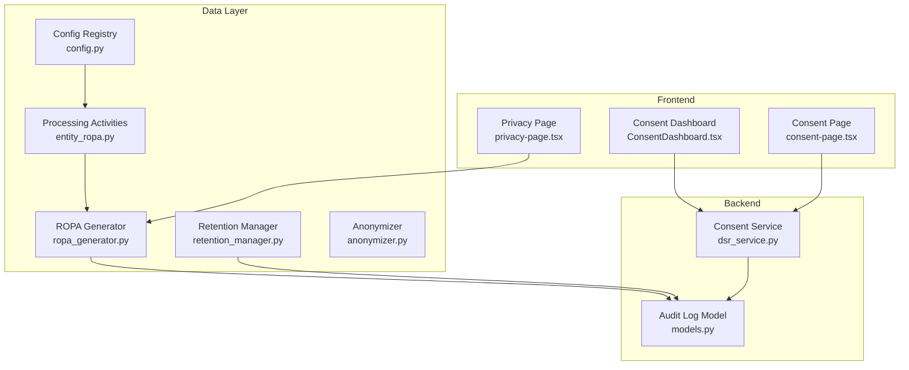
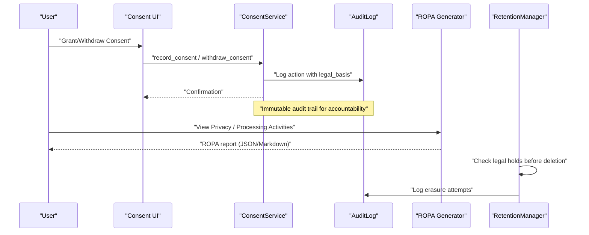
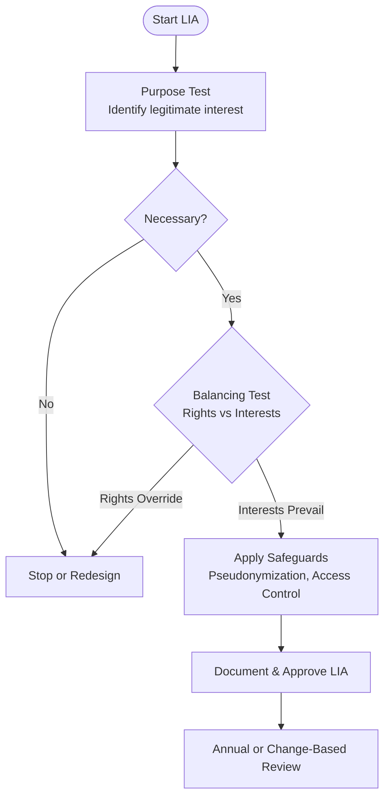
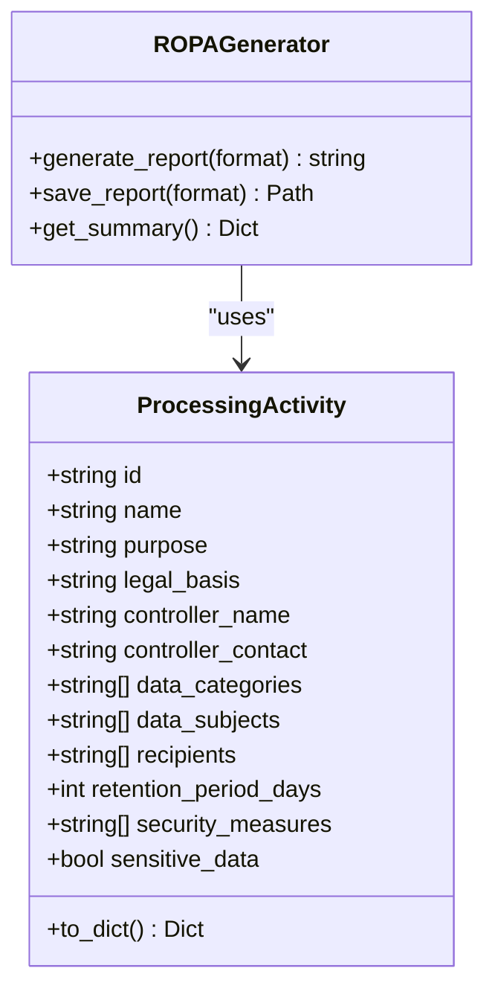
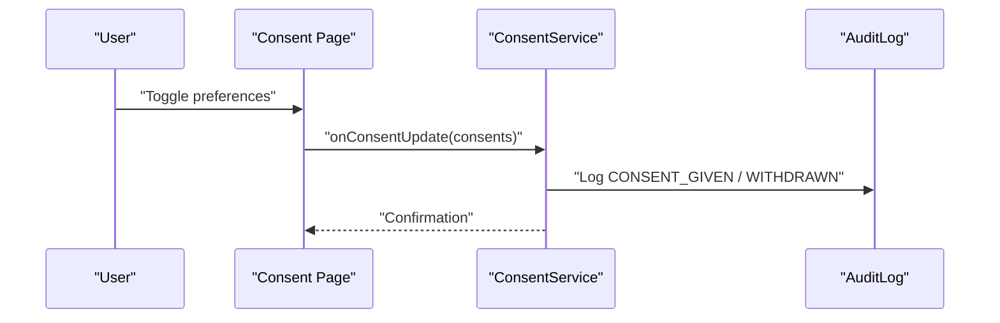
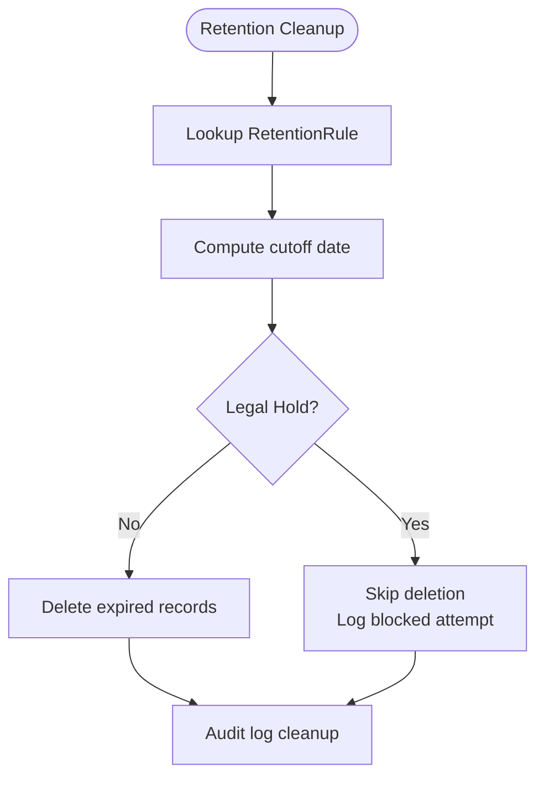
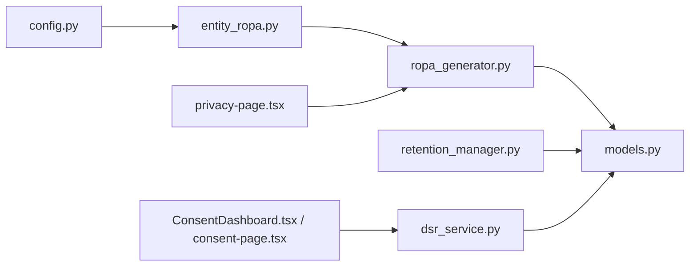

# Lawful Basis & Processing Activities

<cite>
**Referenced Files in This Document**
- [entity_ropa.py](file://data/src/gdpr/entity_ropa.py)
- [ropa_generator.py](file://data/src/gdpr/ropa_generator.py)
- [retention_manager.py](file://data/src/gdpr/retention_manager.py)
- [anonymizer.py](file://data/src/gdpr/anonymizer.py)
- [config.py](file://data/src/config.py)
- [models.py](file://backend/django/apps/core/models.py)
- [dsr_service.py](file://backend/django/apps/core/dsr_service.py)
- [ConsentDashboard.tsx](file://frontend/apps/admin-dashboard/src/components/compliance/ConsentDashboard.tsx)
- [consent-page.tsx](file://frontend/packages/ui/src/components/consent-page.tsx)
- [privacy-page.tsx](file://frontend/packages/ui/src/components/privacy-page.tsx)
- [GDPR-checklist.md](file://docs/compliance/GDPR-checklist.md)
- [test_compliance.py](file://data/tests/test_compliance.py)
</cite>

## Table of Contents
1. Introduction
2. Project Structure
3. Core Components
4. Architecture Overview
5. Detailed Component Analysis
6. Dependency Analysis
7. Performance Considerations
8. Troubleshooting Guide
9. Conclusion
10. Appendices

## Introduction
This document explains how JOL-HUB determines lawful bases for processing and manages processing activities across its platform. It covers:
- Article 6 lawful bases: consent, contract performance, legal obligation, legitimate interests
- Legitimate Interest Assessment (LIA): purpose test, necessity test, balancing test
- Processing activities registry and per-activity lawful basis assignment
- Regular review processes and retention aligned with lawful basis
- Special category data under Article 9, including explicit consent and enhanced safeguards
- Data minimization and purpose limitation enforcement
- Practical examples, templates, and workflows for assessment and approval

## Project Structure
JOL-HUB implements GDPR compliance through a combination of backend services, data modules, and frontend interfaces:
- Data module defines processing activities, retention rules, anonymization, and ROPA generation
- Backend core models provide audit logging and consent management
- Frontend provides consent UIs and privacy notices
- Compliance documentation outlines policies and checklists

**Diagram sources**
- [entity_ropa.py:39-65](file://data/src/gdpr/entity_ropa.py#L39-L65)
- [ropa_generator.py:103-182](file://data/src/gdpr/ropa_generator.py#L103-L182)
- [retention_manager.py:188-336](file://data/src/gdpr/retention_manager.py#L188-L336)
- [anonymizer.py:106-180](file://data/src/gdpr/anonymizer.py#L106-L180)
- [config.py:85-123](file://data/src/config.py#L85-L123)
- [models.py:67-227](file://backend/django/apps/core/models.py#L67-L227)
- [dsr_service.py:378-472](file://backend/django/apps/core/dsr_service.py#L378-L472)
- [ConsentDashboard.tsx:137-307](file://frontend/apps/admin-dashboard/src/components/compliance/ConsentDashboard.tsx#L137-L307)
- [consent-page.tsx:241-278](file://frontend/packages/ui/src/components/consent-page.tsx#L241-L278)
- [privacy-page.tsx:241-271](file://frontend/packages/ui/src/components/privacy-page.tsx#L241-L271)

**Section sources**
- [entity_ropa.py:39-65](file://data/src/gdpr/entity_ropa.py#L39-L65)
- [ropa_generator.py:103-182](file://data/src/gdpr/ropa_generator.py#L103-L182)
- [retention_manager.py:188-336](file://data/src/gdpr/retention_manager.py#L188-L336)
- [anonymizer.py:106-180](file://data/src/gdpr/anonymizer.py#L106-L180)
- [config.py:85-123](file://data/src/config.py#L85-L123)
- [models.py:67-227](file://backend/django/apps/core/models.py#L67-L227)
- [dsr_service.py:378-472](file://backend/django/apps/core/dsr_service.py#L378-L472)
- [ConsentDashboard.tsx:137-307](file://frontend/apps/admin-dashboard/src/components/compliance/ConsentDashboard.tsx#L137-L307)
- [consent-page.tsx:241-278](file://frontend/packages/ui/src/components/consent-page.tsx#L241-L278)
- [privacy-page.tsx:241-271](file://frontend/packages/ui/src/components/privacy-page.tsx#L241-L271)

## Core Components
- Processing activities registry: Centralized list of processing operations with purposes, lawful bases, data categories, subjects, recipients, retention, and security measures
- ROPA generator: Produces Records of Processing Activities reports in JSON or Markdown
- Retention manager: Enforces storage limitation and right to erasure with legal hold checks
- Anonymizer: Implements k-anonymity thresholds by country to support legitimate interest analytics
- Consent service: Records, withdraws, and verifies consent; logs actions to immutable audit trail
- Audit log model: Tamper-evident records for all data changes and GDPR-related actions

Key implementation highlights:
- Entity-specific processing activities are generated per entity type with lawful basis annotations
- Retention rules include legal basis references and require approvals for certain types
- K-anonymity values vary by country to meet regulatory guidance
- Consent flows integrate with audit logging and versioning

**Section sources**
- [entity_ropa.py:39-65](file://data/src/gdpr/entity_ropa.py#L39-L65)
- [entity_ropa.py:68-98](file://data/src/gdpr/entity_ropa.py#L68-L98)
- [ropa_generator.py:19-43](file://data/src/gdpr/ropa_generator.py#L19-L43)
- [retention_manager.py:78-106](file://data/src/gdpr/retention_manager.py#L78-L106)
- [anonymizer.py:25-83](file://data/src/gdpr/anonymizer.py#L25-L83)
- [dsr_service.py:378-472](file://backend/django/apps/core/dsr_service.py#L378-L472)
- [models.py:67-227](file://backend/django/apps/core/models.py#L67-L227)

## Architecture Overview
The lawful basis determination and processing activity management architecture integrates configuration-driven definitions, automated reporting, retention enforcement, and user-facing consent controls.

**Diagram sources**
- [dsr_service.py:378-472](file://backend/django/apps/core/dsr_service.py#L378-L472)
- [models.py:67-227](file://backend/django/apps/core/models.py#L67-L227)
- [ropa_generator.py:121-182](file://data/src/gdpr/ropa_generator.py#L121-L182)
- [retention_manager.py:206-336](file://data/src/gdpr/retention_manager.py#L206-L336)

## Detailed Component Analysis

### Lawful Basis Determination (Article 6)
- Consent: Explicit, granular, withdrawable; recorded with timestamp, IP, user agent, and version
- Contract performance: Used for donations, event registrations, payments where necessary to fulfill contracts
- Legal obligation: Applied for interment records and financial retention where required by law
- Legitimate interests: Used for analytics and internal coordination with documented assessments

Implementation anchors:
- Processing activities define lawful basis per operation
- Consent flows record and verify consent
- Analytics rely on pseudonymization and k-anonymity thresholds

Practical example:
- Donation processing uses contract performance; obituary publishing uses consent; grave search uses legitimate interest; interment records use legal obligation

**Section sources**
- [entity_ropa.py:111-165](file://data/src/gdpr/entity_ropa.py#L111-L165)
- [entity_ropa.py:410-468](file://data/src/gdpr/entity_ropa.py#L410-L468)
- [entity_ropa.py:607-632](file://data/src/gdpr/entity_ropa.py#L607-L632)
- [entity_ropa.py:654-720](file://data/src/gdpr/entity_ropa.py#L654-L720)
- [config.py:85-123](file://data/src/config.py#L85-L123)
- [anonymizer.py:25-83](file://data/src/gdpr/anonymizer.py#L25-L83)

### Legitimate Interest Assessment (LIA) Framework
- Purpose test: Identify clear legitimate interest (e.g., analytics, internal coordination)
- Necessity test: Ensure processing is necessary and proportionate
- Balancing test: Confirm rights and freedoms do not override interests; apply safeguards like pseudonymization and access controls

Operationalization:
- LIA checklist requires documentation and annual review
- Analytics activities use pseudonymization and k-anonymity thresholds
- Public-facing features (grave search) restrict access and limit data exposure

**Diagram sources**
- [GDPR-checklist.md:61-68](file://docs/compliance/GDPR-checklist.md#L61-L68)
- [anonymizer.py:25-83](file://data/src/gdpr/anonymizer.py#L25-L83)
- [entity_ropa.py:707-720](file://data/src/gdpr/entity_ropa.py#L707-L720)

**Section sources**
- [GDPR-checklist.md:61-68](file://docs/compliance/GDPR-checklist.md#L61-L68)
- [anonymizer.py:25-83](file://data/src/gdpr/anonymizer.py#L25-L83)
- [entity_ropa.py:707-720](file://data/src/gdpr/entity_ropa.py#L707-L720)

### Processing Activities Registry and Assignment
- Central registry defines each activity’s purpose, lawful basis, data categories, subjects, recipients, retention, and security measures
- Entity-specific generators produce tailored lists for basilica, cathedral, diocese, deanery, church, protestant, orthodox, greek catholic, funeral, cemetery
- Tests enforce presence of legal basis and required fields

**Diagram sources**
- [ropa_generator.py:19-43](file://data/src/gdpr/ropa_generator.py#L19-L43)
- [ropa_generator.py:103-182](file://data/src/gdpr/ropa_generator.py#L103-L182)

**Section sources**
- [entity_ropa.py:39-65](file://data/src/gdpr/entity_ropa.py#L39-L65)
- [entity_ropa.py:68-98](file://data/src/gdpr/entity_ropa.py#L68-L98)
- [ropa_generator.py:19-43](file://data/src/gdpr/ropa_generator.py#L19-L43)
- [test_compliance.py:65-88](file://data/tests/test_compliance.py#L65-L88)

### Consent Management and Withdrawal
- Consent collection captures granular permissions, versions, and metadata
- Withdrawal is as easy as giving consent; immediate effect enforced
- Audit trail records consent given/withdrawn with legal basis context

**Diagram sources**
- [consent-page.tsx:241-278](file://frontend/packages/ui/src/components/consent-page.tsx#L241-L278)
- [dsr_service.py:378-472](file://backend/django/apps/core/dsr_service.py#L378-L472)
- [models.py:67-227](file://backend/django/apps/core/models.py#L67-L227)

**Section sources**
- [ConsentDashboard.tsx:137-307](file://frontend/apps/admin-dashboard/src/components/compliance/ConsentDashboard.tsx#L137-L307)
- [consent-page.tsx:241-278](file://frontend/packages/ui/src/components/consent-page.tsx#L241-L278)
- [dsr_service.py:378-472](file://backend/django/apps/core/dsr_service.py#L378-L472)
- [models.py:67-227](file://backend/django/apps/core/models.py#L67-L227)

### Special Category Data (Article 9)
- Prohibited unless an exception applies; religious institutions may process members’ data under specific conditions
- Enhanced safeguards: explicit consent documented separately, encryption with separate keys, restricted access, mandatory audit logging, strict retention, DPIA always required

Operational notes:
- Entity-specific activities mark sensitive_data when applicable
- Security measures include canonical seal, encryption, access control, and audit logging

**Section sources**
- [GDPR-checklist.md:634-670](file://docs/compliance/GDPR-checklist.md#L634-L670)
- [entity_ropa.py:111-165](file://data/src/gdpr/entity_ropa.py#L111-L165)
- [entity_ropa.py:236-290](file://data/src/gdpr/entity_ropa.py#L236-L290)
- [entity_ropa.py:348-403](file://data/src/gdpr/entity_ropa.py#L348-L403)

### Retention Policies Aligned with Lawful Basis
- Retention rules reference legal basis (e.g., Canon Law + GDPR Art. 6(1)(c), Art. 5(1)(e), Art. 30(3))
- Deletion blocked by active legal holds; audit logs capture attempts
- Per-entity activities specify retention periods tied to their lawful basis

**Diagram sources**
- [retention_manager.py:78-106](file://data/src/gdpr/retention_manager.py#L78-L106)
- [retention_manager.py:206-336](file://data/src/gdpr/retention_manager.py#L206-L336)

**Section sources**
- [retention_manager.py:78-106](file://data/src/gdpr/retention_manager.py#L78-L106)
- [retention_manager.py:206-336](file://data/src/gdpr/retention_manager.py#L206-L336)
- [entity_ropa.py:607-720](file://data/src/gdpr/entity_ropa.py#L607-L720)

### Data Minimization and Purpose Limitation
- Data classification and processing activities define minimal necessary categories
- Purpose limitation enforced via explicit purpose fields and validation checks
- Anonymization reduces identifiability for analytics

**Section sources**
- [config.py:12-27](file://data/src/config.py#L12-L27)
- [config.py:85-123](file://data/src/config.py#L85-L123)
- [anonymizer.py:106-180](file://data/src/gdpr/anonymizer.py#L106-L180)
- [test_compliance.py:175-195](file://data/tests/test_compliance.py#L175-L195)

### Templates and Workflows
- LIA template: Purpose test, necessity test, balancing test, safeguards, approval, review schedule
- Consent workflow: Collect granular consent, store with metadata, enable one-click withdrawal, log to audit trail
- ROPA maintenance: Quarterly reviews, update on changes, maintain version history

**Section sources**
- [GDPR-checklist.md:61-68](file://docs/compliance/GDPR-checklist.md#L61-L68)
- [ConsentDashboard.tsx:137-307](file://frontend/apps/admin-dashboard/src/components/compliance/ConsentDashboard.tsx#L137-L307)
- [privacy-page.tsx:241-271](file://frontend/packages/ui/src/components/privacy-page.tsx#L241-L271)

## Dependency Analysis

**Diagram sources**
- [config.py:85-123](file://data/src/config.py#L85-L123)
- [entity_ropa.py:39-65](file://data/src/gdpr/entity_ropa.py#L39-L65)
- [ropa_generator.py:103-182](file://data/src/gdpr/ropa_generator.py#L103-L182)
- [models.py:67-227](file://backend/django/apps/core/models.py#L67-L227)
- [retention_manager.py:188-336](file://data/src/gdpr/retention_manager.py#L188-L336)
- [dsr_service.py:378-472](file://backend/django/apps/core/dsr_service.py#L378-L472)
- [ConsentDashboard.tsx:137-307](file://frontend/apps/admin-dashboard/src/components/compliance/ConsentDashboard.tsx#L137-L307)
- [consent-page.tsx:241-278](file://frontend/packages/ui/src/components/consent-page.tsx#L241-L278)
- [privacy-page.tsx:241-271](file://frontend/packages/ui/src/components/privacy-page.tsx#L241-L271)

**Section sources**
- [config.py:85-123](file://data/src/config.py#L85-L123)
- [entity_ropa.py:39-65](file://data/src/gdpr/entity_ropa.py#L39-L65)
- [ropa_generator.py:103-182](file://data/src/gdpr/ropa_generator.py#L103-L182)
- [models.py:67-227](file://backend/django/apps/core/models.py#L67-L227)
- [retention_manager.py:188-336](file://data/src/gdpr/retention_manager.py#L188-L336)
- [dsr_service.py:378-472](file://backend/django/apps/core/dsr_service.py#L378-L472)
- [ConsentDashboard.tsx:137-307](file://frontend/apps/admin-dashboard/src/components/compliance/ConsentDashboard.tsx#L137-L307)
- [consent-page.tsx:241-278](file://frontend/packages/ui/src/components/consent-page.tsx#L241-L278)
- [privacy-page.tsx:241-271](file://frontend/packages/ui/src/components/privacy-page.tsx#L241-L271)

## Performance Considerations
- Batch processing limits and timeouts configured to avoid long-running jobs that could delay retention or DSAR fulfillment
- Anonymization uses efficient hashing and grouping; k-anonymity checks scale with dataset size
- Audit logging adds overhead but ensures accountability; consider indexing and partitioning for high-volume environments
- Retention cleanup should be scheduled off-peak to minimize impact

[No sources needed since this section provides general guidance]

## Troubleshooting Guide
Common issues and resolutions:
- Consent not recorded: Verify consent UI calls consent service and audit logging; ensure versioning and metadata captured
- Erasure blocked unexpectedly: Check legal hold registry; lift holds when appropriate and reattempt deletion
- ROPA missing lawful basis: Validate processing activities registry includes legal_basis for all entries; run tests to enforce compliance
- Analytics non-compliant: Adjust k-anonymity thresholds per country; ensure pseudonymization applied

**Section sources**
- [retention_manager.py:206-336](file://data/src/gdpr/retention_manager.py#L206-L336)
- [dsr_service.py:378-472](file://backend/django/apps/core/dsr_service.py#L378-L472)
- [test_compliance.py:65-88](file://data/tests/test_compliance.py#L65-L88)
- [anonymizer.py:106-180](file://data/src/gdpr/anonymizer.py#L106-L180)

## Conclusion
JOL-HUB implements robust lawful basis determination and processing activity management through:
- Clear mapping of Article 6 bases to concrete activities
- Structured LIA methodology with documented assessments and safeguards
- Centralized registry with entity-specific customization
- Strong retention enforcement with legal hold protections
- Comprehensive consent management with immutable audit trails
- Special category data handling with explicit consent and enhanced safeguards
These practices ensure compliance, transparency, and accountability across the platform.

[No sources needed since this section summarizes without analyzing specific files]

## Appendices

### Appendix A: Lawful Basis Quick Reference
- Consent: Granular, withdrawable, audited
- Contract performance: Necessary for service delivery
- Legal obligation: Required by law (e.g., financial, interment records)
- Legitimate interests: Documented LIA, safeguards applied

**Section sources**
- [entity_ropa.py:111-165](file://data/src/gdpr/entity_ropa.py#L111-L165)
- [entity_ropa.py:410-468](file://data/src/gdpr/entity_ropa.py#L410-L468)
- [entity_ropa.py:607-720](file://data/src/gdpr/entity_ropa.py#L607-L720)
- [config.py:85-123](file://data/src/config.py#L85-L123)

### Appendix B: LIA Template Outline
- Purpose test: Define legitimate interest clearly
- Necessity test: Demonstrate processing is necessary and proportionate
- Balancing test: Assess impact on rights; apply safeguards
- Approval and review: Annual or change-based review

**Section sources**
- [GDPR-checklist.md:61-68](file://docs/compliance/GDPR-checklist.md#L61-L68)

### Appendix C: Consent Workflow Checklist
- Capture granular consent with metadata
- Provide easy withdrawal mechanism
- Log actions immutably
- Enforce immediate cessation upon withdrawal

**Section sources**
- [ConsentDashboard.tsx:137-307](file://frontend/apps/admin-dashboard/src/components/compliance/ConsentDashboard.tsx#L137-L307)
- [consent-page.tsx:241-278](file://frontend/packages/ui/src/components/consent-page.tsx#L241-L278)
- [dsr_service.py:378-472](file://backend/django/apps/core/dsr_service.py#L378-L472)