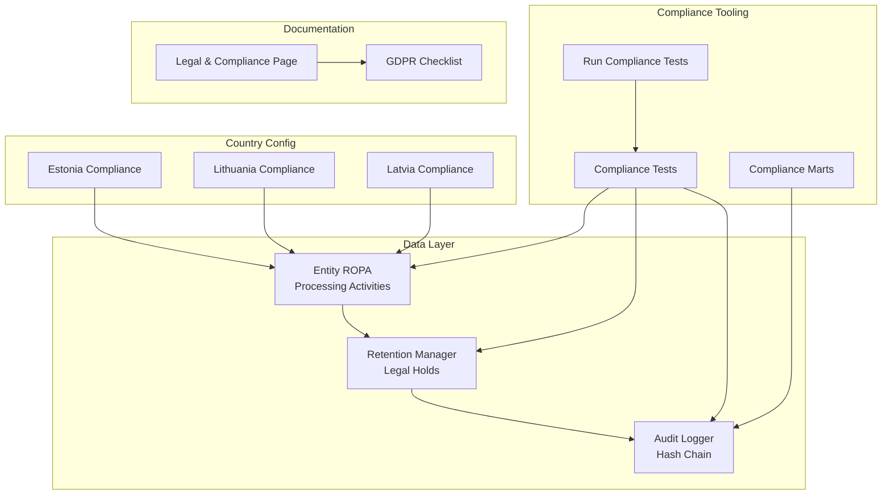
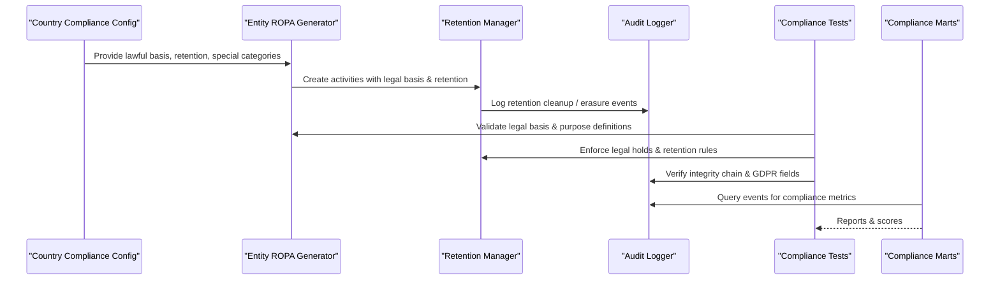
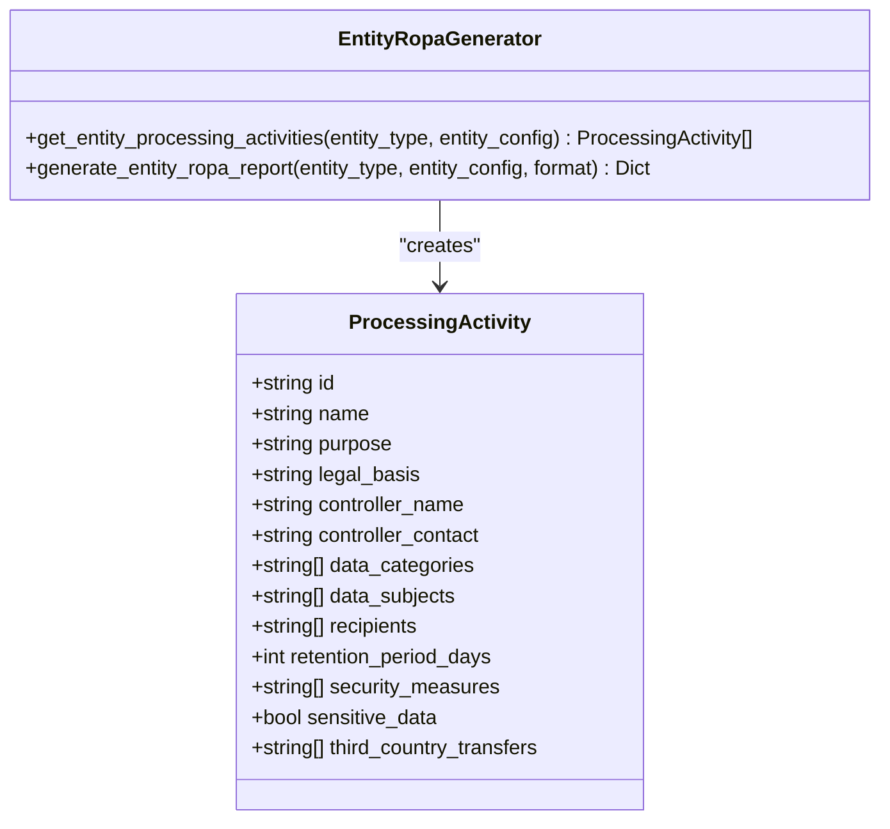
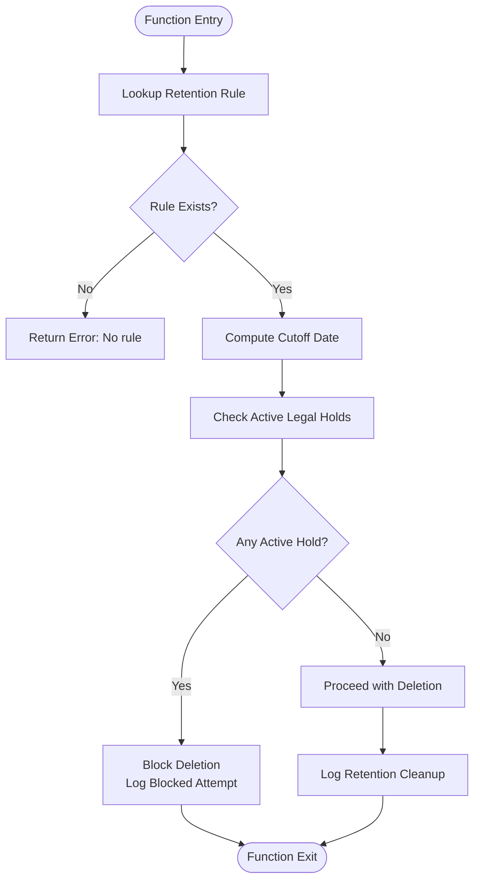
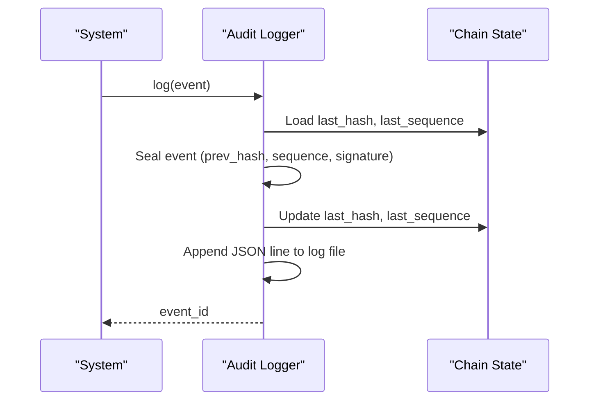
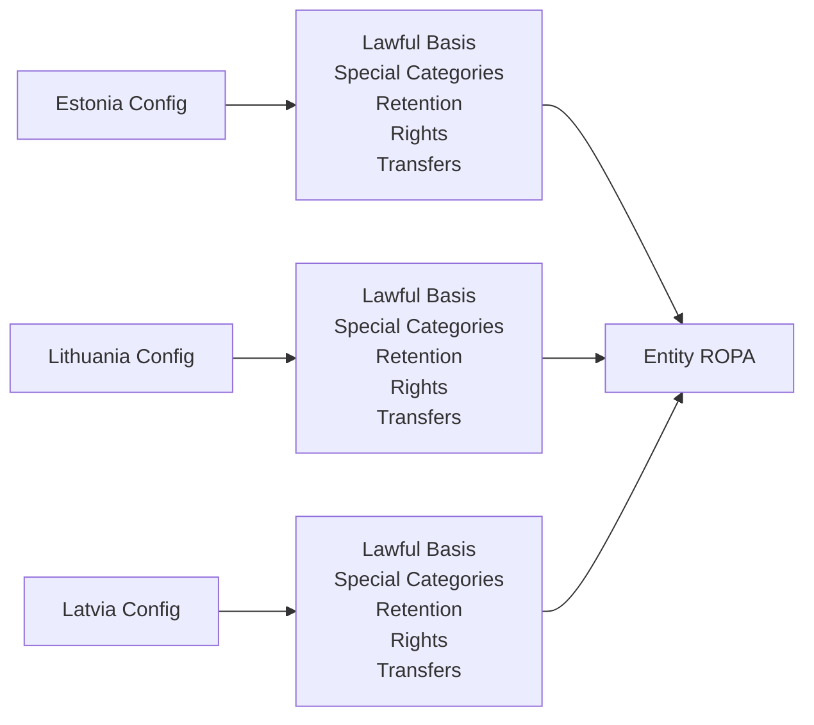
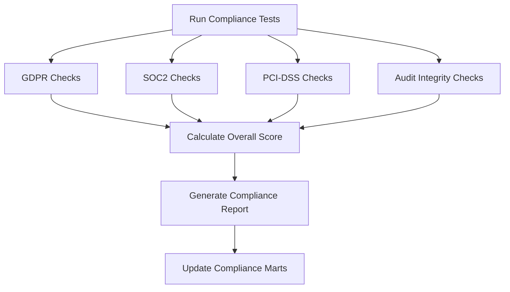
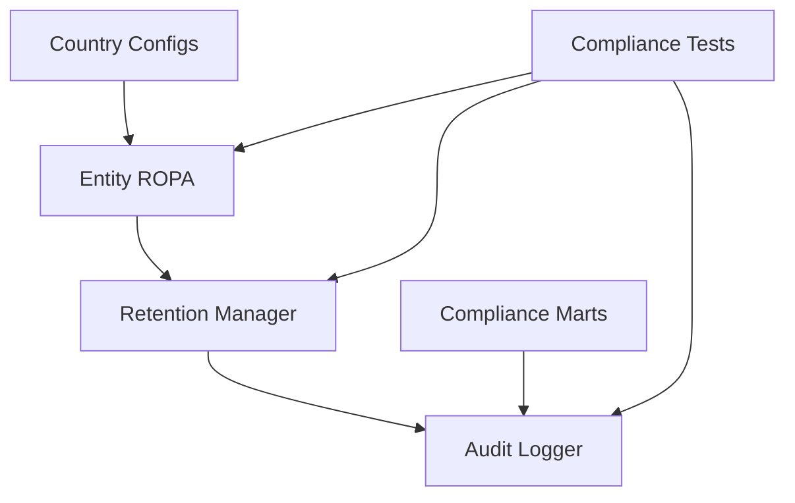

# Legal Obligation Processing

<cite>
**Referenced Files in This Document**
- [retention_manager.py](file://data/src/gdpr/retention_manager.py)
- [entity_ropa.py](file://data/src/gdpr/entity_ropa.py)
- [audit.py](file://data/src/audit.py)
- [compliance.yml (Estonia)](file://countries/ee/config/compliance.yml)
- [compliance.yml (Lithuania)](file://countries/lt/config/compliance.yml)
- [compliance.yml (Latvia)](file://countries/lv/config/compliance.yml)
- [GDPR-checklist.md](file://docs/compliance/GDPR-checklist.md)
- [legal-compliance.md](file://docs/design/pages/23-legal-compliance.md)
- [test_compliance.py](file://data/tests/test_compliance.py)
- [run_compliance_tests.py](file://scripts/run_compliance_tests.py)
- [mart_canonical_compliance.sql](file://data/src/transformations/marts/mart_canonical_compliance.sql)
- [mart_country_metrics.sql](file://data/src/transformations/marts/mart_country_metrics.sql)
</cite>

## Table of Contents
1. [Introduction](#introduction)
2. [Project Structure](#project-structure)
3. [Core Components](#core-components)
4. [Architecture Overview](#architecture-overview)
5. [Detailed Component Analysis](#detailed-component-analysis)
6. [Dependency Analysis](#dependency-analysis)
7. [Performance Considerations](#performance-considerations)
8. [Troubleshooting Guide](#troubleshooting-guide)
9. [Conclusion](#conclusion)
10. [Appendices](#appendices)

## Introduction
This document explains how JOL-HUB identifies, catalogs, and processes legal obligations under Article 6(1)(c) across its operations in EU member states. It covers:
- Identification and cataloging of applicable legal obligations per country
- Implementation of statutory requirement processing with explicit legal basis citations for each activity
- Regular review processes for changing legal obligations
- Country-specific compliance requirements including tax reporting, financial regulations, and industry-specific mandates
- Practical examples of legal obligation mapping, automated compliance checks, and retention policies aligned with legal requirements
- Balancing legal compliance with data minimization principles
- Procedures for handling conflicting legal obligations across jurisdictions

The system implements a structured Records of Processing Activities (ROPA) model, automated retention management, integrity-protected audit logging, and country-specific compliance configurations to ensure lawful, transparent, and auditable processing.

## Project Structure
JOL-HUB organizes legal obligation processing across several layers:
- Data layer: ROPA definitions, retention rules, audit logging, and transformation pipelines
- Country configuration: Per-country compliance settings (lawful basis, retention periods, special categories, transfer rules)
- Compliance tooling: Automated tests and scripts that validate compliance posture
- Documentation: Public-facing legal & compliance pages and internal checklists

**Diagram sources**
- [entity_ropa.py:39-98](file://data/src/gdpr/entity_ropa.py#L39-L98)
- [retention_manager.py:188-336](file://data/src/gdpr/retention_manager.py#L188-L336)
- [audit.py:205-369](file://data/src/audit.py#L205-L369)
- [compliance.yml (Estonia):1-241](file://countries/ee/config/compliance.yml#L1-L241)
- [compliance.yml (Lithuania):1-201](file://countries/lt/config/compliance.yml#L1-L201)
- [compliance.yml (Latvia):1-218](file://countries/lv/config/compliance.yml#L1-L218)
- [test_compliance.py:133-200](file://data/tests/test_compliance.py#L133-L200)
- [run_compliance_tests.py:180-215](file://scripts/run_compliance_tests.py#L180-L215)
- [mart_canonical_compliance.sql:84-114](file://data/src/transformations/marts/mart_canonical_compliance.sql#L84-L114)
- [mart_country_metrics.sql:43-95](file://data/src/transformations/marts/mart_country_metrics.sql#L43-L95)

**Section sources**
- [entity_ropa.py:39-98](file://data/src/gdpr/entity_ropa.py#L39-L98)
- [retention_manager.py:188-336](file://data/src/gdpr/retention_manager.py#L188-L336)
- [audit.py:205-369](file://data/src/audit.py#L205-L369)
- [compliance.yml (Estonia):1-241](file://countries/ee/config/compliance.yml#L1-L241)
- [compliance.yml (Lithuania):1-201](file://countries/lt/config/compliance.yml#L1-L201)
- [compliance.yml (Latvia):1-218](file://countries/lv/config/compliance.yml#L1-L218)
- [test_compliance.py:133-200](file://data/tests/test_compliance.py#L133-L200)
- [run_compliance_tests.py:180-215](file://scripts/run_compliance_tests.py#L180-L215)
- [mart_canonical_compliance.sql:84-114](file://data/src/transformations/marts/mart_canonical_compliance.sql#L84-L114)
- [mart_country_metrics.sql:43-95](file://data/src/transformations/marts/mart_country_metrics.sql#L43-L95)

## Core Components
- Entity ROPA generator: Defines processing activities with explicit legal basis, purposes, data categories, recipients, retention periods, and security measures for each entity type.
- Retention manager: Implements storage limitation and right to erasure with legal hold enforcement; enforces retention rules tied to legal basis.
- Audit logger: Provides GDPR Article 30 compliant logs with hash chain and HMAC signatures for integrity protection.
- Country compliance configs: Define lawful basis specifics, special category handling, retention periods, data subject rights, breach notification, and transfer restrictions per country.
- Compliance tests and scripts: Validate implementation against GDPR, SOC2, PCI-DSS, and country-specific requirements; generate reports and scores.
- Compliance marts: SQL-based metrics and canonical compliance views for reporting and monitoring.

**Section sources**
- [entity_ropa.py:39-98](file://data/src/gdpr/entity_ropa.py#L39-L98)
- [retention_manager.py:188-336](file://data/src/gdpr/retention_manager.py#L188-L336)
- [audit.py:205-369](file://data/src/audit.py#L205-L369)
- [compliance.yml (Estonia):1-241](file://countries/ee/config/compliance.yml#L1-L241)
- [compliance.yml (Lithuania):1-201](file://countries/lt/config/compliance.yml#L1-L201)
- [compliance.yml (Latvia):1-218](file://countries/lv/config/compliance.yml#L1-L218)
- [test_compliance.py:133-200](file://data/tests/test_compliance.py#L133-L200)
- [run_compliance_tests.py:180-215](file://scripts/run_compliance_tests.py#L180-L215)
- [mart_canonical_compliance.sql:84-114](file://data/src/transformations/marts/mart_canonical_compliance.sql#L84-L114)
- [mart_country_metrics.sql:43-95](file://data/src/transformations/marts/mart_country_metrics.sql#L43-L95)

## Architecture Overview
The legal obligation processing architecture integrates ROPA definitions, retention enforcement, and audit logging with country-specific compliance rules. Automated tests and compliance marts provide continuous validation and reporting.

**Diagram sources**
- [entity_ropa.py:39-98](file://data/src/gdpr/entity_ropa.py#L39-L98)
- [retention_manager.py:188-336](file://data/src/gdpr/retention_manager.py#L188-L336)
- [audit.py:205-369](file://data/src/audit.py#L205-L369)
- [test_compliance.py:133-200](file://data/tests/test_compliance.py#L133-L200)
- [run_compliance_tests.py:180-215](file://scripts/run_compliance_tests.py#L180-L215)
- [mart_canonical_compliance.sql:84-114](file://data/src/transformations/marts/mart_canonical_compliance.sql#L84-L114)

## Detailed Component Analysis

### Entity ROPA and Legal Basis Citation
- Each entity type defines processing activities with explicit legal basis citations (e.g., contract performance, legitimate interest, legal obligation).
- Activities include data categories, subjects, recipients, retention periods, and security measures.
- Sensitive data handling is flagged where applicable (e.g., religious data under special categories).

**Diagram sources**
- [entity_ropa.py:39-98](file://data/src/gdpr/entity_ropa.py#L39-L98)
- [entity_ropa.py:762-797](file://data/src/gdpr/entity_ropa.py#L762-L797)

**Section sources**
- [entity_ropa.py:39-98](file://data/src/gdpr/entity_ropa.py#L39-L98)
- [entity_ropa.py:762-797](file://data/src/gdpr/entity_ropa.py#L762-L797)

### Retention Management and Legal Holds
- Retention rules are defined with legal basis references (e.g., Canon Law + GDPR Art. 6(1)(c), GDPR Art. 5(1)(e), Art. 30(3)).
- Deletion operations check active legal holds before proceeding; blocked deletions are logged and reported with hold details.
- The registry supports multiple hold types (litigation, investigation, audit, subpoena, law enforcement) and expiration handling.

**Diagram sources**
- [retention_manager.py:188-336](file://data/src/gdpr/retention_manager.py#L188-L336)

**Section sources**
- [retention_manager.py:188-336](file://data/src/gdpr/retention_manager.py#L188-L336)

### Audit Logging and Integrity Protection
- Every audit event includes GDPR-required fields (controller info, purposes, categories, recipients, transfers, retention, security measures).
- Events are sealed with a hash chain and HMAC signature to ensure tamper detection and forensic integrity.
- Chain verification tools detect breaks, sequence gaps, hash mismatches, and invalid signatures.

**Diagram sources**
- [audit.py:205-369](file://data/src/audit.py#L205-L369)
- [audit.py:513-589](file://data/src/audit.py#L513-L589)

**Section sources**
- [audit.py:205-369](file://data/src/audit.py#L205-L369)
- [audit.py:513-589](file://data/src/audit.py#L513-L589)

### Country-Specific Compliance Requirements
- Estonia, Lithuania, and Latvia define:
  - Lawful basis specifics (consent age, legitimate interest documentation, public interest scope)
  - Special categories handling (religious data permitted with safeguards; health data for funeral/cemetery services)
  - Right to erasure exceptions (canonical records permanent retention)
  - Retention periods (tax law, financial records, sacramental records, analytics, marketing)
  - Data subject rights (access deadlines, rectification limitations, portability formats)
  - Breach notification timelines and thresholds
  - Transfer restrictions and permitted destinations
  - Religious organization specifics (canonical references, Vatican guidelines)

**Diagram sources**
- [compliance.yml (Estonia):1-241](file://countries/ee/config/compliance.yml#L1-L241)
- [compliance.yml (Lithuania):1-201](file://countries/lt/config/compliance.yml#L1-L201)
- [compliance.yml (Latvia):1-218](file://countries/lv/config/compliance.yml#L1-L218)
- [entity_ropa.py:39-98](file://data/src/gdpr/entity_ropa.py#L39-L98)

**Section sources**
- [compliance.yml (Estonia):1-241](file://countries/ee/config/compliance.yml#L1-L241)
- [compliance.yml (Lithuania):1-201](file://countries/lt/config/compliance.yml#L1-L201)
- [compliance.yml (Latvia):1-218](file://countries/lv/config/compliance.yml#L1-L218)

### Automated Compliance Checks and Reporting
- Test suite validates GDPR articles (lawfulness, purpose limitation, data minimization, accuracy, special categories, right to erasure).
- Scripts run comprehensive compliance checks across GDPR, SOC2, PCI-DSS, and audit integrity; generate overall scores and status.
- Compliance marts produce canonical compliance views and country metrics with anonymization and k-anonymity indicators.

**Diagram sources**
- [test_compliance.py:133-200](file://data/tests/test_compliance.py#L133-L200)
- [run_compliance_tests.py:180-215](file://scripts/run_compliance_tests.py#L180-L215)
- [mart_canonical_compliance.sql:84-114](file://data/src/transformations/marts/mart_canonical_compliance.sql#L84-L114)
- [mart_country_metrics.sql:43-95](file://data/src/transformations/marts/mart_country_metrics.sql#L43-L95)

**Section sources**
- [test_compliance.py:133-200](file://data/tests/test_compliance.py#L133-L200)
- [run_compliance_tests.py:180-215](file://scripts/run_compliance_tests.py#L180-L215)
- [mart_canonical_compliance.sql:84-114](file://data/src/transformations/marts/mart_canonical_compliance.sql#L84-L114)
- [mart_country_metrics.sql:43-95](file://data/src/transformations/marts/mart_country_metrics.sql#L43-L95)

### Practical Examples of Legal Obligation Mapping
- Donation processing: Legal basis cited as contract performance; retention aligned with tax law (7 years); recipients include payment processors and tax authority; security measures include PCI-DSS and encryption.
- Sacramental records: Legal basis under special categories for religious purposes; permanent retention per Canon Law; security measures include encryption and canonical seal.
- Interment records: Legal basis under legal obligation; long-term retention; recipients include civil registrar and religious authority.

**Section sources**
- [entity_ropa.py:105-165](file://data/src/gdpr/entity_ropa.py#L105-L165)
- [entity_ropa.py:649-720](file://data/src/gdpr/entity_ropa.py#L649-L720)
- [compliance.yml (Estonia):137-147](file://countries/ee/config/compliance.yml#L137-L147)
- [compliance.yml (Lithuania):137-146](file://countries/lt/config/compliance.yml#L137-L146)
- [compliance.yml (Latvia):137-147](file://countries/lv/config/compliance.yml#L137-L147)

### Balancing Legal Compliance and Data Minimization
- Data minimization enforced via explicit field definitions and purpose-limited processing activities.
- Sensitive data handling requires additional safeguards and is limited to necessary categories.
- Retention periods are aligned with legal requirements and minimized to the shortest period necessary.

**Section sources**
- [test_compliance.py:187-196](file://data/tests/test_compliance.py#L187-L196)
- [entity_ropa.py:39-98](file://data/src/gdpr/entity_ropa.py#L39-L98)
- [compliance.yml (Estonia):46-63](file://countries/ee/config/compliance.yml#L46-L63)
- [compliance.yml (Lithuania):46-63](file://countries/lt/config/compliance.yml#L46-L63)
- [compliance.yml (Latvia):46-63](file://countries/lv/config/compliance.yml#L46-L63)

### Handling Conflicting Legal Obligations Across Jurisdictions
- Country configs define restricted and permitted destinations for data transfers, helping resolve conflicts by limiting cross-border flows to compliant regions.
- Canonical records exception allows permanent retention even when erasure is requested, aligning religious obligations with GDPR exceptions.
- Legal holds prevent deletion during litigation or investigations, ensuring compliance with higher-priority legal duties.

**Section sources**
- [compliance.yml (Estonia):81-115](file://countries/ee/config/compliance.yml#L81-L115)
- [compliance.yml (Lithuania):81-115](file://countries/lt/config/compliance.yml#L81-L115)
- [compliance.yml (Latvia):81-115](file://countries/lv/config/compliance.yml#L81-L115)
- [retention_manager.py:28-67](file://data/src/gdpr/retention_manager.py#L28-L67)
- [compliance.yml (Estonia):64-73](file://countries/ee/config/compliance.yml#L64-L73)
- [compliance.yml (Lithuania):64-73](file://countries/lt/config/compliance.yml#L64-L73)
- [compliance.yml (Latvia):64-73](file://countries/lv/config/compliance.yml#L64-L73)

## Dependency Analysis
Key dependencies and relationships:
- Entity ROPA depends on country compliance configs to set lawful basis, retention, and special category rules.
- Retention manager depends on audit logger for recording retention actions and erasure requests.
- Compliance tests depend on ROPA, retention manager, and audit logger to validate implementation.
- Compliance marts depend on audit logs to generate metrics and canonical compliance views.

**Diagram sources**
- [entity_ropa.py:39-98](file://data/src/gdpr/entity_ropa.py#L39-L98)
- [retention_manager.py:188-336](file://data/src/gdpr/retention_manager.py#L188-L336)
- [audit.py:205-369](file://data/src/audit.py#L205-L369)
- [test_compliance.py:133-200](file://data/tests/test_compliance.py#L133-L200)
- [mart_canonical_compliance.sql:84-114](file://data/src/transformations/marts/mart_canonical_compliance.sql#L84-L114)

**Section sources**
- [entity_ropa.py:39-98](file://data/src/gdpr/entity_ropa.py#L39-L98)
- [retention_manager.py:188-336](file://data/src/gdpr/retention_manager.py#L188-L336)
- [audit.py:205-369](file://data/src/audit.py#L205-L369)
- [test_compliance.py:133-200](file://data/tests/test_compliance.py#L133-L200)
- [mart_canonical_compliance.sql:84-114](file://data/src/transformations/marts/mart_canonical_compliance.sql#L84-L114)

## Performance Considerations
- Hash chain and HMAC signing add overhead to audit logging but ensure integrity and compliance; consider batching and asynchronous writes for high-volume scenarios.
- Retention cleanup should be scheduled during low-traffic windows to minimize impact on operational systems.
- Compliance marts queries should be optimized with appropriate indexes and materialized views for frequent reporting.

[No sources needed since this section provides general guidance]

## Troubleshooting Guide
Common issues and resolutions:
- Legal hold blocking deletion: Verify active legal holds and their reasons; lift holds when no longer required.
- Audit chain integrity failures: Investigate sequence gaps, hash mismatches, or invalid signatures; restore from verified backups if needed.
- Compliance test failures: Review failing checks and remediate based on test descriptions; update configurations or code accordingly.

**Section sources**
- [retention_manager.py:248-336](file://data/src/gdpr/retention_manager.py#L248-L336)
- [audit.py:513-589](file://data/src/audit.py#L513-L589)
- [test_compliance.py:133-200](file://data/tests/test_compliance.py#L133-L200)

## Conclusion
JOL-HUB’s legal obligation processing under Article 6(1)(c) is implemented through a robust combination of ROPA definitions, retention management, audit logging, and country-specific compliance configurations. Automated compliance checks and reporting ensure ongoing adherence to legal requirements while balancing data minimization principles. The system handles conflicting obligations through legal holds, transfer restrictions, and canonical record exceptions, providing a comprehensive framework for lawful and auditable data processing across EU member states.

[No sources needed since this section summarizes without analyzing specific files]

## Appendices
- Public-facing legal & compliance page structure and content model
- GDPR checklist for lawful basis, consent, legitimate interests, and country-specific requirements

**Section sources**
- [legal-compliance.md:1-45](file://docs/design/pages/23-legal-compliance.md#L1-L45)
- [GDPR-checklist.md:45-71](file://docs/compliance/GDPR-checklist.md#L45-L71)
- [GDPR-checklist.md:673-729](file://docs/compliance/GDPR-checklist.md#L673-L729)