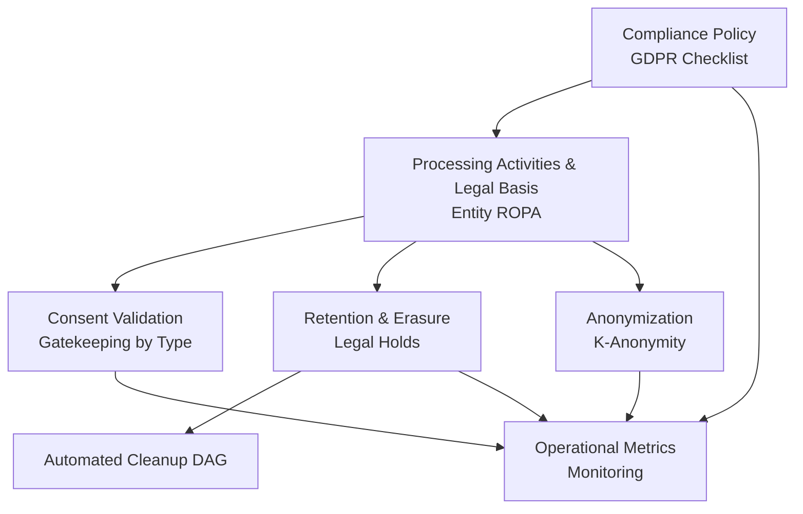
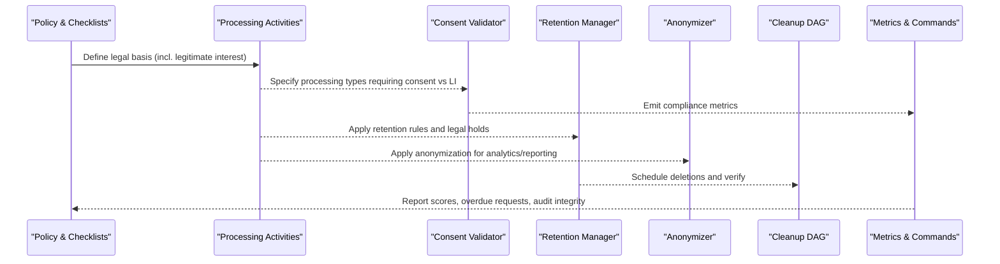
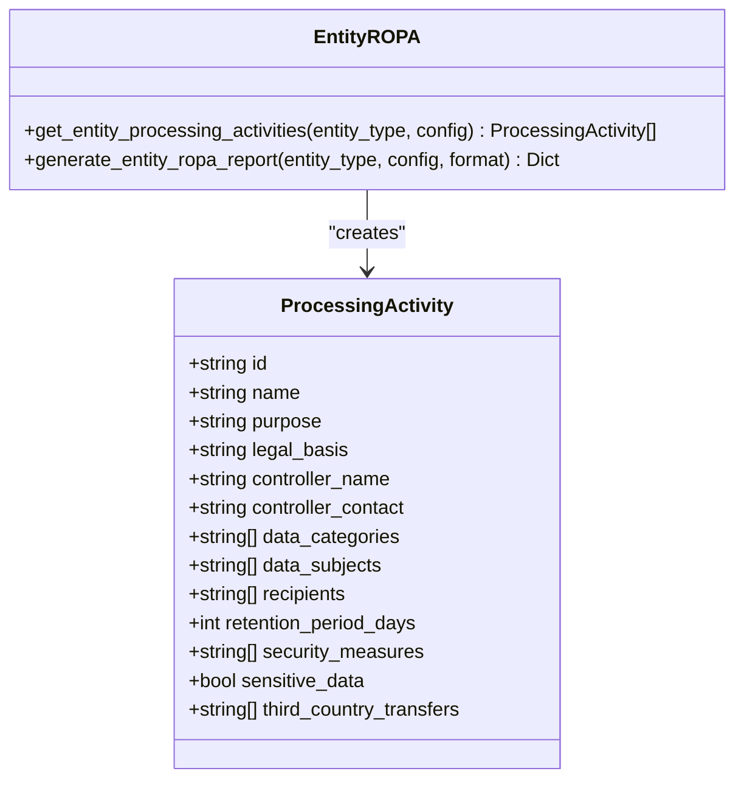
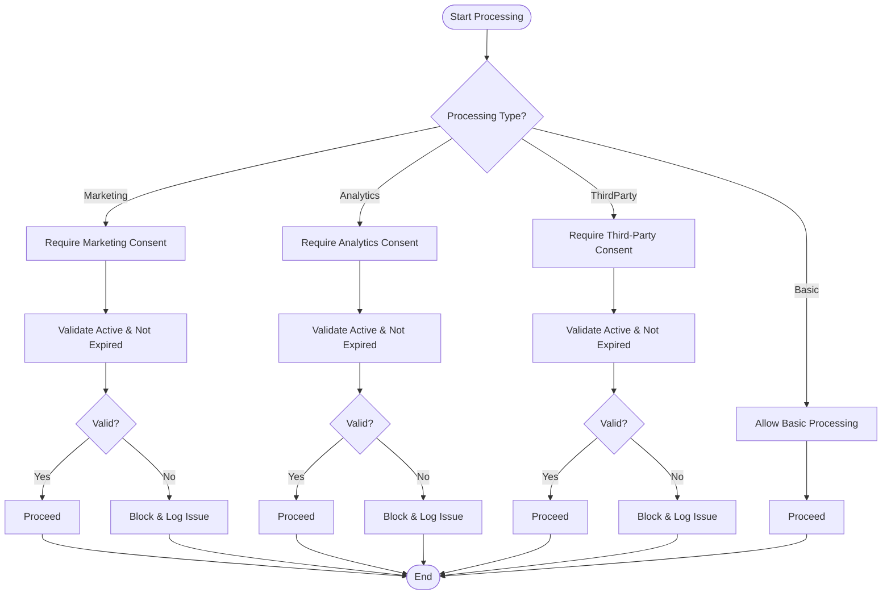
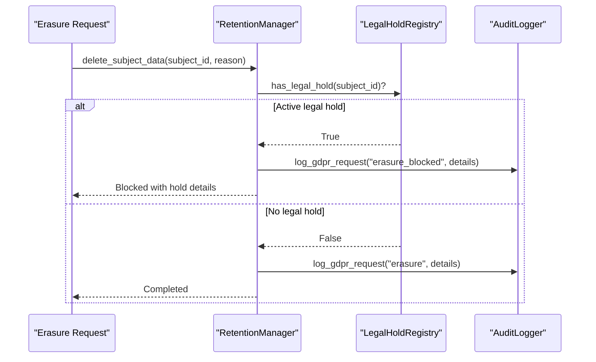
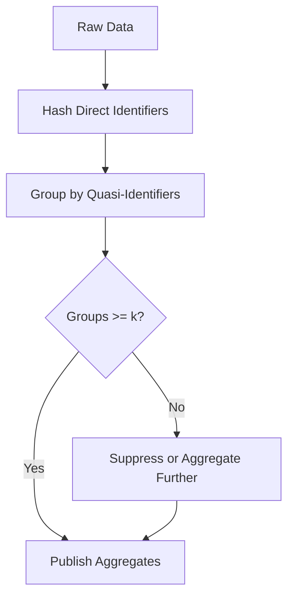
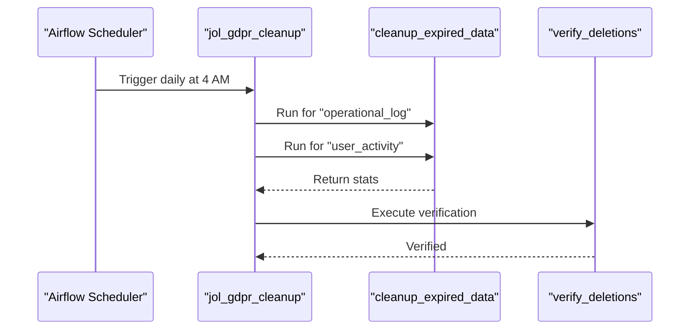
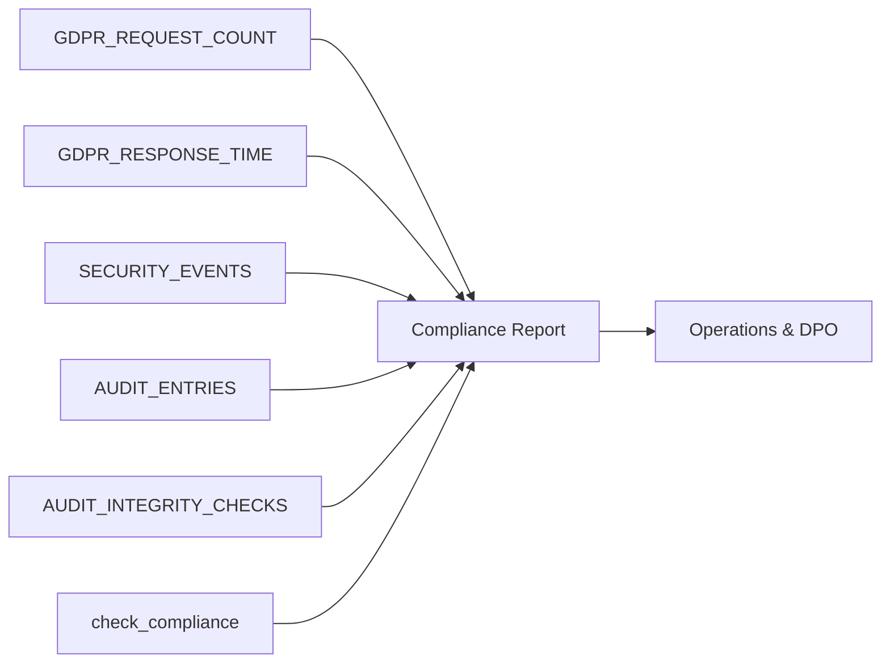
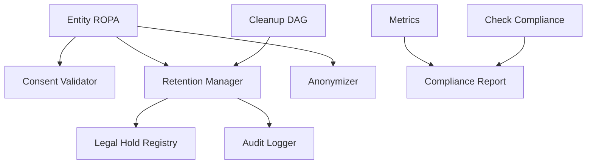

# Legitimate Interest Assessment

<cite>
**Referenced Files in This Document**
- [GDPR-checklist.md](file://docs/compliance/GDPR-checklist.md)
- [security-model.md](file://docs/architecture/security-model.md)
- [entity_ropa.py](file://data/src/gdpr/entity_ropa.py)
- [config.py](file://data/src/config.py)
- [gdpr_consent_validation.py](file://data/src/quality/expectations/gdpr_consent_validation.py)
- [check_compliance.py](file://backend/django/apps/crm/management/commands/check_compliance.py)
- [metrics.py](file://backend/django/apps/crm/observability/metrics.py)
- [jol_gdpr_cleanup.py](file://data/airflow/dags/jol_gdpr_cleanup.py)
- [retention_manager.py](file://data/src/gdpr/retention_manager.py)
- [anonymizer.py](file://data/src/gdpr/anonymizer.py)
</cite>

## Table of Contents
1. Introduction
2. Project Structure
3. Core Components
4. Architecture Overview
5. Detailed Component Analysis
6. Dependency Analysis
7. Performance Considerations
8. Troubleshooting Guide
9. Conclusion
10. Appendices

## Introduction
This document explains how JOL-HUB implements a Legitimate Interest Assessment (LIA) framework aligned with GDPR Article 6(1)(f). It covers the three-part LIA methodology:
- Purpose test: identify clear legitimate interests
- Necessity test: ensure processing is essential for the stated purpose
- Balancing test: weigh organizational interests against individual rights and freedoms

It also documents technical workflows, approval processes, documentation requirements, the legitimate interests register, regular review schedules, change management procedures, and practical examples for analytics, marketing automation, system optimization, fraud prevention, security monitoring, and business development. Where applicable, it references concrete code and configuration that support these capabilities.

## Project Structure
JOL-HUB integrates LIA into compliance tooling across documentation, data processing definitions, consent validation, retention and deletion controls, and operational monitoring. Key areas include:
- Compliance policy and checklists defining LIA requirements and review cadence
- Entity-specific Records of Processing Activities (ROPA) that declare legal bases including legitimate interest
- Consent validation utilities to gate processing types
- Retention and erasure management with legal hold safeguards
- Automated cleanup pipelines
- Anonymization utilities for analytics and reporting
- Operational metrics and compliance reporting commands

**Diagram sources**
- [GDPR-checklist.md:61-69](file://docs/compliance/GDPR-checklist.md#L61-L69)
- [entity_ropa.py:39-65](file://data/src/gdpr/entity_ropa.py#L39-L65)
- [gdpr_consent_validation.py:52-73](file://data/src/quality/expectations/gdpr_consent_validation.py#L52-L73)
- [retention_manager.py:188-246](file://data/src/gdpr/retention_manager.py#L188-L246)
- [anonymizer.py:106-143](file://data/src/gdpr/anonymizer.py#L106-L143)
- [jol_gdpr_cleanup.py:36-68](file://data/airflow/dags/jol_gdpr_cleanup.py#L36-L68)
- [metrics.py:47-99](file://backend/django/apps/crm/observability/metrics.py#L47-L99)

**Section sources**
- [GDPR-checklist.md:61-69](file://docs/compliance/GDPR-checklist.md#L61-L69)
- [entity_ropa.py:39-65](file://data/src/gdpr/entity_ropa.py#L39-L65)
- [gdpr_consent_validation.py:52-73](file://data/src/quality/expectations/gdpr_consent_validation.py#L52-L73)
- [retention_manager.py:188-246](file://data/src/gdpr/retention_manager.py#L188-L246)
- [anonymizer.py:106-143](file://data/src/gdpr/anonymizer.py#L106-L143)
- [jol_gdpr_cleanup.py:36-68](file://data/airflow/dags/jol_gdpr_cleanup.py#L36-L68)
- [metrics.py:47-99](file://backend/django/apps/crm/observability/metrics.py#L47-L99)

## Core Components
- LIA policy and governance: The compliance checklist codifies LIA requirements, including purpose, necessity, and balancing tests, plus annual or change-triggered reviews.
- Processing activities registry: Entity-specific ROPA defines processing activities with explicit legal bases, including legitimate interest where appropriate.
- Consent validation: Validates required consents per processing type; complements LIA by gating non-consensual processing paths.
- Retention and erasure: Enforces storage limitation and right to erasure with legal holds preventing deletion when necessary for legal claims.
- Anonymization: Provides k-anonymity controls for analytics and reporting to reduce privacy risks when using legitimate interests.
- Monitoring and reporting: Metrics and compliance checks provide visibility into GDPR requests, audit integrity, and security events.

**Section sources**
- [GDPR-checklist.md:61-69](file://docs/compliance/GDPR-checklist.md#L61-L69)
- [entity_ropa.py:39-65](file://data/src/gdpr/entity_ropa.py#L39-L65)
- [gdpr_consent_validation.py:52-73](file://data/src/quality/expectations/gdpr_consent_validation.py#L52-L73)
- [retention_manager.py:188-246](file://data/src/gdpr/retention_manager.py#L188-L246)
- [anonymizer.py:106-143](file://data/src/gdpr/anonymizer.py#L106-L143)
- [metrics.py:47-99](file://backend/django/apps/crm/observability/metrics.py#L47-L99)

## Architecture Overview
The LIA workflow spans policy, data modeling, enforcement, and observability:
- Policy defines LIA criteria and review cadence
- ROPA enumerates processing activities and legal bases
- Consent validation gates processing types
- Retention manager enforces erasure and legal holds
- Anonymizer reduces re-identification risk for analytics
- Airflow DAG automates cleanup
- Metrics and compliance command surface status and issues

**Diagram sources**
- [GDPR-checklist.md:61-69](file://docs/compliance/GDPR-checklist.md#L61-L69)
- [entity_ropa.py:39-65](file://data/src/gdpr/entity_ropa.py#L39-L65)
- [gdpr_consent_validation.py:52-73](file://data/src/quality/expectations/gdpr_consent_validation.py#L52-L73)
- [retention_manager.py:188-246](file://data/src/gdpr/retention_manager.py#L188-L246)
- [anonymizer.py:106-143](file://data/src/gdpr/anonymizer.py#L106-L143)
- [jol_gdpr_cleanup.py:36-68](file://data/airflow/dags/jol_gdpr_cleanup.py#L36-L68)
- [metrics.py:47-99](file://backend/django/apps/crm/observability/metrics.py#L47-L99)

## Detailed Component Analysis

### LIA Methodology and Governance
- Purpose test: Identify clear legitimate interests for each processing activity. The ROPA module declares legal bases per activity, including legitimate interest where suitable.
- Necessity test: Ensure processing is strictly necessary for the stated purpose. Use data minimization and pseudonymization/anonymization where possible.
- Balancing test: Weigh organizational interests against individual rights. Implement safeguards such as access control, encryption, auditing, and limited retention.

Review and approval:
- Annual or change-triggered reviews are mandated by the compliance checklist.
- Security model emphasizes classification levels, DLP, database security, masking, and tokenization to mitigate risks identified in the balancing test.

Practical mapping:
- Analytics reporting uses legitimate interest with pseudonymization and access controls.
- System optimization and shared resource management use legitimate interest with appropriate safeguards.

**Section sources**
- [GDPR-checklist.md:61-69](file://docs/compliance/GDPR-checklist.md#L61-L69)
- [entity_ropa.py:188-226](file://data/src/gdpr/entity_ropa.py#L188-L226)
- [config.py:112-123](file://data/src/config.py#L112-L123)
- [security-model.md:168-221](file://docs/architecture/security-model.md#L168-L221)

### Legitimate Interests Register (ROPA Integration)
- The entity ROPA generator catalogs processing activities with explicit legal bases, including legitimate interest for specific operations like heritage conservation records, bishop’s schedule management, deanery coordination, and shared resource management.
- Each activity includes data categories, subjects, recipients, retention periods, and security measures, enabling traceability from LIA decisions to implementation.

**Diagram sources**
- [entity_ropa.py:68-98](file://data/src/gdpr/entity_ropa.py#L68-L98)
- [entity_ropa.py:762-797](file://data/src/gdpr/entity_ropa.py#L762-L797)

**Section sources**
- [entity_ropa.py:188-226](file://data/src/gdpr/entity_ropa.py#L188-L226)
- [entity_ropa.py:300-338](file://data/src/gdpr/entity_ropa.py#L300-L338)
- [entity_ropa.py:762-797](file://data/src/gdpr/entity_ropa.py#L762-L797)

### Consent Validation and LIA Gatekeeping
- Consent validator enforces required consents for specific processing types (marketing, analytics, third-party sharing, basic processing).
- When legitimate interest is used, the system must still respect withdrawal and objection mechanisms and ensure no undue impact on rights.

**Diagram sources**
- [gdpr_consent_validation.py:52-73](file://data/src/quality/expectations/gdpr_consent_validation.py#L52-L73)
- [gdpr_consent_validation.py:77-142](file://data/src/quality/expectations/gdpr_consent_validation.py#L77-L142)

**Section sources**
- [gdpr_consent_validation.py:52-73](file://data/src/quality/expectations/gdpr_consent_validation.py#L52-L73)
- [gdpr_consent_validation.py:77-142](file://data/src/quality/expectations/gdpr_consent_validation.py#L77-L142)

### Retention, Erasure, and Legal Holds
- Retention manager enforces storage limitation and right to erasure with strict checks for active legal holds before any deletion.
- Legal holds prevent deletion for litigation, investigations, audits, subpoenas, and law enforcement requests, aligning with GDPR exceptions for legal claims.

**Diagram sources**
- [retention_manager.py:257-317](file://data/src/gdpr/retention_manager.py#L257-L317)
- [retention_manager.py:109-174](file://data/src/gdpr/retention_manager.py#L109-L174)

**Section sources**
- [retention_manager.py:188-246](file://data/src/gdpr/retention_manager.py#L188-L246)
- [retention_manager.py:257-317](file://data/src/gdpr/retention_manager.py#L257-L317)

### Anonymization for Analytics and Reporting
- K-anonymity supports country-specific thresholds to reduce re-identification risk when using legitimate interests for analytics and reporting.
- Pseudonymization and hashing protect direct identifiers while preserving analytical utility.

**Diagram sources**
- [anonymizer.py:106-143](file://data/src/gdpr/anonymizer.py#L106-L143)
- [anonymizer.py:160-180](file://data/src/gdpr/anonymizer.py#L160-L180)

**Section sources**
- [anonymizer.py:25-83](file://data/src/gdpr/anonymizer.py#L25-L83)
- [anonymizer.py:106-143](file://data/src/gdpr/anonymizer.py#L106-L143)

### Automated Cleanup and Review Schedules
- Airflow DAG schedules daily cleanup tasks for operational logs and user activity, verifying deletions post-execution.
- Combined with retention rules, this ensures timely purging and supports legitimate interest-based processing with minimal retention.

**Diagram sources**
- [jol_gdpr_cleanup.py:36-68](file://data/airflow/dags/jol_gdpr_cleanup.py#L36-L68)

**Section sources**
- [jol_gdpr_cleanup.py:21-33](file://data/airflow/dags/jol_gdpr_cleanup.py#L21-L33)
- [jol_gdpr_cleanup.py:36-68](file://data/airflow/dags/jol_gdpr_cleanup.py#L36-L68)

### Monitoring, Metrics, and Compliance Reporting
- Metrics capture GDPR request counts, response times, security events, audit entries, and tenant isolation violations.
- Compliance command generates reports per tenant or all tenants, highlighting overdue requests, consent status, legal holds, audit integrity, and security indicators.

**Diagram sources**
- [metrics.py:47-99](file://backend/django/apps/crm/observability/metrics.py#L47-L99)
- [check_compliance.py:23-186](file://backend/django/apps/crm/management/commands/check_compliance.py#L23-L186)

**Section sources**
- [metrics.py:47-99](file://backend/django/apps/crm/observability/metrics.py#L47-L99)
- [check_compliance.py:23-186](file://backend/django/apps/crm/management/commands/check_compliance.py#L23-L186)

## Dependency Analysis
Key dependencies and relationships:
- ROPA depends on entity configurations to produce processing activities with legal bases
- Consent validation depends on defined processing types and consent records
- Retention manager depends on legal hold registry and audit logger
- Cleanup DAG depends on retention manager
- Anonymizer provides utilities used by analytics/reporting flows
- Metrics and compliance command depend on underlying systems to aggregate and report

**Diagram sources**
- [entity_ropa.py:39-65](file://data/src/gdpr/entity_ropa.py#L39-L65)
- [gdpr_consent_validation.py:52-73](file://data/src/quality/expectations/gdpr_consent_validation.py#L52-L73)
- [retention_manager.py:188-246](file://data/src/gdpr/retention_manager.py#L188-L246)
- [jol_gdpr_cleanup.py:36-68](file://data/airflow/dags/jol_gdpr_cleanup.py#L36-L68)
- [metrics.py:47-99](file://backend/django/apps/crm/observability/metrics.py#L47-L99)
- [check_compliance.py:23-186](file://backend/django/apps/crm/management/commands/check_compliance.py#L23-L186)

**Section sources**
- [entity_ropa.py:39-65](file://data/src/gdpr/entity_ropa.py#L39-L65)
- [gdpr_consent_validation.py:52-73](file://data/src/quality/expectations/gdpr_consent_validation.py#L52-L73)
- [retention_manager.py:188-246](file://data/src/gdpr/retention_manager.py#L188-L246)
- [jol_gdpr_cleanup.py:36-68](file://data/airflow/dags/jol_gdpr_cleanup.py#L36-L68)
- [metrics.py:47-99](file://backend/django/apps/crm/observability/metrics.py#L47-L99)
- [check_compliance.py:23-186](file://backend/django/apps/crm/management/commands/check_compliance.py#L23-L186)

## Performance Considerations
- Minimize retention periods to reduce storage and processing overhead; leverage automated cleanup.
- Use anonymization and aggregation to lower computational cost and privacy risk in analytics.
- Batch validations and metrics collection to avoid blocking critical paths.
- Monitor performance via metrics and adjust thresholds (e.g., k-anonymity values) based on regulatory guidance and data volumes.

[No sources needed since this section provides general guidance]

## Troubleshooting Guide
Common issues and resolutions:
- Overdue data subject requests: Address via compliance report; prioritize overdue items and investigate bottlenecks.
- Consent gaps: Use consent validation results to identify missing or expired consents; trigger re-consent workflows.
- Legal holds blocking erasure: Review active legal holds; coordinate with legal teams to lift holds when appropriate.
- Audit integrity warnings: Investigate anomalies in audit logs; ensure logging pipelines are intact and secure.
- Security events spikes: Correlate with access patterns; tighten access controls and review DLP rules.

**Section sources**
- [check_compliance.py:102-186](file://backend/django/apps/crm/management/commands/check_compliance.py#L102-L186)
- [retention_manager.py:257-317](file://data/src/gdpr/retention_manager.py#L257-L317)
- [metrics.py:47-99](file://backend/django/apps/crm/observability/metrics.py#L47-L99)

## Conclusion
JOL-HUB embeds LIA throughout its compliance stack: policy defines criteria, ROPA documents lawful bases, consent validation gates processing, retention and legal holds safeguard rights, anonymization mitigates risks, and monitoring ensures ongoing oversight. Regular reviews and change management keep assessments current and actionable.

[No sources needed since this section summarizes without analyzing specific files]

## Appendices

### Practical Examples of Conducting LIAs

#### Analytics
- Purpose test: Generate anonymized analytics and reports to improve services.
- Necessity test: Use aggregated metrics and pseudonymized identifiers; limit granularity to what is needed.
- Balancing test: Apply k-anonymity thresholds and access controls; minimize retention and automate cleanup.
- Implementation references:
  - Legal basis declaration for analytics reporting
  - Anonymization utilities for k-anonymity
  - Automated cleanup DAG for operational logs and user activity

**Section sources**
- [config.py:112-123](file://data/src/config.py#L112-L123)
- [anonymizer.py:106-143](file://data/src/gdpr/anonymizer.py#L106-L143)
- [jol_gdpr_cleanup.py:36-68](file://data/airflow/dags/jol_gdpr_cleanup.py#L36-L68)

#### Marketing Automation
- Purpose test: Targeted communications and campaigns.
- Necessity test: Limit data to campaign-relevant fields; prefer pseudonymization.
- Balancing test: Provide easy opt-out; honor objections immediately; maintain suppression lists.
- Implementation references:
  - Consent validation for marketing processing
  - Metrics for GDPR requests and response times

**Section sources**
- [gdpr_consent_validation.py:52-73](file://data/src/quality/expectations/gdpr_consent_validation.py#L52-L73)
- [metrics.py:47-99](file://backend/django/apps/crm/observability/metrics.py#L47-L99)

#### System Optimization
- Purpose test: Improve system performance and reliability.
- Necessity test: Collect only operational logs necessary for diagnostics; apply short retention.
- Balancing test: Secure logs with access controls; automate deletion after retention period.
- Implementation references:
  - Retention rules for operational logs
  - Automated cleanup DAG

**Section sources**
- [retention_manager.py:78-106](file://data/src/gdpr/retention_manager.py#L78-L106)
- [jol_gdpr_cleanup.py:36-68](file://data/airflow/dags/jol_gdpr_cleanup.py#L36-L68)

#### Fraud Prevention
- Purpose test: Detect and prevent fraudulent transactions or activities.
- Necessity test: Use transactional and behavioral data minimally required for detection; retain only as long as necessary.
- Balancing test: Implement strong access controls, audit logging, and legal hold handling for evidence preservation.
- Implementation references:
  - Legal hold registry to preserve evidence
  - Audit logging and metrics

**Section sources**
- [retention_manager.py:109-174](file://data/src/gdpr/retention_manager.py#L109-L174)
- [metrics.py:47-99](file://backend/django/apps/crm/observability/metrics.py#L47-L99)

#### Security Monitoring
- Purpose test: Protect systems and data from unauthorized access and breaches.
- Necessity test: Monitor access patterns and security events; limit scope to relevant signals.
- Balancing test: Secure monitoring data; restrict access; alert on anomalies; maintain audit integrity.
- Implementation references:
  - Security event metrics
  - Audit integrity checks

**Section sources**
- [metrics.py:47-99](file://backend/django/apps/crm/observability/metrics.py#L47-L99)

#### Business Development Activities
- Purpose test: Explore partnerships and market opportunities.
- Necessity test: Process only contact and organizational data necessary for outreach; avoid sensitive categories unless justified.
- Balancing test: Respect objections; maintain suppression lists; document legitimate interest and safeguards.
- Implementation references:
  - Entity ROPA for contact management and service delivery
  - Consent validation for marketing-related outreach

**Section sources**
- [entity_ropa.py:723-755](file://data/src/gdpr/entity_ropa.py#L723-L755)
- [gdpr_consent_validation.py:52-73](file://data/src/quality/expectations/gdpr_consent_validation.py#L52-L73)

### Templates and Matrices

#### LIA Documentation Template
- Activity identifier and name
- Purpose statement
- Legal basis (including legitimate interest justification)
- Data categories and subjects
- Recipients and transfers
- Retention period and deletion schedule
- Safeguards (encryption, access control, auditing, anonymization)
- Risk assessment summary
- Approval and review dates

[No sources needed since this section provides general guidance]

#### Risk Assessment Matrix
- Likelihood and impact scoring for identified risks
- Mitigation strategies mapped to each risk
- Residual risk evaluation post-mitigation
- Owner and timeline for remediation

[No sources needed since this section provides general guidance]

#### Mitigation Strategies for Identified Risks
- Technical: Encryption, pseudonymization, k-anonymity, access controls, DLP
- Organizational: Training, policies, approvals, audits
- Procedural: Retention limits, automated cleanup, legal hold checks, objection handling

[No sources needed since this section provides general guidance]