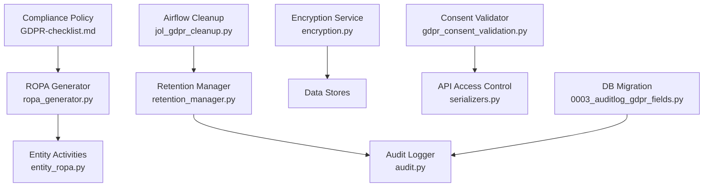
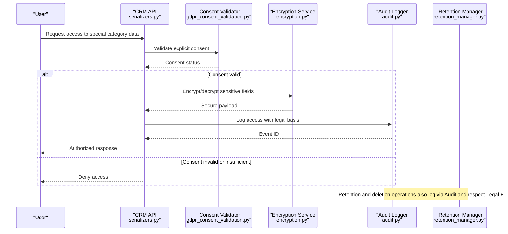
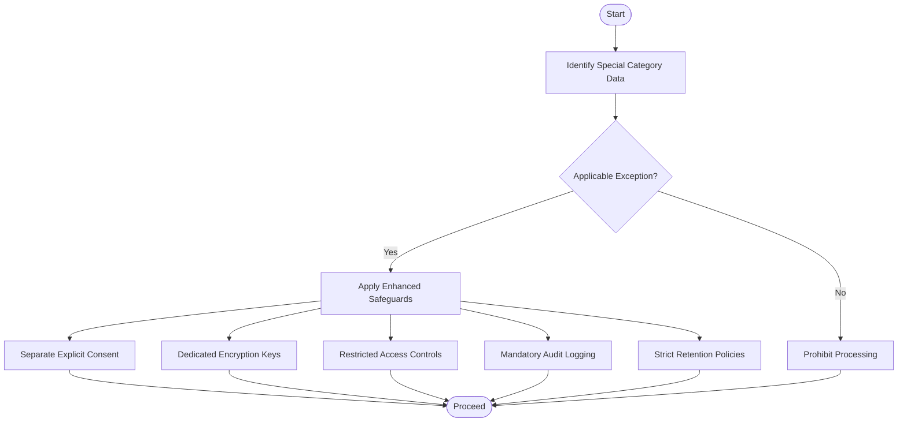
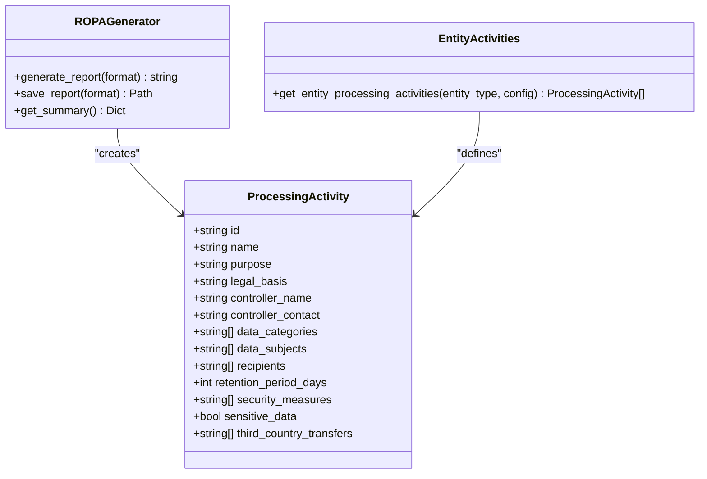
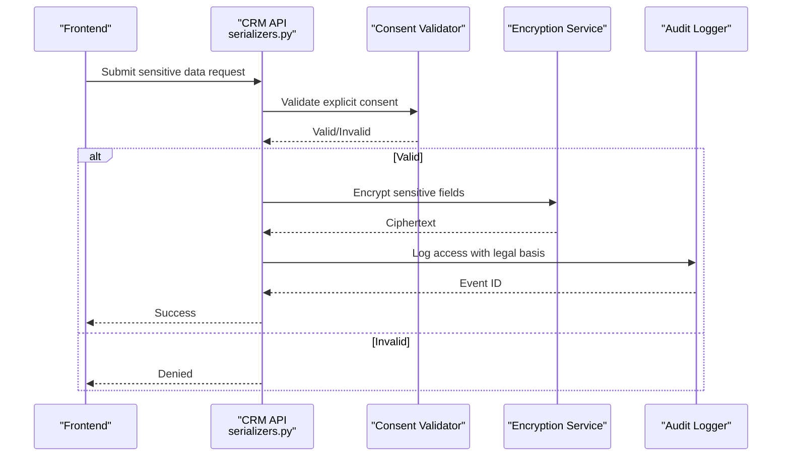
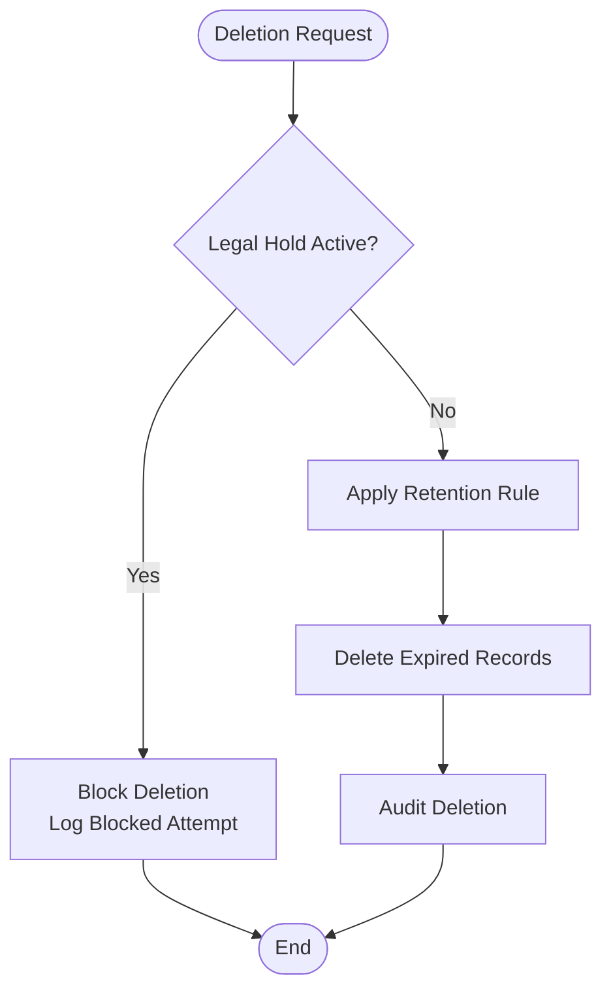
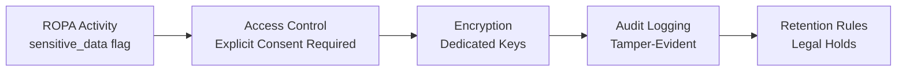
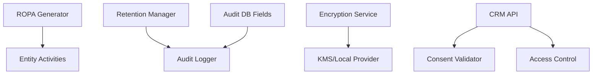

# Special Category Data Processing

<cite>
**Referenced Files in This Document**
- [GDPR-checklist.md](file://docs/compliance/GDPR-checklist.md)
- [entity_ropa.py](file://data/src/gdpr/entity_ropa.py)
- [ropa_generator.py](file://data/src/gdpr/ropa_generator.py)
- [retention_manager.py](file://data/src/gdpr/retention_manager.py)
- [encryption.py](file://data/src/encryption.py)
- [audit.py](file://data/src/audit.py)
- [0003_auditlog_gdpr_fields.py](file://backend/django/apps/core/migrations/0003_auditlog_gdpr_fields.py)
- [gdpr_consent_validation.py](file://data/src/quality/expectations/gdpr_consent_validation.py)
- [serializers.py](file://backend/django/apps/crm/api/serializers.py)
- [jol_gdpr_cleanup.py](file://data/airflow/dags/jol_gdpr_cleanup.py)
- [test_gdpr.py](file://data/tests/test_gdpr.py)
</cite>

## Table of Contents
1. Introduction
2. Project Structure
3. Core Components
4. Architecture Overview
5. Detailed Component Analysis
6. Dependency Analysis
7. Performance Considerations
8. Troubleshooting Guide
9. Conclusion
10. Appendices

## Introduction
This document explains how the platform processes special category data under Article 9, focusing on religious institutions. It covers the prohibition framework and applicable exceptions (explicit consent, manifestly public data, religious organization processing, substantial public interest), enhanced safeguards (separate explicit consent, dedicated encryption keys, restricted access, mandatory audit logging), technical classification and segregation of sensitive data, retention policies, DPIA requirements, data minimization, and cross-border transfer considerations. Practical examples include processing religious beliefs for pastoral care, health information for pastoral care, and biometric data for attendance systems.

## Project Structure
The repository implements GDPR controls across several modules:
- Compliance policy and checklists define triggers and safeguards for special category data.
- ROPA generation documents processing activities per entity type with legal bases and security measures.
- Retention management enforces storage limitation and right to erasure with legal holds.
- Encryption provides key lifecycle management and envelope encryption.
- Audit logging ensures tamper-evident records with hash chains and signatures.
- Consent validation enforces Article 7 requirements.
- API serializers enforce access control for special category data.
- Airflow DAGs support GDPR cleanup tasks.

**Diagram sources**
- [GDPR-checklist.md:634-672](file://docs/compliance/GDPR-checklist.md#L634-L672)
- [ropa_generator.py:1-182](file://data/src/gdpr/ropa_generator.py#L1-L182)
- [entity_ropa.py:1-800](file://data/src/gdpr/entity_ropa.py#L1-L800)
- [retention_manager.py:1-336](file://data/src/gdpr/retention_manager.py#L1-L336)
- [audit.py:1-644](file://data/src/audit.py#L1-L644)
- [encryption.py:1-575](file://data/src/encryption.py#L1-L575)
- [gdpr_consent_validation.py:1-211](file://data/src/quality/expectations/gdpr_consent_validation.py#L1-L211)
- [serializers.py:63-83](file://backend/django/apps/crm/api/serializers.py#L63-L83)
- [jol_gdpr_cleanup.py:1-200](file://data/airflow/dags/jol_gdpr_cleanup.py#L1-L200)
- [0003_auditlog_gdpr_fields.py:1-48](file://backend/django/apps/core/migrations/0003_auditlog_gdpr_fields.py#L1-L48)

**Section sources**
- [GDPR-checklist.md:634-672](file://docs/compliance/GDPR-checklist.md#L634-L672)
- [ropa_generator.py:1-182](file://data/src/gdpr/ropa_generator.py#L1-L182)
- [entity_ropa.py:1-800](file://data/src/gdpr/entity_ropa.py#L1-L800)
- [retention_manager.py:1-336](file://data/src/gdpr/retention_manager.py#L1-L336)
- [encryption.py:1-575](file://data/src/encryption.py#L1-L575)
- [audit.py:1-644](file://data/src/audit.py#L1-L644)
- [gdpr_consent_validation.py:1-211](file://data/src/quality/expectations/gdpr_consent_validation.py#L1-L211)
- [serializers.py:63-83](file://backend/django/apps/crm/api/serializers.py#L63-L83)
- [jol_gdpr_cleanup.py:1-200](file://data/airflow/dags/jol_gdpr_cleanup.py#L1-L200)
- [0003_auditlog_gdpr_fields.py:1-48](file://backend/django/apps/core/migrations/0003_auditlog_gdpr_fields.py#L1-L48)

## Core Components
- Prohibition and exceptions mapping for Article 9, including religious institution contexts.
- Entity-specific ROPA that identifies sensitive data categories and legal bases.
- Retention rules and legal hold enforcement to honor storage limitation and erasure rights.
- Encryption service with pluggable providers and key rotation for enhanced protection.
- Tamper-evident audit logs with chain integrity and GDPR request tracking.
- Consent validation ensuring explicit, time-bound, and withdrawable consent.
- API-level access control gating special category data behind explicit consent and role checks.

**Section sources**
- [GDPR-checklist.md:634-672](file://docs/compliance/GDPR-checklist.md#L634-L672)
- [entity_ropa.py:105-165](file://data/src/gdpr/entity_ropa.py#L105-L165)
- [retention_manager.py:188-336](file://data/src/gdpr/retention_manager.py#L188-L336)
- [encryption.py:346-521](file://data/src/encryption.py#L346-L521)
- [audit.py:205-369](file://data/src/audit.py#L205-L369)
- [gdpr_consent_validation.py:52-142](file://data/src/quality/expectations/gdpr_consent_validation.py#L52-L142)
- [serializers.py:63-83](file://backend/django/apps/crm/api/serializers.py#L63-L83)

## Architecture Overview
The system applies a layered approach:
- Policy layer defines when special category data is prohibited and which exceptions apply.
- Classification and segregation layer tags sensitive fields and routes them through protected pipelines.
- Safeguards layer enforces consent, encryption, access control, and audit logging.
- Lifecycle layer manages retention and deletion with legal holds.
- Reporting layer generates ROPA and compliance reports.

**Diagram sources**
- [serializers.py:63-83](file://backend/django/apps/crm/api/serializers.py#L63-L83)
- [gdpr_consent_validation.py:52-142](file://data/src/quality/expectations/gdpr_consent_validation.py#L52-L142)
- [encryption.py:346-521](file://data/src/encryption.py#L346-L521)
- [audit.py:205-369](file://data/src/audit.py#L205-L369)
- [retention_manager.py:188-336](file://data/src/gdpr/retention_manager.py#L188-L336)

## Detailed Component Analysis

### Prohibition Framework and Exceptions (Article 9)
- Identifies special categories including religious beliefs, health, and biometric data.
- Enumerates exceptions relevant to religious institutions: explicit consent, manifestly public data, religious organization processing, substantial public interest, and others.
- Requires enhanced protections such as separate consent documentation, encryption with separate keys, need-to-know access, mandatory audit logging, strict retention, and DPIA.

**Diagram sources**
- [GDPR-checklist.md:634-672](file://docs/compliance/GDPR-checklist.md#L634-L672)

**Section sources**
- [GDPR-checklist.md:634-672](file://docs/compliance/GDPR-checklist.md#L634-L672)

### ROPA and Sensitive Data Classification
- ROPA generator structures processing activities with legal basis, data categories, recipients, retention, and security measures.
- Entity-specific module maps activities for basilica, cathedral, diocese, deanery, church, protestant, orthodox, greek catholic, funeral, and cemetery entities, marking sensitive data where applicable.
- Reports summarize counts of activities involving sensitive data and maximum retention periods.

**Diagram sources**
- [ropa_generator.py:19-42](file://data/src/gdpr/ropa_generator.py#L19-L42)
- [ropa_generator.py:103-182](file://data/src/gdpr/ropa_generator.py#L103-L182)
- [entity_ropa.py:39-65](file://data/src/gdpr/entity_ropa.py#L39-L65)

**Section sources**
- [ropa_generator.py:1-182](file://data/src/gdpr/ropa_generator.py#L1-L182)
- [entity_ropa.py:105-165](file://data/src/gdpr/entity_ropa.py#L105-L165)
- [entity_ropa.py:342-403](file://data/src/gdpr/entity_ropa.py#L342-L403)
- [entity_ropa.py:471-518](file://data/src/gdpr/entity_ropa.py#L471-L518)
- [entity_ropa.py:574-646](file://data/src/gdpr/entity_ropa.py#L574-L646)
- [entity_ropa.py:649-720](file://data/src/gdpr/entity_ropa.py#L649-L720)

### Enhanced Safeguards: Consent, Encryption, Access, Audit
- Consent validation enforces explicit, specific, informed, and withdrawable consent with expiry checks and batch validation.
- Encryption service supports AWS KMS and local providers, envelope encryption, automatic rotation, and re-encryption workflows.
- API serializers restrict access to special category data unless admin or explicit consent is present and data classification requires it.
- Audit logger creates tamper-evident events with hash chains, HMAC signatures, sequence numbers, and GDPR request logging.

**Diagram sources**
- [serializers.py:63-83](file://backend/django/apps/crm/api/serializers.py#L63-L83)
- [gdpr_consent_validation.py:52-142](file://data/src/quality/expectations/gdpr_consent_validation.py#L52-L142)
- [encryption.py:346-521](file://data/src/encryption.py#L346-L521)
- [audit.py:205-369](file://data/src/audit.py#L205-L369)

**Section sources**
- [gdpr_consent_validation.py:1-211](file://data/src/quality/expectations/gdpr_consent_validation.py#L1-L211)
- [encryption.py:1-575](file://data/src/encryption.py#L1-L575)
- [serializers.py:63-83](file://backend/django/apps/crm/api/serializers.py#L63-L83)
- [audit.py:1-644](file://data/src/audit.py#L1-L644)

### Retention and Erasure with Legal Holds
- Retention rules define durations and legal bases for different data types.
- Deletion operations check legal holds before erasing data; blocked deletions are audited and reported.
- Batch cleanup supports dry runs and subject skipping based on legal holds.

**Diagram sources**
- [retention_manager.py:188-336](file://data/src/gdpr/retention_manager.py#L188-L336)

**Section sources**
- [retention_manager.py:78-106](file://data/src/gdpr/retention_manager.py#L78-L106)
- [retention_manager.py:188-336](file://data/src/gdpr/retention_manager.py#L188-L336)
- [test_gdpr.py:57-84](file://data/tests/test_gdpr.py#L57-L84)

### Technical Implementation: Classification, Segregation, and Retention
- Classification: ROPA marks sensitive_data flags and data_categories for each activity.
- Segregation: API access control gates special category data behind explicit consent and role checks.
- Retention: Entity-specific retention periods enforced by retention manager; approaching expiry tracked in reporting models.

**Diagram sources**
- [entity_ropa.py:105-165](file://data/src/gdpr/entity_ropa.py#L105-L165)
- [serializers.py:63-83](file://backend/django/apps/crm/api/serializers.py#L63-L83)
- [encryption.py:346-521](file://data/src/encryption.py#L346-L521)
- [audit.py:205-369](file://data/src/audit.py#L205-L369)
- [retention_manager.py:188-336](file://data/src/gdpr/retention_manager.py#L188-L336)

**Section sources**
- [entity_ropa.py:105-165](file://data/src/gdpr/entity_ropa.py#L105-L165)
- [serializers.py:63-83](file://backend/django/apps/crm/api/serializers.py#L63-L83)
- [encryption.py:346-521](file://data/src/encryption.py#L346-L521)
- [audit.py:205-369](file://data/src/audit.py#L205-L369)
- [retention_manager.py:188-336](file://data/src/gdpr/retention_manager.py#L188-L336)

### Practical Examples
- Religious beliefs data for pastoral care:
  - Use entity activities marked sensitive_data with legal basis Art. 9(2)(d).
  - Require separate explicit consent documented and validated.
  - Encrypt with dedicated keys and restrict access to clergy/admin roles.
  - Log all access and decisions; enforce retention aligned with canonical obligations.
- Health information for pastoral care:
  - Treat as special category; require explicit consent or other lawful exception.
  - Apply enhanced encryption and access controls; ensure audit trails.
  - Shorter retention where appropriate; honor erasure unless legal holds apply.
- Biometric data for attendance systems:
  - Mark as special category; implement explicit consent and necessity assessment.
  - Use strong encryption and minimal data collection; consider anonymization for analytics.
  - Maintain strict retention and audit logging; evaluate DPIA due to high risk.

[No sources needed since this section provides conceptual guidance grounded in referenced components]

### DPIA Requirements
- DPIA triggers include large-scale processing of special categories and new technologies.
- The checklist outlines required elements: description, purposes, legitimacy, necessity, risks, mitigations, safeguards, and approval workflow.
- High-risk processing may require supervisory authority consultation.

**Section sources**
- [GDPR-checklist.md:587-633](file://docs/compliance/GDPR-checklist.md#L587-L633)

### Data Minimization Strategies
- Collect only necessary fields for pastoral care and administrative functions.
- Prefer pseudonymization/anonymization for analytics and reporting.
- Limit retention to statutory or operational needs; automate deletion.
- Enforce least privilege access and segregate sensitive data.

[No sources needed since this section provides general guidance]

### Cross-Border Transfer Considerations
- Maintain lists of adequate countries and verify adequacy decisions.
- Use Standard Contractual Clauses with non-EU processors and conduct transfer impact assessments.
- Implement supplementary measures where needed; document derogations for specific situations.

**Section sources**
- [GDPR-checklist.md:429-462](file://docs/compliance/GDPR-checklist.md#L429-L462)

## Dependency Analysis
Key dependencies and relationships:
- ROPA generator depends on entity-specific activity definitions to produce compliant records.
- Retention manager depends on audit logger for event recording and legal hold registry for blocking deletions.
- Encryption service integrates with external providers (AWS KMS) and supports local fallback.
- Consent validator feeds into API access control to gate sensitive data.
- DB migration adds GDPR fields to audit logs enabling structured compliance queries.

**Diagram sources**
- [ropa_generator.py:103-182](file://data/src/gdpr/ropa_generator.py#L103-L182)
- [entity_ropa.py:39-65](file://data/src/gdpr/entity_ropa.py#L39-L65)
- [retention_manager.py:188-336](file://data/src/gdpr/retention_manager.py#L188-L336)
- [audit.py:205-369](file://data/src/audit.py#L205-L369)
- [encryption.py:346-521](file://data/src/encryption.py#L346-L521)
- [serializers.py:63-83](file://backend/django/apps/crm/api/serializers.py#L63-L83)
- [0003_auditlog_gdpr_fields.py:1-48](file://backend/django/apps/core/migrations/0003_auditlog_gdpr_fields.py#L1-L48)

**Section sources**
- [ropa_generator.py:103-182](file://data/src/gdpr/ropa_generator.py#L103-L182)
- [entity_ropa.py:39-65](file://data/src/gdpr/entity_ropa.py#L39-L65)
- [retention_manager.py:188-336](file://data/src/gdpr/retention_manager.py#L188-L336)
- [audit.py:205-369](file://data/src/audit.py#L205-L369)
- [encryption.py:346-521](file://data/src/encryption.py#L346-L521)
- [serializers.py:63-83](file://backend/django/apps/crm/api/serializers.py#L63-L83)
- [0003_auditlog_gdpr_fields.py:1-48](file://backend/django/apps/core/migrations/0003_auditlog_gdpr_fields.py#L1-L48)

## Performance Considerations
- Use envelope encryption to minimize cryptographic overhead while maintaining strong security.
- Cache decrypted keys briefly with TTL to reduce KMS calls during high-throughput operations.
- Batch consent validations and retention checks to reduce API latency.
- Segment audit logs by date to improve query performance and enable efficient rotation.

[No sources needed since this section provides general guidance]

## Troubleshooting Guide
Common issues and resolutions:
- Consent expired or withdrawn: Re-consent required; update consent records and re-validate before processing.
- Encryption key missing or rotated: Ensure current key loaded; use re-encryption to migrate data if needed.
- Audit chain integrity failure: Verify secret key and chain state; investigate tampering or misconfiguration.
- Deletion blocked by legal hold: Review active holds; lift only when legally permissible; document rationale.
- API access denied for special category data: Confirm explicit consent and role permissions; adjust access policies accordingly.

**Section sources**
- [gdpr_consent_validation.py:52-142](file://data/src/quality/expectations/gdpr_consent_validation.py#L52-L142)
- [encryption.py:346-521](file://data/src/encryption.py#L346-L521)
- [audit.py:513-589](file://data/src/audit.py#L513-L589)
- [retention_manager.py:257-336](file://data/src/gdpr/retention_manager.py#L257-L336)
- [serializers.py:63-83](file://backend/django/apps/crm/api/serializers.py#L63-L83)

## Conclusion
The platform implements a robust framework for special category data processing tailored to religious institutions. It combines clear prohibitions and exceptions, strong safeguards, precise classification and segregation, and rigorous lifecycle management. By enforcing explicit consent, dedicated encryption, restricted access, and tamper-evident auditing, the system aligns with GDPR requirements and supports safe, lawful processing of sensitive data in pastoral and administrative contexts.

[No sources needed since this section summarizes without analyzing specific files]

## Appendices
- Airflow cleanup task for GDPR-related maintenance can be scheduled to enforce retention and erasure policies consistently.

**Section sources**
- [jol_gdpr_cleanup.py:1-200](file://data/airflow/dags/jol_gdpr_cleanup.py#L1-L200)