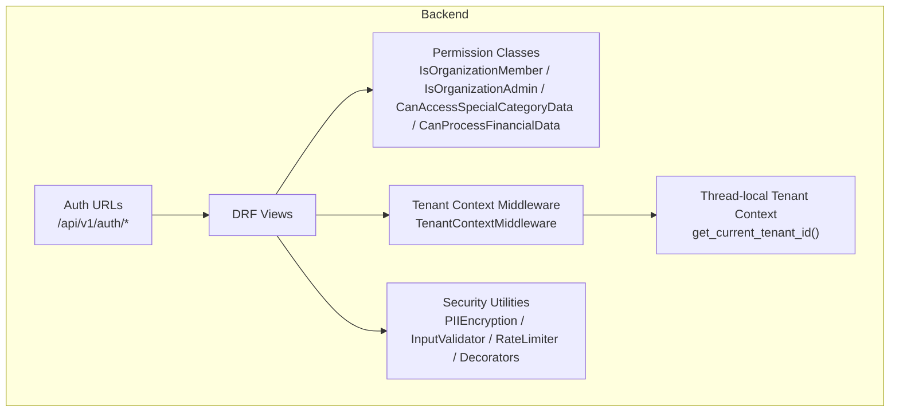
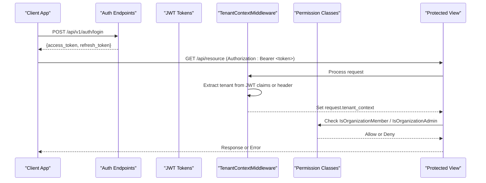
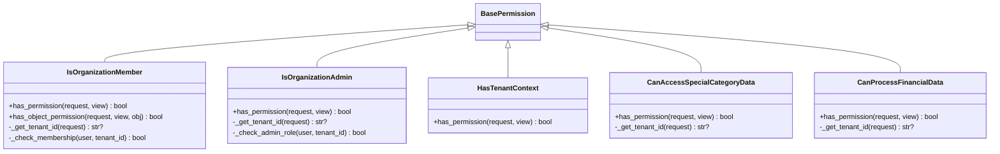
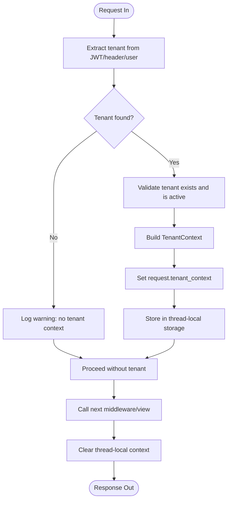
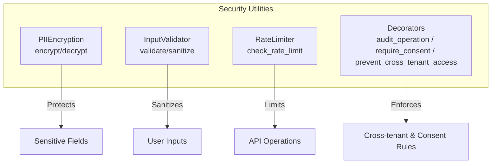
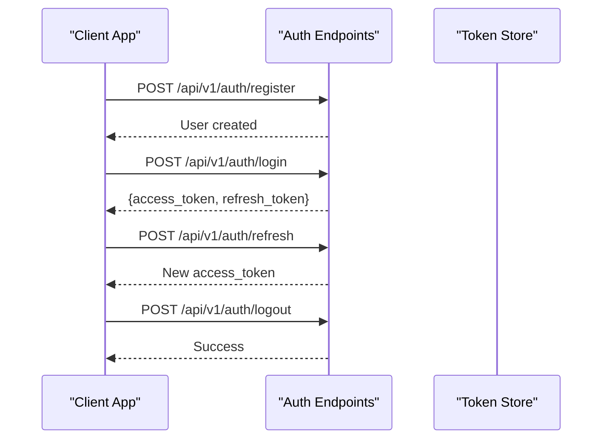
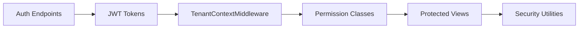

# Authentication & Authorization

<cite>
**Referenced Files in This Document**
- [permissions.py](file://backend/django/apps/core/permissions.py)
- [middleware.py](file://backend/django/apps/crm/middleware.py)
- [security.py](file://backend/django/apps/crm/security.py)
- [auth_urls.py](file://backend/django/apps/users/auth_urls.py)
</cite>

## Table of Contents
1. [Introduction](#introduction)
2. [Project Structure](#project-structure)
3. [Core Components](#core-components)
4. [Architecture Overview](#architecture-overview)
5. [Detailed Component Analysis](#detailed-component-analysis)
6. [Dependency Analysis](#dependency-analysis)
7. [Performance Considerations](#performance-considerations)
8. [Troubleshooting Guide](#troubleshooting-guide)
9. [Conclusion](#conclusion)
10. [Appendices](#appendices)

## Introduction
This document explains the JOL-HUB platform’s authentication and authorization system with a focus on:
- Multi-layered authentication using JWT tokens and session-aware flows
- Tenant isolation and multi-tenant access control
- Role-based access control (RBAC) via organization membership and roles
- Specialized permission classes for sensitive data and financial operations
- Security middleware, request context handling, and cross-tenant access prevention
- Practical guidance for implementing custom permissions, securing API endpoints, and managing user roles across organizations

The implementation centers around Django REST Framework (DRF) permission classes, tenant context middleware, and security utilities that enforce strict boundaries between tenants and roles.

## Project Structure
The authentication and authorization features are implemented primarily in the backend Django application:
- Permission classes define RBAC and tenant-scoped access rules
- Middleware establishes per-request tenant context from JWT claims or headers
- Security utilities provide encryption, input validation, rate limiting, and decorators to prevent cross-tenant access
- Authentication URL patterns expose token-based login, registration, logout, and refresh endpoints

**Diagram sources**
- [permissions.py:26-331](file://backend/django/apps/core/permissions.py#L26-L331)
- [middleware.py:96-299](file://backend/django/apps/crm/middleware.py#L96-L299)
- [security.py:38-142](file://backend/django/apps/crm/security.py#L38-L142)
- [security.py:148-312](file://backend/django/apps/crm/security.py#L148-L312)
- [security.py:327-421](file://backend/django/apps/crm/security.py#L327-L421)
- [security.py:494-523](file://backend/django/apps/crm/security.py#L494-L523)
- [auth_urls.py:16-21](file://backend/django/apps/users/auth_urls.py#L16-L21)

**Section sources**
- [permissions.py:26-331](file://backend/django/apps/core/permissions.py#L26-L331)
- [middleware.py:96-299](file://backend/django/apps/crm/middleware.py#L96-L299)
- [security.py:38-142](file://backend/django/apps/crm/security.py#L38-L142)
- [security.py:148-312](file://backend/django/apps/crm/security.py#L148-L312)
- [security.py:327-421](file://backend/django/apps/crm/security.py#L327-L421)
- [security.py:494-523](file://backend/django/apps/crm/security.py#L494-L523)
- [auth_urls.py:16-21](file://backend/django/apps/users/auth_urls.py#L16-L21)

## Core Components
- Permission classes enforce RBAC and tenant isolation at the view level
- Tenant context middleware extracts and validates tenant identity per request
- Security utilities provide encryption, input sanitization, rate limiting, and decorators to guard against cross-tenant access
- Authentication endpoints issue and manage JWT tokens for authenticated sessions

Key responsibilities:
- Validate user authentication and organization membership
- Enforce admin-only operations and sensitive data access controls
- Ensure all requests operate within a validated tenant boundary
- Provide reusable tools for secure data handling and audit logging

**Section sources**
- [permissions.py:26-331](file://backend/django/apps/core/permissions.py#L26-L331)
- [middleware.py:96-299](file://backend/django/apps/crm/middleware.py#L96-L299)
- [security.py:38-142](file://backend/django/apps/crm/security.py#L38-L142)
- [security.py:148-312](file://backend/django/apps/crm/security.py#L148-L312)
- [security.py:327-421](file://backend/django/apps/crm/security.py#L327-L421)
- [security.py:494-523](file://backend/django/apps/crm/security.py#L494-L523)
- [auth_urls.py:16-21](file://backend/django/apps/users/auth_urls.py#L16-L21)

## Architecture Overview
The system uses a layered approach:
- Authentication layer issues JWTs and manages token lifecycle
- Middleware layer resolves tenant context from JWT claims or headers
- Permission layer enforces RBAC and tenant-scoped access rules
- Security utilities protect sensitive data and enforce operational constraints

**Diagram sources**
- [auth_urls.py:16-21](file://backend/django/apps/users/auth_urls.py#L16-L21)
- [middleware.py:122-197](file://backend/django/apps/crm/middleware.py#L122-L197)
- [permissions.py:45-137](file://backend/django/apps/core/permissions.py#L45-L137)

## Detailed Component Analysis

### Permission Classes
These DRF BasePermission subclasses implement RBAC and tenant isolation:
- IsOrganizationMember: Validates active membership in the requested tenant; prevents cross-tenant object access
- IsOrganizationAdmin: Requires admin role or owner status in the tenant
- HasTenantContext: Ensures a valid tenant context is present before processing
- CanAccessSpecialCategoryData: Restricts access to special category data to authorized roles (e.g., admin/editor)
- CanProcessFinancialData: Restricts financial data processing to admins or owners

**Diagram sources**
- [permissions.py:26-331](file://backend/django/apps/core/permissions.py#L26-L331)

**Section sources**
- [permissions.py:26-331](file://backend/django/apps/core/permissions.py#L26-L331)

### Tenant Context Middleware
The middleware establishes a per-request tenant context by:
- Extracting tenant ID from JWT claims or X-Tenant-ID header
- Falling back to the authenticated user’s default organization
- Validating tenant existence and activity
- Injecting a TenantContext into the request and thread-local storage
- Clearing context after response to prevent leakage

**Diagram sources**
- [middleware.py:122-197](file://backend/django/apps/crm/middleware.py#L122-L197)
- [middleware.py:233-299](file://backend/django/apps/crm/middleware.py#L233-L299)

**Section sources**
- [middleware.py:96-299](file://backend/django/apps/crm/middleware.py#L96-L299)

### Security Utilities
Security utilities provide:
- PII encryption/decryption using symmetric encryption derived from Django SECRET_KEY
- Input validation and sanitization to prevent injection and XSS
- Rate limiting with configurable policies per operation type
- Decorators to enforce consent and prevent cross-tenant access

**Diagram sources**
- [security.py:38-142](file://backend/django/apps/crm/security.py#L38-L142)
- [security.py:148-312](file://backend/django/apps/crm/security.py#L148-L312)
- [security.py:327-421](file://backend/django/apps/crm/security.py#L327-L421)
- [security.py:427-523](file://backend/django/apps/crm/security.py#L427-L523)

**Section sources**
- [security.py:38-142](file://backend/django/apps/crm/security.py#L38-L142)
- [security.py:148-312](file://backend/django/apps/crm/security.py#L148-L312)
- [security.py:327-421](file://backend/django/apps/crm/security.py#L327-L421)
- [security.py:427-523](file://backend/django/apps/crm/security.py#L427-L523)

### Authentication Endpoints
Authentication endpoints expose:
- Registration
- Login (returns JWT tokens)
- Logout (blacklists refresh token)
- Token refresh

These endpoints integrate with DRF’s JWT authentication flow and feed tokens used by middleware to establish tenant context.

**Diagram sources**
- [auth_urls.py:16-21](file://backend/django/apps/users/auth_urls.py#L16-L21)

**Section sources**
- [auth_urls.py:16-21](file://backend/django/apps/users/auth_urls.py#L16-L21)

## Dependency Analysis
The components interact through well-defined contracts:
- Permission classes depend on tenant context established by middleware
- Middleware depends on JWT authentication to extract tenant claims
- Security utilities are invoked by views or decorators to enforce additional constraints
- Authentication endpoints produce tokens consumed by downstream middleware and permission checks

**Diagram sources**
- [auth_urls.py:16-21](file://backend/django/apps/users/auth_urls.py#L16-L21)
- [middleware.py:122-197](file://backend/django/apps/crm/middleware.py#L122-L197)
- [permissions.py:45-137](file://backend/django/apps/core/permissions.py#L45-L137)
- [security.py:494-523](file://backend/django/apps/crm/security.py#L494-L523)

**Section sources**
- [auth_urls.py:16-21](file://backend/django/apps/users/auth_urls.py#L16-L21)
- [middleware.py:122-197](file://backend/django/apps/crm/middleware.py#L122-L197)
- [permissions.py:45-137](file://backend/django/apps/core/permissions.py#L45-L137)
- [security.py:494-523](file://backend/django/apps/crm/security.py#L494-L523)

## Performance Considerations
- Tenant info caching: The middleware caches tenant metadata to reduce database lookups during high traffic
- Thread-local context: Avoids repeated tenant resolution across the request lifecycle
- Permission checks: Use efficient queries to validate membership and roles; avoid N+1 queries in loops
- Rate limiting: Uses cache-backed sliding windows to throttle sensitive operations without excessive overhead
- Encryption: Field-level encryption adds CPU cost; apply selectively to sensitive fields only

[No sources needed since this section provides general guidance]

## Troubleshooting Guide
Common issues and resolutions:
- Missing tenant context: Ensure JWT includes tenant claim or include X-Tenant-ID header; verify middleware order and configuration
- Cross-tenant access attempts: Logs indicate violations; confirm object belongs to current tenant and use prevent_cross_tenant_access decorator where appropriate
- Permission denied errors: Verify user membership and role in the target tenant; check IsOrganizationMember and IsOrganizationAdmin logic
- Financial data access failures: Only admins or owners can process financial data; ensure correct role assignment
- Rate limit exceeded: Adjust RateLimiter configurations for specific endpoints; monitor cache keys and window resets

**Section sources**
- [middleware.py:122-197](file://backend/django/apps/crm/middleware.py#L122-L197)
- [permissions.py:45-137](file://backend/django/apps/core/permissions.py#L45-L137)
- [permissions.py:176-202](file://backend/django/apps/core/permissions.py#L176-L202)
- [permissions.py:281-312](file://backend/django/apps/core/permissions.py#L281-L312)
- [security.py:327-421](file://backend/django/apps/crm/security.py#L327-L421)
- [security.py:494-523](file://backend/django/apps/crm/security.py#L494-L523)

## Conclusion
JOL-HUB implements a robust, multi-layered authentication and authorization system:
- JWT-based authentication with clear token lifecycle management
- Tenant isolation enforced by middleware and validated by permission classes
- RBAC via organization membership and roles, with specialized guards for sensitive and financial data
- Security utilities providing encryption, input validation, rate limiting, and cross-tenant protection
This design ensures strong security posture while remaining extensible for custom permissions and endpoint protections.

[No sources needed since this section summarizes without analyzing specific files]

## Appendices

### Implementing Custom Permissions
To create a custom permission:
- Subclass DRF’s BasePermission
- Implement has_permission to check user, tenant context, and business rules
- Optionally implement has_object_permission for object-level checks
- Combine with existing permissions like IsAuthenticated and IsOrganizationMember

Example pattern references:
- Membership and role checks similar to IsOrganizationMember and IsOrganizationAdmin
- Tenant extraction via get_current_tenant_id or request.tenant_context

**Section sources**
- [permissions.py:45-137](file://backend/django/apps/core/permissions.py#L45-L137)
- [permissions.py:176-202](file://backend/django/apps/core/permissions.py#L176-L202)
- [middleware.py:74-82](file://backend/django/apps/crm/middleware.py#L74-L82)

### Securing API Endpoints
Best practices:
- Apply IsAuthenticated and IsOrganizationMember to restrict access to authenticated members
- Add IsOrganizationAdmin for administrative operations
- Use CanAccessSpecialCategoryData for GDPR-sensitive data
- Use CanProcessFinancialData for PCI-DSS-related operations
- Apply prevent_cross_tenant_access decorator to ensure resource ownership within tenant

**Section sources**
- [permissions.py:26-331](file://backend/django/apps/core/permissions.py#L26-L331)
- [security.py:494-523](file://backend/django/apps/crm/security.py#L494-L523)

### Managing User Roles Across Organizations
Guidance:
- Assign roles via OrganizationMember records with is_active flags
- Admins and owners gain elevated privileges for sensitive operations
- Regularly audit memberships and roles to maintain least privilege
- Leverage HasTenantContext to ensure tenant-scoped operations

**Section sources**
- [permissions.py:106-137](file://backend/django/apps/core/permissions.py#L106-L137)
- [permissions.py:176-202](file://backend/django/apps/core/permissions.py#L176-L202)
- [permissions.py:281-312](file://backend/django/apps/core/permissions.py#L281-L312)