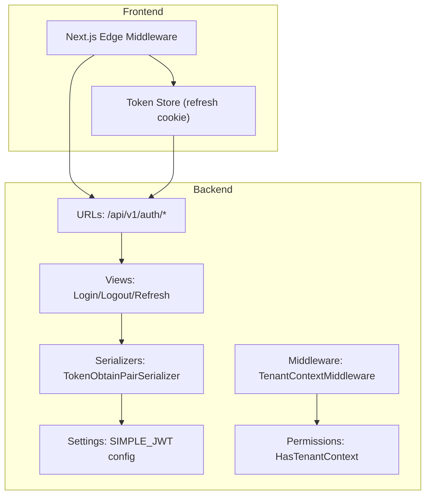
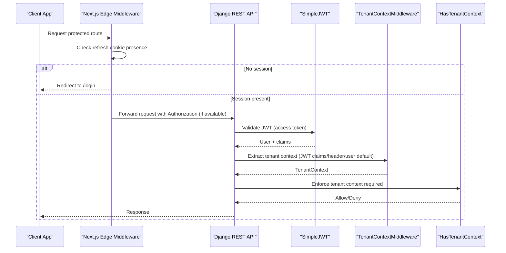
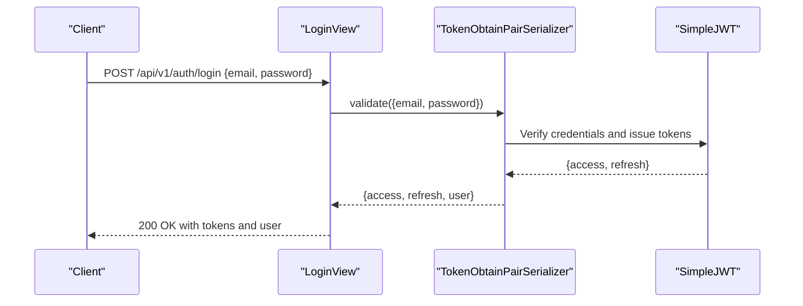
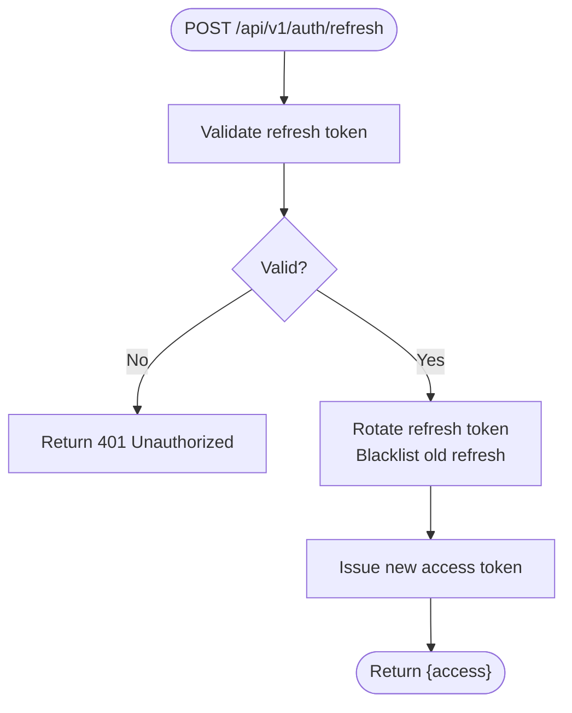
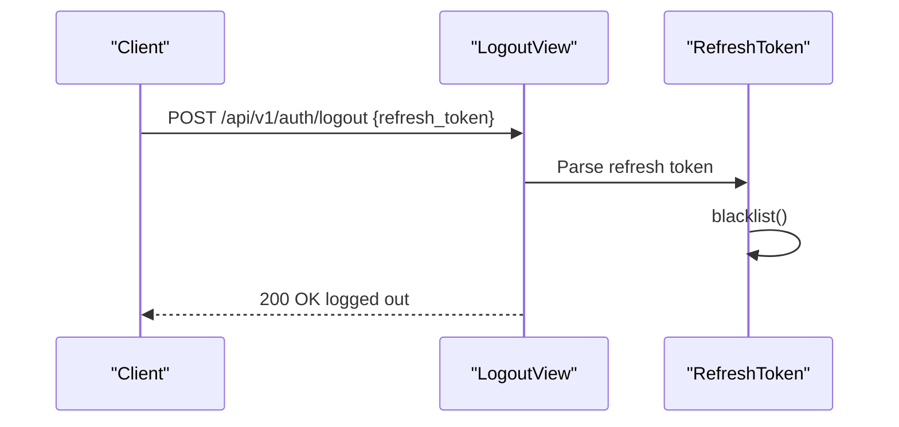
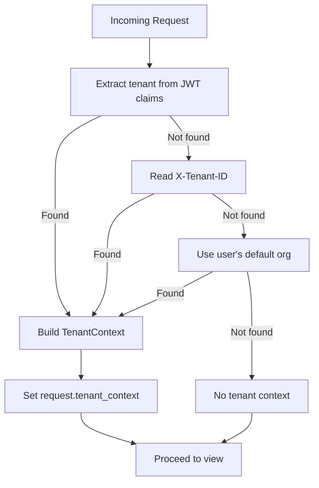
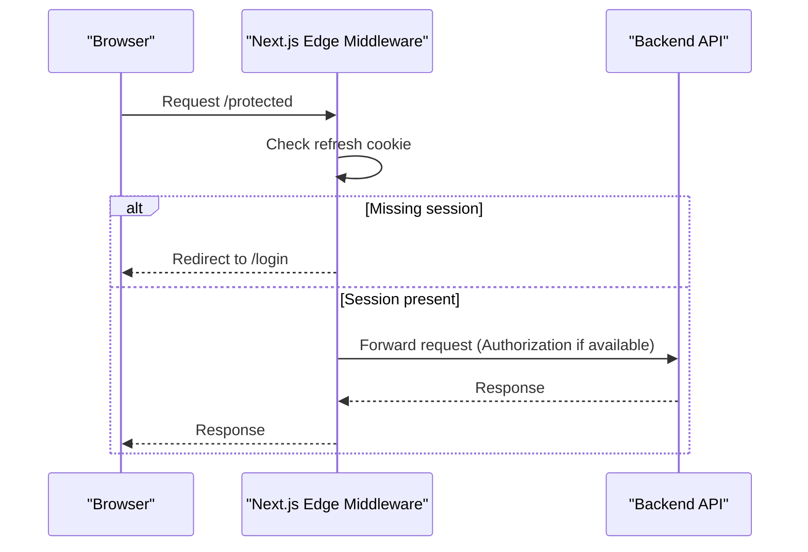
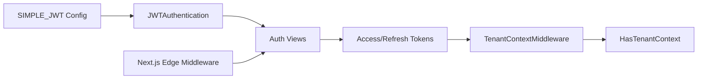

# JWT Authentication System

<cite>
**Referenced Files in This Document**
- [base.py](file://backend/django/core/settings/base.py)
- [auth_urls.py](file://backend/django/apps/users/auth_urls.py)
- [views.py](file://backend/django/apps/users/views.py)
- [serializers.py](file://backend/django/apps/users/serializers.py)
- [models.py](file://backend/django/apps/users/models.py)
- [middleware.py](file://backend/django/apps/crm/middleware.py)
- [permissions.py](file://backend/django/apps/core/permissions.py)
- [tokenStore.ts](file://frontend/react/src/lib/tokenStore.ts)
- [middleware.ts](file://frontend/react/src/middleware.ts)
</cite>

## Table of Contents
1. [Introduction](#introduction)
2. [Project Structure](#project-structure)
3. [Core Components](#core-components)
4. [Architecture Overview](#architecture-overview)
5. [Detailed Component Analysis](#detailed-component-analysis)
6. [Dependency Analysis](#dependency-analysis)
7. [Performance Considerations](#performance-considerations)
8. [Troubleshooting Guide](#troubleshooting-guide)
9. [Conclusion](#conclusion)
10. [Appendices](#appendices)

## Introduction
This document explains the JWT-based authentication system in JOL-HUB. It covers the full token lifecycle (generation, validation, refresh, expiration), the login flow from credential verification to token issuance, and how authenticated requests are processed with tenant context. It also documents the JWT payload structure used by the backend, the middleware that validates tokens and establishes per-request context, and practical guidance for securing API endpoints and implementing custom backends.

## Project Structure
The JWT authentication spans Django REST Framework on the backend and Next.js on the frontend:
- Backend:
  - URL routes for auth endpoints
  - Views handling register, login, logout, refresh, and profile
  - Serializers extending SimpleJWT serializers
  - Settings configuring SimpleJWT behavior
  - Middleware establishing tenant context from JWT claims or headers
  - Permissions enforcing tenant context
- Frontend:
  - Token storage helpers for access and refresh tokens
  - Edge middleware guarding protected routes using a refresh cookie

**Diagram sources**
- [auth_urls.py:1-21](file://backend/django/apps/users/auth_urls.py#L1-L21)
- [views.py:31-70](file://backend/django/apps/users/views.py#L31-L70)
- [serializers.py:102-108](file://backend/django/apps/users/serializers.py#L102-L108)
- [base.py:282-355](file://backend/django/core/settings/base.py#L282-L355)
- [middleware.py:96-154](file://backend/django/apps/crm/middleware.py#L96-L154)
- [permissions.py:205-218](file://backend/django/apps/core/permissions.py#L205-L218)
- [middleware.ts:1-41](file://frontend/react/src/middleware.ts#L1-L41)
- [tokenStore.ts:1-40](file://frontend/react/src/lib/tokenStore.ts#L1-L40)

**Section sources**
- [auth_urls.py:1-21](file://backend/django/apps/users/auth_urls.py#L1-L21)
- [base.py:282-355](file://backend/django/core/settings/base.py#L282-L355)
- [middleware.ts:1-41](file://frontend/react/src/middleware.ts#L1-L41)
- [tokenStore.ts:1-40](file://frontend/react/src/lib/tokenStore.ts#L1-L40)

## Core Components
- Authentication URLs define endpoints for registration, login, logout, and token refresh.
- Views implement:
  - Registration with password validation
  - Login returning a JWT pair via SimpleJWT
  - Logout by blacklisting the refresh token
  - Profile retrieval for authenticated users
- Serializers extend SimpleJWT’s TokenObtainPairSerializer to include user data in the response.
- Settings configure SimpleJWT: algorithm, lifetimes, rotation, blacklist, header types, and claim fields.
- Middleware extracts tenant context from JWT claims or headers and injects it into the request.
- Permissions enforce that a valid tenant context exists before processing.
- Frontend stores the refresh token in a secure cookie and guards routes at the edge.

**Section sources**
- [auth_urls.py:1-21](file://backend/django/apps/users/auth_urls.py#L1-L21)
- [views.py:31-70](file://backend/django/apps/users/views.py#L31-L70)
- [serializers.py:102-108](file://backend/django/apps/users/serializers.py#L102-L108)
- [base.py:282-355](file://backend/django/core/settings/base.py#L282-L355)
- [middleware.py:96-154](file://backend/django/apps/crm/middleware.py#L96-L154)
- [permissions.py:205-218](file://backend/django/apps/core/permissions.py#L205-L218)
- [tokenStore.ts:1-40](file://frontend/react/src/lib/tokenStore.ts#L1-L40)
- [middleware.ts:1-41](file://frontend/react/src/middleware.ts#L1-L41)

## Architecture Overview
The authentication architecture combines server-side JWT issuance/validation with client-side session management and multi-tenant isolation.

**Diagram sources**
- [middleware.ts:1-41](file://frontend/react/src/middleware.ts#L1-L41)
- [views.py:40-70](file://backend/django/apps/users/views.py#L40-L70)
- [base.py:282-355](file://backend/django/core/settings/base.py#L282-L355)
- [middleware.py:96-154](file://backend/django/apps/crm/middleware.py#L96-L154)
- [permissions.py:205-218](file://backend/django/apps/core/permissions.py#L205-L218)

## Detailed Component Analysis

### Login Flow and Token Issuance
- The login endpoint uses SimpleJWT’s TokenObtainPairView with a custom serializer that attaches user data to the response.
- Password validation is enforced during registration; login relies on SimpleJWT’s built-in credential checks.
- Rate limiting is applied to sensitive endpoints to mitigate brute-force attempts.

**Diagram sources**
- [auth_urls.py:16-20](file://backend/django/apps/users/auth_urls.py#L16-L20)
- [views.py:40-49](file://backend/django/apps/users/views.py#L40-L49)
- [serializers.py:102-108](file://backend/django/apps/users/serializers.py#L102-L108)

**Section sources**
- [views.py:31-49](file://backend/django/apps/users/views.py#L31-L49)
- [serializers.py:53-85](file://backend/django/apps/users/serializers.py#L53-L85)
- [serializers.py:102-108](file://backend/django/apps/users/serializers.py#L102-L108)

### Token Refresh and Expiration Handling
- Access tokens have a short lifetime; refresh tokens rotate and are blacklisted after use.
- The refresh endpoint extends SimpleJWT’s TokenRefreshView to support rotation and blacklisting.
- On refresh failure, clients should redirect to login.

**Diagram sources**
- [base.py:329-355](file://backend/django/core/settings/base.py#L329-L355)
- [views.py:52-55](file://backend/django/apps/users/views.py#L52-L55)

**Section sources**
- [base.py:329-355](file://backend/django/core/settings/base.py#L329-L355)
- [views.py:52-55](file://backend/django/apps/users/views.py#L52-L55)

### Logout and Token Blacklisting
- Logout requires an authenticated user and a refresh token.
- The refresh token is parsed and blacklisted to invalidate the session.

**Diagram sources**
- [views.py:56-70](file://backend/django/apps/users/views.py#L56-L70)

**Section sources**
- [views.py:56-70](file://backend/django/apps/users/views.py#L56-L70)

### JWT Payload Structure and Claims
- The backend configures:
  - Algorithm HS256
  - Access token lifetime (short)
  - Refresh token lifetime (longer)
  - Rotation and blacklisting on refresh
  - Header type Bearer
  - Custom claim names for user ID and token type
- Login responses include a user object serialized from the User model.

Key configuration points:
- Algorithm and signing key
- Lifetimes and rotation policy
- Header name and type
- Claim fields for user identification

**Section sources**
- [base.py:329-355](file://backend/django/core/settings/base.py#L329-L355)
- [serializers.py:102-108](file://backend/django/apps/users/serializers.py#L102-L108)
- [models.py:17-84](file://backend/django/apps/users/models.py#L17-L84)

### Authentication Middleware and Tenant Context
- The CRM middleware establishes a per-request tenant context from:
  - JWT claims (preferred)
  - X-Tenant-ID header
  - User’s default organization
- It validates tenant existence and compliance attributes, then injects a TenantContext into the request.
- Permissions can require a valid tenant context for protected views.

**Diagram sources**
- [middleware.py:96-154](file://backend/django/apps/crm/middleware.py#L96-L154)
- [middleware.py:156-197](file://backend/django/apps/crm/middleware.py#L156-L197)

**Section sources**
- [middleware.py:96-154](file://backend/django/apps/crm/middleware.py#L96-L154)
- [permissions.py:205-218](file://backend/django/apps/core/permissions.py#L205-L218)

### Frontend Session Management and Route Guarding
- The Next.js edge middleware protects routes by checking for a refresh cookie.
- Access tokens are intentionally not stored in cookies to reduce XSS risk.
- Protected routes without a session are redirected to login.

**Diagram sources**
- [middleware.ts:1-41](file://frontend/react/src/middleware.ts#L1-L41)
- [tokenStore.ts:1-40](file://frontend/react/src/lib/tokenStore.ts#L1-L40)

**Section sources**
- [middleware.ts:1-41](file://frontend/react/src/middleware.ts#L1-L41)
- [tokenStore.ts:1-40](file://frontend/react/src/lib/tokenStore.ts#L1-L40)

### Securing API Endpoints with JWT
- Global defaults enable JWT authentication and require authentication for most endpoints.
- Specific views set explicit permission classes (e.g., IsAuthenticated).
- For multi-tenant features, ensure HasTenantContext is satisfied via middleware.

Implementation notes:
- Use IsAuthenticated for protected views.
- Apply rate limiting to sensitive endpoints.
- Ensure tenant context is established when needed.

**Section sources**
- [base.py:282-316](file://backend/django/core/settings/base.py#L282-L316)
- [views.py:73-85](file://backend/django/apps/users/views.py#L73-L85)
- [permissions.py:205-218](file://backend/django/apps/core/permissions.py#L205-L218)

### Implementing Custom Authentication Backends
- Extend SimpleJWT’s TokenObtainPairSerializer to customize token creation or enrich payloads.
- Override TokenRefreshView to add custom refresh logic or audit logging.
- Integrate additional identity providers by adding appropriate settings and middleware where applicable.

Guidance:
- Keep secrets and signing keys out of code.
- Maintain consistent claim naming across services.
- Log security events without leaking sensitive data.

**Section sources**
- [serializers.py:102-108](file://backend/django/apps/users/serializers.py#L102-L108)
- [views.py:52-55](file://backend/django/apps/users/views.py#L52-L55)
- [base.py:329-355](file://backend/django/core/settings/base.py#L329-L355)

## Dependency Analysis
The authentication system depends on:
- Django REST Framework and SimpleJWT for token issuance and validation
- Settings for algorithm, lifetimes, rotation, and header configuration
- CRM middleware for tenant context extraction and injection
- Permissions for enforcing tenant context requirements
- Frontend middleware for route protection based on refresh cookie

**Diagram sources**
- [base.py:282-355](file://backend/django/core/settings/base.py#L282-L355)
- [views.py:40-70](file://backend/django/apps/users/views.py#L40-L70)
- [middleware.py:96-154](file://backend/django/apps/crm/middleware.py#L96-L154)
- [permissions.py:205-218](file://backend/django/apps/core/permissions.py#L205-L218)
- [middleware.ts:1-41](file://frontend/react/src/middleware.ts#L1-L41)

**Section sources**
- [base.py:282-355](file://backend/django/core/settings/base.py#L282-L355)
- [middleware.py:96-154](file://backend/django/apps/crm/middleware.py#L96-L154)
- [permissions.py:205-218](file://backend/django/apps/core/permissions.py#L205-L218)
- [middleware.ts:1-41](file://frontend/react/src/middleware.ts#L1-L41)

## Performance Considerations
- Short-lived access tokens reduce exposure window; rely on refresh tokens for continuity.
- Enable rotation and blacklisting to prevent reuse of compromised refresh tokens.
- Apply rate limiting to login and registration to mitigate brute-force attacks.
- Cache tenant lookups to reduce database load under high concurrency.
- Avoid storing access tokens in long-lived storage; prefer memory or secure cookies for refresh only.

[No sources needed since this section provides general guidance]

## Troubleshooting Guide
Common issues and resolutions:
- Invalid or expired access token:
  - Ensure Authorization header uses Bearer scheme.
  - If expired, call refresh endpoint with a valid refresh token.
- Refresh token invalid or blacklisted:
  - Re-authenticate to obtain a new pair.
  - Check logout calls that may have blacklisted the token.
- Missing tenant context:
  - Provide X-Tenant-ID header or ensure JWT contains tenant claims.
  - Confirm user has access to the requested tenant.
- Frontend blocked by edge middleware:
  - Verify refresh cookie is present and correctly scoped.
  - Ensure protected routes are guarded appropriately.

**Section sources**
- [views.py:56-70](file://backend/django/apps/users/views.py#L56-L70)
- [base.py:329-355](file://backend/django/core/settings/base.py#L329-L355)
- [middleware.py:96-154](file://backend/django/apps/crm/middleware.py#L96-L154)
- [middleware.ts:1-41](file://frontend/react/src/middleware.ts#L1-L41)

## Conclusion
JOL-HUB’s JWT authentication leverages SimpleJWT for secure token issuance and validation, with rotation and blacklisting to manage lifecycles. Requests are authenticated via Bearer tokens and enriched with tenant context for multi-tenant isolation. The frontend enforces session presence at the edge and manages refresh tokens securely. By following the patterns documented here, teams can implement robust, secure, and scalable authentication flows tailored to their needs.

[No sources needed since this section summarizes without analyzing specific files]

## Appendices

### API Endpoints Summary
- Register: POST /api/v1/auth/register/
- Login: POST /api/v1/auth/login/
- Logout: POST /api/v1/auth/logout/
- Refresh: POST /api/v1/auth/refresh/

**Section sources**
- [auth_urls.py:16-20](file://backend/django/apps/users/auth_urls.py#L16-L20)