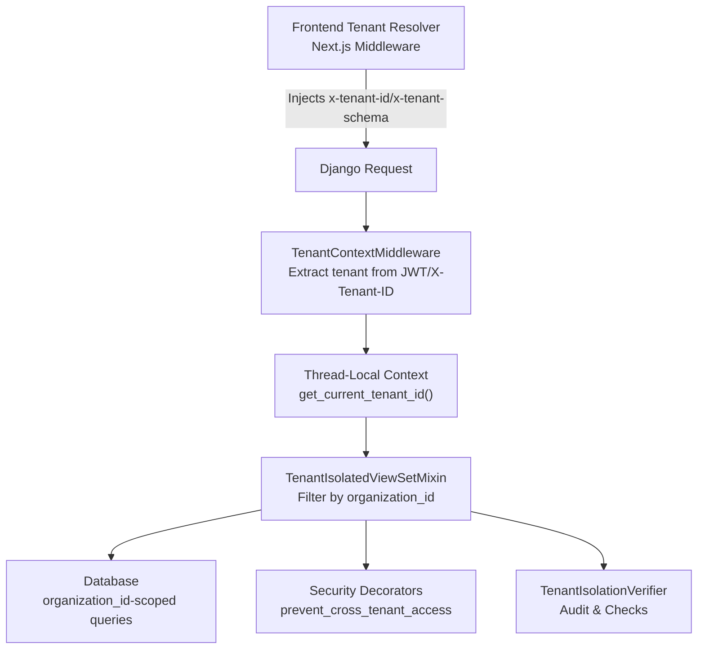
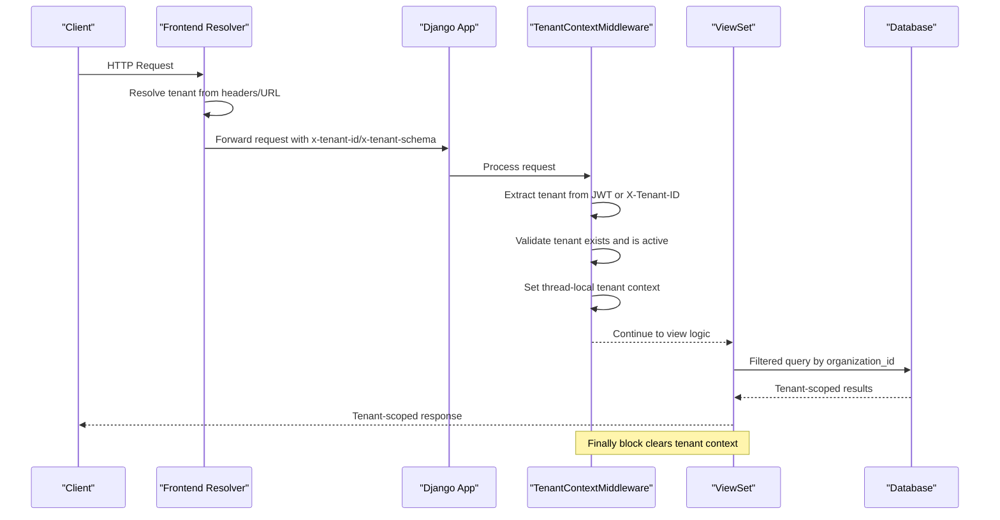
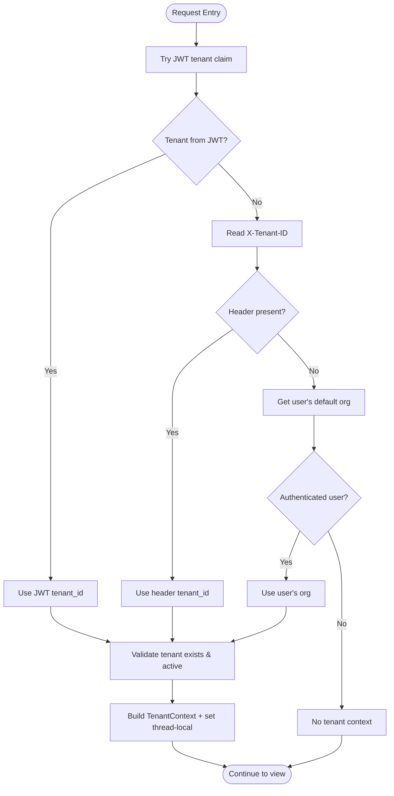
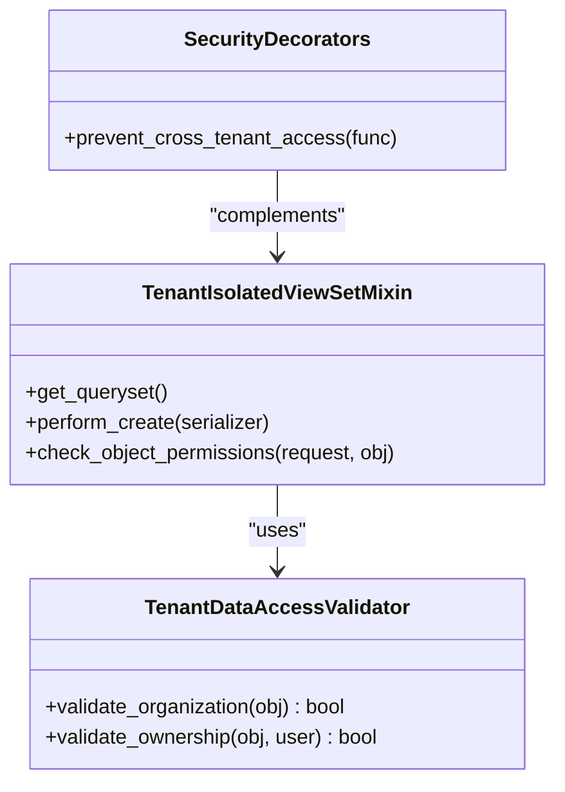
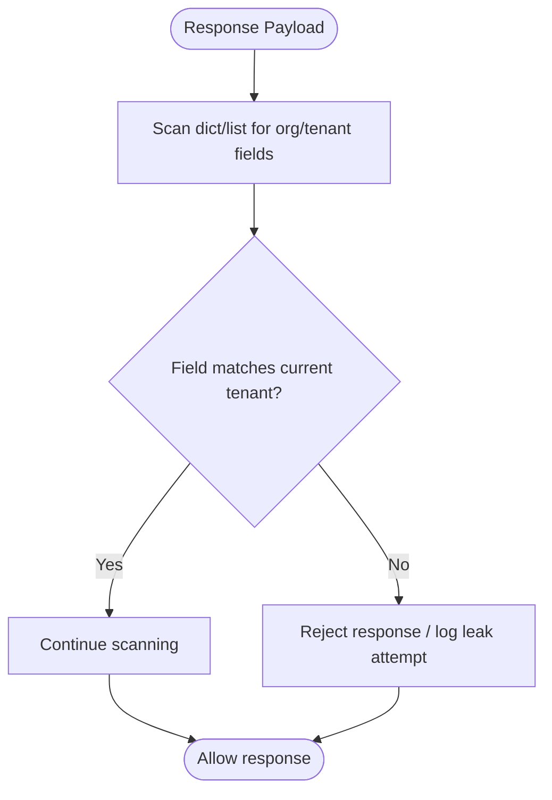
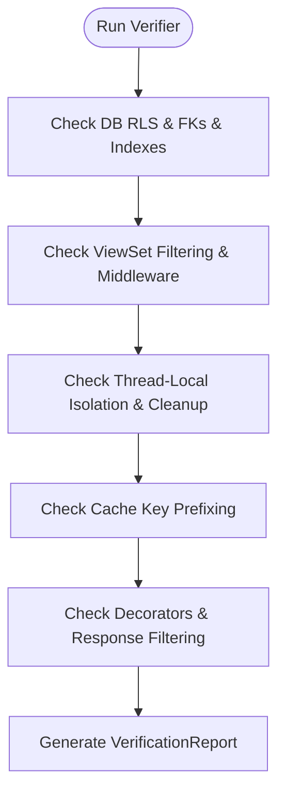
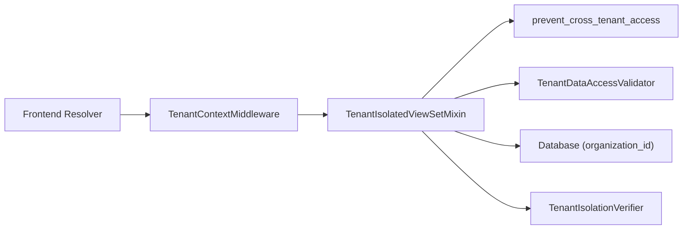

# Multi-Tenancy Security & Tenant Isolation

<cite>
**Referenced Files in This Document**
- [middleware.py](file://backend/django/apps/crm/middleware.py)
- [tenant_verification.py](file://backend/django/apps/crm/tenant_verification.py)
- [security.py](file://backend/django/apps/crm/security.py)
- [views.py](file://backend/django/apps/crm/api/views.py)
- [test_tenant_isolation.py](file://backend/django/apps/crm/tests/test_tenant_isolation.py)
- [rbac.ts](file://frontend/packages/auth/src/oidc/rbac.ts)
- [middleware.ts](file://frontend/packages/tenant-resolver/src/middleware.ts)
</cite>

## Table of Contents
1. [Introduction](#introduction)
2. [Project Structure](#project-structure)
3. [Core Components](#core-components)
4. [Architecture Overview](#architecture-overview)
5. [Detailed Component Analysis](#detailed-component-analysis)
6. [Dependency Analysis](#dependency-analysis)
7. [Performance Considerations](#performance-considerations)
8. [Troubleshooting Guide](#troubleshooting-guide)
9. [Conclusion](#conclusion)

## Introduction
This document explains how JOL-HUB establishes and enforces multi-tenancy to isolate data between organizations. It covers:
- How tenant context is established per request via middleware, including JWT claim extraction and X-Tenant-ID header processing.
- Cross-tenant access prevention at API, model, and response layers.
- The verification and audit mechanisms that validate isolation guarantees.
- Security implications for preventing data leakage across tenants.
- Practical guidance for implementing tenant-aware views, validating tenant context in custom code, and debugging isolation issues.

## Project Structure
JOL-HUB implements tenant isolation across the frontend routing layer and the Django backend:
- Frontend resolves a tenant from request headers or URL segments and injects server-only headers (e.g., x-tenant-id, x-tenant-schema).
- Django middleware extracts the tenant ID from JWT claims or X-Tenant-ID, validates it against active organizations, and stores it in thread-local storage for the duration of the request.
- ViewSets automatically filter queries by organization_id and enforce object-level ownership checks.
- A comprehensive verifier audits database, query, cache, and context isolation properties.

**Diagram sources**
- [middleware.ts:36-87](file://frontend/packages/tenant-resolver/src/middleware.ts#L36-L87)
- [middleware.py:96-197](file://backend/django/apps/crm/middleware.py#L96-L197)
- [views.py:83-126](file://backend/django/apps/crm/api/views.py#L83-L126)
- [security.py:494-523](file://backend/django/apps/crm/security.py#L494-L523)
- [tenant_verification.py:113-168](file://backend/django/apps/crm/tenant_verification.py#L113-L168)

**Section sources**
- [middleware.ts:36-87](file://frontend/packages/tenant-resolver/src/middleware.ts#L36-L87)
- [middleware.py:96-197](file://backend/django/apps/crm/middleware.py#L96-L197)
- [views.py:83-126](file://backend/django/apps/crm/api/views.py#L83-L126)
- [security.py:494-523](file://backend/django/apps/crm/security.py#L494-L523)
- [tenant_verification.py:113-168](file://backend/django/apps/crm/tenant_verification.py#L113-L168)

## Core Components
- Tenant context establishment:
  - Frontend resolver injects x-tenant-id and related headers into downstream server requests.
  - Django middleware extracts tenant ID from JWT claims or X-Tenant-ID, validates against active organizations, and persists context in thread-local storage for the request lifetime.
- Query isolation:
  - TenantIsolatedViewSetMixin filters all queries by organization_id and injects organization_id on create.
- Object-level validation:
  - TenantDataAccessValidator ensures objects belong to the current tenant.
  - prevent_cross_tenant_access decorator blocks cross-tenant object access with logging and metrics.
- Response validation:
  - TenantIsolationEnforcer.validate_response_data scans nested structures for organization_id mismatches to prevent data leakage.
- Verification and auditing:
  - TenantIsolationVerifier runs checks across database RLS, indexes, middleware presence, context cleanup, and API filtering.
  - Audit decorators log operations with tenant context.

**Section sources**
- [middleware.py:37-93](file://backend/django/apps/crm/middleware.py#L37-L93)
- [middleware.py:96-197](file://backend/django/apps/crm/middleware.py#L96-L197)
- [views.py:83-126](file://backend/django/apps/crm/api/views.py#L83-L126)
- [security.py:494-523](file://backend/django/apps/crm/security.py#L494-L523)
- [tenant_verification.py:906-932](file://backend/django/apps/crm/tenant_verification.py#L906-L932)
- [tenant_verification.py:113-168](file://backend/django/apps/crm/tenant_verification.py#L113-L168)

## Architecture Overview
The end-to-end flow ensures that every request is scoped to a single tenant and that no cross-tenant data can be read or written unintentionally.

**Diagram sources**
- [middleware.ts:36-87](file://frontend/packages/tenant-resolver/src/middleware.ts#L36-L87)
- [middleware.py:122-154](file://backend/django/apps/crm/middleware.py#L122-L154)
- [views.py:93-104](file://backend/django/apps/crm/api/views.py#L93-L104)

## Detailed Component Analysis

### Tenant Context Establishment (JWT and X-Tenant-ID)
- Frontend:
  - Resolves tenant and injects server-only headers (x-tenant-id, x-tenant-schema, x-tenant-vertical, x-tenant-locale, x-resolved-tenant).
  - Rewrites paths to include tenant segment while preserving locale prefixes when present.
- Backend:
  - Tries JWT first (tenant_id or organization_id claim), then falls back to X-Tenant-ID header, then user’s default organization if authenticated.
  - Validates tenant existence and status; caches tenant info briefly to reduce lookup overhead.
  - Stores full TenantContext in thread-local storage and attaches it to the request.

**Diagram sources**
- [middleware.ts:36-87](file://frontend/packages/tenant-resolver/src/middleware.ts#L36-L87)
- [middleware.py:156-197](file://backend/django/apps/crm/middleware.py#L156-L197)
- [middleware.py:199-231](file://backend/django/apps/crm/middleware.py#L199-L231)
- [middleware.py:233-265](file://backend/django/apps/crm/middleware.py#L233-L265)

**Section sources**
- [middleware.ts:36-87](file://frontend/packages/tenant-resolver/src/middleware.ts#L36-L87)
- [middleware.py:156-197](file://backend/django/apps/crm/middleware.py#L156-L197)
- [middleware.py:199-265](file://backend/django/apps/crm/middleware.py#L199-L265)

### Cross-Tenant Access Prevention
- Query-level:
  - TenantIsolatedViewSetMixin.get_queryset filters by organization_id using the current tenant context. If no tenant context exists, returns an empty queryset to avoid accidental exposure.
- Object-level:
  - check_object_permissions uses TenantDataAccessValidator to ensure the requested object belongs to the current tenant. Unauthorized attempts are logged.
- Decorator-based:
  - prevent_cross_tenant_access enforces ownership for arbitrary view methods, logs violations, and increments isolation violation metrics.

**Diagram sources**
- [views.py:83-126](file://backend/django/apps/crm/api/views.py#L83-L126)
- [security.py:494-523](file://backend/django/apps/crm/security.py#L494-L523)

**Section sources**
- [views.py:83-126](file://backend/django/apps/crm/api/views.py#L83-L126)
- [security.py:494-523](file://backend/django/apps/crm/security.py#L494-L523)

### Response Validation to Prevent Data Leakage
- TenantIsolationEnforcer.validate_response_data recursively inspects response payloads for fields like organization_id or tenant_id and rejects responses containing data belonging to another tenant.
- Tests demonstrate detection of cross-tenant entries in nested structures and arrays.

**Diagram sources**
- [tenant_verification.py:906-932](file://backend/django/apps/crm/tenant_verification.py#L906-L932)
- [test_tenant_isolation.py:296-355](file://backend/django/apps/crm/tests/test_tenant_isolation.py#L296-L355)

**Section sources**
- [tenant_verification.py:906-932](file://backend/django/apps/crm/tenant_verification.py#L906-L932)
- [test_tenant_isolation.py:296-355](file://backend/django/apps/crm/tests/test_tenant_isolation.py#L296-L355)

### Tenant Verification and Auditing
- TenantIsolationVerifier executes a suite of checks:
  - Database-level: row-level security status, organization foreign keys, index coverage on organization_id.
  - Model-level: presence of tenant validation patterns.
  - QuerySet-level: middleware installed and consistent filtering.
  - Context-level: thread-local isolation and cleanup in finally blocks.
  - Cache-level: tenant-prefixed cache keys.
  - API-level: cross-tenant decorator presence and response filtering.
- Results are structured as VerificationResult objects with pass/fail/warning/error statuses and remediation hints.

**Diagram sources**
- [tenant_verification.py:113-168](file://backend/django/apps/crm/tenant_verification.py#L113-L168)
- [tenant_verification.py:174-395](file://backend/django/apps/crm/tenant_verification.py#L174-L395)
- [tenant_verification.py:571-727](file://backend/django/apps/crm/tenant_verification.py#L571-L727)

**Section sources**
- [tenant_verification.py:113-168](file://backend/django/apps/crm/tenant_verification.py#L113-L168)
- [tenant_verification.py:174-395](file://backend/django/apps/crm/tenant_verification.py#L174-L395)
- [tenant_verification.py:571-727](file://backend/django/apps/crm/tenant_verification.py#L571-L727)

### Frontend RBAC and Tenant Roles
- The frontend defensively parses IdP-provided tenant roles from untrusted claims, allowing only known role names and validated tenant slugs. This reduces risk of client-side privilege escalation.

**Section sources**
- [rbac.ts:96-121](file://frontend/packages/auth/src/oidc/rbac.ts#L96-L121)

## Dependency Analysis
Key dependencies and interactions:
- Frontend tenant resolver depends on route resolution and injects server-only headers consumed by Django.
- Django middleware depends on JWT authentication and organization models to validate tenant context.
- ViewSets depend on middleware-provided tenant context to scope queries and enforce permissions.
- Security decorators and validators provide additional enforcement and observability.
- Verifier inspects configuration and runtime behavior to ensure isolation policies hold.

**Diagram sources**
- [middleware.ts:36-87](file://frontend/packages/tenant-resolver/src/middleware.ts#L36-L87)
- [middleware.py:96-197](file://backend/django/apps/crm/middleware.py#L96-L197)
- [views.py:83-126](file://backend/django/apps/crm/api/views.py#L83-L126)
- [security.py:494-523](file://backend/django/apps/crm/security.py#L494-L523)
- [tenant_verification.py:113-168](file://backend/django/apps/crm/tenant_verification.py#L113-L168)

**Section sources**
- [middleware.ts:36-87](file://frontend/packages/tenant-resolver/src/middleware.ts#L36-L87)
- [middleware.py:96-197](file://backend/django/apps/crm/middleware.py#L96-L197)
- [views.py:83-126](file://backend/django/apps/crm/api/views.py#L83-L126)
- [security.py:494-523](file://backend/django/apps/crm/security.py#L494-L523)
- [tenant_verification.py:113-168](file://backend/django/apps/crm/tenant_verification.py#L113-L168)

## Performance Considerations
- Caching:
  - Tenant info is cached with a short TTL to reduce repeated organization lookups during high traffic.
- Query efficiency:
  - Ensure organization_id columns are indexed; the verifier checks index coverage and reports missing indexes.
- Context lifecycle:
  - Middleware clears tenant context in a finally block to prevent leakage and minimize memory retention.
- Rate limiting:
  - Per-tenant rate limiting keys incorporate tenant_id to protect sensitive endpoints without cross-tenant interference.

[No sources needed since this section provides general guidance]

## Troubleshooting Guide
Common issues and diagnostics:
- Missing tenant context:
  - Verify JWT contains tenant claim or X-Tenant-ID is present; confirm middleware is installed and executed before views.
- Cross-tenant access errors:
  - Check object.organization_id vs current tenant_id; review prevent_cross_tenant_access logs and metrics.
- Response leaks:
  - Use TenantIsolationEnforcer.validate_response_data to detect unexpected organization_id values in nested responses.
- Thread-safety:
  - Confirm thread-local context isolation works under concurrency; tests cover setting, retrieving, and clearing context across threads.
- Verification failures:
  - Run TenantIsolationVerifier to get detailed pass/fail/warning results and remediation steps for each check.

**Section sources**
- [middleware.py:122-154](file://backend/django/apps/crm/middleware.py#L122-L154)
- [security.py:494-523](file://backend/django/apps/crm/security.py#L494-L523)
- [tenant_verification.py:906-932](file://backend/django/apps/crm/tenant_verification.py#L906-L932)
- [test_tenant_isolation.py:96-196](file://backend/django/apps/crm/tests/test_tenant_isolation.py#L96-L196)
- [tenant_verification.py:113-168](file://backend/django/apps/crm/tenant_verification.py#L113-L168)

## Conclusion
JOL-HUB enforces robust multi-tenancy through layered controls:
- Frontend resolves and propagates tenant identity securely to the backend.
- Middleware establishes a verified, thread-local tenant context per request.
- Views filter queries and validate object ownership to prevent cross-tenant access.
- Response validation guards against accidental data leakage.
- Comprehensive verification and auditing ensure isolation holds across database, application, and cache layers.
Adopting these patterns protects against data leakage between organizations and supports compliance requirements.

[No sources needed since this section summarizes without analyzing specific files]