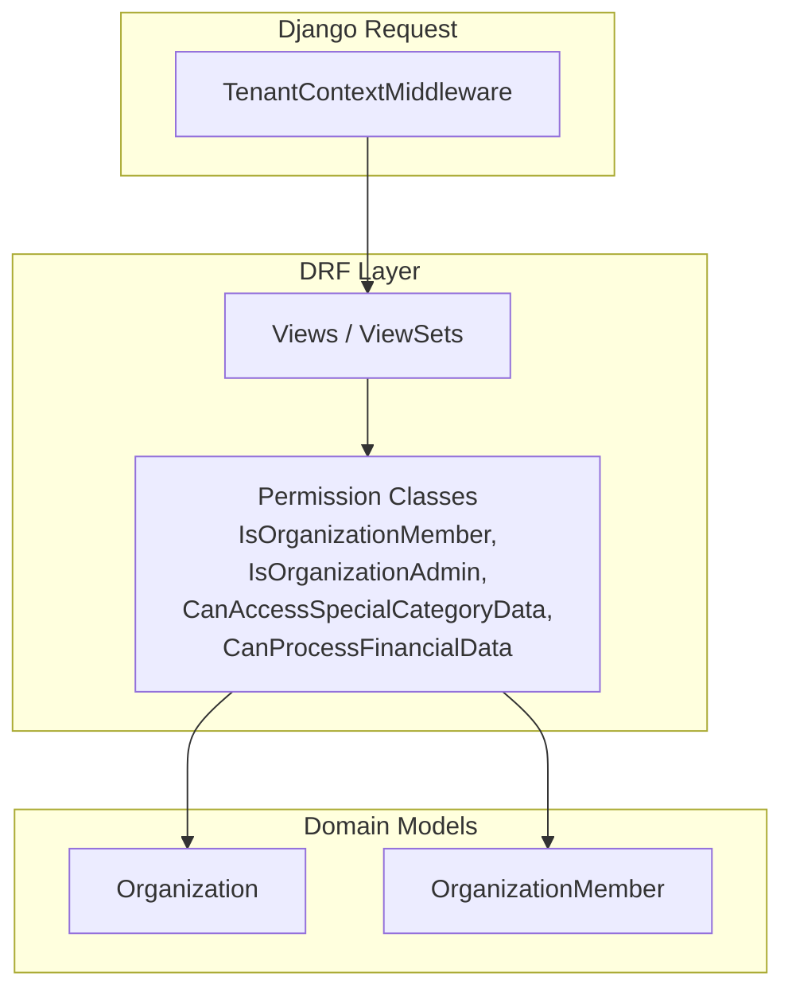
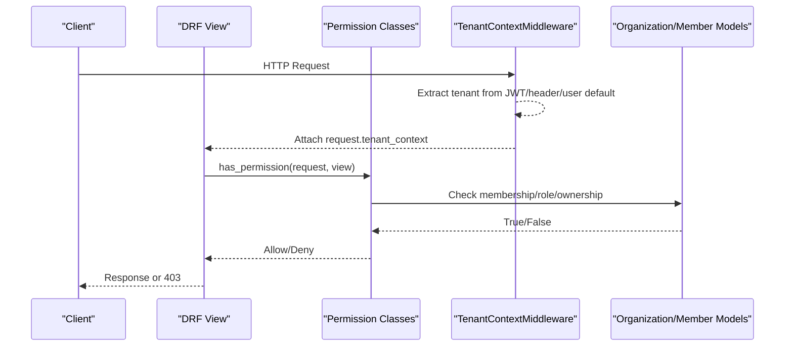
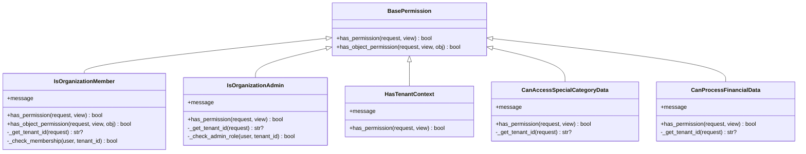
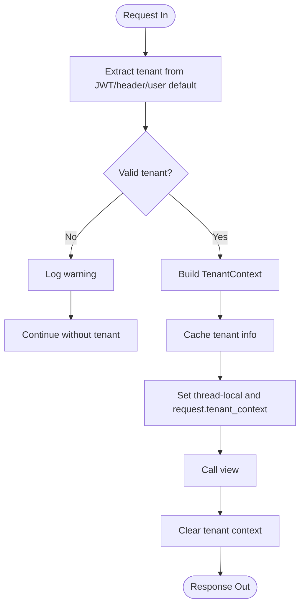
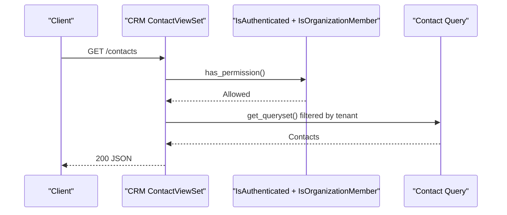
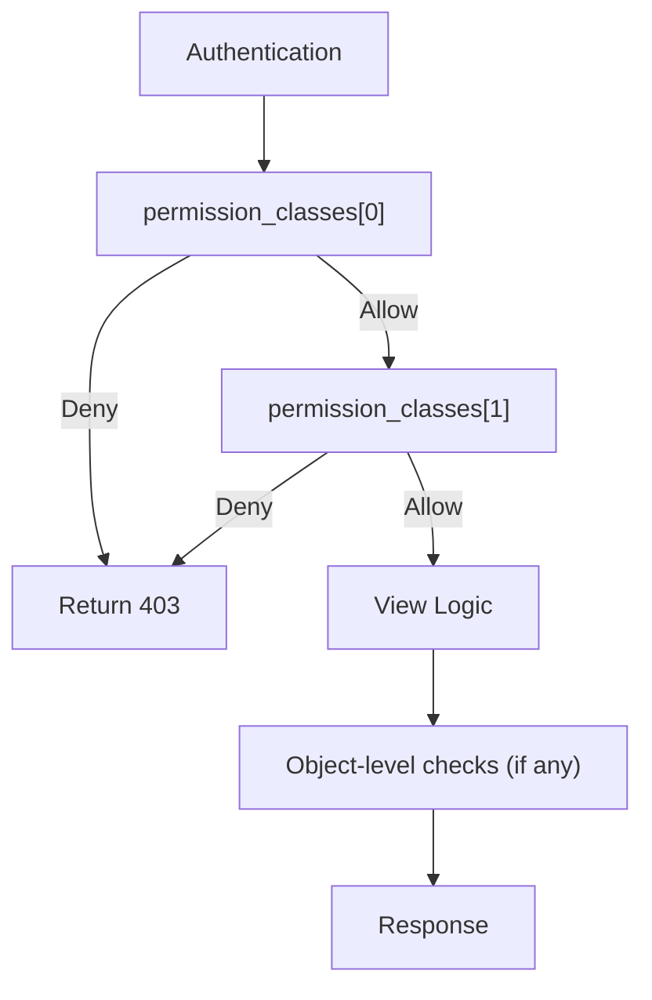
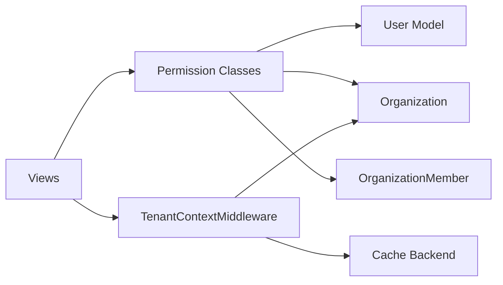

# Permission Management & Custom Permissions

<cite>
**Referenced Files in This Document**
- [permissions.py](file://backend/django/apps/core/permissions.py)
- [middleware.py](file://backend/django/apps/crm/middleware.py)
- [views.py](file://backend/django/apps/core/views.py)
- [crm_views.py](file://backend/django/apps/crm/api/views.py)
- [organizations_models.py](file://backend/django/apps/organizations/models.py)
- [donations_tests.py](file://backend/django/apps/donations/tests.py)
</cite>

## Table of Contents
1. [Introduction](#introduction)
2. [Project Structure](#project-structure)
3. [Core Components](#core-components)
4. [Architecture Overview](#architecture-overview)
5. [Detailed Component Analysis](#detailed-component-analysis)
6. [Dependency Analysis](#dependency-analysis)
7. [Performance Considerations](#performance-considerations)
8. [Troubleshooting Guide](#troubleshooting-guide)
9. [Conclusion](#conclusion)
10. [Appendices](#appendices)

## Introduction
This document explains how JOL-HUB manages permissions and how to build custom permission classes for securing API endpoints and views. It covers built-in multi-tenant and role-based permissions, the evaluation order enforced by Django REST Framework (DRF), caching strategies used by the tenant context middleware, and performance considerations. It also provides best practices for designing granular permissions, implementing object-level checks, testing permission logic, and common scenarios such as resource ownership validation, conditional access based on data attributes, and dynamic permission evaluation.

## Project Structure
Permission-related functionality is primarily implemented in:
- Core permission classes for organization membership, admin roles, special category data, and financial data access
- Tenant context middleware that establishes per-request tenant isolation and caches tenant metadata
- Views that apply DRF permission classes to secure endpoints
- Organization models that define roles and ownership relationships used by permissions

**Diagram sources**
- [middleware.py:96-154](file://backend/django/apps/crm/middleware.py#L96-L154)
- [permissions.py:26-137](file://backend/django/apps/core/permissions.py#L26-L137)
- [crm_views.py:150-170](file://backend/django/apps/crm/api/views.py#L150-L170)
- [organizations_models.py:12-195](file://backend/django/apps/organizations/models.py#L12-L195)

**Section sources**
- [permissions.py:1-331](file://backend/django/apps/core/permissions.py#L1-L331)
- [middleware.py:1-405](file://backend/django/apps/crm/middleware.py#L1-L405)
- [crm_views.py:150-349](file://backend/django/apps/crm/api/views.py#L150-L349)
- [organizations_models.py:1-200](file://backend/django/apps/organizations/models.py#L1-L200)

## Core Components
- IsOrganizationMember: Validates that an authenticated user is an active member of the requested organization (tenant). Also enforces object-level tenant isolation.
- IsOrganizationAdmin: Requires admin role within the organization or ownership.
- HasTenantContext: Ensures a valid tenant context exists on the request.
- CanAccessSpecialCategoryData: Restricts access to sensitive data categories to specific roles.
- CanProcessFinancialData: Restricts financial data processing to admins or owners.

These classes derive from DRF’s BasePermission and implement has_permission and/or has_object_permission methods. They rely on the tenant context established by middleware and query organization membership and roles.

**Section sources**
- [permissions.py:26-137](file://backend/django/apps/core/permissions.py#L26-L137)
- [permissions.py:140-202](file://backend/django/apps/core/permissions.py#L140-L202)
- [permissions.py:205-218](file://backend/django/apps/core/permissions.py#L205-L218)
- [permissions.py:221-269](file://backend/django/apps/core/permissions.py#L221-L269)
- [permissions.py:272-325](file://backend/django/apps/core/permissions.py#L272-L325)

## Architecture Overview
The permission flow integrates middleware-driven tenant isolation with DRF’s permission pipeline:

**Diagram sources**
- [middleware.py:122-154](file://backend/django/apps/crm/middleware.py#L122-L154)
- [middleware.py:156-197](file://backend/django/apps/crm/middleware.py#L156-L197)
- [permissions.py:45-60](file://backend/django/apps/core/permissions.py#L45-L60)
- [permissions.py:106-137](file://backend/django/apps/core/permissions.py#L106-L137)

## Detailed Component Analysis

### Built-in Permission Classes
- IsOrganizationMember
  - Purpose: Enforce multi-tenant membership and object-level tenant isolation.
  - Key behaviors:
    - Requires authentication and a valid tenant context.
    - Checks OrganizationMember records and owner fallback.
    - Object-level check ensures objects belong to the same tenant.
- IsOrganizationAdmin
  - Purpose: Require admin role or ownership for sensitive operations.
  - Key behaviors:
    - Uses tenant context to scope role checks.
    - Grants implicit admin rights to organization owners.
- HasTenantContext
  - Purpose: Gate endpoints that require a resolved tenant context.
- CanAccessSpecialCategoryData
  - Purpose: Restrict access to special category data to allowed roles.
- CanProcessFinancialData
  - Purpose: Restrict financial data processing to admins/owners.

**Diagram sources**
- [permissions.py:26-137](file://backend/django/apps/core/permissions.py#L26-L137)
- [permissions.py:140-202](file://backend/django/apps/core/permissions.py#L140-L202)
- [permissions.py:205-218](file://backend/django/apps/core/permissions.py#L205-L218)
- [permissions.py:221-269](file://backend/django/apps/core/permissions.py#L221-L269)
- [permissions.py:272-325](file://backend/django/apps/core/permissions.py#L272-L325)

**Section sources**
- [permissions.py:26-331](file://backend/django/apps/core/permissions.py#L26-L331)

### Middleware and Tenant Context
- TenantContextMiddleware
  - Establishes per-request tenant context from JWT claims, X-Tenant-ID header, or user’s default organization.
  - Attaches TenantContext to request and thread-local storage.
  - Caches tenant metadata to reduce database reads.
- Utility helpers
  - get_current_tenant_id/get_current_tenant_context/set_tenant_context/clear_tenant_context
  - Decorators and mixins to enforce tenant context at view level.
  - TenantDataAccessValidator for cross-tenant protection and ownership checks.

**Diagram sources**
- [middleware.py:122-154](file://backend/django/apps/crm/middleware.py#L122-L154)
- [middleware.py:156-197](file://backend/django/apps/crm/middleware.py#L156-L197)
- [middleware.py:233-265](file://backend/django/apps/crm/middleware.py#L233-L265)
- [middleware.py:301-342](file://backend/django/apps/crm/middleware.py#L301-L342)
- [middleware.py:345-377](file://backend/django/apps/crm/middleware.py#L345-L377)

**Section sources**
- [middleware.py:96-154](file://backend/django/apps/crm/middleware.py#L96-L154)
- [middleware.py:156-197](file://backend/django/apps/crm/middleware.py#L156-L197)
- [middleware.py:233-265](file://backend/django/apps/crm/middleware.py#L233-L265)
- [middleware.py:301-342](file://backend/django/apps/crm/middleware.py#L301-L342)
- [middleware.py:345-377](file://backend/django/apps/crm/middleware.py#L345-L377)

### Usage Patterns in Views
- DRF views set permission_classes to combine authentication and custom permissions.
- Example patterns:
  - Require authentication plus organization membership for CRM endpoints.
  - Use AllowAny for public health/readiness endpoints.
  - Use IsAdminUser for administrative-only endpoints.

**Diagram sources**
- [crm_views.py:150-170](file://backend/django/apps/crm/api/views.py#L150-L170)
- [permissions.py:45-60](file://backend/django/apps/core/permissions.py#L45-L60)

**Section sources**
- [views.py:36-121](file://backend/django/apps/core/views.py#L36-L121)
- [crm_views.py:150-170](file://backend/django/apps/crm/api/views.py#L150-L170)
- [crm_views.py:291-302](file://backend/django/apps/crm/api/views.py#L291-L302)

### Creating Custom Permission Classes
To create a custom permission:
- Subclass DRF’s BasePermission.
- Implement has_permission(request, view) to gate access based on request, user, and tenant context.
- Optionally implement has_object_permission(request, view, obj) for object-level checks.
- Use tenant context helpers to resolve tenant and scope queries.
- Return False early for unauthenticated requests or missing tenant context.
- Log warnings/errors for failed checks to aid debugging.

Best practices:
- Keep checks idempotent and fast; avoid heavy computations inside has_permission.
- Prefer filtering at the queryset level when possible; use permissions for authorization gates.
- Centralize reusable checks in small helper functions or utility modules.

**Section sources**
- [permissions.py:26-137](file://backend/django/apps/core/permissions.py#L26-L137)
- [permissions.py:140-202](file://backend/django/apps/core/permissions.py#L140-L202)
- [permissions.py:221-269](file://backend/django/apps/core/permissions.py#L221-L269)
- [permissions.py:272-325](file://backend/django/apps/core/permissions.py#L272-L325)

### Permission Evaluation Order
DRF evaluates permissions in the order declared in permission_classes:
- Authentication is typically checked first via authentication_classes.
- Then each permission class in permission_classes is evaluated in sequence.
- If any permission denies access, DRF returns 403 immediately.

For object-level operations, DRF calls has_object_permission after has_permission passes.

**Diagram sources**
- [crm_views.py:150-170](file://backend/django/apps/crm/api/views.py#L150-L170)
- [permissions.py:45-60](file://backend/django/apps/core/permissions.py#L45-L60)

**Section sources**
- [crm_views.py:150-170](file://backend/django/apps/crm/api/views.py#L150-L170)
- [permissions.py:45-60](file://backend/django/apps/core/permissions.py#L45-L60)

### Caching Strategies and Performance
- Tenant metadata caching:
  - The middleware caches tenant information using a cache key prefix and timeout to minimize repeated lookups.
  - This reduces database load during high-throughput requests.
- Membership and role checks:
  - Queries are scoped to tenant and role; consider adding indexes on frequently queried fields (e.g., organization_id, role, is_active).
- Avoid N+1 queries:
  - Use select_related/prefetch_related where appropriate in permission checks or viewsets.
- Early exits:
  - Return False quickly for unauthenticated users or missing tenant context to avoid unnecessary DB calls.

**Section sources**
- [middleware.py:111-118](file://backend/django/apps/crm/middleware.py#L111-L118)
- [middleware.py:233-265](file://backend/django/apps/crm/middleware.py#L233-L265)
- [permissions.py:106-137](file://backend/django/apps/core/permissions.py#L106-L137)

### Best Practices for Granular Permissions
- Design around roles and scopes:
  - Use IsOrganizationAdmin for admin-only actions.
  - Use CanAccessSpecialCategoryData for sensitive data categories.
  - Use CanProcessFinancialData for PCI-DSS-sensitive operations.
- Enforce object-level isolation:
  - Implement has_object_permission to ensure objects belong to the current tenant.
  - Use TenantDataAccessValidator for consistent ownership and tenant checks.
- Combine permissions judiciously:
  - Pair IsAuthenticated with IsOrganizationMember for most protected endpoints.
  - Add specialized permissions for sensitive actions.

**Section sources**
- [permissions.py:26-137](file://backend/django/apps/core/permissions.py#L26-L137)
- [permissions.py:221-269](file://backend/django/apps/core/permissions.py#L221-L269)
- [permissions.py:272-325](file://backend/django/apps/core/permissions.py#L272-L325)
- [middleware.py:345-377](file://backend/django/apps/crm/middleware.py#L345-L377)

### Testing Permission Logic
- Assert permission denial for unauthenticated requests.
- Verify throttle classes are applied where required.
- Mock or prepare test data for organizations and memberships to validate role checks.
- Use DRF’s APIClient or factory utilities to construct requests with proper headers and tenant context.

Example references:
- Tests assert that unauthenticated requests fail permission checks.
- Tests verify rate limiting configuration on sensitive endpoints.

**Section sources**
- [donations_tests.py:340-364](file://backend/django/apps/donations/tests.py#L340-L364)

## Dependency Analysis
Key dependencies and relationships:
- Permission classes depend on:
  - DRF BasePermission
  - User model and organization models for membership/role checks
  - Tenant context from middleware
- Middleware depends on:
  - JWT authentication for tenant extraction
  - Cache backend for tenant metadata
  - Organization models for tenant info

**Diagram sources**
- [permissions.py:106-137](file://backend/django/apps/core/permissions.py#L106-L137)
- [middleware.py:199-213](file://backend/django/apps/crm/middleware.py#L199-L213)
- [middleware.py:233-265](file://backend/django/apps/crm/middleware.py#L233-L265)
- [crm_views.py:150-170](file://backend/django/apps/crm/api/views.py#L150-L170)

**Section sources**
- [permissions.py:106-137](file://backend/django/apps/core/permissions.py#L106-L137)
- [middleware.py:199-213](file://backend/django/apps/crm/middleware.py#L199-L213)
- [middleware.py:233-265](file://backend/django/apps/crm/middleware.py#L233-L265)
- [crm_views.py:150-170](file://backend/django/apps/crm/api/views.py#L150-L170)

## Performance Considerations
- Minimize DB queries in permission checks:
  - Scope queries to tenant and role; leverage indexes.
- Use middleware caching:
  - Rely on cached tenant metadata to avoid repeated lookups.
- Filter at the queryset level:
  - Apply tenant scoping in get_queryset to reduce payload size and improve efficiency.
- Avoid heavy logic in has_permission:
  - Move complex decisions to services or serializers if needed.

[No sources needed since this section provides general guidance]

## Troubleshooting Guide
Common issues and resolutions:
- Missing tenant context:
  - Ensure middleware runs and sets request.tenant_context.
  - Validate JWT claims or X-Tenant-ID header presence.
- Cross-tenant access attempts:
  - Check has_object_permission implementations and TenantDataAccessValidator usage.
- Role not recognized:
  - Verify OrganizationMember role values and is_active flags.
- Performance regressions:
  - Inspect cache hits/misses and query plans for membership/role checks.

Error handling patterns:
- PermissionDenied responses are standardized in core error handlers.
- Logging in middleware and permissions helps diagnose failures.

**Section sources**
- [views.py:136-140](file://backend/django/apps/core/views.py#L136-L140)
- [permissions.py:53-57](file://backend/django/apps/core/permissions.py#L53-L57)
- [permissions.py:77-82](file://backend/django/apps/core/permissions.py#L77-L82)
- [middleware.py:141-146](file://backend/django/apps/crm/middleware.py#L141-L146)

## Conclusion
JOL-HUB implements robust, multi-tenant permission management through DRF permission classes and a tenant context middleware. Built-in permissions cover organization membership, admin roles, sensitive data categories, and financial processing. By following the patterns outlined here—using middleware-established tenant context, applying layered permissions, leveraging caching, and writing focused tests—you can design secure, scalable, and maintainable access controls for your APIs and views.

[No sources needed since this section summarizes without analyzing specific files]

## Appendices

### Common Permission Scenarios
- Resource ownership checks:
  - Use has_object_permission to compare object owner fields with the current user.
  - Leverage TenantDataAccessValidator.validate_ownership for consistent checks.
- Conditional access based on data attributes:
  - Gate endpoints behind CanAccessSpecialCategoryData when accessing sensitive fields.
  - Combine with role checks to allow only editors/admins.
- Dynamic permission evaluation:
  - Resolve tenant context dynamically from JWT or headers.
  - Use middleware caching to optimize repeated tenant lookups.

**Section sources**
- [middleware.py:345-377](file://backend/django/apps/crm/middleware.py#L345-L377)
- [permissions.py:221-269](file://backend/django/apps/core/permissions.py#L221-L269)
- [permissions.py:272-325](file://backend/django/apps/core/permissions.py#L272-L325)