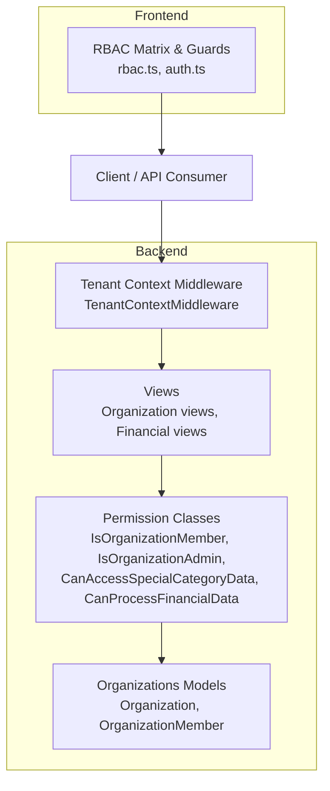
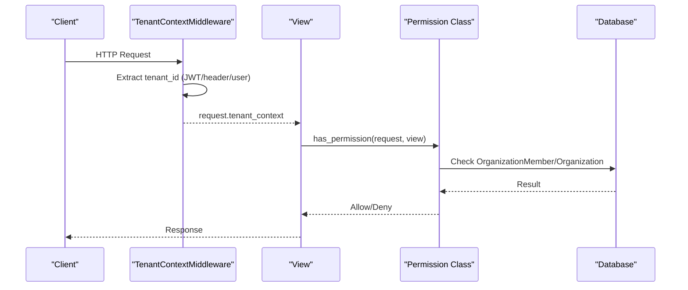
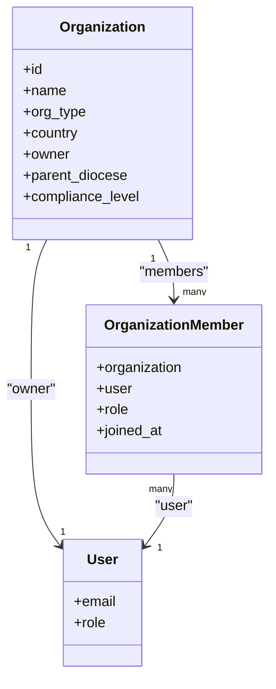
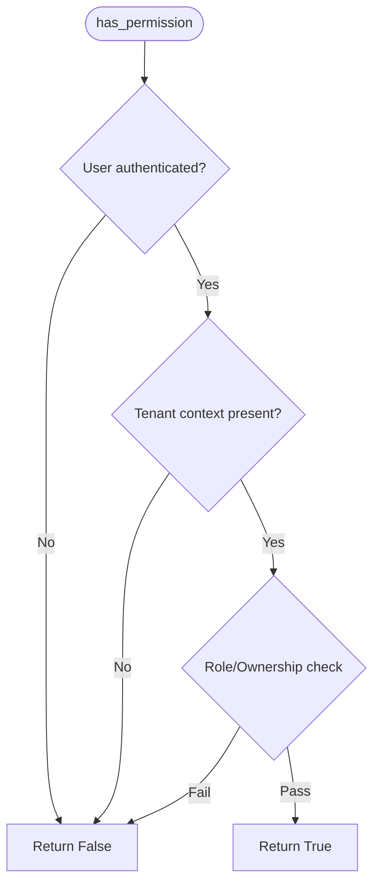
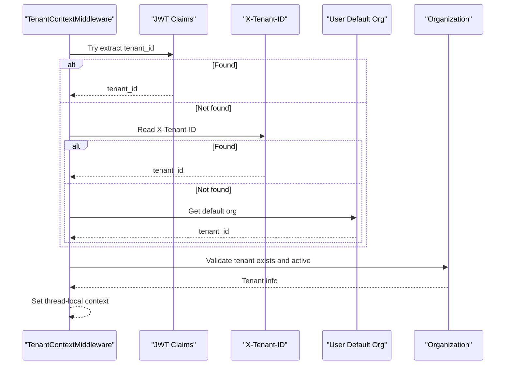
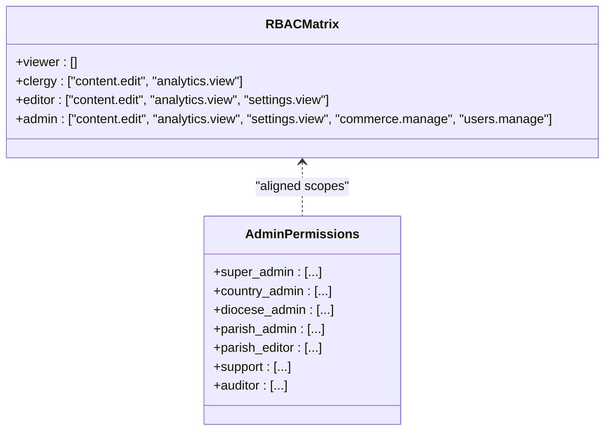
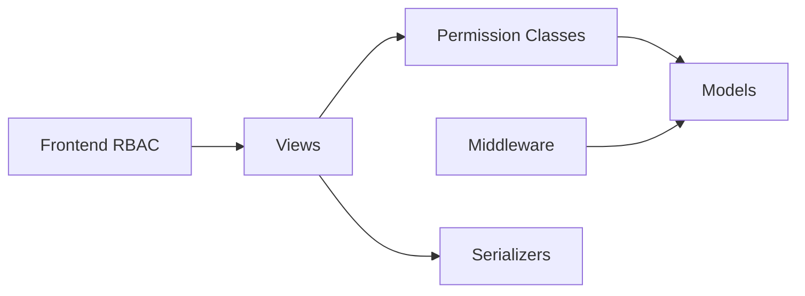

# Role-Based Access Control (RBAC)

<cite>
**Referenced Files in This Document**
- [permissions.py](file://backend/django/apps/core/permissions.py)
- [models.py](file://backend/django/apps/organizations/models.py)
- [views.py](file://backend/django/apps/organizations/views.py)
- [serializers.py](file://backend/django/apps/organizations/serializers.py)
- [middleware.py](file://backend/django/apps/crm/middleware.py)
- [rbac.ts](file://frontend/packages/auth/src/oidc/rbac.ts)
- [auth.ts](file://frontend/apps/admin-dashboard/src/lib/auth.ts)
- [openapi-spec.yaml](file://docs/api/openapi-spec.yaml)
</cite>

## Table of Contents
1. [Introduction](#introduction)
2. [Project Structure](#project-structure)
3. [Core Components](#core-components)
4. [Architecture Overview](#architecture-overview)
5. [Detailed Component Analysis](#detailed-component-analysis)
6. [Dependency Analysis](#dependency-analysis)
7. [Performance Considerations](#performance-considerations)
8. [Troubleshooting Guide](#troubleshooting-guide)
9. [Conclusion](#conclusion)
10. [Appendices](#appendices)

## Introduction
This document explains the role-based access control system in JOL-HUB with a focus on multi-tenant organizations, hierarchical roles, and permission enforcement across backend and frontend. It covers:
- The organizational hierarchy and role model (owner, admin, editor, viewer).
- How roles are assigned to users within organizations.
- How permissions are enforced via Django REST Framework permission classes.
- Specialized checks for sensitive data: special category data and financial data.
- Frontend RBAC matrices and how they align with backend enforcement.
- Practical examples for creating custom roles, implementing view restrictions, and managing assignments programmatically.

## Project Structure
The RBAC system spans several modules:
- Backend models define organizations, members, and roles.
- Middleware establishes tenant context per request.
- Permission classes enforce membership, admin status, and specialized access.
- Views apply these permissions to restrict API endpoints.
- Frontend defines role-permission matrices and UI-level guards.

**Diagram sources**
- [models.py:12-250](file://backend/django/apps/organizations/models.py#L12-L250)
- [permissions.py:26-331](file://backend/django/apps/core/permissions.py#L26-L331)
- [middleware.py:96-197](file://backend/django/apps/crm/middleware.py#L96-L197)
- [views.py:17-73](file://backend/django/apps/organizations/views.py#L17-L73)
- [rbac.ts:1-36](file://frontend/packages/auth/src/oidc/rbac.ts#L1-L36)
- [auth.ts:248-303](file://frontend/apps/admin-dashboard/src/lib/auth.ts#L248-L303)

**Section sources**
- [models.py:12-250](file://backend/django/apps/organizations/models.py#L12-L250)
- [permissions.py:26-331](file://backend/django/apps/core/permissions.py#L26-L331)
- [middleware.py:96-197](file://backend/django/apps/crm/middleware.py#L96-L197)
- [views.py:17-73](file://backend/django/apps/organizations/views.py#L17-L73)
- [rbac.ts:1-36](file://frontend/packages/auth/src/oidc/rbac.ts#L1-L36)
- [auth.ts:248-303](file://frontend/apps/admin-dashboard/src/lib/auth.ts#L248-L303)

## Core Components
- Organization and Member model:
  - Organizations represent religious institutions or services with hierarchical relationships and compliance settings.
  - OrganizationMember links users to organizations with roles: admin, editor, viewer.
  - Owner field grants implicit administrative privileges.
- Tenant context middleware:
  - Extracts tenant ID from JWT claims, headers, or user’s default organization.
  - Injects a thread-local context used by permission checks and query filters.
- Permission classes:
  - IsOrganizationMember: ensures user is an active member or owner of the target organization.
  - IsOrganizationAdmin: requires admin role or ownership.
  - CanAccessSpecialCategoryData: restricts access to sensitive religious/sacramental data to admins and editors.
  - CanProcessFinancialData: restricts financial data processing to admins and owners.
- Frontend RBAC:
  - Role-permission matrix and guards for UI-level visibility and actions.

**Section sources**
- [models.py:12-250](file://backend/django/apps/organizations/models.py#L12-L250)
- [middleware.py:96-197](file://backend/django/apps/crm/middleware.py#L96-L197)
- [permissions.py:26-331](file://backend/django/apps/core/permissions.py#L26-L331)
- [rbac.ts:1-36](file://frontend/packages/auth/src/oidc/rbac.ts#L1-L36)
- [auth.ts:248-303](file://frontend/apps/admin-dashboard/src/lib/auth.ts#L248-L303)

## Architecture Overview
The RBAC architecture enforces multi-tenant isolation and role-based permissions at multiple layers:
- Request enters middleware that resolves tenant context.
- Views apply DRF permission classes to validate membership, admin status, and specialized access.
- Models provide role definitions and hierarchical relationships.
- Frontend uses role-permission matrices to gate UI features and calls.

**Diagram sources**
- [middleware.py:122-197](file://backend/django/apps/crm/middleware.py#L122-L197)
- [permissions.py:45-137](file://backend/django/apps/core/permissions.py#L45-L137)
- [permissions.py:149-202](file://backend/django/apps/core/permissions.py#L149-L202)
- [permissions.py:231-256](file://backend/django/apps/core/permissions.py#L231-L256)
- [permissions.py:281-312](file://backend/django/apps/core/permissions.py#L281-L312)

## Detailed Component Analysis

### Organizational Hierarchy and Roles
- Organization types include diocese, deanery, parish/church, and commercial services.
- Hierarchical relationships allow parent-child linking for governance and scope.
- Compliance flags indicate PCI-DSS requirements and canonical records handling.
- Owner field provides implicit admin rights; OrganizationMember assigns explicit roles.

**Diagram sources**
- [models.py:12-120](file://backend/django/apps/organizations/models.py#L12-L120)
- [models.py:239-279](file://backend/django/apps/organizations/models.py#L239-L279)
- [users/models.py:17-40](file://backend/django/apps/users/models.py#L17-L40)

**Section sources**
- [models.py:12-120](file://backend/django/apps/organizations/models.py#L12-L120)
- [models.py:239-279](file://backend/django/apps/organizations/models.py#L239-L279)
- [users/models.py:17-40](file://backend/django/apps/users/models.py#L17-L40)

### Permission Classes: Validation Logic and Security Implications
- IsOrganizationMember:
  - Validates authentication and tenant context.
  - Checks active membership or ownership.
  - Enforces object-level tenant isolation.
- IsOrganizationAdmin:
  - Requires admin role or ownership.
  - Uses tenant context to scope checks.
- CanAccessSpecialCategoryData:
  - Restricts access to sensitive religious/sacramental data to admins and editors.
  - Denies viewers and unauthenticated users.
- CanProcessFinancialData:
  - Restricts financial data processing to admins and owners.
  - Aligns with PCI-DSS and SOC2 requirements.

**Diagram sources**
- [permissions.py:45-137](file://backend/django/apps/core/permissions.py#L45-L137)
- [permissions.py:149-202](file://backend/django/apps/core/permissions.py#L149-L202)
- [permissions.py:231-256](file://backend/django/apps/core/permissions.py#L231-L256)
- [permissions.py:281-312](file://backend/django/apps/core/permissions.py#L281-L312)

**Section sources**
- [permissions.py:26-331](file://backend/django/apps/core/permissions.py#L26-L331)

### Tenant Context and Multi-Tenant Enforcement
- Middleware extracts tenant ID from JWT claims, X-Tenant-ID header, or user’s default organization.
- Builds a TenantContext with metadata (name, country, compliance level).
- Stores context in thread-local storage for consistent access during request lifecycle.
- Provides helpers to require tenant context and validate data access boundaries.

**Diagram sources**
- [middleware.py:122-197](file://backend/django/apps/crm/middleware.py#L122-L197)
- [middleware.py:199-265](file://backend/django/apps/crm/middleware.py#L199-L265)

**Section sources**
- [middleware.py:96-197](file://backend/django/apps/crm/middleware.py#L96-L197)
- [middleware.py:199-265](file://backend/django/apps/crm/middleware.py#L199-L265)

### Frontend RBAC and Role Matrices
- Frontend defines a role-permission matrix mapping roles to permissions.
- Admin dashboard defines granular permissions per role and resource constraints.
- Functions to check permissions and map roles to federation tiers.

**Diagram sources**
- [rbac.ts:1-36](file://frontend/packages/auth/src/oidc/rbac.ts#L1-L36)
- [auth.ts:248-303](file://frontend/apps/admin-dashboard/src/lib/auth.ts#L248-L303)

**Section sources**
- [rbac.ts:1-36](file://frontend/packages/auth/src/oidc/rbac.ts#L1-L36)
- [auth.ts:248-303](file://frontend/apps/admin-dashboard/src/lib/auth.ts#L248-L303)

### API Endpoints and Role Usage
- Organization endpoints list/create organizations and manage website settings.
- Member endpoints list/create members for an organization.
- Financial endpoints expose invoices and payouts with optional organization filtering.
- Permissions are applied at view level; additional fine-grained checks can be added using permission classes.

**Section sources**
- [views.py:17-73](file://backend/django/apps/organizations/views.py#L17-L73)
- [financial/views.py:7-39](file://backend/django/apps/financial/views.py#L7-L39)

## Dependency Analysis
Key dependencies and interactions:
- Permission classes depend on Organization and OrganizationMember models.
- Middleware depends on JWT authentication and Organization model to resolve tenant context.
- Views depend on permission classes and serializers for validation and response formatting.
- Frontend RBAC depends on role definitions and permission matrices aligned with backend policies.

**Diagram sources**
- [permissions.py:26-331](file://backend/django/apps/core/permissions.py#L26-L331)
- [models.py:12-250](file://backend/django/apps/organizations/models.py#L12-L250)
- [middleware.py:96-197](file://backend/django/apps/crm/middleware.py#L96-L197)
- [views.py:17-73](file://backend/django/apps/organizations/views.py#L17-L73)
- [rbac.ts:1-36](file://frontend/packages/auth/src/oidc/rbac.ts#L1-L36)

**Section sources**
- [permissions.py:26-331](file://backend/django/apps/core/permissions.py#L26-L331)
- [models.py:12-250](file://backend/django/apps/organizations/models.py#L12-L250)
- [middleware.py:96-197](file://backend/django/apps/crm/middleware.py#L96-L197)
- [views.py:17-73](file://backend/django/apps/organizations/views.py#L17-L73)
- [rbac.ts:1-36](file://frontend/packages/auth/src/oidc/rbac.ts#L1-L36)

## Performance Considerations
- Tenant context caching:
  - Middleware caches tenant info for short periods to reduce database queries.
- Query optimization:
  - Permission checks use efficient existence queries against OrganizationMember.
- Selective loading:
  - Views use select_related to minimize N+1 queries when listing members.
- Frontend checks:
  - Role-permission matrices are lightweight and evaluated client-side for UI gating.

[No sources needed since this section provides general guidance]

## Troubleshooting Guide
Common issues and resolutions:
- Missing tenant context:
  - Ensure JWT contains tenant claim or include X-Tenant-ID header.
  - Verify user has an active organization membership if relying on default tenant resolution.
- Cross-tenant access attempts:
  - Logs warn about mismatches between user tenant and object tenant.
  - Use object-level permission checks to prevent cross-tenant reads/writes.
- Special category data access denied:
  - Confirm user has admin or editor role in the target organization.
  - Viewers cannot access sensitive religious/sacramental data.
- Financial data access denied:
  - Only admins and owners can process financial data.
  - Ensure correct role assignment and active membership.

**Section sources**
- [permissions.py:45-137](file://backend/django/apps/core/permissions.py#L45-L137)
- [permissions.py:231-256](file://backend/django/apps/core/permissions.py#L231-L256)
- [permissions.py:281-312](file://backend/django/apps/core/permissions.py#L281-L312)
- [middleware.py:122-197](file://backend/django/apps/crm/middleware.py#L122-L197)

## Conclusion
JOL-HUB implements a robust, multi-tenant RBAC system combining:
- Clear role definitions (owner, admin, editor, viewer) with hierarchical organization support.
- Strict permission enforcement via DRF permission classes.
- Tenant context middleware ensuring isolation and compliance.
- Frontend role-permission matrices for consistent UI behavior.
This design supports secure access to sensitive data while enabling flexible role management and scalable governance across organizations.

[No sources needed since this section summarizes without analyzing specific files]

## Appendices

### Examples: Creating Custom Roles
- Define new roles in OrganizationMember role choices if extending beyond admin/editor/viewer.
- Update permission classes to recognize new roles where necessary.
- Align frontend role-permission matrices to reflect new capabilities.

**Section sources**
- [models.py:239-279](file://backend/django/apps/organizations/models.py#L239-L279)
- [permissions.py:26-331](file://backend/django/apps/core/permissions.py#L26-L331)
- [rbac.ts:1-36](file://frontend/packages/auth/src/oidc/rbac.ts#L1-L36)

### Implementing Role-Based View Restrictions
- Apply IsOrganizationMember or IsOrganizationAdmin to viewsets requiring membership or admin rights.
- Use CanAccessSpecialCategoryData or CanProcessFinancialData for sensitive endpoints.
- Combine with tenant context requirements to ensure scoped access.

**Section sources**
- [permissions.py:26-331](file://backend/django/apps/core/permissions.py#L26-L331)
- [views.py:17-73](file://backend/django/apps/organizations/views.py#L17-L73)

### Managing Role Assignments Programmatically
- Create or update OrganizationMember entries to assign roles to users within an organization.
- Ensure tenant context is set to prevent cross-tenant mutations.
- Use serializers and views to expose safe APIs for role management.

**Section sources**
- [models.py:239-279](file://backend/django/apps/organizations/models.py#L239-L279)
- [views.py:62-73](file://backend/django/apps/organizations/views.py#L62-L73)
- [serializers.py:54-65](file://backend/django/apps/organizations/serializers.py#L54-L65)