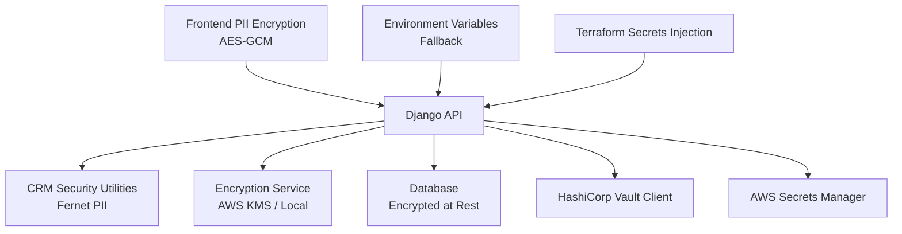
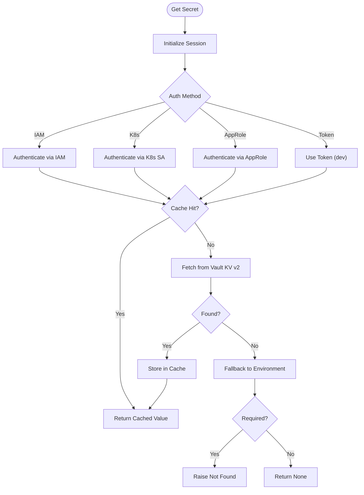
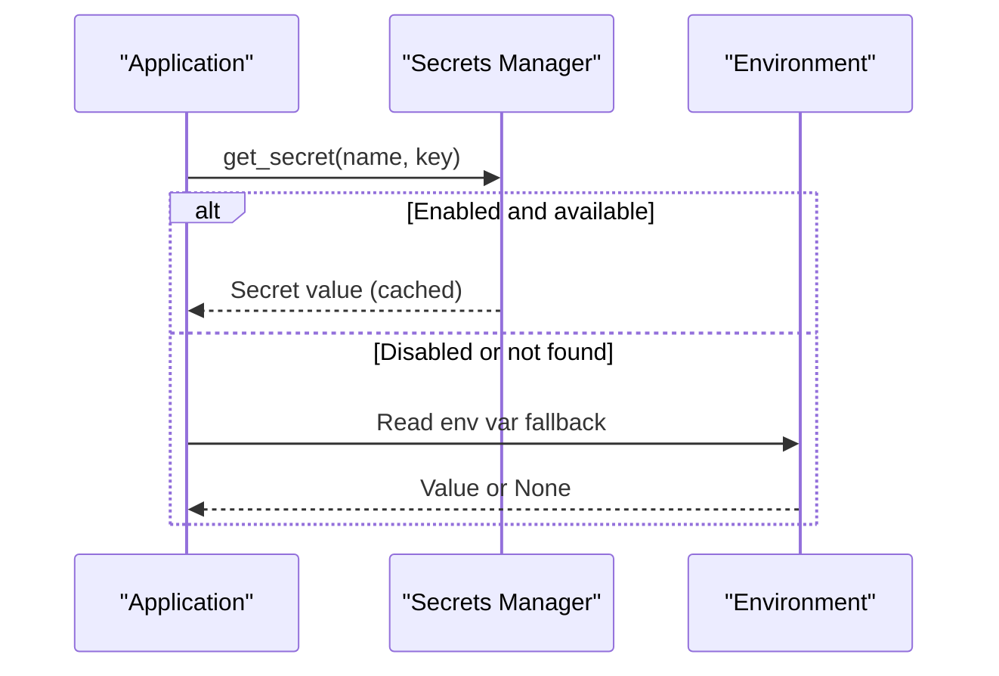
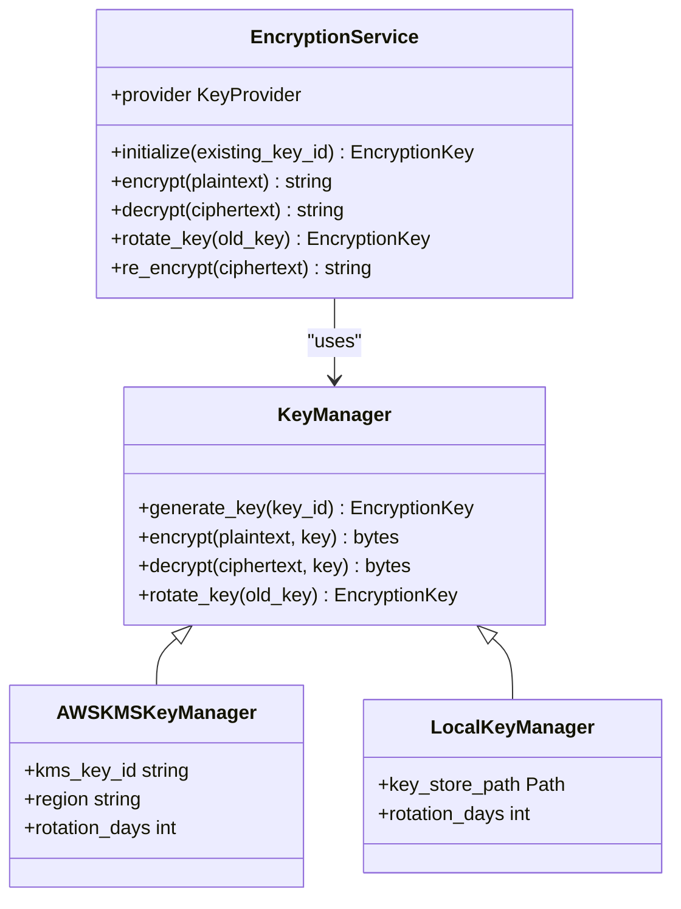
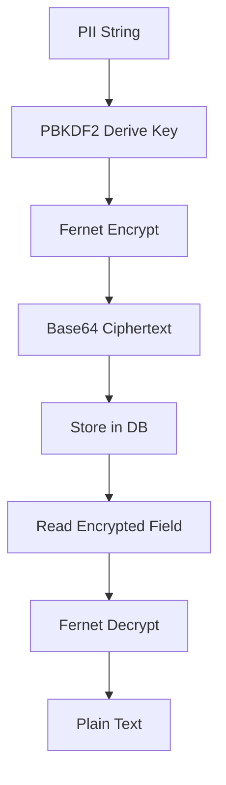
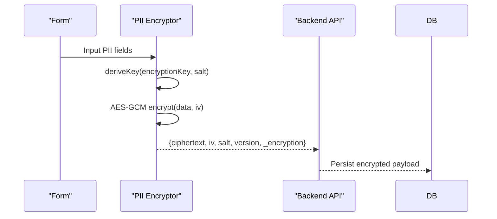
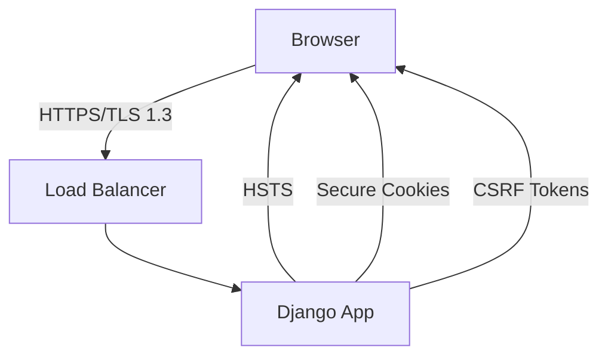
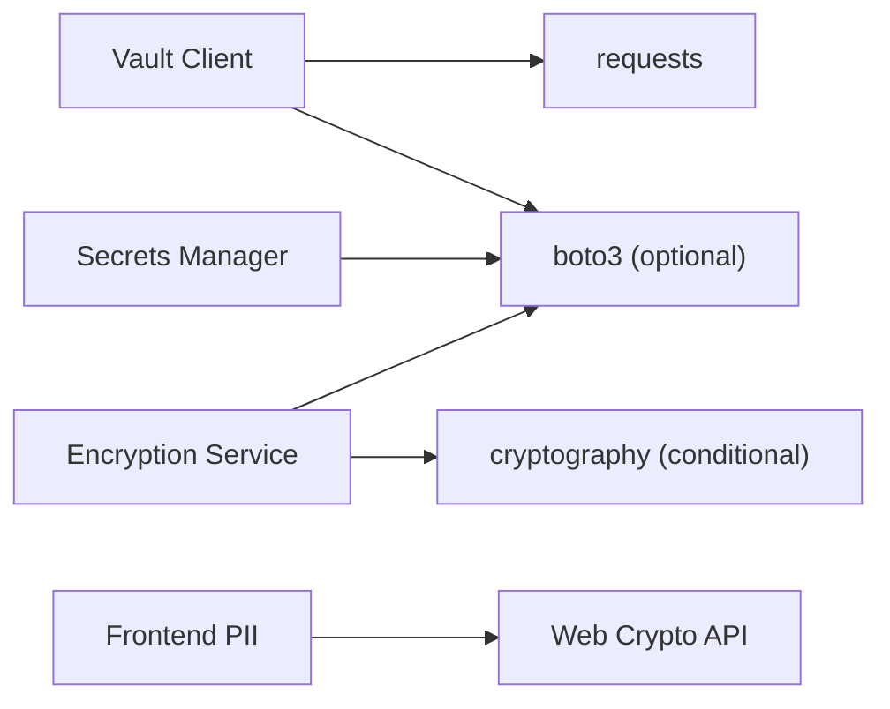

# Data Encryption & Protection

<cite>
**Referenced Files in This Document**
- [vault.py](file://backend/django/apps/core/vault.py)
- [secrets.py](file://backend/django/apps/core/secrets.py)
- [encryption.py](file://data/src/encryption.py)
- [security-model.md](file://docs/architecture/security-model.md)
- [pii-encryption.ts](file://frontend/packages/ui/src/lib/pii-encryption.ts)
- [security.py](file://backend/django/apps/crm/security.py)
- [base.py](file://backend/django/core/settings/base.py)
- [production.py](file://backend/django/core/settings/production.py)
- [main.tf](file://infra/terraform/main.tf)
- [README.md](file://docs/templates/jol-frontend-repo-template/secrets/README.md)
</cite>

## Table of Contents
1. [Introduction](#introduction)
2. [Project Structure](#project-structure)
3. [Core Components](#core-components)
4. [Architecture Overview](#architecture-overview)
5. [Detailed Component Analysis](#detailed-component-analysis)
6. [Dependency Analysis](#dependency-analysis)
7. [Performance Considerations](#performance-considerations)
8. [Troubleshooting Guide](#troubleshooting-guide)
9. [Conclusion](#conclusion)
10. [Appendices](#appendices)

## Introduction
This document explains how JOL-HUB encrypts and protects data at rest and in transit, manages secrets, and implements field-level encryption for sensitive information such as financial and personal identifiers. It covers:
- Database encryption and secure configuration
- File storage encryption considerations
- API communication security (TLS/HSTS)
- Secrets management via HashiCorp Vault and AWS Secrets Manager with environment variable fallbacks
- Field-level encryption for PII and financial data
- Key management, rotation policies, and backup procedures
- Practical examples of encrypting fields and accessing encrypted data through Django models and frontend forms

## Project Structure
Encryption and protection are implemented across multiple layers:
- Backend Django apps provide field-level encryption utilities and secret retrieval
- Data pipeline module provides envelope encryption and key lifecycle management
- Frontend library performs client-side AES-GCM encryption for PII form fields
- Infrastructure defines secrets injection and optional Vault integration
- Architecture documentation specifies TLS, HSTS, and at-rest encryption standards



**Diagram sources**
- [pii-encryption.ts:119-201](file://frontend/packages/ui/src/lib/pii-encryption.ts#L119-L201)
- [security.py:38-141](file://backend/django/apps/crm/security.py#L38-L141)
- [encryption.py:346-521](file://data/src/encryption.py#L346-L521)
- [vault.py:59-355](file://backend/django/apps/core/vault.py#L59-L355)
- [secrets.py:100-200](file://backend/django/apps/core/secrets.py#L100-L200)
- [main.tf:290-325](file://infra/terraform/main.tf#L290-L325)

**Section sources**
- [security-model.md:144-166](file://docs/architecture/security-model.md#L144-L166)
- [production.py:25-44](file://backend/django/core/settings/production.py#L25-L44)
- [base.py:172-186](file://backend/django/core/settings/base.py#L172-L186)

## Core Components
- Secrets Management
  - HashiCorp Vault client with IAM/Kubernetes/AppRole/token auth and caching
  - AWS Secrets Manager client with TTL cache and environment fallback
  - Encrypted secrets in repository using SOPS with age encryption
- Encryption Services
  - Envelope encryption with AWS KMS or local Fernet-based provider
  - Key lifecycle management, rotation, and re-encryption support
- Field-Level Encryption
  - Backend CRM PII encryption using Fernet with PBKDF2-derived keys
  - Frontend PII encryption using Web Crypto API AES-GCM with per-form metadata
- Transport Security
  - TLS 1.3 externally, TLS 1.2 minimum internally
  - HSTS enabled in production; secure cookies and CSRF protections

**Section sources**
- [vault.py:1-127](file://backend/django/apps/core/vault.py#L1-L127)
- [secrets.py:1-126](file://backend/django/apps/core/secrets.py#L1-L126)
- [encryption.py:27-101](file://data/src/encryption.py#L27-L101)
- [security.py:38-141](file://backend/django/apps/crm/security.py#L38-L141)
- [pii-encryption.ts:72-201](file://frontend/packages/ui/src/lib/pii-encryption.ts#L72-L201)
- [security-model.md:144-166](file://docs/architecture/security-model.md#L144-L166)
- [production.py:25-44](file://backend/django/core/settings/production.py#L25-L44)

## Architecture Overview
The platform enforces defense-in-depth for data protection:
- In-transit: TLS 1.3 to external endpoints; internal mTLS via service mesh; HSTS enforced in production
- At-rest: Database encryption; file systems and object storage encryption; envelope encryption for sensitive payloads
- Secrets: Centralized via Vault and/or AWS Secrets Manager; environment variables used as safe fallbacks; SOPS-managed repo secrets
- Field-level: PII and financial fields encrypted before persistence; decryption only where authorized

```mermaid
sequenceDiagram
participant Client as "Client"
participant FE as "Frontend PII Encryptor"
participant API as "Django API"
participant Sec as "CRM Security"
participant KMS as "Encryption Service"
participant DB as "Database"
participant Vault as "Vault Client"
participant SM as "Secrets Manager"
Client->>FE : Submit PII form
FE-->>API : Encrypted PII payload
API->>Sec : Decrypt if needed for processing
Sec->>KMS : Encrypt/Decrypt sensitive fields
KMS->>SM : Retrieve encryption keys/secrets
SM-->>KMS : Keys/secrets
API->>DB : Persist encrypted fields
Note over API,DB : All traffic uses TLS; DB at rest encrypted
```

**Diagram sources**
- [pii-encryption.ts:119-201](file://frontend/packages/ui/src/lib/pii-encryption.ts#L119-L201)
- [security.py:38-141](file://backend/django/apps/crm/security.py#L38-L141)
- [encryption.py:346-521](file://data/src/encryption.py#L346-L521)
- [vault.py:293-355](file://backend/django/apps/core/vault.py#L293-L355)
- [secrets.py:100-200](file://backend/django/apps/core/secrets.py#L100-L200)

## Detailed Component Analysis

### Secrets Management: HashiCorp Vault Integration
- Authentication methods: IAM role (AWS), Kubernetes service account, AppRole, token (development)
- Secret retrieval: KV v2 engine with in-memory cache and environment fallback
- Token renewal: Automatic refresh near expiry
- Usage patterns: Get single values or nested JSON keys; raise on required missing



**Diagram sources**
- [vault.py:59-127](file://backend/django/apps/core/vault.py#L59-L127)
- [vault.py:283-355](file://backend/django/apps/core/vault.py#L283-L355)

**Section sources**
- [vault.py:1-127](file://backend/django/apps/core/vault.py#L1-L127)
- [vault.py:293-355](file://backend/django/apps/core/vault.py#L293-L355)

### Secrets Management: AWS Secrets Manager
- TTL-based in-process cache for secret values
- Automatic environment variable fallback when disabled or not found
- Helper functions for database URL, email credentials, integrations, and encryption keys
- Development-safe behavior: generates temporary keys when secrets are absent



**Diagram sources**
- [secrets.py:100-200](file://backend/django/apps/core/secrets.py#L100-L200)
- [secrets.py:203-342](file://backend/django/apps/core/secrets.py#L203-L342)

**Section sources**
- [secrets.py:1-126](file://backend/django/apps/core/secrets.py#L1-L126)
- [secrets.py:203-342](file://backend/django/apps/core/secrets.py#L203-L342)

### Encryption Service and Key Management
- Providers: AWS KMS (envelope encryption with AES-GCM) and Local (Fernet)
- Key lifecycle: generate, rotate, versioning, re-encrypt, auto-rotation checks
- Storage: Encrypted data includes key ID and nonce; plaintext keys cleared after use
- Configuration: Provider selection via environment; KMS region and key ID configurable



**Diagram sources**
- [encryption.py:71-101](file://data/src/encryption.py#L71-L101)
- [encryption.py:104-243](file://data/src/encryption.py#L104-L243)
- [encryption.py:246-343](file://data/src/encryption.py#L246-L343)
- [encryption.py:346-521](file://data/src/encryption.py#L346-L521)

**Section sources**
- [encryption.py:27-101](file://data/src/encryption.py#L27-L101)
- [encryption.py:104-243](file://data/src/encryption.py#L104-L243)
- [encryption.py:246-343](file://data/src/encryption.py#L246-L343)
- [encryption.py:346-521](file://data/src/encryption.py#L346-L521)

### Field-Level Encryption: Backend (CRM)
- Uses Fernet (AES-128-CBC) with PBKDF2-derived key from Django SECRET_KEY
- Provides encrypt/decrypt for strings and bulk operations for dictionaries
- Safe handling of invalid tokens returns a placeholder instead of leaking errors



**Diagram sources**
- [security.py:38-141](file://backend/django/apps/crm/security.py#L38-L141)

**Section sources**
- [security.py:38-141](file://backend/django/apps/crm/security.py#L38-L141)

### Field-Level Encryption: Frontend (Forms)
- Uses Web Crypto API AES-GCM with per-field salt and IV
- Stores ciphertext, IV, salt, and version alongside metadata for audit trail
- Supports encrypting specific PII fields based on configuration



**Diagram sources**
- [pii-encryption.ts:72-201](file://frontend/packages/ui/src/lib/pii-encryption.ts#L72-L201)

**Section sources**
- [pii-encryption.ts:72-201](file://frontend/packages/ui/src/lib/pii-encryption.ts#L72-L201)

### API Communication Security
- Production enforces HTTPS redirect, HSTS, secure cookies, and CSRF protections
- Internal services use mTLS via service mesh; TLS 1.2 minimum within cluster
- Certificate pinning recommended for mobile clients



**Diagram sources**
- [production.py:25-44](file://backend/django/core/settings/production.py#L25-L44)
- [security-model.md:144-166](file://docs/architecture/security-model.md#L144-L166)

**Section sources**
- [production.py:25-44](file://backend/django/core/settings/production.py#L25-L44)
- [security-model.md:144-166](file://docs/architecture/security-model.md#L144-L166)

### Database and File Storage Encryption
- Database: PostgreSQL configured with encrypted-at-rest storage; connection details sourced from secrets
- File storage: Use server-side encryption (SSE-S3/SSE-KMS) for object storage; LUKS/BitLocker for filesystems
- Column-level encryption applied for highly sensitive fields via application-layer encryption

**Section sources**
- [base.py:172-186](file://backend/django/core/settings/base.py#L172-L186)
- [security-model.md:155-166](file://docs/architecture/security-model.md#L155-L166)

### Repository Secrets with SOPS
- Encrypted secrets stored under templates directory using SOPS with age
- Validation script ensures no plaintext secrets are committed
- Organized by environment and sensitivity levels

**Section sources**
- [README.md:1-41](file://docs/templates/jol-frontend-repo-template/secrets/README.md#L1-L41)

## Dependency Analysis
- Vault client depends on requests and optional boto3 for IAM flows; falls back to environment variables when unavailable
- Secrets manager depends on boto3; gracefully disables when missing
- Encryption service conditionally imports cryptography and boto3 based on provider
- Frontend encryption relies on Web Crypto API availability



**Diagram sources**
- [vault.py:87-127](file://backend/django/apps/core/vault.py#L87-L127)
- [secrets.py:53-75](file://backend/django/apps/core/secrets.py#L53-L75)
- [encryption.py:134-144](file://data/src/encryption.py#L134-L144)
- [pii-encryption.ts:204-211](file://frontend/packages/ui/src/lib/pii-encryption.ts#L204-L211)

**Section sources**
- [vault.py:87-127](file://backend/django/apps/core/vault.py#L87-L127)
- [secrets.py:53-75](file://backend/django/apps/core/secrets.py#L53-L75)
- [encryption.py:134-144](file://data/src/encryption.py#L134-L144)
- [pii-encryption.ts:204-211](file://frontend/packages/ui/src/lib/pii-encryption.ts#L204-L211)

## Performance Considerations
- Secret caching reduces latency and external calls; ensure TTL is appropriate for your environment
- Envelope encryption minimizes KMS calls by caching data keys; clear plaintext keys promptly
- Frontend AES-GCM encryption is efficient but should be limited to necessary fields to avoid UI lag
- Prefer server-side decryption only for authorized contexts to reduce exposure

[No sources needed since this section provides general guidance]

## Troubleshooting Guide
- Vault authentication failures: Check IAM/K8s/AppRole configuration; verify token expiry and namespace headers
- Missing secrets: Validate paths and mount points; confirm environment variable fallbacks are set
- Decryption errors: Ensure consistent key derivation parameters (salt, iterations) and correct algorithm usage
- Frontend encryption unavailable: Verify browser supports Web Crypto API; handle graceful degradation

**Section sources**
- [vault.py:107-127](file://backend/django/apps/core/vault.py#L107-L127)
- [vault.py:283-355](file://backend/django/apps/core/vault.py#L283-L355)
- [secrets.py:100-200](file://backend/django/apps/core/secrets.py#L100-L200)
- [security.py:85-105](file://backend/django/apps/crm/security.py#L85-L105)
- [pii-encryption.ts:204-211](file://frontend/packages/ui/src/lib/pii-encryption.ts#L204-L211)

## Conclusion
JOL-HUB employs a layered encryption strategy combining transport security, at-rest encryption, centralized secrets management, and field-level encryption for sensitive data. Vault and AWS Secrets Manager provide robust secret retrieval with safe fallbacks, while the encryption service offers scalable key management with rotation and re-encryption capabilities. Frontend encryption ensures PII is protected early in the data flow. Together, these components align with compliance requirements and best practices for secure data handling.

[No sources needed since this section summarizes without analyzing specific files]

## Appendices

### Examples: Encrypting Sensitive Fields
- Backend (CRM): Use PIIEncryption.encrypt() for individual fields or encrypt_dict() for sets of fields before saving to the database
- Frontend (Forms): Use encryptFormData() with an EncryptionConfig to selectively encrypt PII fields and attach metadata for auditing
- Envelope encryption: Use EncryptionService.encrypt() for high-value payloads requiring KMS-backed protection

**Section sources**
- [security.py:67-141](file://backend/django/apps/crm/security.py#L67-L141)
- [pii-encryption.ts:119-201](file://frontend/packages/ui/src/lib/pii-encryption.ts#L119-L201)
- [encryption.py:414-462](file://data/src/encryption.py#L414-L462)

### Accessing Encrypted Data Through Django Models
- Store encrypted values in model fields designated for sensitive data
- Use CRM security utilities to decrypt only in authorized views or serializers
- Ensure logs and error messages do not leak decrypted content

**Section sources**
- [security.py:85-105](file://backend/django/apps/crm/security.py#L85-L105)

### Secure Data Transmission Protocols
- Enforce HTTPS redirects and HSTS in production settings
- Configure secure cookie flags and CSRF protections
- Use service mesh mTLS for internal service-to-service communication

**Section sources**
- [production.py:25-44](file://backend/django/core/settings/production.py#L25-L44)
- [security-model.md:144-166](file://docs/architecture/security-model.md#L144-L166)

### Key Management Practices, Rotation Policies, and Backups
- Use EncryptionService to manage key lifecycle, including automatic rotation checks and re-encryption workflows
- For AWS KMS, rely on managed rotation and audit logging; for local development, persist keys securely with restricted permissions
- Back up encryption keys separately from data; test restoration regularly

**Section sources**
- [encryption.py:346-521](file://data/src/encryption.py#L346-L521)
- [security-model.md:162-166](file://docs/architecture/security-model.md#L162-L166)