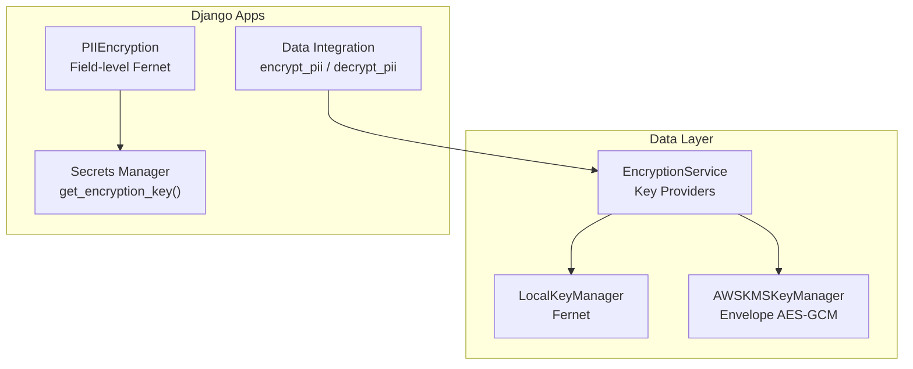
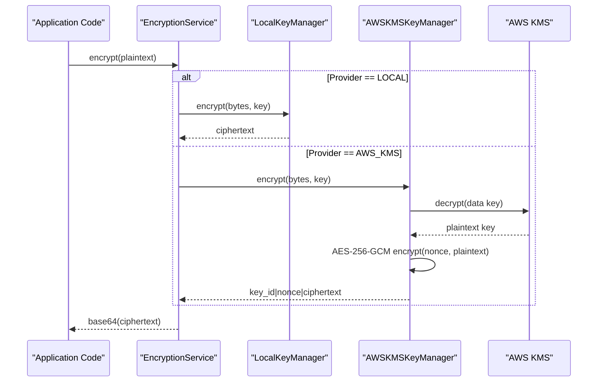
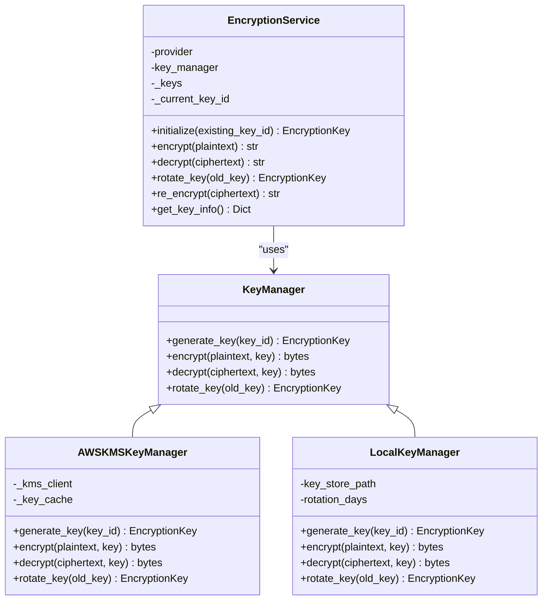
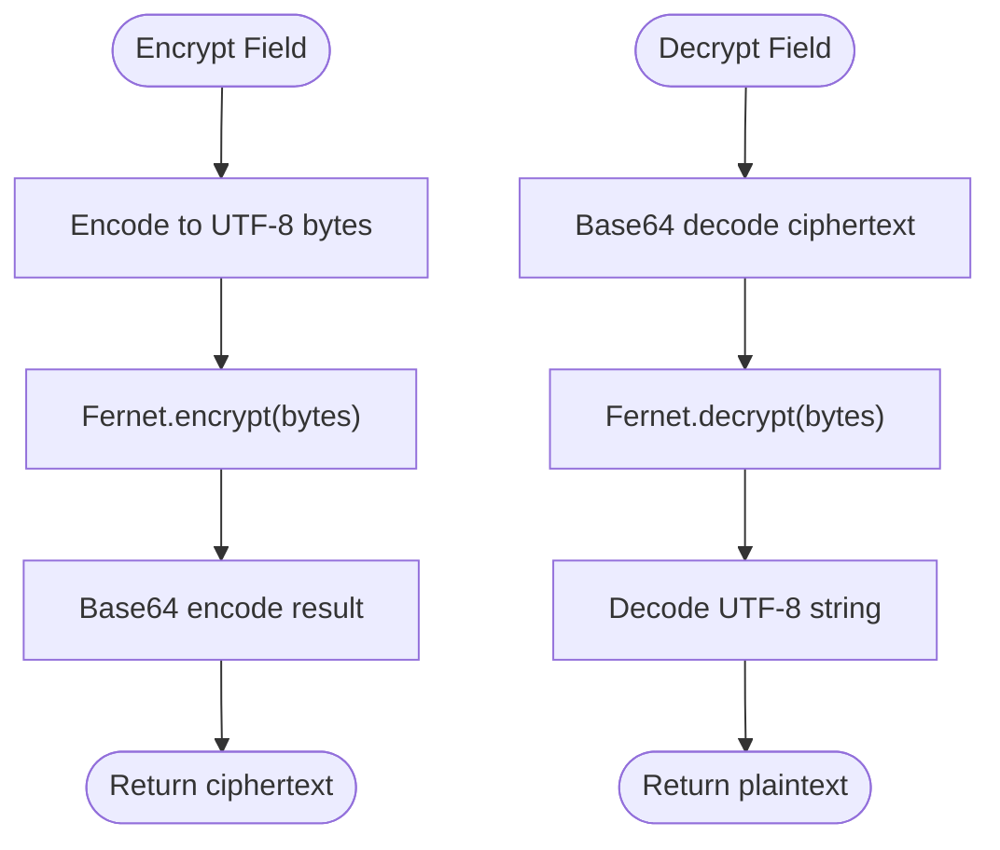
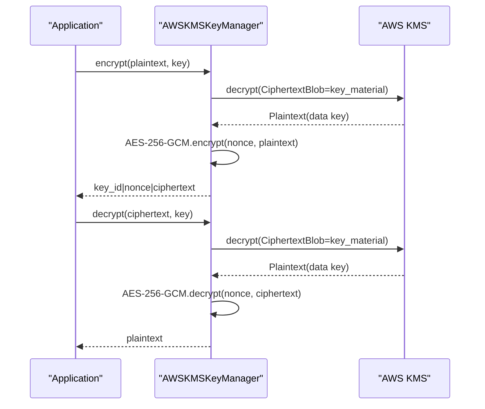
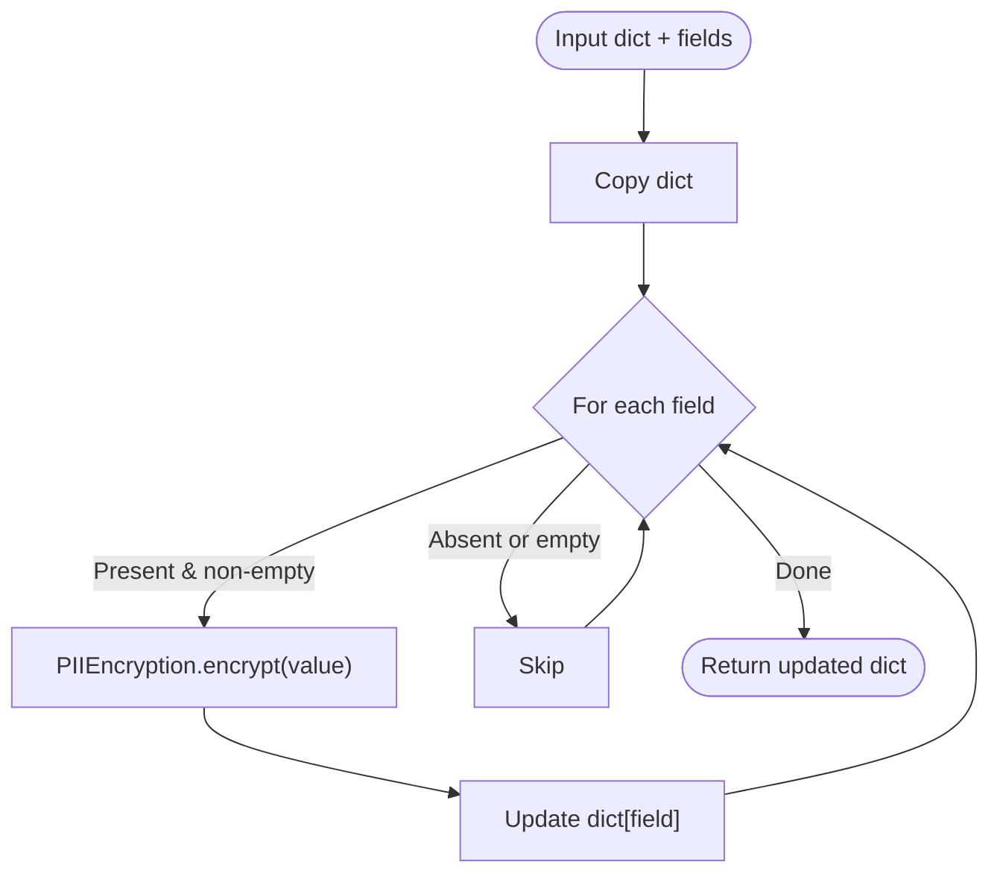
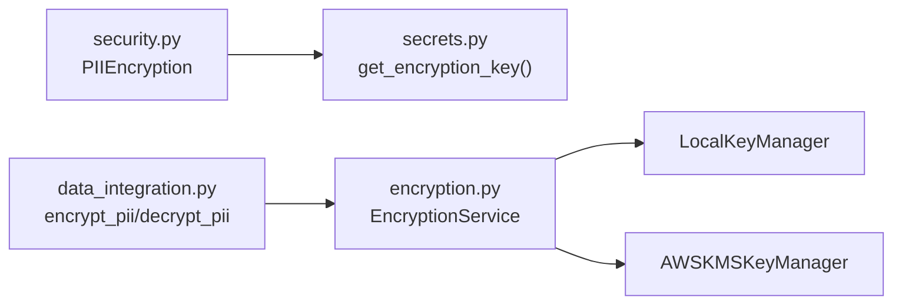

# Encryption Algorithms & Standards

<cite>
**Referenced Files in This Document**
- [encryption.py](file://data/src/encryption.py)
- [secrets.py](file://backend/django/apps/core/secrets.py)
- [security.py](file://backend/django/apps/crm/security.py)
- [data_integration.py](file://backend/django/apps/core/data_integration.py)
- [models.py](file://backend/django/apps/crm/models.py)
- [security-model.md](file://docs/architecture/security-model.md)
- [GDPR-checklist.md](file://docs/compliance/GDPR-checklist.md)
</cite>

## Table of Contents
1. [Introduction](#introduction)
2. [Project Structure](#project-structure)
3. [Core Components](#core-components)
4. [Architecture Overview](#architecture-overview)
5. [Detailed Component Analysis](#detailed-component-analysis)
6. [Dependency Analysis](#dependency-analysis)
7. [Performance Considerations](#performance-considerations)
8. [Troubleshooting Guide](#troubleshooting-guide)
9. [Conclusion](#conclusion)
10. [Appendices](#appendices)

## Introduction
This document explains the encryption algorithms and standards used across the JOL-HUB platform, with a focus on field-level data protection using Fernet-based symmetric encryption and envelope encryption via AWS KMS. It covers algorithm specifications, key formats, encryption/decryption workflows, compliance considerations (including AES-256 usage and FIPS-related controls), and practical guidance for encrypting sensitive fields such as personal identifiers, financial data, and authentication tokens. It also documents error handling patterns and secure data transmission protocols referenced by the codebase.

## Project Structure
Encryption capabilities are implemented in multiple layers:
- A reusable encryption service with pluggable key providers (local Fernet and AWS KMS envelope encryption).
- Django app utilities for PII encryption at rest using Fernet with key derivation from Django SECRET_KEY.
- Secrets management integration to load encryption keys securely.
- Data integration helpers that wrap encryption calls for PII fields.
- Security architecture documentation describing in-transit and at-rest encryption policies.

**Diagram sources**
- [encryption.py:34-102](file://data/src/encryption.py#L34-L102)
- [encryption.py:104-243](file://data/src/encryption.py#L104-L243)
- [encryption.py:246-343](file://data/src/encryption.py#L246-L343)
- [encryption.py:346-521](file://data/src/encryption.py#L346-L521)
- [security.py:38-141](file://backend/django/apps/crm/security.py#L38-L141)
- [secrets.py:323-342](file://backend/django/apps/core/secrets.py#L323-L342)
- [data_integration.py:350-401](file://backend/django/apps/core/data_integration.py#L350-L401)

**Section sources**
- [encryption.py:1-575](file://data/src/encryption.py#L1-L575)
- [security.py:1-524](file://backend/django/apps/crm/security.py#L1-L524)
- [secrets.py:1-418](file://backend/django/apps/core/secrets.py#L1-L418)
- [data_integration.py:350-448](file://backend/django/apps/core/data_integration.py#L350-L448)

## Core Components
- EncryptionService: Central orchestrator supporting local Fernet and AWS KMS envelope encryption, automatic key rotation, versioning, and re-encryption support.
- LocalKeyManager: Development-time provider using Fernet (AES-128-CBC with HMAC) with file-based key storage and restrictive permissions.
- AWSKMSKeyManager: Production-grade envelope encryption using AES-256-GCM with KMS-managed data keys; ciphertext includes key ID and nonce.
- PIIEncryption: Django-side field-level encryption using Fernet with PBKDF2-derived keys from Django SECRET_KEY for consistent tenant-wide encryption.
- Secrets Manager Integration: Loads encryption keys from AWS Secrets Manager with environment fallbacks and caching.
- Data Integration Helpers: Thin wrappers to encrypt/decrypt PII using the global encryption service.

**Section sources**
- [encryption.py:34-102](file://data/src/encryption.py#L34-L102)
- [encryption.py:104-243](file://data/src/encryption.py#L104-L243)
- [encryption.py:246-343](file://data/src/encryption.py#L246-L343)
- [encryption.py:346-521](file://data/src/encryption.py#L346-L521)
- [security.py:38-141](file://backend/django/apps/crm/security.py#L38-L141)
- [secrets.py:323-342](file://backend/django/apps/core/secrets.py#L323-L342)
- [data_integration.py:350-401](file://backend/django/apps/core/data_integration.py#L350-L401)

## Architecture Overview
The system supports two primary encryption modes:
- Field-level Fernet encryption for Django models and application data, suitable for development or when centralized key management is not required.
- Envelope encryption via AWS KMS for production, providing AES-256-GCM authenticated encryption with managed data keys and robust key lifecycle controls.

**Diagram sources**
- [encryption.py:414-434](file://data/src/encryption.py#L414-L434)
- [encryption.py:177-205](file://data/src/encryption.py#L177-L205)
- [encryption.py:320-332](file://data/src/encryption.py#L320-L332)

**Section sources**
- [encryption.py:104-243](file://data/src/encryption.py#L104-L243)
- [encryption.py:246-343](file://data/src/encryption.py#L246-L343)
- [encryption.py:346-521](file://data/src/encryption.py#L346-L521)

## Detailed Component Analysis

### EncryptionService and Key Providers
- Supports pluggable providers via an abstract KeyManager interface.
- Local provider uses Fernet for symmetric encryption with file-backed key storage and strict permissions.
- AWS KMS provider implements envelope encryption:
  - Uses AES-256-GCM for authenticated encryption.
  - Stores encrypted data key material; plaintext key is short-lived and cleared after use.
  - Ciphertext format includes key ID and nonce for decryption routing.
- Automatic key rotation and versioning; old keys retained for decryption.

**Diagram sources**
- [encryption.py:71-102](file://data/src/encryption.py#L71-L102)
- [encryption.py:104-243](file://data/src/encryption.py#L104-L243)
- [encryption.py:246-343](file://data/src/encryption.py#L246-L343)
- [encryption.py:346-521](file://data/src/encryption.py#L346-L521)

**Section sources**
- [encryption.py:71-102](file://data/src/encryption.py#L71-L102)
- [encryption.py:104-243](file://data/src/encryption.py#L104-L243)
- [encryption.py:246-343](file://data/src/encryption.py#L246-L343)
- [encryption.py:346-521](file://data/src/encryption.py#L346-L521)

### Fernet Symmetric Encryption (Field-Level Protection)
- Used in LocalKeyManager for development and in PIIEncryption for Django model fields.
- Algorithm details:
  - Fernet provides symmetric encryption with built-in HMAC for integrity.
  - Underlying cipher is AES-128-CBC with PKCS7 padding and HMAC-SHA256.
- Key formats:
  - LocalKeyManager stores Fernet keys as base64-encoded JSON files with restrictive permissions.
  - PIIEncryption derives a 32-byte key using PBKDF2-HMAC-SHA256 from Django SECRET_KEY with a fixed salt and iteration count.
- Workflows:
  - Encrypt: Convert string to UTF-8 bytes, encrypt with Fernet, return base64-encoded ciphertext.
  - Decrypt: Base64-decode ciphertext, decrypt with Fernet, return UTF-8 string.

**Diagram sources**
- [encryption.py:320-332](file://data/src/encryption.py#L320-L332)
- [security.py:67-105](file://backend/django/apps/crm/security.py#L67-L105)

**Section sources**
- [encryption.py:246-343](file://data/src/encryption.py#L246-L343)
- [security.py:38-141](file://backend/django/apps/crm/security.py#L38-L141)

### AWS KMS Envelope Encryption (Production)
- Uses AES-256-GCM for authenticated encryption with a per-message nonce.
- Envelope pattern:
  - KMS generates and returns a data key; the plaintext key is used only in memory to encrypt/decrypt data.
  - The encrypted data key is stored alongside ciphertext; decryption retrieves the plaintext key via KMS.
- Ciphertext layout:
  - First 36 bytes: key ID (padded).
  - Next 12 bytes: nonce.
  - Remaining bytes: ciphertext.
- Key rotation:
  - Generates new data keys with incremented versions; old keys remain available for decryption.

**Diagram sources**
- [encryption.py:177-205](file://data/src/encryption.py#L177-L205)
- [encryption.py:207-226](file://data/src/encryption.py#L207-L226)
- [encryption.py:228-243](file://data/src/encryption.py#L228-L243)

**Section sources**
- [encryption.py:104-243](file://data/src/encryption.py#L104-L243)

### Django PII Encryption Utilities
- PIIEncryption provides field-level encryption for CRM data using Fernet with PBKDF2-derived keys from Django SECRET_KEY.
- Utility methods:
  - encrypt/decrypt single fields.
  - encrypt_dict/decrypt_dict for batch processing of dictionaries.
- Error handling:
  - InvalidToken exceptions are caught and logged; decryption returns a sentinel value to avoid leaking errors.

**Diagram sources**
- [security.py:107-141](file://backend/django/apps/crm/security.py#L107-L141)

**Section sources**
- [security.py:38-141](file://backend/django/apps/crm/security.py#L38-L141)

### Secrets Management and Key Retrieval
- get_encryption_key loads PII encryption keys from AWS Secrets Manager with environment variable fallbacks and caching.
- In development, if no key is found, a temporary Fernet key is generated and logged.

**Section sources**
- [secrets.py:323-342](file://backend/django/apps/core/secrets.py#L323-L342)

### Data Integration Wrappers
- DataModuleIntegration exposes encrypt_pii and decrypt_pii methods that delegate to the global encryption service.
- Gracefully handles missing encryption dependencies by logging warnings and returning None.

**Section sources**
- [data_integration.py:350-401](file://backend/django/apps/core/data_integration.py#L350-L401)

## Dependency Analysis
- EncryptionService depends on KeyProvider implementations:
  - LocalKeyManager relies on cryptography.fernet.
  - AWSKMSKeyManager depends on boto3 and AWS KMS APIs.
- Django apps depend on:
  - secrets module for key retrieval.
  - security module for field-level encryption.
  - data_integration module for high-level PII operations.

**Diagram sources**
- [security.py:38-141](file://backend/django/apps/crm/security.py#L38-L141)
- [secrets.py:323-342](file://backend/django/apps/core/secrets.py#L323-L342)
- [data_integration.py:350-401](file://backend/django/apps/core/data_integration.py#L350-L401)
- [encryption.py:346-521](file://data/src/encryption.py#L346-L521)

**Section sources**
- [encryption.py:346-521](file://data/src/encryption.py#L346-L521)
- [security.py:38-141](file://backend/django/apps/crm/security.py#L38-L141)
- [secrets.py:323-342](file://backend/django/apps/core/secrets.py#L323-L342)
- [data_integration.py:350-401](file://backend/django/apps/core/data_integration.py#L350-L401)

## Performance Considerations
- Envelope encryption minimizes KMS calls by caching data keys in memory for the duration of operations where applicable.
- AES-256-GCM provides authenticated encryption with efficient performance and integrity verification.
- Local Fernet encryption is fast and suitable for development or low-throughput scenarios.
- Avoid storing plaintext keys in logs or caches; ensure proper memory clearing after use.

[No sources needed since this section provides general guidance]

## Troubleshooting Guide
Common issues and resolutions:
- Unknown key ID during decryption:
  - Ensure the correct key is loaded or available in the key registry; for LocalKeyManager, verify key files exist and are readable.
- InvalidToken during decryption:
  - Indicates corrupted ciphertext or mismatched keys; log and handle gracefully without exposing internals.
- Missing dependencies:
  - For AWS KMS, ensure boto3 is installed and configured; otherwise, fall back to local provider or raise informative errors.
- Encryption service not initialized:
  - Initialize the service before encrypting; check current key state and rotation settings.

**Section sources**
- [encryption.py:436-468](file://data/src/encryption.py#L436-L468)
- [security.py:85-105](file://backend/django/apps/crm/security.py#L85-L105)
- [data_integration.py:369-401](file://backend/django/apps/core/data_integration.py#L369-L401)

## Conclusion
JOL-HUB implements a layered encryption strategy combining field-level Fernet encryption for Django models and envelope encryption via AWS KMS for production-grade security. The design emphasizes secure key management, algorithmic strength (AES-256-GCM in production, Fernet in development), and robust error handling. Compliance references include ISO 27001, SOC 2, GDPR Article 32, and PCI-DSS requirements for protecting stored and transmitted cardholder data.

[No sources needed since this section summarizes without analyzing specific files]

## Appendices

### Algorithm Specifications and Standards
- Fernet:
  - Symmetric encryption with HMAC for integrity.
  - Underlying cipher: AES-128-CBC with PKCS7 padding and HMAC-SHA256.
  - Suitable for field-level encryption in development and Django apps.
- AES-256-GCM (via AWS KMS):
  - Authenticated encryption with associated data (AEAD).
  - Nonce size: 96 bits; ciphertext includes key ID and nonce for decryption routing.
  - Recommended for production data at rest and in transit when combined with TLS.

Compliance notes:
- AES-256 usage aligns with strong encryption requirements in GDPR Article 32 and PCI-DSS Requirement 3.
- FIPS 140-2 alignment is achieved through AWS KMS HSM-backed keys and managed cryptographic operations.

**Section sources**
- [encryption.py:177-205](file://data/src/encryption.py#L177-L205)
- [security-model.md:144-165](file://docs/architecture/security-model.md#L144-L165)
- [GDPR-checklist.md:259-270](file://docs/compliance/GDPR-checklist.md#L259-L270)

### Implementing Encryption in Django Models
- Use PIIEncryption to encrypt sensitive fields before saving and decrypt upon retrieval.
- Define clear field classifications and apply encryption selectively to minimize overhead.
- Integrate with audit logging and consent tracking to maintain compliance.

**Section sources**
- [security.py:38-141](file://backend/django/apps/crm/security.py#L38-L141)
- [models.py:31-38](file://backend/django/apps/crm/models.py#L31-L38)

### Secure Data Transmission Protocols
- Enforce TLS 1.3 for external communication and TLS 1.2 minimum for internal services.
- Enable HSTS and use perfect forward secrecy cipher suites.
- Apply certificate pinning for mobile applications where applicable.

**Section sources**
- [security-model.md:144-165](file://docs/architecture/security-model.md#L144-L165)