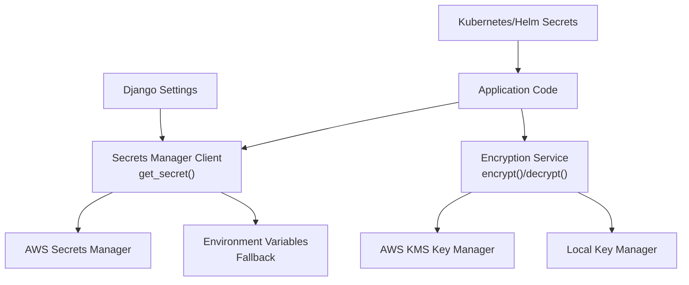
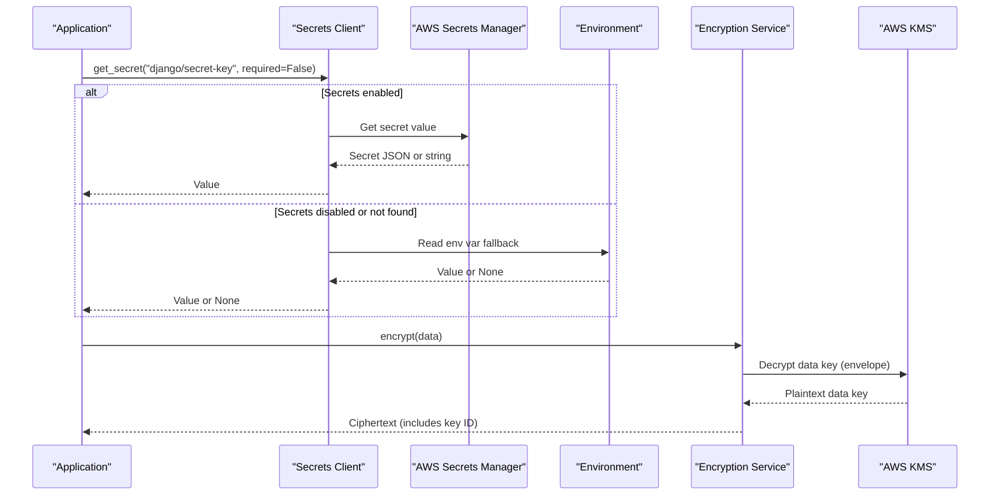
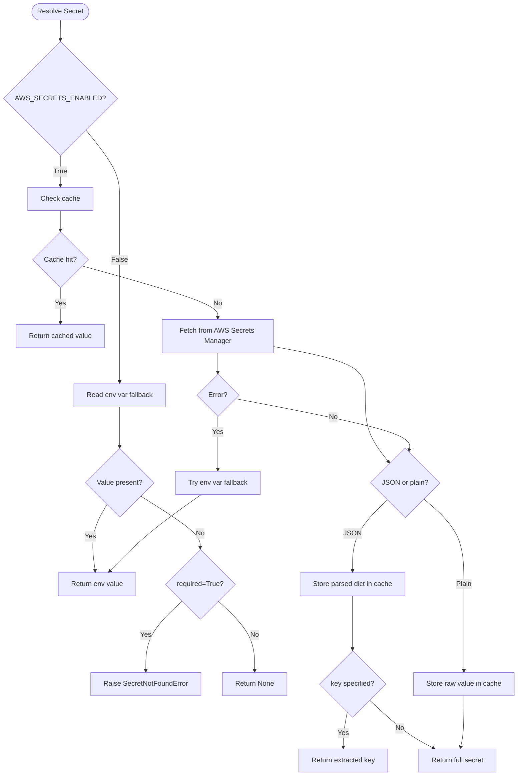
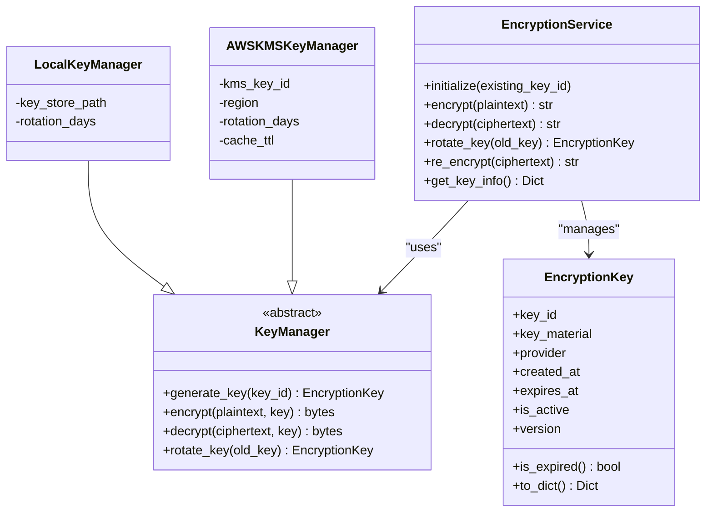
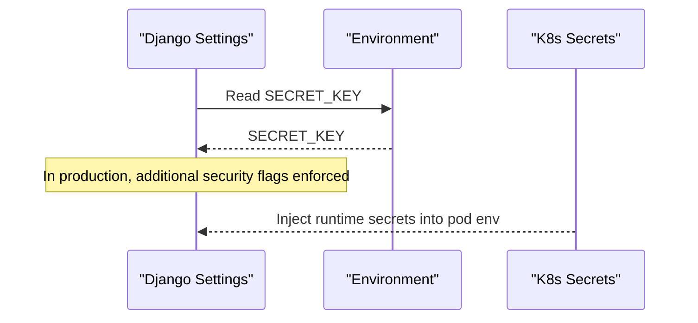
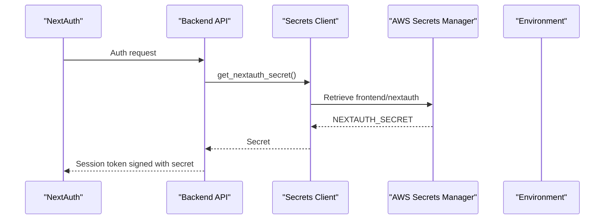
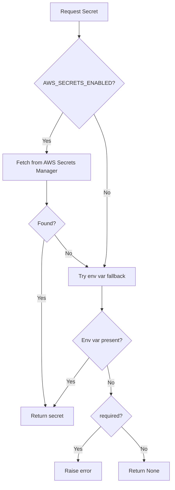
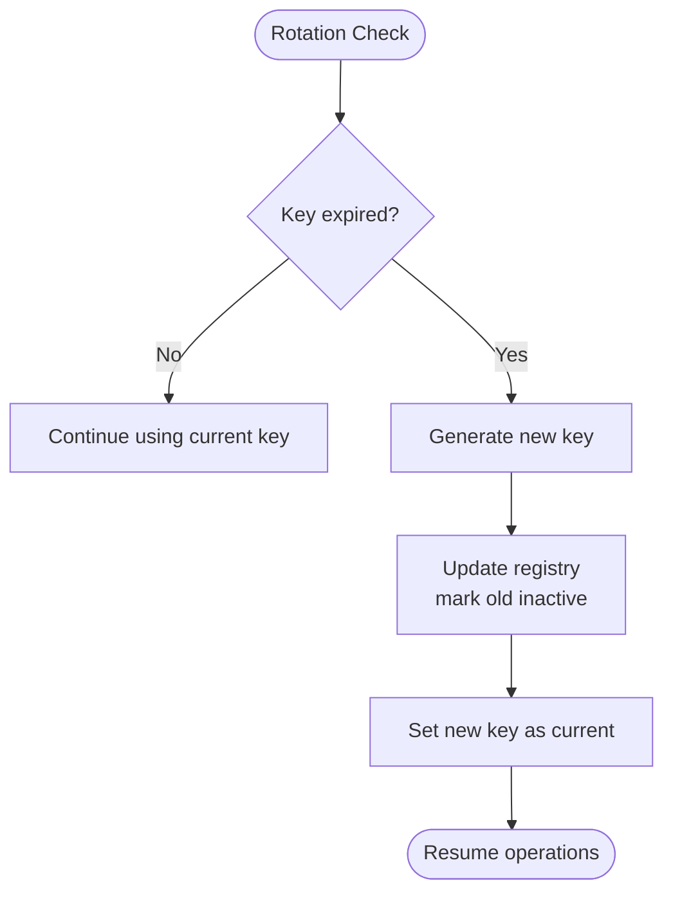
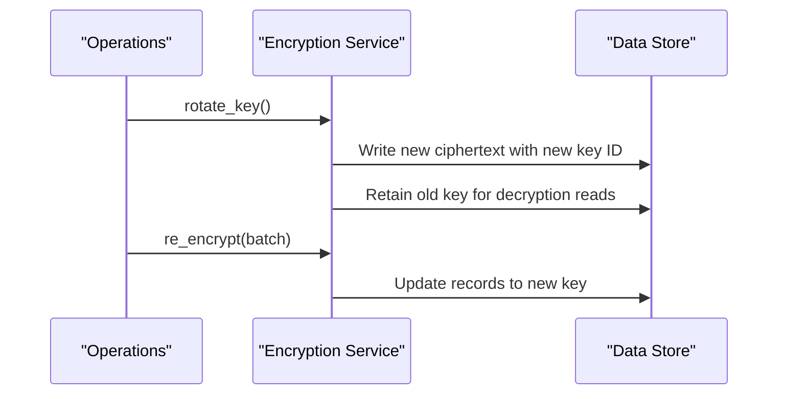
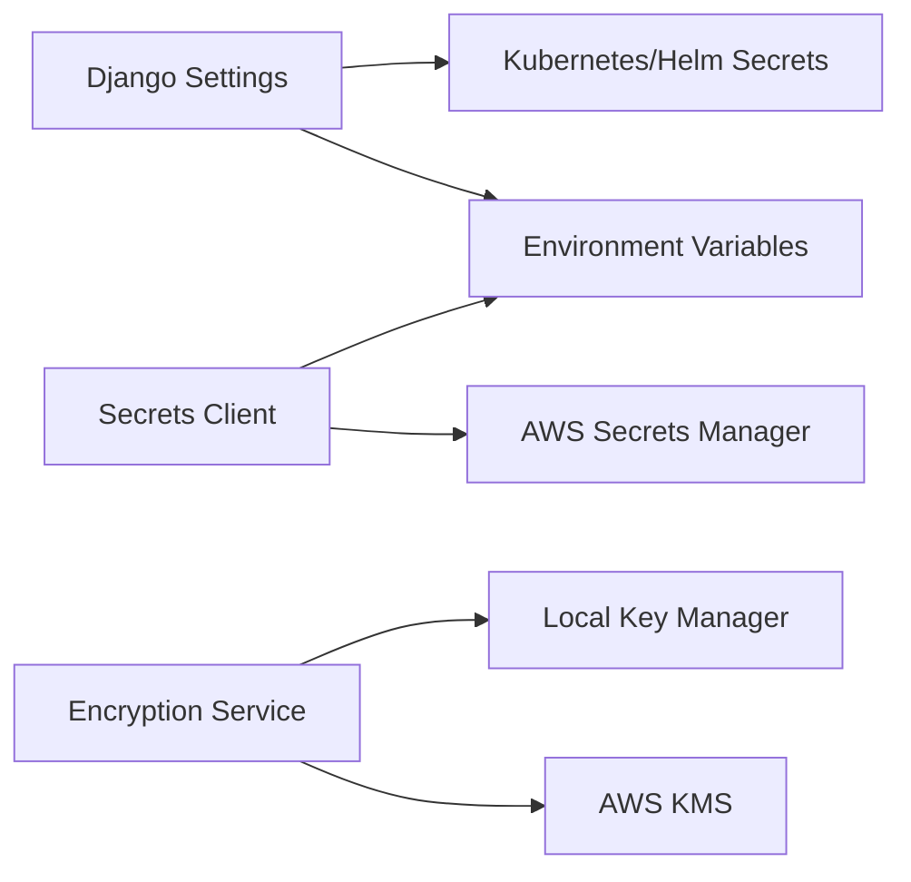

# Key Lifecycle Management

<cite>
**Referenced Files in This Document**
- [secrets.py](file://backend/django/apps/core/secrets.py)
- [encryption.py](file://data/src/encryption.py)
- [base.py](file://backend/django/core/settings/base.py)
- [production.py](file://backend/django/core/settings/production.py)
- [development.py](file://backend/django/core/settings/development.py)
- [secrets.yaml (Helm)](file://infra/helm/jol-hub/templates/secrets.yaml)
- [secrets.yaml (K8s base)](file://infra/kubernetes/base/secrets.yaml)
- [security-model.md](file://docs/architecture/security-model.md)
- [GDPR-checklist.md](file://docs/compliance/GDPR-checklist.md)
</cite>

## Table of Contents
1. Introduction
2. Project Structure
3. Core Components
4. Architecture Overview
5. Detailed Component Analysis
6. Dependency Analysis
7. Performance Considerations
8. Troubleshooting Guide
9. Conclusion
10. Appendices

## Introduction
This document describes the end-to-end encryption key lifecycle management for JOL-HUB, covering generation, storage, rotation, backup, and recovery. It explains how PII encryption keys, Django SECRET_KEY, and NextAuth.js secrets are managed across environments, with a focus on AWS Secrets Manager usage, environment variable fallbacks, and development vs production handling. It also outlines monitoring and alerting strategies, compliance requirements, and operational procedures for rotation without downtime and emergency recovery.

## Project Structure
Key lifecycle capabilities are implemented across:
- Secret retrieval and caching with AWS Secrets Manager and environment fallbacks
- Encryption service with pluggable providers (AWS KMS and local)
- Django settings that consume secrets and configure security controls
- Infrastructure templates that inject runtime secrets into workloads

**Diagram sources**
- [secrets.py:100-200](file://backend/django/apps/core/secrets.py#L100-L200)
- [encryption.py:104-244](file://data/src/encryption.py#L104-L244)
- [base.py:39-39](file://backend/django/core/settings/base.py#L39-L39)
- [secrets.yaml (Helm):9-23](file://infra/helm/jol-hub/templates/secrets.yaml#L9-L23)

**Section sources**
- [secrets.py:1-418](file://backend/django/apps/core/secrets.py#L1-L418)
- [encryption.py:1-575](file://data/src/encryption.py#L1-L575)
- [base.py:1-800](file://backend/django/core/settings/base.py#L1-L800)
- [production.py:1-122](file://backend/django/core/settings/production.py#L1-L122)
- [development.py:1-110](file://backend/django/core/settings/development.py#L1-L110)
- [secrets.yaml (Helm):1-24](file://infra/helm/jol-hub/templates/secrets.yaml#L1-L24)
- [secrets.yaml (K8s base):1-88](file://infra/kubernetes/base/secrets.yaml#L1-L88)

## Core Components
- Secrets Manager client with TTL cache and environment fallback
- Encryption service supporting AWS KMS and local providers
- Django settings integration for SECRET_KEY and JWT signing
- Kubernetes/Helm secret injection for runtime configuration

Key responsibilities:
- Centralized secret resolution with consistent fallback behavior
- Envelope encryption and key versioning for data at rest
- Environment-aware defaults for development and hardened defaults for production
- Secure injection of secrets into containers via Kubernetes/Helm

**Section sources**
- [secrets.py:100-200](file://backend/django/apps/core/secrets.py#L100-L200)
- [encryption.py:346-521](file://data/src/encryption.py#L346-L521)
- [base.py:39-39](file://backend/django/core/settings/base.py#L39-L39)
- [base.py:330-355](file://backend/django/core/settings/base.py#L330-L355)
- [secrets.yaml (Helm):9-23](file://infra/helm/jol-hub/templates/secrets.yaml#L9-L23)

## Architecture Overview
The system uses a layered approach:
- Application code requests secrets through a unified interface
- Secrets are resolved from AWS Secrets Manager when enabled; otherwise, environment variables are used
- Encryption operations use envelope encryption with AWS KMS in production or local symmetric encryption in development
- Kubernetes/Helm injects runtime secrets into pods

**Diagram sources**
- [secrets.py:100-200](file://backend/django/apps/core/secrets.py#L100-L200)
- [encryption.py:177-244](file://data/src/encryption.py#L177-L244)

## Detailed Component Analysis

### Secrets Manager Integration and Fallback
- Unified resolver supports JSON secrets and key extraction
- TTL-based in-memory cache reduces external calls
- Development mode can bypass AWS by disabling Secrets Manager
- Graceful fallback to environment variables ensures continuity

**Diagram sources**
- [secrets.py:100-200](file://backend/django/apps/core/secrets.py#L100-L200)

**Section sources**
- [secrets.py:100-200](file://backend/django/apps/core/secrets.py#L100-L200)
- [secrets.py:323-386](file://backend/django/apps/core/secrets.py#L323-L386)

### PII Encryption Key Management
- Pluggable providers: AWS KMS (production) and Local (development)
- Envelope encryption: data keys encrypted under KMS master key
- Automatic rotation policy based on configurable days
- Versioned keys retained for decryption of legacy data

**Diagram sources**
- [encryption.py:34-68](file://data/src/encryption.py#L34-L68)
- [encryption.py:71-101](file://data/src/encryption.py#L71-L101)
- [encryption.py:104-244](file://data/src/encryption.py#L104-L244)
- [encryption.py:246-344](file://data/src/encryption.py#L246-L344)
- [encryption.py:346-521](file://data/src/encryption.py#L346-L521)

**Section sources**
- [encryption.py:104-244](file://data/src/encryption.py#L104-L244)
- [encryption.py:246-344](file://data/src/encryption.py#L246-L344)
- [encryption.py:346-521](file://data/src/encryption.py#L346-L521)

### Django SECRET_KEY Handling
- Base settings load SECRET_KEY from environment
- Production hardens security posture (HTTPS, cookies, throttling)
- Development relaxes some security flags for local debugging
- Secrets can be sourced from environment or injected via Kubernetes/Helm

**Diagram sources**
- [base.py:29-39](file://backend/django/core/settings/base.py#L29-L39)
- [production.py:18-44](file://backend/django/core/settings/production.py#L18-L44)
- [development.py:12-109](file://backend/django/core/settings/development.py#L12-L109)
- [secrets.yaml (Helm):9-23](file://infra/helm/jol-hub/templates/secrets.yaml#L9-L23)

**Section sources**
- [base.py:29-39](file://backend/django/core/settings/base.py#L29-L39)
- [base.py:330-355](file://backend/django/core/settings/base.py#L330-L355)
- [production.py:18-44](file://backend/django/core/settings/production.py#L18-L44)
- [development.py:12-109](file://backend/django/core/settings/development.py#L12-L109)
- [secrets.yaml (Helm):9-23](file://infra/helm/jol-hub/templates/secrets.yaml#L9-L23)

### NextAuth.js Secret Management
- Backend provides a helper to retrieve NextAuth secret from Secrets Manager with environment fallback
- Development generates a temporary secret if none is provided
- Kubernetes/Helm template includes NEXTAUTH_SECRET for runtime injection

**Diagram sources**
- [secrets.py:364-379](file://backend/django/apps/core/secrets.py#L364-L379)
- [secrets.yaml (Helm):23-23](file://infra/helm/jol-hub/templates/secrets.yaml#L23-L23)

**Section sources**
- [secrets.py:364-379](file://backend/django/apps/core/secrets.py#L364-L379)
- [secrets.yaml (Helm):23-23](file://infra/helm/jol-hub/templates/secrets.yaml#L23-L23)

### Key Storage Mechanisms and Environment Fallbacks
- Primary: AWS Secrets Manager with IAM role authentication
- Fallback: Environment variables when Secrets Manager is disabled or unavailable
- Development: Temporary keys generated locally for convenience
- Kubernetes/Helm: Secrets injected into container environment at runtime

**Diagram sources**
- [secrets.py:100-200](file://backend/django/apps/core/secrets.py#L100-L200)

**Section sources**
- [secrets.py:100-200](file://backend/django/apps/core/secrets.py#L100-L200)
- [secrets.yaml (K8s base):17-47](file://infra/kubernetes/base/secrets.yaml#L17-L47)

### Automated Key Rotation Policies
- Configurable rotation period (days) per provider
- AWS KMS: automatic rotation of master key; application rotates data keys
- Local provider: generates new key and deactivates old key
- Encryption service tracks versions and retains old keys for decryption

**Diagram sources**
- [encryption.py:470-503](file://data/src/encryption.py#L470-L503)
- [encryption.py:228-244](file://data/src/encryption.py#L228-L244)
- [encryption.py:334-344](file://data/src/encryption.py#L334-L344)

**Section sources**
- [encryption.py:228-244](file://data/src/encryption.py#L228-L244)
- [encryption.py:334-344](file://data/src/encryption.py#L334-L344)
- [encryption.py:470-503](file://data/src/encryption.py#L470-L503)

### Backup Procedures
- Backups should be encrypted with AES-256 and managed separately from data keys
- Immutable storage recommended for critical backups
- Geographic separation and regular restoration testing advised

[No sources needed since this section provides general guidance]

### Procedures for Key Rotation Without Downtime
- Keep old keys active during transition to support decryption of existing data
- Use envelope encryption so ciphertext includes key ID for correct key selection
- Perform rotation in rolling deployments to avoid service interruption
- Re-encrypt data asynchronously post-rotation to fully migrate to new keys

**Diagram sources**
- [encryption.py:470-512](file://data/src/encryption.py#L470-L512)

**Section sources**
- [encryption.py:470-512](file://data/src/encryption.py#L470-L512)

### Emergency Key Recovery Processes
- Maintain secure, access-controlled backups of master keys or KMS configurations
- Ensure IAM policies allow authorized personnel to access secrets and KMS resources
- Validate recovered keys against known ciphertext formats before restoring services

[No sources needed since this section provides general guidance]

### Key Validation Checks
- Verify secret availability at startup (fail fast if required)
- Validate key metadata (expiration, version) and log warnings for near-expiry
- Test decrypt path periodically to ensure key integrity

**Section sources**
- [secrets.py:197-200](file://backend/django/apps/core/secrets.py#L197-L200)
- [encryption.py:53-68](file://data/src/encryption.py#L53-L68)

## Dependency Analysis
- Secrets client depends on boto3 and AWS credentials; falls back to environment variables when disabled
- Encryption service depends on cryptography library and optionally boto3 for KMS
- Django settings depend on environment variables and optional secret injection via Kubernetes/Helm
- Infrastructure templates provide runtime secrets to applications

**Diagram sources**
- [secrets.py:53-76](file://backend/django/apps/core/secrets.py#L53-L76)
- [encryption.py:134-144](file://data/src/encryption.py#L134-L144)
- [base.py:29-39](file://backend/django/core/settings/base.py#L29-L39)
- [secrets.yaml (Helm):9-23](file://infra/helm/jol-hub/templates/secrets.yaml#L9-L23)

**Section sources**
- [secrets.py:53-76](file://backend/django/apps/core/secrets.py#L53-L76)
- [encryption.py:134-144](file://data/src/encryption.py#L134-L144)
- [base.py:29-39](file://backend/django/core/settings/base.py#L29-L39)
- [secrets.yaml (Helm):9-23](file://infra/helm/jol-hub/templates/secrets.yaml#L9-L23)

## Performance Considerations
- Secrets cache TTL reduces latency and API calls; tune based on rotation frequency
- Envelope encryption minimizes plaintext key exposure and improves performance by caching data keys
- Avoid frequent rotations in high-throughput paths; batch re-encryption during maintenance windows
- Monitor KMS and Secrets Manager quotas and rate limits

[No sources needed since this section provides general guidance]

## Troubleshooting Guide
Common issues and resolutions:
- Missing secret: Ensure AWS_SECRETS_ENABLED is set correctly and required flags are configured appropriately
- Decryption failures: Verify key IDs embedded in ciphertext match available keys; check key expiration and rotation status
- Environment fallback not used: Confirm Secrets Manager is disabled or secret not found; validate environment variable names
- Production misconfiguration: Review Django security settings and ensure HTTPS, cookie flags, and throttling are enabled

**Section sources**
- [secrets.py:197-200](file://backend/django/apps/core/secrets.py#L197-L200)
- [encryption.py:445-461](file://data/src/encryption.py#L445-L461)
- [production.py:18-44](file://backend/django/core/settings/production.py#L18-L44)

## Conclusion
JOL-HUB implements a robust key lifecycle management strategy combining centralized secret resolution, envelope encryption, automated rotation, and secure deployment practices. By leveraging AWS Secrets Manager and KMS with environment fallbacks, the platform maintains high availability and strong security across development and production. Monitoring, compliance, and operational procedures ensure keys remain protected, auditable, and recoverable.

[No sources needed since this section summarizes without analyzing specific files]

## Appendices

### Compliance Requirements
- Encryption at rest and in transit, key rotation, and audit logging align with GDPR and SOC2 expectations
- Data classification and access controls support privacy-by-design principles
- Regular audits and metrics help maintain compliance posture

**Section sources**
- [security-model.md:144-167](file://docs/architecture/security-model.md#L144-L167)
- [GDPR-checklist.md:259-303](file://docs/compliance/GDPR-checklist.md#L259-L303)