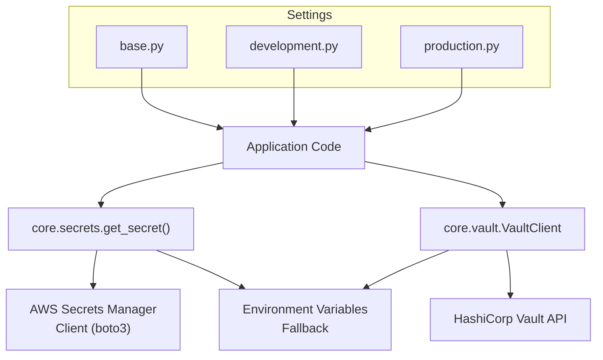
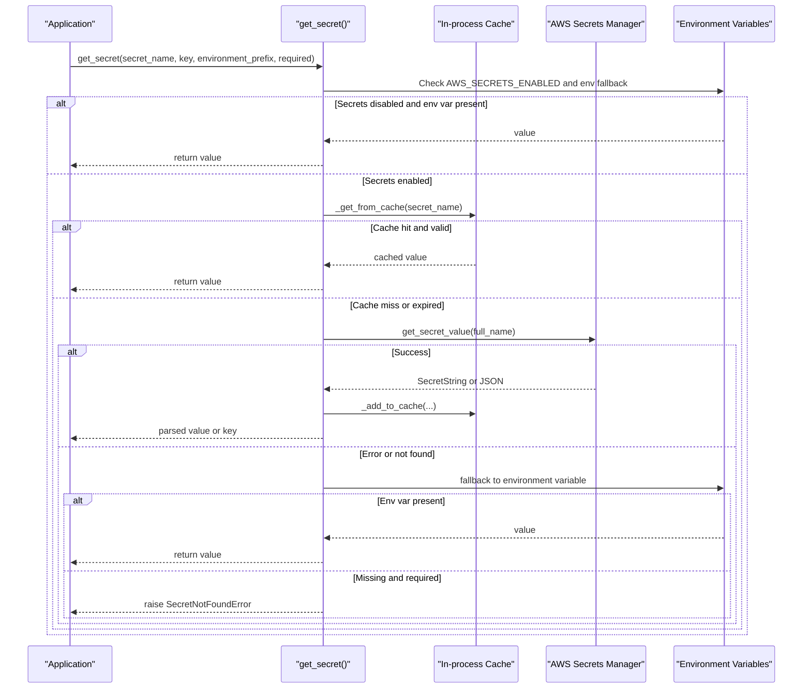
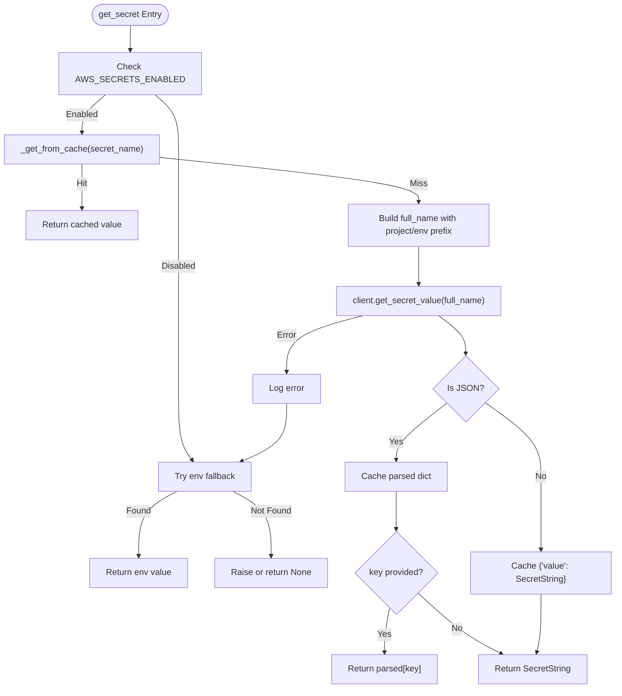
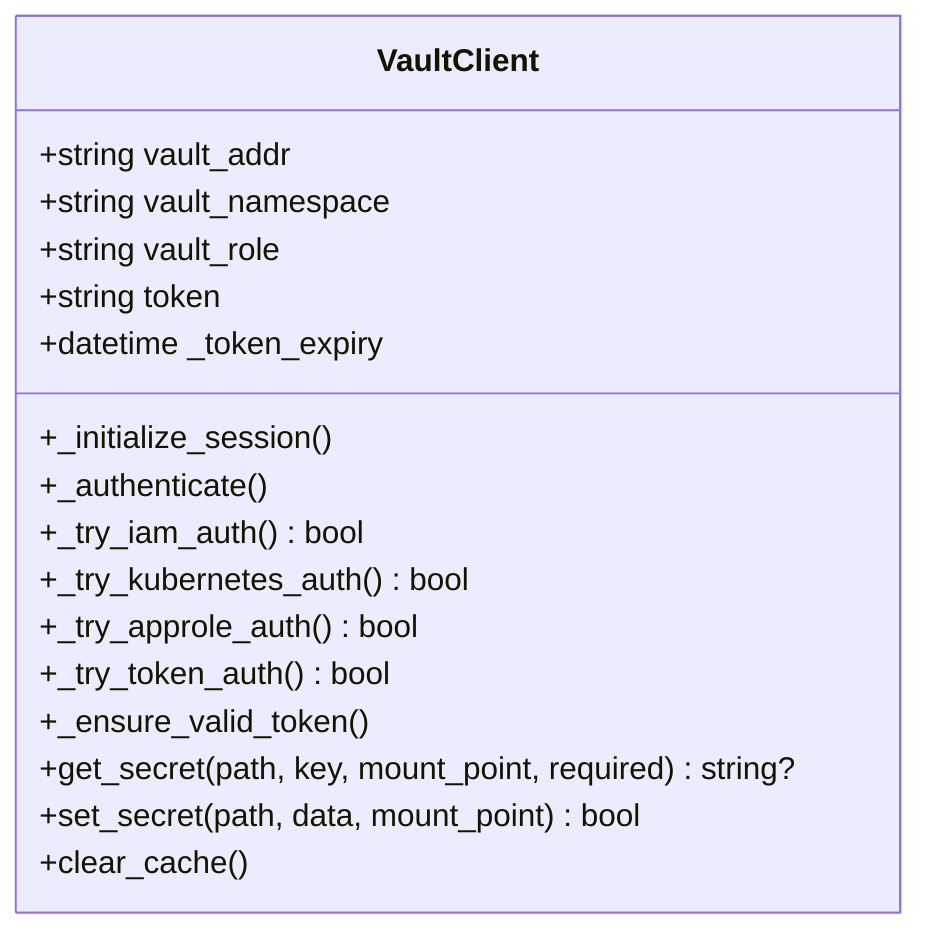
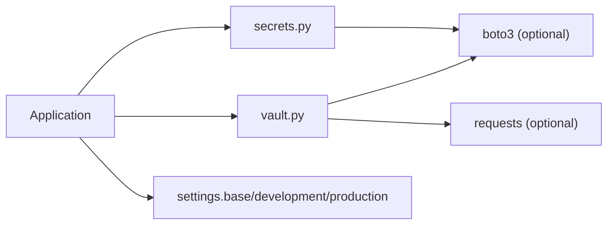

# Secrets Management

<cite>
**Referenced Files in This Document**
- [secrets.py](file://backend/django/apps/core/secrets.py)
- [vault.py](file://backend/django/apps/core/vault.py)
- [base.py](file://backend/django/core/settings/base.py)
- [development.py](file://backend/django/core/settings/development.py)
- [production.py](file://backend/django/core/settings/production.py)
- [README.md](file://README.md)
</cite>

## Table of Contents
1. Introduction
2. Project Structure
3. Core Components
4. Architecture Overview
5. Detailed Component Analysis
6. Dependency Analysis
7. Performance Considerations
8. Troubleshooting Guide
9. Conclusion
10. Appendices

## Introduction
This document explains the secrets management system used by JOL-HUB, focusing on AWS Secrets Manager integration, environment-scoped secret paths, caching with TTL-based expiration, and fallback to environment variables. It also covers secure loading patterns for database credentials, email SMTP settings, third-party integrations, and application keys, along with IAM role authentication, local development support, error handling, and security best practices.

The system provides:
- A unified get_secret() API that resolves secrets from AWS Secrets Manager or falls back to environment variables.
- Environment-aware path resolution (project/environment/secret-path).
- In-process caching with a 5-minute TTL to reduce AWS calls.
- Helper functions for common secrets such as database URLs, email SMTP, PayPal, Bitrix24, encryption key, Django SECRET_KEY, and NextAuth secret.
- An alternative HashiCorp Vault client with multiple authentication methods and similar fallback behavior.

[No sources needed since this section summarizes without analyzing specific files]

## Project Structure
Secrets-related code is primarily located under backend/django/apps/core/secrets.py, with an alternative implementation in backend/django/apps/core/vault.py. Application configuration lives under backend/django/core/settings/, where environment-specific overrides are applied.

**Diagram sources**
- [secrets.py:100-200](file://backend/django/apps/core/secrets.py#L100-L200)
- [vault.py:293-378](file://backend/django/apps/core/vault.py#L293-L378)
- [base.py:169-186](file://backend/django/core/settings/base.py#L169-L186)
- [development.py:31-50](file://backend/django/core/settings/development.py#L31-L50)
- [production.py:60-66](file://backend/django/core/settings/production.py#L60-L66)

**Section sources**
- [secrets.py:1-418](file://backend/django/apps/core/secrets.py#L1-L418)
- [vault.py:1-459](file://backend/django/apps/core/vault.py#L1-L459)
- [base.py:1-800](file://backend/django/core/settings/base.py#L1-L800)
- [development.py:1-110](file://backend/django/core/settings/development.py#L1-L110)
- [production.py:1-122](file://backend/django/core/settings/production.py#L1-L122)

## Core Components
- AWS Secrets Manager client wrapper:
  - Creates boto3 client with region and retry config.
  - Builds full secret names using project/environment prefix when not already prefixed.
  - Parses JSON secrets and supports key extraction.
  - Caches results with a 5-minute TTL.
  - Falls back to environment variables when AWS is disabled or unavailable.
- Secret helpers:
  - Database URL builder with component fallback.
  - Email SMTP configuration retrieval.
  - PayPal credentials retrieval.
  - Bitrix24 webhook credentials retrieval.
  - Encryption key retrieval with development-time generation.
  - Django SECRET_KEY and NextAuth secret retrieval with development-time generation.
- Vault client (alternative):
  - Supports IAM, Kubernetes, AppRole, and token authentication.
  - Provides KV v2 secret retrieval with cache and environment fallback.
  - Offers set/clear operations and singleton access.

**Section sources**
- [secrets.py:53-76](file://backend/django/apps/core/secrets.py#L53-L76)
- [secrets.py:78-98](file://backend/django/apps/core/secrets.py#L78-L98)
- [secrets.py:100-200](file://backend/django/apps/core/secrets.py#L100-L200)
- [secrets.py:203-386](file://backend/django/apps/core/secrets.py#L203-L386)
- [vault.py:59-126](file://backend/django/apps/core/vault.py#L59-L126)
- [vault.py:293-378](file://backend/django/apps/core/vault.py#L293-L378)

## Architecture Overview
The secrets resolution flow prioritizes:
1. Local environment variable fallback when AWS is disabled or missing credentials.
2. In-process cache lookup with TTL validation.
3. AWS Secrets Manager retrieval with automatic name resolution and JSON parsing.
4. Final environment variable fallback if required.

Vault integration follows a similar pattern but authenticates via IAM/Kubernetes/AppRole/token and retrieves secrets from KV v2.

**Diagram sources**
- [secrets.py:100-200](file://backend/django/apps/core/secrets.py#L100-L200)
- [secrets.py:78-98](file://backend/django/apps/core/secrets.py#L78-L98)

**Section sources**
- [secrets.py:100-200](file://backend/django/apps/core/secrets.py#L100-L200)

## Detailed Component Analysis

### AWS Secrets Manager Integration (secrets.py)
Key behaviors:
- Client creation with region and retries; graceful degradation when boto3 is missing.
- Cache with TTL: entries store value and timestamp; validity checked against current time.
- Name resolution: if secret_name does not start with 'jol-hub/', constructs full_name using PROJECT_NAME and ENVIRONMENT.
- JSON handling: parses SecretString into dict; caches parsed dict; returns requested key or raw string.
- Fallback strategy: when AWS is disabled or errors occur, attempts environment variable fallback based on environment_prefix/key.
- Exceptions: raises SecretNotFoundError when required=True and no value is available; logs detailed errors for invalid requests, parameters, decryption failures.

Helper functions:
- get_database_url(): tries DATABASE_URL from secret or env; otherwise builds URL from DB_* components.
- get_email_credentials(): retrieves host, port, user, password, TLS flag from email/smtp secret or env.
- get_paypal_credentials(): retrieves client_id, client_secret, mode from payments/paypal secret or env.
- get_bitrix24_credentials(): retrieves webhook_url and portal_id from integrations/bitrix24 secret or env.
- get_encryption_key(): retrieves PII_ENCRYPTION_KEY; generates temporary key in development if missing.
- get_django_secret_key(): retrieves SECRET_KEY; generates temporary key in development if missing.
- get_nextauth_secret(): retrieves NEXTAUTH_SECRET; generates temporary key in development if missing.
- clear_cache(): resets in-process cache.
- cached_secret decorator: caches function results with configurable TTL.

**Diagram sources**
- [secrets.py:100-200](file://backend/django/apps/core/secrets.py#L100-L200)
- [secrets.py:78-98](file://backend/django/apps/core/secrets.py#L78-L98)

**Section sources**
- [secrets.py:53-76](file://backend/django/apps/core/secrets.py#L53-L76)
- [secrets.py:78-98](file://backend/django/apps/core/secrets.py#L78-L98)
- [secrets.py:100-200](file://backend/django/apps/core/secrets.py#L100-L200)
- [secrets.py:203-386](file://backend/django/apps/core/secrets.py#L203-L386)

### HashiCorp Vault Integration (vault.py)
Key behaviors:
- Authentication order: IAM role (AWS), Kubernetes service account, AppRole, token (development).
- Session initialization with headers and optional namespace.
- Token renewal near expiry; cache per mount_point/path.
- get_secret(path, key, mount_point, required): fetches KV v2 data, caches, extracts key if provided, returns JSON string for full secret.
- Fallback to environment variables when Vault is unavailable or secret missing.
- set_secret(path, data, mount_point): writes data and clears cache entry.
- Singleton client via get_vault_client().

**Diagram sources**
- [vault.py:59-126](file://backend/django/apps/core/vault.py#L59-L126)
- [vault.py:293-378](file://backend/django/apps/core/vault.py#L293-L378)
- [vault.py:380-425](file://backend/django/apps/core/vault.py#L380-L425)

**Section sources**
- [vault.py:1-459](file://backend/django/apps/core/vault.py#L1-L459)

### Settings and Environment Configuration
- Base settings define defaults for database, email, Redis, logging, and other services.
- Development settings enable debug toolbar, console email backend, and relaxed security for local runs.
- Production settings enforce HTTPS, strict cookies, SSL modes, and optimized rendering/throttling.
- Environment variables influence secret resolution and runtime behavior (e.g., AWS_SECRETS_ENABLED, ENVIRONMENT, PROJECT_NAME).

**Section sources**
- [base.py:169-186](file://backend/django/core/settings/base.py#L169-L186)
- [base.py:419-430](file://backend/django/core/settings/base.py#L419-L430)
- [development.py:31-50](file://backend/django/core/settings/development.py#L31-L50)
- [production.py:60-66](file://backend/django/core/settings/production.py#L60-L66)

## Dependency Analysis
- secrets.py depends on boto3 for AWS Secrets Manager; gracefully degrades when missing.
- vault.py depends on requests and optionally boto3 for IAM auth; degrades when dependencies are missing.
- Settings modules provide environment context and defaults consumed by application code.
- The README outlines environment variables and local setup, including .env usage and security policy.

**Diagram sources**
- [secrets.py:53-76](file://backend/django/apps/core/secrets.py#L53-L76)
- [vault.py:87-126](file://backend/django/apps/core/vault.py#L87-L126)
- [base.py:1-800](file://backend/django/core/settings/base.py#L1-L800)

**Section sources**
- [secrets.py:53-76](file://backend/django/apps/core/secrets.py#L53-L76)
- [vault.py:87-126](file://backend/django/apps/core/vault.py#L87-L126)
- [base.py:1-800](file://backend/django/core/settings/base.py#L1-L800)
- [README.md:294-317](file://README.md#L294-L317)

## Performance Considerations
- In-process cache with 5-minute TTL reduces AWS/Vault calls and improves latency.
- Retry configuration on AWS client mitigates transient network issues.
- Avoid excessive secret churn; group related values in JSON secrets to minimize calls.
- Use helper functions (get_database_url, get_email_credentials) to centralize logic and reuse caching.
- For high-throughput scenarios, consider external caching layers (e.g., Redis) for shared processes.

[No sources needed since this section provides general guidance]

## Troubleshooting Guide
Common issues and resolutions:
- Secret not found:
  - Ensure correct full_name format (project/environment/secret-path) or pass pre-prefixed name.
  - Verify AWS_SECRETS_ENABLED and environment variables are set appropriately.
  - If required=True, expect SecretNotFoundError; handle gracefully in calling code.
- Access denied or invalid request:
  - Check IAM permissions for Secrets Manager read access.
  - Validate region and endpoint configuration.
- Decryption failure:
  - Confirm KMS key permissions and availability.
- Local development:
  - Set AWS_SECRETS_ENABLED=false to bypass AWS and use environment variables.
  - Provide environment variables matching expected keys (e.g., DATABASE_URL, EMAIL_HOST_USER).
- Vault fallback:
  - When Vault is unavailable, ensure environment variables are configured for critical secrets.
  - Check authentication method (IAM/K8s/AppRole/Token) and token expiry.

**Section sources**
- [secrets.py:179-199](file://backend/django/apps/core/secrets.py#L179-L199)
- [vault.py:344-378](file://backend/django/apps/core/vault.py#L344-L378)
- [README.md:294-317](file://README.md#L294-L317)

## Conclusion
JOL-HUB’s secrets management provides a robust, layered approach:
- Primary path through AWS Secrets Manager with environment-aware naming and JSON support.
- Reliable fallback to environment variables for local development and resilience.
- In-process caching with TTL to optimize performance.
- Alternative Vault integration supporting multiple authentication mechanisms.
Adhering to the documented patterns ensures secure, maintainable, and auditable secret handling across environments.

[No sources needed since this section summarizes without analyzing specific files]

## Appendices

### Security Best Practices
- Naming conventions:
  - Use hierarchical paths reflecting domain boundaries (e.g., database/url, email/smtp, payments/paypal, integrations/bitrix24, security/encryption, django/secret-key, frontend/nextauth).
  - Prefix with project/environment when not explicitly provided to isolate scopes.
- Access controls:
  - Restrict IAM policies to least privilege for Secrets Manager read access.
  - Rotate secrets regularly and audit access logs.
- Audit logging:
  - Enable AWS CloudTrail for Secrets Manager API calls.
  - Centralize application logs for secret access events (already logged in secrets.py and vault.py).
- Local development:
  - Disable AWS integration via AWS_SECRETS_ENABLED=false and supply environment variables.
  - Never commit secrets; rely on .env (gitignored) and secrets managers in CI/CD.

**Section sources**
- [secrets.py:100-200](file://backend/django/apps/core/secrets.py#L100-L200)
- [vault.py:293-378](file://backend/django/apps/core/vault.py#L293-L378)
- [README.md:294-317](file://README.md#L294-L317)