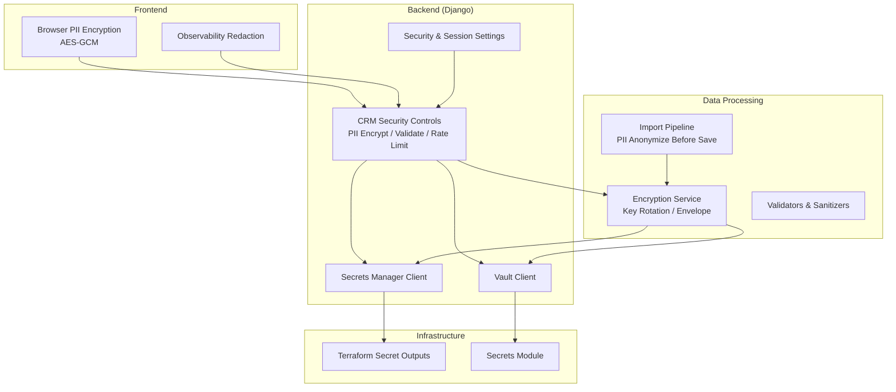
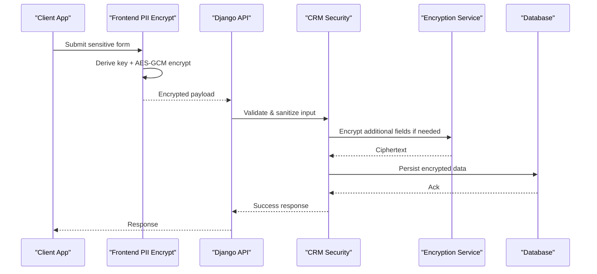
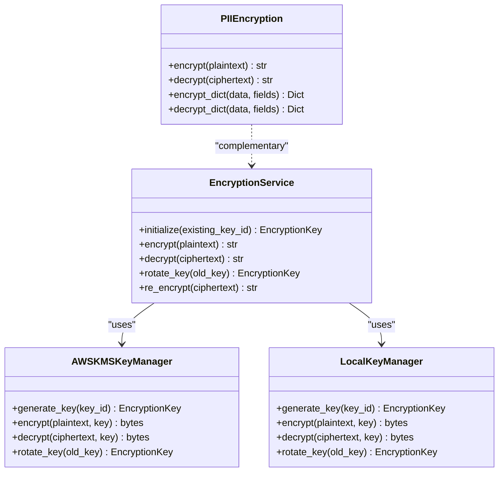
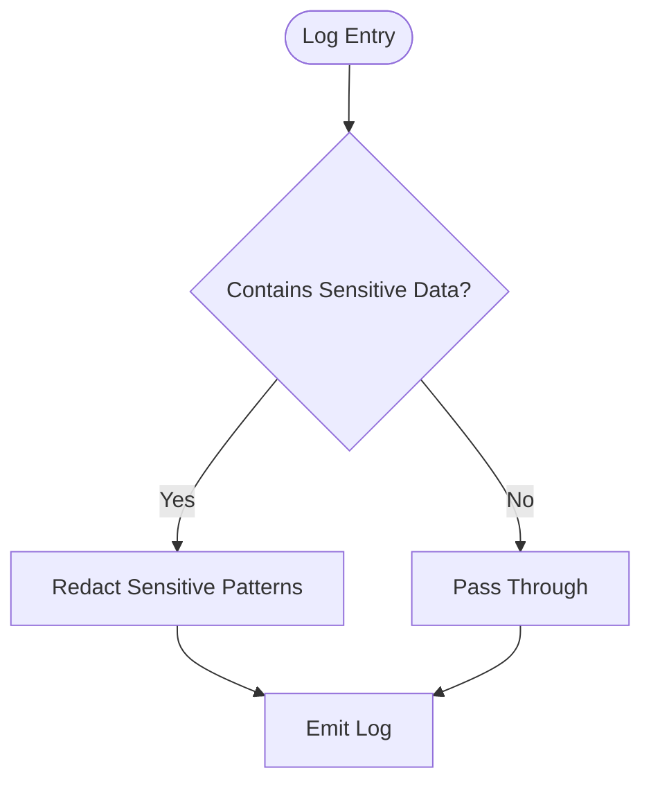
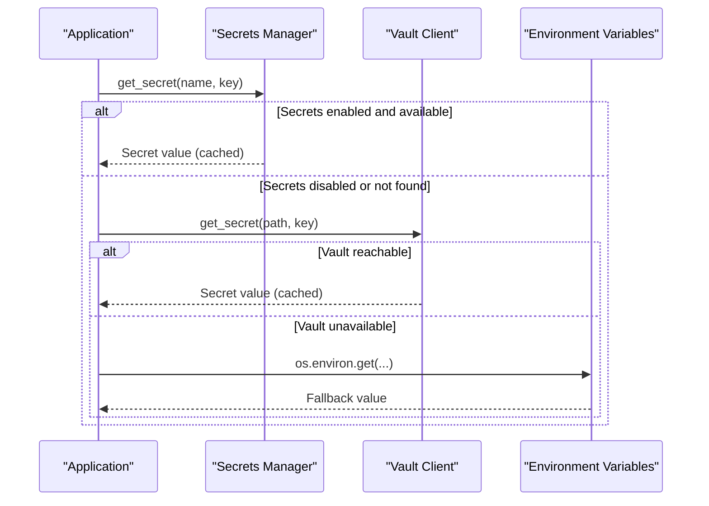
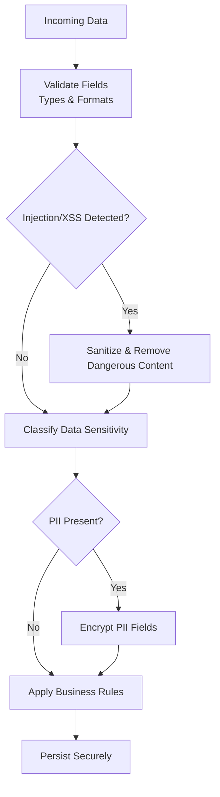
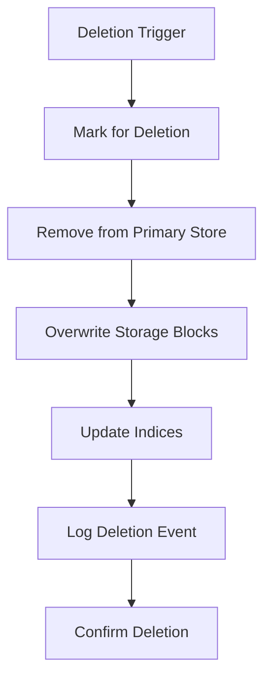
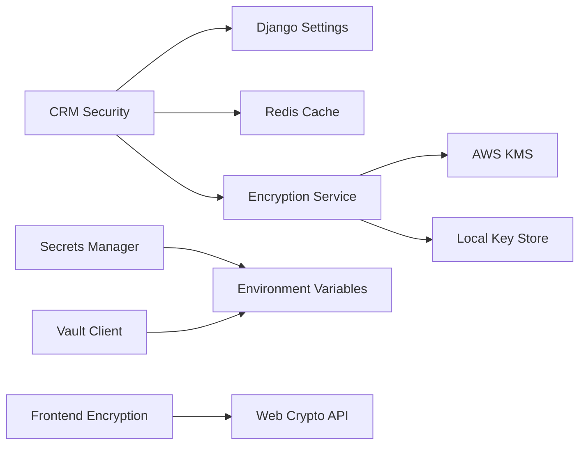

# Secure Data Handling Patterns

<cite>
**Referenced Files in This Document**
- [security-model.md](file://docs/architecture/security-model.md)
- [data-flow.md](file://docs/architecture/data-flow.md)
- [SECURITY.md](file://.github/SECURITY.md)
- [base.py](file://backend/django/core/settings/base.py)
- [secrets.py](file://backend/django/apps/core/secrets.py)
- [vault.py](file://backend/django/apps/core/vault.py)
- [security.py](file://backend/django/apps/crm/security.py)
- [encryption.py](file://data/src/encryption.py)
- [csv_validator.py](file://data/src/pipelines/entity_import/csv_validator.py)
- [pii-encryption.ts](file://frontend/packages/ui/src/lib/pii-encryption.ts)
- [redact.ts](file://frontend/packages/observability/src/redact.ts)
- [outputs.tf](file://infra/terraform/outputs.tf)
- [main.tf](file://infra/terraform/main.tf)
</cite>

## Table of Contents
1. [Introduction](#introduction)
2. [Project Structure](#project-structure)
3. [Core Components](#core-components)
4. [Architecture Overview](#architecture-overview)
5. [Detailed Component Analysis](#detailed-component-analysis)
6. [Dependency Analysis](#dependency-analysis)
7. [Performance Considerations](#performance-considerations)
8. [Troubleshooting Guide](#troubleshooting-guide)
9. [Conclusion](#conclusion)
10. [Appendices](#appendices)

## Introduction
This document describes secure data handling patterns across the JOL-HUB platform for data at rest and in transit, field-level encryption for PII and financial data, secure logging, memory-safe operations, secure deletion, validation and sanitization pipelines, configuration and secret management, and mitigations for common vulnerabilities such as SQL injection, XSS, and CSRF. It synthesizes implementation details from backend Django services, data processing modules, frontend encryption utilities, infrastructure secrets provisioning, and architectural security guidance.

## Project Structure
The secure data handling spans multiple layers:
- Backend Django application: settings, middleware, CRM security controls, secrets integration, and vault client.
- Data processing: encryption service with key lifecycle management, validators, and import pipelines that encrypt PII before persistence.
- Frontend: browser-side AES-GCM encryption for sensitive form fields and redaction utilities for observability logs.
- Infrastructure: Terraform outputs defining secret ARNs and modules for secrets management; environment-specific configuration via settings and secret providers.

**Diagram sources**
- [base.py:515-547](file://backend/django/core/settings/base.py#L515-L547)
- [secrets.py:100-200](file://backend/django/apps/core/secrets.py#L100-L200)
- [vault.py:293-355](file://backend/django/apps/core/vault.py#L293-L355)
- [security.py:38-141](file://backend/django/apps/crm/security.py#L38-L141)
- [encryption.py:346-503](file://data/src/encryption.py#L346-L503)
- [csv_validator.py:276-306](file://data/src/pipelines/entity_import/csv_validator.py#L276-L306)
- [pii-encryption.ts:119-201](file://frontend/packages/ui/src/lib/pii-encryption.ts#L119-L201)
- [redact.ts:55-88](file://frontend/packages/observability/src/redact.ts#L55-L88)
- [outputs.tf:168-225](file://infra/terraform/outputs.tf#L168-L225)
- [main.tf:273-292](file://infra/terraform/main.tf#L273-L292)

**Section sources**
- [security-model.md:110-166](file://docs/architecture/security-model.md#L110-L166)
- [data-flow.md:306-382](file://docs/architecture/data-flow.md#L306-L382)
- [SECURITY.md:49-91](file://.github/SECURITY.md#L49-L91)

## Core Components
- Field-level encryption for PII and sensitive data using Fernet/AES-GCM with key derivation and rotation.
- Pluggable encryption service supporting AWS KMS envelope encryption and local fallback for development.
- Input validation and sanitization to prevent injection and XSS.
- Secrets management via AWS Secrets Manager and HashiCorp Vault with caching and environment fallbacks.
- Browser-side encryption for sensitive form inputs and log redaction to avoid leaking sensitive data.
- Secure session, CSRF, and HTTPS settings in Django configuration.
- Infrastructure-managed secrets with explicit ARN outputs and module-based provisioning.

**Section sources**
- [security.py:38-141](file://backend/django/apps/crm/security.py#L38-L141)
- [encryption.py:27-52](file://data/src/encryption.py#L27-L52)
- [encryption.py:104-243](file://data/src/encryption.py#L104-L243)
- [encryption.py:346-503](file://data/src/encryption.py#L346-L503)
- [base.py:515-547](file://backend/django/core/settings/base.py#L515-L547)
- [secrets.py:100-200](file://backend/django/apps/core/secrets.py#L100-L200)
- [vault.py:293-355](file://backend/django/apps/core/vault.py#L293-L355)
- [pii-encryption.ts:119-201](file://frontend/packages/ui/src/lib/pii-encryption.ts#L119-L201)
- [redact.ts:55-88](file://frontend/packages/observability/src/redact.ts#L55-L88)
- [outputs.tf:168-225](file://infra/terraform/outputs.tf#L168-L225)

## Architecture Overview
Secure data flows through layered protections:
- In transit: TLS enforced by Django security settings and HSTS; internal service mesh encryption per architecture guidance.
- At rest: Database TDE, encrypted storage, and field-level encryption for sensitive columns; envelope encryption via KMS where applicable.
- Key management: Centralized via AWS Secrets Manager or Vault; automatic rotation and versioning; environment-specific injection.
- Validation and sanitization: Multi-layer checks at API boundaries and data pipelines; allowlist patterns and injection detection.
- Observability: Redaction of sensitive values in logs and telemetry; audit trails for access and changes.

**Diagram sources**
- [pii-encryption.ts:119-201](file://frontend/packages/ui/src/lib/pii-encryption.ts#L119-L201)
- [security.py:148-311](file://backend/django/apps/crm/security.py#L148-L311)
- [encryption.py:414-503](file://data/src/encryption.py#L414-L503)

## Detailed Component Analysis

### Field-Level Encryption for PII and Financial Data
- Backend CRM provides a PIIEncryption class using Fernet (AES-128-CBC) with key derivation from Django SECRET_KEY and fixed salt for consistency. It supports encrypt/decrypt for strings and bulk dict operations.
- Data processing layer offers an EncryptionService with pluggable key managers:
  - AWS KMS envelope encryption using AES-256-GCM with nonce and key ID embedded in ciphertext; plaintext keys are securely cleared after use.
  - LocalKeyManager for development using Fernet with file-backed key store and restrictive permissions.
  - Automatic key rotation with versioning and re-encryption support.
- Import pipeline anonymizes PII prior to persistence by encrypting designated columns using the encryption service.

**Diagram sources**
- [security.py:38-141](file://backend/django/apps/crm/security.py#L38-L141)
- [encryption.py:104-243](file://data/src/encryption.py#L104-L243)
- [encryption.py:246-343](file://data/src/encryption.py#L246-L343)
- [encryption.py:346-503](file://data/src/encryption.py#L346-L503)

**Section sources**
- [security.py:38-141](file://backend/django/apps/crm/security.py#L38-L141)
- [encryption.py:104-243](file://data/src/encryption.py#L104-L243)
- [encryption.py:246-343](file://data/src/encryption.py#L246-L343)
- [encryption.py:346-503](file://data/src/encryption.py#L346-L503)
- [csv_validator.py:276-306](file://data/src/pipelines/entity_import/csv_validator.py#L276-L306)

### Secure Logging and Memory Management
- Frontend observability includes a redaction utility that protects traceability identifiers while replacing sensitive patterns with placeholders to avoid accidental exposure in logs.
- Backend logging configuration uses rotating file handlers and structured formats; ensure no sensitive payloads are logged by design.
- Encryption service clears plaintext keys from memory after use in KMS path to reduce exposure windows.

**Diagram sources**
- [redact.ts:55-88](file://frontend/packages/observability/src/redact.ts#L55-L88)
- [base.py:439-513](file://backend/django/core/settings/base.py#L439-L513)
- [encryption.py:177-226](file://data/src/encryption.py#L177-L226)

**Section sources**
- [redact.ts:55-88](file://frontend/packages/observability/src/redact.ts#L55-L88)
- [base.py:439-513](file://backend/django/core/settings/base.py#L439-L513)
- [encryption.py:177-226](file://data/src/encryption.py#L177-L226)

### Secure Configuration and Secret Injection
- Django settings centralize security posture: HTTPS redirects, HSTS, session cookie flags, CSRF protection, X-Frame-Options, and CORS policies.
- Secrets retrieval supports AWS Secrets Manager with TTL-based caching and environment variable fallback; dedicated helpers for database URLs, email credentials, PayPal, Bitrix24, encryption keys, Django secret key, and NextAuth secret.
- Vault client supports IAM, Kubernetes, AppRole, and token authentication with automatic token renewal and secret caching; falls back to environment variables when unavailable.
- Infrastructure defines secret ARNs and modules for secrets provisioning, enabling deployment-time injection into environments.

**Diagram sources**
- [secrets.py:100-200](file://backend/django/apps/core/secrets.py#L100-L200)
- [vault.py:293-355](file://backend/django/apps/core/vault.py#L293-L355)
- [base.py:515-547](file://backend/django/core/settings/base.py#L515-L547)
- [outputs.tf:168-225](file://infra/terraform/outputs.tf#L168-L225)
- [main.tf:273-292](file://infra/terraform/main.tf#L273-L292)

**Section sources**
- [base.py:515-547](file://backend/django/core/settings/base.py#L515-L547)
- [secrets.py:100-200](file://backend/django/apps/core/secrets.py#L100-L200)
- [vault.py:293-355](file://backend/django/apps/core/vault.py#L293-L355)
- [outputs.tf:168-225](file://infra/terraform/outputs.tf#L168-L225)
- [main.tf:273-292](file://infra/terraform/main.tf#L273-L292)

### Secure Validation, Sanitization, and Transformation Pipelines
- CRM InputValidator enforces email and phone normalization, HTML tag removal, control character stripping, length limits, and pattern-based detection for SQL injection and XSS.
- Data validators implement GDPR-aware checks for sensitive categories, required fields, type validation, and quality rules; donation and user validators add domain-specific constraints.
- Import pipeline anonymizes PII columns before insertion by encrypting them using the encryption service, ensuring data is never persisted in plaintext.

**Diagram sources**
- [security.py:148-311](file://backend/django/apps/crm/security.py#L148-L311)
- [validators.py:75-199](file://data/src/validators.py#L75-L199)
- [csv_validator.py:276-306](file://data/src/pipelines/entity_import/csv_validator.py#L276-L306)

**Section sources**
- [security.py:148-311](file://backend/django/apps/crm/security.py#L148-L311)
- [validators.py:75-199](file://data/src/validators.py#L75-L199)
- [csv_validator.py:276-306](file://data/src/pipelines/entity_import/csv_validator.py#L276-L306)

### Secure Deletion and Retention
- Data flow documentation outlines retention policies and secure deletion procedures: marking for deletion, removing from primary stores, overwriting storage, updating indices, logging deletion events, and confirming completion.
- Archival process ensures extraction, compression, encryption, transfer, verification, and deletion of originals.

**Diagram sources**
- [data-flow.md:306-382](file://docs/architecture/data-flow.md#L306-L382)

**Section sources**
- [data-flow.md:306-382](file://docs/architecture/data-flow.md#L306-L382)

### API Communication Security
- Django security settings enforce HTTPS redirection, HSTS, secure session cookies, CSRF protection, and frame options.
- Architecture guidance specifies TLS 1.3 for external communication, minimum TLS 1.2 internally, HSTS, certificate pinning for mobile apps, and perfect forward secrecy cipher suites.
- Rate limiting is configured per endpoint category to mitigate abuse on sensitive operations.

**Section sources**
- [base.py:515-547](file://backend/django/core/settings/base.py#L515-L547)
- [security-model.md:110-166](file://docs/architecture/security-model.md#L110-L166)
- [base.py:282-327](file://backend/django/core/settings/base.py#L282-L327)

### Vulnerability Mitigations
- SQL injection prevention: InputValidator detects suspicious SQL patterns and removes dangerous content; architecture guidance mandates parameterized queries.
- XSS prevention: InputValidator strips HTML tags and control characters; architecture guidance recommends CSP and output encoding.
- CSRF protection: Django CSRF middleware and cookie settings; architecture guidance emphasizes SameSite cookies and CSRF tokens.
- Authentication and authorization: JWT short lifetimes, MFA, RBAC; rate limiting for auth endpoints.

**Section sources**
- [security.py:169-291](file://backend/django/apps/crm/security.py#L169-L291)
- [security-model.md:110-166](file://docs/architecture/security-model.md#L110-L166)
- [SECURITY.md:49-91](file://.github/SECURITY.md#L49-L91)

## Dependency Analysis
Key dependencies and relationships:
- CRM security depends on Django settings for SECRET_KEY and cache for rate limiting; integrates with encryption utilities.
- Encryption service abstracts key providers; AWS KMS path requires boto3 and KMS credentials; local path uses Fernet and file system permissions.
- Secrets manager and vault clients provide centralized secret retrieval with caching and environment fallbacks.
- Frontend encryption relies on Web Crypto API; observability redaction runs in browser context.

**Diagram sources**
- [security.py:38-141](file://backend/django/apps/crm/security.py#L38-L141)
- [encryption.py:104-243](file://data/src/encryption.py#L104-L243)
- [encryption.py:246-343](file://data/src/encryption.py#L246-L343)
- [secrets.py:100-200](file://backend/django/apps/core/secrets.py#L100-L200)
- [vault.py:293-355](file://backend/django/apps/core/vault.py#L293-L355)
- [pii-encryption.ts:119-201](file://frontend/packages/ui/src/lib/pii-encryption.ts#L119-L201)

**Section sources**
- [security.py:38-141](file://backend/django/apps/crm/security.py#L38-L141)
- [encryption.py:104-243](file://data/src/encryption.py#L104-L243)
- [encryption.py:246-343](file://data/src/encryption.py#L246-L343)
- [secrets.py:100-200](file://backend/django/apps/core/secrets.py#L100-L200)
- [vault.py:293-355](file://backend/django/apps/core/vault.py#L293-L355)
- [pii-encryption.ts:119-201](file://frontend/packages/ui/src/lib/pii-encryption.ts#L119-L201)

## Performance Considerations
- Use envelope encryption with KMS to minimize cryptographic overhead; cache data keys briefly and clear plaintext keys promptly.
- Apply rate limiting per tenant/user/IP to protect sensitive endpoints without impacting overall throughput.
- Prefer server-side encryption for large datasets; batch operations should be designed to minimize memory footprint and avoid retaining plaintext longer than necessary.
- Configure Redis cache timeouts appropriately for rate limiting and secret caches to balance freshness and performance.

[No sources needed since this section provides general guidance]

## Troubleshooting Guide
Common issues and mitigations:
- Decryption failures due to invalid tokens or missing keys: Ensure correct key IDs and provider configuration; verify key rotation status and availability.
- Secrets not found: Check AWS Secrets Manager paths, IAM permissions, and environment fallbacks; confirm Vault connectivity and token validity.
- Validation errors blocking imports: Review validator rules and adjust allowlists or thresholds; inspect detected injection patterns and sanitize accordingly.
- Excessive rate limit rejections: Tune limits per endpoint category; monitor cache metrics and adjust burst sizes.

**Section sources**
- [security.py:85-105](file://backend/django/apps/crm/security.py#L85-L105)
- [encryption.py:436-468](file://data/src/encryption.py#L436-L468)
- [secrets.py:150-200](file://backend/django/apps/core/secrets.py#L150-L200)
- [vault.py:325-355](file://backend/django/apps/core/vault.py#L325-L355)
- [validators.py:156-199](file://data/src/validators.py#L156-L199)

## Conclusion
JOL-HUB implements comprehensive secure data handling across its stack:
- Field-level encryption with robust key management and rotation.
- Strong API security posture with TLS, HSTS, CSRF, and rate limiting.
- Centralized secrets management via AWS Secrets Manager and Vault with environment fallbacks.
- Multi-layer validation and sanitization to prevent injection and XSS.
- Secure logging and memory practices to minimize sensitive data exposure.
- Clear retention and deletion procedures aligned with compliance requirements.

Adhering to these patterns ensures confidentiality, integrity, and availability of sensitive data throughout its lifecycle.

[No sources needed since this section summarizes without analyzing specific files]

## Appendices

### Best Practices Checklist
- Encrypt PII and financial data at rest using field-level encryption; prefer envelope encryption with KMS in production.
- Enforce TLS 1.3 for all external communications; enable HSTS and secure session cookies.
- Use centralized secret management; never hardcode credentials; rotate keys regularly.
- Validate and sanitize all inputs; apply allowlists and detect injection patterns.
- Redact sensitive data in logs and telemetry; mask PII in error messages.
- Implement secure deletion workflows with overwrite and audit logging.
- Apply rate limiting and CSRF protections on sensitive endpoints.

[No sources needed since this section provides general guidance]