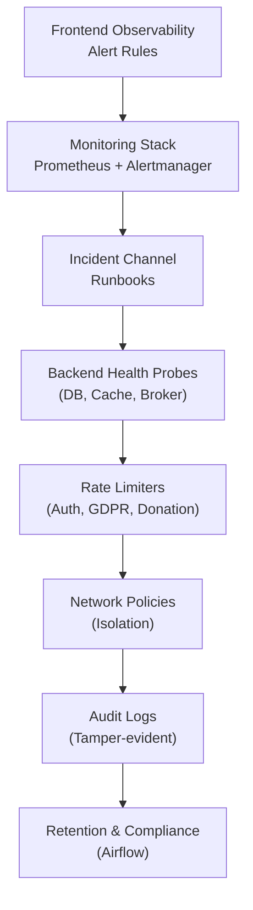
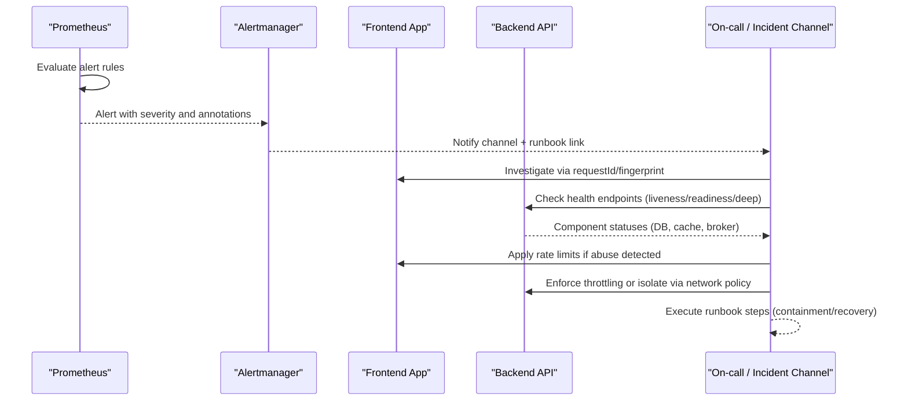
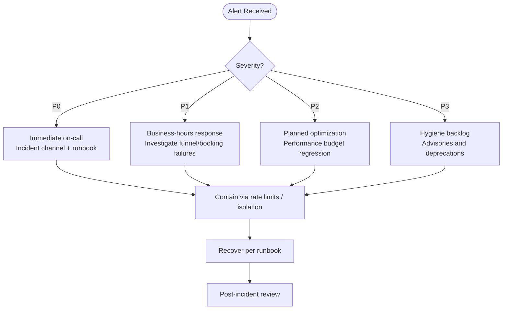
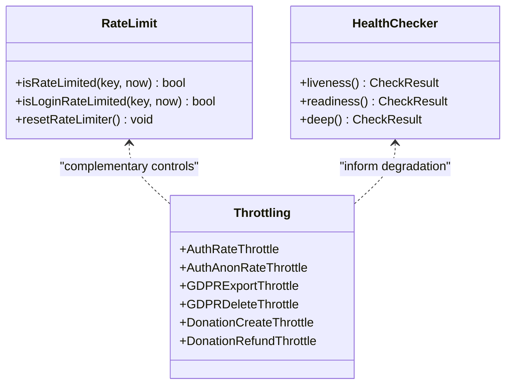
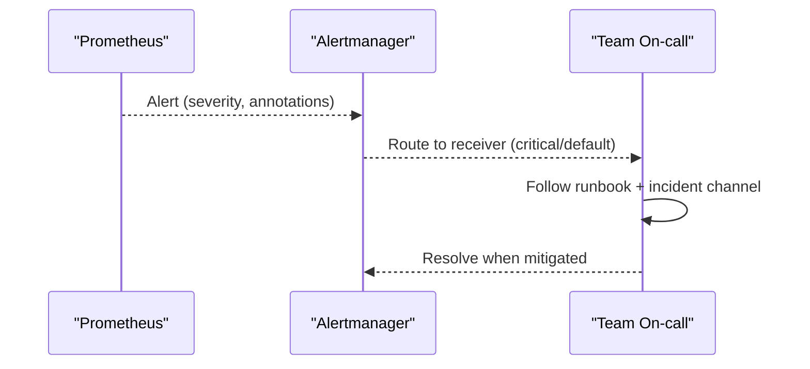
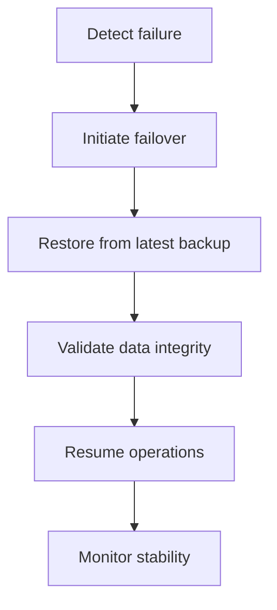
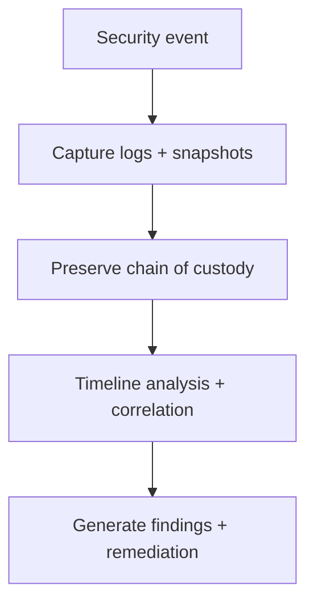
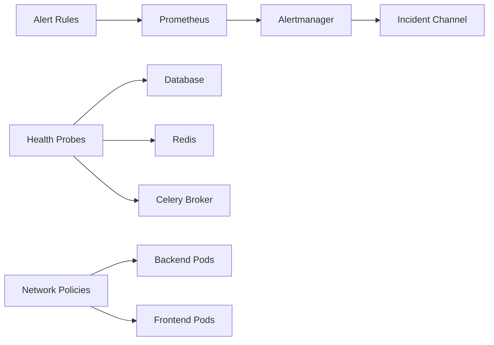

# Incident Response & Recovery

<cite>
**Referenced Files in This Document**
- [security-model.md](file://docs/architecture/security-model.md)
- [OBSERVABILITY.md](file://frontend/apps/template-renderer/OBSERVABILITY.md)
- [alert-rules.yml](file://frontend/apps/template-renderer/observability/alert-rules.yml)
- [rate-limit.ts](file://frontend/apps/template-renderer/src/lib/rate-limit.ts)
- [throttling.py](file://backend/django/apps/core/throttling.py)
- [models.py](file://backend/django/apps/core/models.py)
- [health.py](file://backend/django/apps/core/health.py)
- [network-policy.yaml](file://infra/kubernetes/networking/network-policy.yaml)
- [rules.yaml.tpl](file://infra/terraform/modules/monitoring/templates/rules.yaml.tpl)
- [alertmanager.yaml.tpl](file://infra/terraform/modules/monitoring/templates/alertmanager.yaml.tpl)
- [main.tf (database)](file://infra/terraform/modules/database/main.tf)
- [jol_hub_etl.py](file://data/airflow/dags/jol_hub_etl.py)
- [system-overview.md](file://docs/architecture/system-overview.md)
</cite>

## Table of Contents
1. Introduction
2. Project Structure
3. Core Components
4. Architecture Overview
5. Detailed Component Analysis
6. Dependency Analysis
7. Performance Considerations
8. Troubleshooting Guide
9. Conclusion
10. Appendices

## Introduction
This document provides incident response and recovery procedures for the JOL-HUB platform. It defines a security incident classification framework, automated detection and containment mechanisms, escalation protocols, disaster recovery and business continuity plans, forensic analysis and evidence preservation, and regulatory notification requirements. It also includes practical examples for responding to common incidents, executing recovery steps, and conducting post-incident reviews.

## Project Structure
JOL-HUB implements incident response across multiple layers:
- Frontend observability and alerting with severity-labeled rules and runbook links
- Backend rate limiting and health probes to detect and contain issues early
- Kubernetes network policies to isolate services during incidents
- Infrastructure monitoring templates that route alerts and define thresholds
- Data retention and compliance automation via Airflow and audit logging
- Disaster recovery targets defined in architecture documentation

**Diagram sources**
- [alert-rules.yml:1-144](file://frontend/apps/template-renderer/observability/alert-rules.yml#L1-L144)
- [alertmanager.yaml.tpl:1-24](file://infra/terraform/modules/monitoring/templates/alertmanager.yaml.tpl#L1-L24)
- [health.py:39-127](file://backend/django/apps/core/health.py#L39-L127)
- [throttling.py:15-77](file://backend/django/apps/core/throttling.py#L15-L77)
- [network-policy.yaml:18-188](file://infra/kubernetes/networking/network-policy.yaml#L18-L188)
- [models.py:67-151](file://backend/django/apps/core/models.py#L67-L151)
- [jol_hub_etl.py:44-70](file://data/airflow/dags/jol_hub_etl.py#L44-L70)

**Section sources**
- [alert-rules.yml:1-144](file://frontend/apps/template-renderer/observability/alert-rules.yml#L1-L144)
- [OBSERVABILITY.md:70-105](file://frontend/apps/template-renderer/OBSERVABILITY.md#L70-L105)
- [health.py:39-127](file://backend/django/apps/core/health.py#L39-L127)
- [network-policy.yaml:18-188](file://infra/kubernetes/networking/network-policy.yaml#L18-L188)
- [models.py:67-151](file://backend/django/apps/core/models.py#L67-L151)
- [jol_hub_etl.py:44-70](file://data/airflow/dags/jol_hub_etl.py#L44-L70)

## Core Components
- Security incident classification and response process are defined in the security model, including severity levels and response timelines.
- Automated detection is implemented through frontend Prometheus alert rules and backend health probes.
- Containment is enforced via rate limiters at both frontend and backend layers and Kubernetes network policies.
- Forensics and evidence are supported by tamper-evident audit logs and structured log retention policies.
- Disaster recovery objectives and multi-region strategy are documented in system overview and security model.

**Section sources**
- [security-model.md:350-418](file://docs/architecture/security-model.md#L350-L418)
- [alert-rules.yml:18-144](file://frontend/apps/template-renderer/observability/alert-rules.yml#L18-L144)
- [health.py:55-127](file://backend/django/apps/core/health.py#L55-L127)
- [rate-limit.ts:1-89](file://frontend/apps/template-renderer/src/lib/rate-limit.ts#L1-L89)
- [throttling.py:15-77](file://backend/django/apps/core/throttling.py#L15-L77)
- [network-policy.yaml:18-188](file://infra/kubernetes/networking/network-policy.yaml#L18-L188)
- [models.py:67-151](file://backend/django/apps/core/models.py#L67-L151)
- [system-overview.md:205-217](file://docs/architecture/system-overview.md#L205-L217)

## Architecture Overview
The incident response pipeline integrates detection, triage, containment, and recovery:
- Detection: Prometheus rules evaluate error rates, HTTP 5xx spikes, auth service health, and performance regressions; backend health endpoints expose component status.
- Triage: Alerts include severity labels and runbook links; on-call correlates using request IDs and fingerprints.
- Containment: Rate limiters block abusive traffic; network policies restrict lateral movement; health probes remove unhealthy pods from load balancers.
- Recovery: Automated failover and backups support RTO/RPO targets; restoration tested regularly.

**Diagram sources**
- [alert-rules.yml:18-144](file://frontend/apps/template-renderer/observability/alert-rules.yml#L18-L144)
- [alertmanager.yaml.tpl:1-24](file://infra/terraform/modules/monitoring/templates/alertmanager.yaml.tpl#L1-L24)
- [health.py:55-127](file://backend/django/apps/core/health.py#L55-L127)
- [rate-limit.ts:34-82](file://frontend/apps/template-renderer/src/lib/rate-limit.ts#L34-L82)
- [network-policy.yaml:18-188](file://infra/kubernetes/networking/network-policy.yaml#L18-L188)

## Detailed Component Analysis

### Security Incident Classification Framework
- Severity ladder: P0 (page), P1 (business), P2 (performance), P3 (warning).
- Response times and escalation paths are defined per severity level.
- Detection rules cover authentication anomalies, application errors, infrastructure metrics, and security advisories.

**Diagram sources**
- [alert-rules.yml:18-144](file://frontend/apps/template-renderer/observability/alert-rules.yml#L18-L144)
- [security-model.md:350-376](file://docs/architecture/security-model.md#L350-L376)

**Section sources**
- [alert-rules.yml:18-144](file://frontend/apps/template-renderer/observability/alert-rules.yml#L18-L144)
- [security-model.md:350-376](file://docs/architecture/security-model.md#L350-L376)

### Automated Incident Detection and Containment
- Frontend rate limiting protects against brute-force login attempts and general abuse with bounded memory usage.
- Backend throttling enforces per-user and per-IP limits for sensitive endpoints (auth, GDPR export/delete, donations).
- Health probes provide liveness/readiness/deep checks to remove unhealthy pods and signal degraded states.
- Network policies enforce strict ingress/egress rules to isolate components during incidents.

**Diagram sources**
- [rate-limit.ts:1-89](file://frontend/apps/template-renderer/src/lib/rate-limit.ts#L1-L89)
- [throttling.py:15-77](file://backend/django/apps/core/throttling.py#L15-L77)
- [health.py:39-127](file://backend/django/apps/core/health.py#L39-L127)

**Section sources**
- [rate-limit.ts:1-89](file://frontend/apps/template-renderer/src/lib/rate-limit.ts#L1-L89)
- [throttling.py:15-77](file://backend/django/apps/core/throttling.py#L15-L77)
- [health.py:39-127](file://backend/django/apps/core/health.py#L39-L127)
- [network-policy.yaml:18-188](file://infra/kubernetes/networking/network-policy.yaml#L18-L188)

### Escalation Protocols
- P0 alerts trigger immediate on-call response with runbook links and incident channel notifications.
- Escalation targets include platform teams for auth outages and frontend teams for error spikes.
- Alertmanager routes critical alerts to dedicated receivers; SNS topics notify stakeholders.

**Diagram sources**
- [alertmanager.yaml.tpl:1-24](file://infra/terraform/modules/monitoring/templates/alertmanager.yaml.tpl#L1-L24)
- [alert-rules.yml:18-144](file://frontend/apps/template-renderer/observability/alert-rules.yml#L18-L144)

**Section sources**
- [alertmanager.yaml.tpl:1-24](file://infra/terraform/modules/monitoring/templates/alertmanager.yaml.tpl#L1-L24)
- [alert-rules.yml:18-144](file://frontend/apps/template-renderer/observability/alert-rules.yml#L18-L144)

### Disaster Recovery and Business Continuity
- Backup strategy includes continuous database backups, point-in-time recovery, geographic redundancy, and regular restoration tests.
- Recovery objectives: RTO under 4 hours, RPO under 15 minutes.
- Multi-region failover strategy supports resilience across primary, secondary, and tertiary sites.

**Diagram sources**
- [system-overview.md:205-217](file://docs/architecture/system-overview.md#L205-L217)
- [security-model.md:543-568](file://docs/architecture/security-model.md#L543-L568)
- [main.tf (database):135-158](file://infra/terraform/modules/database/main.tf#L135-L158)

**Section sources**
- [system-overview.md:205-217](file://docs/architecture/system-overview.md#L205-L217)
- [security-model.md:543-568](file://docs/architecture/security-model.md#L543-L568)
- [main.tf (database):135-158](file://infra/terraform/modules/database/main.tf#L135-L158)

### Forensic Analysis and Evidence Preservation
- Tamper-evident audit logs capture actions with checksums and tenant context validation to prevent cross-tenant contamination.
- Log retention policies classify and retain security and audit logs for required periods.
- Incident response includes snapshotting hosts and correlating logs via request IDs and fingerprints.

**Diagram sources**
- [models.py:67-151](file://backend/django/apps/core/models.py#L67-L151)
- [OBSERVABILITY.md:81-105](file://frontend/apps/template-renderer/OBSERVABILITY.md#L81-L105)

**Section sources**
- [models.py:67-151](file://backend/django/apps/core/models.py#L67-L151)
- [OBSERVABILITY.md:81-105](file://frontend/apps/template-renderer/OBSERVABILITY.md#L81-L105)

### Regulatory Notification Requirements
- GDPR rights handling (access, erasure, portability) and consent management are integrated into core models and workflows.
- Retention and cleanup tasks are automated via Airflow with audit logging for compliance reporting.
- Security logs and audit logs are retained per regulatory requirements to support investigations and audits.

**Section sources**
- [security-model.md:391-418](file://docs/architecture/security-model.md#L391-L418)
- [jol_hub_etl.py:44-70](file://data/airflow/dags/jol_hub_etl.py#L44-L70)
- [OBSERVABILITY.md:81-95](file://frontend/apps/template-renderer/OBSERVABILITY.md#L81-L95)

## Dependency Analysis
- Frontend alert rules depend on Prometheus metrics derived from logs and health probes; they annotate incidents with runbooks and channels.
- Backend health probes depend on database, cache, and Celery broker connectivity; failures impact readiness and deep health status.
- Network policies depend on label-based selectors to allow only authorized ingress/egress flows between components.
- Monitoring templates depend on infrastructure variables to configure alert routing and thresholds.

**Diagram sources**
- [alert-rules.yml:18-144](file://frontend/apps/template-renderer/observability/alert-rules.yml#L18-L144)
- [health.py:55-127](file://backend/django/apps/core/health.py#L55-L127)
- [network-policy.yaml:18-188](file://infra/kubernetes/networking/network-policy.yaml#L18-L188)
- [rules.yaml.tpl:37-115](file://infra/terraform/modules/monitoring/templates/rules.yaml.tpl#L37-L115)

**Section sources**
- [alert-rules.yml:18-144](file://frontend/apps/template-renderer/observability/alert-rules.yml#L18-L144)
- [health.py:55-127](file://backend/django/apps/core/health.py#L55-L127)
- [network-policy.yaml:18-188](file://infra/kubernetes/networking/network-policy.yaml#L18-L188)
- [rules.yaml.tpl:37-115](file://infra/terraform/modules/monitoring/templates/rules.yaml.tpl#L37-L115)

## Performance Considerations
- Rate limiters use fixed-window counters with bounded key maps to prevent memory exhaustion under attack.
- Health probes measure latency and return granular statuses to guide scaling and failover decisions.
- Alert thresholds are tuned to minimize false positives while ensuring timely detection of significant issues.
- Network policies reduce unnecessary traffic and limit blast radius during incidents.

[No sources needed since this section provides general guidance]

## Troubleshooting Guide
Common scenarios and responses:
- High error rate or HTTP 5xx spike:
  - Action: Follow runbook linked in alert; check frontend logs and backend health; apply rate limits if abuse suspected.
- Authentication service down:
  - Action: Verify auth health probe; escalate to platform team; consider fallback flows if available.
- Database connection high or replication lag:
  - Action: Review database alerts; scale connections; investigate replication; engage DBA team.
- Redis memory or connections high:
  - Action: Inspect cache usage; evict stale keys; adjust limits; monitor for leaks.
- Celery queue backlog or workers down:
  - Action: Scale workers; inspect task failures; requeue failed tasks; verify broker connectivity.

**Section sources**
- [alert-rules.yml:18-144](file://frontend/apps/template-renderer/observability/alert-rules.yml#L18-L144)
- [rules.yaml.tpl:37-115](file://infra/terraform/modules/monitoring/templates/rules.yaml.tpl#L37-L115)
- [health.py:55-127](file://backend/django/apps/core/health.py#L55-L127)

## Conclusion
JOL-HUB’s incident response and recovery framework combines layered detection, automated containment, and robust forensics to protect availability, integrity, and confidentiality. Clear severity classifications, runbook-driven responses, and well-defined RTO/RPO targets ensure rapid recovery and continuous improvement through post-incident reviews.

[No sources needed since this section summarizes without analyzing specific files]

## Appendices

### Example: Responding to a Brute-Force Login Attack
- Detection: Frontend login rate limiter triggers after exceeding allowed attempts per window.
- Containment: Return generic 429 responses; do not reveal account existence; log security events.
- Escalation: If sustained, escalate to security team; consider IP blocking upstream.
- Recovery: Reset rate limiter state if necessary; review logs for patterns; update thresholds.

**Section sources**
- [rate-limit.ts:51-82](file://frontend/apps/template-renderer/src/lib/rate-limit.ts#L51-L82)
- [OBSERVABILITY.md:81-95](file://frontend/apps/template-renderer/OBSERVABILITY.md#L81-L95)

### Example: Executing Recovery After Database Outage
- Detection: Health probe reports database unreachable; readiness fails.
- Containment: Remove affected pods from service; route traffic to healthy instances.
- Recovery: Initiate failover to secondary region; restore from latest backup; validate integrity.
- Post-incident: Generate report with timeline and root cause; update runbooks.

**Section sources**
- [health.py:55-127](file://backend/django/apps/core/health.py#L55-L127)
- [system-overview.md:205-217](file://docs/architecture/system-overview.md#L205-L217)
- [security-model.md:543-568](file://docs/architecture/security-model.md#L543-L568)

### Example: Conducting Post-Incident Review and Improvements
- Collect logs, snapshots, and alert timelines.
- Identify gaps in detection or containment.
- Update alert rules, rate limits, and network policies as needed.
- Schedule drills and test recovery procedures regularly.

**Section sources**
- [OBSERVABILITY.md:97-105](file://frontend/apps/template-renderer/OBSERVABILITY.md#L97-L105)
- [security-model.md:593-600](file://docs/architecture/security-model.md#L593-L600)