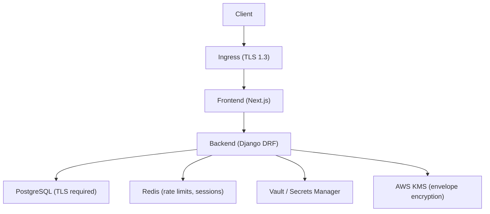
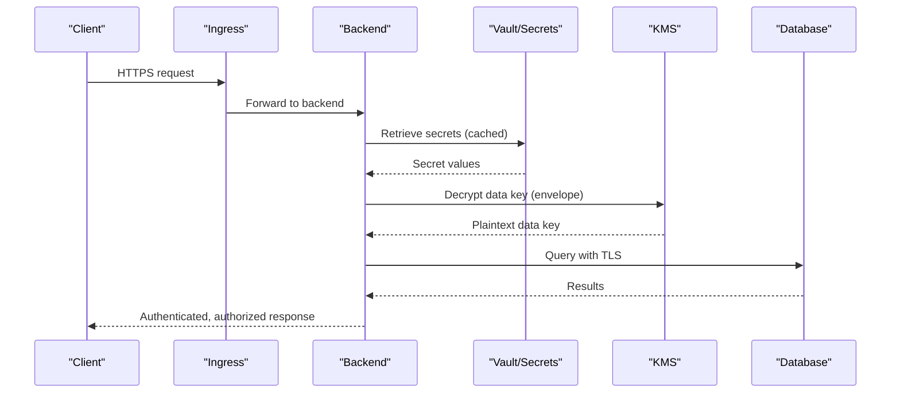
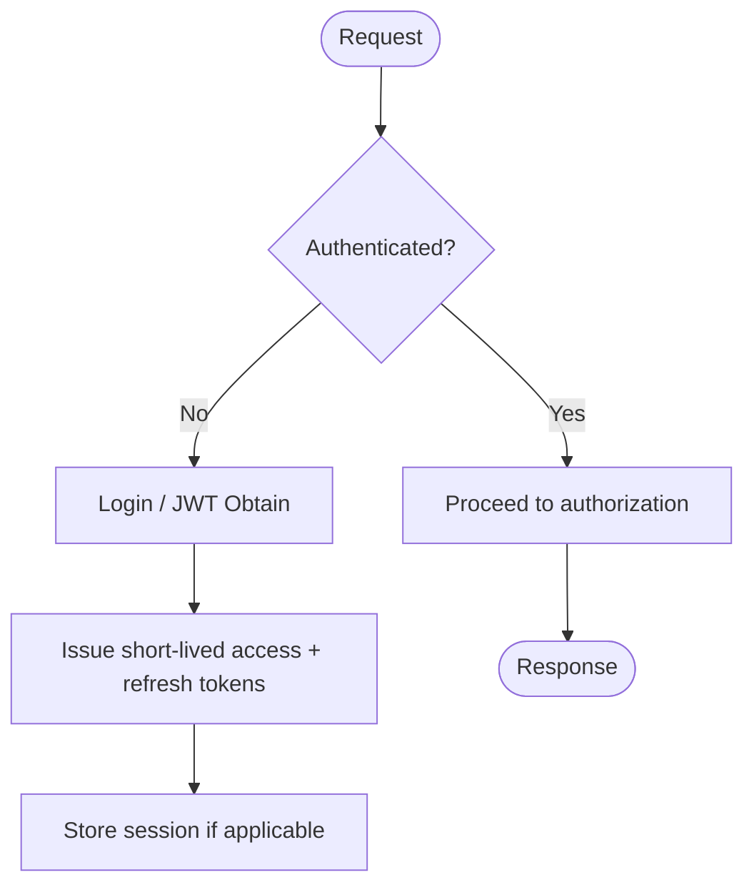
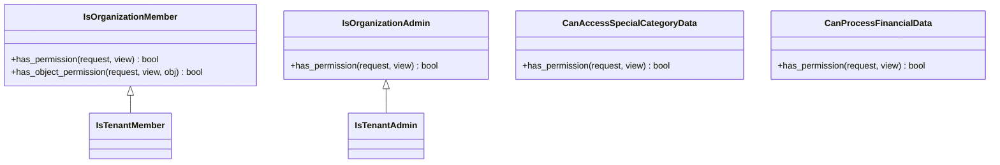
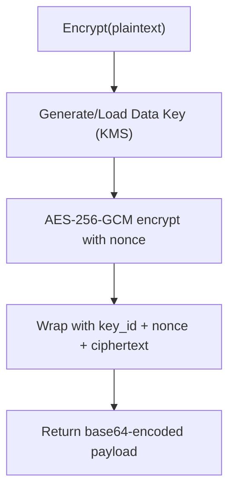
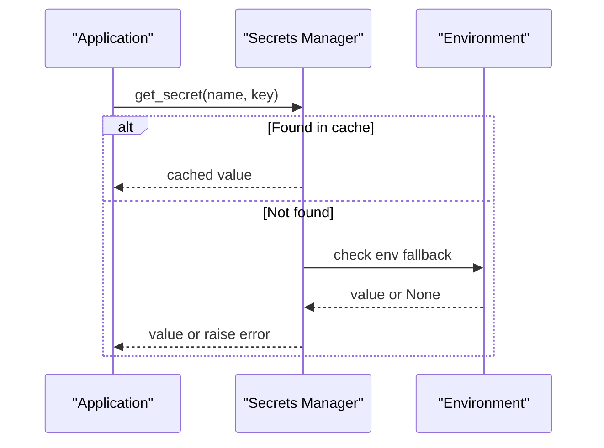
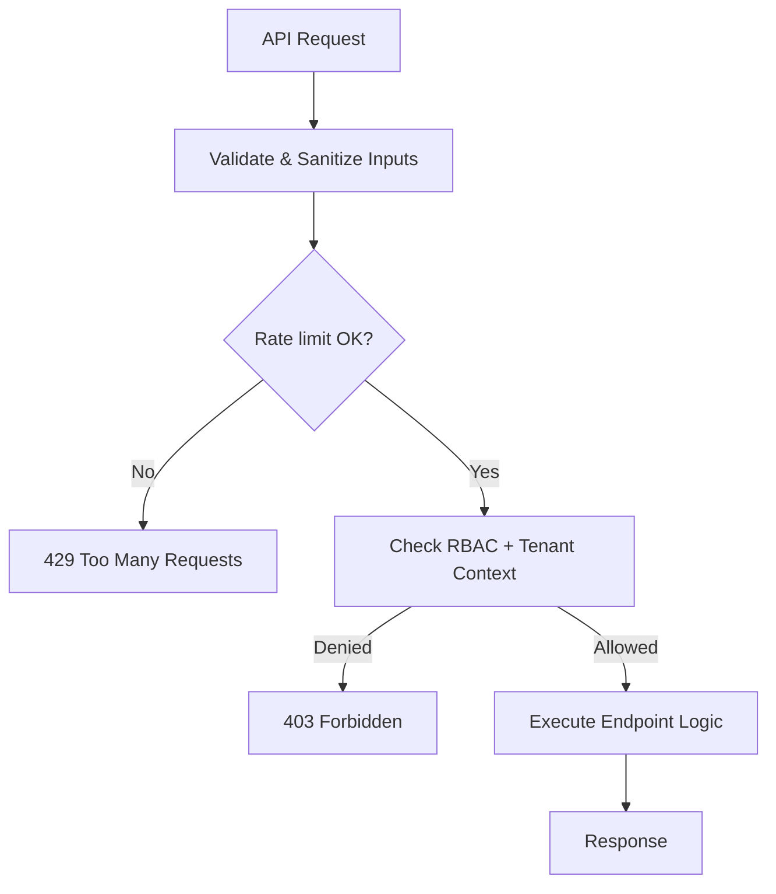
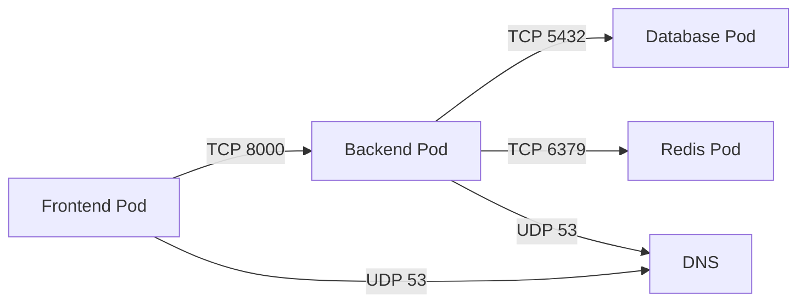
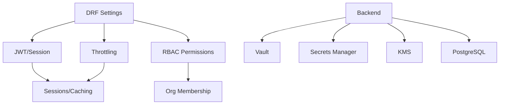

# Security Architecture

<cite>
**Referenced Files in This Document**
- [base.py](file://backend/django/core/settings/base.py)
- [production.py](file://backend/django/core/settings/production.py)
- [permissions.py](file://backend/django/apps/core/permissions.py)
- [models.py](file://backend/django/apps/users/models.py)
- [secrets.py](file://backend/django/apps/core/secrets.py)
- [vault.py](file://backend/django/apps/core/vault.py)
- [encryption.py](file://data/src/encryption.py)
- [security.py](file://backend/django/apps/crm/security.py)
- [throttling.py](file://backend/django/apps/core/throttling.py)
- [security.yaml](file://infra/kubernetes/security/security.yaml)
- [network-policy.yaml](file://infra/kubernetes/networking/network-policy.yaml)
- [security-model.md](file://docs/architecture/security-model.md)
</cite>

## Table of Contents
1. Introduction
2. Project Structure
3. Core Components
4. Architecture Overview
5. Detailed Component Analysis
6. Dependency Analysis
7. Performance Considerations
8. Troubleshooting Guide
9. Conclusion
10. Appendices

## Introduction
This document describes the multi-layered security architecture of JOL-HUB, covering authentication and authorization, encryption at rest and in transit, access control policies, network security, session management, API security, monitoring and metrics, vulnerability scanning, and incident response. It maps concrete implementation details from the codebase to high-level design principles documented in the project’s security model.

## Project Structure
JOL-HUB implements defense-in-depth across application, data, and infrastructure layers:
- Application layer: Django REST Framework with JWT and session auth, RBAC via custom permission classes, rate limiting, input validation, and PII encryption utilities.
- Data layer: Encrypted secrets via AWS Secrets Manager and HashiCorp Vault; envelope encryption with key rotation; field-level PII encryption for CRM data.
- Infrastructure layer: Kubernetes RBAC, Pod Security Standards, NetworkPolicies, External Secrets Operator, cert-manager, and strict TLS enforcement.

**Diagram sources**
- [security.yaml:109-137](file://infra/kubernetes/security/security.yaml#L109-L137)
- [production.py:25-44](file://backend/django/core/settings/production.py#L25-L44)
- [base.py:172-186](file://backend/django/core/settings/base.py#L172-L186)
- [base.py:392-410](file://backend/django/core/settings/base.py#L392-L410)
- [base.py:329-355](file://backend/django/core/settings/base.py#L329-L355)
- [encryption.py:104-243](file://data/src/encryption.py#L104-L243)

**Section sources**
- [security-model.md:30-116](file://docs/architecture/security-model.md#L30-L116)
- [security.yaml:109-137](file://infra/kubernetes/security/security.yaml#L109-L137)
- [production.py:25-44](file://backend/django/core/settings/production.py#L25-L44)

## Core Components
- Authentication and Session Management:
  - Dual support for session-based and JWT authentication with short-lived access tokens and rotating refresh tokens.
  - Secure cookie settings and CSRF protections enforced in production.
- Authorization and RBAC:
  - Organization-scoped permissions with tenant isolation and role checks (member/admin).
  - Specialized permissions for sensitive domains (financial data, special category data).
- Encryption and Key Management:
  - Envelope encryption with AWS KMS or local fallback; automatic key rotation and versioning.
  - Field-level PII encryption using Fernet with derived keys.
  - Centralized secret retrieval via AWS Secrets Manager and HashiCorp Vault with environment fallbacks.
- API Security:
  - Strict throttling for auth, GDPR operations, donations, and refunds.
  - Input validation and sanitization for CRM data.
- Network Security:
  - Kubernetes NetworkPolicies restricting pod-to-pod traffic.
  - TLS enforcement and HSTS in production; cert-manager for certificate lifecycle.

**Section sources**
- [base.py:282-355](file://backend/django/core/settings/base.py#L282-L355)
- [production.py:25-44](file://backend/django/core/settings/production.py#L25-L44)
- [permissions.py:26-203](file://backend/django/apps/core/permissions.py#L26-L203)
- [encryption.py:104-243](file://data/src/encryption.py#L104-L243)
- [security.py:38-142](file://backend/django/apps/crm/security.py#L38-L142)
- [throttling.py:18-76](file://backend/django/apps/core/throttling.py#L18-L76)
- [network-policy.yaml:18-76](file://infra/kubernetes/networking/network-policy.yaml#L18-L76)

## Architecture Overview
The platform enforces zero-trust and least privilege across all layers:
- Edge protection and TLS termination at ingress.
- Application-level authN/authZ with tenant context propagation.
- Data-plane encryption with envelope encryption and centralized key management.
- Infrastructure hardening via Kubernetes RBAC, Pod Security Standards, and NetworkPolicies.

**Diagram sources**
- [security.yaml:109-137](file://infra/kubernetes/security/security.yaml#L109-L137)
- [base.py:329-355](file://backend/django/core/settings/base.py#L329-L355)
- [secrets.py:100-200](file://backend/django/apps/core/secrets.py#L100-L200)
- [vault.py:293-355](file://backend/django/apps/core/vault.py#L293-L355)
- [encryption.py:177-243](file://data/src/encryption.py#L177-L243)
- [production.py:63-66](file://backend/django/core/settings/production.py#L63-L66)

## Detailed Component Analysis

### Authentication and Session Management
- JWT configuration:
  - Access token lifetime: 15 minutes; refresh token lifetime: 7 days; rotation and blacklist enabled.
  - Algorithm HS256; bearer token header configured.
- Session cookies:
  - Secure, HttpOnly, SameSite Lax in production; CSRF protections enabled.
  - Cached database-backed sessions with configurable age.

**Diagram sources**
- [base.py:282-355](file://backend/django/core/settings/base.py#L282-L355)
- [production.py:25-44](file://backend/django/core/settings/production.py#L25-L44)

**Section sources**
- [base.py:282-355](file://backend/django/core/settings/base.py#L282-L355)
- [production.py:25-44](file://backend/django/core/settings/production.py#L25-L44)

### Authorization and RBAC
- Multi-tenant organization membership checks and admin roles enforced via permission classes.
- Tenant context propagated through middleware and headers; cross-tenant access prevented.
- Specialized permissions for financial data and special category data.

**Diagram sources**
- [permissions.py:26-203](file://backend/django/apps/core/permissions.py#L26-L203)
- [permissions.py:221-325](file://backend/django/apps/core/permissions.py#L221-L325)

**Section sources**
- [permissions.py:26-203](file://backend/django/apps/core/permissions.py#L26-L203)
- [permissions.py:221-325](file://backend/django/apps/core/permissions.py#L221-L325)

### Encryption Strategies (At Rest and In Transit)
- In transit:
  - TLS 1.3 enforced at ingress; HSTS enabled in production; database connections require TLS.
- At rest:
  - Envelope encryption with AES-GCM via AWS KMS; local Fernet fallback for development.
  - Automatic key rotation and versioning; plaintext keys cleared from memory after use.
  - Field-level PII encryption for CRM data using Fernet with derived keys.

**Diagram sources**
- [encryption.py:177-243](file://data/src/encryption.py#L177-L243)
- [production.py:25-44](file://backend/django/core/settings/production.py#L25-L44)
- [production.py:63-66](file://backend/django/core/settings/production.py#L63-L66)

**Section sources**
- [encryption.py:104-243](file://data/src/encryption.py#L104-L243)
- [security.py:38-142](file://backend/django/apps/crm/security.py#L38-L142)
- [production.py:25-44](file://backend/django/core/settings/production.py#L25-L44)

### Secret Management
- AWS Secrets Manager integration with TTL caching and environment fallback.
- HashiCorp Vault client supporting IAM, Kubernetes, AppRole, and token auth with automatic renewal.
- Dedicated helpers for database URLs, email credentials, and NextAuth secrets.

**Diagram sources**
- [secrets.py:100-200](file://backend/django/apps/core/secrets.py#L100-L200)
- [vault.py:293-355](file://backend/django/apps/core/vault.py#L293-L355)

**Section sources**
- [secrets.py:100-200](file://backend/django/apps/core/secrets.py#L100-L200)
- [vault.py:293-355](file://backend/django/apps/core/vault.py#L293-L355)

### API Security Patterns
- Throttling:
  - Custom scopes for auth, GDPR export/delete, donation create/refund to prevent abuse.
- Input validation:
  - Email/phone validation, XSS/SQL injection pattern detection, text sanitization.
- Cross-tenant isolation:
  - Decorators and permission classes enforce tenant boundaries.

**Diagram sources**
- [throttling.py:18-76](file://backend/django/apps/core/throttling.py#L18-L76)
- [security.py:148-312](file://backend/django/apps/crm/security.py#L148-L312)
- [permissions.py:26-203](file://backend/django/apps/core/permissions.py#L26-L203)

**Section sources**
- [throttling.py:18-76](file://backend/django/apps/core/throttling.py#L18-L76)
- [security.py:148-312](file://backend/django/apps/crm/security.py#L148-L312)

### Network Security Measures
- Kubernetes NetworkPolicies restrict ingress/egress per component:
  - Backend allows inbound from ingress/frontend on port 8000; egress to database (5432), Redis (6379), DNS (UDP 53).
  - Database and Redis allow only necessary inbound traffic.
- Pod Security Standards applied at namespace level; resource quotas and limit ranges set.

**Diagram sources**
- [network-policy.yaml:18-76](file://infra/kubernetes/networking/network-policy.yaml#L18-L76)
- [network-policy.yaml:115-188](file://infra/kubernetes/networking/network-policy.yaml#L115-L188)

**Section sources**
- [network-policy.yaml:18-76](file://infra/kubernetes/networking/network-policy.yaml#L18-L76)
- [security.yaml:53-62](file://infra/kubernetes/security/security.yaml#L53-L62)

### Monitoring, Metrics, and Observability
- Prometheus metrics endpoint with IP allowlist and optional bearer token.
- Structured logging with rotating file handlers and admin email alerts for errors.
- Celery Beat schedules for session cleanup and recurring tasks.

**Section sources**
- [base.py:439-513](file://backend/django/core/settings/base.py#L439-L513)
- [base.py:676-686](file://backend/django/core/settings/base.py#L676-L686)
- [base.py:373-386](file://backend/django/core/settings/base.py#L373-L386)

### Vulnerability Scanning and Security Testing
- CI security scans integrated into workflows; build gates can be enforced for critical findings.
- SAST/DAST/SCA/container/IaC scanning referenced in the security model.

**Section sources**
- [security-model.md:76-95](file://docs/architecture/security-model.md#L76-L95)
- [security-scan.yml:370-378](file://github/workflows/security-scan.yml#L370-L378)

### Incident Response Procedures
- Defined severity levels and response times; automated evidence preservation and forensic analysis guidance.
- Breach notification workflow aligned with regulatory timelines.

**Section sources**
- [security-model.md:350-453](file://docs/architecture/security-model.md#L350-L453)

## Dependency Analysis
Key dependencies and their security implications:
- Django REST Framework:
  - Default authentication and permission classes centralize security posture.
- Redis:
  - Used for caching and session storage; rate limiting keys stored here.
- PostgreSQL:
  - TLS required in production; connection pooling configured.
- AWS/KMS and Vault:
  - Centralized secrets and encryption key management with robust fallbacks.
- Kubernetes:
  - RBAC, NetworkPolicies, and Pod Security Standards enforce least privilege and micro-segmentation.

**Diagram sources**
- [base.py:282-355](file://backend/django/core/settings/base.py#L282-L355)
- [base.py:392-410](file://backend/django/core/settings/base.py#L392-L410)
- [base.py:172-186](file://backend/django/core/settings/base.py#L172-L186)
- [secrets.py:100-200](file://backend/django/apps/core/secrets.py#L100-L200)
- [vault.py:293-355](file://backend/django/apps/core/vault.py#L293-L355)
- [encryption.py:104-243](file://data/src/encryption.py#L104-L243)

**Section sources**
- [base.py:282-355](file://backend/django/core/settings/base.py#L282-L355)
- [base.py:392-410](file://backend/django/core/settings/base.py#L392-L410)
- [base.py:172-186](file://backend/django/core/settings/base.py#L172-L186)

## Performance Considerations
- Short-lived JWTs reduce exposure window; refresh token rotation mitigates token theft impact.
- Redis-backed sessions and caches improve performance while maintaining security controls.
- Envelope encryption minimizes KMS calls by caching data keys locally with TTL.
- NetworkPolicies reduce unnecessary traffic and attack surface.

[No sources needed since this section provides general guidance]

## Troubleshooting Guide
Common issues and mitigations:
- Missing secrets:
  - Ensure AWS_SECRETS_ENABLED or VAULT_TOKEN is set; verify paths and keys; check environment fallbacks.
- TLS misconfiguration:
  - Confirm SECURE_SSL_REDIRECT and HSTS are enabled in production; validate cert-manager issuers.
- Cross-tenant access violations:
  - Verify tenant context propagation and RBAC rules; audit logs for anomalies.
- Rate limiting triggers:
  - Adjust throttle scopes if legitimate usage spikes; monitor Redis for rate limit keys.

**Section sources**
- [secrets.py:100-200](file://backend/django/apps/core/secrets.py#L100-L200)
- [vault.py:293-355](file://backend/django/apps/core/vault.py#L293-L355)
- [production.py:25-44](file://backend/django/core/settings/production.py#L25-L44)
- [permissions.py:26-203](file://backend/django/apps/core/permissions.py#L26-L203)
- [throttling.py:18-76](file://backend/django/apps/core/throttling.py#L18-L76)

## Conclusion
JOL-HUB employs a comprehensive, layered security architecture that integrates strong authentication, fine-grained authorization, robust encryption, and hardened infrastructure. The combination of JWT/session management, RBAC, envelope encryption, centralized secret management, and Kubernetes network controls ensures compliance with GDPR, SOC2, and ISO 27001 principles while maintaining operational resilience and performance.

[No sources needed since this section summarizes without analyzing specific files]

## Appendices

### Technical Specifications Summary
- Authentication:
  - JWT HS256, 15-minute access tokens, 7-day refresh tokens with rotation and blacklisting.
  - Session cookies: Secure, HttpOnly, SameSite Lax in production.
- Encryption:
  - In transit: TLS 1.3, HSTS enabled.
  - At rest: Envelope encryption with AES-GCM via AWS KMS; local Fernet fallback; field-level PII encryption.
- Key Management:
  - AWS Secrets Manager and HashiCorp Vault with environment fallbacks; automatic token renewal and secret caching.
- Network:
  - Kubernetes NetworkPolicies restrict inter-service communication; Pod Security Standards enforced; resource quotas applied.

**Section sources**
- [base.py:282-355](file://backend/django/core/settings/base.py#L282-L355)
- [production.py:25-44](file://backend/django/core/settings/production.py#L25-L44)
- [encryption.py:104-243](file://data/src/encryption.py#L104-L243)
- [secrets.py:100-200](file://backend/django/apps/core/secrets.py#L100-L200)
- [vault.py:293-355](file://backend/django/apps/core/vault.py#L293-L355)
- [network-policy.yaml:18-76](file://infra/kubernetes/networking/network-policy.yaml#L18-L76)