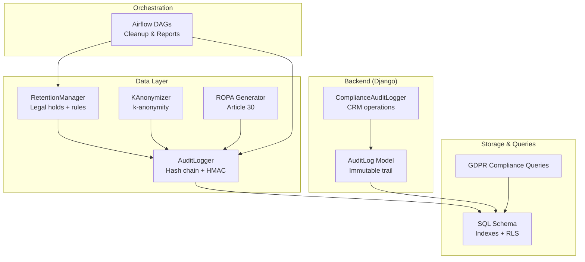
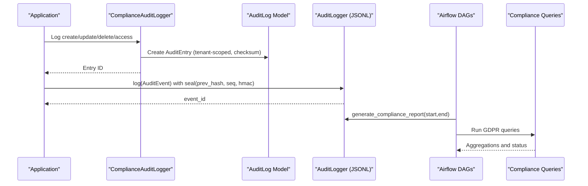
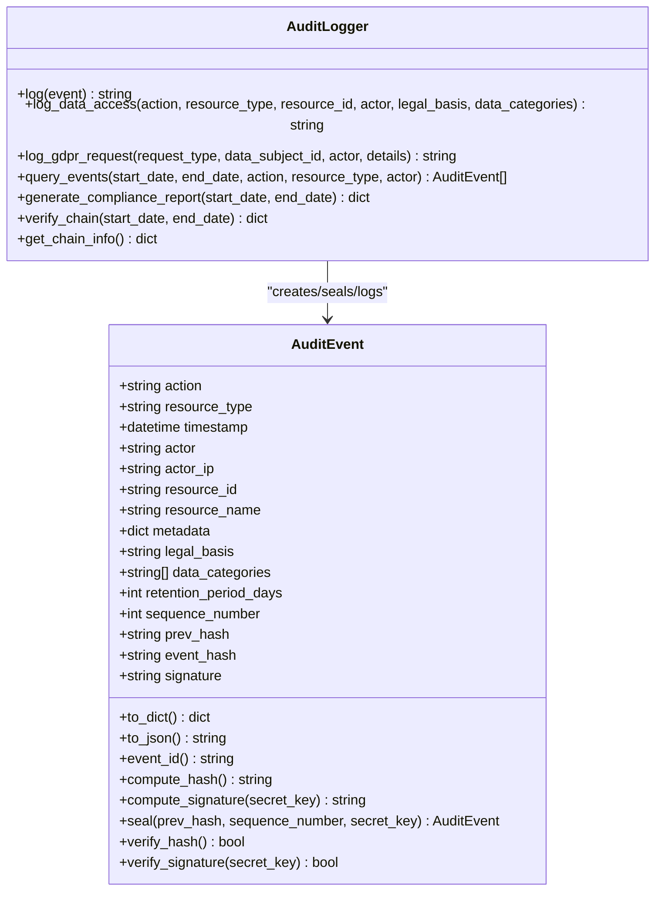
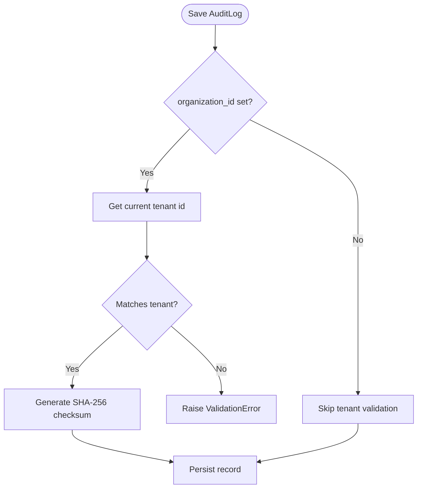
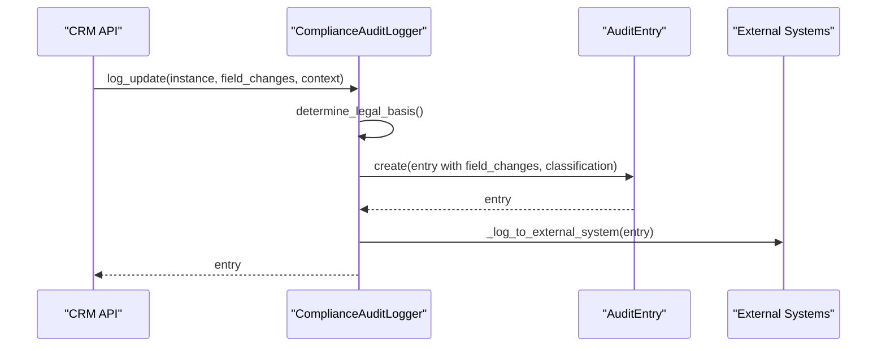
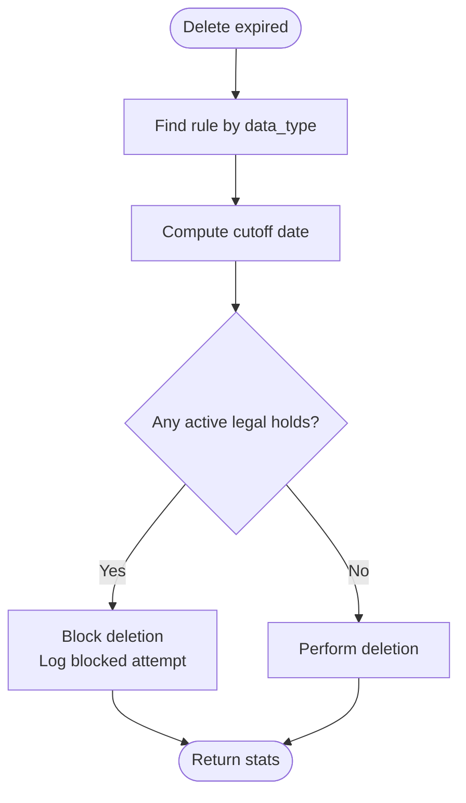
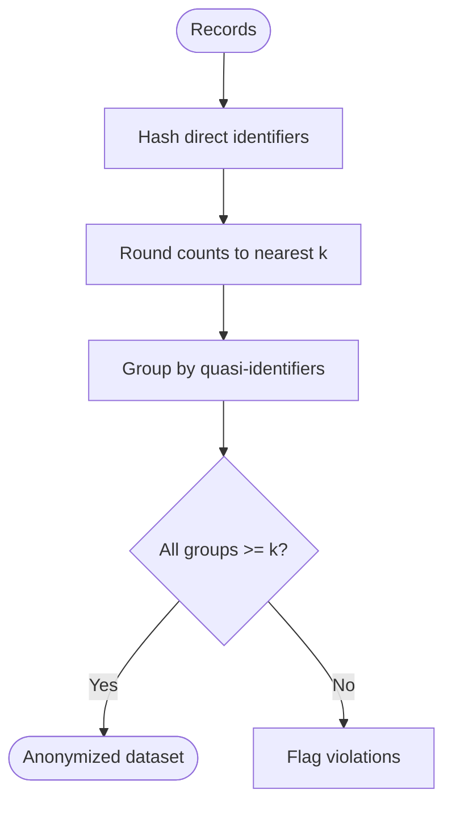
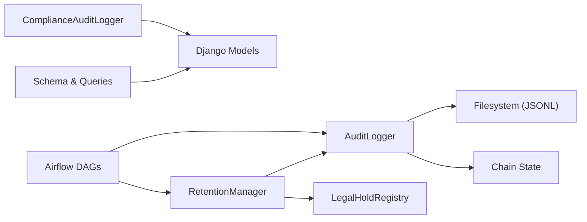

# Audit Logging System

<cite>
**Referenced Files in This Document**
- [audit.py](file://data/src/audit.py)
- [models.py](file://backend/django/apps/core/models.py)
- [audit_logger.py](file://backend/django/apps/crm/audit_logger.py)
- [anonymizer.py](file://data/src/gdpr/anonymizer.py)
- [retention_manager.py](file://data/src/gdpr/retention_manager.py)
- [ropa_generator.py](file://data/src/gdpr/ropa_generator.py)
- [jol_hub_etl.py](file://data/airflow/dags/jol_hub_etl.py)
- [jol_gdpr_cleanup.py](file://data/airflow/dags/jol_gdpr_cleanup.py)
- [gdpr_compliance.sql](file://data/sql/audit_queries/gdpr_compliance.sql)
- [001_initial_schema.sql](file://data/sql/schema_setup/001_initial_schema.sql)
- [data_integration.py](file://backend/django/apps/core/data_integration.py)
</cite>

## Table of Contents
1. [Introduction](#introduction)
2. [Project Structure](#project-structure)
3. [Core Components](#core-components)
4. [Architecture Overview](#architecture-overview)
5. [Detailed Component Analysis](#detailed-component-analysis)
6. [Dependency Analysis](#dependency-analysis)
7. [Performance Considerations](#performance-considerations)
8. [Troubleshooting Guide](#troubleshooting-guide)
9. [Conclusion](#conclusion)
10. [Appendices](#appendices)

## Introduction
This document describes the audit logging system that tracks security events and user activities across the JOL-HUB platform. It covers the audit log model structure, event categorization, retention policies, GDPR-compliant trail generation, data anonymization, secure storage mechanisms, automated log rotation, compliance reporting, and guidance for querying logs and implementing custom handlers.

The system provides:
- Tamper-evident audit trails with hash chains and HMAC signatures
- Structured event categorization for data operations, GDPR requests, consent changes, financial transactions, and security events
- Retention rules and legal hold enforcement to comply with storage limitation and erasure requirements
- Anonymization utilities for privacy-preserving analytics and exports
- Automated cleanup and reporting via Airflow DAGs
- SQL queries and schema support for compliance reporting

## Project Structure
Audit-related functionality is implemented across multiple layers:
- Data processing and integrity: Python module for event modeling, hashing, signing, chain state, and reporting
- Django models and CRM logger: Database-backed audit entries, context capture, and field-level change tracking
- GDPR utilities: Anonymization, retention management, and Records of Processing Activities (ROPA) generation
- Orchestration: Airflow DAGs for retention cleanup and report generation
- Storage and queries: SQL schema and compliance queries

**Diagram sources**
- [audit.py:205-369](file://data/src/audit.py#L205-L369)
- [retention_manager.py:188-246](file://data/src/gdpr/retention_manager.py#L188-L246)
- [anonymizer.py:106-143](file://data/src/gdpr/anonymizer.py#L106-L143)
- [ropa_generator.py:103-169](file://data/src/gdpr/ropa_generator.py#L103-L169)
- [models.py:67-170](file://backend/django/apps/core/models.py#L67-L170)
- [audit_logger.py:154-274](file://backend/django/apps/crm/audit_logger.py#L154-L274)
- [jol_hub_etl.py:44-70](file://data/airflow/dags/jol_hub_etl.py#L44-L70)
- [jol_gdpr_cleanup.py:21-67](file://data/airflow/dags/jol_gdpr_cleanup.py#L21-L67)
- [001_initial_schema.sql:45-74](file://data/sql/schema_setup/001_initial_schema.sql#L45-L74)
- [gdpr_compliance.sql:1-66](file://data/sql/audit_queries/gdpr_compliance.sql#L1-L66)

**Section sources**
- [audit.py:205-369](file://data/src/audit.py#L205-L369)
- [models.py:67-170](file://backend/django/apps/core/models.py#L67-L170)
- [audit_logger.py:154-274](file://backend/django/apps/crm/audit_logger.py#L154-L274)
- [retention_manager.py:188-246](file://data/src/gdpr/retention_manager.py#L188-L246)
- [anonymizer.py:106-143](file://data/src/gdpr/anonymizer.py#L106-L143)
- [ropa_generator.py:103-169](file://data/src/gdpr/ropa_generator.py#L103-L169)
- [jol_hub_etl.py:44-70](file://data/airflow/dags/jol_hub_etl.py#L44-L70)
- [jol_gdpr_cleanup.py:21-67](file://data/airflow/dags/jol_gdpr_cleanup.py#L21-L67)
- [001_initial_schema.sql:45-74](file://data/sql/schema_setup/001_initial_schema.sql#L45-L74)
- [gdpr_compliance.sql:1-66](file://data/sql/audit_queries/gdpr_compliance.sql#L1-L66)

## Core Components
- AuditEvent and AuditLogger: Immutable, append-only JSONL logs with per-event hashes, HMAC signatures, sequence numbers, and chain state persistence. Includes GDPR fields and convenience methods for data access and GDPR request logging.
- Django AuditLog model: Immutable database-backed audit trail with action taxonomy, tenant isolation, checksum generation, and indexes optimized for compliance queries.
- ComplianceAuditLogger (CRM): Field-level change tracking, legal basis determination, sensitive/special category handling, and integration points for external systems.
- RetentionManager and LegalHoldRegistry: Enforces retention rules and legal holds; blocks deletion when required by law or regulation.
- KAnonymizer: Country-aware k-anonymity thresholds and checks for anonymized datasets.
- ROPA Generator: Produces Article 30 Records of Processing Activities in JSON or Markdown.
- Airflow DAGs: Scheduled tasks for retention cleanup and weekly compliance reports.
- SQL schema and queries: Indexes, partitioning hints, row-level security enablement, and ready-to-use GDPR queries.

**Section sources**
- [audit.py:29-203](file://data/src/audit.py#L29-L203)
- [audit.py:205-369](file://data/src/audit.py#L205-L369)
- [models.py:67-170](file://backend/django/apps/core/models.py#L67-L170)
- [audit_logger.py:44-95](file://backend/django/apps/crm/audit_logger.py#L44-L95)
- [audit_logger.py:154-274](file://backend/django/apps/crm/audit_logger.py#L154-L274)
- [retention_manager.py:78-106](file://data/src/gdpr/retention_manager.py#L78-L106)
- [retention_manager.py:188-246](file://data/src/gdpr/retention_manager.py#L188-L246)
- [anonymizer.py:25-83](file://data/src/gdpr/anonymizer.py#L25-L83)
- [anonymizer.py:106-143](file://data/src/gdpr/anonymizer.py#L106-L143)
- [ropa_generator.py:19-43](file://data/src/gdpr/ropa_generator.py#L19-L43)
- [ropa_generator.py:103-169](file://data/src/gdpr/ropa_generator.py#L103-L169)
- [jol_hub_etl.py:44-70](file://data/airflow/dags/jol_hub_etl.py#L44-L70)
- [jol_gdpr_cleanup.py:21-67](file://data/airflow/dags/jol_gdpr_cleanup.py#L21-L67)
- [001_initial_schema.sql:45-74](file://data/sql/schema_setup/001_initial_schema.sql#L45-L74)
- [gdpr_compliance.sql:1-66](file://data/sql/audit_queries/gdpr_compliance.sql#L1-L66)

## Architecture Overview
The audit system combines file-based immutable logs with a relational audit trail and orchestration for retention and reporting.

**Diagram sources**
- [audit_logger.py:218-274](file://backend/django/apps/crm/audit_logger.py#L218-L274)
- [models.py:67-170](file://backend/django/apps/core/models.py#L67-L170)
- [audit.py:330-369](file://data/src/audit.py#L330-L369)
- [jol_hub_etl.py:60-70](file://data/airflow/dags/jol_hub_etl.py#L60-L70)
- [gdpr_compliance.sql:1-66](file://data/sql/audit_queries/gdpr_compliance.sql#L1-L66)

## Detailed Component Analysis

### Audit Event Model and Integrity Chain
- Event model includes action, resource metadata, GDPR fields, and integrity fields (sequence_number, prev_hash, event_hash, signature).
- Hash computation uses canonical JSON of event content excluding signature to avoid circular dependency.
- Signature uses HMAC-SHA256 with a secret key loaded from environment or persisted securely.
- Chain state persists last hash and sequence number to ensure continuity across runs.

**Diagram sources**
- [audit.py:65-203](file://data/src/audit.py#L65-L203)
- [audit.py:205-369](file://data/src/audit.py#L205-L369)

**Section sources**
- [audit.py:65-203](file://data/src/audit.py#L65-L203)
- [audit.py:205-369](file://data/src/audit.py#L205-L369)

### Django AuditLog Model and Tenant Isolation
- Immutable audit trail with action choices covering CRUD, export, refund, access, erasure, DSR actions, consent, legal hold, and financial events.
- Fields include user, entity type/id, IP, user agent, correlation id, organization id, consent reference, legal basis, checksum, and extra metadata.
- Save hook generates checksum and validates tenant context to prevent cross-tenant writes.

**Diagram sources**
- [models.py:67-170](file://backend/django/apps/core/models.py#L67-L170)

**Section sources**
- [models.py:67-170](file://backend/django/apps/core/models.py#L67-L170)

### CRM Compliance Audit Logger
- Provides typed event categories for CRM operations, GDPR DSR, consent, financial transactions, and security events.
- Captures field-level changes, masks sensitive fields, detects special category data changes, and determines GDPR legal basis automatically.
- Logs to both database and external systems (e.g., SIEM) and supports unauthorized access logging.

**Diagram sources**
- [audit_logger.py:276-348](file://backend/django/apps/crm/audit_logger.py#L276-L348)
- [audit_logger.py:689-696](file://backend/django/apps/crm/audit_logger.py#L689-L696)

**Section sources**
- [audit_logger.py:44-95](file://backend/django/apps/crm/audit_logger.py#L44-L95)
- [audit_logger.py:218-348](file://backend/django/apps/crm/audit_logger.py#L218-L348)
- [audit_logger.py:548-629](file://backend/django/apps/crm/audit_logger.py#L548-L629)
- [audit_logger.py:689-696](file://backend/django/apps/crm/audit_logger.py#L689-L696)

### Retention Policies and Legal Holds
- Retention rules define data types, retention periods, legal bases, and approval requirements.
- LegalHoldRegistry enforces active holds that block deletion even if retention expires.
- RetentionManager.delete_expired logs cleanup actions and respects legal holds; delete_subject_data checks holds before erasure.

**Diagram sources**
- [retention_manager.py:78-106](file://data/src/gdpr/retention_manager.py#L78-L106)
- [retention_manager.py:188-246](file://data/src/gdpr/retention_manager.py#L188-L246)
- [retention_manager.py:257-317](file://data/src/gdpr/retention_manager.py#L257-L317)

**Section sources**
- [retention_manager.py:78-106](file://data/src/gdpr/retention_manager.py#L78-L106)
- [retention_manager.py:188-246](file://data/src/gdpr/retention_manager.py#L188-L246)
- [retention_manager.py:257-317](file://data/src/gdpr/retention_manager.py#L257-L317)

### GDPR Anonymization
- Country-specific k-anonymity thresholds are applied based on country codes or environment override.
- Direct identifiers are hashed; counts are rounded to nearest k; dataset checks verify k-anonymity satisfaction.

**Diagram sources**
- [anonymizer.py:25-83](file://data/src/gdpr/anonymizer.py#L25-L83)
- [anonymizer.py:106-143](file://data/src/gdpr/anonymizer.py#L106-L143)

**Section sources**
- [anonymizer.py:25-83](file://data/src/gdpr/anonymizer.py#L25-L83)
- [anonymizer.py:106-143](file://data/src/gdpr/anonymizer.py#L106-L143)

### ROPA Generation
- Defines standard processing activities with purpose, legal basis, data categories, subjects, recipients, retention, and security measures.
- Generates JSON or Markdown reports and saves them with timestamps.

**Section sources**
- [ropa_generator.py:19-43](file://data/src/gdpr/ropa_generator.py#L19-L43)
- [ropa_generator.py:103-169](file://data/src/gdpr/ropa_generator.py#L103-L169)

### Automated Log Rotation and Reporting
- Daily JSONL files are created per day for append-only logging.
- Airflow DAGs schedule retention cleanup and weekly compliance report generation using the audit logger.

**Section sources**
- [audit.py:320-328](file://data/src/audit.py#L320-L328)
- [jol_hub_etl.py:44-70](file://data/airflow/dags/jol_hub_etl.py#L44-L70)
- [jol_gdpr_cleanup.py:21-67](file://data/airflow/dags/jol_gdpr_cleanup.py#L21-L67)

### Secure Storage Mechanisms
- File-based logs: Append-only JSONL with HMAC signatures and chain state persistence. Secret key stored with restrictive permissions or generated per run.
- Database-backed logs: Immutable records with checksums and tenant isolation enforced at save time.
- SQL layer: Row-level security enabled for multi-tenant isolation; indexes optimize compliance queries.

**Section sources**
- [audit.py:236-286](file://data/src/audit.py#L236-L286)
- [audit.py:330-369](file://data/src/audit.py#L330-L369)
- [models.py:156-170](file://backend/django/apps/core/models.py#L156-L170)
- [001_initial_schema.sql:61-74](file://data/sql/schema_setup/001_initial_schema.sql#L61-L74)

## Dependency Analysis
- AuditLogger depends on filesystem for append-only logs and chain state; it also emits structured logs for monitoring.
- ComplianceAuditLogger depends on Django models and settings for HMAC keys and tenant context.
- RetentionManager depends on AuditLogger for audit trail of deletions and on LegalHoldRegistry to enforce holds.
- Airflow DAGs depend on AuditLogger and RetentionManager for scheduled tasks.
- SQL schema and queries provide persistent structures and efficient retrieval for compliance reporting.

**Diagram sources**
- [audit.py:205-369](file://data/src/audit.py#L205-L369)
- [audit_logger.py:154-274](file://backend/django/apps/crm/audit_logger.py#L154-L274)
- [retention_manager.py:188-246](file://data/src/gdpr/retention_manager.py#L188-L246)
- [jol_hub_etl.py:44-70](file://data/airflow/dags/jol_hub_etl.py#L44-L70)
- [001_initial_schema.sql:45-74](file://data/sql/schema_setup/001_initial_schema.sql#L45-L74)

**Section sources**
- [audit.py:205-369](file://data/src/audit.py#L205-L369)
- [audit_logger.py:154-274](file://backend/django/apps/crm/audit_logger.py#L154-L274)
- [retention_manager.py:188-246](file://data/src/gdpr/retention_manager.py#L188-L246)
- [jol_hub_etl.py:44-70](file://data/airflow/dags/jol_hub_etl.py#L44-L70)
- [001_initial_schema.sql:45-74](file://data/sql/schema_setup/001_initial_schema.sql#L45-L74)

## Performance Considerations
- Append-only JSONL logs minimize write overhead and preserve integrity; daily rotation keeps files manageable.
- Database indexes on action, resource, and created_at accelerate compliance queries.
- Chain verification scans all events; consider running verification over limited windows to reduce load.
- Use dry-run mode in retention cleanup to validate impact before actual deletions.

[No sources needed since this section provides general guidance]

## Troubleshooting Guide
- Cross-tenant audit log attempts: The model validates tenant context and raises validation errors if mismatched; check tenant middleware and organization_id.
- Chain integrity issues: Use chain verification to detect broken links, sequence gaps, hash mismatches, or invalid signatures; investigate tampering or misconfiguration.
- Retention failures: Ensure retention rules exist for data types; confirm legal holds are not blocking deletions; use subject_ids_to_skip to exclude held subjects.
- Anonymization violations: Verify k-anonymity checks and adjust k thresholds per country; review quasi-identifier groupings.

**Section sources**
- [models.py:172-200](file://backend/django/apps/core/models.py#L172-L200)
- [audit.py:513-589](file://data/src/audit.py#L513-L589)
- [retention_manager.py:257-317](file://data/src/gdpr/retention_manager.py#L257-L317)
- [anonymizer.py:127-143](file://data/src/gdpr/anonymizer.py#L127-L143)

## Conclusion
The JOL-HUB audit logging system delivers a robust, GDPR-aligned, and tamper-evident trail across file-based and database-backed stores. It integrates event categorization, retention enforcement, legal holds, anonymization, and automated reporting to meet compliance obligations while supporting operational needs.

[No sources needed since this section summarizes without analyzing specific files]

## Appendices

### Event Categorization Reference
- Data operations: create, read, update, delete, access, export
- Processing: process_start, process_complete, process_error
- GDPR: data_subject_access, data_subject_erasure, data_subject_portability, data_subject_rectification, data_subject_restriction
- Consent: consent_granted, consent_withdrawn
- Security: access_granted, access_revoked, authentication_success, authentication_failure
- Transfer: data_export, data_import, third_party_transfer

**Section sources**
- [audit.py:29-63](file://data/src/audit.py#L29-L63)
- [audit_logger.py:44-82](file://backend/django/apps/crm/audit_logger.py#L44-L82)
- [models.py:73-123](file://backend/django/apps/core/models.py#L73-L123)

### GDPR-Compliant Audit Trail Generation
- Each event is sealed with prev_hash, sequence_number, event_hash, and HMAC signature.
- Chain state ensures continuity across processes; verification tools detect tampering and ordering issues.
- GDPR fields (legal_basis, data_categories, retention_period_days) are recorded for accountability.

**Section sources**
- [audit.py:134-203](file://data/src/audit.py#L134-L203)
- [audit.py:330-369](file://data/src/audit.py#L330-L369)
- [audit.py:513-589](file://data/src/audit.py#L513-L589)

### Data Anonymization Processes
- Country-specific k-anonymity thresholds applied; direct identifiers hashed; counts rounded to k; dataset checks ensure compliance.

**Section sources**
- [anonymizer.py:25-83](file://data/src/gdpr/anonymizer.py#L25-L83)
- [anonymizer.py:106-143](file://data/src/gdpr/anonymizer.py#L106-L143)

### Secure Storage Mechanisms
- File-based logs: append-only JSONL, HMAC signatures, restricted secret key storage.
- Database logs: immutable records with checksums and tenant isolation.
- SQL: row-level security and indexes for performance.

**Section sources**
- [audit.py:236-286](file://data/src/audit.py#L236-L286)
- [models.py:156-170](file://backend/django/apps/core/models.py#L156-L170)
- [001_initial_schema.sql:61-74](file://data/sql/schema_setup/001_initial_schema.sql#L61-L74)

### Querying Audit Logs
- Use query_events to filter by date range, action, resource_type, and actor.
- Use SQL queries for GDPR compliance reporting, retention status, and activity summaries.

**Section sources**
- [audit.py:409-473](file://data/src/audit.py#L409-L473)
- [gdpr_compliance.sql:1-66](file://data/sql/audit_queries/gdpr_compliance.sql#L1-L66)

### Generating Compliance Reports
- Generate weekly reports via Airflow DAGs using generate_compliance_report.
- ROPA generator produces Article 30 records in JSON or Markdown.

**Section sources**
- [jol_hub_etl.py:60-70](file://data/airflow/dags/jol_hub_etl.py#L60-L70)
- [ropa_generator.py:121-169](file://data/src/gdpr/ropa_generator.py#L121-L169)

### Implementing Custom Audit Handlers
- For new security events, add an action to the appropriate enum and log via ComplianceAuditLogger or AuditLogger.
- Capture relevant context (user, IP, tenant), classify data sensitivity, and set legal_basis where applicable.
- Integrate with external systems via _log_to_external_system if needed.

**Section sources**
- [audit_logger.py:587-629](file://backend/django/apps/crm/audit_logger.py#L587-L629)
- [audit_logger.py:689-696](file://backend/django/apps/crm/audit_logger.py#L689-L696)
- [data_integration.py:149-188](file://backend/django/apps/core/data_integration.py#L149-L188)