# Compliance Reporting

<cite>
**Referenced Files in This Document**
- [gdpr_compliance_report.sql](file://data/dbt/models/marts/gdpr_compliance_report.sql)
- [data_subject_export.sql](file://data/dbt/models/marts/data_subject_export.sql)
- [schema.yml](file://data/dbt/models/staging/schema.yml)
- [entity_ropa.py](file://data/src/gdpr/entity_ropa.py)
- [ropa_generator.py](file://data/src/gdpr/ropa_generator.py)
- [audit.py](file://data/src/audit.py)
- [config.py](file://data/src/config.py)
- [lt_sync.py](file://data/src/pipelines/country_sync/lt_sync.py)
- [template_sync.py](file://data/src/pipelines/country_sync/template_sync.py)
- [anonymizer.py](file://data/src/gdpr/anonymizer.py)
- [retention_manager.py](file://data/src/gdpr/retention_manager.py)
- [jol_weekly_reporting.py](file://data/airflow/dags/jol_weekly_reporting.py)
- [jol_gdpr_cleanup.py](file://data/airflow/dags/jol_gdpr_cleanup.py)
- [gdpr_compliance.sql](file://data/sql/audit_queries/gdpr_compliance.sql)
- [metrics.py](file://backend/django/apps/crm/observability/metrics.py)
- [check_compliance.py](file://backend/django/apps/crm/management/commands/check_compliance.py)
</cite>

## Table of Contents
1. Introduction
2. Project Structure
3. Core Components
4. Architecture Overview
5. Detailed Component Analysis
6. Dependency Analysis
7. Performance Considerations
8. Troubleshooting Guide
9. Conclusion
10. Appendices

## Introduction
This document explains the compliance reporting system that generates GDPR and regulatory compliance reports from security monitoring data. It covers:
- The dbt-based report generation pipeline for GDPR metrics and data subject exports
- ROPA (Record of Processing Activities) automation per entity type
- Automated compliance checks, evidence collection, and scheduling via Airflow
- Integration between security metrics, audit logs, and compliance reporting frameworks
- Examples for generating reports, customizing templates, and integrating with external systems

## Project Structure
The compliance reporting system spans several layers:
- Data layer: staging and marts built with dbt to produce GDPR metrics and export datasets
- Processing layer: Python modules for ROPA generation, anonymization, retention management, and audit logging
- Orchestration layer: Airflow DAGs for weekly reporting and automated cleanup
- Backend integration: Django observability and management commands for compliance scoring and checks
- SQL utilities: Audit queries for compliance insights

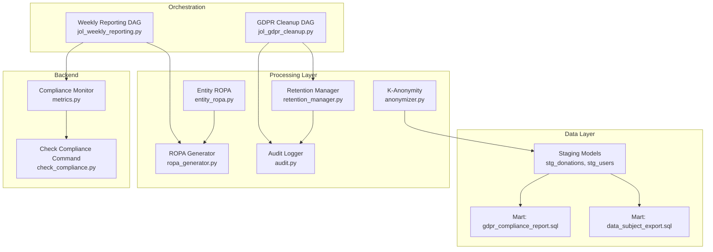

**Diagram sources**
- [gdpr_compliance_report.sql:1-68](file://data/dbt/models/marts/gdpr_compliance_report.sql#L1-L68)
- [data_subject_export.sql:1-55](file://data/dbt/models/marts/data_subject_export.sql#L1-L55)
- [schema.yml:1-48](file://data/dbt/models/staging/schema.yml#L1-L48)
- [ropa_generator.py:1-182](file://data/src/gdpr/ropa_generator.py#L1-L182)
- [entity_ropa.py:1-821](file://data/src/gdpr/entity_ropa.py#L1-L821)
- [anonymizer.py:1-180](file://data/src/gdpr/anonymizer.py#L1-L180)
- [retention_manager.py:1-336](file://data/src/gdpr/retention_manager.py#L1-L336)
- [audit.py:1-644](file://data/src/audit.py#L1-L644)
- [jol_weekly_reporting.py:1-78](file://data/airflow/dags/jol_weekly_reporting.py#L1-L78)
- [jol_gdpr_cleanup.py:1-68](file://data/airflow/dags/jol_gdpr_cleanup.py#L1-L68)
- [metrics.py:125-333](file://backend/django/apps/crm/observability/metrics.py#L125-L333)
- [check_compliance.py:1-20](file://backend/django/apps/crm/management/commands/check_compliance.py#L1-L20)

**Section sources**
- [gdpr_compliance_report.sql:1-68](file://data/dbt/models/marts/gdpr_compliance_report.sql#L1-L68)
- [data_subject_export.sql:1-55](file://data/dbt/models/marts/data_subject_export.sql#L1-L55)
- [schema.yml:1-48](file://data/dbt/models/staging/schema.yml#L1-L48)
- [ropa_generator.py:1-182](file://data/src/gdpr/ropa_generator.py#L1-L182)
- [entity_ropa.py:1-821](file://data/src/gdpr/entity_ropa.py#L1-L821)
- [anonymizer.py:1-180](file://data/src/gdpr/anonymizer.py#L1-L180)
- [retention_manager.py:1-336](file://data/src/gdpr/retention_manager.py#L1-L336)
- [audit.py:1-644](file://data/src/audit.py#L1-L644)
- [jol_weekly_reporting.py:1-78](file://data/airflow/dags/jol_weekly_reporting.py#L1-L78)
- [jol_gdpr_cleanup.py:1-68](file://data/airflow/dags/jol_gdpr_cleanup.py#L1-L68)
- [metrics.py:125-333](file://backend/django/apps/crm/observability/metrics.py#L125-L333)
- [check_compliance.py:1-20](file://backend/django/apps/crm/management/commands/check_compliance.py#L1-L20)

## Core Components
- dbt marts for GDPR metrics and data portability exports
- ROPA generator with entity-specific processing activities
- K-anonymity for privacy-preserving analytics
- Retention manager enforcing storage limitation and erasure rights
- Audit logger with integrity protection (hash chain and HMAC signatures)
- Airflow DAGs for scheduled reporting and cleanup
- Django compliance monitor and management command for scoring and checks

**Section sources**
- [gdpr_compliance_report.sql:1-68](file://data/dbt/models/marts/gdpr_compliance_report.sql#L1-L68)
- [data_subject_export.sql:1-55](file://data/dbt/models/marts/data_subject_export.sql#L1-L55)
- [ropa_generator.py:1-182](file://data/src/gdpr/ropa_generator.py#L1-L182)
- [entity_ropa.py:1-821](file://data/src/gdpr/entity_ropa.py#L1-L821)
- [anonymizer.py:1-180](file://data/src/gdpr/anonymizer.py#L1-L180)
- [retention_manager.py:1-336](file://data/src/gdpr/retention_manager.py#L1-L336)
- [audit.py:1-644](file://data/src/audit.py#L1-L644)
- [jol_weekly_reporting.py:1-78](file://data/airflow/dags/jol_weekly_reporting.py#L1-L78)
- [jol_gdpr_cleanup.py:1-68](file://data/airflow/dags/jol_gdpr_cleanup.py#L1-L68)
- [metrics.py:125-333](file://backend/django/apps/crm/observability/metrics.py#L125-L333)
- [check_compliance.py:1-20](file://backend/django/apps/crm/management/commands/check_compliance.py#L1-L20)

## Architecture Overview
The system integrates data pipelines, compliance logic, and orchestration:
- Staging models normalize raw tables (donations, users)
- Marts compute GDPR metrics and prepare data subject exports
- Python components generate ROPA, enforce retention, and apply anonymization
- Airflow schedules periodic reporting and cleanup tasks
- Django services provide compliance scoring and operational checks

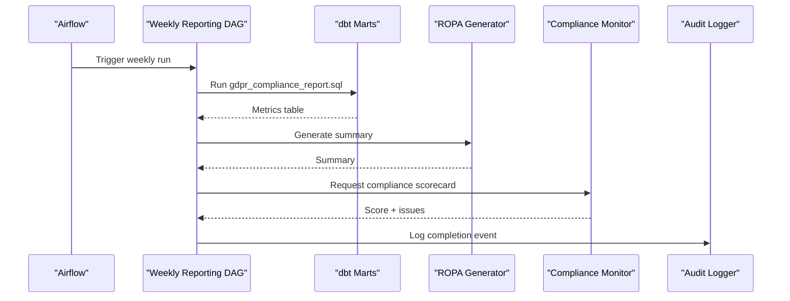

**Diagram sources**
- [jol_weekly_reporting.py:20-77](file://data/airflow/dags/jol_weekly_reporting.py#L20-L77)
- [gdpr_compliance_report.sql:10-68](file://data/dbt/models/marts/gdpr_compliance_report.sql#L10-L68)
- [ropa_generator.py:103-182](file://data/src/gdpr/ropa_generator.py#L103-L182)
- [metrics.py:182-333](file://backend/django/apps/crm/observability/metrics.py#L182-L333)
- [audit.py:330-369](file://data/src/audit.py#L330-L369)

## Detailed Component Analysis

### dbt-Based Report Generation Pipeline
- Staging schema defines source tables and column tests for donations and users
- GDPR compliance mart aggregates processing activity metrics, including retention expiry warnings
- Data subject export mart consolidates user and donation data for portability requests

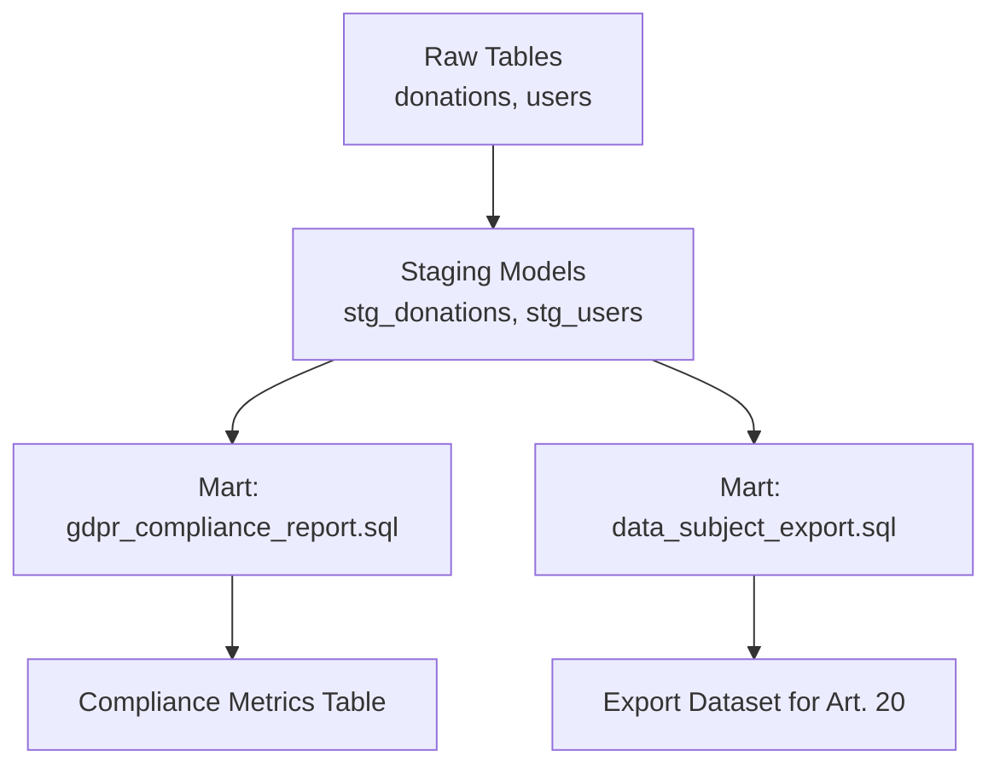

**Diagram sources**
- [schema.yml:1-48](file://data/dbt/models/staging/schema.yml#L1-L48)
- [gdpr_compliance_report.sql:10-68](file://data/dbt/models/marts/gdpr_compliance_report.sql#L10-L68)
- [data_subject_export.sql:13-55](file://data/dbt/models/marts/data_subject_export.sql#L13-L55)

**Section sources**
- [schema.yml:1-48](file://data/dbt/models/staging/schema.yml#L1-L48)
- [gdpr_compliance_report.sql:1-68](file://data/dbt/models/marts/gdpr_compliance_report.sql#L1-L68)
- [data_subject_export.sql:1-55](file://data/dbt/models/marts/data_subject_export.sql#L1-L55)

### ROPA Automation
- Base ROPA generator produces structured records of processing activities and supports JSON/Markdown outputs
- Entity-specific module maps entity types to tailored processing activities with legal basis, retention, and security measures
- Reports include summaries and metadata for controller details and compliance frameworks

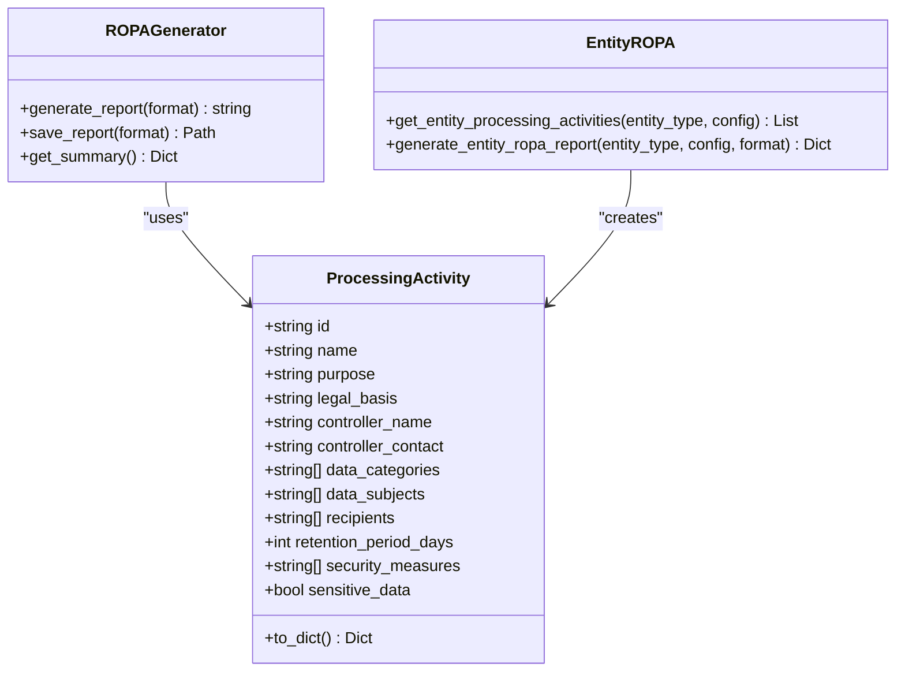

**Diagram sources**
- [ropa_generator.py:19-182](file://data/src/gdpr/ropa_generator.py#L19-L182)
- [entity_ropa.py:39-797](file://data/src/gdpr/entity_ropa.py#L39-L797)

**Section sources**
- [ropa_generator.py:1-182](file://data/src/gdpr/ropa_generator.py#L1-L182)
- [entity_ropa.py:1-821](file://data/src/gdpr/entity_ropa.py#L1-L821)

### Privacy-Preserving Analytics (K-Anonymity)
- Country-specific k-values align with national guidance; environment override supported
- Anonymizer hashes direct identifiers and provides group checks for quasi-identifiers
- Pipelines apply anonymization before loading aggregated or shared datasets

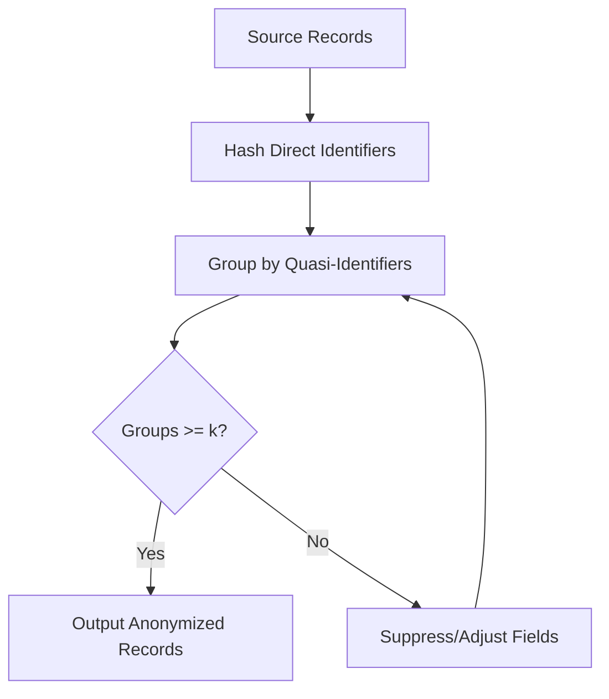

**Diagram sources**
- [anonymizer.py:25-84](file://data/src/gdpr/anonymizer.py#L25-L84)
- [anonymizer.py:106-180](file://data/src/gdpr/anonymizer.py#L106-L180)

**Section sources**
- [anonymizer.py:1-180](file://data/src/gdpr/anonymizer.py#L1-L180)

### Retention Management and Erasure
- Retention rules define time-bound policies per data type
- Legal holds prevent deletion when litigation, audits, or investigations are active
- Deletion workflows log attempts and outcomes for auditability

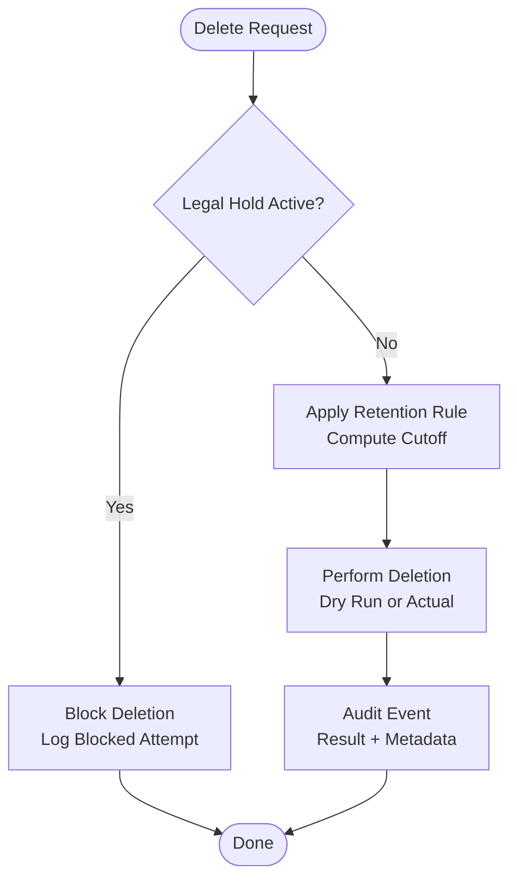

**Diagram sources**
- [retention_manager.py:188-336](file://data/src/gdpr/retention_manager.py#L188-L336)
- [audit.py:330-369](file://data/src/audit.py#L330-L369)

**Section sources**
- [retention_manager.py:1-336](file://data/src/gdpr/retention_manager.py#L1-L336)
- [audit.py:1-644](file://data/src/audit.py#L1-L644)

### Audit Logging and Evidence Integrity
- Each audit event is sealed with a hash chain and HMAC signature
- Chain state persists across sessions to ensure continuity
- Verification tools check integrity, sequence monotonicity, and signatures

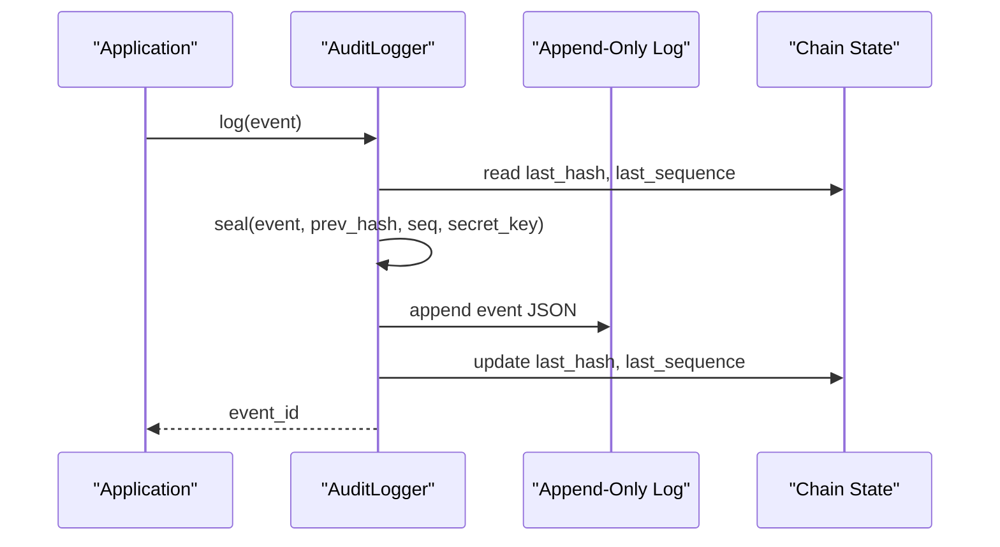

**Diagram sources**
- [audit.py:225-369](file://data/src/audit.py#L225-L369)
- [audit.py:513-589](file://data/src/audit.py#L513-L589)

**Section sources**
- [audit.py:1-644](file://data/src/audit.py#L1-L644)

### Country Sync Pipelines and Data Minimization
- Template provides a standardized structure for country-specific syncs
- Lithuania pipeline demonstrates entity and donation synchronization with anonymization and audit logging
- Enforces consent verification and minimal data collection

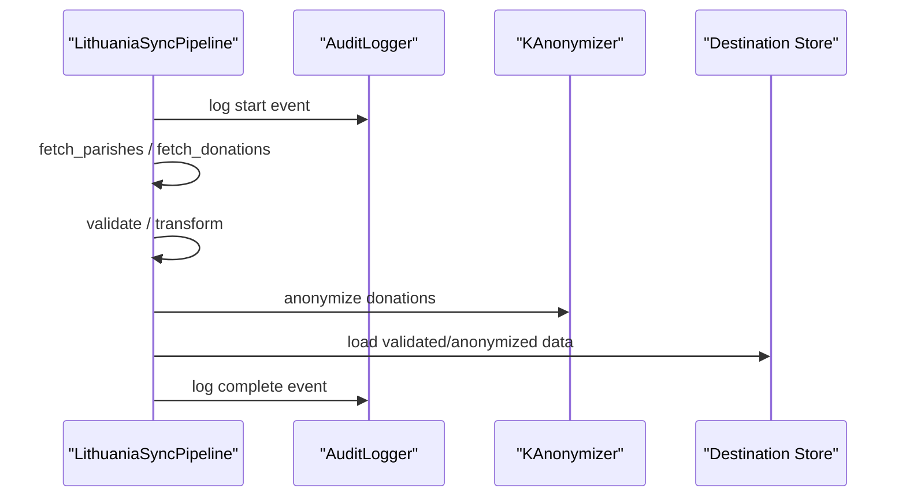

**Diagram sources**
- [template_sync.py:49-163](file://data/src/pipelines/country_sync/template_sync.py#L49-L163)
- [lt_sync.py:48-207](file://data/src/pipelines/country_sync/lt_sync.py#L48-L207)
- [anonymizer.py:106-180](file://data/src/gdpr/anonymizer.py#L106-L180)
- [audit.py:330-369](file://data/src/audit.py#L330-L369)

**Section sources**
- [template_sync.py:1-163](file://data/src/pipelines/country_sync/template_sync.py#L1-L163)
- [lt_sync.py:1-207](file://data/src/pipelines/country_sync/lt_sync.py#L1-L207)

### Scheduled Reporting and Cleanup
- Weekly reporting DAG orchestrates analytics, country metrics, and compliance scorecards
- GDPR cleanup DAG enforces retention policies and verifies deletions

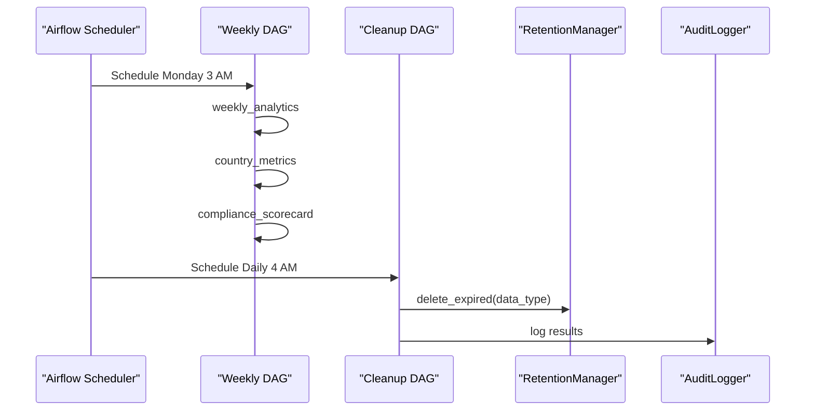

**Diagram sources**
- [jol_weekly_reporting.py:20-77](file://data/airflow/dags/jol_weekly_reporting.py#L20-L77)
- [jol_gdpr_cleanup.py:21-68](file://data/airflow/dags/jol_gdpr_cleanup.py#L21-L68)
- [retention_manager.py:206-246](file://data/src/gdpr/retention_manager.py#L206-L246)
- [audit.py:330-369](file://data/src/audit.py#L330-L369)

**Section sources**
- [jol_weekly_reporting.py:1-78](file://data/airflow/dags/jol_weekly_reporting.py#L1-L78)
- [jol_gdpr_cleanup.py:1-68](file://data/airflow/dags/jol_gdpr_cleanup.py#L1-L68)

### Backend Integration: Compliance Monitoring and Checks
- Django compliance monitor aggregates DSR metrics, consent status, legal holds, and audit integrity
- Management command triggers compliance checks across tenants or specific ones

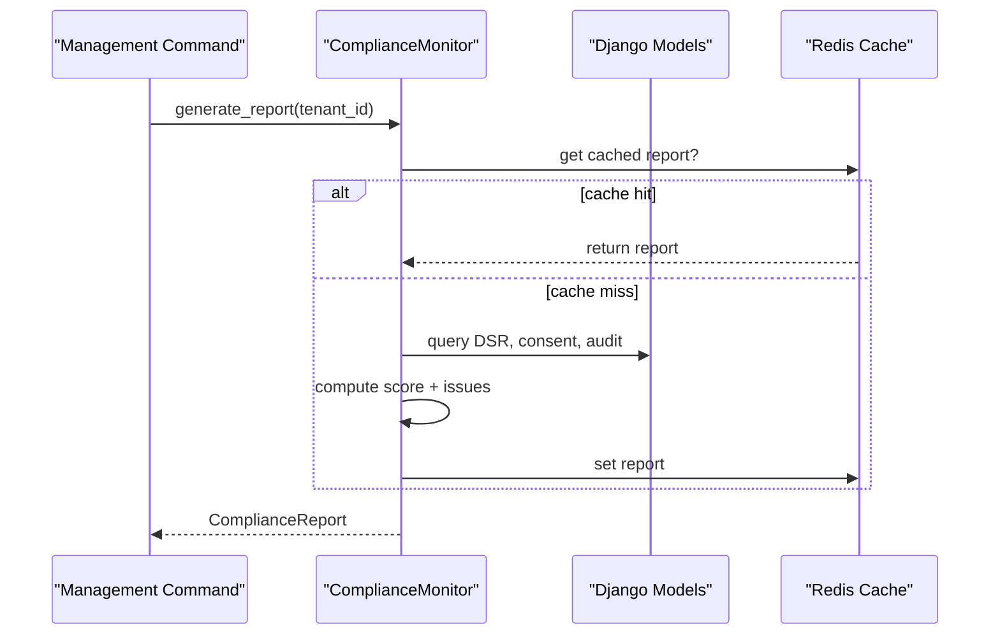

**Diagram sources**
- [metrics.py:182-333](file://backend/django/apps/crm/observability/metrics.py#L182-L333)
- [check_compliance.py:1-20](file://backend/django/apps/crm/management/commands/check_compliance.py#L1-L20)

**Section sources**
- [metrics.py:125-333](file://backend/django/apps/crm/observability/metrics.py#L125-L333)
- [check_compliance.py:1-20](file://backend/django/apps/crm/management/commands/check_compliance.py#L1-L20)

## Dependency Analysis
Key dependencies and relationships:
- dbt models depend on staging schema definitions and raw tables
- ROPA generator depends on entity configuration and standard processing activities
- Pipelines depend on anonymizer and audit logger
- Airflow DAGs depend on Python modules and dbt execution
- Django monitor depends on ORM models and caching

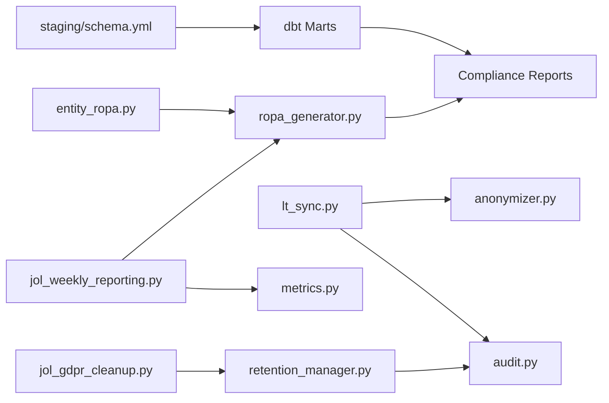

**Diagram sources**
- [schema.yml:1-48](file://data/dbt/models/staging/schema.yml#L1-L48)
- [gdpr_compliance_report.sql:10-68](file://data/dbt/models/marts/gdpr_compliance_report.sql#L10-L68)
- [entity_ropa.py:39-797](file://data/src/gdpr/entity_ropa.py#L39-L797)
- [ropa_generator.py:103-182](file://data/src/gdpr/ropa_generator.py#L103-L182)
- [lt_sync.py:48-207](file://data/src/pipelines/country_sync/lt_sync.py#L48-L207)
- [anonymizer.py:106-180](file://data/src/gdpr/anonymizer.py#L106-L180)
- [audit.py:330-369](file://data/src/audit.py#L330-L369)
- [jol_weekly_reporting.py:20-77](file://data/airflow/dags/jol_weekly_reporting.py#L20-L77)
- [metrics.py:182-333](file://backend/django/apps/crm/observability/metrics.py#L182-L333)
- [jol_gdpr_cleanup.py:21-68](file://data/airflow/dags/jol_gdpr_cleanup.py#L21-L68)
- [retention_manager.py:206-246](file://data/src/gdpr/retention_manager.py#L206-L246)

**Section sources**
- [schema.yml:1-48](file://data/dbt/models/staging/schema.yml#L1-L48)
- [gdpr_compliance_report.sql:10-68](file://data/dbt/models/marts/gdpr_compliance_report.sql#L10-L68)
- [entity_ropa.py:39-797](file://data/src/gdpr/entity_ropa.py#L39-L797)
- [ropa_generator.py:103-182](file://data/src/gdpr/ropa_generator.py#L103-L182)
- [lt_sync.py:48-207](file://data/src/pipelines/country_sync/lt_sync.py#L48-L207)
- [anonymizer.py:106-180](file://data/src/gdpr/anonymizer.py#L106-L180)
- [audit.py:330-369](file://data/src/audit.py#L330-L369)
- [jol_weekly_reporting.py:20-77](file://data/airflow/dags/jol_weekly_reporting.py#L20-L77)
- [metrics.py:182-333](file://backend/django/apps/crm/observability/metrics.py#L182-L333)
- [jol_gdpr_cleanup.py:21-68](file://data/airflow/dags/jol_gdpr_cleanup.py#L21-L68)
- [retention_manager.py:206-246](file://data/src/gdpr/retention_manager.py#L206-L246)

## Performance Considerations
- Use incremental dbt runs and materialized tables for large datasets
- Batch processing in pipelines with configurable sizes and timeouts
- Apply k-anonymity thresholds appropriate to jurisdiction to balance utility and privacy
- Cache compliance reports in backend to reduce repeated computation
- Ensure audit log rotation and efficient querying for long-running chains

[No sources needed since this section provides general guidance]

## Troubleshooting Guide
Common issues and diagnostics:
- Audit chain integrity failures: verify hash continuity, sequence numbers, and HMAC signatures
- Retention cleanup blocked: check legal holds and adjust subject skip lists
- dbt model errors: validate staging schema and column constraints
- Airflow task retries: inspect logs and adjust retry delays and timeouts
- Django compliance scores not updating: clear cache and re-run report generation

**Section sources**
- [audit.py:513-589](file://data/src/audit.py#L513-L589)
- [retention_manager.py:257-336](file://data/src/gdpr/retention_manager.py#L257-L336)
- [schema.yml:1-48](file://data/dbt/models/staging/schema.yml#L1-L48)
- [jol_weekly_reporting.py:52-77](file://data/airflow/dags/jol_weekly_reporting.py#L52-L77)
- [metrics.py:196-301](file://backend/django/apps/crm/observability/metrics.py#L196-L301)

## Conclusion
The compliance reporting system combines robust data modeling, privacy-preserving transformations, and rigorous audit trails to deliver GDPR-compliant reports and evidence. Automated scheduling ensures timely updates, while backend integrations provide actionable compliance metrics and enforcement mechanisms.

[No sources needed since this section summarizes without analyzing specific files]

## Appendices

### Example: Generating a GDPR Compliance Report
- Run dbt to build marts producing gdpr_compliance_report and data_subject_export
- Use Airflow weekly DAG to trigger analytics, country metrics, and compliance scorecard generation
- Retrieve outputs from the database or exported artifacts

**Section sources**
- [gdpr_compliance_report.sql:10-68](file://data/dbt/models/marts/gdpr_compliance_report.sql#L10-L68)
- [data_subject_export.sql:13-55](file://data/dbt/models/marts/data_subject_export.sql#L13-L55)
- [jol_weekly_reporting.py:20-77](file://data/airflow/dags/jol_weekly_reporting.py#L20-L77)

### Example: Customizing Report Templates
- Extend ROPA generator to support additional output formats
- Add entity-specific activities in entity_ropa.py for new entity types
- Update dbt models to include new metrics or classifications

**Section sources**
- [ropa_generator.py:121-169](file://data/src/gdpr/ropa_generator.py#L121-L169)
- [entity_ropa.py:39-797](file://data/src/gdpr/entity_ropa.py#L39-L797)
- [gdpr_compliance_report.sql:10-68](file://data/dbt/models/marts/gdpr_compliance_report.sql#L10-L68)

### Example: Integrating with External Compliance Systems
- Export ROPA reports and audit logs for third-party review
- Use Django compliance monitor outputs to feed external dashboards
- Schedule periodic pushes via Airflow to external APIs

**Section sources**
- [ropa_generator.py:121-169](file://data/src/gdpr/ropa_generator.py#L121-L169)
- [audit.py:330-369](file://data/src/audit.py#L330-L369)
- [metrics.py:196-333](file://backend/django/apps/crm/observability/metrics.py#L196-L333)
- [jol_weekly_reporting.py:52-77](file://data/airflow/dags/jol_weekly_reporting.py#L52-L77)