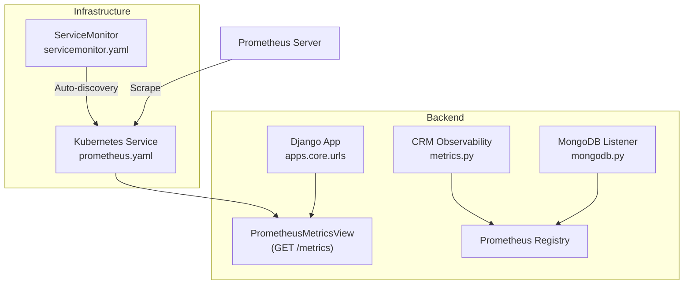
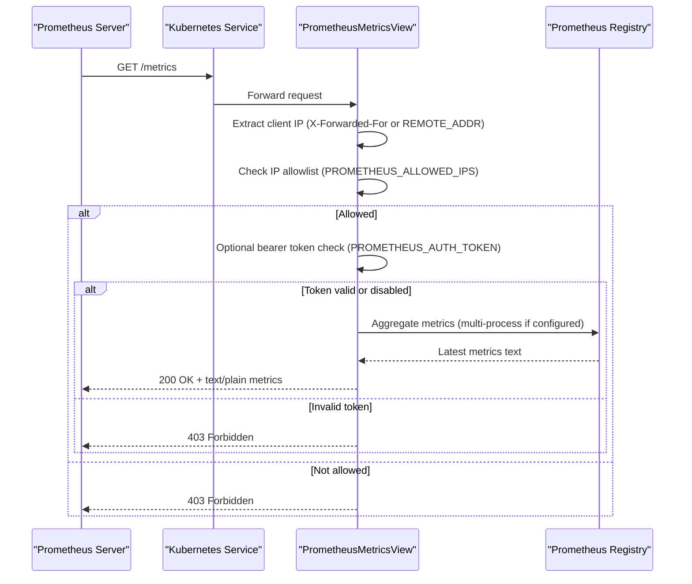
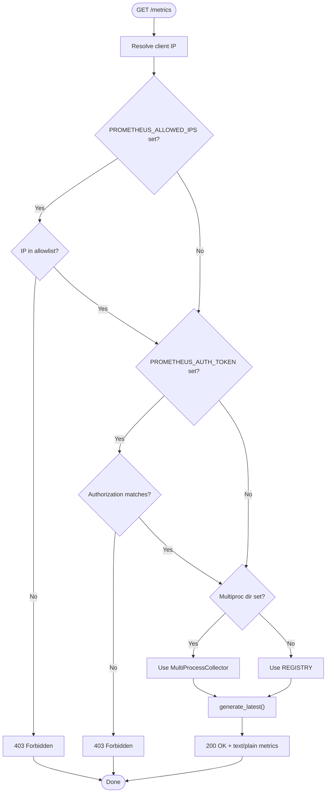
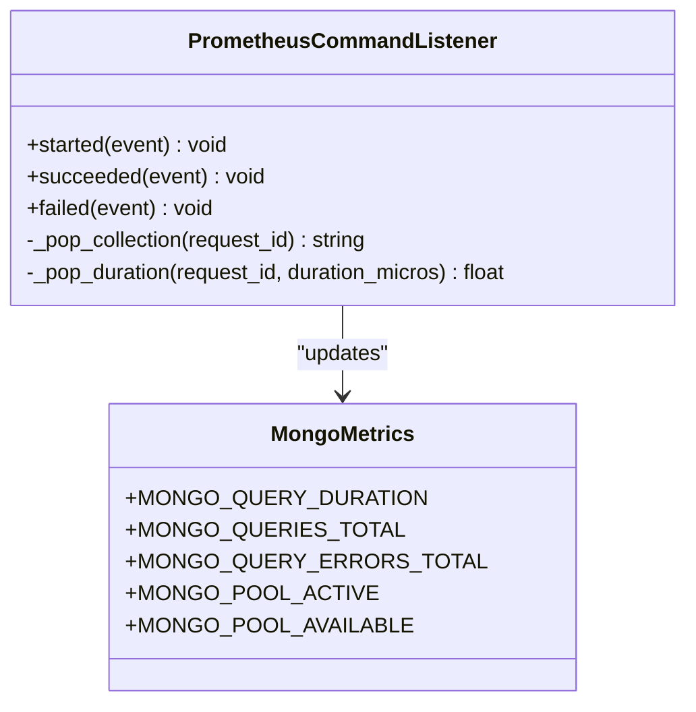
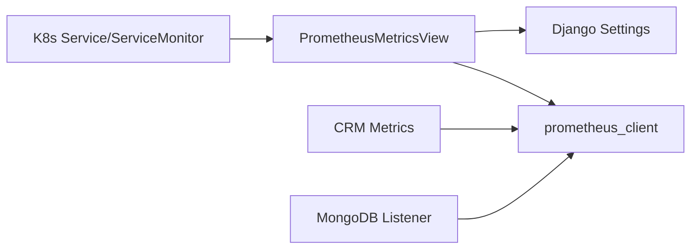

# Security Metrics Collection

<cite>
**Referenced Files in This Document**
- [metrics_endpoint.py](file://backend/django/apps/core/metrics_endpoint.py)
- [base.py](file://backend/django/core/settings/base.py)
- [urls.py](file://backend/django/core/urls.py)
- [metrics.py](file://backend/django/apps/crm/observability/metrics.py)
- [mongodb.py](file://backend/django/apps/core/mongodb.py)
- [security.py](file://backend/django/apps/crm/security.py)
- [prometheus.yaml](file://infra/kubernetes/monitoring/prometheus.yaml)
- [servicemonitor.yaml](file://infra/helm/jol-hub/templates/servicemonitor.yaml)
</cite>

## Table of Contents
1. Introduction
2. Project Structure
3. Core Components
4. Architecture Overview
5. Detailed Component Analysis
6. Dependency Analysis
7. Performance Considerations
8. Troubleshooting Guide
9. Conclusion
10. Appendices

## Introduction
This document explains the security metrics collection system in JOL-HUB, focusing on the Prometheus /metrics endpoint implementation, its access controls (IP allowlist and bearer token), how security-related metrics are collected and labeled, multi-process support for Gunicorn deployments, and GDPR-compliant labeling practices. It also provides guidance for configuring Prometheus scraping, setting up security-specific metrics collectors, and monitoring access patterns to sensitive endpoints.

## Project Structure
The security metrics pipeline spans several modules:
- A secure Prometheus /metrics HTTP view that enforces IP allowlisting and optional bearer-token authentication.
- Application-level Prometheus metric definitions for CRM operations, GDPR requests, security events, and audit integrity.
- MongoDB command observability via a PyMongo CommandListener that exposes query duration, counts, and errors.
- Django settings that expose environment-driven configuration for Prometheus access control and multi-process mode.
- URL routing that mounts core endpoints including /metrics.
- Kubernetes/Helm manifests that deploy Prometheus and optionally scrape the service via ServiceMonitor.

**Diagram sources**
- [metrics_endpoint.py:68-153](file://backend/django/apps/core/metrics_endpoint.py#L68-L153)
- [metrics.py:33-113](file://backend/django/apps/crm/observability/metrics.py#L33-L113)
- [mongodb.py:62-91](file://backend/django/apps/core/mongodb.py#L62-L91)
- [prometheus.yaml:182-224](file://infra/kubernetes/monitoring/prometheus.yaml#L182-L224)
- [servicemonitor.yaml:1-19](file://infra/helm/jol-hub/templates/servicemonitor.yaml#L1-L19)

**Section sources**
- [urls.py:39-42](file://backend/django/core/urls.py#L39-L42)
- [base.py:672-686](file://backend/django/core/settings/base.py#L672-L686)

## Core Components
- PrometheusMetricsView: Securely serves Prometheus text exposition with IP allowlist and optional bearer token checks; supports multi-process aggregation.
- CRM Observability Metrics: Pre-defined counters, histograms, and gauges for request volume/latency, data access, GDPR requests/response time, security events, tenant isolation violations, audit entries/integrity, Bitrix24 sync, and circuit breaker state.
- MongoDB Observability: PyMongo listener records per-command durations, totals, and errors; logs slow queries based on configurable thresholds.
- Settings: Environment variables drive PROMETHEUS_ALLOWED_IPS, PROMETHEUS_AUTH_TOKEN, and PROMETHEUS_MULTIPROC_DIR.

**Section sources**
- [metrics_endpoint.py:68-153](file://backend/django/apps/core/metrics_endpoint.py#L68-L153)
- [metrics.py:33-113](file://backend/django/apps/crm/observability/metrics.py#L33-L113)
- [mongodb.py:62-91](file://backend/django/apps/core/mongodb.py#L62-L91)
- [base.py:672-686](file://backend/django/core/settings/base.py#L672-L686)

## Architecture Overview
The /metrics endpoint is mounted under the core app URLs and protected by application-level controls before rendering metrics from the Prometheus registry. In multi-process deployments, metrics from all workers are aggregated using prometheus_client multiprocess support.

**Diagram sources**
- [metrics_endpoint.py:48-153](file://backend/django/apps/core/metrics_endpoint.py#L48-L153)
- [base.py:672-686](file://backend/django/core/settings/base.py#L672-L686)

## Detailed Component Analysis

### Prometheus /metrics Endpoint (Security Controls and Multi-Process Support)
- Access Control:
  - IP allowlist: If PROMETHEUS_ALLOWED_IPS is set, only listed IPs can access /metrics. Requests from other IPs receive 403.
  - Bearer token: If PROMETHEUS_AUTH_TOKEN is set, the Authorization header must start with "Bearer " followed by the exact token value. Mismatches return 403.
- Client IP Resolution:
  - Uses X-Forwarded-For first entry when present; otherwise falls back to REMOTE_ADDR.
- Metrics Aggregation:
  - If PROMETHEUS_MULTIPROC_DIR is set, uses prometheus_client.multiprocess.MultiProcessCollector to aggregate across Gunicorn workers. Otherwise, uses the default global registry.
- Output:
  - Returns standard Prometheus text format with content type text/plain; version=0.0.4; charset=utf-8.

**Diagram sources**
- [metrics_endpoint.py:48-153](file://backend/django/apps/core/metrics_endpoint.py#L48-L153)

**Section sources**
- [metrics_endpoint.py:48-153](file://backend/django/apps/core/metrics_endpoint.py#L48-L153)
- [base.py:672-686](file://backend/django/core/settings/base.py#L672-L686)

### CRM Security Metrics and Labeling (GDPR-Compliant)
- Request Metrics:
  - Counters and histograms for CRM API requests with labels such as tenant_id, endpoint, method, status.
- Data Access Metrics:
  - Counter for data access operations with labels tenant_id, entity_type, operation, data_classification.
- GDPR Metrics:
  - Counters for GDPR data subject requests with labels tenant_id, request_type, status.
  - Histograms for response times in days with buckets aligned to SLA expectations.
- Security Metrics:
  - Counter for security-related events with labels tenant_id, event_type, severity.
  - Counter for tenant isolation violation attempts with labels tenant_id, source_tenant, target_tenant.
- Audit Metrics:
  - Counters for audit log entries and gauges for audit integrity checks with tenant_id label.
- External Integrations:
  - Counters and histograms for Bitrix24 sync operations and latency with tenant_id and entity_type labels.
- Circuit Breaker:
  - Gauge indicating open/closed state per tenant and service.

GDPR compliance note: Labels do not include personally identifiable information. Sensitive identifiers are abstracted (e.g., tenant_id).

**Section sources**
- [metrics.py:33-113](file://backend/django/apps/crm/observability/metrics.py#L33-L113)

### MongoDB Query Observability
- Exposed Metrics:
  - mongodb_query_duration_seconds: Histogram with buckets tuned to detect slow queries and N+1 issues.
  - mongodb_queries_total: Counter by command_name, collection, database.
  - mongodb_query_errors_total: Counter by command_name, error_code, database.
  - mongodb_pool_active_connections and mongodb_pool_available_connections: Gauges by server.
- Implementation:
  - A PyMongo CommandListener captures started/succeeded/failed events and updates metrics.
  - Slow queries above a configurable threshold are logged as warnings.

**Diagram sources**
- [mongodb.py:101-219](file://backend/django/apps/core/mongodb.py#L101-L219)
- [mongodb.py:62-91](file://backend/django/apps/core/mongodb.py#L62-L91)

**Section sources**
- [mongodb.py:62-91](file://backend/django/apps/core/mongodb.py#L62-L91)
- [mongodb.py:101-219](file://backend/django/apps/core/mongodb.py#L101-L219)

### URL Routing and Mounting
- The core app URLs are included at the root path, making /health, /ready, and /metrics top-level endpoints.
- The /metrics route is provided by apps.core.urls and served by PrometheusMetricsView.

**Section sources**
- [urls.py:39-42](file://backend/django/core/urls.py#L39-L42)

### Kubernetes and Helm Integration
- Prometheus deployment includes storage and resource limits suitable for scraping workloads.
- ServiceMonitor enables automatic discovery of the backend service’s metrics endpoint for Prometheus scraping.

**Section sources**
- [prometheus.yaml:182-224](file://infra/kubernetes/monitoring/prometheus.yaml#L182-L224)
- [servicemonitor.yaml:1-19](file://infra/helm/jol-hub/templates/servicemonitor.yaml#L1-L19)

## Dependency Analysis
- PrometheusMetricsView depends on:
  - Django settings for access control and multi-process directory.
  - prometheus_client for registry and exposition.
  - DRF Response for standardized error responses.
- CRM observability metrics depend on:
  - Django ORM and cache for reporting and rate limiting.
  - prometheus_client for metric types.
- MongoDB observability depends on:
  - pymongo.monitoring.CommandListener interface.
  - prometheus_client for metric types.
- Infrastructure depends on:
  - Kubernetes Service and ServiceMonitor to expose and discover metrics endpoints.

**Diagram sources**
- [metrics_endpoint.py:34-45](file://backend/django/apps/core/metrics_endpoint.py#L34-L45)
- [metrics.py:22-26](file://backend/django/apps/crm/observability/metrics.py#L22-L26)
- [mongodb.py:48-52](file://backend/django/apps/core/mongodb.py#L48-L52)
- [servicemonitor.yaml:1-19](file://infra/helm/jol-hub/templates/servicemonitor.yaml#L1-L19)

**Section sources**
- [metrics_endpoint.py:34-45](file://backend/django/apps/core/metrics_endpoint.py#L34-L45)
- [metrics.py:22-26](file://backend/django/apps/crm/observability/metrics.py#L22-L26)
- [mongodb.py:48-52](file://backend/django/apps/core/mongodb.py#L48-L52)

## Performance Considerations
- Multi-process aggregation:
  - Set PROMETHEUS_MULTIPROC_DIR to enable aggregation across Gunicorn workers. Ensure the directory is writable and shared across processes.
- Histogram bucket selection:
  - MongoDB query duration histogram uses fine-grained buckets below 100ms and coarser buckets beyond, aiding detection of slow queries and N+1 patterns.
- Logging:
  - Slow MongoDB queries are logged as warnings when exceeding the configured threshold. Tune MONGODB_SLOW_QUERY_THRESHOLD_S to your workload.
- Rate limiting:
  - CRM security module includes rate limiting configurations for sensitive operations (e.g., GDPR export/delete). Apply appropriate limits to protect endpoints.

[No sources needed since this section provides general guidance]

## Troubleshooting Guide
Common issues and resolutions:
- 403 Forbidden on /metrics:
  - Verify PROMETHEUS_ALLOWED_IPS includes the scraping IP or CIDR range.
  - If PROMETHEUS_AUTH_TOKEN is set, ensure the Authorization header contains the correct bearer token.
- Missing metrics from workers:
  - Confirm PROMETHEUS_MULTIPROC_DIR is set and accessible by all workers.
  - Ensure prometheus_client multiprocess files are generated in the configured directory.
- High error rates in MongoDB metrics:
  - Inspect mongodb_query_errors_total labels for error_code and database to identify failing commands.
  - Review slow query logs and adjust indexes or queries accordingly.
- GDPR-sensitive labels:
  - Ensure no PII is used in metric labels. Use tenant_id and abstracted identifiers instead.

**Section sources**
- [metrics_endpoint.py:95-129](file://backend/django/apps/core/metrics_endpoint.py#L95-L129)
- [mongodb.py:161-172](file://backend/django/apps/core/mongodb.py#L161-L172)
- [metrics.py:33-113](file://backend/django/apps/crm/observability/metrics.py#L33-L113)

## Conclusion
JOL-HUB’s security metrics collection combines a hardened /metrics endpoint with robust access controls and comprehensive observability across CRM, GDPR, audit, and MongoDB layers. With environment-driven configuration, multi-process support, and Kubernetes-native integration, teams can securely scrape and monitor sensitive operational signals while adhering to GDPR principles through careful label design.

[No sources needed since this section summarizes without analyzing specific files]

## Appendices

### Configuration Reference
- Prometheus access control:
  - PROMETHEUS_ALLOWED_IPS: Comma-separated list of IPs/CIDRs allowed to access /metrics. Empty allows all (development default).
  - PROMETHEUS_AUTH_TOKEN: Optional bearer token required for /metrics access.
  - PROMETHEUS_MULTIPROC_DIR: Directory for prometheus_client multiprocess aggregation when running multiple workers.
- MongoDB observability:
  - MONGODB_SLOW_QUERY_THRESHOLD_S: Threshold in seconds for logging slow queries.

**Section sources**
- [base.py:672-686](file://backend/django/core/settings/base.py#L672-L686)
- [base.py:719-722](file://backend/django/core/settings/base.py#L719-L722)

### Prometheus Scraping Examples
- Direct HTTP scrape:
  - Configure Prometheus to scrape http://<service>/metrics with basic auth disabled and bearer token enabled if PROMETHEUS_AUTH_TOKEN is set.
- Kubernetes ServiceMonitor:
  - Use the provided ServiceMonitor template to auto-discover the backend service and scrape /metrics at a defined interval.

**Section sources**
- [servicemonitor.yaml:1-19](file://infra/helm/jol-hub/templates/servicemonitor.yaml#L1-L19)
- [prometheus.yaml:182-224](file://infra/kubernetes/monitoring/prometheus.yaml#L182-L224)

### Monitoring Access Patterns to Sensitive Endpoints
- Track failed access attempts and security events:
  - Use jolhub_security_events_total with labels tenant_id, event_type, severity.
  - Correlate with audit entries and GDPR request metrics to detect anomalies.
- Monitor tenant isolation violations:
  - Use jolhub_tenant_isolation_violations_total to detect cross-tenant access attempts.

**Section sources**
- [metrics.py:68-79](file://backend/django/apps/crm/observability/metrics.py#L68-L79)
- [security.py:494-523](file://backend/django/apps/crm/security.py#L494-L523)