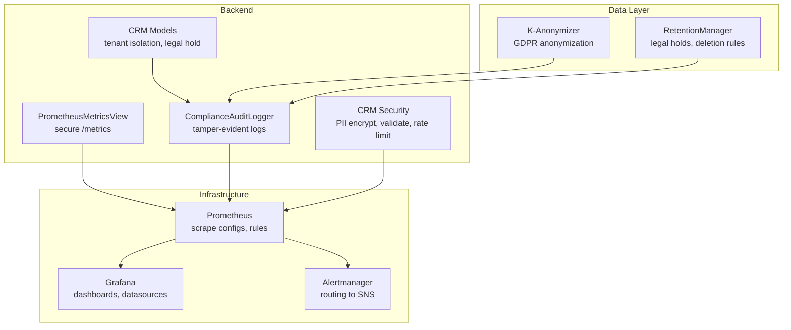
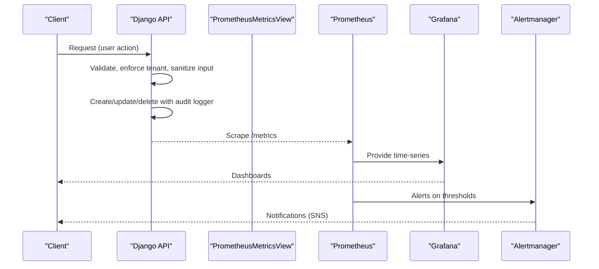
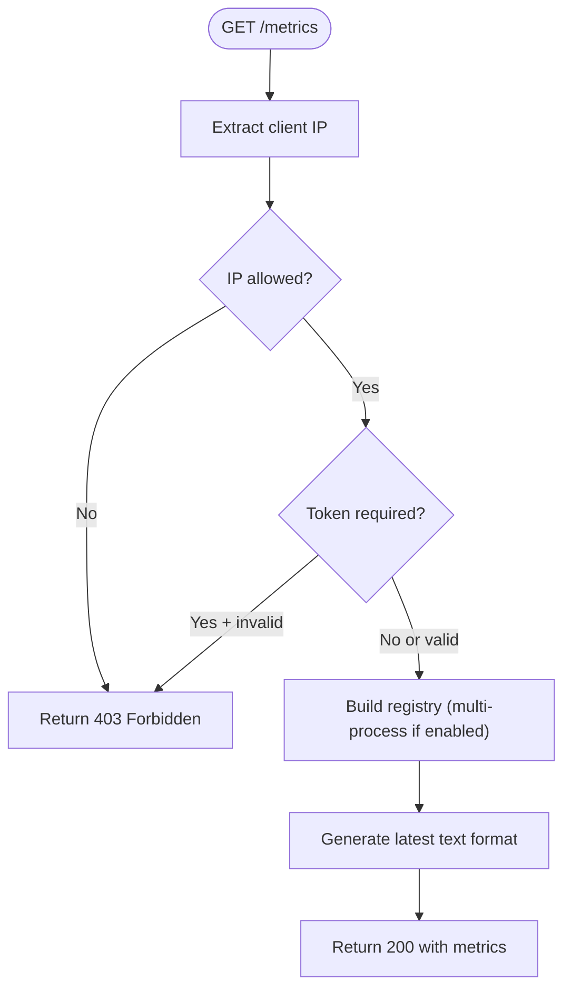
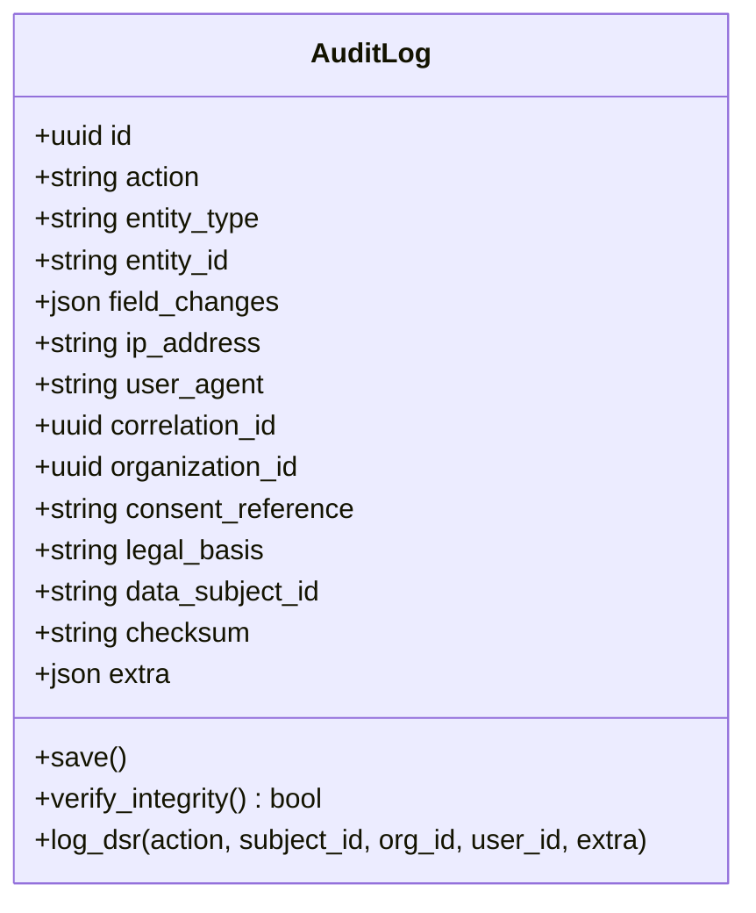
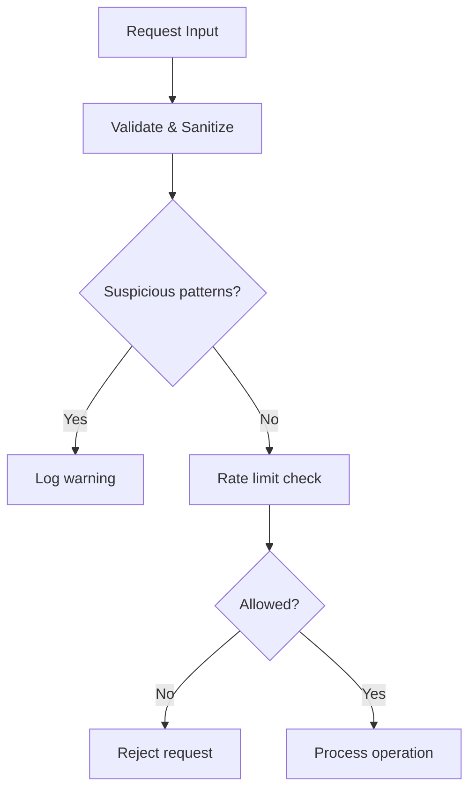
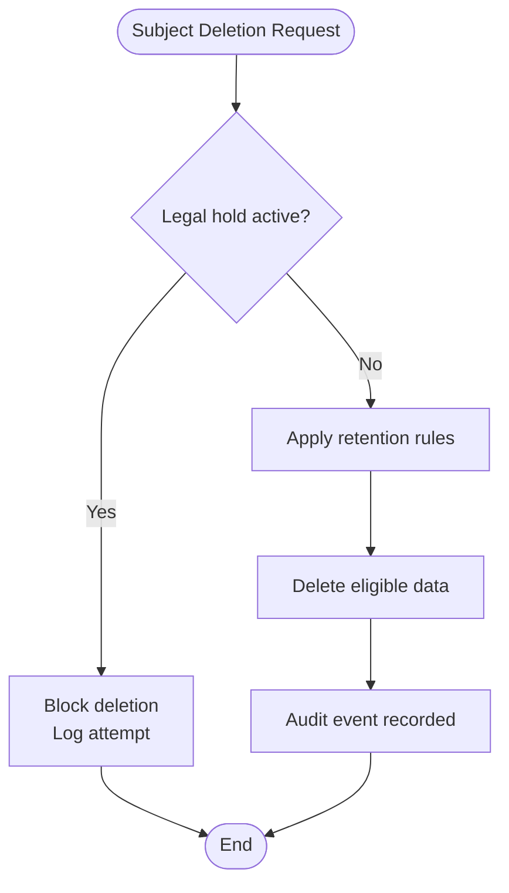
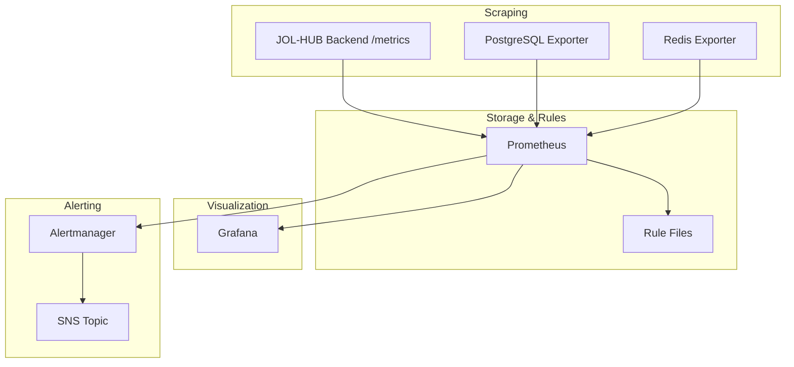
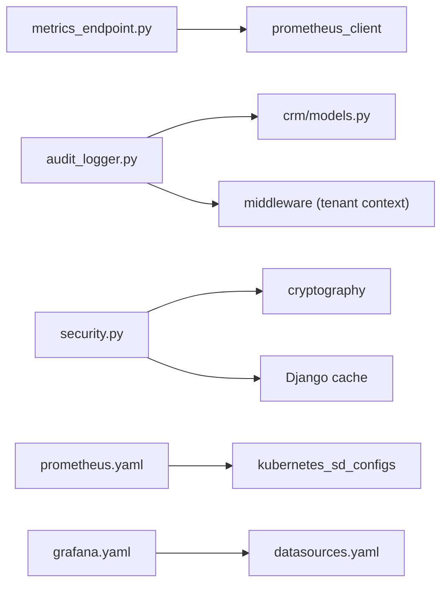

# Security Monitoring & Detection

<cite>
**Referenced Files in This Document**
- [metrics_endpoint.py](file://backend/django/apps/core/metrics_endpoint.py)
- [models.py](file://backend/django/apps/core/models.py)
- [audit_logger.py](file://backend/django/apps/crm/audit_logger.py)
- [security.py](file://backend/django/apps/crm/security.py)
- [crm_models.py](file://backend/django/apps/crm/models.py)
- [anonymizer.py](file://data/src/gdpr/anonymizer.py)
- [retention_manager.py](file://data/src/gdpr/retention_manager.py)
- [prometheus.yaml](file://infra/kubernetes/monitoring/prometheus.yaml)
- [grafana.yaml](file://infra/kubernetes/monitoring/grafana.yaml)
- [alert-rules.yml](file://frontend/apps/template-renderer/observability/alert-rules.yml)
- [rules.yaml.tpl](file://infra/terraform/modules/monitoring/templates/rules.yaml.tpl)
- [alertmanager.yaml.tpl](file://infra/terraform/modules/monitoring/templates/alertmanager.yaml.tpl)
- [main.tf](file://infra/terraform/modules/monitoring/main.tf)
- [security-model.md](file://docs/architecture/security-model.md)
- [data-flow.md](file://docs/architecture/data-flow.md)
</cite>

## Table of Contents
1. Introduction
2. Project Structure
3. Core Components
4. Architecture Overview
5. Detailed Component Analysis
6. Dependency Analysis
7. Performance Considerations
8. Troubleshooting Guide
9. Conclusion
10. Appendices

## Introduction
This document explains the JOL-HUB platform’s security monitoring and detection capabilities, including:
- Security metrics collection via a secure Prometheus endpoint
- Comprehensive audit logging with tamper-evident integrity controls
- Real-time threat detection patterns and alerting rules
- Integration with Prometheus and Grafana for observability and dashboards
- GDPR-compliant audit trails, anomaly detection helpers, and automated alerts
- Examples to set up dashboards, configure alerts, and track security performance metrics

The goal is to provide both technical depth and accessible guidance for operators, security teams, and compliance stakeholders.

## Project Structure
Security-related components are distributed across backend Django apps, data processing utilities, and infrastructure manifests:
- Backend metrics endpoint exposes Prometheus-compatible metrics with IP allowlist and optional bearer token protection
- Audit logging captures user actions, GDPR events, consent changes, and financial transactions with integrity checks
- CRM security module provides PII encryption, input validation, rate limiting, and tenant isolation enforcement
- Data layer includes k-anonymization and retention/legal hold management aligned with GDPR
- Infrastructure defines Prometheus scraping, Grafana dashboards, alerting rules, and cloud-managed monitoring

**Diagram sources**
- [metrics_endpoint.py:68-153](file://backend/django/apps/core/metrics_endpoint.py#L68-L153)
- [audit_logger.py:154-716](file://backend/django/apps/crm/audit_logger.py#L154-L716)
- [security.py:38-524](file://backend/django/apps/crm/security.py#L38-L524)
- [crm_models.py:71-196](file://backend/django/apps/crm/models.py#L71-L196)
- [anonymizer.py:106-180](file://data/src/gdpr/anonymizer.py#L106-L180)
- [retention_manager.py:188-336](file://data/src/gdpr/retention_manager.py#L188-L336)
- [prometheus.yaml:57-152](file://infra/kubernetes/monitoring/prometheus.yaml#L57-L152)
- [grafana.yaml:5-49](file://infra/kubernetes/monitoring/grafana.yaml#L5-L49)
- [alertmanager.yaml.tpl:1-24](file://infra/terraform/modules/monitoring/templates/alertmanager.yaml.tpl#L1-L24)

**Section sources**
- [metrics_endpoint.py:1-154](file://backend/django/apps/core/metrics_endpoint.py#L1-L154)
- [prometheus.yaml:1-225](file://infra/kubernetes/monitoring/prometheus.yaml#L1-L225)
- [grafana.yaml:1-354](file://infra/kubernetes/monitoring/grafana.yaml#L1-L354)

## Core Components
- Secure Prometheus metrics endpoint: restricts access by IP allowlist and optional bearer token; supports multi-process collectors; does not log request bodies or query parameters; labels must avoid PII.
- Tamper-evident audit logging: records actions, field changes, actor context, legal basis, and checksums; enforces tenant isolation; supports GDPR DSR and consent change tracking.
- CRM security controls: PII encryption, input sanitization (SQLi/XSS prevention), sliding-window rate limiting per tenant/user/IP, decorators for cross-tenant access prevention and consent requirements.
- GDPR privacy utilities: k-anonymity with country-specific thresholds; retention manager with legal hold registry preventing unauthorized deletions.
- Observability stack: Prometheus scrapes backend and services; Grafana provisions dashboards and datasources; Alertmanager routes alerts to SNS; Terraform configures AWS Managed Grafana and rule groups.

**Section sources**
- [metrics_endpoint.py:68-153](file://backend/django/apps/core/metrics_endpoint.py#L68-L153)
- [models.py:67-227](file://backend/django/apps/core/models.py#L67-L227)
- [audit_logger.py:154-716](file://backend/django/apps/crm/audit_logger.py#L154-L716)
- [security.py:38-524](file://backend/django/apps/crm/security.py#L38-L524)
- [anonymizer.py:25-180](file://data/src/gdpr/anonymizer.py#L25-L180)
- [retention_manager.py:188-336](file://data/src/gdpr/retention_manager.py#L188-L336)
- [prometheus.yaml:57-152](file://infra/kubernetes/monitoring/prometheus.yaml#L57-L152)
- [grafana.yaml:5-49](file://infra/kubernetes/monitoring/grafana.yaml#L5-L49)
- [alertmanager.yaml.tpl:1-24](file://infra/terraform/modules/monitoring/templates/alertmanager.yaml.tpl#L1-L24)
- [main.tf:34-138](file://infra/terraform/modules/monitoring/main.tf#L34-L138)

## Architecture Overview
The security observability pipeline collects metrics and audit events from the backend, stores them in Prometheus, visualizes them in Grafana, and triggers alerts via Alertmanager.

**Diagram sources**
- [metrics_endpoint.py:84-153](file://backend/django/apps/core/metrics_endpoint.py#L84-L153)
- [audit_logger.py:218-716](file://backend/django/apps/crm/audit_logger.py#L218-L716)
- [prometheus.yaml:57-152](file://infra/kubernetes/monitoring/prometheus.yaml#L57-L152)
- [grafana.yaml:5-49](file://infra/kubernetes/monitoring/grafana.yaml#L5-L49)
- [alertmanager.yaml.tpl:1-24](file://infra/terraform/modules/monitoring/templates/alertmanager.yaml.tpl#L1-L24)

## Detailed Component Analysis

### Secure Prometheus Metrics Endpoint
- Access control: IP allowlist enforced; optional Bearer token check; logs denied attempts.
- Multi-process support: Aggregates metrics across workers when configured.
- GDPR-safe: No request body/parameter logging; labels must be non-PII.

**Diagram sources**
- [metrics_endpoint.py:48-153](file://backend/django/apps/core/metrics_endpoint.py#L48-L153)

**Section sources**
- [metrics_endpoint.py:1-154](file://backend/django/apps/core/metrics_endpoint.py#L1-L154)

### Audit Logging and Integrity
- Event types: create/update/delete/access/export, GDPR DSR, consent changes, financial transactions, security events.
- Integrity: SHA-256 checksum per entry; HMAC signatures for external systems; sequence numbering and chain verification.
- Tenant isolation: Enforced at save time; prevents cross-tenant audit creation.
- Context injection: Captures user, IP, user agent, correlation ID, organization, legal basis.

**Diagram sources**
- [models.py:67-227](file://backend/django/apps/core/models.py#L67-L227)

**Section sources**
- [models.py:67-227](file://backend/django/apps/core/models.py#L67-L227)
- [audit_logger.py:154-716](file://backend/django/apps/crm/audit_logger.py#L154-L716)

### CRM Security Controls
- PII encryption: Fernet-based symmetric encryption with key derivation from secret; encrypt/decrypt dict helpers.
- Input validation: Email/phone normalization; SQL injection and XSS pattern detection; text sanitization.
- Rate limiting: Sliding window per tenant/user/IP with configurable policies for sensitive operations (GDPR export/delete, financial).
- Tenant isolation: Decorators prevent cross-tenant access; middleware-derived tenant context used throughout.

**Diagram sources**
- [security.py:148-421](file://backend/django/apps/crm/security.py#L148-L421)

**Section sources**
- [security.py:38-524](file://backend/django/apps/crm/security.py#L38-L524)

### GDPR Anonymization and Retention
- K-anonymity: Country-specific k thresholds; hashing direct identifiers; group size checks; rounding counts to satisfy k.
- Retention and legal holds: Configurable retention rules; legal hold registry blocks deletions; audit logs all blocked attempts; supports dry-run reporting.

**Diagram sources**
- [anonymizer.py:106-180](file://data/src/gdpr/anonymizer.py#L106-L180)
- [retention_manager.py:188-336](file://data/src/gdpr/retention_manager.py#L188-L336)

**Section sources**
- [anonymizer.py:25-180](file://data/src/gdpr/anonymizer.py#L25-L180)
- [retention_manager.py:1-336](file://data/src/gdpr/retention_manager.py#L1-L336)

### Observability Stack: Prometheus and Grafana
- Prometheus configuration: scrape jobs for Kubernetes API, nodes, pods, JOL-HUB backend, PostgreSQL and Redis exporters; rule files mounted; alerting targets configured.
- Grafana provisioning: datasources for Prometheus and Loki; dashboard provider; pre-baked overview dashboard JSON.
- Cloud integration: Terraform provisions Amazon Managed Grafana workspace, Prometheus rule groups, and Alertmanager routing to SNS.

**Diagram sources**
- [prometheus.yaml:57-152](file://infra/kubernetes/monitoring/prometheus.yaml#L57-L152)
- [grafana.yaml:5-49](file://infra/kubernetes/monitoring/grafana.yaml#L5-L49)
- [alertmanager.yaml.tpl:1-24](file://infra/terraform/modules/monitoring/templates/alertmanager.yaml.tpl#L1-L24)
- [main.tf:34-138](file://infra/terraform/modules/monitoring/main.tf#L34-L138)

**Section sources**
- [prometheus.yaml:1-225](file://infra/kubernetes/monitoring/prometheus.yaml#L1-L225)
- [grafana.yaml:1-354](file://infra/kubernetes/monitoring/grafana.yaml#L1-L354)
- [main.tf:34-138](file://infra/terraform/modules/monitoring/main.tf#L34-L138)

## Dependency Analysis
- The metrics endpoint depends on Prometheus client libraries and Django settings for IP allowlist and optional token auth.
- Audit logging depends on CRM models and middleware for tenant context; integrates with external systems via structured logging.
- CRM security depends on cryptography library and cache for rate limiting; uses middleware for tenant resolution.
- Observability stack depends on Kubernetes service discovery and RBAC; Grafana depends on provisioned datasources and dashboards.

**Diagram sources**
- [metrics_endpoint.py:27-45](file://backend/django/apps/core/metrics_endpoint.py#L27-L45)
- [audit_logger.py:18-36](file://backend/django/apps/crm/audit_logger.py#L18-L36)
- [security.py:22-29](file://backend/django/apps/crm/security.py#L22-L29)
- [prometheus.yaml:74-152](file://infra/kubernetes/monitoring/prometheus.yaml#L74-L152)
- [grafana.yaml:5-22](file://infra/kubernetes/monitoring/grafana.yaml#L5-L22)

**Section sources**
- [metrics_endpoint.py:1-154](file://backend/django/apps/core/metrics_endpoint.py#L1-L154)
- [audit_logger.py:1-716](file://backend/django/apps/crm/audit_logger.py#L1-L716)
- [security.py:1-524](file://backend/django/apps/crm/security.py#L1-L524)
- [prometheus.yaml:1-225](file://infra/kubernetes/monitoring/prometheus.yaml#L1-L225)
- [grafana.yaml:1-354](file://infra/kubernetes/monitoring/grafana.yaml#L1-L354)

## Performance Considerations
- Metrics endpoint: Avoid high cardinality labels; use multiprocess collector only when needed; ensure Prometheus scrape intervals align with evaluation intervals.
- Audit logging: Batch writes where possible; index frequently queried fields; keep checksum computation efficient; avoid logging sensitive payloads.
- Rate limiting: Cache-backed sliding windows reduce DB pressure; tune limits per operation sensitivity.
- Observability: Limit retention to necessary durations; partition namespaces; use targeted scrape configs to reduce overhead.

[No sources needed since this section provides general guidance]

## Troubleshooting Guide
- Metrics endpoint returns 403:
  - Verify client IP is in PROMETHEUS_ALLOWED_IPS; confirm Bearer token matches PROMETHEUS_AUTH_TOKEN if configured.
  - Check logs for “Metrics access denied” warnings.
- Missing metrics in Prometheus:
  - Ensure pod annotations enable scraping and correct paths/ports; verify RBAC allows /metrics access.
- Audit integrity failures:
  - Use verify_integrity to detect tampering; review checksum generation and tenant context validation errors.
- GDPR erasure blocked:
  - Check legal hold registry for active holds; inspect audit logs for “erasure_blocked” entries.
- Alerts not firing:
  - Confirm rule files are mounted and evaluated; validate expressions and thresholds; check Alertmanager receivers and SNS topics.

**Section sources**
- [metrics_endpoint.py:95-129](file://backend/django/apps/core/metrics_endpoint.py#L95-L129)
- [models.py:156-212](file://backend/django/apps/core/models.py#L156-L212)
- [retention_manager.py:257-336](file://data/src/gdpr/retention_manager.py#L257-L336)
- [prometheus.yaml:57-152](file://infra/kubernetes/monitoring/prometheus.yaml#L57-L152)
- [alertmanager.yaml.tpl:1-24](file://infra/terraform/modules/monitoring/templates/alertmanager.yaml.tpl#L1-L24)

## Conclusion
JOL-HUB implements a robust security monitoring and detection framework:
- A hardened metrics endpoint ensures safe exposure of observability data
- Comprehensive, tamper-evident audit logging supports compliance and incident response
- Strong CRM security controls protect PII and enforce tenant isolation
- GDPR utilities provide anonymization and retention with legal hold safeguards
- Integrated Prometheus/Grafana/Alertmanager deliver real-time visibility and automated alerts

These components together enable proactive threat detection, compliance reporting, and operational resilience.

[No sources needed since this section summarizes without analyzing specific files]

## Appendices

### Example: Setting Up Security Dashboards
- Provision Grafana datasources for Prometheus and Loki
- Load the provided dashboard JSON for an overview view
- Add panels for:
  - Failed access attempts over time
  - Audit entries last 24 hours
  - Compliance score and issues
  - API latency percentiles

**Section sources**
- [grafana.yaml:5-49](file://infra/kubernetes/monitoring/grafana.yaml#L5-L49)
- [data-flow.md:384-453](file://docs/architecture/data-flow.md#L384-L453)

### Example: Configuring Alerts for Suspicious Activities
- Define Prometheus rules for:
  - High error rates and HTTP 5xx spikes
  - Authentication failures and unauthorized access attempts
  - Database connections approaching limits
  - Redis memory usage thresholds
- Route critical alerts to SNS via Alertmanager

**Section sources**
- [alert-rules.yml:18-144](file://frontend/apps/template-renderer/observability/alert-rules.yml#L18-L144)
- [rules.yaml.tpl:37-76](file://infra/terraform/modules/monitoring/templates/rules.yaml.tpl#L37-L76)
- [alertmanager.yaml.tpl:1-24](file://infra/terraform/modules/monitoring/templates/alertmanager.yaml.tpl#L1-L24)

### Example: Implementing Security Performance Metrics
- Expose metrics for:
  - Failed access attempts
  - Audit integrity status
  - Consent changes and DSR requests
  - Financial transaction volumes
- Visualize in Grafana and set thresholds for anomalies

**Section sources**
- [audit_logger.py:449-502](file://backend/django/apps/crm/audit_logger.py#L449-L502)
- [security-model.md:320-348](file://docs/architecture/security-model.md#L320-L348)