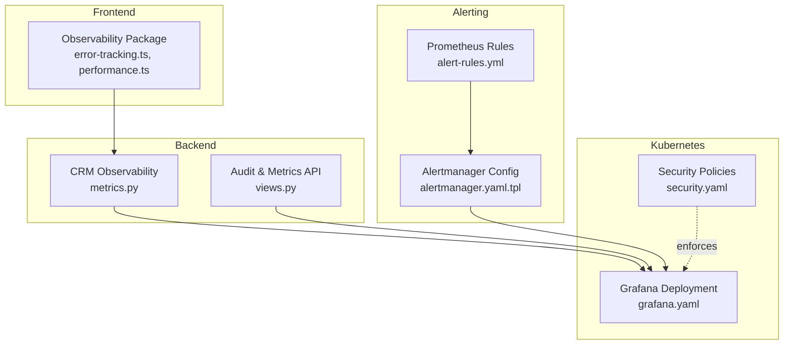
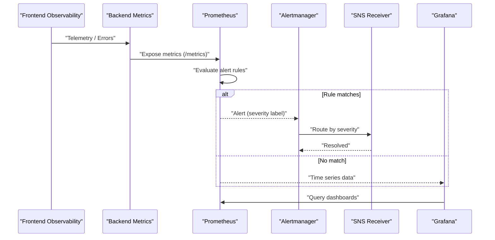
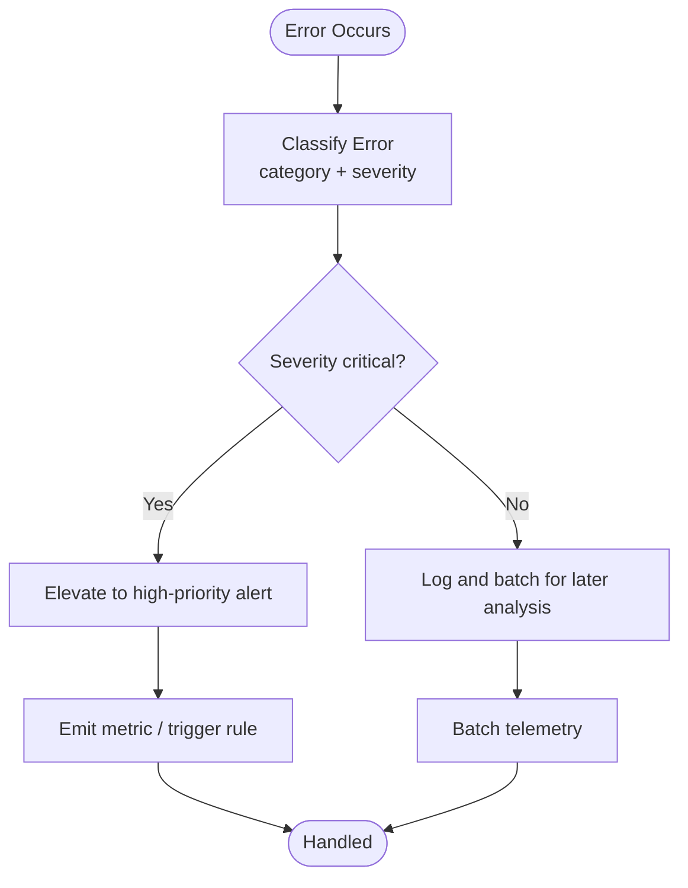
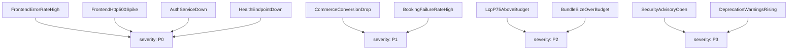
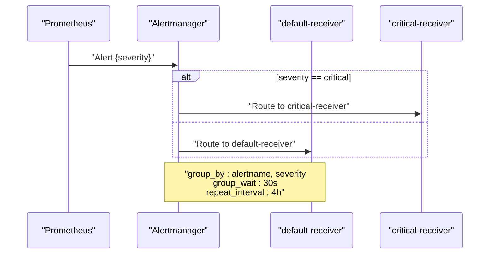
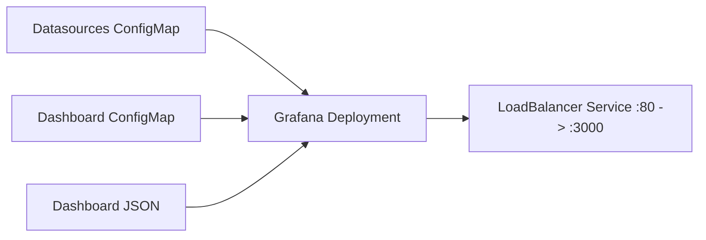
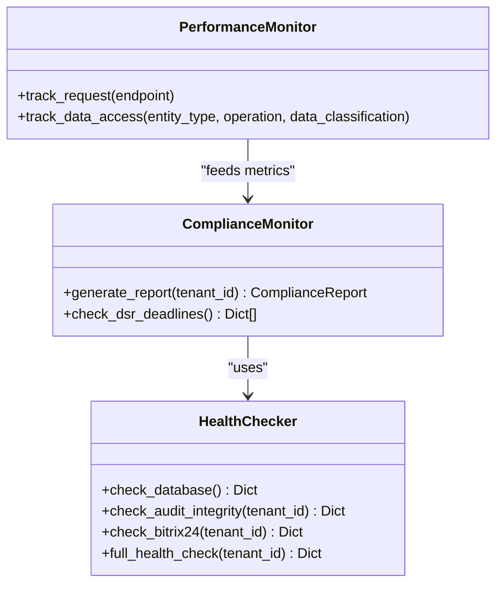
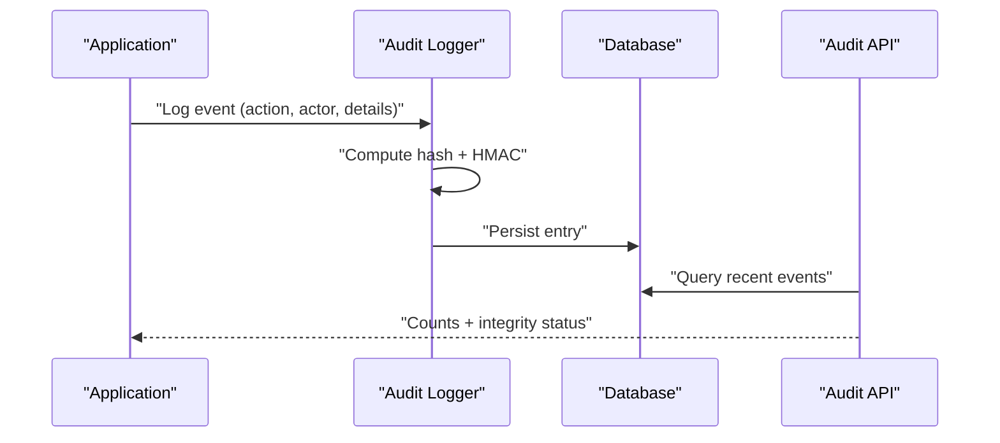
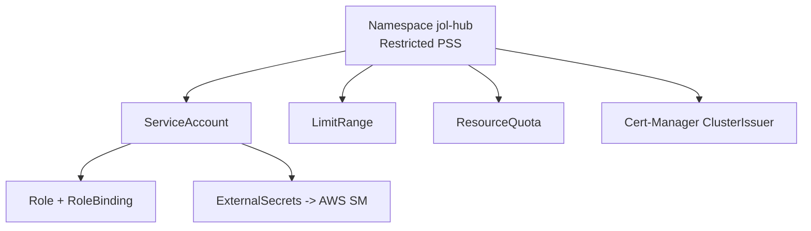
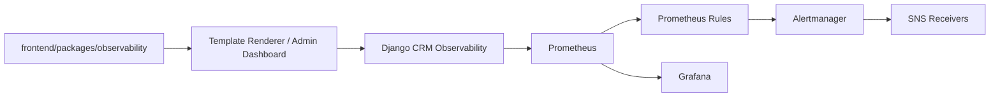

# Threat Detection & Alerting

<cite>
**Referenced Files in This Document**
- [security-model.md](file://docs/architecture/security-model.md)
- [alert-rules.yml](file://frontend/apps/template-renderer/observability/alert-rules.yml)
- [grafana.yaml](file://infra/kubernetes/monitoring/grafana.yaml)
- [alertmanager.yaml.tpl](file://infra/terraform/modules/monitoring/templates/alertmanager.yaml.tpl)
- [metrics.py](file://backend/django/apps/crm/observability/metrics.py)
- [error-tracking.ts](file://frontend/packages/observability/src/error-tracking.ts)
- [performance.ts](file://frontend/packages/observability/src/performance.ts)
- [index.ts](file://frontend/packages/observability/src/index.ts)
- [security.yaml](file://infra/kubernetes/security/security.yaml)
- [SECURITY.md](file://.github/SECURITY.md)
- [audit.py](file://data/src/audit.py)
- [views.py](file://backend/django/apps/crm/api/views.py)
</cite>

## Table of Contents
1. [Introduction](#introduction)
2. [Project Structure](#project-structure)
3. [Core Components](#core-components)
4. [Architecture Overview](#architecture-overview)
5. [Detailed Component Analysis](#detailed-component-analysis)
6. [Dependency Analysis](#dependency-analysis)
7. [Performance Considerations](#performance-considerations)
8. [Troubleshooting Guide](#troubleshooting-guide)
9. [Conclusion](#conclusion)
10. [Appendices](#appendices)

## Introduction
This document explains the threat detection and alerting mechanisms in JOL-HUB, focusing on anomaly detection, real-time threat scoring, automated alerting workflows, and integration with Prometheus and Grafana for security observability. It also covers configuration of alert rules, notification channels, escalation procedures, and examples for dashboards, alerts, and automated responses.

## Project Structure
JOL-HUB implements a layered approach to security monitoring:
- Frontend observability package provides error classification, performance metrics, and batching for telemetry.
- Backend exposes Prometheus metrics and compliance/health checks.
- Kubernetes manifests provision Grafana, Prometheus, and Alertmanager routing.
- Terraform templates configure Alertmanager receivers and routing.
- Security policies and secrets management are enforced via Kubernetes resources.

**Diagram sources**
- [grafana.yaml:1-414](file://infra/kubernetes/monitoring/grafana.yaml#L1-L414)
- [alertmanager.yaml.tpl:1-25](file://infra/terraform/modules/monitoring/templates/alertmanager.yaml.tpl#L1-L25)
- [alert-rules.yml:1-144](file://frontend/apps/template-renderer/observability/alert-rules.yml#L1-L144)
- [metrics.py:1-478](file://backend/django/apps/crm/observability/metrics.py#L1-L478)
- [security.yaml:1-187](file://infra/kubernetes/security/security.yaml#L1-L187)

**Section sources**
- [grafana.yaml:1-414](file://infra/kubernetes/monitoring/grafana.yaml#L1-L414)
- [alertmanager.yaml.tpl:1-25](file://infra/terraform/modules/monitoring/templates/alertmanager.yaml.tpl#L1-L25)
- [alert-rules.yml:1-144](file://frontend/apps/template-renderer/observability/alert-rules.yml#L1-L144)
- [metrics.py:1-478](file://backend/django/apps/crm/observability/metrics.py#L1-L478)
- [security.yaml:1-187](file://infra/kubernetes/security/security.yaml#L1-L187)

## Core Components
- Prometheus rule definitions define thresholds and severities for frontend and platform alerts.
- Grafana is provisioned with datasources (Prometheus, Loki) and a dashboard manifest.
- Alertmanager routes alerts by severity to SNS receivers with grouping and repeat intervals.
- Backend CRM observability module publishes security-related counters and histograms, plus health checks and compliance reports.
- Frontend observability package classifies errors into categories (including security), assigns severity, and batches metrics.
- Kubernetes security manifests enforce restricted pod security standards, resource quotas, and external secrets.

**Section sources**
- [alert-rules.yml:1-144](file://frontend/apps/template-renderer/observability/alert-rules.yml#L1-L144)
- [grafana.yaml:1-414](file://infra/kubernetes/monitoring/grafana.yaml#L1-L414)
- [alertmanager.yaml.tpl:1-25](file://infra/terraform/modules/monitoring/templates/alertmanager.yaml.tpl#L1-L25)
- [metrics.py:1-478](file://backend/django/apps/crm/observability/metrics.py#L1-L478)
- [error-tracking.ts:1-172](file://frontend/packages/observability/src/error-tracking.ts#L1-L172)
- [security.yaml:1-187](file://infra/kubernetes/security/security.yaml#L1-L187)

## Architecture Overview
The system collects signals from frontend and backend, evaluates them against Prometheus rules, and routes alerts through Alertmanager to notification channels. Grafana visualizes metrics and dashboards for security observability.

**Diagram sources**
- [alert-rules.yml:1-144](file://frontend/apps/template-renderer/observability/alert-rules.yml#L1-L144)
- [alertmanager.yaml.tpl:1-25](file://infra/terraform/modules/monitoring/templates/alertmanager.yaml.tpl#L1-L25)
- [grafana.yaml:1-414](file://infra/kubernetes/monitoring/grafana.yaml#L1-L414)
- [metrics.py:1-478](file://backend/django/apps/crm/observability/metrics.py#L1-L478)

## Detailed Component Analysis

### Anomaly Detection and Real-Time Threat Scoring
- Frontend error tracking categorizes events including security-related issues and assigns severity based on category and context.
- Backend CRM observability exposes security event counters and histograms, enabling real-time aggregation and thresholding.
- Compliance reporting aggregates failed access attempts and audit integrity status to support risk scoring.

**Diagram sources**
- [error-tracking.ts:1-172](file://frontend/packages/observability/src/error-tracking.ts#L1-L172)
- [metrics.py:1-478](file://backend/django/apps/crm/observability/metrics.py#L1-L478)

**Section sources**
- [error-tracking.ts:1-172](file://frontend/packages/observability/src/error-tracking.ts#L1-L172)
- [metrics.py:1-478](file://backend/django/apps/crm/observability/metrics.py#L1-L478)

### Prometheus Alert Rules and Severity Ladder
- Rules define P0–P3 severities for frontend and platform services, with thresholds over time windows and annotations linking to runbooks and incident channels.
- Examples include error rate spikes, HTTP 5xx spikes, auth service down, conversion drops, booking failures, performance regressions, and dependency advisories.

**Diagram sources**
- [alert-rules.yml:1-144](file://frontend/apps/template-renderer/observability/alert-rules.yml#L1-L144)

**Section sources**
- [alert-rules.yml:1-144](file://frontend/apps/template-renderer/observability/alert-rules.yml#L1-L144)

### Alert Routing and Notification Channels
- Alertmanager groups alerts by alertname and severity, sets group wait and repeat intervals, and routes critical alerts to a dedicated receiver.
- Receivers are configured to send notifications via SNS topics; resolved notifications can be sent back.

**Diagram sources**
- [alertmanager.yaml.tpl:1-25](file://infra/terraform/modules/monitoring/templates/alertmanager.yaml.tpl#L1-L25)

**Section sources**
- [alertmanager.yaml.tpl:1-25](file://infra/terraform/modules/monitoring/templates/alertmanager.yaml.tpl#L1-L25)

### Grafana Dashboards and Data Sources
- Grafana is provisioned with Prometheus and Loki datasources.
- A dashboard manifest defines panels for API response time, request rate, CPU, and memory usage with thresholds.
- The deployment mounts ConfigMaps for datasources, dashboards config, and dashboard JSON.

**Diagram sources**
- [grafana.yaml:1-414](file://infra/kubernetes/monitoring/grafana.yaml#L1-L414)

**Section sources**
- [grafana.yaml:1-414](file://infra/kubernetes/monitoring/grafana.yaml#L1-L414)

### Backend Security Metrics and Health Checks
- CRM observability module exposes counters and histograms for requests, latency, data access, GDPR requests, security events, tenant isolation violations, audit entries, Bitrix24 sync operations and latency, and circuit breaker state.
- Health checks validate database connectivity, audit log integrity, and Bitrix24 client availability.
- Compliance report generation aggregates overdue DSRs, consent status, legal holds, audit integrity, and failed access attempts, computing a compliance score.

**Diagram sources**
- [metrics.py:1-478](file://backend/django/apps/crm/observability/metrics.py#L1-L478)

**Section sources**
- [metrics.py:1-478](file://backend/django/apps/crm/observability/metrics.py#L1-L478)

### Audit Log Integrity and Security Events
- Audit logging computes hashes and HMAC signatures to ensure tamper-evident logs and supports chain verification.
- Unauthorized access attempts are logged with security flags and warnings for incident response.
- API endpoints expose aggregated counts and integrity status for auditing and compliance.

**Diagram sources**
- [audit.py:137-528](file://data/src/audit.py#L137-L528)
- [views.py:648-690](file://backend/django/apps/crm/api/views.py#L648-L690)
- [metrics.py:1-478](file://backend/django/apps/crm/observability/metrics.py#L1-L478)

**Section sources**
- [audit.py:137-528](file://data/src/audit.py#L137-L528)
- [views.py:648-690](file://backend/django/apps/crm/api/views.py#L648-L690)
- [metrics.py:1-478](file://backend/django/apps/crm/observability/metrics.py#L1-L478)

### Kubernetes Security Posture
- Restricted Pod Security Standards applied at namespace level.
- External Secrets Operator integrates with AWS Secrets Manager for secret rotation and secure delivery.
- Cert-manager provisions TLS certificates via Let’s Encrypt.
- Resource quotas and limit ranges constrain resource consumption per namespace.

**Diagram sources**
- [security.yaml:1-187](file://infra/kubernetes/security/security.yaml#L1-L187)

**Section sources**
- [security.yaml:1-187](file://infra/kubernetes/security/security.yaml#L1-L187)

## Dependency Analysis
- Frontend observability package exports classification, performance, and health utilities used by application layers.
- Backend metrics depend on Django settings, cache, and models to compute compliance and performance indicators.
- Alerting pipeline depends on Prometheus rules evaluating metrics exposed by backend and frontend telemetry.
- Grafana depends on provisioned datasources and dashboard manifests.

**Diagram sources**
- [index.ts:1-61](file://frontend/packages/observability/src/index.ts#L1-L61)
- [metrics.py:1-478](file://backend/django/apps/crm/observability/metrics.py#L1-L478)
- [alert-rules.yml:1-144](file://frontend/apps/template-renderer/observability/alert-rules.yml#L1-L144)
- [alertmanager.yaml.tpl:1-25](file://infra/terraform/modules/monitoring/templates/alertmanager.yaml.tpl#L1-L25)
- [grafana.yaml:1-414](file://infra/kubernetes/monitoring/grafana.yaml#L1-L414)

**Section sources**
- [index.ts:1-61](file://frontend/packages/observability/src/index.ts#L1-L61)
- [metrics.py:1-478](file://backend/django/apps/crm/observability/metrics.py#L1-L478)
- [alert-rules.yml:1-144](file://frontend/apps/template-renderer/observability/alert-rules.yml#L1-L144)
- [alertmanager.yaml.tpl:1-25](file://infra/terraform/modules/monitoring/templates/alertmanager.yaml.tpl#L1-L25)
- [grafana.yaml:1-414](file://infra/kubernetes/monitoring/grafana.yaml#L1-L414)

## Performance Considerations
- Use histogram buckets for latency to capture tail behavior and enable percentile-based alerts.
- Keep alert evaluation windows short for critical incidents (e.g., P0) and longer for hygiene alerts (e.g., P3).
- Batch telemetry on the client to reduce overhead while preserving timely delivery.
- Enforce resource quotas and limits to prevent noisy neighbors affecting alert responsiveness.

[No sources needed since this section provides general guidance]

## Troubleshooting Guide
- If alerts do not fire, verify that Prometheus rules are loaded and metrics are being scraped.
- For false positives, adjust thresholds or add filters in rule expressions.
- If notifications are not received, confirm Alertmanager routing and SNS topic configuration.
- For Grafana dashboards not updating, check datasource URLs and permissions.
- For audit integrity issues, run integrity checks and review chain verification results.

**Section sources**
- [alert-rules.yml:1-144](file://frontend/apps/template-renderer/observability/alert-rules.yml#L1-L144)
- [alertmanager.yaml.tpl:1-25](file://infra/terraform/modules/monitoring/templates/alertmanager.yaml.tpl#L1-L25)
- [grafana.yaml:1-414](file://infra/kubernetes/monitoring/grafana.yaml#L1-L414)
- [audit.py:137-528](file://data/src/audit.py#L137-L528)

## Conclusion
JOL-HUB combines frontend error classification, backend security metrics, Prometheus rule-based detection, and Alertmanager routing to deliver actionable alerts. Grafana provides unified visibility, while Kubernetes security controls harden the runtime environment. Together, these components enable robust threat detection, real-time scoring, and automated alerting workflows aligned with operational needs.

[No sources needed since this section summarizes without analyzing specific files]

## Appendices

### Example: Setting Up Security Dashboards
- Provision Grafana with Prometheus and Loki datasources using ConfigMaps.
- Mount a dashboard JSON manifest to visualize API latency, request rates, and resource utilization.
- Configure persistent storage for Grafana to retain dashboards and preferences.

**Section sources**
- [grafana.yaml:1-414](file://infra/kubernetes/monitoring/grafana.yaml#L1-L414)

### Example: Configuring Alerts for Suspicious Activities
- Define rules for authentication anomalies, unusual API patterns, and bulk data export attempts.
- Assign severity levels and annotate with runbook links and incident channels.
- Route critical alerts to dedicated receivers for immediate action.

**Section sources**
- [alert-rules.yml:1-144](file://frontend/apps/template-renderer/observability/alert-rules.yml#L1-L144)
- [security-model.md:285-343](file://docs/architecture/security-model.md#L285-L343)

### Example: Automated Response Actions
- Use Alertmanager routing to escalate critical alerts to on-call channels and trigger automated remediation via webhooks or cloud functions.
- Integrate with CI/CD to block deployments when high-severity dependency advisories persist beyond thresholds.

**Section sources**
- [alertmanager.yaml.tpl:1-25](file://infra/terraform/modules/monitoring/templates/alertmanager.yaml.tpl#L1-L25)
- [alert-rules.yml:123-144](file://frontend/apps/template-renderer/observability/alert-rules.yml#L123-L144)

### Security Best Practices Reference
- Follow severity response times and best practices outlined in the repository’s security policy.

**Section sources**
- [SECURITY.md:49-91](file://.github/SECURITY.md#L49-L91)