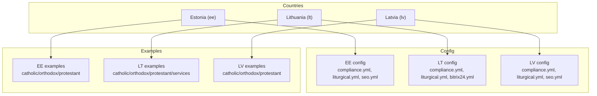
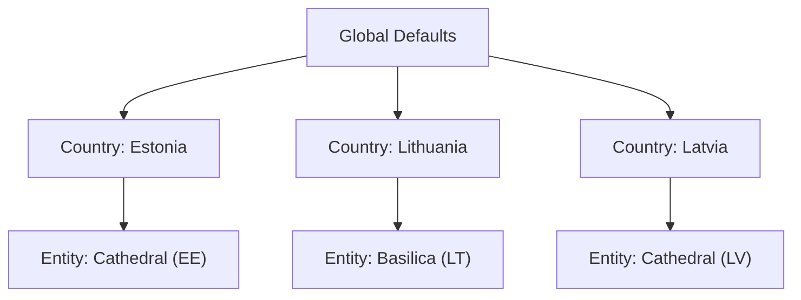
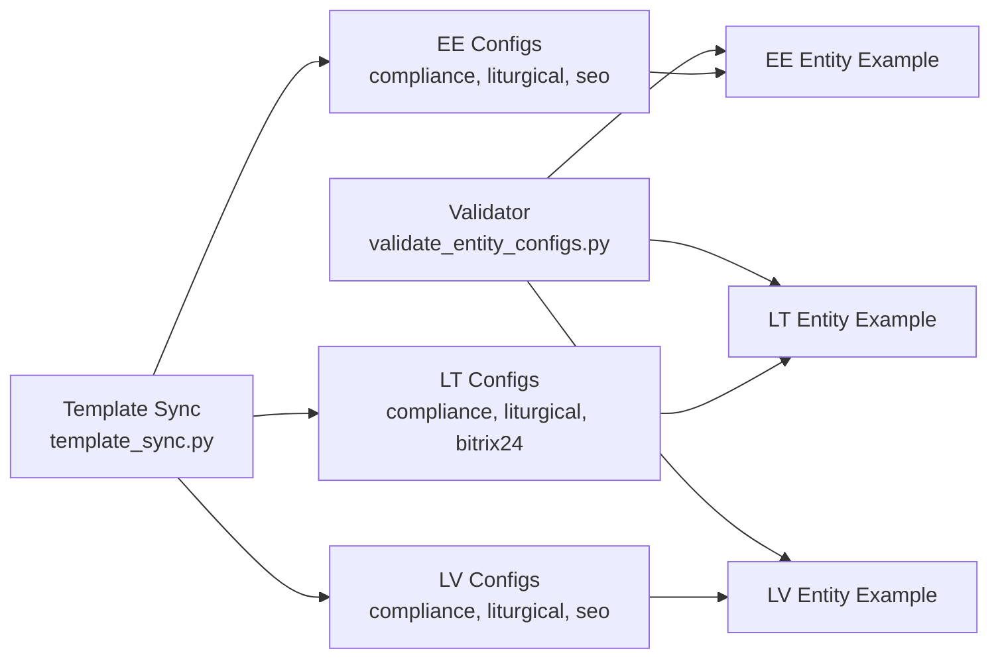
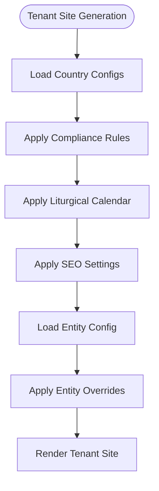

# Country-Specific Configurations

<cite>
**Referenced Files in This Document**
- [countries/ee/config/compliance.yml](file://countries/ee/config/compliance.yml)
- [countries/ee/config/liturgical.yml](file://countries/ee/config/liturgical.yml)
- [countries/ee/config/seo.yml](file://countries/ee/config/seo.yml)
- [countries/lt/config/compliance.yml](file://countries/lt/config/compliance.yml)
- [countries/lt/config/liturgical.yml](file://countries/lt/config/liturgical.yml)
- [countries/lt/config/bitrix24.yml](file://countries/lt/config/bitrix24.yml)
- [countries/lv/config/compliance.yml](file://countries/lv/config/compliance.yml)
- [countries/lv/config/liturgical.yml](file://countries/lv/config/liturgical.yml)
- [countries/lv/config/seo.yml](file://countries/lv/config/seo.yml)
- [countries/ee/examples/catholic/cathedral/tallinn-st-peter-paul/entity.yml](file://countries/ee/examples/catholic/cathedral/tallinn-st-peter-paul/entity.yml)
- [countries/lt/examples/catholic/basilica/vilnius-cathedral-basilica/entity.yml](file://countries/lt/examples/catholic/basilica/vilnius-cathedral-basilica/entity.yml)
- [countries/lv/examples/catholic/cathedral/riga-st-james/entity.yml](file://countries/lv/examples/catholic/cathedral/riga-st-james/entity.yml)
- [data/src/pipelines/country_sync/template_sync.py](file://data/src/pipelines/country_sync/template_sync.py)
- [scripts/validate_entity_configs.py](file://scripts/validate_entity_configs.py)
</cite>

## Table of Contents
1. [Introduction](#introduction)
2. [Project Structure](#project-structure)
3. [Core Components](#core-components)
4. [Architecture Overview](#architecture-overview)
5. [Detailed Component Analysis](#detailed-component-analysis)
6. [Dependency Analysis](#dependency-analysis)
7. [Performance Considerations](#performance-considerations)
8. [Troubleshooting Guide](#troubleshooting-guide)
9. [Conclusion](#conclusion)
10. [Appendices](#appendices)

## Introduction
This document explains how JOL-HUB models country-specific configurations and how they influence tenant website generation, legal entity behavior, compliance posture, localization, liturgical calendars, SEO, and integrations. It focuses on the Baltic countries (Estonia, Lithuania, Latvia) as implemented in the repository and provides a practical guide for adding or updating countries, including examples across Catholic, Orthodox, and Protestant denominations and service types such as parishes, cathedrals, funeral services, and cemetery services.

## Project Structure
Country configurations are organized under a per-country directory with:
- config/: global settings for that country (compliance, liturgical calendar, SEO, CRM integrations)
- examples/: representative entity configurations by denomination and service type
- templates/: optional site templates per denomination/service type (Lithuania includes these)

**Diagram sources**
- [countries/ee/config/compliance.yml:1-241](file://countries/ee/config/compliance.yml#L1-L241)
- [countries/ee/config/liturgical.yml:1-178](file://countries/ee/config/liturgical.yml#L1-L178)
- [countries/ee/config/seo.yml:1-39](file://countries/ee/config/seo.yml#L1-L39)
- [countries/lt/config/compliance.yml:1-201](file://countries/lt/config/compliance.yml#L1-L201)
- [countries/lt/config/liturgical.yml:1-184](file://countries/lt/config/liturgical.yml#L1-L184)
- [countries/lt/config/bitrix24.yml:1-354](file://countries/lt/config/bitrix24.yml#L1-L354)
- [countries/lv/config/compliance.yml:1-218](file://countries/lv/config/compliance.yml#L1-L218)
- [countries/lv/config/liturgical.yml:1-161](file://countries/lv/config/liturgical.yml#L1-L161)
- [countries/lv/config/seo.yml:1-39](file://countries/lv/config/seo.yml#L1-L39)

**Section sources**
- [countries/ee/config/compliance.yml:1-241](file://countries/ee/config/compliance.yml#L1-L241)
- [countries/lt/config/compliance.yml:1-201](file://countries/lt/config/compliance.yml#L1-L201)
- [countries/lv/config/compliance.yml:1-218](file://countries/lv/config/compliance.yml#L1-L218)
- [countries/ee/config/liturgical.yml:1-178](file://countries/ee/config/liturgical.yml#L1-L178)
- [countries/lt/config/liturgical.yml:1-184](file://countries/lt/config/liturgical.yml#L1-L184)
- [countries/lv/config/liturgical.yml:1-161](file://countries/lv/config/liturgical.yml#L1-L161)
- [countries/ee/config/seo.yml:1-39](file://countries/ee/config/seo.yml#L1-L39)
- [countries/lv/config/seo.yml:1-39](file://countries/lv/config/seo.yml#L1-L39)
- [countries/lt/config/bitrix24.yml:1-354](file://countries/lt/config/bitrix24.yml#L1-L354)

## Core Components
- Compliance configuration: Defines data protection authority, lawful basis, special categories handling, retention periods, breach notification, children’s consent age, canonical records exceptions, and permitted/restricted data transfer destinations.
- Liturgical calendar: Defines rite, seasons, local feasts, holy days of obligation, dioceses, basilicas, and denominational calendars (Catholic, Orthodox, Lutheran).
- SEO configuration: Defines domain, default locale, hreflang alternates, x-default, IndexNow, sitemap rules, and robots directives.
- Entity configuration: Per-entity YAMLs define identity, canonical metadata, hierarchy, contact info, languages, domains, features, schedules, sacraments, compliance flags, and integrations.
- Integration configuration: Country-level CRM integration settings (e.g., Bitrix24) with module enablement per entity type, custom fields, webhooks, GDPR controls, localization, email templates, and security policies.
- Synchronization pipeline template: A reusable template to implement country sync pipelines with GDPR-aware defaults and audit logging.

How these affect tenants:
- Website generation: Locale, timezone, supported languages, and SEO alternates drive page rendering and internationalization.
- Legal entity behavior: Compliance settings enforce data retention, consent thresholds, erasure exceptions, and breach reporting timelines.
- Tax calculations: While not explicitly modeled here, retention_periods for financial/donation records align with national tax requirements; payment method lists can be extended per country via entity configs.
- Cultural adaptations: Local feast days, holy days, and denominational calendars shape event scheduling and content visibility.

**Section sources**
- [countries/ee/config/compliance.yml:1-241](file://countries/ee/config/compliance.yml#L1-L241)
- [countries/lt/config/compliance.yml:1-201](file://countries/lt/config/compliance.yml#L1-L201)
- [countries/lv/config/compliance.yml:1-218](file://countries/lv/config/compliance.yml#L1-L218)
- [countries/ee/config/liturgical.yml:1-178](file://countries/ee/config/liturgical.yml#L1-L178)
- [countries/lt/config/liturgical.yml:1-184](file://countries/lt/config/liturgical.yml#L1-L184)
- [countries/lv/config/liturgical.yml:1-161](file://countries/lv/config/liturgical.yml#L1-L161)
- [countries/ee/config/seo.yml:1-39](file://countries/ee/config/seo.yml#L1-L39)
- [countries/lv/config/seo.yml:1-39](file://countries/lv/config/seo.yml#L1-L39)
- [countries/lt/config/bitrix24.yml:1-354](file://countries/lt/config/bitrix24.yml#L1-L354)
- [countries/ee/examples/catholic/cathedral/tallinn-st-peter-paul/entity.yml:1-99](file://countries/ee/examples/catholic/cathedral/tallinn-st-peter-paul/entity.yml#L1-L99)
- [countries/lt/examples/catholic/basilica/vilnius-cathedral-basilica/entity.yml:1-114](file://countries/lt/examples/catholic/basilica/vilnius-cathedral-basilica/entity.yml#L1-L114)
- [countries/lv/examples/catholic/cathedral/riga-st-james/entity.yml:1-100](file://countries/lv/examples/catholic/cathedral/riga-st-james/entity.yml#L1-L100)
- [data/src/pipelines/country_sync/template_sync.py:1-163](file://data/src/pipelines/country_sync/template_sync.py#L1-L163)

## Architecture Overview
The configuration system follows a layered approach:
- Global defaults: Not shown in this snapshot; assume baseline platform defaults exist.
- Country overrides: Each country defines its own compliance, liturgical, SEO, and integration settings.
- Entity overrides: Individual entities refine features, schedules, domains, and integrations.

[No diagram sources needed since this diagram shows conceptual architecture]

## Detailed Component Analysis

### Compliance Configuration
Purpose:
- Establishes lawful bases for processing religious and health-related data.
- Sets retention periods aligned with Canon Law and national tax laws.
- Defines data subject rights, breach notification timelines, and children’s consent ages.
- Lists restricted and permitted data transfer destinations.

Key elements observed:
- Data Protection Authority details and contacts.
- Special categories handling for religious and health data.
- Canonical records exception for erasure requests.
- Retention periods for sacramental, parishioner, donation, financial, funeral, and cemetery records.
- Consent text templates and cookie consent parameters.

Impact on tenants:
- Enforces region-specific privacy notices and consent banners.
- Controls whether certain features (e.g., donations, marketing) can process personal data.
- Drives audit and retention behaviors in downstream systems.

**Section sources**
- [countries/ee/config/compliance.yml:1-241](file://countries/ee/config/compliance.yml#L1-L241)
- [countries/lt/config/compliance.yml:1-201](file://countries/lt/config/compliance.yml#L1-L201)
- [countries/lv/config/compliance.yml:1-218](file://countries/lv/config/compliance.yml#L1-L218)

### Liturgical Calendar Configuration
Purpose:
- Provides rite, province, seasons, local feasts, holy days of obligation, and diocesan structures.
- Supports multiple denominations within a country (Catholic, Orthodox, Lutheran).

Key elements observed:
- Rite and province definitions.
- Local feast days with names in local language and English.
- Holy days of obligation lists.
- Dioceses and basilicas listings.
- Denominational calendars (Julian vs Gregorian) and major feasts.

Impact on tenants:
- Determines mass schedules, event highlights, and content themes.
- Influences which dates are treated as holidays or solemnities in tenant sites.

**Section sources**
- [countries/ee/config/liturgical.yml:1-178](file://countries/ee/config/liturgical.yml#L1-L178)
- [countries/lt/config/liturgical.yml:1-184](file://countries/lt/config/liturgical.yml#L1-L184)
- [countries/lv/config/liturgical.yml:1-161](file://countries/lv/config/liturgical.yml#L1-L161)

### SEO Configuration
Purpose:
- Governs domain, default locale, hreflang alternates, x-default, IndexNow, sitemap rules, and robots directives.

Key elements observed:
- Country code, domain, and default locale.
- Alternates for multiple locales with labels.
- IndexNow key location reference.
- Sitemap enabled with per-tenant support and URL limits.
- Robots noindex and disallow patterns for development safety.

Impact on tenants:
- Ensures correct international SEO signals per country.
- Controls indexing behavior until go-live authorization.

**Section sources**
- [countries/ee/config/seo.yml:1-39](file://countries/ee/config/seo.yml#L1-L39)
- [countries/lv/config/seo.yml:1-39](file://countries/lv/config/seo.yml#L1-L39)

### Entity Configuration
Purpose:
- Defines an individual organization or service instance with canonical metadata, hierarchy, contact info, languages, domains, features, schedules, sacraments, compliance flags, and integrations.

Key elements observed:
- Identity, type, name, and country scoping.
- Canonical jurisdiction and status.
- Hierarchy linking to parent diocese/deanery.
- Languages and domain configuration with aliases.
- Feature toggles (mass schedules, sacraments, donations, events, tours, concerts).
- Mass schedule and confession times.
- Sacrament availability flags.
- Compliance flags referencing DPA and canonical law.
- Integrations (Bitrix24 portal, sync flags).

Impact on tenants:
- Drives per-entity website generation, feature exposure, and CRM synchronization.
- Aligns entity behavior with country compliance and liturgical calendars.

**Section sources**
- [countries/ee/examples/catholic/cathedral/tallinn-st-peter-paul/entity.yml:1-99](file://countries/ee/examples/catholic/cathedral/tallinn-st-peter-paul/entity.yml#L1-L99)
- [countries/lt/examples/catholic/basilica/vilnius-cathedral-basilica/entity.yml:1-114](file://countries/lt/examples/catholic/basilica/vilnius-cathedral-basilica/entity.yml#L1-L114)
- [countries/lv/examples/catholic/cathedral/riga-st-james/entity.yml:1-100](file://countries/lv/examples/catholic/cathedral/riga-st-james/entity.yml#L1-L100)

### Integration Configuration (Bitrix24)
Purpose:
- Configures CRM modules, custom fields, webhooks, rate limits, synchronization direction/frequency, GDPR controls, localization, email templates, and security policies per entity type.

Key elements observed:
- Portal domains and regions with data residency notes.
- Module enablement per entity type (basilica, cathedral, diocese, deanery, church, protestant, orthodox, other-christian, funeral_home, cemetery_service).
- Custom fields tailored to entity needs (e.g., sacramental records, donation types, deceased details, plot numbers).
- Webhook authentication and retry policy.
- Sync direction, frequency, conflict resolution, and soft delete retention.
- GDPR consent tracking, right to erasure with canonical exception, export formats, and audit log retention.
- Localization defaults and supported languages.
- Email templates and security policies.

Impact on tenants:
- Enables CRM workflows specific to religious organizations and funeral services.
- Ensures data residency and GDPR alignment at the integration layer.

**Section sources**
- [countries/lt/config/bitrix24.yml:1-354](file://countries/lt/config/bitrix24.yml#L1-L354)

### Synchronization Pipeline Template
Purpose:
- Provides a standardized structure to implement country-specific data synchronization with GDPR safeguards and audit logging.

Key elements observed:
- CountrySyncConfig with required fields (country_code, timezone, language, currency), batch size, timeouts, retries.
- GDPR classification, legal basis, and retention days.
- Methods for syncing entities, donations (anonymized), and events.
- Audit logging around start/complete and GDPR requests (access, erasure).

Impact on tenants:
- Ensures consistent, auditable, and compliant data ingestion per country.

**Section sources**
- [data/src/pipelines/country_sync/template_sync.py:1-163](file://data/src/pipelines/country_sync/template_sync.py#L1-L163)

## Dependency Analysis

**Diagram sources**
- [scripts/validate_entity_configs.py:1-59](file://scripts/validate_entity_configs.py#L1-L59)
- [data/src/pipelines/country_sync/template_sync.py:1-163](file://data/src/pipelines/country_sync/template_sync.py#L1-L163)
- [countries/ee/config/compliance.yml:1-241](file://countries/ee/config/compliance.yml#L1-L241)
- [countries/lt/config/compliance.yml:1-201](file://countries/lt/config/compliance.yml#L1-L201)
- [countries/lv/config/compliance.yml:1-218](file://countries/lv/config/compliance.yml#L1-L218)
- [countries/ee/config/liturgical.yml:1-178](file://countries/ee/config/liturgical.yml#L1-L178)
- [countries/lt/config/liturgical.yml:1-184](file://countries/lt/config/liturgical.yml#L1-L184)
- [countries/lv/config/liturgical.yml:1-161](file://countries/lv/config/liturgical.yml#L1-L161)
- [countries/ee/config/seo.yml:1-39](file://countries/ee/config/seo.yml#L1-L39)
- [countries/lv/config/seo.yml:1-39](file://countries/lv/config/seo.yml#L1-L39)
- [countries/lt/config/bitrix24.yml:1-354](file://countries/lt/config/bitrix24.yml#L1-L354)
- [countries/ee/examples/catholic/cathedral/tallinn-st-peter-paul/entity.yml:1-99](file://countries/ee/examples/catholic/cathedral/tallinn-st-peter-paul/entity.yml#L1-L99)
- [countries/lt/examples/catholic/basilica/vilnius-cathedral-basilica/entity.yml:1-114](file://countries/lt/examples/catholic/basilica/vilnius-cathedral-basilica/entity.yml#L1-L114)
- [countries/lv/examples/catholic/cathedral/riga-st-james/entity.yml:1-100](file://countries/lv/examples/catholic/cathedral/riga-st-james/entity.yml#L1-L100)

**Section sources**
- [scripts/validate_entity_configs.py:1-59](file://scripts/validate_entity_configs.py#L1-L59)
- [data/src/pipelines/country_sync/template_sync.py:1-163](file://data/src/pipelines/country_sync/template_sync.py#L1-L163)

## Performance Considerations
- Keep liturgical calendars concise and indexed by date to minimize lookup overhead during site generation.
- Use per-tenant sitemaps with reasonable URL limits to avoid large single-file payloads.
- Configure CRM sync frequencies and batch sizes based on entity scale and API rate limits.
- Avoid unnecessary feature toggles per entity to reduce rendering complexity.

[No sources needed since this section provides general guidance]

## Troubleshooting Guide
Common issues and checks:
- Missing or invalid entity fields: Use the validator to ensure required fields are present and properly formatted.
- GDPR non-compliance: Verify compliance flags, retention periods, and canonical exceptions match country settings.
- SEO misconfiguration: Confirm hreflang alternates and x-default align with country locales; ensure robots directives are appropriate for environment.
- Integration failures: Check Bitrix24 webhook authentication, rate limits, and sync direction; confirm portal domains and regions.

Validation tooling:
- Entity configuration validator enforces required fields and compliance checks.

**Section sources**
- [scripts/validate_entity_configs.py:1-59](file://scripts/validate_entity_configs.py#L1-L59)
- [countries/ee/config/seo.yml:1-39](file://countries/ee/config/seo.yml#L1-L39)
- [countries/lv/config/seo.yml:1-39](file://countries/lv/config/seo.yml#L1-L39)
- [countries/lt/config/bitrix24.yml:1-354](file://countries/lt/config/bitrix24.yml#L1-L354)

## Conclusion
JOL-HUB’s country-specific configuration model enables precise control over compliance, liturgical calendars, SEO, and integrations while allowing per-entity customization. By following the established structure and using the provided templates and validators, teams can reliably add new countries or update existing ones, ensuring legal, cultural, and technical alignment across all tenant websites.

[No sources needed since this section summarizes without analyzing specific files]

## Appendices

### Configuration Hierarchy and Overrides
- Global defaults (platform-wide)
- Country overrides (compliance, liturgical, SEO, integrations)
- Entity overrides (features, schedules, domains, integrations)

[No diagram sources needed since this diagram shows conceptual workflow]

### Adding a New Country: Step-by-Step
1. Create country directory with config files:
   - compliance.yml (DPA, lawful basis, retention, breach notifications)
   - liturgical.yml (rite, seasons, local feasts, holy days, dioceses)
   - seo.yml (domain, locales, alternates, robots)
   - Optional integration config (e.g., bitrix24.yml)
2. Add example entities for each denomination/service type.
3. Implement a country sync pipeline based on the template.
4. Validate entity configurations using the validator script.
5. Update any shared references (e.g., PROCESSING_ACTIVITIES) if applicable.

**Section sources**
- [data/src/pipelines/country_sync/template_sync.py:1-163](file://data/src/pipelines/country_sync/template_sync.py#L1-L163)
- [scripts/validate_entity_configs.py:1-59](file://scripts/validate_entity_configs.py#L1-L59)

### Examples Across Denominations and Services
- Catholic:
  - Cathedral: See Estonia and Latvia examples for canonical metadata, hierarchy, languages, and features.
  - Basilica: See Lithuania example for online store, payment methods, and mass schedules.
- Orthodox:
  - Cathedral: See Estonia and Latvia examples for Julian calendar considerations and jurisdiction.
- Protestant (Lutheran):
  - Church: See examples for western liturgical year and major feasts.
- Services:
  - Funeral homes and cemetery services: See Lithuania examples for CRM modules, deal stages, and custom fields tailored to end-of-life services.

**Section sources**
- [countries/ee/examples/catholic/cathedral/tallinn-st-peter-paul/entity.yml:1-99](file://countries/ee/examples/catholic/cathedral/tallinn-st-peter-paul/entity.yml#L1-L99)
- [countries/lv/examples/catholic/cathedral/riga-st-james/entity.yml:1-100](file://countries/lv/examples/catholic/cathedral/riga-st-james/entity.yml#L1-L100)
- [countries/lt/examples/catholic/basilica/vilnius-cathedral-basilica/entity.yml:1-114](file://countries/lt/examples/catholic/basilica/vilnius-cathedral-basilica/entity.yml#L1-L114)
- [countries/lt/config/bitrix24.yml:1-354](file://countries/lt/config/bitrix24.yml#L1-L354)

### Validation Rules Summary
- Required entity fields include identifiers, names, type, country, address components, and contact email.
- Validator supports multiple entity types across denominations and services.
- Ensure compliance flags and canonical hierarchy are set appropriately for Catholic entities.

**Section sources**
- [scripts/validate_entity_configs.py:1-59](file://scripts/validate_entity_configs.py#L1-L59)